# Chapter 11 Complex numbers

<!-- Pure Mathematics 2 and 3 Cambridge International AS and A Level Mathematics (Sophie Goldie, Roger Porkess) .pdf p280-349 -->

<!-- page 280 -->

## 11 

# Complex numbers

... that wonder of analysis, that portent of the ideal world, that amphibian between being and not-being, which we call the imaginary root of negative unity.

Leibniz, 1702

## The growth of the number system

The number system we use today has taken thousands of years to develop. In primitive societies all that are needed are the counting numbers, 1, 2, 3, … (or even just the first few of these).

The concept of a fraction was first recorded in a systematic way in an Egyptian papyrus of about 1650 BC. By 500 BC the Greeks had developed ways of calculating with whole numbers and their ratios (which accounts for calling fractions rational numbers). The followers of Pythagoras believed that everything in geometry and in applications of mathematics could be explained in terms of rational numbers.

It came as a great shock, therefore, when one of them proved that  $ \sqrt{2} $ was not a rational number. However, Greek thinkers gradually came to terms with the existence of such irrational numbers, and by 370 BC Eudoxus had devised a very careful theory of proportion which included both rational and irrational numbers.

It took about another thousand years for the next major development, when the Hindu mathematician Brahmagupta (in about AD 630) described negative numbers and gave the rules for dealing with negative signs. Surprisingly, the first use of a symbol for zero came even later, in AD 876. This was the final element needed to complete the set of real numbers, consisting of positive and negative rational and irrational numbers and zero.

Figure 11.1 (overleaf) shows the relationships between the different types of numbers.

<!-- page 281 -->

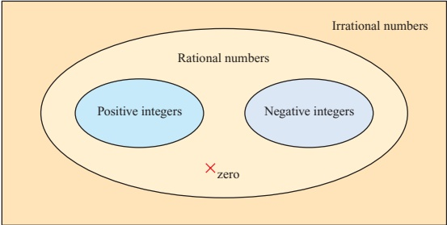

Figure 11.1

ACTIVITY 11.1 Copy figure 11.1 and write the following numbers in the correct positions.

 $$ 3 絶 \quad\pi 絶 \quad\frac{355}{113} 絶 -1 絶 -1.4142 絶 -\sqrt{2} $$ 

Draw also a real number line and mark the same numbers on it.

The number system expanded in this way because people wanted to increase the range of problems they could tackle. This can be illustrated in terms of the sorts of equation that can be solved at each stage, although of course the standard algebraic way of writing these is relatively modern.

ACTIVITY 11.2 For each of these equations, make up a simple problem that would lead to the equation and say what sort of number is needed to solve the equation.

(i)

 $$ x+7=10 $$ 

 $$ x^{2}=10 $$ 

(v)

(ii) 7x = 10

(iv)  $ x + 10 = 7 $

(vi)  $ x^{2} + 10 = 0 $

 $$ x^{2}+7x=0 $$ 

You will have hit a snag with equation (vi). Since the square of every real number is positive or zero, there is no real number with a square of -10. This is a simple example of a quadratic equation with no real roots. The existence of such equations was recognised and accepted for hundreds of years, just as the Greeks had accepted that  $ x + 10 = 7 $ had no solution.

Then two 16th century Italians, Tartaglia and Cardano, found methods of solving cubic and quartic (fourth degree) equations which forced mathematicians to take seriously the square roots of negative numbers. This required a further extension of the number system, to produce what are called complex numbers.

Complex numbers were regarded with great suspicion for many years. Descartes called them ‘imaginary’, Newton called them ‘impossible’, and Leibniz’s mystification has already been quoted. But complex numbers turned out to be very useful, and had become accepted as an essential tool by the time Gauss first gave them a firm logical basis in 1831.

<!-- page 282 -->

## Working with complex numbers

Faced with the problem of wanting the square root of a negative number, we make the following Bold Hypothesis.

The real number system can be extended by including a new number, denoted by i, which combines with itself and the real numbers according to the usual laws of algebra, but which has the additional property that  $ i^{2} = -1 $.

The original notation for i was t, the Greek letter iota. The letter j is also commonly used instead of i.

The first thing to note is that we do not need further symbols for other square roots. For example, since  $ -196 = 196 \times (-1) = 14^2 \times i^2 $, we see that  $ -196 $ has two square roots,  $ \pm 14i $. The following example uses this idea to solve a quadratic equation with no real roots.

### EXAMPLE 11.1

Solve the equation  $ z^{2}-6z+58=0 $, and check the roots.

(We use the letter z for the variable here because we want to keep x and y to stand for real numbers.)

## SOLUTION

Using the quadratic formula:

 $$ \begin{aligned}z&=\frac{6\pm\sqrt{6^{2}-4\times58}}{2}\\&=\frac{6\pm\sqrt{-196}}{2}\\&=\frac{6\pm14\mathrm{i}}{2}\\&=3\pm7\mathrm{i}\end{aligned} $$ 

To check:

 $$ \begin{align*}z=3+7\mathrm{i}&\Rightarrow z^2-6z+58=(3+7\mathrm{i})^2-6(3+7\mathrm{i})+58\\&=9+42\mathrm{i}+49\mathrm{i}^2-18-42\mathrm{i}+58\\&=9+42\mathrm{i}-49-18-42\mathrm{i}+58\\&=0\end{align*}\begin{align*}\mathrm{i}^2&=-1\\&=0\end{align*} $$ 

### | ACTIVITY 11.3 Check the other root, z=3-7i

A number z of the form  $ x + iy $, where x and y are real, is called a complex number. x is called the real part of the complex number, denoted by  $ \mathrm{Re}(z) $, and y is called the imaginary part, denoted by  $ \mathrm{Im}(z) $. So if, for example,  $ z = 3 - 7i $ then  $ \mathrm{Re}(z) = 3 $ and  $ \mathrm{Im}(z) = -7 $. Notice in particular that the imaginary part is real!

<!-- page 283 -->

In Example 11.1 you did some simple calculations with complex numbers. The general methods for addition, subtraction and multiplication are similarly straightforward.

Addition: add the real parts and add the imaginary parts.

 $$ (x+\mathrm{i}y)+(u+\mathrm{i}\nu)=(x+u)+\mathrm{i}(y+\nu) $$ 

Subtraction: subtract the real parts and subtract the imaginary parts.

 $$ (x+\mathrm{i}y)-(u+\mathrm{i}\nu)=(x-u)+\mathrm{i}(y-\nu) $$ 

Multiplication: multiply out the brackets in the usual way and simplify, remembering that  $ i^{2} = -1 $.

 $$ \begin{aligned}(x+\mathrm{i}y)(u+\mathrm{i}\nu)&=xu+\mathrm{i}xv+\mathrm{i}yu+\mathrm{i}^{2}yv\\&=(xu-yv)+\mathrm{i}(xv+yu)\end{aligned} $$ 

Division of complex numbers is dealt with later in the chapter.

## What are the values of  $ i^{3} $,  $ i^{4} $,  $ i^{5} $?

Explain how you would work out the value of  $ i^{n} $ for any positive integer value of n.

## Complex conjugates

The complex number  $ x-iy $ is called the complex conjugate, or just the conjugate, of  $ x+iy $. Similarly  $ x+iy $ is the complex conjugate of  $ x-iy $.  $ x+iy $ and  $ x-iy $ are a conjugate pair. The complex conjugate of z is denoted by  $ z^{*} $. If a polynomial equation, such as a quadratic, has real coefficients, then any complex roots will be conjugate pairs. This is the case in Example 11.1. If, however, the coefficients are not all real, this is no longer the case.

You can solve quadratic equations with complex coefficients in the same way as an ordinary quadratic, either by completing the square or by using the quadratic formula. This is shown in the next example.

<!-- page 284 -->

Solve  $ z^{2} - 4iz - 13 = 0 $.

## SOLUTION

Substitute $a=1$, $b=-4i$ and $c=-13$ into the quadratic formula.

 $$ \begin{aligned}z&=\frac{-b\pm\sqrt{b^{2}-4ac}}{2a}\\&=\frac{4\mathrm{i}\pm\sqrt{(-4\mathrm{i})^{2}-4\times1\times(-13)}}{2}\\&=\frac{4\mathrm{i}\pm\sqrt{-16+52}}{2}\\&=\frac{4\mathrm{i}\pm\sqrt{36}}{2}\\&=\frac{4\mathrm{i}\pm6}{2}\\&=2\mathrm{i}\pm3\end{aligned} $$ 

So the roots are  $ 3 + 2i $ and  $ -3 + 2i $.

### ACTIVITY 11.4

(i) Let  $ z = 3 + 5i $ and  $ w = 1 - 2i $.

Find the following.

(a)  $ z + z^{*} $ (b)  $ w + w^{*} $ (c)  $ zz^{*} $ (d)  $ ww^{*} $

What do you notice about your answers?

(ii) Let  $ z = x + iy $.

Show that  $ z + z^* $ and  $ zz^* $ are real for any values of x and y.

## EXERCISE 11A

1 Express the following in the form  $ x + iy $.

(i)  $ (8+6i)+(6+4i) $

(ii)  $ (9 - 3\mathrm{i}) + (-4 + 5\mathrm{i}) $

(iii)  $ (2+7\mathrm{i})-(5+3\mathrm{i}) $

(iv)  $ (5 - \mathrm{i}) - (6 - 2\mathrm{i}) $

(v)  $ 3(4 + 6\mathrm{i}) + 9(1 - 2\mathrm{i}) $

(vi)  $ 3i(7-4i) $

(vii)  $ (9+2i)(1+3i) $

(viii) (4-i)(3+2i)

(ix)

 $$ (7+3\mathrm{i})^{2} $$ 

(x)  $ (8+6i)(8-6i) $

(xi)  $ (1+2\mathrm{i})(3-4\mathrm{i})(5+6\mathrm{i}) $

(xii)  $ (3+2i)^{3} $

2 Solve each of the following equations, and check the roots in each case.

(i)

 $$ z^{2}+2z+2=0 $$ 

(ii)

 $$ z^{2}-2z+5=0 $$ 

(iii)

 $$ z^{2}-4z+13=0 $$ 

(iv)

 $$ z^{2}+6z+34=0 $$ 

(v)

 $$ 4z^{2}-4z+17=0 $$ 

(vi)

 $$ z^{2}+4z+6=0 $$ 

3 Solve each of the following equations.

(i)

 $$ z^{2}-4\mathrm{i}z-4=0 $$ 

(ii)

 $$ z^{2}-2\mathrm{i}z+15=0 $$ 

(iii)  $ z^2 - 2iz - 2 = 0 $

(iv)

 $$ z^{2}+6\mathrm{i}z-13=0 $$ 

(v)

 $$ z^{2}+8\mathrm{i}z-17=0 $$ 

(vi)

 $$ z^{2}+\mathrm{i}z+6=0 $$

<!-- page 285 -->

4 Given that  $ z = 2 + 3i $ and  $ w = 6 - 4i $, find the following.

(i) Re(z)

(ii)  $ \mathrm{Im}(w) $

(iii)  $ z^{*} $

(iv)  $ w^{*} $

(v)  $ z^{*} + w^{*} $

(vi)  $ z^{*} - w^{*} $

(vii)  $ \mathrm{Im}(z + z^\star) $

(viii) Re $ w - w^{*} $

(ix)  $ zz^{*} - ww^{*} $

(x)  $  (z^{3})^{\star}  $

(xi)  $ (z^{*})^{3} $

(xii)  $ zw^{*} - z^{*}w $

5 Let  $ z = x + iy $.

Show that  $ (z^{*})^{*}=z $.

6 Let  $ z_{1}=x_{1}+\mathrm{i}y_{1} $ and  $ z_{2}=x_{2}+\mathrm{i}y_{2} $. Show that  $ (z_{1}+z_{2})^{*}=z_{1}^{*}+z_{2}^{*} $.

## Division of complex numbers

Before tackling the slightly complicated problem of dividing by a complex number, you need to know what is meant by equality of complex numbers.

Two complex numbers  $ z = x + iy $ and  $ w = u + iv $ are equal if both  $ x = u $ and  $ y = v $. If  $ u \neq x $ or  $ v \neq y $, or both, then z and w are not equal.

You may feel that this is making a fuss about something which is obvious. However, think about the similar question of the equality of rational numbers. The rational numbers  $ \frac{x}{y} $ and  $ \frac{u}{v} $ are equal if  $ x = u $ and  $ y = v $.

## ? Is it possible for the rational numbers  $ \frac{x}{y} $ and  $ \frac{u}{v} $ to be equal if  $ u \neq x $ and  $ v \neq y $?

So for two complex numbers to be equal, the real parts must be equal and the imaginary parts must be equal. When we use this result we say that we are equating real and imaginary parts.

Equating real and imaginary parts is a very useful method which often yields 'two for the price of one' when working with complex numbers. The following example illustrates this.

### EXAMPLE 11.3

Find real numbers $p$ and $q$ such that $p + q\mathrm{i} = \frac{1}{3 + 5\mathrm{i}}$.

## SOLUTION

You need to find real numbers p and q such that

 $$ (p+\mathrm{i}q)(3+5\mathrm{i})=1. $$ 

Expanding gives

 $$ 3p-5q+\mathrm{i}(5p+3q)=1. $$

<!-- page 286 -->

Equating real and imaginary parts gives

Real:

 $$ 3p-5q=1 $$ 

Imaginary:  $ 5p + 3q = 0 $

These simultaneous equations give  $ p = \frac{3}{34} $,  $ q = -\frac{5}{34} $ and so

 $$ \frac{1}{3+5\mathrm{i}}=\frac{3}{34}-\frac{5}{34}\mathrm{i} $$ 

### ACTIVITY 11.5

By writing  $ \frac{1}{x + iy} = p + iq $, show that  $ \frac{1}{x + iy} = \frac{x - iy}{x^2 + y^2} $.

This result shows that there is an easier way to find the reciprocal of a complex number. First, notice that

 $$ \begin{aligned}(x+\mathrm{i}y)(x-\mathrm{i}y)&=x^{2}-\mathrm{i}^{2}y^{2}\\&=x^{2}+y^{2}\end{aligned} $$ 

which is real.

So to find the reciprocal of a complex number you multiply numerator and denominator by the complex conjugate of the denominator.

### EXAMPLE 11.4

Find the real and imaginary parts of  $ \frac{1}{5+2i} $.

## SOLUTION

Multiply numerator and denominator by 5 - 2i.

 $$ \begin{aligned}\frac{1}{5+2\mathrm{i}}&=\frac{5-2\mathrm{i}}{(5+2\mathrm{i})(5-2\mathrm{i})}\\&=\frac{5-2\mathrm{i}}{25+4}\\&=\frac{5-2\mathrm{i}}{29}\end{aligned} $$ 

so the real part is  $ \frac{5}{29} $ and the imaginary part is  $ -\frac{2}{29} $.

Note

You may have noticed that this process is very similar to the process of rationalising a denominator. To make the denominator of  $ \frac{1}{3 + \sqrt{2}} $ rational you have to multiply the numerator and denominator by  $ 3 - \sqrt{2} $.

Similarly, division of complex numbers is carried out by multiplying both numerator and denominator by the conjugate of the denominator, as in the next example.

<!-- page 287 -->

Express  $ \frac{9-4i}{2+3i} $ as a complex number in the form  $ x+iy $.

## SOLUTION

 $$ \begin{aligned}\frac{9-4\mathrm{i}}{2+3\mathrm{i}}&=\frac{9-4\mathrm{i}}{2+3\mathrm{i}}\times\frac{2-3\mathrm{i}}{2-3\mathrm{i}}\\&=\frac{18-27\mathrm{i}-8\mathrm{i}+12\mathrm{i}^{2}}{2^{2}+3^{2}}\\&=\frac{6-35\mathrm{i}}{13}\\&=\frac{6}{13}-\frac{35}{13}\mathrm{i}\end{aligned} $$ 

## The square root of a complex number

The next example shows you how to find the square root of a complex number.

### EXAMPLE 11.6

Find the two square roots of  $ 8 + 6i $.

## SOLUTION

 $$ \begin{array}{l}Let\quad(x+\mathrm{i}y)^{2}=8+6\mathrm{i}\\\Rightarrow\quad\quad\quad x^{2}+2\mathrm{i}xy-y^{2}=8+6\mathrm{i}\end{array}\begin{array}{l}\text{+i^{2}y^{2}=-y^{2}}\\ \end{array} $$ 

Equating the real and imaginary parts gives:

Real:

 $$ x^{2}-y^{2}=8 $$ 

Imaginary:

 $$ 2xy=6 $$ 

Rearranging ② gives

 $$ y=\frac{3}{x} $$ 

Substituting ③ into ① gives

 $$ x^{2}-\frac{9}{x^{2}}=8 $$ 

 $$ x^{4}-9=8x^{2} $$ 

 $$ x^{4}-8x^{2}-9=0 $$ 

This is a quadratic in  $ x^{2} $.

 $$ (x^{2}-9)(x^{2}+1)=0 $$ 

 $ \Rightarrow x^2 = -1 $ which has no real roots

or  $ x^{2}=9 \Rightarrow x=\pm3 $.

Remember that x and y are both real numbers.

When x=3, y=1

When x = -3, y = -1

So the square roots of  $ 8 + 6i $ are 3 + i and -3 - i.

<!-- page 288 -->

## ? What are the values of  $ \frac{1}{i}, \frac{1}{i^{2}} $ and  $ \frac{1}{i^{3}} $?

Explain how you would work out the value of  $ \frac{1}{i^n} $ for any positive integer value of n.

## The collapse of a Bold Hypothesis

You have just avoided a mathematical inconvenience (that -1 has no real square root) by introducing a new mathematical object, i, which has the property that you want: $i^{2} = -1$.

What happens if you try the same approach to get rid of the equally inconvenient ban on dividing by zero? The problem here is that there is no real number equal to  $ 1 \div 0 $. So try making the Bold Hypothesis that you can introduce a new mathematical object which equals  $ 1 \div 0 $ but otherwise behaves like a real number. Denote this new object by  $ \infty $.

Then  $ 1 \div 0 = \infty $, and so 1 =  $ 0 \times \infty $.

But then you soon meet a contradiction:

 $$ \begin{aligned}&2\times0=3\times0\\\Rightarrow&\quad(2\times0)\times\infty=(3\times0)\times\infty\\\Rightarrow&\quad2\times(0\times\infty)=3\times(0\times\infty)\\\Rightarrow&\quad2\times1=3\times1\\\Rightarrow&\quad2=3\end{aligned} $$ 

which is impossible.

So this Bold Hypothesis quickly leads to trouble. How can you be sure that the same will never happen with complex numbers? For the moment you will just have to take on trust that there is an answer, and that all is well.

## EXERCISE 11B

1 Express these complex numbers in the form  $ x + iy $.

(i)

(ii)

 $$ \frac{1}{3+i} $$ 

 $$ \frac{1}{6-i} $$ 

(iii)

(iv)

 $$ \frac{5\mathrm{i}}{6-2\mathrm{i}} $$ 

 $$ \frac{7+5\mathrm{i}}{6-2\mathrm{i}} $$ 

(v)

 $$ \frac{3+2\mathrm{i}}{1+\mathrm{i}} $$ 

(vi)

 $$ \frac{47-23\mathrm{i}}{6+\mathrm{i}} $$ 

 $$ \frac{2-3\mathrm{i}}{3+2\mathrm{i}} $$ 

 $$ \frac{5-3\mathrm{i}}{4+3\mathrm{i}} $$ 

(ix)

 $$ \frac{6+i}{2-5i} $$ 

(x)

 $$ \mathrm{\frac{12-8 i}{(2+2 i)^{2}}} $$ 

2 Find real numbers a and b with a > 0 such that

(i)

 $$ (a+\mathrm{i}b)^{2}=21+20\mathrm{i} $$ 

(iii)

(ii)

 $$ (a+\mathrm{i}b)^{2}=-5-12\mathrm{i} $$ 

 $$ (a+\mathrm{i}b)^{2}=-40-42\mathrm{i} $$ 

(v)

(iv)

 $$ (a+\mathrm{i}b)^{2}=1-1.875\mathrm{i} $$ 

 $$ (a+\mathrm{i}b)^{2}=-9+40\mathrm{i} $$ 

(vi)

 $$ (a+\mathrm{i}b)^{2}=\mathrm{i}. $$

<!-- page 289 -->

3 Find real numbers a and b such that

 $ \frac{a}{3+i} + \frac{b}{1+2i} = 1 - i $.

4 Solve these equations.

(i) (1+i)z = 3 + i

(ii) (3-4i)(z-1) = 10 - 5i

(iii) (2+i)(z-7+3i) = 15 - 10i

(iv) (3+5i)(z+2-5i) = 6 + 3i

5 Find all the complex numbers z for which z^2 = 2z^*.

6 For z = x + iy, find  $ \frac{1}{z} + \frac{1}{z^*} $ in terms of x and y.

7 Show that

(i) \mathrm{Re}(z) = \frac{z + z^*}{2}

(ii) \mathrm{Im}(z) = \frac{z + z^*}{2i}.

8 (i) Expand and simplify (a+ib)^3.

(ii) Deduce that if (a+ib)^3 is real then either b = 0 or b^2 = 3a^2.

(iii) Hence find all the complex numbers z for which z^3 = 1.

9 (i) Expand and simplify (z - \alpha)(z - \beta).

Deduce that the quadratic equation with roots \alpha and \beta is z^2 - (\alpha + \beta)z + \alpha\beta = 0,

that is:

z^2 - (\mathrm{sum of roots})z + \mathrm{product of roots} = 0.

(ii) Using the result from part (i), find quadratic equations in the form az^2 + bz + c = 0 with the following roots.

(a) 7 + 4i, 7 - 4i

(b) \frac{5i}{3}, -\frac{5i}{3}

(c) -2 + \sqrt{8i}, -2 - \sqrt{8i}

(d) 2 + i, 3 + 2i

10 Find the two square roots of each of these.

(i) -9

(ii) 3 + 4i

(iii) -16 + 30i

(iv) -7 - 24i

(v) 21 - 20i

(vi) -5 - 12i

<!-- page 290 -->

## Representing complex numbers geometrically

Since each complex number  $ x + iy $ can be defined by the ordered pair of real numbers  $ (x, y) $, it is natural to represent  $ x + iy $ by the point with cartesian co-ordinates  $ (x, y) $.

For example, in figure 11.2,

2 + 3i is represented by  $ (2, 3) $

−5 − 4i is represented by  $ (-5, -4) $

2i is represented by  $ (0,2) $

7 is represented by  $ (7,0) $.

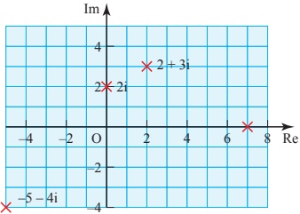

Figure 11.2

All real numbers are represented by points on the x axis, which is therefore called the real axis. Pure imaginary numbers (of the form  $ 0 + iy $) give points on the y axis, which is called the imaginary axis. It is useful to label these Re and Im respectively. This geometrical illustration of complex numbers is called the complex plane or the Arg and Diagram after Jean-Robert Argand (1768–1822), a self-taught Swiss book-keeper who published an account of it in 1806.

ACTIVITY 11.6 (i) Copy figure 11.2.

For each of the four given points z mark also the point -z.

Describe the geometrical transformation which maps the point representing z to the point representing -z.

(ii) For each of the points z mark the point  $ z^{*} $, the complex conjugate of z. Describe the geometrical transformation which maps the point representing z to the point representing  $ z^{*} $.

You will have seen in this activity that the points representing z and -z have half-turn symmetry about the origin, and that the points representing z and  $ z^{*} $ are reflections of each other in the real axis.

## How would you describe points that are reflections of each other in the imaginary axis?

## Representing the sum and difference of complex numbers

Several mathematicians before Argand had used the complex plane representation. In particular, a Norwegian surveyor, Caspar Wessel (1745–1818), wrote a paper in 1797 (largely ignored until it was republished in French a century later) in which the complex number  $ x + iy $ is represented by the position vector  $ \begin{pmatrix} x \\ y \end{pmatrix} $, as shown in figure 11.3 (overleaf).

<!-- page 291 -->

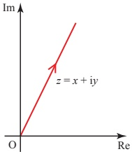

Figure 11.3

The advantage of this is that the addition of complex numbers can then be shown by the addition of the corresponding vectors.

 $$ \begin{pmatrix}x_{1}\\ y_{1}\end{pmatrix}+\begin{pmatrix}x_{2}\\ y_{2}\end{pmatrix}=\begin{pmatrix}x_{1}+x_{2}\\ y_{1}+y_{2}\end{pmatrix} $$ 

In an Argand diagram the position vectors representing  $ z_1 $ and  $ z_2 $ form two sides of a parallelogram, the diagonal of which is the vector  $ z_1 + z_2 $ (see figure 11.4).

You can also represent $z$ by any other directed line segment with components $\binom{x}{y}$, not anchored at the origin as a position vector. Then addition can be shown as a triangle of vectors (see figure 11.5).

If you draw the other diagonal of the parallelogram, and let it represent the complex number  $ w $ (see figure 11.6), then

 $$ z_{2}+w=z_{1}\Longrightarrow w=z_{1}-z_{2}. $$ 

This gives a useful illustration of subtraction: the complex number  $ z_1 - z_2 $ is represented by the vector from the point representing  $ z_2 $ to the point representing  $ z_1 $, as shown in figure 11.7. Notice the order of the points: the vector  $ z_1 - z_2 $ starts at the point  $ z_2 $ and goes to the point  $ z_1 $.

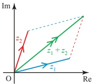

Figure 11.4

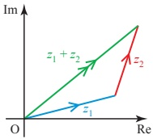

Figure 11.5

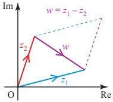

Figure 11.6

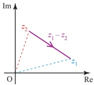

Figure 11.7

<!-- page 292 -->

(i) Draw a diagram to illustrate  $ z_{2}-z_{1} $.

(ii) Draw a diagram to illustrate that  $ z_{1}-z_{2}=z_{1}+(-z_{2}) $.

Show that  $ z_{1}+(-z_{2}) $ gives the same vector,  $ z_{1}-z_{2} $ as before, but represented by a line segment in a different place.

## The modulus of a complex number

Figure 11.8 shows the point representing  $ z = x + iy $ on an Argand diagram.

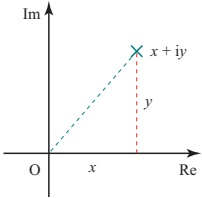

Figure 11.8

Using Pythagoras’ theorem, you can see that the distance of this point from the origin is  $ \sqrt{x^2 + y^2} $. This distance is called the modulus of z, and is denoted by  $ |z| $.

So for the complex number  $ z = x + iy $,  $ |z| = \sqrt{x^2 + y^2} $.

If $z$ is real, $z = x$ say, then $|z| = \sqrt{x^2}$, which is the absolute value of $x$, i.e. $|x|$. So the use of the modulus sign with complex numbers fits with its previous meaning for real numbers.

## EXERCISE 11C

1 Represent each of the following complex numbers on a single Argand diagram, and find the modulus of each complex number.

(i)  $ 3 + 2i $ (ii)  $ 4i $ (iii)  $ -5 + i $

(iv) -2 (v)  $ -6 - 5i $ (vi)  $ 4 - 3i $

2 Given that z = 2 - 4i, represent the following by points on a single Argand diagram.

(i) z (ii) -z (iii) z*

(iv) -z* (v) iz (vi) -iz

(vii) iz* (viii) (iz)*

3 Given that  $ z = 10 + 5i $ and  $ w = 1 + 2i $, represent the following complex numbers on an Argand diagram.

(i) z (ii) w (iii)  $ z + w $

(iv) z - w (v) w - z

<!-- page 293 -->

4 Given that  $ z = 3 + 4i $ and  $ w = 5 - 12i $, find the following.

(i) |z|

(ii) |w|

(iii) | zw

(iv)  $ \left|\frac{z}{w}\right| $

(v)  $ \left|\frac{w}{z}\right| $

What do you notice?

5 Let z = 1 + i.

(i) Find  $ z^{n} $ and  $ |z^{n}| $ for n = -1, 0, 1, 2, 3, 4, 5.

(ii) Plot each of the points  $ z^{n} $ from part (i) on a single Argand diagram. Join each point to its predecessor and to the origin.

(iii) What do you notice?

6 Give a geometrical proof that  $ (-z)^{x} = -(z^{*}) $.

## Sets of points in an Argand diagram

In the last section, you saw that |z| is the distance of the point representing z from the origin in the Argand diagram.

What do you think that | $z_{2}-z_{1}$ | represents?

If  $ z_1 = x_1 + \mathrm{i}y_1 $ and  $ z_2 = x_2 + \mathrm{i}y_2 $, then  $ z_2 - z_1 = x_2 - x_1 + \mathrm{i}(y_2 - y_1) $.

So  $ |z_2 - z_1| = \sqrt{(x_2 - x_1)^2 + (y_2 - y_1)^2} $.

Figure 11.9 shows an Argand diagram with the points representing the complex numbers  $ z_1 = x_1 + iy_1 $ and  $ z_2 = x_2 + iy_2 $ marked.

Figure 11.9

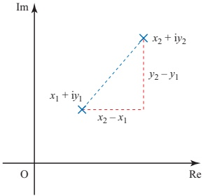

<!-- page 294 -->

Using Pythagoras’ theorem, you can see that the distance between  $ z_1 $ and  $ z_2 $ is given by  $ \sqrt{(x_2 - x_1)^2 + (y_2 - y_1)^2} $.

So  $ |z_2 - z_1| $ is the distance between the points  $ z_1 $ and  $ z_2 $.

This is the key to solving many questions about sets of points in an Argand diagram, as in the following examples.

EXAMPLE 11.7

Draw an Argand diagram showing the set of points z for which |z - 3 - 4i| = 5.

## SOLUTION

 $ |z-3-4i| $ can be written as  $ |z-(3+4i)| $, and this is the distance from the point 3+4i to the point z.

This equals 5 if the point z lies on the circle with centre 3 + 4i and radius 5 (see figure 11.10).

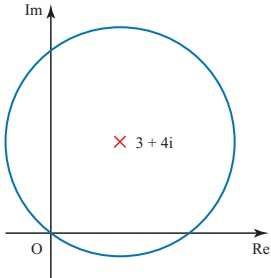

Figure 11.10

## How would you show the sets of points for which

(i)  $ |z-3-4i|\leq5 $

(ii)  $ \left|z-3-4i\right|<5 $

(iii)  $ |z-3-4i| \geqslant 5 $

### EXAMPLE 11.8

Draw an Argand diagram showing the set of points $z$ for which $|z-3-4i| \leq |z+1-2i|$.

## SOLUTION

The condition can be written as  $ |z - (3 + 4i)| \leqslant |z - (-1 + 2i)| $.

<!-- page 295 -->

$ |z - (3 + 4i)| $ is the distance of point z from the point  $ 3 + 4i $, point A in figure 11.11, and  $ |z - (-1 + 2i)| $ is the distance of point z from the point  $ -1 + 2i $, point B in figure 11.11.

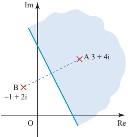

Figure 11.11

These distances are equal if z is on the perpendicular bisector of AB.

So the given condition holds if z is on this bisector or in the half plane on the side of it containing A, shown shaded in figure 11.11.

## How would you show the sets of points for which

(i)  $ |z-3-4i|=|z+1-2i| $

(ii)  $ |z-3-4i|<|z+1-2i| $

(iii)  $ |z-3-4i|>|z+1-2i| $?

## EXERCISE 11D

1 For each of parts (i) to (viii), draw an Argand diagram showing the set of points z for which the given condition is true.

(i) |z|=2

(ii)  $ |z-4|\leq3 $

(iii)  $ \left| z - 5i \right| = 6 $

(iv)  $ |z + 3 - 4i| < 5 $

(v)  $ |6 - i - z| \geq 2 $

(vi)  $ |z + 2 + 4i| = 0 $

(vii)  $ 2 \leq |z - 1 + i| \leq 3 $

(viii)  $ \mathrm{Re}(z) = -2 $

2 Draw an Argand diagram showing the set of points  $ z $ for which  $ |z - 12 + 5i| \leq 7 $. Use the diagram to prove that, for these  $ z, 6 \leq |z| \leq 20 $.

3 (i) On an Argand diagram, show the region R for which  $ |z - 5 + 4i| \leq 3 $.

(ii) Find the greatest and least values of  $ |z + 3 - 2i| $ in the region R.

4 By using an Argand diagram see if it is possible to find values of $z$ for which $|z-2+i| \geq 10$ and $|z+4+2i| \leq 2$ simultaneously.

<!-- page 296 -->

5 For each of parts (i) to (iv), draw an Argand diagram showing the set of points z for which the given condition is true.

(i)  $ |z| = |z - 4| $

(iii)  $ |z + 1 - i| = |z - 1 + i| $

(ii)  $ |z| \geq |z - 2i| $

(iv)  $ |z + 5 + 7i| \leq |z - 2 - 6i| $

## The modulus-argument form of complex numbers

The position of the point z in an Argand diagram can be described by means of the length of the line connecting this point to the origin, and the angle which this line makes with the positive real axis (see figure 11.12).

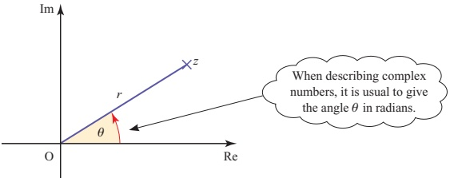

Figure 11.12

The distance r is of course |z| , the modulus of z as defined on page 283.

The angle  $ \theta $ is slightly more complicated: it is measured anticlockwise from the positive real axis, normally in radians. However, it is not uniquely defined since adding any multiple of  $ 2\pi $ to  $ \theta $ gives the same direction. To avoid confusion, it is usual to choose that value of  $ \theta $ for which  $ -\pi < \theta \leq \pi $. This is called the principal argument of  $ z $, denoted by  $ \arg z $. Then every complex number except zero has a unique principal argument. The argument of zero is undefined.

For example, with reference to figure 11.13,

 $$ \arg(-4)=\pi $$ 

 $$ \arg(-2\mathrm{i})=-\frac{\pi}{2} $$ 

arg(1.5) = 0

 $$ \arg(-3+3\mathrm{i})=\frac{3\pi}{4} $$ 

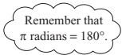

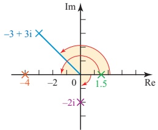

Figure 11.13

<!-- page 297 -->

## Without using your calculator, state the values of the following

(i) arg i

(ii) arg(-4 - 4i)

(iii) arg(2 - 2i)

You can see from figure 11.14 that

 $$ x=r\cos\theta\quad y=r\sin\theta $$ 

 $$ r=\sqrt{x^{2}+y^{2}}\qquad\quad\tan\theta=\frac{y}{x} $$ 

and the same relations hold in the other quadrants too.

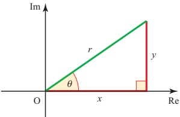

### Figure 11.14

Since $x = r\cos\theta$ and $y = r\sin\theta$, we can write the complex number $z = x + iy$ in the form

 $$ z=r(\cos\theta+\mathrm{i}\sin\theta). $$ 

This is called the modulus-argument or polar form.

### ACTIVITY 11.8

(i) Set your calculator to degrees and use it to find the following.

(a)  $ \tan^{-1}1 $ (b)  $ \tan^{-1}2 $ (c)  $ \tan^{-1}100 $ (d)  $ \tan^{-1}(-2) $ (e)  $ \tan^{-1}(-50) $ (f)  $ \tan^{-1}(-200) $

What are the largest and smallest possible values, in degrees, of  $ \tan^{-1} x $?

(ii) Now set your calculator to radians.

Find  $ \tan^{-1} x $ for some different values of x.

What are the largest and smallest possible values, in radians, of  $ \tan^{-1} x $?

If you know the modulus and argument of a complex number, it is easy to use the relations  $ x = r \cos \theta $ and  $ y = r \sin \theta $ to find the real and imaginary parts of the complex number.

Similarly, if you know the real and imaginary parts, you can find the modulus and argument of the complex number using the relations  $ r = \sqrt{x^2 + y^2} $ and  $ \tan\theta = \frac{y}{x} $, but you do have to be quite careful in finding the argument. It is tempting to say that  $ \theta = \tan^{-1}\left(\frac{y}{x}\right) $, but, as you saw in the last activity, this gives a value between  $ -\frac{\pi}{2} $ and  $ \frac{\pi}{2} $, which is correct only if z is in the first or fourth quadrants.

<!-- page 298 -->

For example, suppose that the point $z_1 = 2 - 3i$ has argument $\theta_1$, and the point $z_2 = -2 + 3i$ has argument $\theta_2$. It is true to say that $\tan\theta_1 = \tan\theta_2 = -\frac{3}{2}$. In the case of $z_1$, which is in the fourth quadrant, $\theta_1$ is correctly given by $\tan^{-1}\left(-\frac{3}{2}\right) \approx -0.98$ rad ($\approx -56^\circ$). However, in the case of $z_2$, which is in the second quadrant, $\theta_2$ is given by $\left(-\frac{3}{2}\right) + \pi \approx 2.16$ rad ($\approx 124^\circ$). These two points are illustrated in figure 11.15.

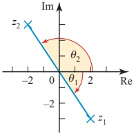

### Figure 11.15

Figure 11.16 shows the values of the argument in each quadrant. It is wise always to draw a sketch diagram when finding the argument of a complex number.

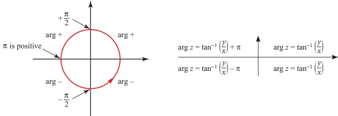

Figure 11.16

### ACTIVITY 11.9

Mark the points  $ 1 + \mathrm{i} $,  $ 1 - \mathrm{i} $,  $ -1 + \mathrm{i} $,  $ -1 - \mathrm{i} $ on an Argand diagram.

Find argz for each of these, and check that your answers are consistent with figure 11.16.

Note

The modulus–argument form of a complex number is also called the polar form, as the modulus of a complex number is its distance from the origin, sometimes called the pole.

<!-- page 299 -->

### ACTIVITY 11.10

Most calculators can convert from $(x, y)$ to $(r, \theta)$ (called rectangular to polar, and often shown as $\mathbf{R} \to \mathbf{P}$) and from $(r, \theta)$ to $(x, y)$ (polar to rectangular, $\mathbf{P} \to \mathbf{R}$). Find out how to use these facilities on your calculator, and compare with other available types of calculator.

Does your calculator always give the correct  $ \theta $, or do you sometimes have to add or subtract  $ \pi $ (or  $ 180^{\circ} $?

A complex number in polar form must be given in the form $z = r(\cos\theta + i\sin\theta)$, not, for example, in the form $z = r(\cos\theta - i\sin\theta)$. The value of $r$ must also be positive. So, for example, the complex number $-2(\cos\alpha + i\sin\alpha)$ is not in polar form. However, by using some of the relationships

 $$ \begin{aligned}&\cos\left(\pi-\alpha\right)=-\cos\alpha\quad&\sin\left(\pi-\alpha\right)=\sin\alpha\\&\cos\left(\alpha-\pi\right)=-\cos\alpha\quad&\sin\left(\alpha-\pi\right)=-\sin\alpha\\&\cos\left(-\alpha\right)=\cos\alpha\quad&\sin\left(-\alpha\right)=-\sin\alpha\\ \end{aligned} $$ 

you can rewrite the complex number, for example

 $$ \begin{aligned}-2(\cos\alpha+\mathrm{i}\sin\alpha)&=2(-\cos\alpha-\mathrm{i}\sin\alpha)\\&=2(\cos\left(\alpha-\pi\right)+\mathrm{i}\sin\left(\alpha-\pi\right)).\end{aligned} $$ 

This is now written correctly in polar form. The modulus is 2 and the argument is  $ \alpha - \pi $.

## How would you rewrite the following in polar form?

(i)  $ -2(\cos\alpha - i\sin\alpha) $

(ii)  $ 2(\cos\alpha - i\sin\alpha) $

When you use the polar form of a complex number, remember to give the argument in radians, and to use a simple rational multiple of  $ \pi $ where possible.

ACTIVITY 11.11 Copy and complete this table.

Give your answers in terms of  $ \sqrt{2} $ or  $ \sqrt{3} $ where appropriate, rather than as decimals. You may find figure 11.17 helpful.

<table border=1 style='margin: auto; word-wrap: break-word;'><tr><td style='text-align: center; word-wrap: break-word;'></td><td style='text-align: center; word-wrap: break-word;'>$ \frac{\pi}{4} $</td><td style='text-align: center; word-wrap: break-word;'>$ \frac{\pi}{6} $</td><td style='text-align: center; word-wrap: break-word;'>$ \frac{\pi}{3} $</td></tr><tr><td style='text-align: center; word-wrap: break-word;'>tan</td><td style='text-align: center; word-wrap: break-word;'></td><td style='text-align: center; word-wrap: break-word;'></td><td style='text-align: center; word-wrap: break-word;'></td></tr><tr><td style='text-align: center; word-wrap: break-word;'>sin</td><td style='text-align: center; word-wrap: break-word;'></td><td style='text-align: center; word-wrap: break-word;'></td><td style='text-align: center; word-wrap: break-word;'></td></tr><tr><td style='text-align: center; word-wrap: break-word;'>cos</td><td style='text-align: center; word-wrap: break-word;'></td><td style='text-align: center; word-wrap: break-word;'></td><td style='text-align: center; word-wrap: break-word;'></td></tr></table>

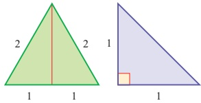

Figure 11.17

<!-- page 300 -->

Write the following complex numbers in polar form.

(i)  $ 4 + 3i $

 $$ -1+i $$ 

 $$ (iii)-1-\sqrt{3}i $$ 

## SOLUTION

(i) $x=4, y=3$

Modulus $=\sqrt{3^{2}+4^{2}}=5$

Since $4+3i$ lies in the first quadrant, the argument $=\tan^{-1}\frac{3}{4}$.

$4+3i=5(\cos\alpha+\sin\alpha)$, where $\alpha=\tan^{-1}\frac{3}{4}\approx0.644$ radians

(ii) $x=-1, y=1$

Modulus $=\sqrt{1^{2}+1^{2}}=\sqrt{2}$

Since $-1+i$ lies in the second quadrant,

argument $=\tan^{-1}(-1)+\pi$

$=-\frac{\pi}{4}+\pi=\frac{3\pi}{4}$

$-1+i=\sqrt{2}\left(\cos\frac{3\pi}{4}+\sin\frac{3\pi}{4}\right)$

(iii) $x=-1, y=-\sqrt{3}$

Modulus $=\sqrt{1+3}=2$

Since $-1-\sqrt{3}i$ lies in the third quadrant,

argument $=\tan^{-1}\sqrt{3}-\pi$

$=\frac{\pi}{3}-\pi=-\frac{2\pi}{3}$

$-1-\sqrt{3}i=2\left(\cos\left(-\frac{2\pi}{3}\right)+\sin\left(-\frac{2\pi}{3}\right)\right)$

## EXERCISE 11E

1 Write down the values of the modulus and the principal argument of each of these complex numbers.

(i)

 $$ 8\left(\cos\frac{\pi}{5}+\mathrm{i}\sin\frac{\pi}{5}\right) $$ 

 $$ \frac{\cos2.3+\mathrm{i}\sin2.3}{4} $$ 

(iii)

 $$ 4\left(\cos\frac{\pi}{3}-\mathrm{i}\sin\frac{\pi}{3}\right) $$ 

 $$ \mathrm{(iv)}-3(\cos\left(-3\right)+\mathrm{i}\sin\left(-3\right)) $$

<!-- page 301 -->

2 For each complex number, find the modulus and principal argument, and hence write the complex number in polar form.

Give the argument in radians, either as a simple rational multiple of  $ \pi $ or correct to 3 decimal places.

(i) 1 (ii) -2 (iii) 3i

(iv) -4i (v)  $ 1 + i $ (vi) -5 - 5i

(vii)  $ 1 - \sqrt{3}i $ (viii)  $ 6\sqrt{3} + 6i $ (ix) 3 - 4i

(x)  $ -12 + 5i $ (xi)  $ 4 + 7i $ (xii) -58 - 93i

3 Write each complex number with the given modulus and argument in the form  $ x + iy $, giving surds in your answer where appropriate.

(i)  $ |z| = 2 $,  $ \arg z = \frac{\pi}{2} $

(ii)  $ |z| = 3 $,  $ \arg z = \frac{\pi}{3} $

(iii)  $ |z| = 7 $,  $ \arg z = \frac{5\pi}{6} $

(iv)  $ |z| = 1 $,  $ \arg z = -\frac{\pi}{4} $

(v)  $ |z| = 5 $,  $ \arg z = -\frac{2\pi}{3} $

(vi)  $ |z| = 6 $,  $ \arg z = -2 $

4 Given that  $ \arg(5 + 2i) = \alpha $, find the principal argument of each of the following in terms of  $ \alpha $.

(i)  $ -5 - 2i $ (ii)  $ 5 - 2i $ (iii)  $ -5 + 2i $

(iv)  $ 2 + 5i $ (v)  $ -2 + 5i $

5 The variable complex number  $ z $ is given by

 $$ 

z = 1 + \cos 2\theta + i \sin 2\theta,

 $$ 

where  $ \theta $ takes all values in the interval  $ -\frac{1}{2}\pi < \theta < \frac{1}{2}\pi $.

(ii) Show that the modulus of  $ z $ is 2  $ \cos \theta $ and the argument of  $ z $ is  $ \theta $.

(ii) Prove that the real part of  $ \frac{1}{z} $ is constant.

[Cambridge International AS & A Level Mathematics 9709. Paper 32 O]

[Cambridge International AS & A Level Mathematics 9709, Paper 32 Q8 June 2010]

6 The variable complex number z is given by

 $$ z=2\cos\theta+\mathrm{i}(1-2\sin\theta), $$ 

where  $ \theta $ takes all values in the interval  $ -\pi < \theta \leq \pi $.

(i) Show that |z - i| = 2, for all values of $\theta$. Hence sketch, in an Argand diagram, the locus of the point representing $z$.

(ii) Prove that the real part of  $ \frac{1}{z+2-i} $ is constant for  $ -\pi < \theta < \pi $.

[Cambridge International AS & A Level Mathematics 9709, Paper 3 Q5 June 2008]

<!-- page 302 -->

7 (i) The complex number  $ z $ is given by  $ z = \frac{4 - 3i}{1 - 2i} $.

(a) Express z in the form  $ x + iy $, where x and y are real.

(b) Find the modulus and argument of z.

(ii) Find the two square roots of the complex number 5-12i, giving your answers in the form  $ x + iy $, where x and y are real.

[Cambridge International AS & A Level Mathematics 9709, Paper 3 Q8 November 2007]

8 The complex number  $ 2 + i $ is denoted by u. Its complex conjugate is denoted by  $ u^* $.

(i) Show, on a sketch of an Argand diagram with origin O, the points A, B and C representing the complex numbers  $ u $,  $ u^* $ and  $ u + u^* $ respectively. Describe in geometrical terms the relationship between the four points O, A, B and C.

(ii) Express  $ \frac{u}{u^{*}} $ in the form  $ x + iy $, where x and y are real.

(iii) By considering the argument of  $ \frac{u}{u^{*}} $, or otherwise, prove that

 $$ \tan^{-1}\left(\frac{4}{3}\right)=2\tan^{-1}\left(\frac{1}{2}\right). $$ 

[Cambridge International AS & A Level Mathematics 9709, Paper 3 Q7 June 2006]

## Sets of points using the polar form

You already know that  $ \arg z $ gives the angle between the line connecting the point z with the origin and the real axis.

What do you think  $ \arg(z_{2}-z_{1}) $ represents?

If  $ z_1 = x_1 + \mathrm{i}y_1 $ and  $ z_2 = x_2 + \mathrm{i}y_2 $, then  $ z_2 - z_1 = x_2 - x_1 + \mathrm{i}(y_2 - y_1) $.

 $$ \arg\left(z_{2}-z_{1}\right)=\tan^{-1}\frac{y_{2}-y_{1}}{x_{2}-x_{1}} $$ 

Figure 11.18 shows an Argand diagram with the points representing the complex numbers  $ z_1 = x_1 + iy_1 $ and  $ z_2 = x_2 + iy_2 $ marked.

The angle between the line joining  $ z_{1} $ and  $ z_{2} $ and a line parallel to the real axis is given by

 $$ \tan^{-1}\frac{y_{2}-y_{1}}{x_{2}-x_{1}}. $$ 

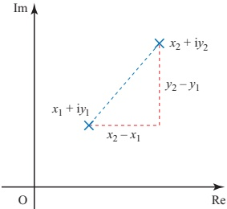

Figure 11.18

So  $ \arg(z_{1}-z_{2}) $ is the angle between the

line joining  $ z_{1} $ and  $ z_{2} $ and a line parallel to the real axis.

<!-- page 303 -->

Draw Argand diagrams showing the sets of points z for which

(i)  $ \arg z = \frac{\pi}{4} $

(ii)  $ \arg(z - \mathrm{i}) = \frac{\pi}{4} $

(iii)  $ 0 \leq \arg(z - \mathrm{i}) \leq \frac{\pi}{4} $.

## SOLUTION

(i)  $ \arg z = \frac{\pi}{4} $

 $ \Leftrightarrow $ the line joining the origin to the point z has direction  $ \frac{\pi}{4} $

 $ \Leftrightarrow $ z lies on the half-line from the origin in the  $ \frac{\pi}{4} $ direction, see figure 11.19.

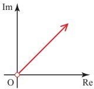

Figure 11.19

(Note that the origin is not included, since  $ \arg 0 $ is undefined.)

(ii)  $ \arg(z - \mathrm{i}) = \frac{\pi}{4} $

 $ \Leftrightarrow $ the line joining the point i to the point z has direction  $ \frac{\pi}{4} $

$\Leftrightarrow$ $z$ lies on the half-line from the point $i$ in the $\frac{\pi}{4}$ direction, see figure 11.20.

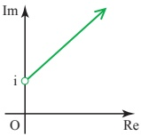

Figure 11.20

(iii)  $ 0 \leq \arg(z - \mathrm{i}) \leq \frac{\pi}{4} $

 $ \Leftrightarrow $ the line joining the point i to the point z has direction between 0 and  $ \frac{\pi}{4} $ (inclusive)

⇔ z lies in the one-eighth plane shown in figure 11.21.

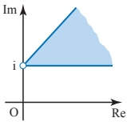

Figure 11.21

## EXERCISE 11F

1 For each of parts (i) to (vi) draw an Argand diagram showing the set of points z for which the given condition is true.

(i)  $ \arg z = -\frac{\pi}{3} $

(ii)  $ \arg(z - 4i) = 0 $

(iii)  $ \arg(z+3) \geq \frac{\pi}{2} $

(iv)  $ \arg(z + 1 + 2\mathrm{i}) = \frac{3\pi}{4} $

(v)  $ \arg(z - 3 + i) \leq -\frac{\pi}{6} $

(vi)  $ -\frac{\pi}{4} \leq \arg(z + 5 - 3i) \leq \frac{\pi}{3} $

2 Find the least and greatest possible values of  $ \arg z $ if  $ |z - 8i| \leq 4 $.

<!-- page 304 -->

3 You are given the complex number  $ w = -\sqrt{3} + 3i $.

(i) Find  $ \arg w $ and  $ |w - 2i| $.

(ii) On an Argand diagram, shade the region representing complex numbers z which satisfy both of these inequalities.

 $$ \mid z-2i\mid\leq2\qquad and\qquad\tfrac{1}{2}\pi\leq\arg z\leq\tfrac{2}{3}\pi. $$ 

Indicate the point on your diagram which corresponds to w.

(iii) Given that $z$ satisfies both the inequalities in part (ii), find the greatest possible value of $|z-w|$.

[MEI, part]

4 The complex number $w$ is given by $w = -\frac{1}{2} + i\frac{\sqrt{3}}{2}$.

(i) Find the modulus and argument of w.

(ii) The complex number  $ z $ has modulus  $ R $ and argument  $ \theta $, where  $ -\frac{1}{3}\pi < \theta < \frac{1}{3}\pi $. State the modulus and argument of  $ wz $ and the modulus and argument of  $ \frac{z}{w} $.

(iii) Hence explain why, in an Argand diagram, the points representing $z$, $wz$ and $\frac{z}{w}$ are the vertices of an equilateral triangle.

(iv) In an Argand diagram, the vertices of an equilateral triangle lie on a circle with centre at the origin. One of the vertices represents the complex number  $ 4 + 2i $. Find the complex numbers represented by the other two vertices. Give your answers in the form  $ x + iy $, where x and y are real and exact.

[Cambridge International AS & A Level Mathematics 9709, Paper 3 Q10 November 2008]

5 (i) Solve the equation  $ z^{2}-2iz-5=0 $, giving your answers in the form  $ x+iy $ where x and y are real.

(ii) Find the modulus and argument of each root.

(iii) Sketch an Argand diagram showing the points representing the roots.

[Cambridge International AS & A Level Mathematics 9709, Paper 3 Q3 June 2005]

6 (i) Solve the equation  $ z^{2} + (2\sqrt{3})iz - 4 = 0 $, giving your answers in the form  $ x + iy $, where x and y are real.

(ii) Sketch an Argand diagram showing the points representing the roots.

(iii) Find the modulus and argument of each root.

(iv) Show that the origin and the points representing the roots are the vertices of an equilateral triangle.

[Cambridge International AS & A Level Mathematics 9709, Paper 3 Q7 June 2009]

7 The complex numbers  $ -2 + i $ and  $ 3 + i $ are denoted by  $ u $ and  $ v $ respectively.

(i) Find, in the form $x + iy$, the complex numbers

(a)  $ u + \nu $

(b)  $ \frac{u}{v} $, showing all your working.

<!-- page 305 -->

(ii) State the argument of  $ \frac{u}{v} $.

In an Argand diagram with origin O, the points A, B and C represent the complex numbers  $ u $,  $ \nu $ and  $ u + \nu $ respectively.

(iii) Prove that angle AOB =  $ \frac{3}{4}\pi $.

(iv) State fully the geometrical relationship between the line segments OA and BC.

[Cambridge International AS & A Level Mathematics 9709, Paper 32 Q7 November 2009]

8 The complex number  $ \frac{2}{-1+i} $ is denoted by u.

(i) Find the modulus and argument of u and  $ u^{2} $.

(ii) Sketch an Argand diagram showing the points representing the complex numbers  $ u $ and  $ u^2 $. Shade the region whose points represent the complex numbers  $ z $ which satisfy both the inequalities  $ |z| < 2 $ and  $ |z - u^2| < |z - u| $.

[Cambridge International AS & A Level Mathematics 9709, Paper 3 Q8 June 2007]

## Working with complex numbers in polar form

The polar form quickly leads to an elegant geometrical interpretation of the multiplication of complex numbers. For if

 $$ z_{1}=r_{1}(\cos\theta_{1}+\mathrm{i}\sin\theta_{1})\mathrm{a n d}z_{2}=r_{2}(\cos\theta_{2}+\mathrm{i}\sin\theta_{2}) $$ 

then

 $$ \begin{align*}z_{1}z_{2}&=r_{1}r_{2}(\cos\theta_{1}+\mathrm{i}\sin\theta_{1})(\cos\theta_{2}+\mathrm{i}\sin\theta_{2})\\&=r_{1}r_{2}[\cos\theta_{1}\cos\theta_{2}-\sin\theta_{1}\sin\theta_{2}+\mathrm{i}(\sin\theta_{1}\cos\theta_{2}+\cos\theta_{1}\sin\theta_{2})].\end{align*} $$ 

Using the compound-angle formulae gives

 $$ z_{1}z_{2}=r_{1}r_{2}[\cos\left(\theta_{1}+\theta_{2}\right)+\mathrm{i}\sin\left(\theta_{1}+\theta_{2}\right)]. $$ 

This is the complex number with modulus  $ r_1 r_2 $ and argument  $ (\theta_1 + \theta_2) $, so we have the beautiful result that

 $$ \mid z_{1}z_{2}\mid=\mid z_{1}\mid\mid z_{2}\mid $$ 

and

arg  $ (z_1z_2) = \arg z_1 + \arg z_2 $ ( $ \pm 2\pi $ if necessary, to give the principal argument).

So to multiply complex numbers in polar form you multiply their moduli and add their arguments.

ACTIVITY 11.12 Using this interpretation, investigate

(i) multiplication by i

(ii) multiplication by -1.

<!-- page 306 -->

The corresponding results for division are easily obtained by letting  $ \frac{z_{1}}{z_{2}} = w $. Then  $ z_{1} = wz_{2} $ so that

 $ |z_1| = |w||z_2| $ and  $ \arg z_1 = \arg w + \arg z_2 $ ( $ \pm 2\pi $ if necessary).

Therefore  $ |w| = \left| \frac{z_1}{z_2} \right| = \frac{|z_1|}{|z_2|}  $

and  $ \arg w = \arg \frac{z_1}{z_2} $

 $ = \arg z_1 - \arg z_2 $ ( $ \pm 2\pi $ if necessary, to give the principal argument).

So to divide complex numbers in polar form you divide their moduli and subtract their arguments.

This gives the following simple geometrical interpretation of multiplication and division.

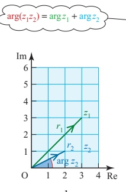

 $$ z_{1} $$ 

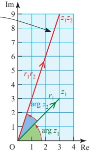

 $$ Z_{2} $$ 

(ii) Multiplying  $ z_{1} $ by :

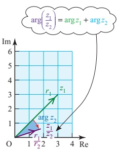

Figure 11.22

(iii) Dividing  $ z_{1} $ by  $ z_{2} $

To obtain the vector  $ z_1z_2 $ enlarge the vector  $ z_1 $ by the scale factor  $ |z_2| $ and rotate it through  $ \arg z_2 $ anticlockwise about O (see Figure 11.22 (ii)).

To obtain the vector  $ \frac{z_1}{z_2} $ enlarge the vector  $ z_1 $ by scale factor  $ \frac{1}{|z_2|} $ and rotate it clockwise through  $ \arg z_2 $ about O (see Figure 11.22 (ii)).

This combination of an enlargement followed by a rotation is called a spiral dilatation.

In summary:

 $$ \mid z_{1}z_{2}\mid=\mid z_{1}\mid\mid z_{2}\mid\quad\arg\left(z_{1}z_{2}\right)=\arg z_{1}+\arg z_{2} $$ 

and

 $$ \left|\frac{z_{1}}{z_{2}}\right|=\frac{\left|z_{1}\right|}{\left|z_{2}\right|}\qquad\qquad\operatorname{a r g}\left(\frac{z_{1}}{z_{2}}\right)=\operatorname{a r g}z_{1}-\operatorname{a r g}z_{2} $$

<!-- page 307 -->

### ACTIVITY 11.13

Check this by accurate drawing and measurement for the case  $ z_{1}=2+i $,  $ z_{2}=3+4i $. Then do the same with  $ z_{1} $ and  $ z_{2} $ interchanged.

### EXAMPLE 11.11

Find

(i)  $ 6\left(\cos\frac{\pi}{2}+\mathrm{i}\sin\frac{\pi}{2}\right)\times2\left(\cos\frac{\pi}{4}+\mathrm{i}\sin\frac{\pi}{4}\right) $

(ii)  $ 6\left(\cos\frac{\pi}{2}+\mathrm{i}\sin\frac{\pi}{2}\right)\div2\left(\cos\frac{\pi}{4}+\mathrm{i}\sin\frac{\pi}{4}\right) $

## SOLUTION

(i) Remember that

 $$ r_{1}(\cos\theta_{1}+\mathrm{i}\sin\theta_{1})\times r_{2}(\cos\theta_{2}+\mathrm{i}\sin\theta_{2})=r_{1}r_{2}(\cos(\theta_{1}+\theta_{2})+\mathrm{i}\sin(\theta_{1}+\theta_{2})) $$ 

So to multiply complex numbers you

multiply the moduli

 $$ 6\times2=12;\frac{\pi}{2}+\frac{\pi}{4}=\frac{3\pi}{4} $$ 

add the arguments.

 $$ 6\left(\cos\frac{\pi}{2}+\mathrm{i}\sin\frac{\pi}{2}\right)\times2\left(\cos\frac{\pi}{4}+\mathrm{i}\sin\frac{\pi}{4}\right)=12\left(\cos\frac{3\pi}{4}+\mathrm{i}\sin\frac{3\pi}{4}\right)▶ $$ 

(ii) To divide complex numbers you

divide the moduli

subtract the arguments.

 $$ 6\Big(\cos\frac{\pi}{2}+\mathrm{i}\sin\frac{\pi}{2}\Big)\div2\Big(\cos\frac{\pi}{4}+\mathrm{i}\sin\frac{\pi}{4}\Big)=3\Big(\cos\frac{\pi}{4}+\mathrm{i}\sin\frac{\pi}{4}\Big), $$ 

This leads to an alternative method of finding the square root of a complex number.

Writing  $ 8 + 6i $ in polar form gives

 $$ r=\sqrt{8^{2}+6^{2}}=10 $$ 

 $$ \tan\theta=\frac{6}{8}\Longrightarrow\theta=0.6435\mathrm{r a d i a n s} $$ 

 $$  So8+6i=10(\cos0.6435+i\sin0.6435) $$ 

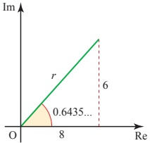

Figure 11.23

Notice that if you add  $ 2\pi $ to the argument you will end up with exactly the same complex number

on the Argand diagram (as you have just rotated through one full tur

So 8 + 6i is also the same as  $ 10[\cos(0.6435 + 2\pi) + i \sin(0.6435 + 2\pi)] $.

Let  $ r(\cos\theta + i\sin\theta) $ be the square root of 8 + 6i so that

 $$ r(\cos\theta+\mathrm{i}\sin\theta)\times r(\cos\theta+\mathrm{i}\sin\theta)=r^{2}(\cos2\theta+\mathrm{i}\sin2\theta)=8+6\mathrm{i} $$ 

 $$ \Rightarrow\quad r(\cos2\theta+\mathrm{i}\sin2\theta)=10(\cos0.6435+\mathrm{i}\sin0.6435) $$ 

 $$  and\quad r(\cos2\theta+i\sin2\theta)=10[\cos(0.6435+2\pi)+i\sin(0.6435+2\pi)] $$

<!-- page 308 -->

$$ \mathrm{From}\ \mathrm{①}\ \mathrm{or}\ \mathrm{②}\qquad r^{2}=10\qquad\implies\qquad r=\sqrt{10}\quad\xleftarrow{\mathrm{The~square~root}} $$ 

 $$  From\textcircled{1} \qquad2\theta=0.6435\qquad\implies\quad\theta=0.32175 $$ 

 $$  From\  ② \quad2\theta=0.6435+2\pi\quad\Rightarrow\quad\theta=0.32175+\pi $$ 

So one square root of  $ 8 + 6i $ is

 $$ \sqrt{10}(\cos0.32175+\mathrm{i}\sin0.32175)=3+\mathrm{i} $$ 

and the other square root is

 $$ \sqrt{10}[\cos(0.32175+\pi)+\mathrm{i}\sin(0.32175+\pi)]=-3-\mathrm{i} $$ 

Compare this method with that used on page 278 to find the square roots of  $ 8 + 6i $.

What are the square roots of $10[\cos(0.6435+2n\pi)+\sin(0.6435+2n\pi)]$, where $n$ is an integer?

## Complex exponents

When multiplying complex numbers in polar form you add the arguments, and when multiplying powers of the same base you add the exponents. This suggests that there may be a link between the familiar expression  $ \cos\theta + i\sin\theta $ and the seemingly remote territory of the exponential function. This was first noticed in 1714 by the young Englishman Roger Cotes two years before his death at the age of 28 (when Newton remarked 'If Cotes had lived we might have known something'), and made widely known through an influential book published by Euler in 1748.

Let  $ z = \cos\theta + i\sin\theta $. Since i behaves like any other constant in algebraic manipulation, to differentiate z with respect to  $ \theta $ you simply differentiate the real and imaginary parts separately. This gives

 $$ \begin{aligned}\frac{\mathrm{d}z}{\mathrm{d}\theta}&=-\sin\theta+\mathrm{i}\cos\theta\\&=\mathrm{i}^{2}\sin\theta+\mathrm{i}\cos\theta\\&=\mathrm{i}(\cos\theta+\mathrm{i}\sin\theta)\\&=\mathrm{i}z\end{aligned} $$ 

So  $ z = \cos\theta + i\sin\theta $ is a solution of the differential equation  $ \frac{dz}{d\theta} = iz $.

If i continues to behave like any other constant when it is used as an index, then the general solution of  $ \frac{dz}{d\theta} = iz $ is  $ z = e^{i\theta + c} $, where c is a constant, just as  $ x = e^{kt + c} $ is the general solution of  $ \frac{dx}{dt} = kx $.

<!-- page 309 -->

Therefore  $ \cos\theta + i\sin\theta = e^{i\theta+c} $.

Putting  $ \theta = 0 $ gives

 $$ \begin{aligned}\cos\theta+\mathrm{i}\sin\theta&=\mathrm{e}^{0+c}\\\Rightarrow\quad1&=\mathrm{e}^{c}\\\Rightarrow\quad c&=0\end{aligned} $$ 

and it follows that

 $$ \cos\theta+\mathrm{i}\sin\theta=\mathrm{e}^{\mathrm{i}\theta}. $$ 

The problem with this is that you have no way of knowing how i behaves as an index. But this does not matter. Since no meaning has yet been given to  $ e^{z} $ when z is complex, the following definition can be made, suggested by this work with differential equations but not dependent on it:

 $$ \mathrm{e}^{\mathrm{i}\theta}=\cos\theta+\mathrm{i}\sin\theta. $$ 

Note

The particular case when  $ \theta = \pi $ gives  $ \mathrm{e}^{\mathrm{i}\pi} = \cos\pi + \mathrm{i}\sin\pi = -1 $, so that

 $$ \mathrm{e}^{i\pi}+1=0. $$ 

This remarkable statement, linking the five fundamental numbers 0, 1, i, e and  $ \pi $, the three fundamental operations of addition, multiplication and exponentiation, and the fundamental relation of equality, has been described as a ‘mathematical poem’.

### EXAMPLE 11.12

Find

(i) (a)  $ 4e^{5i} \times 3e^{2i} $

(b)

 $$ 6e^{9i}\div3e^{2i} $$ 

(ii) Write these results as complex numbers in polar form.

## SOLUTION

(i) (a)

 $$ 4 \mathrm{e}^{5 \mathrm{i}} \times 3 \mathrm{e}^{2 \mathrm{i}} = 12 \mathrm{e}^{7 \mathrm{i}} \neq \begin{cases} 4 \times 3 = 12; 5 \mathrm{i} + 2 \mathrm{i} = 7 \mathrm{i} \end{cases} $$ 

 $$ 6 e^{9\mathrm{i}} \div 3 e^{2\mathrm{i}} = 2 e^{7\mathrm{i}} $$ 

(b)

(ii) (a)  $ 4(\cos 5 + i \sin 5) \times 3(\cos 2 + i \sin 2) = 12(\cos 7 + i \sin 7) $

(b)

 $$ 6(\cos9+\mathrm{i}\sin9)\div3(\cos2+\mathrm{i}\sin2)=2(\cos7+\mathrm{i}\sin7) $$

<!-- page 310 -->

1 Find the following.

(i)  $ 8(\cos 0.2 + \sin 0.2) \times 4(\cos 0.4 + \sin 0.4) $

(ii)  $ 8(\cos 0.2 + \sin 0.2) \div 4(\cos 0.4 + \sin 0.4) $

(iii) $6\left(\cos\frac{\pi}{3}+\mathrm{i}\sin\frac{\pi}{3}\right)\times2\left(\cos\frac{\pi}{6}+\mathrm{i}\sin\frac{\pi}{6}\right)$

(iv)  $ 6\left(\cos\frac{\pi}{3}+\mathrm{i}\sin\frac{\pi}{3}\right)\div2\left(\cos\frac{\pi}{6}+\mathrm{i}\sin\frac{\pi}{6}\right) $

(v)  $ 12(\cos\pi + \sin\pi) \times 2(\cos\frac{\pi}{4} + \sin\frac{\pi}{4}) $

(vi)  $ 12(\cos\pi + i\sin\pi) \div 2(\cos\frac{\pi}{4} + i\sin\frac{\pi}{4}) $

2 Given that  $ z = 2\left(\cos\frac{\pi}{4} + i\sin\frac{\pi}{4}\right) $ and  $ w = 3\left(\cos\frac{\pi}{3} + i\sin\frac{\pi}{3}\right) $, find the following in polar form.

(i) wz

(ii)  $ \frac{w}{z} $

(iii)  $ \frac{z}{w} $

(iv)  $ \frac{1}{z} $

(v)  $ w^{2} $

(vi)  $ z^{5} $

(vii)  $ w^{3}z^{4} $

(viii) 5iz

(ix)  $ (1 + i)w $

3 Prove that, in general,  $ \arg \frac{1}{z} = -\arg z $, and deal with the exceptions.

4 Given the points 1 and z on a Argand diagram, explain how to find the following points by geometrical construction.

(i) 3z (ii) 2iz (iii)  $ (3 + 2i)z $

(iv)  $ z^{*} $ (v)  $ |z| $ (vi)  $ z^{2} $

5 Find the real and imaginary parts of  $ \frac{-1+1}{1+\sqrt{3}i} $.

Express  $ -1 + i $ and  $ 1 + \sqrt{3}i $ in polar form.

Hence show that  $ \cos \frac{5\pi}{12} = \frac{\sqrt{3}-1}{2\sqrt{2}} $, and find an exact expression for  $ \sin \frac{5\pi}{12} $.

<!-- page 311 -->

6 The complex numbers  $ \alpha $ and  $ \beta $ are given by  $ \frac{\alpha+4}{\alpha}=2-\mathrm{i} $ and  $ \beta=-\sqrt{6}+\sqrt{2}\mathrm{i} $.

(i) Show that  $ \alpha = 2 + 2\mathrm{i} $.

(ii) Show that  $ |\alpha| = |\beta| $. Find  $ \arg \alpha $ and  $ \arg \beta $.

(iii) Find the modulus and argument of  $ \alpha\beta $. Illustrate the complex numbers  $ \alpha $,  $ \beta $ and  $ \alpha\beta $ on an Argand diagram.

(iv) Describe the locus of points in the Argand diagram representing complex numbers  $ z $ for which  $ |z - \alpha| = |z - \beta| $. Draw this locus on your diagram

(v) Show that  $ z = \alpha + \beta $ satisfies  $ |z - \alpha| = |z - \beta| $. Mark the point representing  $ \alpha + \beta $ on your diagram, and find the exact value of  $ \arg(\alpha + \beta) $.

7 Express  $ e^z $ in the form  $ x + iy $ where  $ z $ is the given complex number.

(i)  $ -\mathrm{i}\pi $ (ii)  $ \frac{\mathrm{i}\pi}{4} $ (iii)  $ \frac{2+5\mathrm{i}\pi}{6} $ (iv)  $ 3-4\mathrm{i} $

8 Find the following.

(i) (a)  $ 2e^{3i} \times 5e^{-2i} $ (b)  $ 8e^{5i} \div 2e^{5i} $ (c)  $ 3e^{7i} \times 2e^{i} $ (d)  $ 12e^{5i} \div 4e^{4i} $ (e)  $ 3e^{2i} \times e^{i} $ (f)  $ 8e^{3i} \div 2e^{4i} $

(ii) Write these results as complex numbers in polar form.

## Complex numbers and equations

The reason for inventing complex numbers was to provide solutions for quadratic equations which have no real roots, i.e. to solve  $ az^2 + bz + c = 0 $ when the discriminant  $ b^2 - 4ac $ is negative. This is straightforward since if  $ b^2 - 4ac = -k^2 $ (where k is real) then the formula for solving quadratic equations gives  $ z = \frac{-b \pm ik}{2a} $. These are the two complex roots of the equation. Notice that when the coefficients of the quadratic equation are real, these roots are a pair of conjugate complex numbers.

It would be natural to think that to solve cubic equations would require a further extension of the number system to give some sort of ‘super-complex’ numbers, with ever more extensions to deal with higher degree equations. But luckily things are much simpler. It turns out that all polynomial equations (even those with complex coefficients) can be solved by means of complex numbers. This was realised as early as 1629 by Albert Girard, who stated that an nth degree polynomial equation has precisely n roots, including complex roots and taking into account repeated roots. (For example, the fifth degree equation  $ (z-2)(z-4)^2(z^2+9)=0 $ has five roots: 2, 4 (twice), 3i and -3i.) Many great mathematicians tried to prove this. The chief difficulty is to show that every polynomial equation must have at least one root: this is called the Fundamental Theorem of Algebra and was first proved by Gauss (again!) in 1799.

<!-- page 312 -->

The Fundamental Theorem, which is too difficult to prove here, is an example of an existence theorem: it tells us that a solution exists, but does not say what it is. To find the solution of a particular equation you may be able to use an exact method, such as the formula for the roots of a quadratic equation. (There are much more complicated formulae for solving cubic or quartic equations, but not in general for equations of degree five or more.) Alternatively, there are good approximate methods for finding roots to any required accuracy, and your calculator probably has this facility.

### ACTIVITY 11.14 Find out how to use your calculator to solve polynomial equations

You have already noted that the complex roots of a quadratic equation with real coefficients occur as a conjugate pair. The same is true of the complex roots of any polynomial equation with real coefficients. This is very useful in solving polynomial equations with complex roots, as shown in the following examples.

### EXAMPLE 11.13

Given that  $ 1 + 2i $ is a root of  $ 4z^3 - 11z^2 + 26z - 15 = 0 $, find the other roots.

## SOLUTION

Since the coefficients are real, the conjugate 1 - 2i is also a root.

Therefore  $ [z-(1+2i)] $ and  $ [z-(1-2i)] $ are both factors of  $ 4z^{3}-11z^{2}+26z-15=0 $.

This means that  $ (z-1-2i)(z-1+2i) $ is a factor of  $ 4z^3 - 11z^2 + 26z - 15 = 0 $.

 $$ \begin{aligned}(z-1-2\mathrm{i})(z-1+2\mathrm{i})&=\left[(z-1)-2\mathrm{i}\right]\left[(z-1)+2\mathrm{i}\right]\\&=(z-1)^{2}+4\\&=z^{2}-2z+5\end{aligned} $$ 

By looking at the coefficient of  $ z^{3} $ and the constant term, you can see that the remaining factor is 4z - 3.

 $$ 4z^{3}-11z^{2}+26z-15=(z^{2}-2z+5)(4z-3) $$ 

The third root is therefore  $ \frac{3}{4} $.

### EXAMPLE 11.14

Given that  $ -2 + i $ is a root of the equation  $ z^4 + az^3 + bz^2 + 10z + 25 = 0 $, find the values of  $ a $ and  $ b $, and solve the equation.

## SOLUTION

 $$ z=-2+i $$ 

 $$ z^{2}=(-2+\mathrm{i})^{2}=4-4\mathrm{i}+(\mathrm{i})^{2}=4-4\mathrm{i}-1=3-4\mathrm{i} $$ 

 $$ z^{3}=(-2+\mathrm{i})z^{2}=(-2+\mathrm{i})(3-4\mathrm{i})=-6+11\mathrm{i}+4=-2+11\mathrm{i} $$ 

 $$ z^{4}=(-2+\mathrm{i})z^{3}=(-2+\mathrm{i})(-2+11\mathrm{i})=4-24\mathrm{i}-11=-7-24\mathrm{i} $$

<!-- page 313 -->

Now substitute these into the equation.

 $$ \begin{aligned}&-7-24\mathrm{i}+a(-2+11\mathrm{i})+b(3-4\mathrm{i})+10(-2+\mathrm{i})+25=0\\&\quad(-7-2a+3b-20+25)+(-24+11a-4b+10)\mathrm{i}=0\\ \end{aligned} $$ 

Equating real and imaginary parts gives

 $$ \begin{align*}-2a+3b-2&=0\\11a-4b-14&=0\end{align*} $$ 

Solving these equations simultaneously gives a = 2, b = 2.

The equation is  $ z^{4}+2z^{3}+2z^{2}+10z+25=0 $.

Since  $ -2 + i $ is one root,  $ -2 - i $ is another root.

 $$ \begin{aligned}\mathrm{So}\ (z+2-\mathrm{i})(z+2+\mathrm{i})&=(z+2)^{2}+1\\&=z^{2}+4z+5\end{aligned} $$ 

is a factor.

Using polynomial division or by inspection

 $$ z^{4}+2z^{3}+2z^{2}+10z+25=(z^{2}+4z+5)(z^{2}-2z+5). $$ 

The other two roots are the solutions of the quadratic equation  $ z^{2}-2z+5=0 $.

Using the quadratic formula

 $$ \begin{aligned}z&=\frac{2\pm\sqrt{4-4\times5}}{2}\\&=\frac{2\pm\sqrt{-16}}{2}\\&=\frac{2\pm4\mathrm{i}}{2}\\&=1\pm2\mathrm{i}\end{aligned} $$ 

The roots of the equation are  $ -2 \pm i $ and  $ 1 \pm 2i $.

## EXERCISE 11H

1 Check that  $ 2 + i $ is a root of  $ z^{3} - z^{2} - 7z + 15 = 0 $, and find the other roots.

2 One root of  $ z^{3}-15z^{2}+76z-140=0 $ is an integer. Solve the equation.

3 Given that 1 - i is a root of  $ z^3 + pz^2 + qz + 12 = 0 $, find the real numbers p and q, and the other roots.

4 One root of  $ z^{4}-10z^{3}+42z^{2}-82z+65=0 $ is 3+2i. Solve the equation.

5 The equation  $ z^{4}-8z^{3}+20z^{2}-72z+99=0 $ has a pure imaginary root. Solve the equation.

<!-- page 314 -->

6 You are given the complex number  $ w = 1 - i $.

(i) Express $w^{2}$, $w^{3}$ and $w^{4}$ in the form $a+bi$.

(ii) Given that  $ w^{4} + 3w^{3} + pw^{2} + qw + 8 = 0 $, where p and q are real numbers, find the values of p and q.

(iii) Write down two roots of the equation  $ z^{4} + 3z^{3} + pz^{2} + qz + 8 = 0 $, where p and q are the real numbers found in part (ii).

[MEI, part]

7 (i) Given that  $ \alpha = -1 + 2i $, express  $ \alpha^2 $ and  $ \alpha^3 $ in the form  $ a + bi $. Hence show that  $ \alpha $ is a root of the cubic equation

 $$ z^{3}+7z^{2}+15z+25=0. $$ 

(ii) Find the other two roots of this cubic equation.

(iii) Illustrate the three roots of the cubic equation on an Argand diagram, and find the modulus and argument of each root.

(iv) L is the locus of points in the Argand diagram representing complex numbers z for which  $ \left|z + \frac{5}{2}\right| = \frac{5}{2} $. Show that all three roots of the cubic equation lie on L and draw the locus L on your diagram.

8 The cubic equation  $ z^{3} + 6z^{2} + 12z + 16 = 0 $ has one real root  $ \alpha $ and two complex roots  $ \beta, \gamma $.

(i) Verify that $\alpha = -4$, and find $\beta$ and $\gamma$ in the form $a + bi$. (Take $\beta$ to be the root with positive imaginary part.)

(ii) Find  $ \frac{1}{\beta} $ and  $ \frac{1}{\nu} $ in the form  $ a + bi $.

(iii) Find the modulus and argument of each of  $ \alpha, \beta $ and  $ \gamma $.

(iv) Illustrate the six complex numbers  $ \alpha, \beta, \gamma, \frac{1}{\alpha}, \frac{1}{\beta}, \frac{1}{\gamma} $ on an Argand diagram, making clear any geometrical relationships between the points.

[MEI, part]

9 You are given that the complex number  $ \alpha = 1 + 4i $ satisfies the cubic equation

 $$ z^{3}+5z^{2}+k z+m=0, $$ 

where k and m are real constants.

(i) Find  $ \alpha^{2} $ and  $ \alpha^{3} $ in the form  $ a + bi $.

(ii) Find the value of k and show that m = 119.

(iii) Find the other two roots of the cubic equation.

Give the arguments of all three roots.

(iv) Verify that there is a constant c such that all three roots of the cubic equation satisfy

 $$ \left|z+2\right|=c. $$ 

Draw an Argand diagram showing the locus of points representing all complex numbers $z$ for which $|z+2|=c$.

Mark the points corresponding to the three roots of the cubic equation.

[MEI]

<!-- page 315 -->

10 In this question,  $ \alpha $ is the complex number  $ -1 + 3i $.

(i) Find  $ \alpha^{2} $ and  $ \alpha^{3} $.

It is given that  $ \lambda $ and  $ \mu $ are real numbers such that  $ \lambda\alpha^{3} + 8\alpha^{2} + 34\alpha + \mu = 0 $.

(ii) Show that  $ \lambda = 3 $, and find the value of  $ \mu $.

(iii) Solve the equation $\lambda z^{3} + 8z^{2} + 34z + \mu = 0$, where $\lambda$ and $\mu$ are as in part (ii). Find the modulus and argument of each root, and illustrate the three roots on an Argand diagram.

[MEI, part]

11 The cubic equation  $ z^{3} + z^{2} + 4z - 48 = 0 $ has one real root  $ \alpha $ and two complex roots  $ \beta $ and  $ \gamma $.

(i) Verify that $\alpha=3$ and find $\beta$ and $\gamma$ in the form $a+bi$.

Take $\beta$ to be the root with positive imaginary part, and give your answers in an exact form.

(ii) Find the modulus and argument of each of the numbers  $ \alpha, \beta, \gamma, \frac{\beta}{\gamma} $, giving the arguments in radians between  $ -\pi $ and  $ \pi $.

Illustrate these four numbers on an Argand diagram.

(iii) On your Argand diagram, draw the locus of points representing complex numbers z such that

 $$ \arg\left(z-\alpha\right)=\arg\beta. $$ 

[MEI, part]

12 The equation  $ 2x^{3} + x^{2} + 25 = 0 $ has one real root and two complex roots.

(i) Verify that 1 + 2i is one of the complex roots.

(ii) Write down the other complex root of the equation.

(iii) Sketch an Argand diagram showing the point representing the complex number  $ 1 + 2i $. Show on the same diagram the set of points representing the complex numbers  $ z $ which satisfy

 $$ \mid z\mid=\mid z-1-2\mathrm{i}\mid. $$ 

[Cambridge International AS & A Level Mathematics 9709, Paper 3 Q7 November 2005]

## KEY POINTS

1 Complex numbers can be written in the form  $ z = x + iy $ with  $ i^2 = -1 $. x is called the real part,  $ \text{Re}(z) $, and y is called the imaginary part,  $ \text{Im}(z) $.

2 The conjugate of z is  $ z^* = x - iy $.

3 To add or subtract complex numbers, add or subtract the real and imaginary parts separately.

 $$ (x_{1}+\mathrm{i}y_{1})\pm(x_{2}+\mathrm{i}y_{2})=(x_{1}\pm x_{2})+\mathrm{i}(y_{1}\pm y_{2}) $$

<!-- page 316 -->

4 To multiply complex numbers, multiply out the brackets and simplify.

 $$ (x_{1}+\mathrm{i}y_{1})(x_{2}+\mathrm{i}y_{2})=(x_{1}x_{2}-y_{1}y_{2})+\mathrm{i}(x_{1}y_{2}+x_{2}y_{1}) $$ 

5 To divide complex numbers, multiply top and bottom by the conjugate of the bottom.

 $$ \frac{x_{1}+\mathrm{i}y_{1}}{x_{2}+\mathrm{i}y_{2}}=\frac{(x_{1}x_{2}+y_{1}y_{2})+\mathrm{i}(x_{2}y_{1}-x_{1}y_{2})}{x_{2}^{2}+y_{2}^{2}} $$ 

6 The complex number z can be represented geometrically as the point  $ (x, y) $. This is known as an Argand diagram.

7 The modulus of  $ z = x + iy $ is  $ |z| = \sqrt{x^2 + y^2} $.

This is the distance of the point z from the origin.

8 The distance between the points  $ z_{1} $ and  $ z_{2} $ in an Argand diagram is  $ |z_{2}-z_{1}| $.

9 The principal argument of $z$, arg $z$, is the angle $\theta, -\pi < \theta \leq \pi$, between the line connecting the origin and the point $z$ and the positive real axis.

10 The modulus–argument or polar form of  $ z $ is  $ z = r(\cos\theta + i\sin\theta) $, where  $ r = |z| $ and  $ \theta = \arg z $.

 $$ \begin{aligned}&\begin{aligned}\\ &11&x&=r\cos\theta\\&&r&=\sqrt{x^{2}+y^{2}}\\ &\end{aligned}\quad\begin{aligned}\\ &y&=r\sin\theta\\&&\tan\theta=\frac{y}{x}\\ &\end{aligned}\\ \end{aligned} $$ 

12 To multiply complex numbers in polar form, multiply the moduli and add the arguments.

 $$ z_{1}z_{2}=r_{1}r_{2}[\cos(\theta_{1}+\theta_{2})+\mathrm{i}\sin(\theta_{1}+\theta_{2})] $$ 

13 To divide complex numbers in polar form, divide the moduli and subtract the arguments.

 $$ \frac{z_{1}}{z_{2}}=\frac{r_{1}}{r_{2}}[\cos(\theta_{1}-\theta_{2})+\mathrm{i}\sin(\theta_{1}-\theta_{2})] $$ 

14  $ \mathrm{e}^{\mathrm{i}\theta} = \cos\theta + \mathrm{i}\sin\theta $,  $ \mathrm{e}^{-\mathrm{i}\theta} = \cos\theta - \mathrm{i}\sin\theta $

15 A polynomial equation of degree n has n roots, taking into account complex roots and repeated roots. In the case of polynomial equations with real coefficients, complex roots always occur in conjugate pairs.

<!-- page 317 -->

This page intentionally left blank

<!-- page 318 -->

Neither University of Cambridge International Examinations nor OCR bear any responsibility for the example answers to questions taken from their past question papers which are contained in this publication.

## Chapter 1

19

 $$ x^{3}+x^{2}+2x+2 $$ 

 $$ 2x^{2}+3 $$ 

## (Page 2)

20

3 (i) 30,0, (x-3)

21

 $$ x^{3}+2x^{2}+5 $$ 

For the green curve you can try  $ y = f(x) $ where  $ f(x) = kx(x-1)(x-2) $. This passes through  $ (0,0) $,  $ (0,1) $ and  $ (2,0) $ but its maximum is not quite when  $ x = \frac{1}{2} $. A value of k of 0.208 gives a maximum value of 0.08. The blue curve is then  $ y = -f(x) $. A better fit can be obtained by taking a two part function

(ii) p=2, q=-15

 $$ x^{3}+2x^{2}+x $$ 

22

23

 $$ 2x^{3}+3x^{2}+x+4 $$ 

24

 $$ 2x^{2}+2x+3 $$ 

25

 $$ x^{2}+3x+1 $$ 

26

(iii) -5, 2 or 3

 $$ x^{2}+4 $$ 

27

 $ f(x) = 0.32x(1 - x) $ for  $ 0 \leq x \leq 1 $

 $$ x^{2}-2x-2 $$ 

and  $ f(x)=0.32(x-1)(x-2) $

28

 $$ x^{2}+2x-2 $$ 

for  $ 1 \leq x \leq 2 $.

## Exercise 1A (Page 7)

2

1(i) 3 (ii) 12 (iii) 7

 $$ 2x^{3}-4 $$ 

3

4

 $$ x^{4}+4x^{3}+6x^{2}+4x+1 $$ 

 $$ x^{3}+2x^{2}+5x+7 $$ 

 $ 5 - x^{2} + 15x + 18 $

6  $ 2x^{4}+8 $

## (Page 13)

7

 $$ x^{4}+4x^{3}+6x^{2}+4x+1 $$ 

8

 $$ x^{4}-5x^{2}+4 $$ 

4 (ii) -2, 3 or 4

Its order will be less than n.

9

 $$ x^{4}-10x^{2}+9 $$ 

10

 $$ x^{11}-1 $$ 

11 2x-2

13 4

14

 $$ 10x^{2} $$ 

12

 $$ 2x^{2}-2x $$ 

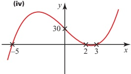

15

 $$ -8x^{3}-8x $$ 

16

 $$ x^{2}-2x-3 $$ 

17

(iv)

 $$ x^{2}+3x $$ 

 $$ 2x^{2}-5x+5 $$ 

18

## Exercise 1B (Page 14)

1 (ii) 0, 0, -8, -18, -24, -20, 0

(ii)  $ (x+3)(x+2)(x-3) $

(iii) -3, -2 or 3

5 (i) 0

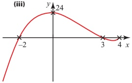

(iv)

(ii)  $ -1 \pm \sqrt{2} $

(iii)

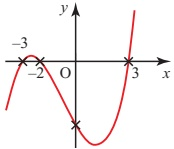

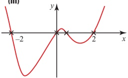

2(i) -15,0,3,0,-3,0,15

6(i) -4

(ii)  $ x(x+2)(x-2) $

(ii)  $ (x-1)^{2} $

(iii) -2, 0 or 2

(iii)

(iv)

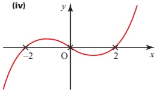

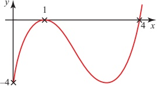

7 (i) a=2, b=1, c=2

(ii)  $ 0, \sqrt{3} $ or  $ -\sqrt{3} $

<!-- page 319 -->

P2

8 (i)

 $$ (x^{2}-4)(x^{2}-1) $$ 

(ii)  $ (x+2)(x-2)(x^{2}+1) $

(iii) Two real roots: -2 and 2

## Exercise 1C (Page 21)

9 (ii)  $ 2x^{2}+9x+11 $ remainder 19

1 (i) x = -9 or x = 1

(ii) x = -7 or x = 1

(iii) x = -1 or x = 7

10 (i)  $ \pm6 $,  $ \pm3 $,  $ \pm2 $,  $ \pm1 $,

(iv)

(ii) -1, 2 or 3

 $$ x=-\frac{3}{2}or x=2 $$ 

(v) x = -3 or x = 2

11 (i)  $ (x-1)(x-2)(x+2) $

(vi) x=1 or x=7

(ii)  $ (x+1)(x^{2}-x+1) $

(iii)  $ (x-2)(x^{2}+2x+5) $

(vii) x = -2 or x = 4

(iv)

(viii)

 $$ x=-\frac{8}{3}or x=2 $$ 

 $$ (x+2)(x^{2}-x+3) $$ 

12 (ii) (a)

(ix)

 $$ x=-1or x=\frac{3}{2} $$ 

 $$ x^{3}-2x^{2}+2x+2 $$ 

remainder -6

2(i) -8<x<2

(b)  $ x^{3}-3x^{2}+6x-6 $

(ii)  $ 0 \leq x \leq 4 $

remainder -2

(iii) x < -1 or x > 11

(c)  $ x^{2}-2x+4 $

(iv)  $ x \leq -3 $ or  $ x \geq 1 $

remainder -2x - 4

(v) -2 < x < 5

13 -12

(vi)  $ -\frac{2}{3} \leq x \leq 2 $

14 2 or -5

15 -5; 4; 4

3 (i)  $ |x-1|<2 $

16 -1; -7; 1, -2 or  $ \frac{3}{2} $

(ii)  $ |x-5|<3 $

17 (i) a=2, b=3

 $$  (iii)\mid x-1\mid<3 $$ 

(ii) 2x+1

(iv)  $ |x-2.5|<3.5 $

18 $a=2, b=-3$

19 (i) -13

(v)  $ |x-10|<0.1 $

(ii)  $ (x+2)(2x+1)(x-3) $

 $$ (vi)\mid x-4\mid<3.5 $$ 

20 (i) a = -4, b = 1

(ii) $(x-3)$ and $(x+1)$

21 (i) 4

(ii)

 $$ x^{2}-2x+2 $$ 

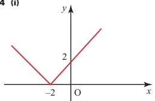

## (Page 17)

 $ g(3) = 3 $,  $ g(-3) = 3 $

## (Page 19)

 $ |x| < 2 $ and  $ x \geqslant 0 \Rightarrow 0 \leqslant x < 2 $

 $ |3+3|=6, |3-3|=0, $

 $ |x| < 2 $ and  $ x < 0 \Rightarrow -2 < x < 0 $

 $$ \left|3\right|+\left|3\right|=6,\left|3\right|+\left|-3\right|=6 $$ 

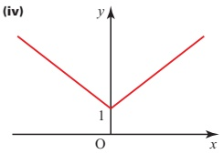

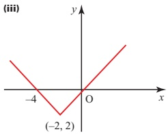

(v)

 $ (-2\frac{1}{2}, -4) $

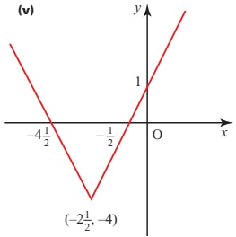

(ii)

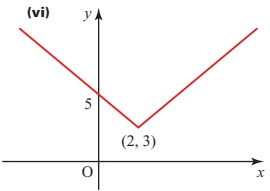

5 (i)  $ x < \frac{1}{2} $

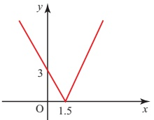

 $$ x<\frac{7}{2} $$ 

(iii)  $ x \geqslant -\frac{1}{2} $

(iv) -1 ≤ x ≤ 3

(v) x < -1 or x > 3

(vi)  $ x \leq -6 $ or  $ x \geq -\frac{4}{3} $

6  $ \frac{1}{2} $<x<1

7

 $$ x>\frac{1}{3} $$ 

8 x < 2a

<!-- page 320 -->

## Chapter 2

## ⑦ (Page 23)

Without using logarithms, you would probably use trial and improvement to find x where  $ x^{3} = 500 $.

(ii)  $ 3 \log x $

## Investigation (Page 24)

## Exercise 2A (Page 29)

5 (i)  $ 2 \log x $

1 (i)  $ x = \log_{3} 9, 2 $

(ii)  $ x = \log_{4} 64, 3 $

(iii)  $ \frac{1}{2}\log x $

(i) 10

(ii)

 $$ \frac{1}{2} $$ 

(iv)  $ \frac{11}{6}\log x $

(iii)  $ x = \log_{2} \frac{1}{4}, -2 $

(v)  $ 6 \log x $

(iv)  $ x = \log_{5} \frac{1}{5}, -1 $

(iii)  $ 10^{8.6/85} = 1.26 $

(v)  $ x = \log_{7} 1, 0 $

(vi)  $ \frac{5}{2}\log x $

(vi)  $ x = \log_{16} 2, \frac{1}{4} $

6(i) x<7

2 (i)  $ 3^{y}=9,2 $

(ii)  $ x \geqslant 3 $

(iii)  $ x \geqslant 3 $

(ii)  $ 5^{y}=125,3 $

### Activity 2.1 (Page 27)

(iv) x > 0.437

(iii)  $ 2^{y}=16 $, 4

(v)  $ x \leq 1 $

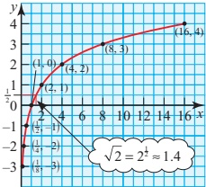

(iv) $6^{y}=1,0$

(vi)  $ x \geq 0.322 $

(v)  $ 64^{y} = 8, \frac{1}{2} $

(vii) 0.431  $ \leq x < 1.29 $

(vi)  $ 5^{y} = \frac{1}{25}, -2 $

(viii) 0 ≤ x < 0.827

3(i) 4

(ix) 1 < x < 2.58

(ii) -4

(x) 0.68 < x < 1.49

(iii)

## ⑦ (Page 28)

 $$ \frac{1}{2} $$ 

7  $ \log_{10}\frac{x^{2}}{7}, x=21 $

(iv) 0

 $ a^{0}=1,\log_{a}1=0 $

(v) 4

8 (i) x=19.93

 $ a^m = x > 0 $ (for  $ a > 0 $) so

 $ \log_a(x) = m $ is defined only for

 $ x > 0 $

(ii) x = -9.97

(vi) -4

(iii) x=9.01

(vii)

 $$ \frac{3}{2} $$ 

(iv) x=48.32

(viii)

(v) x=1375

 $$ \frac{1}{4} $$ 

Putting $x = \frac{1}{y}$ in $\log\left(\frac{1}{y}\right) = -\log y$

$\Rightarrow \log x = -\log\left(\frac{1}{x}\right): \text{as } x \to 0,$

$-\log\left(\frac{1}{x}\right) \to -\infty$

(ix)

⑨⑨

 $$ \frac{1}{2} $$ 

(x) -3

10(i) 25

(ii) 17

4 (i)  $ \log 10 $

There is no limit to $m$ in $a^{m}$

= $x$ and $\log_{a}x = m$; think, for

example, of base 2, i.e. $a = 2$.

Then $x = 2^{y}$. When $y = 1, 2, 3$,

4, … then $x = 2, 4, 8, 16, \ldots$. So

increases in $y$ are accompanied

by ever larger increases in $x$ and

so a decreasing gradient. This is

the case not just for $a = 2$ but for

any value of $a$ greater than 1.

(ii) $\log 2$

11 (i) 4 < y < 6

(iii)  $ \log 36 $

(ii) 1.26 < x < 1.63

(iv)

 $$ \log\frac{1}{7} $$ 

12 $y=\frac{\log 4-\log x}{\log 3}$

(v)  $ \log 3 $

(vi)  $ \log 4 $

13 $x=0.802$

(vii)  $ \log 4 $

 $$ \log\frac{1}{3} $$ 

 $ \log_{a}a=1 $

(ix)

 $$ \log\frac{1}{2} $$ 

## Exercise 2B (Page 35)

(x)  $ \log 12 $

Some of the questions in this exercise involve drawing a line of best fit by eye. Consequently your answers may reasonably vary a little from those given.

<!-- page 321 -->

1 (i) If the relationship is of the form  $ R = kT^{n} $, the graph of  $ \log R $ against  $ \log T $ will be a straight line.

(ii) Values of  $ \log R $: 5.46, 5.58, 5.72, 6.09, 6.55

Values of  $ \log T $: 0.28, 0.43, 0.65, 1.20, 1.90

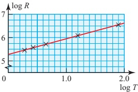

(iii)  $ k = 1.8 \times 10^{5} $, n = 0.690

(iv) 0.7 days

2 (ii) Plotting log A against t will test the model: if it is a straight line the model fits the data.

(iii) b = 1.4, k = 0.89

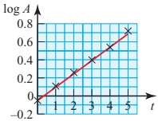

(iv) (a) t = 2.4 days

(b) A = 3.0 cm $ ^{2} $

(v) Exponential growth

3 (ii)  $ k = 3.2 \times 10^{6} $, a = 0.98

The constant k is the original number of trees.

4 (ii) k = 1100, n = 1.6

(iii) s = 2500 m

(iv) The train would not continue to accelerate like this throughout its journey. After 10 minutes it would probably be travelling at constant speed, or possibly even slowing down.

5 (ii) b = 1.37, k = 1.58

6 Taking logs of both sides,

 $ \log y = \log A + B \log x $.

Plotting log y against log x gives a straight line of gradient B and intercept log A.

This gives A = 1.5, B = 0.78.

The value of y that is wrong is 6.21. If x is 5.07, y should be 5.32 according to the equation.

7 $\log y = B \log x + \log A$.

He should plot $\log y$ against $\log x$. If this gives a straight line, there is a relationship of the form $y = Ax^{B}$. If there is no such relationship, the points will not be in a straight line.

The value of $\log A$ is given by the intercept on the $\log y$ axis.

The value of B is the gradient of the line.

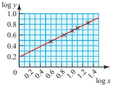

From the graph, A = 1.5, B = 0.5.

The formula is therefore

 $ y = 1.5x^{0.5} $

8(i)

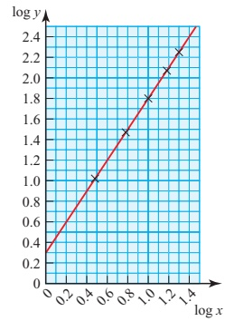

(ii) The graph is a straight line.

(iii) A = 2.0, n = 1.5

9 (ii)

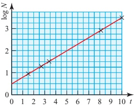

(iii)  $ a \approx 3 $,  $ b \approx 2 $

(v) Just over 3 million.

10 (ii)

<table border=1 style='margin: auto; word-wrap: break-word;'><tr><td style='text-align: center; word-wrap: break-word;'>$ \log_{10} d $</td><td style='text-align: center; word-wrap: break-word;'>$ \log_{10} z $</td></tr><tr><td style='text-align: center; word-wrap: break-word;'>2.89</td><td style='text-align: center; word-wrap: break-word;'>0.32</td></tr><tr><td style='text-align: center; word-wrap: break-word;'>2.91</td><td style='text-align: center; word-wrap: break-word;'>0.41</td></tr><tr><td style='text-align: center; word-wrap: break-word;'>2.94</td><td style='text-align: center; word-wrap: break-word;'>0.51</td></tr><tr><td style='text-align: center; word-wrap: break-word;'>2.97</td><td style='text-align: center; word-wrap: break-word;'>0.60</td></tr><tr><td style='text-align: center; word-wrap: break-word;'>3.00</td><td style='text-align: center; word-wrap: break-word;'>0.68</td></tr><tr><td style='text-align: center; word-wrap: break-word;'>3.02</td><td style='text-align: center; word-wrap: break-word;'>0.75</td></tr><tr><td style='text-align: center; word-wrap: break-word;'>3.05</td><td style='text-align: center; word-wrap: break-word;'>0.77</td></tr><tr><td style='text-align: center; word-wrap: break-word;'>3.07</td><td style='text-align: center; word-wrap: break-word;'>0.79</td></tr></table>

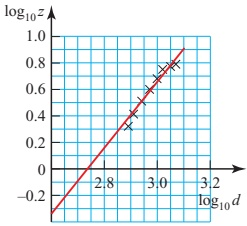

(iii)  $ D \approx 1050 $

(iv) n=3

(v) $d=840$ (nearest 10)

11 (i)  $ \frac{\log 4}{\log 3} $ (ii) 3.42

## (Page 40)

 $ \frac{1}{x}=x^{-1} $. This means that n=-1

and so  $ n+1=0 $. You cannot divide by zero.

<!-- page 322 -->

## Investigation (Page 40)

(i) 1.099

(ii) 0.693

(iii) 1.792

 $$ \int_{1}^{3}\frac{1}{x}\mathrm{d}x+\int_{1}^{2}\frac{1}{x}\mathrm{d}x=\int_{1}^{6}\frac{1}{x}\mathrm{d}x $$ 

### Activity 2.2 (Page 41)

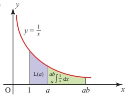

(ii)  $ x = az \Rightarrow \mathrm{d}x = a\mathrm{d}z $

Activity 2.4 (Page 42)

1  $ x = x_{0} e^{kt} $

## Exercise 2C (Page 47)

2  $ t = \frac{1}{k} \ln\left(\frac{s_0}{s}\right) $

e = 2.72 (2 d.p.)

 $ 3\ p = 25\mathrm{e}^{-0.02t} $

4  $ x = \ln\left(\frac{y-5}{y_0-5}\right) $

5 (i) x = 0.0540

(ii) x=0.0339

Converting the limits:

x = a  $ \Rightarrow $ z = 1

(iii) x = 0.238

x = ab \Rightarrow z = b

(iv) x = 0.693

$$\int_{a}^{ab}\frac{1}{x}\mathrm{d}x=\int_{1}^{b}\frac{1}{az}\times a\mathrm{d}z$$

$$=\int_{1}^{b}\frac{1}{z}\mathrm{d}z$$

(v) x=1.386

 $$ \int_{1}^{b}\frac{1}{z}\mathrm{d}z=\int_{1}^{b}\frac{1}{x}\mathrm{d}x=\mathrm{L}(b) $$ 

(vi) x=1.099

6(i)

(iii)  $ \mathrm{L}(a) + \int_{a}^{ab} \frac{1}{x} \mathrm{d}x = \mathrm{L}(ab) $

 $ \Rightarrow \mathrm{L}(a) + \mathrm{L}(b) = \mathrm{L}(ab) $

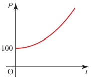

(ii) 100

## (Page 51)

Possible answers are:

(iii) 1218

(ii) $x=60^{\circ},300^{\circ}$

(iii)  $ x = 14.0^{\circ} $,  $ 194.0^{\circ} $

## Chapter 3

Bridge: wavelength 50–100 m; amplitude 15–30 m

(iv)  $ x = 109.5^{\circ} $,  $ 250.5^{\circ} $

(v)  $ x = 135^{\circ}, 315^{\circ} $

(iv) 184 years

7 (i) 1m

Ripple: wavelength 0.02–0.05 m; amplitude 0.005–0.01 m

(ii) 4.61 m, 6.09 years

1 (i)  $ x=90^{\circ} $

(vi) $x=210^{\circ},330^{\circ}$

### Activity 2.3 (Page 41)

Bridge:  $ a = 15 - 30 $;  $ b = \frac{\pi}{50} - \frac{\pi}{25} $

(about 0.06–0.13)

## Exercise 3A (Page 54)

Ripple: a = 0.005–0.01; b = 125–300

2(i)-1

(ii)

 $$ \frac{-2}{\sqrt{3}} $$ 

(i)  $  \mathrm{L}(1) = \int_{1}^{1} \frac{1}{x} \, dx = 0  $

(iii)

(iii)  $ a = e^{-2} = 0.135 $, b = 2.5

 $$ \frac{-2}{\sqrt{3}} $$ 

(iv)

 $$ \frac{-2}{\sqrt{3}} $$ 

(iv) 11 years

(v) 0

$$\mathrm{L}(a)-\mathrm{L}(b)=\int_{1}^{a}\frac{1}{x}\,\mathrm{d}x-\int_{1}^{b}\frac{1}{x}\,\mathrm{d}x$$

$$=\int_{b}^{a}\frac{1}{x}\,\mathrm{d}x$$

(ii)

8  $ y=\frac{5}{x^{2}-1} $

(vi)  $ -\sqrt{2} $

3 (i)  $ B = 60^{\circ}, C = 30^{\circ} $

(ii)  $ \sqrt{3} $

$$\int_{b}^{a}\frac{1}{x}\mathrm{d}x=\int_{1}^{\frac{a}{b}}\frac{1}{z}\,\mathrm{d}z$$

$$=\mathrm{L}\left(\frac{a}{b}\right)$$

Let x = bz

10 x = 0.481

☒ 4.11

4 (i)  $ L = 45^{\circ} $,  $ N = 45^{\circ} $

(ii)  $ \sqrt{2}, \sqrt{2}, 1 $

12 $x = -1.68$

5 (ii)

11 A = 3.67, b = 1.28

 $$ 14.0^{\circ} $$ 

(iii)  $ \mathrm{L}(a^n) = \int_1^{a^n} \frac{1}{x} \, dx $

6 (i)  $ 0 \leq \alpha \leq 90^{\circ} $

13 A = 2.01, n = 0.25

(ii) No, for each of the second, third and fourth quadrants a different function is positive.

 $$  Let x=z^{n}then\mathrm{d}x=nz^{n-1}\mathrm{d}z. $$ 

 $$ \begin{aligned}\int_{1}^{a}\frac{1}{x}\mathrm{d}x&=\int_{1}^{a}\frac{1}{z^{n}}\times n z^{n-1}\mathrm{d}z\\&=n\int_{1}^{a}\frac{1}{z}\mathrm{d}z\\&=n\mathrm{L}(a)\end{aligned} $$ 

(iii) No, the graphs of the three functions do not intersect at a single point.

## P2

7 (ii)  $ x=0^{\circ}, 180^{\circ}, 360^{\circ} $

(iii)  $ x=45^{\circ}, 225^{\circ} $

<!-- page 323 -->

P2

(iii)  $ x = 60^{\circ}, 300^{\circ} $

(iv) $x=54.7, 125.3^{\circ}, 234.7^{\circ}, 305.3^{\circ}$

(v)  $ x = 18.4^{\circ} $,  $ 71.6^{\circ} $,  $ 198.4^{\circ} $,  $ 251.6^{\circ} $

(vi)  $ x = 45^{\circ} $,  $ 135^{\circ} $,  $ 225^{\circ} $,  $ 315^{\circ} $

### Activity 3.1 (Page 55)

 $ y = \sin(\theta + 60^\circ) $ is obtained from  $ y = \sin\theta $ by a translation  $ \begin{pmatrix} -60^\circ \\ 0 \end{pmatrix} $.  $ y = \cos(\theta - 60^\circ) $ is obtained from  $ y = \sin\theta $ by a translation  $ \begin{pmatrix} 60^\circ \\ 0 \end{pmatrix} $.

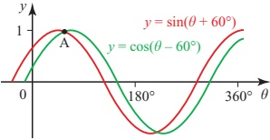

It appears that the  $ \theta $ co-ordinate of A is midway between the two maxima  $ (30^{\circ}, 1) $ and  $ (60^{\circ}, 1) $.

Checking:

 $$ \begin{aligned}\theta=45^{\circ}\Rightarrow\sin(\theta+60^{\circ})=0.966\\ \cos(\theta-60^{\circ})=0.966.\end{aligned} $$ 

If  $ 60^{\circ} $ is replaced by  $ 35^{\circ} $, using the trace function on a graphic calculator would enable the solutions to be found.

## p (Page 56)

Area of a triangle =  $ \frac{1}{2} $ base × height.

The definitions of sine and cosine in a right-angled triangle.

### Activity 3.2 (Page 57)

(i)  $ \sin(\theta + \phi) = \sin\theta\cos\phi + \cos\theta\sin\phi \Rightarrow \sin[(90^\circ - \theta) + \phi] = \sin(90^\circ - \theta)\cos\phi + \cos(90^\circ - \theta)\sin\phi \Rightarrow \sin[90^\circ - (\theta - \phi)] = \cos\theta\cos\phi + \sin\theta\sin\phi \Rightarrow \cos(\theta - \phi) = \cos\theta\cos\phi + \sin\theta\sin\phi $

 $$ \begin{aligned}1\ &\Rightarrow\cos[\theta-(-\phi)]\\&=\cos\theta\cos(-\phi)+\sin\theta\sin(-\phi)\\\Rightarrow&\cos(\theta+\phi)\\&=\cos\theta\cos\phi-\sin\theta\sin\phi\end{aligned} $$ 

(iii)  $ \tan(\theta + \phi) = \frac{\sin(\theta + \phi)}{\cos(\theta + \phi)} $

 $ = \frac{\sin\theta\cos\phi + \cos\theta\sin\phi}{\cos\theta\cos\phi - \sin\theta\sin\phi} $

 $ = \frac{\sin\theta\cos\phi}{\cos\theta\cos\phi} + \frac{\cos\theta\sin\phi}{\cos\theta\cos\phi} $

 $ \frac{\cos\theta\cos\phi}{\cos\theta\cos\phi} - \frac{\sin\theta\sin\phi}{\cos\theta\cos\phi} $

 $ = \frac{\tan\theta + \tan\phi}{1 - \tan\theta\tan\phi} $

(v)  $ \frac{\tan\theta+1}{1-\tan\theta} $

(vi)  $ \frac{\tan\theta-1}{1+\tan\theta} $

3 (i) $\sin\theta$

(ii) $\cos8\phi$

(iii) 0

(iv) $\cos2\theta$

$$(\mathbf{iv})\tan[\theta+(-\phi)]=\frac{\tan\theta+\tan(-\phi)}{1-\tan\theta\tan(-\phi)}$$

$$\tan(\theta-\phi)=\frac{\tan\theta-\tan\phi}{1+\tan\theta\tan\phi}$$

(iii)  $ \frac{1}{2}(\sqrt{3}\cos\theta-\sin\theta) $

(ii)  $ \frac{1}{2}(\sqrt{3}\cos\theta+\sin\theta) $

 $$ \frac{1}{\sqrt{2}}(\cos2\theta-\sin2\theta) $$ 

## p (Page 57)

4 (i) $\theta=15^{\circ}$

(ii) $\theta=157.5^{\circ}$

(iii) $\theta=0^{\circ}$ or $180^{\circ}$

(iv) $\theta=111.7^{\circ}$

No. In part (iii) you get

 $$ \frac{1}{\sqrt{2}}(\sin\theta+\cos\theta) $$ 

## Exercise 3B (Page 59)

 $$ \tan90^{\circ}=\frac{\sqrt{3}+\frac{1}{\sqrt{3}}}{1-\sqrt{3}\times\frac{1}{\sqrt{3}}} $$ 

1 (i)  $ \frac{\sqrt{3}}{2\sqrt{2}}+\frac{1}{2\sqrt{2}} $

(ii)  $ -\frac{1}{\sqrt{2}} $

(iii)  $ \frac{\sqrt{3}-1}{\sqrt{3}+1} $

(iv)  $ \frac{\sqrt{3}+1}{\sqrt{3}-1} $

Neither tan $90^{\circ}$ nor $\frac{1}{1-1}$ is defined.

For the result to be valid you must

exclude the case when $\theta+\phi=90^{\circ}$

(or $270^{\circ},450^{\circ},...$)

Similarly in part (iv) you must

exclude $\theta-\phi=90^{\circ},270^{\circ}$, etc.

$(\mathbf{v})\quad\theta=165^{\circ}$

5 (i)  $ \theta = \frac{\pi}{8} $

(ii)  $ \theta=2.79 $ radians

6 (i)  $ \frac{1}{\sqrt{5}} $

(ii)  $ \sin\beta=\frac{3}{5} $,  $ \cos\beta=\frac{4}{5} $

7 (ii)  $ x = 10.9^\circ, -169.1^\circ $

8 (ii)  $ x=22.5^{\circ}, 112.5^{\circ} $

 $$ \begin{array}{l}\alpha=26.6^{\circ}\text{and}\beta=45^{\circ}\text{or}\\\alpha=135^{\circ}\text{and}\beta=116.6^{\circ}\end{array} $$ 

10 (ii)  $ \theta = 24.7^\circ $,  $ 95.3^\circ $

## P (Page 61)

For $\sin 2\theta$ and $\cos 2\theta$, substituting $\theta = 45^\circ$ is helpful.

You know that $\sin 45^\circ = \cos 45^\circ = \frac{1}{\sqrt{2}}$ and that $\sin 90^\circ = 1$ and $\cos 90^\circ = 0$.

For $\tan 2\theta$ you cannot use $\theta = 45^\circ$.

Take $\theta = 30^\circ$ instead; $\tan 30^\circ = \frac{1}{\sqrt{3}}$ and $\tan 60^\circ = \sqrt{3}$.

No, checking like this is not the same as proof.

## Exercise 3C (Page 65)

1 (ii) $\theta = 14.5^{\circ}, 90^{\circ}, 165.5^{\circ}, 270^{\circ}$

(ii) $\theta = 0^{\circ}, 35.3^{\circ}, 144.7^{\circ}, 180^{\circ}, 215.3^{\circ}, 324.7^{\circ}, 360^{\circ}$

(iii) $\theta = 90^{\circ}, 210^{\circ}, 330^{\circ}$

(iv) $\theta = 30^{\circ}, 150^{\circ}, 210^{\circ}, 330^{\circ}$

(v) $\theta = 0^{\circ}, 138.6^{\circ}, 221.4^{\circ}, 360^{\circ}$

<!-- page 324 -->

2 (i)  $ \theta = -\pi, 0, \pi $

3 (i)  $ \sqrt{5}\sin(\theta+63.4^{\circ}) $

(ii)  $ \theta = -\pi, 0, \pi $

(ii) $3\sin(\theta+48.2^{\circ})$

(iii)  $ \theta = \frac{-2\pi}{3} $, 0,  $ \frac{2\pi}{3} $

4 (i)  $ \sqrt{2}\sin\left(\theta-\frac{\pi}{4}\right) $

(iv)  $ \theta = \frac{-3\pi}{4}, \frac{-\pi}{4}, \frac{\pi}{4}, \frac{3\pi}{4} $

(ii) $3\sin(\theta-0.49\text{ rad})$

(v)  $ \theta = \frac{-11\pi}{12}, \frac{-3\pi}{4}, \frac{-7\pi}{12}, \frac{-\pi}{4}, \frac{\pi}{12} $,

5 (i)  $ 2\cos(\theta - (-60^\circ)) $

(ii)  $ 4\cos(\theta - (-45^\circ)) $

 $$ \frac{\pi}{4},\frac{5\pi}{12},\frac{3\pi}{4} $$ 

(iii)  $ 2\cos(\theta - 30^\circ) $

3  $ 3\sin\theta - 4\sin^{3}\theta $,

(iv)  $ 13\cos(\theta - 22.6^\circ) $

(v)  $ 2\cos(\theta - 150^\circ) $

 $$ \theta=0,\frac{\pi}{4},\frac{3\pi}{4},\pi,\frac{5\pi}{4},\frac{7\pi}{4},2\pi $$ 

(vi)  $ 2\cos(\theta - 135^\circ) $

4 $\theta = 51^{\circ}, 309^{\circ}$

5 cot $ \theta $

6 (i) $13\cos(\theta+67.4^\circ)$

6  $ \frac{\tan\theta(3-\tan^{2}\theta)}{1-3\tan^{2}\theta} $

(ii) Max 13, min -13

8 (ii)  $ \theta = 63.4^{\circ} $

9(i)

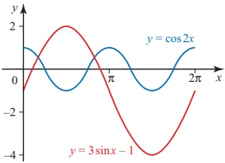

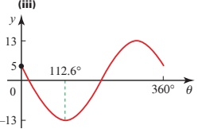

(iii)  $ x = \frac{\pi}{6}, \frac{5\pi}{6} $

(iv)  $ \theta=4.7^{\circ} $,  $ 220.5^{\circ} $

7 (i)  $ 2\sqrt{3}\sin\left(\theta-\frac{\pi}{6}\right) $

(ii) Max  $ 2\sqrt{3} $,  $ \theta = \frac{2\pi}{3} $;

10 (ii)  $ \theta=27.2^{\circ}, 152.8^{\circ}, 207.2^{\circ}, 332.8^{\circ} $

 $$ \min-2\sqrt{3},\theta=\frac{5\pi}{3} $$ 

(ii)  $ \tan2a = -\frac{24}{7} $,  $ \tan3a = -\frac{44}{117} $

11 (i)  $ \cos x \cos a - \sin x \sin a $

12 (i)  $ \frac{1}{10}(4\sqrt{3}-3) $

11 (ii)  $ \theta=26.6^{\circ} $,  $ 206.6^{\circ} $

10 (ii)  $ \theta = 30.6^\circ $,  $ 82.0^\circ $

(ii)  $ r = \sqrt{29} $,  $ a = 68.2^\circ $

(iii) Max  $ \sqrt{29} $ when  $ x=291.8^{\circ} $,

 $ \min -\sqrt{29} $ when  $ x=111.8^{\circ} $

## Exercise 3D (Page 70)

(ii) Max  $ \sqrt{3} $,  $ \theta = 54.7^\circ $;

(iv)  $ \theta=53.8^{\circ} $,  $ 159.9^{\circ} $,  $ 233.8^{\circ} $,  $ 339.9^{\circ} $

(iii)

9 (i)  $ \sqrt{3}\cos(\theta - 54.7^{\circ}) $

1 (i)  $ \sqrt{2}\cos(\theta-45^{\circ}) $

 $$ \min-\sqrt{3},\theta=234.7^{\circ} $$ 

 $ \min \frac{1}{3 + \sqrt{3}}, \theta = 54.7^\circ $

(iv)  $ \theta = \frac{\pi}{3} $,  $ \pi $

(iv) Max  $ \frac{1}{3 - \sqrt{3}}, \theta = 234.7^\circ $;

(iii)

(ii) $29\cos(\theta-46.4^{\circ})$

8 (i)  $ \sqrt{13}\sin(2\theta+56.3^{\circ}) $

(iv)  $ x = 235.7^\circ $,  $ 347.9^\circ $

(iii) $2\cos(\theta - 60^\circ)$

(ii) Max  $ \sqrt{13} $,  $ \theta = 16.8^\circ $;

min  $ -\sqrt{13} $,  $ \theta = 106.8^\circ $

(iv)  $ 3 \cos(\theta - 41.8^\circ) $

12 (i)  $ 30.96^{\circ} $

(ii) x=15.7°, 282.4°

(iii)  $ x=7.9^{\circ} $,  $ 141.2^{\circ} $,  $ 187.9^{\circ} $,  $ 321.2^{\circ} $

(ii)  $ 2\cos\left(\theta+\frac{\pi}{6}\right) $

2 (i)  $ \sqrt{2}\cos\left(\theta+\frac{\pi}{4}\right) $

13 (i) R = 10, a = 53.13°

(ii)

P2

(iii)  $ x=119.55^{\circ} $,  $ 346.71^{\circ} $

(iv)  $ \theta = 103.29^{\circ} $,  $ 330.45^{\circ} $

<!-- page 325 -->

P2

14 (i)  $ c = \sqrt{a^{2} + b^{2}} $

4 (i)  $ \theta = 4.4^{\circ}, 95.6^{\circ} $

(ii)  $ \tan a = \frac{b}{a} $

(iii) $a=36.87^{\circ}$

(ii)  $ \theta = 199.5^{\circ}, 340.5^{\circ} $

(iv)  $ \theta = 103.29^{\circ} $,  $ 330.45^{\circ} $

15 (i) $5\cos(x-53.13^{\circ})$

(ii)  $ x=27.29^{\circ}, 78.97^{\circ} $

16 (i)  $ \sqrt{26}\cos(\theta+11.31^{\circ}) $

17 (i)  $ 25\cos(\theta-73.74^{\circ}) $

(ii)  $ \theta=20.6^{\circ}, 126.9^{\circ} $

(ii)  $ \theta = 27.02^{\circ} $,  $ 310.36^{\circ} $

18 $\theta = 81.3^{\circ}$, $172.4^{\circ}$

## Investigation (Page 74)

(iii)  $ \theta = \frac{-\pi}{6}, \frac{\pi}{2} $

The total current is

$$

\begin{aligned}

I &= A_1 \sin \omega t + A_2 \sin \omega t \cos a \\

& + A_2 \cos \omega t \sin a \\

&= (A_1 + A_2 \cos a) \sin \omega t \\

& + (A_2 \sin a) \cos \omega t

\end{aligned}

$$

 $ I = A_1 \sin \omega t + A_2 \sin (\omega t + \alpha) $

(where  $ \omega = 2\pi f $).

Let  $ A_{1} + A_{2} \cos \alpha = P $ and  $ A_{2} \sin \alpha = Q $

so  $ I = P\sin\omega t + Q\cos\omega t $

 $ = \sqrt{P^{2} + Q^{2}} \sin(\omega t + \varepsilon) $

(iv)  $ \theta = -15.9^\circ $,  $ 164.1^\circ $

where  $ \varepsilon = \tan^{-1}\left(\frac{Q}{P}\right) $.

This is a sine wave with the same frequency but a greater amplitude. The phase angle  $ \varepsilon $ is between 0 and  $ a $.

## Exercise 3E (Page 74)

(iv) The two tangents are parallel.

(iii) -1; y = -x + 4

(v)  $ \theta = \frac{\pi}{2}, \frac{\pi}{6}, \frac{5\pi}{6} $

(vi)  $ \theta = 20.8^{\circ} $,  $ 122.3^{\circ} $

1 (i)  $ \sin6\theta $

3(i) $3x(x-2)$

(vii)  $ \theta = 76.0^{\circ} $,  $ 135^{\circ} $

(ii) $\cos6\theta$

(ii) (0, 4), maximum;

(2, 0), minimum

## Chapter 4

(ii) $4y + x = 12$

### Activity 4.1 (Page 81)

$$y = \frac{u}{\nu} \quad \text{where } u = x^{10} \quad \text{and} \quad \nu = x^{7}$$

gives $$ \frac{\mathrm{d}u}{\mathrm{d}x} = 10x^{9} \quad \text{and} \quad \frac{\mathrm{d}\nu}{\mathrm{d}x} = 7x^{6} $$

$$4 \quad (\mathrm{i}) \quad -\frac{1}{(x-4)^{2}}$$

(iii) 1

(iii) y = x - 3

(iv) $\cos\theta$

1 (i)

x(5x^{3}-3x+6)

\begin{array}{l}\frac{\mathrm{d}y}{\mathrm{d}x}=\frac{\nu\frac{\mathrm{d}u}{\mathrm{d}x}-u\frac{\mathrm{d}\nu}{\mathrm{d}x}}{\nu^{2}}\\=\frac{x^{7}\times10x^{9}-x^{10}\times7x^{6}}{x^{14}}\\=\frac{10x^{16}-7x^{16}}{x^{14}}=3x^{2}\\y=\frac{u}{\nu}=\frac{x^{10}}{x^{7}}=x^{3}\Rightarrow\frac{\mathrm{d}y}{\mathrm{d}x}=3x^{2}\end{array}

5 (i)  $ \frac{\sqrt{x}-2}{(\sqrt{x}-1)^2} $

(v) $\sin\theta$

Using the quotient rule,

## Exercise 4A (Page 82)

 $$ x^{4}(21x^{2}+24x-35) $$ 

(iii)

(ii)  $ \frac{1}{4} $

(iv)  $ \frac{dy}{dx} \neq 0 $ for any value of x

 $$ 2x(6x+1)(2x+1)^{3} $$ 

(vi)  $ \frac{3}{2}\sin 2\theta $

(iv)  $ -\frac{2}{(3x-1)^{2}} $

(iii) (4, 8)

(iv) Tangent: y=8; normal: x=4

(v)

(vii)  $ \cos\theta $

(v) (a) Q $ \left(\frac{37}{4},8\right) $

(b) R(4,29)

 $$ \frac{x^{2}(x^{2}+3)}{(x^{2}+1)^{2}} $$ 

(viii) -1

(vi)  $ 2(2x+1)(12x^{2}+3x-8) $

6 (i)  $ \frac{2(x+1)(x+2)}{(2x+3)^{2}} $

(vii)  $ \frac{2(1+6x-2x^2)}{(2x^2+1)^2} $

(ii)  $ (-1, -2) $;  $ (-2, -3) $

(viii)  $ \frac{7-x}{(x+3)^3} $

(iii) (-1, -2), minimum;

(-2, -3), maximum

(ix)

2(i) $1-\sin2x$

7 (i)  $ \frac{2x(x+1)}{(2x+1)^2} $; (0,0) and (-1,-1)

 $$ \frac{3x-1}{2\sqrt{x-1}} $$ 

(ii)  $ \cos2x $

2(i)

(ii) (0, 0) minimum;

(-1, -1) maximum

 $$ -\frac{1}{(x-1)^{2}} $$ 

(iii)  $ \frac{1}{2}(5\cos2x-1) $

(ii) -1; y = -x

8 (i)  $ \frac{3\sqrt{2}}{2} $

(iii)  $ \frac{3}{2} $; 3; gradient =  $ \infty $

<!-- page 326 -->

## P (Page 85)

$$\frac{\mathrm{d}}{\mathrm{d}x}(f(x))\text{ is a polynomial of order}$$

$$(n-1)\text{ so it has no term in }x^{n}.$$

## (Page 87)

 $ y = \ln(3x) $ is a translation of  $ y = \ln(x) $ through  $ \begin{pmatrix} 0 \\ 3 \end{pmatrix} $.

The curves have the same shape.

The gradient function is valid for x > 0.

## Exercise 4B (Page 89)

1 (i)

 $$ \frac{3}{x} $$ 

(iii)

 $$ \frac{1}{x} $$ 

(iv)  $ \frac{2x}{x^{2}+1} $

 $$ \frac{2}{x} $$ 

6 (i)  $ \frac{e^{x}(x-1)}{x^{2}} $

(iii)  $ \left(-\frac{1}{e}, \frac{2}{e}\right) $, maximum;

 $ \left(\frac{1}{e}, -\frac{2}{e}\right) $, minimum

 $$ -\frac{1}{x} $$ 

(ii) (1, e), minimum

(vi)  $ 1 + \ln x $

(vii)  $ x(1+2\ln(4x)) $

(iii)

(viii)  $ -\frac{1}{x(x+1)} $

(ii)  $ f'(x) = 2 + \ln(x^2) $;  $ f''(x) = \frac{2}{x} $

7 (i)  $ y = \ln x \Rightarrow \frac{dy}{dx} = \frac{1}{x}; $

 $ y = x \ln x \Rightarrow \frac{dy}{dx} = 1 + \ln x $

(ix)  $ \frac{x}{x^{2}-1} $

(x)  $ \frac{1-2\ln x}{x^{3}} $

(ii)  $ (-1, -\frac{1}{e}) $

8 (i)  $ (1 - x)e^{-x} $

(ii)  $ \left(1,\frac{1}{e}\right) $

5 (i) Rotation symmetry, centre $(0,0)$ of order 2. f(x) is an odd function since $f(-x) = -f(x)$.

2(i) $3e^{x}$

(ii)

9(i) 1

(ii)  $ \mathrm{f}^{\prime}(x)=\frac{1-\ln x}{x^{2}}; $

 $$ 2e^{2x} $$ 

(iii)

 $ f''(x)=\frac{2\ln x-3}{x^{3}} $

 $$ 2x e^{x^{2}} $$ 

(iv)  $ 2(x+1)e^{(x+1)^2} $

(iii)  $ \frac{1}{e}; -\frac{1}{e^{3}} $

(v)

 $  \mathrm{e}^{4x} (1 + 4x)  $

10 (4,  $ 4e^{-2} $)

(viii)  $ 6e^{2x}(e^{2x}+1)^{2} $

 $$ 2x^{2}\mathrm{e}^{-x}(3-x) $$ 

 $$ \frac{1-x}{e^{x}} $$ 

3 (i) 0.108e^{0.9t}

11 (i) (1, -e)

(ii) Minimum

12 (ii)  $ ey - 2x + 1 = 0 $

(ii)  $ 0.108 \, \text{m} \, \text{h}^{-1} $;  $ 0.266 \, \text{m} \, \text{h}^{-1} $;

 $ 0.653 \, \text{m} \, \text{h}^{-1} $;  $ 1.61 \, \text{m} \, \text{h}^{-1} $

4 (i)  $ \frac{dy}{dx} = (1 + x)e^x $;

 $ \frac{\mathrm{d}^{2}y}{\mathrm{d}x^{2}}=(2+x)\mathrm{e}^{x} $

When $y=\sin x$ the graph of $\frac{\mathrm{d}y}{\mathrm{d}x}$ against $x$ looks like the graph of $\cos x$.

Activity 4.2 (Page 92)

## (Page 93)

No. You can see this if you draw both graphs.

## p (Page 93)

This is a demonstration but ‘looking like’ is not the same as proof.

Activity 4.3 (Page 93)

$$\frac{\mathrm{d}y}{\mathrm{d}x} = \frac{\cos x(\cos x) - \sin x(-\sin x)}{\cos^2 x}$$

$$= \frac{\cos^2 x + \sin^2 x}{\cos^2 x} = \frac{1}{\cos^2 x}$$

$$= \sec^2 x$$

 $$ y=\tan x=\frac{\sin x}{\cos x} $$ 

## Exercise 4C (Page 96)

1 (i)  $ -2\sin x + \cos x $

(ii)  $ \sec^{2}x $

(iii)  $ \cos x + \sin x $

2 (i)  $ x \sec^{2} x + \tan x $

P2

(ii)  $ \cos^{2}x - \sin^{2}x = \cos 2x $

(iii)  $ \mathrm{e}^{x}(\sin x + \cos x) $

3 (i)  $ \frac{x\cos x-\sin x}{x^{2}} $

(ii)  $ \mathrm{e}^{x}(\cos x + \sin x)\sec^{2}x $

(iii)  $ \frac{\sin x(1-\sin x)-\cos x(x+\cos x)}{\sin^{2}x} $

<!-- page 327 -->

P2

4 (i)  $ 2x\sec^{2}(x^{2}+1) $

(ii)  $ 2\cos2x $

(iii)  $ x\frac{\mathrm{d}y}{\mathrm{d}x}+y+1+\frac{\mathrm{d}y}{\mathrm{d}x} $

(iii)  $ \frac{1}{\tan x} $

(iv)

(iv)  $ -\sin y\frac{dy}{dx} $

5 (i)  $ -\frac{\sin x}{2\sqrt{\cos x}} $

(v)  $  \mathrm{e}^{(y+2)}\frac{\mathrm{d}y}{\mathrm{d}x}  $

(ii)  $ \mathrm{e}^{x}(\tan x + \sec^{2}x) $

(vi)  $ y^{3} + 3xy^{2}\frac{dy}{dx} $

(iii)  $ 8x \cos 4x^{2} $

8 (ii) (1, -3), (-1, 3)

(vii)  $ 4xy^{5} + 10x^{2}y^{4}\frac{\mathrm{d}y}{\mathrm{d}x} $

(iv)  $ -2\sin 2xe^{\cos 2x} $

9 (ii) 4x - 5y = -12

(v)  $ \frac{1}{1+\cos x} $

(viii)  $ 1 + \frac{1}{y} \frac{dy}{dx} $

10 (ii) (2,1), (-2,-1)

(vi)  $ \frac{1}{\sin x \cos x} $

(ix)  $ xe^{y}\frac{\mathrm{d}y}{\mathrm{d}x}+e^{y}+\sin y\frac{\mathrm{d}y}{\mathrm{d}x} $

6 (i)  $ \cos x - x \sin x $

11 (i)  $ \frac{3x^{2}-2xy}{x^{2}+3y^{2}} $

(ii) 8x - 7y - 9 = 0

(x)  $ \frac{x^{2}}{y}\frac{\mathrm{d}y}{\mathrm{d}x} + 2x\ln y $

(ii) -1

(iii) y = -x

(xi)  $  \mathrm{e}^{\sin y} + x \cos y \mathrm{e}^{\sin y} \frac{\mathrm{d}y}{\mathrm{d}x}  $

12 (a, -2a)

(iv) y = x - 2 $ \pi $

7  $ \frac{dy}{dx} = e^x \cos 3x - 3e^x \sin 3x $

 $ \frac{d^2 y}{dx^2} = -6e^x \sin 3x - 8e^x \cos 3x $

$$

\begin{aligned}

& \tan y + x \sec^2 y \frac{\mathrm{d}y}{\mathrm{d}x} \\

& - (\tan x \frac{\mathrm{d}y}{\mathrm{d}x} + y \sec^2 x)

\end{aligned}

$$

## (Page 105)

2  $ \frac{1}{5} $

At points where the rate of change of gradient is greatest.

8 (i)  $  \mathrm{e}^{-x} \left( \cos x - \sin x \right)  $

30

## Exercise 4E (Page 112)

1 (i) t

(iii) (0.79, 0.32), (-2.4, -7.5)

4 (i) 0

(ii) y = -1

(ii)  $ \frac{1+\cos\theta}{1+\sin\theta} $

(iv) Differentiate with respect to x again and evaluate the second derivative at the stationary points.

5 (1, -2) and (-1, 2)

(iii)  $ \frac{t^{2}+1}{t^{2}-1} $

9 Maximum at  $ x = \frac{1}{6}\pi $,

minimum at  $ x = \frac{5}{6}\pi $

6(i)  $ \frac{y+4}{6-x} $

(iv)  $ -\frac{2}{3}\cot\theta $

(ii) x-2y-11=0

(v)  $ \frac{t-1}{t+1} $

(iii)  $ (2,-4\frac{1}{2}) $

(vi)  $ -\tan\theta $

10 Maximum at  $ x = \frac{1}{12}\pi $,

minimum at  $ x = \frac{5}{12}\pi $

(iv)

(vii)  $ \frac{1}{2e^{t}} $

11 (i)  $ \frac{1}{4}\pi $

(ii) Maximum

(viii)  $ \frac{(1+t)^2}{(1-t)^2} $

(ii)  $ y = 6x - \sqrt{3} $

2(i) 6

12  $ -\frac{1}{4}\pi $

Asymptotes x=6, y=-4

(iii)  $ 3x + 18y - 19\sqrt{3} = 0 $

## (Page 99)

3 (i)  $ \left(\frac{1}{4}, 0\right) $

The mapping is one-to-many.

7 (i)  $ \ln y = x \ln x $

(ii) 2

## Exercise 4D (Page 102)

 $ \frac{1}{y}\frac{dy}{dx}=1+\ln x $

(iii)  $ y = 2x - \frac{1}{2} $

1 (i)  $ 4y^{3}\frac{dy}{dx} $

(iv)  $ (0, -\frac{1}{2}) $

(iii) (0.368, 0.692)

(ii)  $ 2x + 3y^{2}\frac{d y}{d x} $

4.（ii） $ x - ty + at^{2} = 0 $

(ii)  $ tx + y = at^{3} + 2at $

(iii)  $ (at^{2}+2a,0) $,  $ (0,at^{3}+2at) $

318

<!-- page 328 -->

6 (i)  $ -\frac{b}{at^{2}} $

(ii)  $ at^{2}y + bx = 2abt $

(iii) X(2at, 0), Y(0,  $ \frac{2b}{t} $)

## Exercise 5A (Page 120)

1 (i)  $ 3\ln\left|x\right|+c $

(ii)  $ \frac{1}{4}\ln|x| + c $

(iv) Area = 2ab

(iii)  $ \ln |x - 5| + c $

7 (ii) $y = tx - 2t^{2}$

(iii) $[2(t_{1} + t_{2}), 2t_{1}t_{2}]$

(iv) $x=4$

(iv)  $ \frac{1}{2}\ln\left|2x-9\right|+c $

Scheme B: R = 2.594

2(i)

Scheme C: R = 2.653

 $$ \frac{1}{3}e^{3x}+c $$ 

8 (i) t = 1

1000 instalments: R = 2.717

(ii)  $ -\frac{1}{4}e^{-4x} + c $

(iii) $x + y = 3$

(iii)  $ -3e^{-x/3} + c $

 $ 10^{4} $ instalments: R = 2.718

(v) (-8, -5)

(iv)  $ -\frac{2}{e^{5x}}+c $

e = 2.71828183 (8 d.p.)

Compound interest

9 (i) t = -2

 $$ a_{4}=\frac{1}{4!} $$ 

(v)  $ e^{x} - 2e^{-2x} + c $

(iii) y=2x-6

 $ 10^{6} $ instalments: R agrees with the value of e to 5 d.p.

(iv) (-5, 9)

3 (i)  $ 2(e^{8}-1)=5960 $

(ii)  $ \ln\frac{49}{9}=1.69 $

## Exercise 5B (Page 126)

1 (i)  $ -\cos x - 2\sin x + c $

10 (i)  $ -\frac{3\cos t}{4\sin t} $

(ii)  $ 3x\cos t + 4y\sin t = 12 $

(iii)  $ t = 0.6435 + n\pi $

(iii) 4.70

(ii)  $ 3 \sin x - 2 \cos x + c $

defined for all values of x and is always greater than or equal to 2.

(iv) 0.906

(iii)  $ -5\cos x + 4\sin x + c $

11 (iii)

(iv)  $ 4 \tan x + c $

4 (i) P(2,4); Q(-2,-4)

The polynomial  $ p_{2}(x) $ can take the value zero.

 $$ \left(1+\frac{1}{\sqrt{3}},\frac{2}{\sqrt{3}}\right) $$ 

(v)

 $ -\frac{1}{2}\cos(2x+1)+c $

(ii) 8.77; 14.2 (to 3 s.f.)

12 (i)

(vi)  $ \frac{1}{5}\sin(5x-\pi)+c $

 $$ \frac{2t(t-1)}{3t-2} $$ 

5 (i) $4;5\ln5-4$

(vii)  $ 3 \tan 2x + c $

(ii) (6,5)

(ii) Reflection in y = x

(viii)  $ \tan 3x + \frac{1}{2}\cos 2x + c $

13 $2\sin\theta$

 $$ \frac{\ln3}{2} $$ 

14 (ii)

(ix)  $ 4 \tan x - \frac{1}{2} \sin 2x + c $

(b)  $ 4\ln3 + 5\ln5 - 4 $

(iv)(a)  $ 3(5\ln5-4) $

16 (i) $-\tan t$

2(i)

 $$ \frac{1}{2} $$ 

6(i)  $ \frac{2}{2x+3} $

(ii) 1

## Chapter 5

## P (Page 120)

(iii) Quotient = 2x + 1,

remainder = -3

(iii)

Activity 5.1 (Page 119)

 $$ \frac{\sqrt{3}-1}{2} $$ 

1 The areas of the two shaded regions are equal since  $ y=\frac{1}{x} $ is an odd function.

(iv)

 $$ \frac{3}{4} $$ 

(v)  $ \frac{1}{3} $

7 (i)  $ y = \frac{1}{2} e^{2x} + 2 e^{-x} - \frac{3}{2} $

(ii) Minimum when x=0.231

(vi)

 $$ \frac{\sqrt{3}-1}{2} $$ 

8 (i) y = 3x - 3

(ii)(a) 4

(vii)

9  $ \frac{1}{2}(e^2 + 1) $

(viii) 1

(ix)

 $$ \frac{3}{4} $$ 

## Investigations (Page 123)

3 (ii)

 $$ \infty\mid3 $$ 

A series for e $ ^{*} $

4 (i) (a)  $ \frac{1}{2}x + \frac{1}{4}\sin 2x + c $

 $$ a_{0}=1 $$ 

 $$ a_{1}=1 $$ 

 $$ \pi\frac{4}{} $$ 

 $$ a_{2}=\frac{1}{2!} $$ 

(ii) (a)  $ \frac{1}{2}x - \frac{1}{4}\sin 2x + c $

 $$ a_{3}=\frac{1}{3!} $$ 

## P2

(b)  $ \frac{\pi}{6} - \frac{\sqrt{3}}{8} $

<!-- page 329 -->

P2

6 (ii) $\frac{\pi}{12},\frac{5\pi}{12}$

(iii) $\frac{\pi}{2}$

7 (i)  $ \frac{1}{2} + \frac{1}{2}\cos2x $

(iii)  $ \frac{1}{6}\pi - \frac{1}{8}\sqrt{3} $

8 (ii)  $ \frac{1}{4}(5\pi - 2) $

9 (ii)  $ 2\sqrt{3}-\frac{\pi}{2} $

### Activity 5.2 (Page 130)

For example

32 strips: 8.398

4(i)

50 strips: 8.409

100 strips: 8.416

1000 strips: 8.420

## (Page 130)

The curve is part of the circle centre  $ (2\frac{1}{2},0) $, radius  $ 2\frac{1}{2} $.

Area required is half a major segment = 8.4197 units $ ^{2} $.

Error from 16-strip estimate is about 0.7%.

<table border=1 style='margin: auto; word-wrap: break-word;'><tr><td style='text-align: center; word-wrap: break-word;'>x</td><td style='text-align: center; word-wrap: break-word;'>y</td></tr><tr><td style='text-align: center; word-wrap: break-word;'>2</td><td style='text-align: center; word-wrap: break-word;'>2</td></tr><tr><td style='text-align: center; word-wrap: break-word;'>3</td><td style='text-align: center; word-wrap: break-word;'>2.2361</td></tr><tr><td style='text-align: center; word-wrap: break-word;'>4</td><td style='text-align: center; word-wrap: break-word;'>2.4495</td></tr><tr><td style='text-align: center; word-wrap: break-word;'>5</td><td style='text-align: center; word-wrap: break-word;'>2.6458</td></tr><tr><td style='text-align: center; word-wrap: break-word;'>6</td><td style='text-align: center; word-wrap: break-word;'>2.8284</td></tr><tr><td style='text-align: center; word-wrap: break-word;'>7</td><td style='text-align: center; word-wrap: break-word;'>3</td></tr></table>

## (Page 131)

(i) Underestimates – all trapezia below the curve

(ii) Impossible to tell

(iii) Overestimates – all trapezia above the curve

## Exercise 5C (Page 131)

1 (i) 458m

(ii) A curve is approximated by a straight line. The speeds are not given to a high level of accuracy.

2 (i) 3.1349...

(ii) 3.1399..., 3.1411...

(iii) 3.14

3 (i) 7.3

(ii) Overestimate

(ii) 12.6598; too small

(iii) $2\frac{1}{3}$ square units

(iv) $12\frac{2}{3}$ square units, 0.054%

(ii) 2.179218, 2.145242, 2.136756, 2.134635

(iii) 2.13

(ii) 0.458658, 0.575532, 0.618518, 0.634173, 0.639825

(iii) 0.64

(iii) 3.14 (This actually converges to  $ \pi $.)

(iii) 4

(ii) 3, 3.1, 3.131176, 3.138988

9 (i) (1, 0)

(ii)  $ \frac{1}{e} $

(iii) 0.89

(iv) Underestimate

10 (i) (0,1)

(ii) $\frac{1}{4}\pi$

(iii) 1.77

(iv) Underestimate

<!-- page 330 -->

11 (i) 2

(iii) 0.95

12 (i) 1.23

(ii) One of the intervals gives an overestimate and the other gives an underestimate.

## Chapter 6

## (Page 136)

(i), (ii) and (iv) can be solved

algebraically; (iii) and (v) cannot.

## (Page 138)

0.012 takes 5 steps

0.385 takes 18 steps

0.989 takes 28 steps

In general 0.abc takes $(a+b+c+2)$ steps.

### Activity 6.1 (Page 139)

For 1 d.p., an interval length of <0.05 is usually necessary, requiring $n=5$. However, it depends on the position of the end points of the interval.

For example, the interval [0.25, 0.3125] obtained in 4 steps gives 0.3 (1 d.p.) but the interval [0.3125, 0.375] obtained in 4 steps is inconclusive. As are the interval [0.34375, 0.375] obtained in 5 steps, the interval [0.34375, 0.359375] obtained in 6 steps, the interval [0.34375, 0.3515625] obtained in 7 steps, etc.

In cases like this, 2 and 3 d.p. accuracy is obtained very quickly after 1 d.p.

The expected number of steps for 2 d.p., requiring an interval of length < 0.005, is 8 steps.

## Exercise 6A (Page 141)

1 (ii)

(iii) 1.154

2(i)2

(ii) [0,1]; [1,2]

(iii) 0.62, 1.51

3(i)

(ii) 2 roots

(iii) 2, -1.690

4 -1.88, 0.35, 1.53

5 1.62, 1.28

6(i)  $ [-2,-1] $;  $ [1,2] $;  $ [4,5] $

(iii) -1.51, 1.24, 4.26

(iv) $a = -1.51171875$, $n = 8$

a=1.244384766, n=12

a=4.262695313, n=10

7(i) [1,2]; [4,5]

(ii) 1.857, 4.536

8(i)(a)

(b) No root

(c) Convergence to a non-existent root

(b) x=0

(c) Success

(b) x=0

(c) Failure to find root

## Investigation (Page 142)

(i) Converges to 0.7391 (to 4 d.p.) since  $ \cos 0.7391 = 0.7391 $ (to 4 d.p.).

(ii) Converges to 1.

 $ \sqrt{x} < x \text{ for } x > 1, \sqrt{x} > x \text{ for } x < 1 \text{ and } \sqrt{1} = 1 $

(iii) Converges to 1.6180 (to 4 d.p.) since this is the solution of  $ x = \sqrt{x + 1} $ (i.e. the positive solution of  $ x^2 - x - 1 = 0 $).

## ⑦ (Page 144)

P2

Writing  $ x^{5}-5x+3=0 $

as

 $$ x^{5}-4x+3=x $$ 

gives

 $$ \mathrm{g}(x)=x^{5}-4x+3 $$ 

Generalising this to

 $$ x^{5}+(n-5)x+3=nx $$ 

gives  $  g(x) = \frac{x^{5} + (n-5)x + 3}{n}  $

and indicates that infinitely many rearrangements are possible.

<!-- page 331 -->

P2

## P (Page 146)

Bounds for the root have now been established.

### Activity 6.2 (Page 148)

 $ x_{0} = -2 $ gives divergence to  $ -\infty $

 $ x_{0} = -1 $ gives convergence to 0.618

 $ x_{0}=1 $ gives convergence to 0.618

 $ x_{0}=2 $ gives divergence to  $ +∞ $.

## Exercise 6B (Page 148)

1 (ii) 1.521

2 (ii) 2.120

(ii) Only one point of intersection

3 (iii) 1.503

(ii) 0.73909

(iii) F(x) =  $ \ln(x^2 + 2) $ is possible.

7(i) 1.68

5(i)

(ii) 0.747

(iv) 1.319

6(i)

(ii)  $ x = \frac{3x}{4} + \frac{2}{x^3} $;  $ \alpha = \sqrt[4]{8} $

8(i) 2.29

9(i)

(ii)  $ x = \frac{2x}{3} + \frac{4}{x^2} $;  $ \alpha = \sqrt[3]{12} $

(iv) 0.58

10 (iii) 1.08

11 (i)

 $$ \left(-\frac{1}{2},-\frac{1}{2\mathrm{e}}\right) $$ 

(iii) 1.35

12(i)

(iv) x = 1.31

13 (i) 3 and 4

(ii) 3.43

14 (iii) 1.77

## Chapter 7

## Investigation (Page 154)

1.01, 1.02, 1.03

 $$ \sqrt{1+x}\approx1+\frac{1}{2}x\quad or\quad\sqrt{x}\approx\frac{1}{2}(1+x) $$ 

 $$ k=\frac{1}{2} $$ 

0.20

## p (Page 156)

 $ (1+x)^{1/2}=3 $ but substituting x=8 into the expansion gives successive approximations of 1, 5, -3, 29, -131, ... and these are getting further from 3 rather than closer to it.

## Investigation (Page 157)

 $$ -0.19<x<0.60 $$ 

 $$ -0.08<x<0.07 $$ 

### Activity 7.1 (Page 157)

For  $ |x| < 1 $ the sum of the geometric series is  $ \frac{1}{1+x} $ which is the same as  $ (1+x)^{-1} $.

## Investigation (Page 159)

 $$ (1-x)^{-3}=1+3x+6x^{2}+10x^{3}\ldots $$ 

The coefficients of x are the triangular numbers.

## (Page 160)

 $$ \begin{aligned}\sqrt{101}&=\sqrt{100\times1.01}\\&=10\sqrt{1.01}\\&=10(1+0.01)^{\frac{1}{2}}\\&=10[1+\frac{1}{2}(0.01)\\&\quad+\frac{\left(\frac{1}{2}\right)\left(-\frac{1}{2}\right)}{2!}(0.01)^{2}+\ldots]\\&=10.050(3d.p.)\end{aligned} $$

<!-- page 332 -->

## (Page 162)

$\sqrt{x-1}$ is only defined for $x>1$.

A possible rearrangement is

$\sqrt{x\left(1-\frac{1}{x}\right)}=\sqrt{x}\left(1-\frac{1}{x}\right)^{\frac{1}{2}}$.

Since $x>1 \Rightarrow 0<\frac{1}{x}<1$

the binomial expansion could be used but the resulting expansion

would not be a series of positive

powers of $x$.

2  $ \frac{1}{9y} $

(a)  $ 1 + 2x^{2} + 2x^{4} $

(b)  $ |x| < 1 $

(c) 0.00020%

3  $ \frac{x+3}{x-6} $

(xi) (a)  $ 1 + \frac{2x^{2}}{3} - \frac{4x^{4}}{9} $

(b) $ |x|<\frac{1}{\sqrt{2}} $

(c) 0.000048%

4  $ \frac{x+3}{x+1} $

 $ \frac{2x-5}{2x+5} $

(xii) (a) $1 - 3x + 7x^{2}$

(b) $|x| < \frac{1}{2}$

(c) 1.64%

6  $ \frac{3(a+4)}{20} $

## Exercise 7A (Page 162)

7  $ \frac{x(2x+3)}{(x+1)} $

1 (i) (a)  $ 1 - 2x + 3x^{2} $

(b)  $ \left|x\right|<1 $

(c) 0.43%

2 (i)  $ 1 + 3x + 3x^{2} + x^{3} $

8  $ \frac{2}{5(p-2)} $

(ii)  $ 1 + 4x + 10x^{2} + 20x^{3} $

for  $ |x|<1 $

9  $ \frac{a-b}{2a-b} $

(iii) a=25, b=63

10  $ \frac{(x+4)(x-1)}{x(x+3)} $

(ii) (a)  $ 1 - 2x + 4x^{2} $

(b)  $ \left|x\right| < \frac{1}{2} $

(c) 0.8%

3（i） $ 16-32x+24x^{2}-8x^{3}+x^{4} $ 11

 $$ \frac{9}{20x} $$ 

(ii)  $ 1 - 6x + 24x^2 - 80x^3 $ for  $ |x| < \frac{1}{2} $

12

 $$ \frac{x-3}{12} $$ 

(iii) a = -128, b = 600

(iii)(a) $ 1-\frac{x^{2}}{2}-\frac{x^{4}}{8} $

(b) $ |x|<1 $

(c) 0.0000063%

 $$ \frac{a^{2}+1}{a^{2}-1} $$ 

4 (i)  $ 1 + x + x^2 + x^3 \text{ for } |x| < 1 $

14  $ \frac{5x - 13}{(x - 3)(x - 2)} $

(ii)  $ 1 - 4x + 12x^2 - 32x^3 $ for  $ |x| < \frac{1}{2} $

15  $ \frac{2}{(x+2)(x-2)} $

(iv) (a)  $ 1 + 4x + 8x^{2} $

(b)  $ \left|x\right| < \frac{1}{2} $

(c) 1.3%

(iii)  $ 1 - 3x + 9x^2 - 23x^3 $ for  $ |x| < \frac{1}{2} $

16  $ \frac{2p^{2}}{(p^{2}-1)(p^{2}+1)} $

5 (ii)  $ 1 + \frac{x}{8} + \frac{3x^2}{128} $ for  $ |x| < 4 $

(v) (a)  $ \frac{1}{3} - \frac{x}{9} + \frac{x^2}{27} $

(b)  $ |x| < 3 $

(c) 0.0037%

17  $ \frac{a^{2}-a+2}{(a+1)(a^{2}+1)} $

(iii) $1 + \frac{9x}{8} + \frac{19x^{2}}{128}$

18  $ \frac{-2(y^{2}+4y+8)}{(y+2)^{2}(y+4)} $

6 (i)  $ 1 - y + y^{2} - y^{3} $

19

 $$ \frac{x^{2}+x+1}{x+1} $$ 

(vi) (a)  $ 2 - \frac{7x}{4} - \frac{17x^{2}}{64} $

(b)  $ \left|x\right|<4 $

(c) 0.00095%

(ii)  $ 1 - \frac{2}{x} + \frac{4}{x^2} - \frac{8}{x^3} $

(iv)  $ \frac{x}{2} - \frac{x^{2}}{4} + \frac{x^{3}}{8} - \frac{x^{4}}{16} $

20 $\frac{(3b+1)}{(b+1)^{2}}$

(v) x < -2 or x > 2; -2 < x < 2;

no overlap in range of

validity.

21  $ \frac{13x-5}{6(x-1)(x+1)} $

(vii) (a)  $ -\frac{2}{3}-\frac{5x}{9}-\frac{5x^2}{27} $

(b)  $ |x| < 3 $

(c) 0.0088%

22  $ \frac{4(3-x)}{5(x+2)^{2}} $

7  $ \frac{1}{4}-\frac{3}{4}x+\frac{27}{16}x^{2} $

(viii) (a)  $ \frac{1}{2} - \frac{3x}{16} + \frac{27x^2}{256} $

(b)  $ |x| < \frac{4}{3} $

(c) 0.013%

8  $ 1 - \frac{3}{2} x^{2} $

23  $ \frac{3a-4}{(a+2)(2a-3)} $

9(i) -3

24  $ \frac{3x^{2}-4}{x(x-2)(x+2)} $

(ii)  $ -\frac{10}{3}x^{3} $

(ix) (a)  $ 1 + 6x + 20x^{2} $

(b)  $ \left|x\right| < \frac{1}{2} $

(c) 4%

## Exercise 7B (Page 166)

 $ \frac{2a^{2}}{3b^{3}} $

## (Page 168)

The identity is true for all values of $x$. Once a particular value of $x$ is substituted you have an equation. Equating constant terms is equivalent to substituting $x=0$.

<!-- page 333 -->

P3

## Exercise 7C (Page 170)

1  $ \frac{1}{(x-2)} - \frac{1}{(x+3)} $

2  $ \frac{1}{x}-\frac{1}{(x+1)} $

3  $ \frac{2}{(x-4)} - \frac{2}{(x-1)} $

4  $ \frac{2}{(x-1)} - \frac{1}{(x+2)} $

5  $ \frac{1}{(x+1)}+\frac{1}{(2x-1)} $

7  $ \frac{1}{(x-1)} - \frac{3}{(3x-1)} $

6  $ \frac{2}{(x-2)} - \frac{2}{x} $

8  $ \frac{3}{5(x-4)}+\frac{2}{5(x+1)} $

9  $ \frac{5}{(2x-1)} - \frac{2}{x} $

10  $ \frac{2}{(2x-3)} - \frac{1}{(x+2)} $

11  $ \frac{8}{13(2x-5)}+\frac{9}{13(x+4)} $

12  $ \frac{19}{24(3x-2)}-\frac{11}{24(3x+2)} $

13  $ \frac{1}{(x+1)}+\frac{2}{(x+2)}+\frac{3}{(x+3)} $

(viii)  $ \frac{1}{(2x^{2}+1)}+\frac{1}{(x+1)} $

(ix)  $ \frac{8}{(2x-1)} - \frac{4}{(2x-1)^2} - \frac{3}{x} $

14  $ \frac{4}{(x-1)}+\frac{3}{(3-x)}+\frac{2}{(2x+1)} $

15  $ \frac{1}{(2+x)} - \frac{2}{(2-x)} - \frac{1}{(2x+3)} $

2 A = 1, B = 0, C = 1

3 A = 1, B = 0, C = -4

## Investigation (Page 174)

## The binomial expansion is

1 (i)  $ 4 + 20x + 72x^{2} $

## Exercise 7E (Page 174)

 $$ 1-x+3x^{2}. $$ 

The expansion is valid when  $ |x| < \frac{1}{2} $.

Which method is preferred is a

matter of personal preference for

(a) and (b) but for (c) must be (iii).

(ii) -4 - 10x - 16x^{2}

(iii)  $ \frac{5}{2} + \frac{11x}{4} + \frac{33x^{2}}{8} $

(iv)  $ -\frac{1}{8}-\frac{5x}{16}-\frac{x^{2}}{8} $

## Exercise 7D (Page 172)

2(i) $ \frac{2}{(2x-1)}-\frac{3}{(x+2)} $

(ii)  $ 1 + 2x + 4x^{2} + \ldots $

 $$ a=1,b=2,c=4,for|x|<\frac{1}{2} $$ 

ii)  $ \frac{1}{2} - \frac{x}{4} + \frac{x^2}{8} $ for  $ |x| < 2 $

(iv)  $ -\frac{7}{2}-\frac{13x}{4}-\frac{67x^{2}}{8} $; 0.505%

1 (i)  $ \frac{9}{(1-3x)}-\frac{3}{(1-x)}-\frac{2}{(1-x)^{2}} $

(ii)  $ \frac{4}{(2x-1)} - \frac{2x}{(x^{2}+1)} $

3 (i)  $ 2 + x - x^{2} $

 $ \frac{2}{(2 - x)} - \frac{1}{(1 + x)} $

(ii)  $ |x|<1 $

(iii)  $ \frac{1}{(x-1)^2}-\frac{1}{(x-1)}+\frac{1}{(x+2)} $

4 (i)  $ \frac{1}{(1-x)} - \frac{9}{(3-x)} $

(iv)  $ \frac{5}{8(x-2)}+\frac{6-5x}{8(x^{2}+4)} $

(ii) 0,  $ 1\frac{1}{2} $

(iii)

(v)  $ \frac{5-2x}{(2x^{2}-3)}+\frac{2}{(x+2)} $

Can be taken further using surds.

 $$ \frac{4x}{3}+\frac{8x^{2}}{3} $$ 

7 (i)  $ \frac{1}{(1-x)} + \frac{2}{(1+2x)} - \frac{4}{(2+x)} $

(ii)  $ 1 - 2x + \frac{17}{2}x^{2} $

5 (i)  $ \frac{2}{(2-x)} + \frac{2x+4}{(1+x^2)} $

## Chapter 8

 $$ \frac{1}{6}(2x^{2}-5)^{3/2}+c $$ 

## (Page 177)

(vi)  $ \frac{2}{x} - \frac{1}{x^{2}} - \frac{3}{(2x+1)} $

It is the same as

## (Page 179)

 $$ \int_{1}^{4}\sqrt{x}\mathrm{d}x. $$ 

Yes: Using the chain rule

(ii)  $ 5 + \frac{5}{2}x - \frac{15}{4}x^{2} - \frac{15}{8}x^{3} $

 $ \frac{1}{15}(2x+1)^{3/2}(3x-1)+c $

 $$ \frac{\mathrm{d}y}{\mathrm{d}x}=\frac{\mathrm{d}y}{\mathrm{d}u}\times\frac{\mathrm{d}u}{\mathrm{d}x} $$ 

(iii)

Integrating both sides with respect to x

 $$ \frac{1}{5}(x^{3}-2)^{5}+c $$ 

\frac{1}{6}(x^{2}+1)^{6}+c\]

(vii)  $ \frac{10x}{(3x^{2}-1)}-\frac{3}{x} $

(ii)

 $$ y=\int\left(\frac{\mathrm{d}y}{\mathrm{d}u}\times\frac{\mathrm{d}u}{\mathrm{d}x}\right)\mathrm{d}x=\int\left(\frac{\mathrm{d}y}{\mathrm{d}u}\right)\mathrm{d}u $$ 

6 (i)  $ \frac{2}{(2+x)} + \frac{x-1}{(x^2+1)} $

$$\frac{2}{5}(x-2)^{5/2}+\frac{4}{3}(x-2)^{3/2}+c$$

$$=\frac{2}{15}(x-2)^{3/2}\left[3(x-2)+10\right]+c$$

$$=\frac{2}{15}(3x+4)(x-2)^{3/2}+c$$

### Activity 8.1 (Page 181)

(vi)  $ \frac{2}{3}(x+9)^{1/2}(x-18)+c $

1 (i)

 $$ \frac{1}{8}(x^{3}+1)^{8}+c $$ 

## Exercise 8A (Page 181)

(ii)  $ \frac{1}{2}x + \frac{5}{4}x^{2} - \frac{9}{8}x^{3} $

2(i) 222000

(ii) 586

(iii) 18.1

3(i)

 $$ 22\tfrac{1}{2} $$ 

(ii)

Can be taken further using surds.

 $$ 1\frac{1}{9} $$ 

4 (i) A(-1,0), x ≥ -1

5 (i) (a)  $ \frac{(1+x)^{4}}{4}+c $

(b)  $ 2\frac{2}{5} $

(ii)  $ \frac{1}{3}(2\sqrt{2}-1)\approx0.609 $

<!-- page 334 -->

6 (i) (a)  $ 8\sqrt{x}-\frac{3}{2x^{2}}+c $

(b)  $ 2(1 + x^2)^{3/2} + c $

(ii) k=2, a=1, b=2; 32.5

(iv) The same. The substitution  $ e^{x}=t^{2} $ transforms the integral in part (ii) into that in part (iii).

## Exercise 8B (Page 184)

9 (i) (a)  $ -4xe^{-2x^2} $

1 (i)  $ \ln\left|x^{2}+1\right|+c $

(b)  $ e^{-2x^2} - 4x^2e^{-2x^2} $

(ii)  $ \frac{1}{3}\ln\left|3x^{2}+9x-1\right|+c $

(ii)  $ \frac{1}{4}(1 - e^{-2k^2}) $

(iii)  $ 4e^{x^3} + c $

2(i) 0.018

(iv) Max. at  $ \left(\frac{1}{2}, \frac{1}{2}e^{-1/2}\right) $

(ii) 0

10(i)1

3 (i)  $ \frac{1}{2}(e-1) $

(iv)  $ \ln\left|\frac{(x+1)^{2}}{\sqrt{2x+1}}\right|+c $

(iii)  $ \ln\left|\frac{x-1}{\sqrt{x^{2}+1}}\right|+c $

(ii)  $ \frac{1}{2}(e^{4}-1) $

(ii)  $ \frac{1}{1-x} + \ln\left|\frac{x-1}{2x+3}\right| + c $

(ii)  $ \frac{1}{2}\ln\left(p^{2}+1\right) $

(iii)  $ \frac{1}{2}(e + e^4) - 1 = 27.7 $ (to 3 s.f.)

(v)  $ \ln\left|\frac{x}{1-x}\right|-\frac{1}{x}+c $

(iii) 2.53

4 0.490; 0.314

(vi)  $ \frac{1}{2}\ln\left|\frac{x+1}{x+3}\right|+c $

## Exercise 8C (Page 189)

1 (i)  $ \frac{1}{3}\sin 3x + c $

5 (i)  $ -(x+2)e^{-x} $

(vii)  $ \ln\left|\frac{\sqrt{x^{2}+4}}{x+2}\right|+c $

(ii)  $ \cos(1-x)+c $

(ii)  $ -(x+3)e^{-x} $

(viii)  $ \ln\left|\frac{2x+1}{x+2}\right|+\frac{1}{2(2x+1)}+c $

(iii)  $ (-2, e^{2}) $

(iii)  $ -\frac{1}{4}\cos^{4}x + c $

(iv)  $ \ln|2-\cos x|+c $

2  $ -\frac{x}{x^{2}+4}+\frac{1}{x-3} $,  $ \ln\left(\frac{\sqrt{2}}{6}\right) $

1 (i)  $ \ln\left|\frac{3x-2}{1-x}\right|+c $

(iv)  $ -e^{2} $; max. at x = -2

(v)  $ -\ln|\cos x|+c $

(vi)  $ 3 - \frac{4}{e} $

(vi)  $ -\frac{1}{6}(\cos 2x + 1)^3 + c $

3  $ \frac{1}{x^{2}} - \frac{2}{x} + \frac{4}{2x+1} $

6 (i)  $ \frac{1}{5}(2x-3)^{5/2}+(2x-3)^{3/2}+c $

2 (i)  $ -\cos(x^2)+c $

(ii)  $ \frac{\ln x+2}{2\sqrt{x}};2\sqrt{x}\ln x+c $

4 (i) (a)  $ \frac{2}{1-2x}+\frac{1}{1+x} $

(b)  $ \ln\left(\frac{11}{8}\right)=0.31845 $

(ii)  $ e^{\sin x} + c $

(iii)  $ \frac{1}{2}\tan^{2}x + c $

(iii) (a)  $ -2xe^{-x^2} $

## Exercise 8D (Page 193)

(iv)  $ \frac{-1}{\sin x} + c $

(b)  $ 3x^{2}e^{-x^{6}} $

(ii) (a)  $ 3 + 3x + 9x^{2} + \ldots $

3(i) 1

(b) 0.31800

7 (i) (a)  $ \frac{1}{2}\ln3 $

(ii)  $ \frac{1}{16} $

(c) 0.14%

 $ \sqrt{9 + x^{2}} + c $

(iii) 1

(ii) (b)  $ \left(\frac{1}{\sqrt{2}},\frac{1}{\sqrt{2}}e^{-1/2}\right) $ and

(iv) e-1

5 (i) A = 1, B = 3, C = -2

 $ \left(-\frac{1}{\sqrt{2}}, -\frac{1}{\sqrt{2}}e^{-1/2}\right) $

(ii)  $ 2 + \ln\left(\frac{125}{3}\right) = 5.73 $

(v)  $ \ln2 $

4 (ii)

(c) 0.074

6 (i) B = 1, C = 16

 $$ \frac{1}{2} $$ 

(ii)  $ \frac{33}{2}\ln2 $

(iii)  $ \ln\left(\frac{e^{2}+1}{2}\right)\approx1.434 $

(iii)  $ 8 + 5x + 2x^2 + \frac{x^4}{2} $ for  $ |x| < 1 $

5 (i)  $ 2\cos\left(\theta-\frac{1}{3}\pi\right) $

(ii)  $ \ln\left(\frac{e^{2}+1}{2}\right)\approx1.434 $

7 (i) A = 1, B = 2, C = 1, D = -3

8(i)

6 (ii)  $ \frac{1}{6}\pi - \frac{1}{4}\sqrt{3} $

8 (i)  $ 1 + \frac{1}{2(x+1)} - \frac{3}{2(x+3)} $

## (Page 190)

Substitution using  $ u = x^{2} - 1 $ needs 2x in the numerator. Not a product, not suitable for integration by parts.

### Activity 8.2 (Page 195)

P3

(i) (a)  $ \frac{\mathrm{d}}{\mathrm{d}x}(x\cos x)=-x\sin x+\cos x $

$$

\Rightarrow x \cos x

$$

$$

= \int -x \sin x \, dx + \int \cos x \, dx

$$

$$

\Rightarrow \int x \sin x \, dx

$$

$$

=-x \cos x + \int \cos x \, dx

$$

<!-- page 335 -->

P3

(c) $\Rightarrow \int x \sin x \, dx$

$=-x \cos x + \sin x + c$

(ii) (a)  $ \frac{\mathrm{d}}{\mathrm{d}x}(xe^{2x})=x\times2e^{2x}+e^{2x} $

6  $ x^{2}e^{x}-2xe^{x}+2e^{x}+c $

(b)  $ \Rightarrow x e^{2x} = \int 2 x e^{2x} \, \mathrm{d}x + \int e^{2x} \, \mathrm{d}x $

 $ \Rightarrow \int 2 x e^{2x} \, \mathrm{d}x = x e^{2x} - \int e^{2x} \, \mathrm{d}x $

(c)  $ \Rightarrow \int 2xe^{2x} \, \mathrm{d}x = xe^{2x} - \frac{1}{2}e^{2x} + c $

7  $ (2 - x)^{2} \sin x - 2(2 - x) \cos x $

-2  $ \sin x + c $

## (Page 195)

Each of the integrals in Activity 8.2 is of the form  $ \int x \frac{dv}{dx} dx $ and is found by starting with the product  $ xv $.

## Exercise 8F (Page 201)

## Exercise 8E (Page 199)

1 (i) (a)  $ u = x $,  $ \frac{d\nu}{dx} = e^{x} $

(b)  $ xe^{x} - e^{x} + c $

(b)  $ \frac{1}{3}x \sin 3x + \frac{1}{9}\cos 3x + c $

(ii) (a)  $ u = x $,  $ \frac{d\nu}{dx} = \cos 3x $

(b)  $ (2x+1)\sin x + 2\cos x + c $

1 (i)  $ \frac{2}{9}e^3 + \frac{1}{9} $

(ii) -2

(iii)  $ 2e^2 $

(iv)  $ 3\ln 2 - 1 $

(iii) (a)  $ u = 2x + 1 $,  $ \frac{dv}{dx} = \cos x $

(vi) (a)  $ u = x, \frac{d\nu}{dx} = \sin 2x $

(b)  $ -\frac{1}{2}x \cos 2x + \frac{1}{4} \sin 2x + c $

(b)  $ -xe^{-x} - e^{-x} + c $

(b)  $ -\frac{1}{2}xe^{-2x}-\frac{1}{4}e^{-2x}+c $

(iv) (a)  $ u = x $,  $ \frac{dv}{dx} = e^{-2x} $

(v)(a)  $ u = x, \frac{dv}{dx} = e^{-x} $

(v)  $ \frac{\pi}{4} $

2 (i)  $ \frac{1}{4}x^{4}\ln x - \frac{1}{16}x^{4} + c $

(vi)  $ \frac{64}{3}\ln 4 - 7 $

(ii)  $ xe^{3x} - \frac{1}{3}e^{3x} + c $

3  $ \frac{2}{15}(1+x)^{3/2}(3x-2)+c $

(iii)  $ x \sin 2x + \frac{1}{2} \cos 2x + c $

(iv)  $ \frac{1}{3}x^{3}\ln2x - \frac{1}{9}x^{3} + c $

5 (i)  $ x \ln x - x + c $

(ii)  $ x\ln3x - x + c $

(iii)  $ x\ln px - x + c $

4  $ \frac{1}{15}(x-2)^{5}(5x+2)+c $

2(i)(2,0),(0,2)

4 $5\ln5-4$

6 -  $ \frac{4}{15} $ so area =  $ \frac{4}{15} $ square units

(ii)  $ \pi $

 $$ \frac{\pi}{2}-1 $$ 

(iii)  $ e^{-2} + 1 $

3(i)

7 x = 0.5; area = 0.134 square units

8 The curve is below the trapezia.

9 (ii)  $ \frac{1}{k}x\sin kx + \frac{1}{k^{2}}\cos kx + c $

(ii)  $ \cos 2x - \cos 8x $

11 (ii)

(iv) 2.31

12 (i)  $ \frac{1}{2} $

(ii)  $ \pi(2\sqrt{e}-3) $

## (Page 204)

You will return to these integers in Activity 8.3.

### Activity 8.3 (Page 205)

(i) This is a quotient. The derivative of the expression on the bottom is not related to the expression on the top, so you cannot use substitution. However, as the expression on the bottom can be factorised, you can write it as partial fractions.

 $$ \begin{aligned}&\int\frac{x-5}{x^{2}+2x-3}\mathrm{d}x\\ &=\int\frac{2}{(x+3)}\mathrm{d}x-\int\frac{1}{(x-1)}\mathrm{d}x\\ &=2\ln|x+3|-\ln|x-1|+c\\ \end{aligned} $$ 

(ii) The derivative of the expression on the bottom line is  $ 2x + 2 $, which is twice the expression on the top line. So the integral is of the form

This integral can also be found using partial fractions, but using logarithms is quicker.

 $$ k\int\frac{\mathrm{f}(x)}{\mathrm{f}(x)}\mathrm{d}x=k\ln|\mathrm{f}(x)|+c. $$ 

 $$ \begin{aligned}&\int\frac{x+1}{x^{2}+2x-3}\mathrm{d}x\\&=\frac{1}{2}\int\frac{2x+2}{x^{2}+2x-3}\mathrm{d}x\\&=\frac{1}{2}\ln|x^{2}+2x-3|+c\end{aligned} $$

<!-- page 336 -->

(iii) This is a product of x and

(v)  $ x \ln 2x - x + c $

e^{x}. There is no relationship between one expression and the derivative of the other, so you cannot use substitution. As one of the expressions is x, you can use integration by parts.

(vi)

 $$ \frac{-1}{4(x^{2}-1)^{2}}+c $$ 

(vii)

 $$ \frac{1}{3}(2x-3)^{2/3}+c $$ 

(viii)  $ \ln\left|\frac{x-1}{x+2}\right|-\frac{1}{x-1}+c $

 $$ \begin{aligned}\int x\mathrm{e}^{x}\mathrm{d}x&=x\mathrm{e}^{x}-\int\mathrm{e}^{x}\mathrm{d}x\\&=x\mathrm{e}^{x}-\mathrm{e}^{x}+c\end{aligned} $$ 

(ix)  $ \frac{1}{4}x^{4}\ln x - \frac{1}{16}x^{4} + c $

(iv) This is also a product, this time of x and e^{x^2}. e^{x^2} is a function of x^2, and 2x is the derivative of x^2, so you can use the substitution u = x^2.

(x)  $ \ln\left|\frac{x-3}{2x-1}\right|+c $

(xi)

 $ \frac{1}{2}e^{x^{2}+2x}+c $

(xii)  $ -\ln(\sin x + \cos x) + c $

1 $\frac{\mathrm{d}\nu}{\mathrm{d}t}$ is the rate of change of velocity with respect to time, i.e. the acceleration.

The differential equation tells you that the acceleration is proportional to the square of the velocity.

2  $ \frac{\mathrm{d}s}{\mathrm{d}t} = \frac{k}{s^{2}} $

 $$ Using~u=x^{2} $$ 

 $$ \begin{aligned}&-\frac{1}{2}x^{2}\cos2x+\frac{1}{2}x\sin2x\\&+\frac{1}{4}\cos2x+c\\ \end{aligned} $$ 

3  $ \frac{\mathrm{d}h}{\mathrm{d}t}=k\ln(H-h) $

(xiv)  $ -\frac{1}{2}\cos2x + \frac{1}{6}\cos^{3}2x + c $

 $$ \begin{aligned}\int x\mathbf{e}^{x^{2}}\mathrm{d}x=&\int\frac{1}{2}\mathbf{e}^{u}\mathrm{d}u\\ =&\frac{1}{2}\mathbf{e}^{u}+c\\ =&\frac{1}{2}\mathbf{e}^{x^{2}}+c\end{aligned} $$ 

4  $ \frac{dm}{dt} = \frac{k}{m} $

2(i)

5  $ \frac{\mathrm{d}P}{\mathrm{d}t} = k \sqrt{P} $

 $$ 3\mid\infty $$ 

(ii)  $ \frac{1}{3}\ln4 $

(v) In this case the numerator is the differential of the denominator and so the integral is the natural logarithm of the modulus of the denominator.

6  $ \frac{de}{d\theta} = k\theta $

(iii) $48+8\ln4$

7  $ \frac{\mathrm{d}\theta}{\mathrm{d}t}=-\frac{(\theta-15)}{160} $

(iv)  $ \frac{2}{3} $

 $ \int\frac{2x+\cos x}{x^{2}+\sin x}dx $

8  $ \frac{dN}{dt} = \frac{N}{20} $

(v)  $ \frac{8}{3}\ln2 - \frac{7}{9} $

Since  $ \frac{\mathrm{d}}{\mathrm{d}x}(x^{2}+\sin x)=2x+\cos x $

3  $ \frac{4}{3} $

9  $ \frac{\mathrm{d}\nu}{\mathrm{d}t}=\frac{4}{\sqrt{\nu}} $

## Exercise 9A (Page 212)

the integral is  $ \ln|x^2 + \sin x| + c $.

4  $ \frac{1}{3}(2\sqrt{2} - 1) $

10  $ \frac{\mathrm{d}A}{\mathrm{d}t} = \frac{2k\sqrt{\pi}}{\sqrt{A}} = \frac{k'}{\sqrt{A}} $

## Chapter 9

5 0.24

(vi) This is a product:  $ \sin^{2}x $ is a function of  $ \sin x $, and  $ \cos x $ is the derivative of  $ \sin x $, so you can use the substitution  $ u=\sin x $.

11  $ \frac{\mathrm{d}\theta}{\mathrm{d}s}=-\frac{s}{4} $

6

 $$ \frac{1}{8}\pi-\frac{1}{4} $$ 

12  $ \frac{dV}{dt} = -\frac{2V}{1125\pi} $

7 (i)  $ -\frac{1}{2}xe^{-2x}-\frac{1}{4}e^{-2x}+c $

(ii) 0.112

Using  $ u = \sin x $

13  $ \frac{dh}{dt} = \frac{(2 - k\sqrt{h})}{100} $

$$\int\cos x\sin^{2}x\,\mathrm{d}x=\int u^{2}\,\mathrm{d}u$$

$$=\frac{1}{3}u^{3}+c$$

$$=\frac{1}{3}\sin^{3}x+c$$

\begin{array}{l} \displaystyle \Delta \left( \frac{i}{i} \right)  =\frac{1}{2} \cos(2x - 3) + \frac{c}{c} \\\qquad \displaystyle=\frac{i}{4} \mathrm{e}^{4} + \frac{i}{4} \\\qquad \displaystyle=\frac{i}{2} \ln |x^2 - 9| + \frac{c}{c} \end{array}

## Exercise 8G (Page 206)

9 (i)

 $$ \frac{38}{9} $$ 

1 (i)

## Investigation (Page 214)

(ii)  $ \frac{1}{4}-\frac{3}{4e^{2}} $

 $ \frac{1}{3}\sin(3x-1)+c $

H is about (70° N, 35° W) and L is about (62° N, 5° W) so they are separated by 30° in longitude at a mean latitude of 66°. Reference to the scale shows this to be about 900 nautical miles.

10  $ \frac{1}{4}, \frac{1}{4} - \frac{3}{4e^{2}} $

(ii)

 $ \frac{-1}{(x^{2}+x-1)}+c $

(iii)

 $$ -e^{1-x}+c $$ 

(iv)  $ \frac{1}{2}\sin 2x + c $

P3

<!-- page 337 -->

P3

The mean level is 996 and the

amplitude 39 so a model is

 $$ p=996+39\cos\left(\frac{\pi x}{900}\right) $$ 

and  $ \frac{\mathrm{d}p}{\mathrm{d}x}=\frac{-39\pi}{900}\sin\left(\frac{\pi x}{900}\right) $

or  $ \frac{\mathrm{d}p}{\mathrm{d}x} = -a \sin b x $

with a = 0.136 and b = 0.0035.

The model covers the main features of the situation.

 $ \ln|y| + c_1 = \frac{1}{2}x^2 + c_2 $

## (Page 215)

 $$ \ln|y|=\frac{1}{2}x^{2}+(c_{2}-c_{1}). $$ 

can be rewritten as

(iii)  $  y = \frac{(x+1)}{2(x-1)}  $  $  e^{3-x}  $  $  (x \neq \pm 1)  $

(vi)  $ y = \sec x $

 $$ y=\frac{1}{3}x^{3}+c $$ 

1 (i)

(v)  $  y = e^{(x^2 - 1)/2} - 1  $

(iii)  $ y = e^x + c $

(viii)  $ y^2 = A(x^2 + 1) - 1 $

## Exercise 9B (Page 217)

(ix)  $  y = -\ln\left(c - \frac{1}{2}x^2\right)  $

8 (ii)  $ \frac{1}{x-1}-\frac{1}{x+1} $

(vii)  $  y = -\frac{1}{(\sin x + c)}  $

(ii)  $  y = \sin x + c  $

(x)  $ y^{3} = \frac{3}{2}x^{2} \ln x - \frac{3}{4}x^{2} + c $

(vi)  $  y = \left( \frac{1}{4} x^2 + c \right)^2  $

(iv)  $ y = \frac{2}{3} x^{3/2} + c $

1 (i)  $ y = \frac{1}{3} x^{3} - x - 4 $

2 (i)  $ y = -\frac{2}{(x^{2} + c)} $

## Exercise 9C (Page 221)

9 (i)  $ \frac{dr}{dt} = \frac{k}{r^{2}} $

(v) y = Ax

(ii) k = 5000; 141 m (3 s.f.)

 $$ y=e^{x^{3}/3} $$ 

(ii)  $ y^{2}=\frac{2}{3}x^{3}+c $

(iii)  $  y = \ln\left(\frac{1}{2}x^2 + 1\right)  $

(ii)  $ \theta = 20 - 15e^{-2t} $

(iv)  $ y = \frac{1}{(2 - x)} $

(iii)  $ y = A e^x $

2 (i)  $ \theta = 20 - A e^{-2t} $

(iii) t = 1.01 hours

10 (i)  $ \frac{1}{3(2-x)}+\frac{1}{3(1+x)} $

(ii)  $ \frac{1}{3} $

(iii)  $ \frac{dr}{dt} = \frac{k_1}{r^2(2 + t)} $;  $ k_1 = 10000 $

(iv)  $  y = \ln |e^x + c|  $

(iv) 104m (3 s.f.)

(iv) 1.18 hours (2 d.p.)

3 (i)  $ N = A e^{t} $

(v) 0.728kg

11 (i)  $ 2x\sin 2x + \cos 2x + c $

(ii) N = 10e^{t}

5 (i)  $ \frac{1}{3y} + \frac{1}{3(3-y)} $

4  $ \frac{ds}{dt} = \frac{2}{s}; s = \sqrt{4t + c} $

(iii) N tends to ∞, which would never be realised because of the combined effects of food shortage, predators and human controls.

(iii)  $ y^{2}=4x^{2}+4x\sin2x+2\cos2x+1 $

(ii)  $ \frac{1}{3}\ln\left|\frac{y}{3-y}\right|+c\text{or}\frac{1}{3}\ln\left|\frac{Ay}{3-y}\right| $

(iii)  $  y = \frac{3x^3}{(4 + x^3)} \quad (x \in \mathbb{R})  $

12 (i)  $ \frac{1}{1+x}-\frac{x}{1+x^{2}} $

6  $ y=2+e^{-kt} $

(iii)  $ 1 - \frac{x^2}{2} + \frac{3x^4}{8}; $

 $ 1 + x - \frac{x^2}{2} - \frac{x^3}{2} + \frac{3x^4}{8} + \frac{3x^5}{8} $

13 (i)  $ \frac{3}{(3x-1)} - \frac{1}{x} $

(iii) t = 1.967 (3 d.p.)

(iv) 500 and 3550

14 (ii)  $ \cot x $;  $ \ln(\sin x) + c $

(iii) $y = 0.185$ (3 s.f.); minimum

15 (i)  $ \frac{1}{4}\ln y - \frac{1}{4}\ln(4 - y) $

(ii)  $ \frac{4}{3e^{-4x}+1} $

(iii) The value of y tends to 4.

16 (i)  $ \theta = A(1 + 3e^{-kt}) $

(iii)  $ \frac{7A}{3} $

7 (i) N = 1500e^{0.0347t} = 1500 \times 2^{t/20}

17 (i)  $ \tan^{-1}\left(\frac{1}{2}-\frac{1}{2}e^{-2t}\right) $

(ii) N=24000

(iii) 11 hours 42 minutes

(ii) The value of x tends to \tan^{-1}\frac{1}{2}.

(iii) As \frac{1}{2} - \frac{1}{2} e^{-2t} increases so does

 $ \tan^{-1}\left(\frac{1}{2} - \frac{1}{2}e^{-2t}\right) $.

18 (iii) 100 ln(10 + h) - 20h

<!-- page 338 -->

## Investigation (Page 226)

Using the assumptions in Exercise 9A, question 7: the rate of cooling is proportional to the temperature of the tea above the surrounding air. The initial temperature is  $ 95^{\circ} $C and the cooling rate is  $ 0.5^{\circ} $Cs $ ^{-1} $. So

 $$ \theta=15+80\mathrm{e}^{-t/160}. $$ 

Adding 10% milk at  $ 5^{\circ} $C gives

 $ \theta=15+71e^{-t/160} $

The final temperature is lower if the milk is added at the end.

## Chapter 10

P (Page 228)

 $$ \begin{aligned}\overset{\longrightarrow}{OP}=&\overset{\longrightarrow}{OA}+\lambda(\overset{\longrightarrow}{OB}-\overset{\longrightarrow}{OA})\\=&(1-\lambda)\overset{\longrightarrow}{OA}+\lambda\overset{\longrightarrow}{OB}\end{aligned} $$ 

### Activity 10.1 (Page 229)

(ii)

 $$ \begin{pmatrix}-2\\ -9\end{pmatrix},\begin{pmatrix}0\\ -5\end{pmatrix},\begin{pmatrix}2\\ -1\end{pmatrix},\begin{pmatrix}3\\ 1\end{pmatrix}, $$ 

 $$ \binom{3\frac{1}{2}}{2},\binom{4}{3},\binom{8}{11} $$ 

(iv) 0, 1,  $ \frac{1}{2} $,  $ \frac{3}{4} $

(v) (a) It lies between A and B.

(b) It lies beyond B.

(c) It lies beyond A.

### Activity 10.2 (Page 231)

(i) and (iv) are the same since putting

 $ \lambda = -1 \ln(\mathrm{i}) $ gives  $ \begin{pmatrix} 1 \\ -3 \end{pmatrix} $

and  $ \binom{1}{2} $ is parallel to  $ \binom{3}{6} $.

(iii) is parallel to (i) since the direction vector is the same.

(iv) is parallel to (ii) since

 $$ \binom{-1}{2}=-\binom{1}{-2}. $$ 

## Exercise 10A (Page 232)

1 (i) (a)  $ 2i + 8j $

(b)  $ \sqrt{68} $

(c)  $ 3i + 7j $

(ii) (a) -4i-3j

(b) 5

(c)  $ 2i + 1.5j $

(iii) (a)  $ 6i + 8j $

(b) 10

(c) i + 3j

(iv) (a) 6i-8j

(b) 10

(c) 0

(b) 13

(v) (a) $5i+12j$

(c) -7.5i - 2j

(i)  $ \mathbf{r} = \begin{pmatrix} 2 \\ 1 \end{pmatrix} + \lambda \begin{pmatrix} 1 \\ 2 \end{pmatrix} $

2 Note: These answers are not unique.

(ii)  $ \mathbf{r} = \begin{pmatrix} 3 \\ 5 \end{pmatrix} + \lambda \begin{pmatrix} -1 \\ 1 \end{pmatrix} $

(iii)  $ \mathbf{r} = \begin{pmatrix} -6 \\ -6 \end{pmatrix} + \lambda \begin{pmatrix} 1 \\ 1 \end{pmatrix} $

(iv)  $ \mathbf{r} = \begin{pmatrix} 5 \\ 3 \end{pmatrix} + \lambda \begin{pmatrix} 1 \\ 1 \end{pmatrix} $

(vii)  $ \mathbf{r} = \lambda\begin{pmatrix} -1 \\ 4 \end{pmatrix} $

(i)  $ \mathbf{r} = \begin{pmatrix} 2 \\ 4 \\ -1 \end{pmatrix} + \lambda \begin{pmatrix} 3 \\ 6 \\ 4 \end{pmatrix} $

 $$ \mathbf{r}=\lambda\binom{2}{1} $$ 

(viii)  $ \mathbf{r} = \begin{pmatrix} 3 \\ -12 \end{pmatrix} + \lambda \begin{pmatrix} -1 \\ 4 \end{pmatrix} $

 $$ \mathbf{r}=\lambda\binom{-1}{4} $$ 

3 Note: These answers are not unique.

(v)

(ii)  $ \mathbf{r} = \begin{pmatrix} 1 \\ 0 \\ -1 \end{pmatrix} + \lambda \begin{pmatrix} 1 \\ 0 \\ 0 \end{pmatrix} $

(vi)

(iii)  $ \mathbf{r} = \begin{pmatrix} 1 \\ 0 \\ 4 \end{pmatrix} + \lambda \begin{pmatrix} 5 \\ 3 \\ -6 \end{pmatrix} $

(v)  $ \mathbf{r} = \lambda \begin{pmatrix} 1 \\ 2 \\ 3 \end{pmatrix} $

(iv)  $ \mathbf{r} = \begin{pmatrix} 0 \\ 0 \\ 1 \end{pmatrix} + \lambda \begin{pmatrix} 2 \\ 1 \\ 3 \end{pmatrix} $

4 (i) Yes,  $ \lambda = 2 $

(ii) Yes,  $ \lambda = -1 $

(iii) No

(iv) No

(v) Yes,  $ \lambda = -5 $

5 (i)  $ \mathbf{r} = \begin{pmatrix} -1 \\ -2 \\ 1 \end{pmatrix} + \lambda \begin{pmatrix} -1 \\ 3 \\ -3 \end{pmatrix} $

(ii) (-2,1,-2)

 $$ \mathbf{or}\mathbf{r}=\begin{pmatrix}-1\\ -2\\ 1\end{pmatrix}+\lambda\begin{pmatrix}-2\\ 6\\ -6\end{pmatrix} $$ 

(iii)  $ \mathbf{r} = \begin{pmatrix} -2 \\ 1 \\ -2 \end{pmatrix} + \lambda \begin{pmatrix} 0 \\ 1 \\ 0 \end{pmatrix} $

## Exercise 10B (Page 238)

1 (i)  $ \begin{pmatrix} 4 \\ 1 \end{pmatrix} $

(ii)  $ \begin{pmatrix}5\\5\end{pmatrix} $

## P3

(iii)  $ \begin{pmatrix}12\\17\end{pmatrix} $

(iv)  $ \begin{pmatrix} -5 \\ 6 \end{pmatrix} $

<!-- page 339 -->

(v)  $ \begin{pmatrix}6\\3\end{pmatrix} $

2 (i) Intersect at (3,-2,5)

## Exercise 10C (Page 242)

1 53.6°

(ii) Parallel

2

(iii) Intersect at (3, 2, -13)

 $$ 81.8^{\circ} $$ 

3  $ 8.72^{\circ} $

(iv) Intersect at (1, 2, 7)

(v) Skew

(vi) Intersect at  $ (4,-7,11) $

(vii) Skew

 $$ 35.3^{\circ} $$ 

5 61.0°

3(i) 12.8km

(ii) 20km h^{-1}, 5km h^{-1}

6 (i) A(4,0,0), F(4,0,3)

(ii)  $ 114.1^{\circ} $,  $ 109.5^{\circ} $

(iii) They touch but are not perpendicular.

(iii) After 40 minutes there is a collision.

7 (ii)  $ 5i + 3j + 4k $

4 (i)  $ \overrightarrow{OL} = \begin{pmatrix} 10 \\ 45 \end{pmatrix} $;  $ \overrightarrow{OM} = \begin{pmatrix} 7 \\ 3.5 \end{pmatrix} $;

 $ \overrightarrow{ON} = \begin{pmatrix} 4 \\ 1 \end{pmatrix} $

(ii) AL:  $ \mathbf{r} = \begin{pmatrix} 1 \\ 0 \end{pmatrix} + \lambda \begin{pmatrix} 2 \\ 1 \end{pmatrix} $;

## Exercise 10D (page 245)

1 (i) (a) $(-2, 6, 7)$

    (b) $\sqrt{29}$ units

    (ii) (a) $(3, -1, 7)$

    (b) $\sqrt{17}$ units

    (iii) (a) $(2, 7, -3)$

    (b) $7$ units

BM:  $ \mathbf{r} = \begin{pmatrix} 7 \\ 2 \end{pmatrix} + \mu \begin{pmatrix} 0 \\ 1 \end{pmatrix}; $

CN:  $ \mathbf{r} = \begin{pmatrix} 13 \\ 7 \end{pmatrix} + v\begin{pmatrix} 3 \\ 2 \end{pmatrix} $

2  $ 2\sqrt{10} $ units

(iii) (a) (7,3)

(b) (7,3)

5 (-2, -6, -1); 30 units

3  $ \sqrt{35} $ units

(iv) The lines AL, BM and CN are concurrent. (They are the medians of the triangle, and this result holds for the medians of any triangle.)

6 No

7 6 units, 9 units,  $ \sqrt{77} $ units

4(i)(0,4,3)

8 (i)  $ \begin{pmatrix}-0.25\\0\\0\end{pmatrix} $

(ii)  $ \begin{pmatrix}-5\\4\\3\end{pmatrix},\sqrt{50} $

(iii)  $ \mathbf{r} = \begin{pmatrix} 5 \\ 0 \\ 0 \end{pmatrix} + \lambda \begin{pmatrix} -5 \\ 4 \\ 3 \end{pmatrix} $

(iv)  $ \begin{pmatrix}3\frac{3}{4}\\1\\\frac{3}{4}\end{pmatrix} $,  $ 63.4^{\circ} $

(v) Spider is then at

P(2.5, 2, 1.5) and

OP.AG=0, |OP|=3.54

(ii) (0,0.05,1.1)

(iii) DE:  $ \mathbf{r} = \begin{pmatrix} 0 \\ 0 \\ 1 \end{pmatrix} + \lambda \begin{pmatrix} 1 \\ 0 \\ 0 \end{pmatrix} $

5(i)(1,0.5,0)

(ii) 41.8°

EF:  $ \mathbf{r} = \begin{pmatrix} 0.25 \\ 0 \\ 1 \end{pmatrix} + \lambda \begin{pmatrix} 0 \\ 1 \\ 2 \end{pmatrix} $

(iii) 027°

(iv) (2,2.5,2)

(v)  $ t=2, \sqrt{5} $ km

## (Page 247)

A three-legged stool is the more stable. Three points, such as the ends of the legs, define a plane but a fourth will not, in general, be in the same plane. So the ends of the legs of a three-legged stool lie in a plane but those of a four-legged stool need not. The four-legged stool will rest on three legs but could rock on to a different three.

## (Page 250)

(i)  $ 90^{\circ} $ with all lines.

(ii) No, so long as the pencil remains perpendicular to the table.

### Activity 10.3 (Page 255)

Repeat the work in Example 10.13 replacing  $ (7, 5, 3) $ by  $ (\alpha, \beta, \gamma) $, so 7 by  $ \alpha $, 5 by  $ \beta $ and 3 by  $ \gamma $; and  $ (3, 2, 1) $ by  $ (n_1, n_2, n_3) $ and 6 by d.

## Exercise 10E (Page 257)

1 (i) Parallel, line in plane

(ii) Parallel, line not in plane

(iii) Not parallel

(iv) Parallel, line in plane

(v) Not parallel

(vi) Parallel line not in plane

(vi) Parallel, line not in plane

2 (i)  $ \overrightarrow{LM} = \begin{pmatrix} 2 \\ 2 \\ -2 \end{pmatrix} $;  $ \overrightarrow{LN} = \begin{pmatrix} 5 \\ 2 \\ -1 \end{pmatrix} $

(iii) x - 4y - 3z = -2

3 (iii) B

4 (iii) Three points define a plane.

(iv) (1, 0, -1)

5 (i) (0, 1, 3)

(ii) (1, 1, 1)

(iii) (8, 4, 2)

(iv) (0, 0, 0)

(v) (11, 19, -10)

<!-- page 340 -->

6 (i)

 $$ \mathbf{r}=\begin{pmatrix}2\\ 2\\ 3\end{pmatrix}+\lambda\begin{pmatrix}1\\ -1\\ 2\end{pmatrix} $$ 

11 (i)

 $$ 5,\sqrt{89} $$ 

(ii)

 $$ 62.2^{\circ} $$ 

(b) (1,3,1)

(iii) 20.9

(c)

17 (i) (3, 1, 0)

 $$ \sqrt{6} $$ 

(ii)  $ 63.4^{\circ} $

(iv) (4, 6, -3)

(iv)

(ii) (a)

 $$ \mathbf{r}=\begin{pmatrix}2\\ 3\\ 0\end{pmatrix}+\lambda\begin{pmatrix}2\\ 5\\ 3\end{pmatrix} $$ 

12 (i)

 $$ \mathbf{r}=\begin{pmatrix}1\\ 1\\ 1\end{pmatrix}+\lambda\begin{pmatrix}1\\ 2\\ 2\end{pmatrix} $$ 

 $$ \mathrm{PQ}:\mathbf{r}=\begin{pmatrix}2\\ 2\\ 4\end{pmatrix}+\lambda\begin{pmatrix}-1\\ 2\\ 2\end{pmatrix}; $$ 

(v)  $ \left(\frac{5}{3},\frac{7}{3},\frac{7}{3}\right) $ or  $ \left(\frac{1}{3},-\frac{1}{3},-\frac{1}{3}\right) $

(b) (1,0.5,-1.5)

 $$  XY:\mathbf{r}=\begin{pmatrix}-2\\ -2\\ -3\end{pmatrix}+\mu\begin{pmatrix}1\\ 2\\ 3\end{pmatrix} $$ 

18 (i) b = -2, c = 3

(c) 3.08

19 (ii) $6x + y - 8z = 6$

(iii) (a)

 $$ \mathbf{r}=\begin{pmatrix}3\\ 1\\ 3\end{pmatrix}+\lambda\begin{pmatrix}1\\ 0\\ 0\end{pmatrix} $$ 

(iii) Yes

(iv) Yes, (1,4,6)

(b) (0,1,3)

(c) 3

13 (ii)

 $$ \left(\begin{array}{r}2\\ -1\\ 3\end{array}\right) $$ 

(iv) (a)  $ \mathbf{r} = \begin{pmatrix} 2 \\ 1 \\ 0 \end{pmatrix} + \lambda \begin{pmatrix} 3 \\ -4 \\ 1 \end{pmatrix} $

(b) (2, 1, 0): A is in the plane  $ (iii) $ (10, -5, 15)

(c) 0

 $$ \mathbf{r}=\left(\begin{array}{r}-1\\ 3\\ 5\end{array}\right)+\lambda\left(\begin{array}{r}3\\ -1\\ -4\end{array}\right) $$ 

(iv) OA:  $  \mathbf{r} = \lambda \begin{pmatrix} 5 \\ -12 \\ 16 \end{pmatrix}  $;

20 (i)

(v) (a)

 $$ \mathbf{r}=\lambda\binom{1}{1} $$ 

(b) (2,2,2)

 $$ \mathbf{r}=\left(\begin{array}{r}5\\ -12\\ 16\end{array}\right)+\mu\left(\begin{array}{l}1\\ 5\\ 1\end{array}\right) $$ 

(c)

 $$ \sqrt{12} $$ 

(v)

(iii) 7x - 11y + 8z = 0

(ii)

 $$ 69^{\circ} $$ 

7 (i)  $ x + 2y + 3z = 25 $

(ii) 206=150+56

8 (i)  $ \mathbf{r} = \begin{pmatrix} 13 \\ 5 \\ 0 \end{pmatrix} + \lambda \begin{pmatrix} 3 \\ 1 \\ -2 \end{pmatrix} $

 $$ \mathbf{r}=\begin{pmatrix}5\\ 1\\ -3\end{pmatrix} $$ 

(iii) W is in the plane;

 $ \rightarrow $  $ \rightarrow $

UW.UV=0

14 (i)

 $$ \left(\begin{array}{r}2\\ -3\\ 4\end{array}\right) $$ 

(ii) (4,2,6)

(ii)  $ \mathbf{r} = \begin{pmatrix} 3 \\ -8 \\ 12 \end{pmatrix} + \lambda \begin{pmatrix} 2 \\ -3 \\ 4 \end{pmatrix}; $

 $$ (-1,-2,4) $$ 

(iii) (0, -3.5, 6)

(iv)

(iii) 11.2

15 (i) $2x - 3y + 7z = -5$

9 (i)

 $$ 4.1^{\circ} $$ 

 $$ 15.6^{\circ}\left(1d.p.\right) $$ 

(ii)

(ii)  $ \mathbf{r} = (130\mathbf{i} - 40\mathbf{j} + 20\mathbf{k}) + \lambda(8\mathbf{i} - 4\mathbf{j} + \mathbf{k}) $

 $$ 32.3^{\circ} $$ 

(iii) 35.6°

(iii)  $ 10i + 20j + 5k $

(iv) 135m

10 (ii)  $ \overrightarrow{AB} = \begin{pmatrix} -1 \\ 2 \\ 1 \end{pmatrix} $;  $ \overrightarrow{AC} = \begin{pmatrix} 8 \\ -4 \\ 1 \end{pmatrix} $;

in both cases the scalar

product = 0

16 (i)  $ \mathbf{r} = \begin{pmatrix} 2 \\ 3 \\ 5 \end{pmatrix} + \lambda \begin{pmatrix} 1 \\ 1 \\ -0.5 \end{pmatrix} $

21 (i)  $ 3i + 2j + k $

(iii) 132.9°

(ii) (12,13,0)

(iii) $109.5^{\circ}$ (1 d.p.)

(iv) 8.08

(iv) 25m

(ii)

 $$ 72.2^{\circ} $$ 

(iii)  $ \mathbf{r} = 3\mathbf{i} + 2\mathbf{j} + \mathbf{k} + \lambda(6\mathbf{i} + 2\mathbf{j} - \mathbf{k}) $

## (Page 265)

 $ \pi_{3} $ is parallel to  $ \pi_{1} $ and  $ \pi_{2} $

(the common line is at infinity).

## Exercise 10F (Page 265)

1 (i)

(ii)

 $$ \mathbf{r}=\left(\begin{array}{c}3\\ 1\\ 0\end{array}\right)+\lambda\left(\begin{array}{c}15\\ 27\\ 7\end{array}\right) $$ 

 $$ \mathbf{r}=\left(\begin{array}{r}0\\ -3\\ 5\end{array}\right)+\lambda\left(\begin{array}{r}0\\ 0\\ -4\end{array}\right) $$ 

(iii)

(iv)  $ \mathbf{r} = \left( \begin{array}{c} 2 \\ 0 \\ 4 \end{array} \right) + \lambda \left( \begin{array}{c} 11 \\ 4 \\ 21 \end{array} \right) $

 $$ \mathbf{r}=\left(\begin{array}{r}0\\ -1\\ -1\end{array}\right)+\lambda\left(\begin{array}{l}16\\ 15\\ 13\end{array}\right) $$ 

2(i)

 $$ 56.5^{\circ} $$ 

(ii)

 $$ 80.0^{\circ} $$ 

(iii) 24.9°

(iv) 63.5°

## P3

3 (i)  $ \mathbf{r} = \left( \begin{array}{r} -2 \\ 3 \\ 5 \end{array} \right) + \lambda \left( \begin{array}{r} 0 \\ 0 \\ -1 \end{array} \right) $

(ii)  $ \mathbf{r} = \left( \begin{array}{r} 4 \\ -3 \\ 2 \end{array} \right) + \lambda \left( \begin{array}{r} 3 \\ 2 \\ -6 \end{array} \right) $

<!-- page 341 -->

P3

4 41x - 19y + 26z = 33

13 (i)  $ 4x + 2y + z = 8 $

5  $ x + 3y - z = -8 $

6  $ \mathbf{r} = \begin{pmatrix} 4 \\ -2 \\ -7 \end{pmatrix} + \lambda \begin{pmatrix} 21 \\ 4 \\ 11 \end{pmatrix} $

(ii) 77.4°

14 (i)  $ 57.7^{\circ} $

7  $ 60x + 11y + 100z = 900; $

 $ 60x - 11y - 100z = -300; $

 $ \mathbf{r}=\begin{pmatrix}5\\0\\6\end{pmatrix}+t\begin{pmatrix}0\\100\\-11\end{pmatrix};6.3^{\circ} $

8 (i)  $ x + 3z = -800 $

(ii) Normal is approx.  $ 18.4^{\circ} $ to the horizontal

(iii) 14x - 15y + 3450z = 15950

(iv) $x=15\lambda$, $y=-1136\lambda-62396.7$, $z=-5\lambda-266.7$

(v) 62 km (assuming seam is sufficiently extensive)

9 (i)  $ \mathbf{r} = (2\mathbf{i} + 3\mathbf{j} + 5\mathbf{k}) + \lambda(3\mathbf{i} + \mathbf{j} - 2\mathbf{k}) $

(ii)  $ \lambda = 1 $; (5, 4, 3)

(iii) (9.5, 5.5, 0)

(iv) (6.5, 4.5, 2); 1.87 (3 s.f.)

(v)  $ \mathbf{i} + 2\mathbf{j} = 3\mathbf{k} $;  $ 38.2^\circ $ (1 d.p.)

10 (i)  $ \begin{pmatrix} a \\ b \\ 1 \end{pmatrix} $

(ii)  $ \overrightarrow{AB} = \begin{pmatrix} 2 \\ -3 \\ 0 \end{pmatrix} $;  $ \overrightarrow{AC} = \begin{pmatrix} 3 \\ -5 \\ 1 \end{pmatrix} $

(iii)  $ 2a - 3b = 0 $;  $ 3a - 5b + 1 = 0 $

(iv)  $ 3x + 2y + z = 6 $

(v)  $ 36.7^\circ $ (1 d.p.)

(vi)  $ \left(3\frac{2}{3}, -3\frac{2}{3}, 2\frac{1}{3}\right) $

(ii)  $ \mathbf{r} = 2\mathbf{i} - \mathbf{k} + \lambda(4\mathbf{i} - 7\mathbf{j} + 5\mathbf{k}) $

11 (i) (6, 4.5, 3)

(iii) x - 2z = 0

(iv) AOBC:  $ \begin{pmatrix} 0 \\ 2 \\ -3 \end{pmatrix} $; DOBE:  $ \begin{pmatrix} 1 \\ 0 \\ -2 \end{pmatrix} $;

41.9° (1 d.p.); 138.1°

12 (i) a = -2

15 (i) 2x - 3y + 6z = 2

(ii) 2

(iii) \mathbf{r} = \lambda (6\mathbf{i} + 2\mathbf{j} - \mathbf{k})

## Chapter 11

### Activity 11.1 (Page 272)

### Activity 11.2 (Page 272)

## (Page 274)

 $ i^3 = -i, i^4 = 1, i^5 = i $

All numbers of the form

 $ i^{4n} $ are equal to 1

 $ i^{4n+1} $ are equal to i

 $ i^{4n+2} $ are equal to -1

 $ i^{4n+3} $ are equal to -i.

### Activity 11.4 (Page 275)

(i) (a) 6

(b) 2

(c) 34

(d) 5

They are all real.

<table border=1 style='margin: auto; word-wrap: break-word;'><tr><td style='text-align: center; word-wrap: break-word;'>(i) Positive integer</td><td style='text-align: center; word-wrap: break-word;'>1 (i)</td><td style='text-align: center; word-wrap: break-word;'>14 + 10i</td></tr><tr><td style='text-align: center; word-wrap: break-word;'>(ii) Rational number</td><td style='text-align: center; word-wrap: break-word;'>(ii)</td><td style='text-align: center; word-wrap: break-word;'>5 + 2i</td></tr><tr><td style='text-align: center; word-wrap: break-word;'>(iii) Irrational number</td><td style='text-align: center; word-wrap: break-word;'>(iii)</td><td style='text-align: center; word-wrap: break-word;'>-3 + 4i</td></tr><tr><td style='text-align: center; word-wrap: break-word;'>(iv) Negative integer</td><td style='text-align: center; word-wrap: break-word;'>(iv)</td><td style='text-align: center; word-wrap: break-word;'>-1 + i</td></tr><tr><td style='text-align: center; word-wrap: break-word;'>(v) Zero, negative integer</td><td style='text-align: center; word-wrap: break-word;'>(v)</td><td style='text-align: center; word-wrap: break-word;'>21</td></tr><tr><td style='text-align: center; word-wrap: break-word;'>(vi) No real number is possible</td><td style='text-align: center; word-wrap: break-word;'>(vi)</td><td style='text-align: center; word-wrap: break-word;'>12 + 21i</td></tr></table>

(ii)  $ z + z^{*} = (x + \mathrm{i}y) + (x - \mathrm{i}y) = 2x $

 $ zz^{*} = (x + \mathrm{i}y)(x - \mathrm{i}y) $

 $ = x^{2} - \mathrm{i}xy + \mathrm{i}xy - \mathrm{i}^{2}y^{2} $

 $ = x^{2} + y^{2} $

These are real for any real values of x and y.

## Exercise 11A (Page 275)

### Activity 11.3 (Page 273)

1 (i) $14 + 10i$

(ii) $5 + 2i$

(iii) $-3 + 4i$

(iv) $-1 + i$

(v) $21$

(vi) $12 + 21i$

(vii) $3 + 29i$

(viii) $14 + 5i$

(ix) $40 + 42i$

(x) $100$

(xi) $43 + 76i$

(xii) $-9 + 46i$

(i) $-1 \pm i$

(ii) $1 \pm 2i$

(iii) $2 \pm 3i$

(iv) $-3 \pm 5i$

 $ z=3-7i $

 $ \Rightarrow z^{2}-6z+58 $

 $ =(3-7i)^{2}-6(3-7i)+58 $

 $ =9-42i+49i^{2}-18+42i+58 $

 $ =9-42i-49-18+42i+58 $

=0

<!-- page 342 -->

(v)

 $$ \frac{1}{2}\pm2i $$ 

(vi)  $ -2 \pm \sqrt{2} i $

3 (i) 2i

(ii) 5i and -3i

(iii)  $ 1 + i $ and  $ -1 + i $

(v) -1-4i and 1-4i

(iv) 2-3i and -2-3i

(vi) -3i and 2i

4 (i) 2

(ii) -4

(iii) 2-3i

(iv)  $ 6 + 4i $

(v)  $ 8 + i $

## (Page 279)

(vi) -4-7i

(vii) 0

 $$ \frac{1}{\mathrm{i}}=- \mathrm{i},\frac{1}{\mathrm{i}^{2}}=- 1,\frac{1}{\mathrm{i}^{3}} = \mathrm{i} $$ 

 $ \frac{1}{i^{4n+2}} $ are equal to -1

 $ \frac{1}{i^{4n+1}} $ are equal to -i

(viii) 0

All numbers of the form

 $ \frac{1}{i^{4n}} $ are equal to 1

 $ \frac{1}{i^{4n+3}} $ are equal to i.

(ix) -39

(x) -46 - 9i

(xi) -46 - 9i

(xii) 52i

1 (i)

(v)

(iv)

(ii)

## ⑦ (Page 276)

(iii)

(viii)

(vi) 7-5i

 $$ \frac{5}{2}-\frac{1}{2}i $$ 

 $$ \frac{3}{10}-\frac{1}{10}i $$ 

Yes, for example  $ \frac{2}{3} = \frac{4}{6} $, although  $ 2 \neq 4 $ and  $ 3 \neq 6 $.

 $$ \frac{4}{5}+\frac{11}{10}\mathbf{i} $$ 

(vii) -i

 $$ -\frac{1}{4}+\frac{3}{4}\mathbf{i} $$ 

## Exercise 11B (Page 279)

 $$ \mathrm{\frac{11}{25}}-\mathrm{\frac{27}{25}i} $$ 

 $$ \mathrm{\frac{6}{37}}+\mathrm{\frac{1}{37}}\mathrm{i} $$ 

(ix)

### Activity 11.5 (Page 277)

 $$ \mathrm{\frac{7}{29}}+\mathrm{\frac{32}{29}}\mathrm{i} $$ 

(x)  $ -1 - \frac{3}{2}i $

 $$ \frac{1}{x+\mathrm{i}y}=p+\mathrm{i}q $$ 

$$\Rightarrow (p+\mathrm{i}q)(x+\mathrm{i}y)=1$$

2 (i) a=5, b=2

(ii) $a=3, b=-7$

(iv) a=4, b=5

 $ \Rightarrow px + ipy + iqx + iqy^2 = 1 $

(iii) a=2, b=-3

(v)  $ a = \frac{5}{4} $,  $ b = -\frac{3}{4} $

 $$ ,2,-1\pm\sqrt{3}\mathrm{i} $$ 

 $ \Rightarrow (px - qy) + \mathrm{i}(py + qx) = 1 $

px - qy = 1 and py + qx = 0

Solving simultaneously gives

 $$ p=\frac{x}{x^{2}+y^{2}},q=\frac{-y}{x^{2}+y^{2}} $$ 

(vi)  $ a = \frac{1}{\sqrt{2}} $,  $ b = \frac{1}{\sqrt{2}} $

4 (i) z = 2 - i

3  $ a=2, b=2 $

(ii)  $ z = 3 + i $

(iii) z = 11 - 10i

 $$ \mathrm{so}\frac{1}{x+\mathrm{iy}}=\frac{x-\mathrm{iy}}{x^{2}+y^{2}} $$ 

(iv)  $ z = \frac{-35 + 149i}{34} $

6  $ \frac{2x}{x^{2}+y^{2}} $

(b)  $ 9z^{2} + 25 = 0 $

(iii)  $ z = 1, -\frac{1}{2} \pm \frac{1}{2} \sqrt{3} \mathrm{i} $

(c)  $ z^{2} + 4z + 12 = 0 $

8 (i)  $ a^{3}-3ab^{2}+(3a^{2}b-b^{3})\mathrm{i} $

9 (i)  $ (z-\alpha)(z-\beta) $

 $ =z^{2}-(\alpha+\beta)z+\alpha\beta $

(ii) (a)  $ z^{2}-14z+65=0 $

(d)  $ z^{2} - (5 + 3\mathrm{i})z + 4 + 7\mathrm{i} = 0 $

10 (i) 3i and -3i

(ii)  $ 2 + i $ and -2 - i

(iii) 3 + 5i and -3 - 5i

(iv) 3-4i and -3 + 4i

(v) 5-2i and -5 + 2i

(vi) 2-3i and -2 + 3i

### Activity 11.6 (Page 281)

(i) Rotation through  $ 180^{\circ} $ about the origin

(ii) Reflection in the real axis

## (Page 281)

z and  $ -z^{*} $ (or -z and  $ z^{*} $) are reflections of each other in the imaginary axis.

### Activity 11.7 (Page 283)

(i)

(ii)

<!-- page 343 -->

## P3

## Exercise 11C (Page 283)

(i)

 $$ \sqrt{13} $$ 

(ii) 4

(iii)  $ \sqrt{26} $

(iv) 2

(v)  $ \sqrt{61} $

(vi) 5

3 Points:

(i)  $ 10 + 5i $

(ii) $1+2i$

(iii) 11 + 7i

(iv) 9 + 3i

(v) -9 - 3i

4(i) 5

(ii) 13

(iii) 65

 $$ \frac{5}{13} $$ 

(v)  $ \frac{13}{5} $

 $$ |z w|=|z||w|,\left|\frac{z}{w}\right|=\frac{|z|}{|w|},\left|\frac{w}{z}\right|=\frac{|w|}{|z|} $$ 

5 (i)  $ z^{-1} = \frac{1}{2} - \frac{1}{2}i, |z^{-1}| = \frac{1}{\sqrt{2}} $

 $$ z^{0}=1,\mid z^{0}\mid=1 $$ 

 $$ z^{1}=1+\mathrm{i},|z^{1}|=\sqrt{2} $$ 

 $$ z^{2}=2\mathrm{i},|z^{2}|=2 $$ 

 $$ z^{3}=-2+2\mathrm{i},|z^{3}|=2\sqrt{2} $$ 

 $$ z^{4}=-4,\mid z^{4}\mid=4 $$ 

 $$ z^{5}=-4-4\mathrm{i},|z^{5}|=4\sqrt{2} $$ 

(ii)

(iii) The half-squares formed are enlarged by  $ \sqrt{2} $ and rotated through  $ \frac{\pi}{4} $ each time.

6 Half a turn about O followed by reflection in the x axis is the same as reflection in the x axis followed by half a turn about O.

## (Page 284)

 $ |z_2 - z_1| $ is the distance between the points representing  $ z_1 $ and  $ z_2 $ in the Argand diagram.

## (Page 285)

(ii)

(iii)

## (Page 286)

(ii)

<!-- page 344 -->

(iii)

(iv)

## Exercise 11D (Page 286)

(v)

(vii)

(ii) 7,13

|z| is least at A and greatest at B.

4 Not possible

|12-5i|= $ \sqrt{144+25} $=13

At A,  $ |z| = 13 - 7 = 6 $

At B,  $ |z| = 13 + 7 = 20 $

(ii)

<!-- page 345 -->

P3

(iv)

## (Page 288)

(i)

 $$ \frac{\pi}{2} $$ 

 $$ -\frac{3\pi}{4} $$ 

(iii) $ -\frac{\pi}{4} $

(i) (a)  $ 45^{\circ} $

(b)  $ 63.4^{\circ} $

### Activity 11.8 (Page 288)

(c)  $ 89.4^{\circ} $

(d)  $ -63.4^{\circ} $

(e) -88.9°

 $$ \mathrm{(f)}\quad-89.7^{\circ} $$ 

 $  -90^\circ < \tan^{-1} x < 90^\circ  $

(ii)  $ -\frac{\pi}{2} < \tan^{-1} x < \frac{\pi}{2} $

### Activity 11.9 (Page 289)

 $$ \arg(1+\mathrm{i})=\frac{\pi}{4}, $$ 

 $$ \arg(1-\mathrm{i})=-\frac{\pi}{4}, $$ 

 $$ \arg(-1+\mathrm{i})=\frac{3\pi}{4}, $$ 

 $$ \arg(-1-\mathrm{i})=-\frac{3\pi}{4} $$ 

## (Page 290)

(i)  $ 2(\cos(\pi-\alpha)+\mathrm{i}\sin(\pi-\alpha)) $

(ii)  $ 2(\cos(-\alpha) + i\sin(-\alpha)) $

### Activity 11.11 (Page 290)

<table border=1 style='margin: auto; word-wrap: break-word;'><tr><td style='text-align: center; word-wrap: break-word;'></td><td style='text-align: center; word-wrap: break-word;'>$ \frac{\pi}{4} $</td><td style='text-align: center; word-wrap: break-word;'>$ \frac{\pi}{6} $</td><td style='text-align: center; word-wrap: break-word;'>$ \frac{\pi}{3} $</td></tr><tr><td style='text-align: center; word-wrap: break-word;'>tan</td><td style='text-align: center; word-wrap: break-word;'>1</td><td style='text-align: center; word-wrap: break-word;'>$ \frac{1}{\sqrt{3}} $</td><td style='text-align: center; word-wrap: break-word;'>$ \sqrt{3} $</td></tr><tr><td style='text-align: center; word-wrap: break-word;'>sin</td><td style='text-align: center; word-wrap: break-word;'>$ \frac{1}{\sqrt{2}} $</td><td style='text-align: center; word-wrap: break-word;'>$ \frac{1}{2} $</td><td style='text-align: center; word-wrap: break-word;'>$ \frac{\sqrt{3}}{2} $</td></tr><tr><td style='text-align: center; word-wrap: break-word;'>cos</td><td style='text-align: center; word-wrap: break-word;'>$ \frac{1}{\sqrt{2}} $</td><td style='text-align: center; word-wrap: break-word;'>$ \frac{\sqrt{3}}{2} $</td><td style='text-align: center; word-wrap: break-word;'>$ \frac{1}{2} $</td></tr></table>

## Exercise 11E (Page 291)

1 (i)  $ r=8, \theta=\frac{\pi}{5} $

(ii)  $ r = \frac{1}{4}, \theta = 2.3 $

(iii)  $ r = 4, \theta = -\frac{\pi}{3} $

(iv)  $ r = 3, \theta = \pi - 3 $

2 (i)  $ r = 1, \theta = 0 $

 $$ z=1(\cos0+\mathrm{i}\sin0) $$ 

(ii)  $ r = 2, \theta = \pi $,

 $ z = 2(\cos\pi + i\sin\pi) $

(iii)  $ r = 3, \theta = \frac{\pi}{2} $,

(iv)  $ r = 4, \theta = -\frac{\pi}{2} $,

 $$ z=3\left(\cos\frac{\pi}{2}+\mathrm{i}\sin\frac{\pi}{2}\right) $$ 

$$z = 4 \left( \cos \left( -\frac{\pi}{2} \right) + i \sin \left( -\frac{\pi}{2} \right) \right)$$

(v)  $  r = \sqrt{2}, \theta = \frac{\pi}{4}  $,

 $  z = \sqrt{2} \left( \cos \frac{\pi}{4} + i \sin \frac{\pi}{4} \right)  $

(vi)  $ r = 5\sqrt{2}, \theta = -\frac{3\pi}{4} $,

$$z=5\sqrt{2}\left(\cos\left(-\frac{3\pi}{4}\right)+\sin\left(-\frac{3\pi}{4}\right)\right)$$

(ix) r = 5, θ = -0.927,

(vii)  $ r = 2, \theta = -\frac{\pi}{3} $,

(v)  $ z = -\frac{5}{2} - \frac{5\sqrt{3}}{2}i $

4 (i)  $ \alpha - \pi $

(vi) z = -2.497 - 5.456i

(ii)  $ -\alpha $

 $$ \begin{aligned}z=5(&\cos(-0.927)\\+&i\sin(-0.927))\end{aligned} $$ 

(x)  $ r = 13, \theta = 2.747 $,

 $ z = 13(\cos 2.747 + i \sin 2.747) $

(iv)  $ z = \frac{1}{\sqrt{2}} - \frac{1}{\sqrt{2}}i $

(iii)  $ \pi - \alpha $

(iv)  $ \frac{\pi}{2} - \alpha $

(iii)  $ z = -\frac{7\sqrt{3}}{2} + \frac{7}{2}\mathrm{i} $

 $$ z=2\big(\cos\left(-\frac{\pi}{3}\right)+\mathrm{i}\sin\left(-\frac{\pi}{3}\right)\big) $$ 

(xi)  $ r = \sqrt{65}, \theta = 1.052 $,

 $ z = \sqrt{65} (\cos 1.052 + i \sin 1.052) $

(ii)  $ z = \frac{3}{2} + \frac{3\sqrt{3}}{2}i $

(xii)  $  r = \sqrt{12013}, \theta = -2.128,  $

 $  z = \sqrt{12013} (\cos(-2.128))  $

+ i sin  $ (-2.128) $

(v)  $ \frac{\pi}{2} + \alpha $

3 (i) z = 2i

5 (ii) Real part =  $ \frac{1}{2} $

(viii)  $ r = 12, \theta = \frac{\pi}{6} $,

 $ z=12\left(\cos\frac{\pi}{6}+\mathrm{i}\sin\frac{\pi}{6}\right) $

(ii) Real part =  $ \frac{1}{4} $

7 (i) (a)  $ 2 + i $

(b)  $ r = \sqrt{5}, \theta = 0.464 $

(ii)  $ -3 + 2i $ and 3 - 2i

<!-- page 346 -->

8(i)

OACB is a rhombus.

(ii)  $ \frac{3}{5} + \frac{4}{5}i $

## (Page 293)

arg $ (z_{1}-z_{2}) $ is the angle between the line joining  $ z_{1} $ and  $ z_{2} $ and a line parallel to the real axis.

## Exercise 11F (Page 294)

(iii)

(iv)

(v)

(vi)

 $ 2\frac{\pi}{3},\frac{2\pi}{3} $

3 (i)  $ \frac{2\pi}{3}, 2 $

(iii)  $ \sqrt{12} $

4 (i)  $ r = 1, \theta = \frac{2}{3}\pi $

(ii) wz: modulus = R,

 $$ \mathrm{a r g u m e n t}=\theta+\tfrac{2}{3}\pi $$ 

 $$ \frac{z}{w}\text{:modulus}=R, $$ 

 $$ \mathrm{a r g u m e n t}=\theta-\tfrac{2}{3}\pi $$ 

(iii) The three points are the same distance from the origin and separated by equal angles of $\frac{2\pi}{3}$ (i.e. $120^{\circ}$).

(iv)  $ -(2 + \sqrt{3}) + (2\sqrt{3} - 1)i $

 $ -(2 - \sqrt{3}) - (2\sqrt{3} + 1)i $

5 (i)  $ 2 + i $ and  $ -2 + i $

(ii)  $ 2 + i: r = 2.24 $,

 $ \theta = 0.464 $ radians

 $ -2 + i: r = 2.24, $

 $ \theta = 2.68 $ radians

(iii)

6 (i)  $ 1 - \sqrt{3}i $,  $ -1 - \sqrt{3}i $

(iii)  $ 1 - \sqrt{3}i $:  $ r = 2, \theta = -\frac{\pi}{3} $

 $ -1 - \sqrt{3}i $:  $ r = 2, \theta = -\frac{2\pi}{3} $

(iv) The three points are the same distance from the origin and separated by equal angles of  $ \frac{2\pi}{3} $ (i.e.  $ 120^{\circ} $).

7 (i) (a) $1 + 2i$

(b) $-\frac{1}{2} + \frac{1}{2}i$

(ii) $\frac{3\pi}{4}$

(iv) OA = BC and OA and BC are parallel

## P3

<!-- page 347 -->

P3

8 (i)  $ u: r = \sqrt{2}, \theta = -\frac{3}{4}\pi $

 $ u^{2} $:  $ r = 2, \theta = \frac{1}{2}\pi $

(ii)  $ \mathrm{Im}\uparrow $

(i) Rotation of vector z through  $ \frac{\pi}{2} $

(ii) Half turn of vector $z$

(= two successive $\frac{\pi}{2}$ rotations:

$-1 = i \times i)$

## (Page 299)

### Activity 11.12 (Page 296)

3+i and -3-i

1 (i)  $ 32(\cos 0.6 + i \sin 0.6) $

## Exercise 11G (Page 301)

(ii)  $ 2(\cos(-0.2) + i \sin(-0.2)) $

(iii) $12\left(\cos\frac{\pi}{2}+\sin\frac{\pi}{2}\right)$

(iv)  $ 3\left(\cos\frac{\pi}{6}+\sin\frac{\pi}{6}\right) $

(v) $24\left(\cos\frac{5\pi}{4}+\mathrm{i}\sin\frac{5\pi}{4}\right)$

(vi) $6\left(\cos\frac{3\pi}{4}+\mathrm{i}\sin\frac{3\pi}{4}\right)$

2 (i) $6\left(\cos\frac{7\pi}{12}+\mathrm{i}\sin\frac{7\pi}{12}\right)$

(ii)  $ \frac{3}{2}\left(\cos\frac{\pi}{12}+\mathrm{i}\sin\frac{\pi}{12}\right) $

(iii)  $ \frac{2}{3}\left[\cos\left(-\frac{\pi}{12}\right)+\mathrm{i}\sin\left(-\frac{\pi}{12}\right)\right] $

(iv)  $ \frac{1}{2}\left[\cos\left(-\frac{\pi}{4}\right)+\sin\left(-\frac{\pi}{4}\right)\right] $

(v)  $ 9\left(\cos\frac{2\pi}{3} + i\sin\frac{2\pi}{3}\right) $

(vi)

32$\left[\cos\left(-\frac{3\pi}{4}\right)+\mathrm{i}\sin\left(-\frac{3\pi}{4}\right)\right]$

7 (i) -1

(ii)  $ \frac{1+i}{\sqrt{2}} $

(vii) 432(cos 0 + i sin 0)

(iii) -1.209 +0.698i

(viii)  $ 10\left(\cos\frac{3\pi}{4}+\mathrm{i}\sin\frac{3\pi}{4}\right) $

(iv) -13.129 + 15.201i

(ix)  $ 3\sqrt{2}\left(\cos\frac{7\pi}{12}+\mathrm{i}\sin\frac{7\pi}{12}\right) $

8 (i) (a)  $ 10e^{i} $

(b) 4

(c)  $ 6e^{8i} $

(i) if $z=0$ then $\frac{1}{z}$ does not exist

(d)  $ 3e^{i} $

(iii) if $z = \text{real and negative then } \arg\left(\frac{1}{z}\right) = \arg z$

(e)  $ 3e^{3i} $

(f)  $ 4e^{-i} $

4 (i) Enlarge from O×3

(ii) Enlarge from O ×2 and rotate  $ + \frac{\pi}{2} $

(iii) Complete the parallelogram  $ 3z $, 0, 2iz

(iv) Reflect in the real axis

(v) Find where the circle with centre O through z meets the positive real axis

(vi) Complete the similar triangles 0, 1, z and 0, z, z^{2}

(ii) (a)  $ 2(\cos 3 + i \sin 3) $

 $ \times 5(\cos(-2) + i \sin(-2)) $

 $ = 10(\cos 1 + i \sin 1) $

5  $ \frac{\sqrt{3}-1}{4}, \frac{\sqrt{3}+1}{4}; $

 $ \sqrt{2}\left(\cos\frac{3\pi}{4} + i \sin\frac{3\pi}{4}\right), $

 $ \sqrt{10}\left(\cos\frac{\pi}{3} + i \sin\frac{\pi}{3}\right); \frac{\sqrt{3}+1}{2\sqrt{2}} $

(iv) Perpendicular bisector of line from a to  $ \beta $

(b)  $ 8(\cos 5 + i \sin 5) \div 2(\cos 5 + i \sin 5) = 4 $

(iii) 8, $-\frac{11\pi}{12}$

(v)  $ \frac{13\pi}{24} $

(c)  $ 3(\cos 7 + i \sin 7) $

 $ \times 2(\cos 1 + i \sin 1) $

= 6( $ \cos 8 + i \sin 8 $)

6 (ii)  $ \frac{\pi}{4}, \frac{5\pi}{6} $

(d)  $ 12(\cos 5 + i \sin 5) \div 4(\cos 4 + i \sin 4) = 3(\cos 1 + i \sin 1) $

(e)  $ 3(\cos 2 + i \sin 2) $

 $ \times (\cos 1 + i \sin 1) $

 $ = 3(\cos 3 + i \sin 3) $

(f)  $ 8(\cos 3 + i \sin 3) $

 $ \div 2(\cos 4 + i \sin 4) $

 $ = 4(\cos(-1) + i \sin(-1)) $

## Exercise 11H (Page 304)

1 2-i,-3

2  $ z = 7, 4 \pm 2i $

3 $p=4, q=-10$,

other roots $1 + \mathrm{i}, -6$

 $$ \begin{array}{l}4\ \mathrm{~z}=3\pm2\mathrm{i},2\pm\mathrm{i}\end{array} $$ 

5  $ z = \pm 3i, 4 \pm \sqrt{5} $

6 (i)  $ w^2 = -2i $,  $ w^3 = -2 - 2i $,  $ w^4 = -4 $

(ii) p = -4, q = 2

(iii) two of  $ 1-i $,  $ 1+i $, -1, -4

<!-- page 348 -->

7(i)

 $$ a^{2}=-3-4\mathrm{i},a^{3}=11-2\mathrm{i} $$ 

9 (i)

(ii) -1-2i,-5

 $$ \alpha^{2}=-15+8\mathrm{i}, $$ 

(iii)

 $$ \alpha^{3}=-47-52\mathrm{i} $$ 

 $$ \left|-5\right|=5,\arg(-5)=\pi $$ 

(ii) k = 3

 $$ \left|-1+2\mathbf{i}\right|=\sqrt{5}, $$ 

 $$ \arg\left(-1+2\mathrm{i}\right)=2.03 $$ 

 $$ \left|-1+2\mathrm{i}\right|=\sqrt{5}, $$ 

(iii) -7, 1-4i

arg $ (-1+2i)=2.03 $

 $$ \arg(1+4\mathrm{i})=1.326 $$ 

 $ \arg(-7) = \pi $

11 (i)

arg(1-4i) = -1.326

8 (i)  $ \beta = -1 + \sqrt{3}i $,  $ \gamma = -1 - \sqrt{3}i $

(ii)

(iv) c=5

(iii)  $ \left|\alpha\right|=4,\arg\alpha=\pi $

 $$ \frac{1}{\beta}=-\frac{1}{4}-\frac{\sqrt{3}}{4}\mathrm{i},\frac{1}{\gamma}=-\frac{1}{4}+\frac{\sqrt{3}}{4}\mathrm{i} $$ 

 $$ |\beta|=2,\arg\beta=\frac{2\pi}{3} $$ 

 $$ \left|\gamma\right|=2,\arg\gamma=-\frac{2\pi}{3} $$ 

 $$ \beta=-2+2\sqrt{3}\mathbf{i}, $$ 

(iv)

 $$ \gamma=-2-2\sqrt{3}\mathrm{i} $$ 

10 (i)  $ \alpha^2 = -8 - 6i $,  $ \alpha^3 = 26 - 18i $

(ii)  $ \mu = 20 $

 $$ z=-\frac{2}{3},-1\pm3\mathrm{i} $$ 

 $$ \left|-\frac{2}{3}\right|=\frac{2}{3},arg(-\frac{2}{3})=\pi $$ 

 $$ \left|-1+3\mathrm{i}\right|=\sqrt{10}, $$ 

 $$ \arg(-1+3\mathrm{i})=1.893 $$ 

(ii)  $ \left|\alpha\right|=3,\arg\alpha=0 $

 $$ |-1+3\mathrm{i}|=\sqrt{10}, $$ 

 $$ \arg(-1+3\mathrm{i})=1.893 $$ 

 $$ |\beta|=4,\arg\beta=\frac{2\pi}{3} $$ 

 $$ \left|\gamma\right|=4,\arg\gamma=\frac{2\pi}{3} $$ 

 $$ \left|\frac{\beta}{\gamma}\right|=1,\operatorname{a r g}\left(\frac{\beta}{\gamma}\right)=-\frac{2\pi}{3} $$ 

12 (ii) 1-2i

P3

<!-- page 349 -->

This page intentionally left blank

