# 1 Motion in a straight line

<!-- Cambridge International AS  A Level Mathematics Mechanics (Sophie Goldie) .pdf p17-37 -->

<!-- page 17 -->

## 1 

## Motion in a straight line

The whole burden of philosophy seems to consist in this – from the phenomena of motions to investigate the forces of nature.

Isaac Newton (1642–1727)

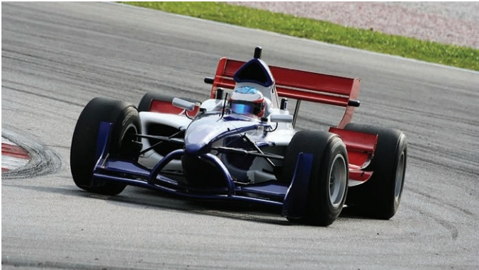

### 1.1 The language of motion

Throw a small object such as a marble straight up in the air and think about the words you could use to describe its motion, from the instant just after it leaves your hand to the instant just before it hits the floor. Some words might involve the idea of direction. Other words might relate to the position of the marble, its speed or whether it is slowing down or speeding up. Underlying many of these is time.

## Direction

The way the marble moves is affected by the gravitational pull of Earth. We understand directional words such as up and down because we experience this pull towards the centre of Earth all the time. The vertical direction is along the line towards or away from the centre of Earth.

In mathematics a quantity that has only size, or magnitude, is called a scalar. One that has both magnitude and a direction in space is called a vector.

## Distance, position and displacement

The total distance travelled by the marble at any time does not depend on its direction. It is a scalar quantity.

<!-- page 18 -->

Position and displacement are two vectors related to distance: they have direction as well as magnitude. Here their direction is up or down and you decide which of these is positive. When up is taken to be positive, down is negative.

The position of the marble is its distance above a fixed origin, for example, the distance above the place it first left your hand.

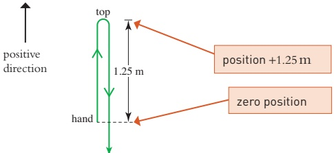

### Figure 1.1

When it reaches the top, the marble might have travelled a distance of 1.25 m. Relative to your hand its position is then 1.25 m upwards or +1.25 m.

At the instant it returns to the same level as your hand it will have travelled a total distance of 2.5 m. Its position, however, is zero upwards.

A position is always relative to a fixed origin but a displacement can be measured from any point. When the marble returns to the level of your hand, its displacement is zero relative to your hand but -1.25 m relative to the top.

What are the positions of the particles A, B and C in the diagram in Figure 1.2?

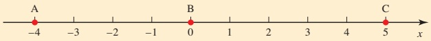

Figure 1.2

What is the displacement of B

(i) relative to A (ii) relative to C?

## Diagrams and graphs

In mathematics, it is important to use words precisely, even though they might be used more loosely in everyday life. In addition, a picture in the form of a diagram or graph often shows the information more clearly.

<!-- page 19 -->

Figure 1.3 is a diagram showing the direction of motion of the marble and relevant distances. The direction of motion is indicated by an arrow. Figure 1.4 is a graph showing the displacement above the level of your hand against the time. Notice that it is not the path of the marble. This type of graph is called a displacement-time graph.

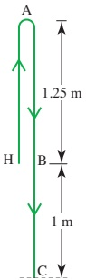

Figure 1.3

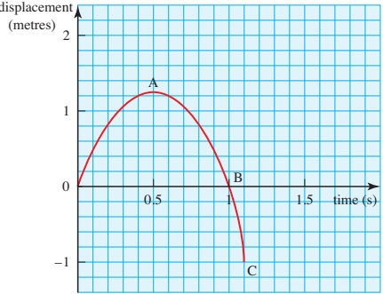

Figure 1.4

The graph in Figure 1.4 shows that the displacement is negative after one second (point B). What does this negative displacement mean?

## Note

When drawing a graph it is very important to specify your axes carefully. Graphs showing motion usually have time along the horizontal axis. Then you have to decide where the origin is and which direction is positive on the vertical axis. In Figure 1.4 the origin is at hand level and upwards is positive. The time is measured from the instant the marble leaves your hand.

## Notation and units

As with most mathematics, you will see in this book that certain letters are commonly used to denote certain quantities. This makes things easier to follow. Here the letters used are:

» s, h, x,  $ \gamma $ and  $ \varepsilon $ for displacement

t for time measured from a starting instant

∗ u and v for velocity

» a for acceleration.

The S.I. (Système International d'Unités) unit for distance is the metre (m), that for time is the second (s) and that for mass the kilogram (kg). Other units follow from these so speed is measured in metres per second, written ms^{-1}.

<!-- page 20 -->

1 Given that the origin for the motion of the marble (see Figure 1.3) is on the ground, what is its position

(i) when it leaves your hand

(ii) at the top?

2 A boy throws a ball vertically upwards so that its displacement y m at time t is as shown in the graph.

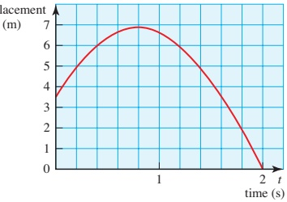

(i) Write down the position of the ball at times t = 0, 0.4, 0.8, 1.2, 1.6 and 2.

(ii) Calculate the displacement of the ball relative to its starting position at these times.

(iii) What is the total distance travelled

(a) during the first 0.8s (b) during the 2s of the motion?

3 The position of a particle moving along a straight horizontal groove is given by  $ x = 2 + t(t - 3) $ for  $ 0 \leq t \leq 5 $ where x is measured in metres and t in seconds.

(ii) What is the position of the particle at times t = 0, 1, 1.5, 2, 3, 4 and 5?

(ii) Draw a diagram to show the path of the particle, marking its position at these times.

(iii) Find the displacement of the particle relative to its initial position at t = 5.

(iv) Calculate the total distance travelled during the motion.

4 For each of the following situations sketch a graph of displacement against time. Show clearly the origin and the positive direction.

(i) A stone is dropped from a bridge which is 40m above a river.

(ii) A parachutist jumps from a helicopter which is hovering at 2000m. She opens her parachute after 10s of free fall.

(iii) A bungee jumper on the end of an elastic string jumps from a high bridge.

<!-- page 21 -->

5 The diagram is a sketch of the displacement-time graph for a fairground ride.

(i) Describe the motion, stating in particular what happens at O,A, B,C and D.

(ii) What type of ride is this?

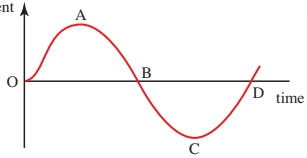

### 1.2 Speed and velocity

Speed is a scalar quantity and does not involve direction. Velocity is the vector related to speed; its magnitude is the speed but it also has a direction. When an object is moving in the negative direction, its velocity is negative.

Amy has to post a letter on her way to college. The post box is 500m east of her house and the college is 2.5km to the west. Amy cycles at a steady speed of  $ 10\, \text{m} \, \text{s}^{-1} $ and takes 10s at the post box to find the letter and post it.

The diagram in Figure 1.5 shows Amy's journey taking east as the positive direction. The distance of 2.5 km has been changed to metres so that the units are consistent.

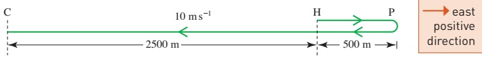

Figure 1.5

After she leaves the post box Amy is travelling west so her velocity is negative. It is  $ -10 \, m s^{-1} $.

The distances and times for the three parts of Amy's journey are:

<table border=1 style='margin: auto; word-wrap: break-word;'><tr><td style='text-align: center; word-wrap: break-word;'>Distance</td><td style='text-align: center; word-wrap: break-word;'>Time</td></tr><tr><td style='text-align: center; word-wrap: break-word;'>Home to post box 500m</td><td style='text-align: center; word-wrap: break-word;'>$ \frac{500}{10} $=50s</td></tr><tr><td style='text-align: center; word-wrap: break-word;'>At post box 0m</td><td style='text-align: center; word-wrap: break-word;'>10s</td></tr><tr><td style='text-align: center; word-wrap: break-word;'>Post box to college 3000m</td><td style='text-align: center; word-wrap: break-word;'>$ \frac{3000}{10} $=300s</td></tr></table>

These can be used to draw the displacement-time graph, taking home as the origin, as in Figure 1.6.

displacement

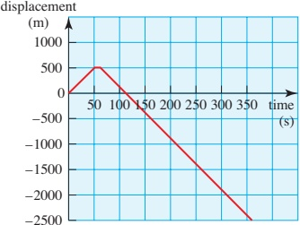

Figure 1.6

<!-- page 22 -->

Calculate the gradient of the three portions of the graph in Figure 1.6. What conclusions can you draw?

The velocity is the rate at which the displacement changes.

» Velocity is represented by the gradient of the displacement-time graph.

Figure 1.7 is the velocity-time graph.

## Note

By drawing the graphs below each other with the same horizontal scales, you can see how they correspond to each other.

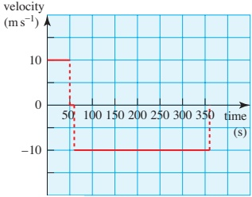

Figure 1.7

## Distance-time graphs

Figure 1.8 is the distance-time graph of Amy's journey. It differs from the position-time graph because it shows how far she travels irrespective of her direction. There are no negative values. The gradient of this graph represents Amy's speed rather than her velocity.

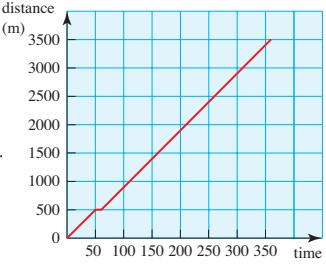

(s)

Figure 1.8

It has been assumed that Amy starts and stops instantaneously. What would more realistic graphs look like?

Would it make a lot of difference to the answers if you tried to be more realistic?

## Average speed and average velocity

You can find Amy's average speed on her way to college by using the definition

 $$ \parallel\mathrm{~A v e r a g e~s p e e d}=\frac{\mathrm{t o t a l~d i s t a n c e~t r a v e l l e d}}{\mathrm{~t o t a l~t i m e~t a k e n}} $$

<!-- page 23 -->

When the distance is in metres and the time in seconds, you calculate the speed by dividing metres by seconds and you write it in  $ ms^{-1} $. So Amy's average speed is

The college is in the negative direction.

 $$ \mathrm{\frac{3500~m}{360 s}}=9.72\mathrm{m}\mathrm{s}^{-1}\ (\mathrm{to}\ 3\mathrm{s.f.}) $$ 

Amy's average velocity is different. Her displacement from start to finish is -2500 m so

 $$ \begin{array}{l}\text{〉 Average~velocity}=\frac{total~displacement~from~initial~position}{total~time~taken}\\ \quad=\frac{-2500}{360}\\ \quad=-6.94m s^{-1}(to3s.f)\end{array} $$ 

If Amy had taken the same time to go straight from home to college at a steady speed, this steady speed would have been  $ 6.94 \, m \, s^{-1} $.

## Velocity at an instant

The displacement–time graph for a marble thrown straight up into the air at  $ 5\,m\,s^{-1} $ is curved because the velocity is continually changing.

The velocity is represented by the gradient of the displacement-time graph. When a displacement-time graph is curved like this you can find the velocity at an instant of time by drawing a tangent as in Figure 1.9.

The velocity at P is approximately

 $$ \frac{0.6}{0.25}=2.4m s^{-1} $$ 

Figure 1.10 shows the velocity-time graph.

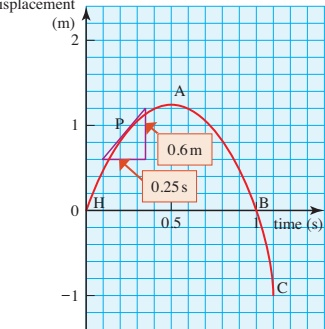

Figure 1.9

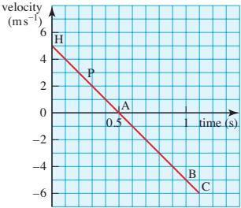

Figure 1.10

<!-- page 24 -->

What is the velocity at H, A, B and C?

The speed of the marble increases after it reaches the top. What happens to the velocity?

At the point A, the velocity and gradient of the displacement—time graph are zero. This means that the marble is instantaneously at rest. The velocity at H is positive because the marble is moving in the positive direction (upwards). The velocity at B and at C is negative because the marble is moving in the negative direction (downwards).

Exercise 1B

1 Draw a speed-time graph for Amy's journey on page 5.

2 The distance-time graph shows the relationship between distance travelled and time for a person who leaves home at 9.00 am, walks to a bus stop and catches a bus into town.

(i) Describe what is happening during the time from A to B. distance

(ii) The section BC is much steeper

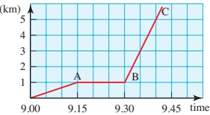

than OA; what does this tell you about the motion?

(iii) Draw the speed-time graph for the person.

(iv) What simplifications have been made in drawing these graphs?

3 For each of the following journeys find

(a) the initial and final positions

(b) the total displacement

(c) the total distance travelled

(d) the velocity and speed for each part of the journey

(e) the average velocity for the whole journey

(f) the average speed for the whole journey.

(i) displacement

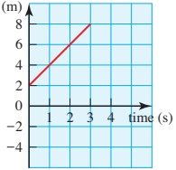

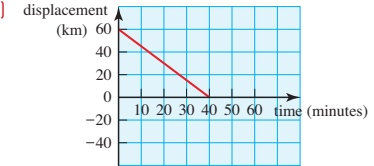

<!-- page 25 -->

(iii)

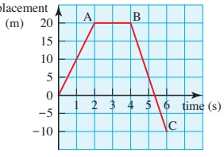

{iv}

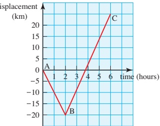

4 A plane flies from London to Toronto, a distance of 5700 km, at an average speed of 1280 kmh $ ^{-1} $. It returns at an average speed of 1200 kmh $ ^{-1} $. Find the average speed for the round trip in kmh $ ^{-1} $, giving your answer to the nearest whole number.

### 1.3 Acceleration

In everyday language, the word ‘accelerate’ is usually used when an object speeds up and ‘decelerate’ is used when it slows down. Mathematicians sometimes refer to deceleration in the context of decreasing speed but in mathematics the word acceleration is used whenever there is a change in velocity, whether an object is speeding up, slowing down or changing direction. Acceleration is the rate at which the velocity changes.

Over a period of time

 $$  \text{∗}Average~acceleration=\frac{change~in~velocity}{time~taken} $$ 

Acceleration is represented by the gradient of a velocity-time graph. It is a vector and can take different signs in a similar way to velocity. This is illustrated by Tom's cycle journey, which is shown in Figure 1.11. Tom turns on to the main road at  $ 4\,m\,s^{-1} $, accelerates uniformly, maintains a constant speed and then slows down uniformly to stop when he reaches home.

Between A and B, Tom's velocity increases by  $ (10 - 4) = 6 \, \text{m} \, \text{s}^{-1} $ in 6 seconds, that is by 1 metre per second every second.

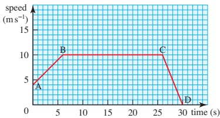

Figure 1.11

This acceleration is written as

1 m s $ ^{-2} $ (one metre per second squared) and is the gradient of AB.

From B to C    acceleration = 0 ms $ ^{-2} $  $ \leftarrow $ There is no change in velocity.

From C to D    acceleration =  $ \frac{(0 - 10)}{(30 - 26)} = -2.5 $ m s $ ^{-2} $

<!-- page 26 -->

From C to D, Tom is slowing down while still moving in the positive direction towards home, so his acceleration, the gradient of the graph, is negative.

## The sign of acceleration

Think again about the marble thrown up into the air with a speed of  $ 5 \, m s^{-1} $.

Figure 1.12 represents the velocity when upwards is taken as the positive direction and shows that the velocity decreases from +5ms^{-1} to -5ms^{-1} in 1 second.

This means that the gradient, and hence the acceleration, is negative. It is  $ -10 \, \text{m s}^{-2} $. (You might recognise the number 10 as an approximation to g. See Chapter 2 page 28.)

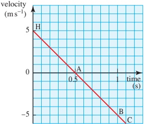

Figure 1.12

A car accelerates away from a set of traffic lights. It accelerates to a maximum speed and at that instant starts to slow down to stop at a second set of lights. Which of the graphs in Figure 1.13 could represent

(i) the distance-time graph

(ii) the velocity-time graph

(iii) the acceleration-time graph of its motion?

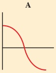

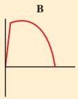

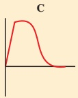

Figure 1.13

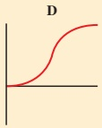

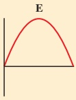

## Exercise 1C

(i) Calculate the acceleration for each part of the following journey velocity

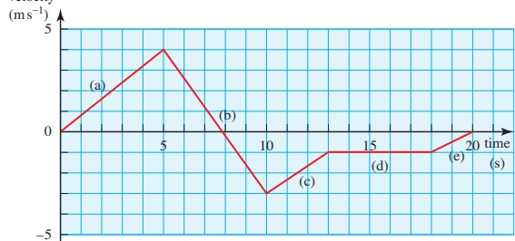

(ii) Use your results to sketch an acceleration-time graph.

<!-- page 27 -->

2 A particle moves so that its displacement x metres at time t seconds is  $ x = 2t^{3} - 18t $.

(i) Calculate the displacement of the particle at times t=0, 1, 2, 3 and 4.

## PS

(ii) Draw a diagram showing the displacement of the particle at these times.

(iii) Sketch a graph of the displacement against time.

3 A train takes 45 minutes to complete its 24 kilometre trip. It stops for 1 minute at each of 7 stations during the trip.

(iv) State the times when the particle is at the origin and describe the direction in which it is moving at those times.

(i) Calculate the average speed of the train.

(ii) What would be the average speed if the stop at each station was reduced to 20 seconds?

4 When Louise is planning car journeys she reckons that she can cover distances along main roads at roughly 100kmh $ ^{-1} $ and those in towns at 30kmh $ ^{-1} $.

(i) Find her average speed for each of the following journeys.

(a) 20km on main roads and then 10km in a town

(b) 150km on main roads and then 2km in a town

(c) 20 km on main roads and then 20 km in a town

(ii) In what circumstances would her average speed be 65kmh^{-1}.

5 A lift travels up and down between the ground floor (G) and the roof garden (R) of a hotel. It starts from rest, takes 5s to increase its speed uniformly to  $ 2\,ms^{-1} $, maintains this speed for 5s and then slows down uniformly to rest in another 5s. In the following questions, use upwards as positive.

(i) Sketch a velocity-time graph for the journey from G to R.

On one occasion the lift stops for 5s at R before returning to G.

(ii) Sketch a velocity-time graph for this journey from G to R and back.

(iii) Calculate the acceleration for each 5s interval. Take care with the signs.

(iv) Sketch an acceleration-time graph for this journey.

<!-- page 28 -->

6 A film of a dragster doing a 400m run from a standing start yields the following positions at 1 second intervals.

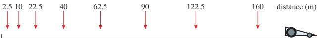

(i) Draw a displacement-time graph of its motion.

(ii) Use your graph to help you to sketch

(a) the velocity-time graph

(b) the acceleration-time graph.

### 1.4 Using areas to find distances and displacements

The graphs in Figure 1.14 and Figure 1.15 model the motion of a stone falling from rest.

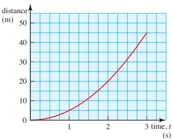

Figure 1.14

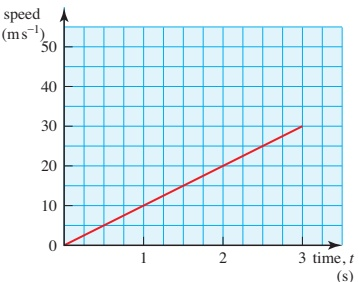

Figure 1.15

Calculate the area between the speed-time graph and the time axis from

(i) t = 0 to 1 (ii) t = 0 to 2 (iii) t = 0 to 3.

Compare your answers with the distance that the stone has fallen, shown on the distance-time graph, at $t=1,2$ and $3$. What conclusions do you reach?

The area between a speed-time graph and the time axis represents the distance travelled.

There is further evidence for this if you consider the units on the graphs. Multiplying metres per second by seconds gives metres. A full justification relies on the calculus methods you will learn in Chapter 7.

<!-- page 29 -->

## Finding the area under speed-time graphs

Often speed-time graphs consist of straight line segments. When this is the case, the area is easily found by splitting it up into triangles, rectangles or trapezia, as shown in Figure 1.16.

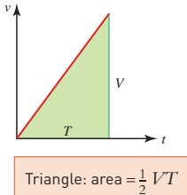

Triangle: area = $\frac{1}{2} V T$

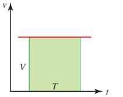

Rectangle: area = VT

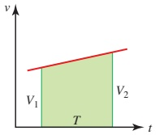

Trapezium:

area= $ \frac{1}{2}(V_{1}+V_{2})T $

Figure 1.16

Example 1.1

The graph in Figure 1.17 shows Hinesh's journey from the time he turns on to the main road until he arrives home. How far does Hinesh cycle?

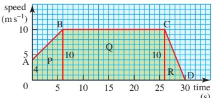

Figure 1.17

## Solution

Split the area under the speed-time graph into three regions.

P trapezium: area =  $ \frac{1}{2}(4 + 10) \times 6 = 42 $ m

Q rectangle: area = 10 × 20 = 200m

R triangle:  $ \text{area} = \frac{1}{2} \times 10 \times 4 = 20 \, \text{m} $

total area = 262m

Hinesh cycles 262 m.

What does the area between a velocity-time graph and the time axis represent?

<!-- page 30 -->

## The area between a velocity-time graph and the time axis

The area between a velocity-time graph and the time axis represents the change in position, which is the displacement.

When the velocity is negative, the area is below the time axis and represents a displacement in the negative direction.

Example 1.2

Sunil walks east for 6s at  $ 2\,ms^{-1} $ then west for 2s at  $ 1\,ms^{-1} $. Draw

(i) a diagram of the journey

(ii) the speed-time graph

(iii) the velocity-time graph.

Interpret the area under each graph.

## Solution

(i) Sunil's journey is illustrated in Figure 1.18.

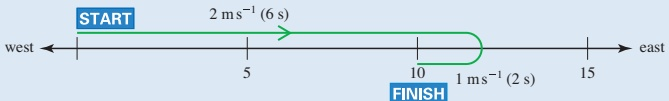

Figure 1.18

(ii) Figure 1.19 shows the speed-time graph.

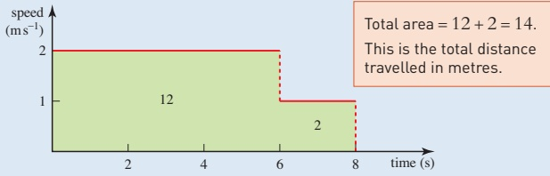

### Figure 1.19

(iii) Figure 1.20 shows the velocity-time graph.

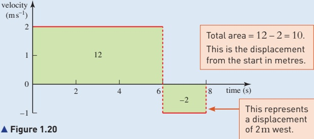

<!-- page 31 -->

## Estimating areas

Sometimes the velocity-time graph does not consist of straight lines so you have to make the best estimate you can by counting the squares underneath it or by replacing the curve by a number of straight lines as for the trapezium rule (see Pure Mathematics 2 and 3, Chapter 5).

The speed-time graph in Figure 1.21 shows the motion of a dog over a 60s period.

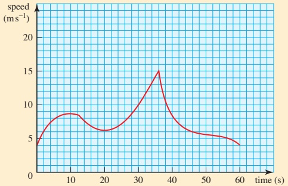

Figure 1.21

Estimate how far the dog travelled during this time.

### Example 1.3

On the London underground, Oxford Circus and Piccadilly Circus are 0.8 km apart. A train accelerates uniformly to a maximum speed when leaving Oxford Circus and maintains this speed for 90 s before decelerating uniformly to stop at Piccadilly.

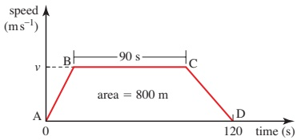

Figure 1.22

Circus. The whole journey takes 2 minutes. Find the maximum speed.

## Solution

The sketch of the speed-time graph of the journey, in Figure 1.22, shows the given information, with suitable units. The maximum speed is  $ \nu $ m s $ ^{-1} $.

The area is  $ \frac{1}{2}(120 + 90) \times \nu = 800 $

 $$ \nu=\frac{800}{105} $$ 

 $$ =7.619 $$ 

The maximum speed of the train is  $ 7.62 \, m s^{-1} $ (to 3 s.f.).

Does it matter how long the train takes to speed up and slow down?

<!-- page 32 -->

1 The graphs show the speeds of two cars travelling along a street.

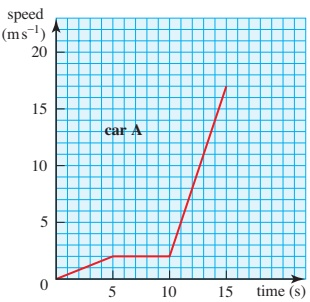

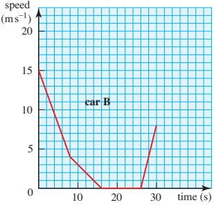

For each car find

(i) the acceleration for each part of its motion

(ii) the total distance it travels in the given time

(iii) its average speed.

2 The graph shows the speed of a lorry when it enters a very busy road.

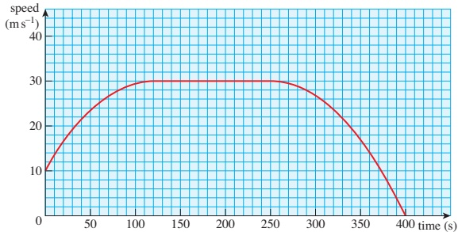

(i) Describe the journey over this time.

(ii) Use a ruler to make a tangent to the graph and hence estimate the acceleration at the beginning and end of the period.

(iii) Estimate the distance travelled and the average speed.

3 A train leaves a station where it has been at rest and picks up speed at a constant rate for 60 s. It then remains at a constant speed of  $ 17 \, m s^{-1} $ for 60 s before it begins to slow down uniformly as it approaches a set of signals. After 45 s it is travelling at  $ 10 \, m s^{-1} $ and the signal changes. The train again increases speed uniformly for 75 s until it reaches a speed of  $ 20 \, m s^{-1} $. A second set of signals then orders the train to stop, which it does after slowing down uniformly for 30 s.

(i) Draw a speed-time graph for the train.

(ii) Use your graph to find the distance that it has travelled from the station.

<!-- page 33 -->

4 When a parachutist jumps from a helicopter hovering above an airfield her speed increases at a constant rate to  $ 28 \, m s^{-1} $ in the first 3 s of her fall. It then decreases uniformly to  $ 8 \, m s^{-1} $ in a further 6 s, remaining constant until she reaches the ground.

(i) Sketch a speed-time graph for the parachutist.

(ii) Find the height of the plane when the parachutist jumps out if the complete jump takes 1 minute.

5 A car is moving at  $ 20\,m\,s^{-1} $ when it begins to increase speed. Every 10s it gains  $ 5\,m\,s^{-1} $ until it reaches its maximum speed of  $ 50\,m\,s^{-1} $ which it retains.

(i) Draw the speed-time graph of the car.

(ii) When does the car reach its maximum speed of 50 ms^{-1}.

(iii) Find the distance travelled by the car after 150s.

(iv) Write down expressions for the speed of the car $t$ seconds after it begins to speed up.

6 A train takes 10 minutes to travel between two stations. The train accelerates at a rate of  $ 0.5 \, m s^{-2} $ for 30 s. It then travels at a constant speed and is finally brought to rest in 15 s with a constant deceleration.

(i) Draw a velocity-time graph for the journey.

(ii) Find the steady speed, the rate of deceleration and the distance between the two stations.

7 A car is travelling at  $ 36 \, km h^{-1} $ when the driver has to perform an emergency stop. During the time the driver takes to respond and apply the brakes the car has travelled  $ 7 \, m $ ('thinking distance'). It then pulls up with constant deceleration in a further  $ 8 \, m $ ('braking distance') giving a total stopping distance of  $ 15 \, m $.

(i) Find the initial speed of the car in metres per second and the time that the driver takes to react.

(ii) Draw the velocity-time graph for the car.

(iii) Calculate the deceleration once the car starts braking.

(iv) What is the stopping distance for a car travelling at 60km h $ ^{-1} $ if the reaction time and the deceleration are the same as before?

8 A car travels in a straight line from A to B, a distance of 12 km, taking 552 seconds. The car starts from rest at A and accelerates for  $ T_{1} $ s at 0.3 ms $ ^{-2} $, reaching a speed of  $ V_{ms}^{-1} $. The car then continues to move at  $ V_{ms}^{-1} $ for  $ T_{2} $ s. It then decelerates for  $ T_{3} $ s at 1 ms $ ^{-2} $, coming to rest at B.

(i) Sketch the velocity-time graph for the motion and express  $ T_{1} $ and  $ T_{3} $ in terms of V.

(ii) Express the total distance travelled in terms of V and show that  $ 13V^{2} - 3312V + 72000 = 0 $. Hence find the value of V.

<!-- page 34 -->

PS

9 A particle P moves along the straight line AB.

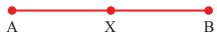

The midpoint of AB is X. The velocity-time graph for P is shown in the diagram.

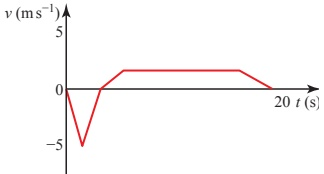

The particle starts at rest from a point X halfway between A and B and moves towards A. It comes to rest at A when t = 3 s.

(i) Find the distance AX.

After being instantaneously at rest when $t = 3$, the particle starts to move towards B. The particle takes 15 seconds to travel from A to B and comes to rest at B. For the first two seconds of this stage, P is accelerating at $0.6\,\mathrm{m\,s^{-2}}$, reaching a velocity $V$ which it keeps for $T$ seconds after which it decelerates to rest at B.

(ii) Find V.

(iii) Find T.

(iv) Find the deceleration.

10 The diagram shows the velocity-time graph for the motion of a machine's cutting tool. The graph consists of five straight line segments. The tool moves forward for 8s while cutting and then takes 3s to return to its starting position.

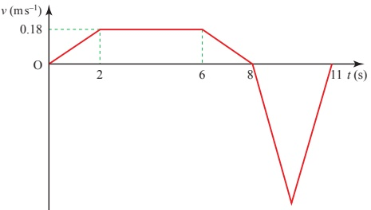

Find

(i) the acceleration of the tool during the first 2s of the motion,

(ii) the distance the tool moves forward while cutting,

(iii) the greatest speed of the tool during the return to its starting position.

<!-- page 35 -->

11 A train travels from A to B, a distance of 20000m, taking 1000s. The journey has three stages. In the first stage the train starts from rest at A and accelerates uniformly until its speed is  $ V_{ms}^{-1} $. In the second stage the train travels at constant speed  $ V_{ms}^{-1} $ for 600s. During the third stage of the journey the train decelerates uniformly, coming to rest at B.

(i) Sketch the velocity-time graph for the train's journey.

(ii) Find the value of V.

(iii) Given that the acceleration of the train during the first stage of the journey is  $ 0.15 \, m s^{-2} $, find the distance travelled by the train during the third stage of the journey.

Cambridge International AS & A Level Mathematics

9709 Paper 4 Q6 November 2008

INVESTIGATION

## Train journey

In many countries if you look out of a train window you will see distance markers beside the track. Take a train journey and record the time as you go past each marker. Use your figures to draw distance-time, speed-time and acceleration-time graphs. What can you conclude about the greatest acceleration, deceleration and speed of the train?

## KEY POINTS

<table border=1 style='margin: auto; word-wrap: break-word;'><tr><td style='text-align: center; word-wrap: break-word;'>1</td><td style='text-align: center; word-wrap: break-word;'>Vectors (with magnitude and direction)</td><td style='text-align: center; word-wrap: break-word;'>Scalars (magnitude only)</td></tr><tr><td style='text-align: center; word-wrap: break-word;'></td><td style='text-align: center; word-wrap: break-word;'>Displacement</td><td style='text-align: center; word-wrap: break-word;'>Distance</td></tr><tr><td style='text-align: center; word-wrap: break-word;'></td><td style='text-align: center; word-wrap: break-word;'>Position – displacement from a fixed origin</td><td style='text-align: center; word-wrap: break-word;'></td></tr><tr><td style='text-align: center; word-wrap: break-word;'></td><td style='text-align: center; word-wrap: break-word;'>Velocity – rate of change of position</td><td style='text-align: center; word-wrap: break-word;'>Speed – magnitude of velocity</td></tr><tr><td style='text-align: center; word-wrap: break-word;'></td><td style='text-align: center; word-wrap: break-word;'>Acceleration – rate of change of velocity</td><td style='text-align: center; word-wrap: break-word;'>Time</td></tr></table>

- Vertical is towards the centre of Earth; horizontal is perpendicular to vertical.

<!-- page 36 -->

## 2 Diagrams

Motion along a line can be illustrated vertically or horizontally (as shown).

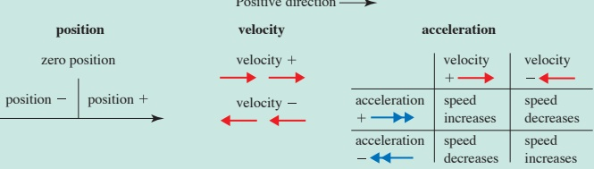

- Average speed =  $ \frac{\text{total distance travelled}}{\text{total time taken}} $

Average velocity =  $ \frac{\text{displacement}}{\text{time taken}} $

- Average acceleration =  $ \frac{\text{change in velocity}}{\text{time taken}} $

## 3 Graphs

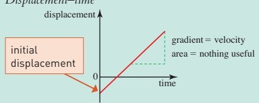

Velocity-time

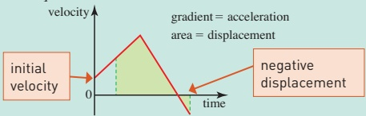

Distance-time

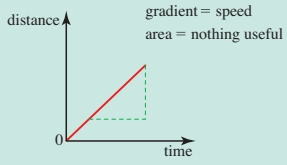

<!-- page 37 -->

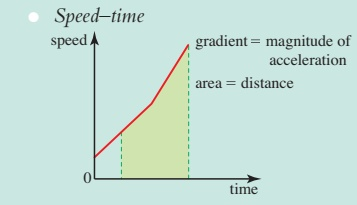

## LEARNING OUTCOMES

Now that you have finished this chapter, you should be able to

understand and use the terms

distance

displacement

speed

velocity

acceleration

deceleration

understand and use the S.I. units for these quantities

☑ calculate average speed by dividing total distance by total time

draw and interpret distance-time graphs and displacement-time graphs

using the gradient to find speed and velocity

draw and interpret speed-time graphs and velocity-time graphs

using the gradient to find acceleration

using the area under the graph to find distance and displacement

in the case of a velocity-time graph, interpreting the area below the axis as negative displacement.

