# 2 The constant acceleration formulae

<!-- Cambridge International AS  A Level Mathematics Mechanics (Sophie Goldie) .pdf p38-55 -->

<!-- page 38 -->

## 2 

## The constant acceleration formulae

The poetry of motion! The real way to travel! The only way to travel! Here today – in next week tomorrow! Villages skipped, towns and cities jumped – always somebody else's horizon! O bliss! O poop-poop! O my! Kenneth Grahame (1859–1932) The Wind in the Willows

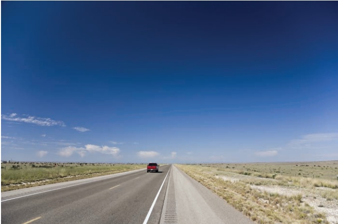

### 2.1 Setting up a mathematical model

<!-- page 39 -->

Figure 2.1 shows a section of a map of railway lines around Tokyo in the east of Japan. Which of the following statements can you be sure of just by looking at this map?

(ii) Akihabara is on the line from Tokyo to Ueno.

(ii) The line from Akihabara to Kinshicho runs due East.

(iii) Nippori is closer to Ueno than it is to Tabata.

(iv) There is no direct line between Ikebukuro and Kinshicho.

This is a diagrammatic model of the railway system. It gives essential though by no means all the information you need for planning train journeys. You can be sure about the places a line passes through but distances and directions are only approximate. You can therefore say that statements (i) and (iv) above are true, but you cannot be certain about statements (ii) or (iii).

## Making simplifying assumptions

When setting up a model, you first need to decide what is essential. For example, what would you take into account and what would you ignore when considering the motion of a car travelling from San Francisco to Los Angeles?

You will need to know the distance and the time taken for parts of the journey, but you might decide to ignore the dimensions of the car and the motion of the wheels. You would then be using the idea of a particle to model the car. A particle has no dimensions.

You might also decide to ignore the bends in the road and its width, and so treat it as a straight line with only one dimension. A length along the line would represent a length along the road, in the same way as a piece of thread following a road on a map might be straightened out to measure its length.

You might decide to split the journey up into parts and assume that the speed is constant over these parts.

The process of making decisions like these is called making simplifying assumptions and is the first stage of setting up a mathematical model of the situation.

## Defining the variables and setting up the equations

The next step in setting up a mathematical model is to define the variables with suitable units. These will depend on the problem you are trying to solve. Suppose you want to know where you ought to be at certain times in order to maintain a good average speed between San Francisco and Los Angeles. You might define your variables as follows

the total time since the car left San Francisco is t hours

the distance from San Francisco at time t is x km

» the average speed up to time  $ t $ is  $ \nu $ km h $ ^{-1} $.

Then, at Kettleman City  $ t = t_{1} $ and  $ x = x_{1} $, etc.

<!-- page 40 -->

You can then set up equations and go through the mathematics required to solve the problem. Remember to check that your answer is sensible. If it isn't, you might have made a mistake in your arithmetic or your simplifying assumptions might need reconsideration.

The theories of mechanics that you will learn about in this course, and indeed any other studies in which mathematics is applied, are based on mathematical models of the real world. When necessary, these models can become more complex as your knowledge increases.

The simplest form of the San Francisco to Los Angeles model assumes that the speed remains constant over sections of the journey. Is this reasonable?

For a much shorter journey, you might need to take into account changes in the speed of the car. This chapter develops the mathematics required when an object can be modelled as a particle moving in a straight line with constant acceleration. In most real situations this is only the case for part of the motion – you wouldn’t expect a car to continue accelerating at the same rate for very long – but it is a very useful model to use as a first approximation over a short time.

### 2.2 The constant acceleration formulae

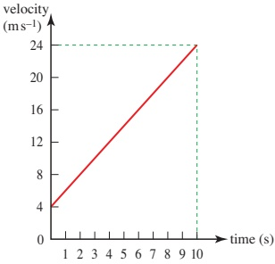

Figure 2.2

The velocity-time graph in Figure 2.2 shows part of the motion of a car on a fairground ride as it picks up speed. The graph is a straight line so the velocity increases at a constant rate and the car has a constant acceleration that is equal to the gradient of the graph.

The velocity increases from  $ 4 \, m s^{-1} $ to  $ 24 \, m s^{-1} $ in 10 s so its acceleration is

 $$ \frac{24-4}{10}=2\mathrm{m}\mathrm{s}^{-2} $$

<!-- page 41 -->

In general, when the initial velocity is  $ u\,ms^{-1} $ and the velocity a time t s later is  $ \nu\,ms^{-1} $, as in Figure 2.3, the increase in velocity is  $ (\nu - u)\,ms^{-1} $ and the constant acceleration  $ a\,ms^{-2} $ is given by

 $$ \begin{array}{l}\frac{v-u}{t}=a\\ \nu-u=at\\ \nu=u+at \end{array} $$ 

So

The area under the graph represents the distance travelled. For the fairground car (Figure 2.2), that is represented by a trapezium of area

 $$ \frac{(4+24)}{2}\times10=140m $$ 

In the general situation, the area represents the displacement s metres and, from Figure 2.4, this is

 $$ s=\frac{(u+\nu)}{2}\times t $$ 

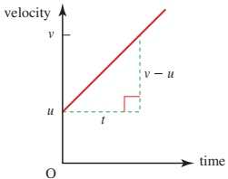

Figure 2.3

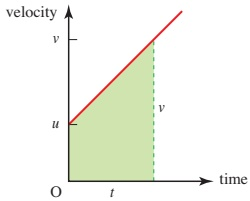

Figure 2.4

The two equations, ① and ②, can be used as formulae for solving problems when the acceleration is constant. Check that they work for the fairground ride.

There are other useful formulae as well. For example, you might want to find the displacement, s, without involving  $ \nu $ in your calculations. You can do this by looking at the area under the velocity-time graph in a different way, using the rectangle R and the triangle T (see Figure 2.5).

 $$  AC=\nuand BC=u $$ 

 $$  AB=\nu-u $$ 

SO

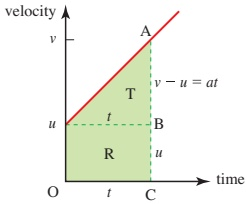

Figure 2.5

 $$ =a t\qquad\mathrm{f r o m~e q u a t i o n}\quad\textcircled{1} $$ 

total area = area of R + area of T

SO

 $$ \begin{aligned}&s=ut+\frac{1}{2}\times t\times at\\&s=ut+\frac{1}{2}at^{2}\\ \end{aligned} $$ 

Giving

To find a formula that does not involve t, you need to eliminate t. One way to do this is first to rewrite equations ① and ② as

 $$ \nu-u=a t\qquad\mathrm{a n d}\qquad\nu+u=\frac{2s}{t} $$

<!-- page 42 -->

and then multiplying them gives

 $$ (\nu-u)(\nu+u)=at\times\frac{2s}{t} $$ 

 $$ \nu^{2}-u^{2}=2as $$ 

 $$ \nu^{2}=u^{2}+2a s $$ 

You might have seen the equations  $ \textcircled{1} $ to  $ \textcircled{4} $ before. They are sometimes called the \textit{suvat} equations or formulae and they can be used whenever an object can be assumed to be moving with \textit{constant} acceleration.

When solving problems it is important to remember the requirement for constant acceleration and also to remember to specify positive and negative directions clearly.

Example 2.1

A bus leaving a bus stop accelerates at  $ 0.8 \, m s^{-2} $ for 5 s and then travels at a constant speed for 2 minutes before slowing down uniformly at  $ 0.4 \, m s^{-2} $ to come to rest at the next bus stop. Calculate

(i) the constant speed

(ii) the distance travelled while the bus is accelerating

(iii) the total distance travelled.

## Solution

(i) The diagram in Figure 2.6 shows the information for the first part of the motion.

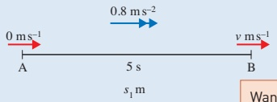

Figure 2.6

Let the constant speed be  $ \nu m s^{-1} $.

 $$ v^{2}=u^{2}+2a s 絶 \times $$ 

u = 0, a = 0.8, t = 5, so use  $ \nu = u + at $

 $$ \begin{aligned}\nu&=0+0.8\times5\\&=4\end{aligned} $$ 

The constant speed is 4ms^{-1}.

(ii) Let the distance travelled be  $ s_1^m $.

Use the suffix '1' because there are three distances to be found in this question.

 $ u = 0, a = 0.8, t = 5, \text{so use } s = ut + \frac{1}{2}at^2 $

 $$ s_{1}=0+\frac{1}{2}\times0.8\times5^{2} $$ 

 $$ =10 $$ 

Want $s$

know $u=0$, $t=5$, $a=0.8$

$s=\frac{1}{2}(u+\nu)t$ $\times$

$s=ut+\frac{1}{2}at^{2}$ ✓

The bus accelerates over 10 m.

<!-- page 43 -->

(iii) Figure 2.7 gives all the information for the rest of the journey.

Velocity decreases so acceleration is negative.

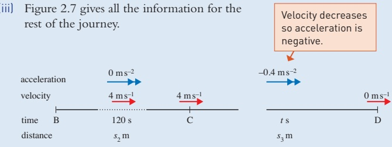

Figure 2.7

Between B and C the velocity is constant so the distance travelled is  $ 4 \times 120 = 480 \, m $.

Let the distance between C and D be  $ s_{3}m $.

 $$ u=4,a=-0.4,\nu=0,so use\nu^{2}=u^{2}+2as $$ 

 $$ 0=16+2(-0.4)s_{3} $$ 

 $$ 0.8s_{3}=16 $$ 

 $$ s_{3}=20 $$ 

Distance taken to slow down = 20m

The total distance travelled is

 $$ \nu=u+at $$ 

 $$ (10+480+20)m=510m $$ 

 $$ s=ut+\frac{1}{2}at^{2} $$ 

 $$ s=\frac{1}{2}\{u+v\}t $$ 

 $$ \nu^{2}=u^{2}+2a s $$ 

## Units in the suvat formulae

Constant acceleration usually takes place over short periods of time so it is best to use  $ ms^{-2} $ for this. When you don't need to use a value for the acceleration you can, if you wish, use the  $ suvat $ formulae with other units provided they are consistent. This is shown in the next example.

### Example 2.2

When leaving a town, a car accelerates from  $ 30 \, km h^{-1} $ to  $ 60 \, km h^{-1} $ in 5 s. Assuming the acceleration is constant, find the distance travelled in this time.

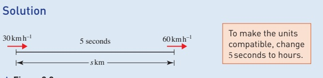

Figure 2.8

<!-- page 44 -->

The value of g varies over the surface of the Earth. It is particularly low in Kuala Lumpur and Singapore where it is 9.776; in Oslo and Helsinki it has the high value of 9.825.

In Physics it is commonly taken to be 9.81 and in some other mathematics courses a value of  $ 9.8 \, \text{m} \, \text{s}^{-2} $ is used.

Let the distance travelled be s km, as shown in Figure 2.8. You want s and are given  $ u = 30 $,  $ \nu = 60 $ and  $ t = 5 \div 3600 $ so you need a formula involving u,  $ \nu $, t and s.

 $$ s=\frac{(u+\nu)}{2}\times t $$ 

 $$ \begin{aligned}s&=\frac{(30+60)}{2}\times\frac{5}{3600}\\&=\frac{1}{16}\end{aligned} $$ 

The distance travelled is  $ \frac{1}{16} $ km or 62.5m.

In Examples 2.1 and 2.2, the bus and the car are always travelling in the positive direction so it is safe to use s for distance. Remember that s is not the same as the distance travelled if the direction changes during the motion.

## The acceleration due to gravity

When a model ignoring air resistance is used, all objects falling freely under gravity fall with the same constant acceleration,  $ g m s^{-2} $. In this book the value of g is taken to be  $ 10 m s^{-2} $, and it is assumed that this is correct to 3 significant figures. This is consistent with answers to questions involving g being given to 3 significant figures, and this level of accuracy is usually used.

### Example 2.3

A coin is dropped from rest at the top of a building of height 12m and travels in a straight line with constant acceleration  $ 10 \, m s^{-2} $.

Find the time it takes to reach the ground and the speed of impact.

## Solution

Figure 2.9 shows the situation. Suppose the time taken to reach the ground is t seconds. Using S.I. units, u = 0, a = 10 and s = 12 when the coin hits the ground, so you need to use a formula involving u, a, s and t.

 $$ s=u t+\frac{1}{2}a t^{2} $$ 

 $$ 12=0+\frac{1}{2}\times10\times t^{2} $$ 

 $$ t^{2}=2.4 $$ 

 $$ t=1.55(to3s.f.) $$ 

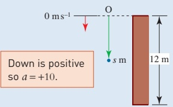

Figure 2.9

<!-- page 45 -->

To find the velocity, v, you require a formula involving s, u, a and v or t, u, a and v.

 $$ \begin{aligned}\nu^{2}&=u^{2}+2as&\quad\begin{array}{l}\nu=u+at\\\nu=0+10\times1.55\ldots\end{array}\\&\nu^{2}=240\\&\nu=15.5(to3s.f.)&\nu=15.5(to3s.f.)\end{aligned} $$ 

The coin takes 1.55 s to hit the ground and has speed  $ 15.5 \, m \, s^{-1} $ on impact.

## Summary

The formulae for motion with constant acceleration are

①  $ \nu = u + at $ ②  $ s = \frac{(u + \nu)}{2} \times t $

③  $ s = ut + \frac{1}{2}at^{2} $ ④  $ \nu^{2} = u^{2} + 2as $

» Derive formula  $ \textcircled{3} $ algebraically by substituting for  $ \nu $ from formula  $ \textcircled{1} $ into formula  $ \textcircled{2} $.

If you look at these formulae you will see that each omits one variable. But there are five variables and only four formulae; there isn't one without u. A formula omitting u is

 $$ s=\nu t-\tfrac{1}{2}a t^{2}\textcircled{5} $$ 

How can you derive this by referring to a graph or using substitution?

When using these formulae make sure that the units you use are consistent. For example, when the time is $t$ seconds and the distance $s$ metres, any speed involved is in $ms^{-1}$.

## Exercise 2A

1 (i) Find  $ \nu $ when u = 10, a = 6 and t = 2.

(ii) Find s when  $ \nu = 20 $, u = 4 and t = 10.

(iii) Find s when v = 10, a = 2 and t = 10.

(iv) Find a when v = 2, u = 12, s = 7.

2 Decide which equation to use in each of these situations.

(i) Given u, s, a; find v.

(ii) Given $a, u, t$; find $v$.

(iii) Given u, a, t; find s.

(iv) Given $u$, $v$, $s$; find $t$.

(v) Given u, s, v; find a.

(vi) Given u, s, t; find a.

(vii) Given u, a, v; find s.

(viii) Given a, s, t; find v.

<!-- page 46 -->

3 Assuming no air resistance, a ball has an acceleration of  $ 10 \, m s^{-2} $ when it is dropped from a window (so its initial speed, when t = 0, is zero). Calculate

(i) its speed after 1 s and after 10 s

(ii) how far it has fallen after 1s and after 10s

(iii) how long it takes to fall 20 m.

Which of these answers are likely to need adjusting to take account of air resistance? Would you expect your answer to be an over- or underestimate?

4 A car starting from rest at traffic lights reaches a speed of 90 kmh $ ^{-1} $ in 12s. Find the acceleration of the car (in ms $ ^{-2} $) and the distance travelled. Write down any assumptions that you have made.

## M

5 A top sprinter accelerates from rest to  $ 9\,m s^{-1} $ in 2s. Calculate his acceleration, assumed constant, during this period and the distance travelled.

6 A van skids to a halt from an initial speed of  $ 24 \, m s^{-1} $ covering a distance of 36 m. Find the acceleration of the van (assumed constant) and the time it takes to stop.

7 An object moves along a straight line with acceleration  $ -8 \, \text{m s}^{-2} $. It starts its motion at the origin with velocity  $ 16 \, \text{m s}^{-1} $.

(i) Write down equations for its position and velocity at time t s.

(ii) Find the smallest non-zero time when

(a) the velocity is zero

(b) the object is at the origin.

(iii) Sketch the position-time, velocity-time and speed-time graphs for  $ 0 \leq t \leq 4 $.

### 2.3 Further examples

The next two examples illustrate ways of dealing with more complex problems. In Example 2.4, none of the possible formulae has only one unknown and there are also two situations, so simultaneous equations are used.

### Example 2.4

James practises using the stopwatch facility on his new watch by measuring the time to travel between lamp posts on a car journey. As the car speeds up, two consecutive times are 1.2 s and 1 s. Later he finds out that the lamp posts are 30 m apart.

(i) Calculate the acceleration of the car (assumed constant) and its speed at the first lamp post.

(ii) Assuming the same acceleration, find the time the car took to travel the 30m before the first lamp post.

<!-- page 47 -->

'4.54...' means 4.54 and subsequent figures; in this case it is 4.54545454 and so on. Keep this number in your calculator for use in future working. You should not round values that will be used in later calculations. Convention for this course is to give final answers to three significant figures (or one decimal place for angles in degrees), unless a question asks for something different.

## Solution

(i) Figure 2.10 shows all the information, assuming the acceleration is  $ a \, m s^{-2} $ and the velocity at A is  $ u \, m s^{-2} $.

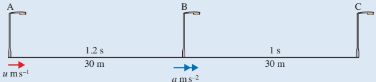

Figure 2.10

 $$ s=u t+\frac{1}{2}a t^{2} $$ 

 $$ 30=1.2u+\frac{1}{2}a\times1.2^{2} $$ 

 $$ 30=1.2u+0.72a $$ 

To use the same equation for the part BC you would need the velocity at B and this brings in another unknown. It is much better to go back to the beginning and consider the whole of AC with s=60 and t=2.2. Then again,

using  $ s = ut + \frac{1}{2}at^{2} $

 $ 60 = 2.2u + \frac{1}{2}a \times 2.2^{2} $

 $ 60 = 2.2u + 2.42a $ ②

 $$ \textcircled{1}\times10\div12 $$ 

 $$ 25=u+0.6a $$ 

 $$  \textcircled{2} \times5 $$ 

 $$ 300=11u+12.1a $$ 

 $$ \textcircled{3}\times11 $$ 

 $$ 275=11u+6.6a $$ 

 $$ 25=0+5.5a $$ 

 $$ a=4.54\ldots $$ 

 $$ u=25-0.6\times4.54...=22.2... $$ 

 $$ 4.55\mathrm{m s}^{-2} $$ 

 $$ 22.3\mathrm{m s}^{-1} $$ 

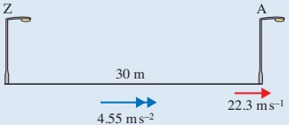

Figure 2.11

<!-- page 48 -->

(ii) For this part, you know that $s=30$, $\nu=22.2\ldots$ and $a=4.54\ldots$ and you want $t$ so you use the fifth formula.

 $$ s=vt-\frac{1}{2}at^{2} $$ 

 $$ 30=22.2...\times t-\frac{1}{2}\times4.54...\times t^{2} $$ 

 $$ \Rightarrow\quad2.27...t^{2}-22.2...t+30=0 $$ 

Using the quadratic formula to solve this gives t = 1.61 and t = 8.19 (correct to 3.s.f.).

The most sensible answer to this particular problem is 1.61 s.

Calculate $u$ when $t=8.187\ldots, \nu=22.2\ldots$ and $a=4.54\ldots$. Is $t=8.19$ a possible answer?

## Using a non-zero initial displacement

What, in the constant acceleration formulae, are  $ \nu $ and s when t = 0?

Putting t = 0 in the  $ s_{uvat} $ formulae gives the initial values, u for the velocity and s = 0 for the position.

Sometimes, however, it is convenient to use an origin that gives a non-zero value for s when t = 0. For example, when you model the motion of an eraser thrown vertically upwards you might decide to find its height above the ground rather than above the point from which it was thrown.

What is the effect on the various suvat formulae if the initial position is  $ s_{0} $ rather than zero?

If the height of the eraser above the ground is s at time t and  $ s_{0} $ when t = 0, the displacement over time t is  $ s - s_{0} $. You then need to replace formula ③ with

 $$ s-s_{0}=u t+\frac{1}{2}a t^{2} $$ 

### Example 2.5

The next example avoids this in the first part but it is very useful in part (ii).

A juggler throws a ball up in the air with initial speed  $ 5 \, m \, s^{-1} $ from a height of  $ 1.2 \, m $. It has a constant acceleration of  $ 10 \, m \, s^{-1} $ vertically downwards due to gravity.

(i) Find the maximum height of the ball above the ground and the time it takes to reach it.

At the instant that the ball reaches its maximum height, the juggler throws up another ball with the same speed and from the same height.

(ii) Where and when will the balls pass each other?

<!-- page 49 -->

## Solution

(i) In this example it is very important to draw a diagram and to be clear about the position of the origin. When O is 1.2m above the ground and s is the height in metres above O after t s, the diagram looks like Figure 2.12.

At the point of maximum height, let s = H and  $ t = t_{1} $.

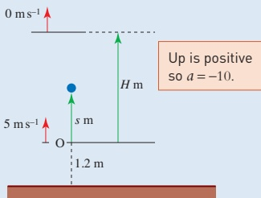

Figure 2.12

The ball stops instantaneously before falling so at the top  $ \nu = 0 $.

Use the suffix because there are two times to be found in this question.

You need a formula involving u, v, a and s.

 $$ \nu^{2}=u^{2}+2a s $$ 

 $$ 0=5^{2}+2\times(-10)\times H $$ 

The acceleration given is constant, a = -10; u = +5; v = 0 and s = H.

 $$ H=1.25 $$ 

The maximum height of the ball above the ground is

 $$ 1.25+1.2=2.45m. $$ 

To find  $ t_1 $, given  $ \nu = 0 $,  $ a = -10 $ and  $ u = +5 $ use a formula in  $ \nu $,  $ u $,  $ a $ and  $ t $.

 $$ \nu=u+at $$ 

 $$ 0=5+(-10)t_{1} $$ 

 $$ t_{1}=0.5 $$ 

The ball takes half a second to reach its maximum height.

(ii) Now consider the motion from the instant the first ball reaches the top of its path and the second is thrown up.

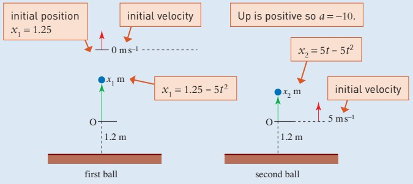

Figure 2.13

<!-- page 50 -->

Suppose that the balls have displacements above the origin of  $ x_1 $ m and  $ x_2 $ m, as shown in Figure 2.13, at a general time  $ t $ s after the second ball is thrown up. The initial position of the second ball is zero, but the initial position of the first ball is +1.25 m.

For each ball you know u and a. You want to involve t and s so you use

 $$ \begin{aligned}s-s_{0}&=ut+\frac{1}{2}at^{2}\\s&=s_{0}+ut+\frac{1}{2}at^{2}\end{aligned} $$ 

i.e.

For the first ball:

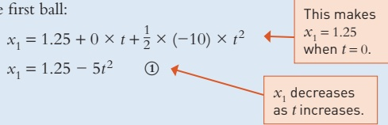

For the second ball:

 $$ \begin{aligned}x_{2}&=0+5\times t+\frac{1}{2}\times(-10)\times t^{2}\\x_{2}&=5t-5t^{2}\quad\textcircled{2}\end{aligned} $$ 

Suppose the balls pass after a time t s. This is when they are at the same height, so equate  $ x_{1} $ and  $ x_{2} $ from equations ① and ②.

 $$ 1.25-5t^{2}=5t-5t^{2} $$ 

 $$ 1.25=5t $$ 

 $$ t=0.25 $$ 

Then substituting t = 0.25 in ① and ② gives

 $$ x_{1}=1.25-5\times0.25^{2}=0.9375 $$ 

and

These are the same, as expected.

 $$ x_{2}=5\times0.25-5\times0.25^{2}=0.9375 $$ 

The balls pass after 0.25 seconds at a height of 1.2m + 0.94m = 2.14m above the ground (correct to the nearest centimetre).

Try solving part (ii) of Example 2.5 by supposing that the first ball falls  $ x\,m $ and the second rises  $ (1.25 - x)\,m $ in  $ t $ seconds.

## Note

The balls pass after half the time to reach the top, but not half-way up.

Why don't they travel half the distance in half the time?

<!-- page 51 -->

Use  $ g = 10 \, m \, s^{-2} $ in this exercise.

1 A car is travelling along a straight road. It accelerates uniformly from rest to a speed of  $ 15 \, m s^{-1} $ and maintains this speed for 10 minutes. It then decelerates uniformly to rest. If the acceleration and deceleration are  $ 5 \, m s^{-2} $ and  $ 8 \, m s^{-2} $ respectively, find the total journey time and the total distance travelled during the journey.

The term 'deceleration' is sometimes used in the context of decreasing speed.

## Note

2 A skier pushes off at the top of a slope with an initial speed of  $ 2 \, m s^{-1} $. She gains speed at a constant rate throughout her run. After 10 s she is moving at  $ 6 \, m s^{-1} $.

(i) Find an expression for her speed $t$ seconds after she pushes off.

(ii) Find an expression for the distance she has travelled at time t seconds.

(iii) The length of the ski slope is 400 m. What is her speed at the bottom of the slope?

3 Towards the end of a half-marathon Sabina is 100m from the finish line and is running at a constant speed of  $ 5\,ms^{-1} $. Daniel, who is 140m from the finish and is running at  $ 4\,ms^{-1} $, decides to accelerate to try to beat Sabina. If he accelerates uniformly at  $ 0.25\,ms^{-2} $ does he succeed?

4 Rupal throws a ball upwards at  $ 8 \, m \, s^{-1} $ from a window which is 4 m above ground level.

(i) Write down an equation for the height $h$m of the ball above the ground after $t$ s (while it is still in the air).

(ii) Use your answer to part (i) to find the time the ball hits the ground.

(iii) How fast is the ball moving just before it hits the ground?

(iv) In what way would you expect your answers to parts (ii) and (iii) to change if you were able to take air resistance into account?

5 Nathan hits a tennis ball straight up into the air from a height of 1.25 m above the ground. The ball hits the ground after 2.5 seconds. Find

(i) the speed with which Nathan hits the ball

(ii) the greatest height above the ground reached by the ball

(iii) the speed with which the ball hits the ground

(iv) how high the ball bounces if it loses 0.2 of its speed on hitting the ground.

(v) Is your answer to part (i) likely to be an over- or underestimate given that you have ignored air resistance?

<!-- page 52 -->

## M

6 A ball is dropped from a building of height 30m and at the same instant a stone is thrown vertically upwards from the ground so that it hits the ball. In modelling the motion of the ball and stone it is assumed that each object moves in a straight line with a constant downward acceleration of magnitude  $ 10 \, m s^{-2} $. The stone is thrown with initial speed of  $ 15 \, m s^{-1} $ and is  $ h_s $ metres above the ground t seconds later.

(i) Draw a diagram of the ball and stone before they collide, marking their positions.

(ii) Write down an expression for  $ h_{s} $ at time t.

(iii) Write down an expression for the height  $ h_{b} $ of the ball at time t.

## M

(iv) When do the ball and stone collide?

(v) How high above the ground do the ball and stone collide?

7 When Kim rows her boat, the two oars are both in the water for 3s and then both out of the water for 2s. This 5s cycle is then repeated. When the oars are in the water the boat accelerates at a constant  $ 1.8 \, \text{m s}^{-2} $ and when they are not in the water it decelerates at a constant  $ 2.2 \, \text{m s}^{-2} $.

(i) Find the change in speed that takes place in each 3s period of acceleration.

(ii) Find the change in speed that takes place in each 2s period of deceleration.

(iii) Calculate the change in the boat's speed for each 5 s cycle.

## PS

(iv) A race takes Kim 45s to complete. If she starts from rest what is her speed as she crosses the finishing line?

(v) Discuss whether this is a realistic speed for a rowing boat.

## PS

8 A ball is dropped from a tall building and falls with acceleration of magnitude  $ 10 \, \text{ms}^{-2} $. The distance between floors in the block is constant. The ball takes 0.5 s to fall from the 14th to the 13th floor and 0.3 s to fall from the 13th floor to the 12th floor. What is the distance between floors?

## PS

Two tennis balls are thrown vertically upwards from exactly the same spot at 1s intervals. Each tennis ball has initial speed  $ 30 \, \text{ms}^{-1} $ and acceleration  $ 10 \, \text{m} \, \text{s}^{-2} $ downwards. How high above the ground do they collide?

## PS

10 A car travelling with constant acceleration is timed to take 15s over 200 m and 10s over the next 200m. What is the speed of the car at the end of the observed motion?

## PS

11 A train is decelerating uniformly. It passes three posts spaced at intervals of 100 m. It takes 8 seconds between the first and second posts and 12 seconds between the second and third. Find the deceleration and the distance between the third post and the point where the train comes to rest.

12 A stone is thrown vertically upwards with a velocity of  $ 35 \, m s^{-1} $. Find the distance it travels in the fourth second of its motion.

<!-- page 53 -->

## PS

## PS

13 A man sees a bus, accelerating uniformly from rest at a bus stop, 50 m away. He then runs at constant speed and just catches the bus in 30 s. Determine the speed of the man and the acceleration of the bus. If the man's speed is  $ 3 \, m s^{-1} $, how close to the bus can he get?

14 In order to determine the depth of a well, a stone is dropped into the well and the time taken for the stone to drop is measured. It is found that the sound of the stone hitting the water arrives 5 seconds after the stone is dropped. If the speed of sound is taken as  $ 340 \, \text{m} \, \text{s}^{-1} $ find the depth of the well.

15 The top of a cliff is 40 metres above the level of the sea. A man in a boat, close to the bottom of the cliff, is in difficulty and fires a distress signal vertically upwards from sea level. Find

(i) the speed of projection of the signal given that it reaches a height of 5 m above the top of the cliff,

(ii) the length of time for which the signal is above the level of the top of the cliff.

The man fires another distress signal vertically upwards from sea level. This signal is above the level of the top of the cliff for  $ \sqrt{17} $ s.

(iii) Find the speed of projection of the second signal.

Cambridge International AS & A Level Mathematics

9709 Paper 41 Q3 June 2013

16 A and B are two points which are 10 m apart on the same horizontal plane. A particle P starts to move from rest at A, directly towards B, with constant acceleration  $ 0.5 \, m s^{-2} $. Another particle Q is moving directly towards A with constant speed  $ 0.75 \, m s^{-1} $, and passes through B at the instant that P starts to move. At time T's after this instant, particles P and Q collide. Find

(i) the value of T,

(ii) the speed of P immediately before the collision.

Cambridge International AS & A Level Mathematics

9709 Paper 42 Q2 June 2014

17 A cyclist starts from rest at point A and moves in a straight line with acceleration  $ 0.5 \, m s^{-2} $ for a distance of 36 m. The cyclist then travels at constant speed for 25 s before slowing down, with constant deceleration, to come to rest at point B. The distance AB is 210 m.

(i) Find the total time that the cyclist takes to travel from A to B.

24s after the cyclist leaves point A, a car starts from rest from point A, with constant acceleration  $ 4 \, m s^{-2} $, towards B. It is given that the car overtakes the cyclist while the cyclist is moving with constant speed.

(ii) Find the time that it takes from when the cyclist starts until the car overtakes her.

Cambridge International AS & A Level Mathematics

9709 Paper 41 Q7 November 2015

<!-- page 54 -->

The situation described below involves mathematical modelling. You will need to take these steps to help you.

(i) Make a list of the assumptions you need to make to simplify the situation to the point where you can apply mathematics to it.

(iii) Find out any information you require such as safe stopping distances or a value for the acceleration and deceleration of a car on a housing estate.

(ii) Make a list of the quantities involved.

(iv) Assign suitable letters for your unknown quantities. (Don't vary too many things at once.)

(v) Set up your equations and solve them. You might find it useful to work out several values and draw a suitable graph.

(vi) Decide whether your results make sense, preferably by checking them against some real data.

(vii) If you think your results need adjusting, decide whether any of your initial assumptions should be changed and, if so, in what way.

## Speed bumps

The residents of a housing estate are worried about the danger from cars being driven at high speed. They request that speed bumps be installed.

How far apart should the bumps be placed to ensure that drivers do not exceed a speed of 40kmh $ ^{-1} $? Some of the things to consider are the maximum sensible velocity over each bump and the time taken to speed up and slow down.

## KEY POINTS

## 1 The suvat formulae

The formulae for motion with constant acceleration are

The formulae for n

①  $ \nu = u + at $

②  $ s = \frac{(u + \nu)}{2} \times t $

③  $ s = ut + \frac{1}{2}at^{2} $

④  $ \nu^{2} = u^{2} + 2as $

⑤  $ s = \nu t - \frac{1}{2}at^{2} $

- a is the constant acceleration; s is the displacement from the starting position at time t; v is the velocity at time t; u is the velocity when t = 0.

If  $ s = s_{0} $ when t = 0, replace s in each formula with  $ (s - s_{0}) $.

<!-- page 55 -->

## 2 Vertical motion under gravity

The acceleration due to gravity (g $ _{ms}^{-2} $) is vertically downwards and is taken to be 10m $ s^{-2} $ in this book. The value 9.8m $ s^{-2} $ can also be used.

Always draw a diagram and decide in advance where your origin is and which way is positive.

Make sure that your units are compatible.

## 3 Using a mathematical model

- Make simplifying assumptions by deciding what is most relevant.

For example: a car is a particle with no dimensions;

a road is a straight line with one dimension;

acceleration is constant.

Define variables and set up equations.

Solve the equations.

- Check that the answer is sensible. If not, think again.

## LEARNING OUTCOMES

Now that you have finished this chapter, you should be able to

recall and use the constant acceleration equations (suvat equations) and use them in problem solving

solve problems for vertical motion under gravity using g and

u = 0 when the object is dropped

 $ \nu = 0 $ at the highest point

s = 0 when the object returns to its original position

use simultaneous equations with the  $ suvat $ equations to solve problems with two unknowns

☑ deal with problems with a non-zero initial displacement.

