# 3 Forces and Newton’s laws of motion

<!-- Cambridge International AS  A Level Mathematics Mechanics (Sophie Goldie) .pdf p56-81 -->

<!-- page 56 -->

## 3 

## Forces and Newton's laws of motion

Nature and Nature's Laws lay hid in Night. God said, Let Newton be! and All was Light. Alexander Pope (1688-1744)

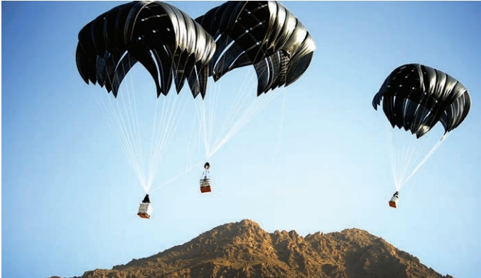

### 3.1 Force diagrams

The picture shows crates of supplies being dropped into a remote area by parachute. What forces are acting on a crate of supplies and the parachute?

One force that acts on every object near Earth's surface is its own weight. This is the force of gravity pulling it towards the centre of Earth. The weight of the crate acts on the crate and the weight of the parachute acts on the parachute.

The parachute is designed to make use of air resistance. A resistance force is present whenever a solid object moves through a liquid or gas. It acts in the opposite direction to the motion and depends on the speed of the object. The crate also experiences air resistance, but to a lesser extent than the parachute.

Other forces are the tensions in the guy lines attaching the crate to the parachute. These pull upwards on the crate and downwards on the parachute.

All these forces can be shown most clearly if you draw force diagrams for the crate (Figure 3.1) and the parachute (Figure 3.2).

<!-- page 57 -->

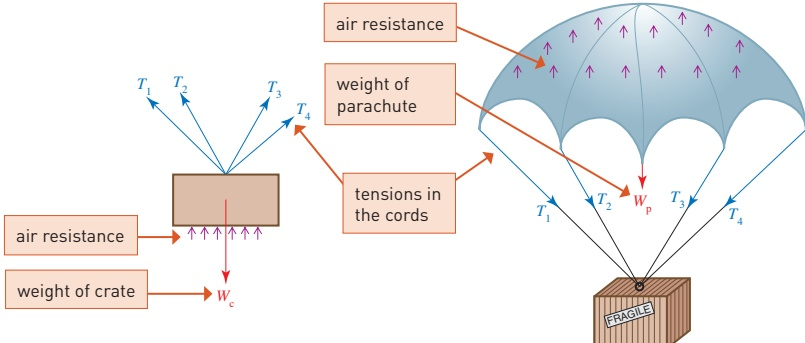

Figure 3.1 Forces acting on the crate

Figure 3.2 Forces acting on the parachute

Force diagrams are essential for the understanding of most mechanical situations. A force is a vector: it has a magnitude, or size, and a direction. It also has a line of action. This line often passes through a point of particular interest. Any force diagram should show clearly

▶ the direction of the force

the magnitude of the force

the line of action.

In Figures 3.1 and 3.2 each force is shown by an arrow along its line of action. The air resistance has been depicted by lots of separate arrows but this is not very satisfactory. It is much better if the combined effect can be shown by one arrow. When you have learned more about vectors, you will see how the tensions in the guy lines can also be combined into one force if you wish. The forces on the crate and parachute can then be simplified, as in Figures 3.3 and 3.4.

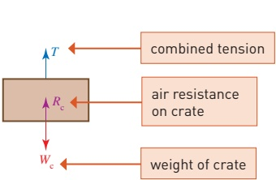

Figure 3.3 Forces acting on the crate

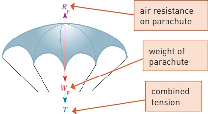

Figure 3.4 Forces acting on the parachute

<!-- page 58 -->

## Centre of mass and the particle model

When you combine forces you are finding their resultant. The weights of the crate and parachute are also found by combining forces; they are the resultant of the weights of all their separate parts. Each weight acts through a point called the centre of mass or centre of gravity.

Think about balancing a pen on your finger. The diagrams show the forces acting on the pen.

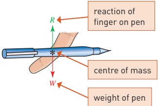

Figure 3.5

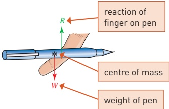

Figure 3.6

Provided that you place your finger under the centre of mass of the pen, as in Figure 3.5, it will balance. There is a force called a  $ \underline{\text{reaction}} $ between your finger and the pen that balances the weight of the pen. The forces on the pen are then said to be in  $ \underline{\text{equilibrium}} $. If you place your finger under another point, as in Figure 3.6, the pen will fall. The pen can only be in equilibrium if the two forces have the same line of action.

If you balance the pen on two

fingers, there is a reaction between

each finger and the pen at the point

where it touches the pen. These

reactions can be combined into

one resultant vertical reaction

acting through the centre of mass

(Figure 3.7).

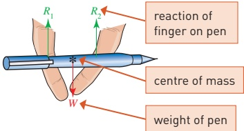

Figure 3.7

The centre of mass and behaviour of objects that are liable to rotate under the action of forces is covered in Further Mechanics. In this book you will only deal with situations where the resultant of the forces does not cause rotation. An object can then be modelled as a particle, which is a point mass, situated at its centre of mass. Any force acting on the particle can be modelled as acting on a single point.

## Newton's third law of motion

Sir Isaac Newton (1642–1727) is famous for his work on gravity and the mechanics you learn in this course is often called Newtonian mechanics because it is based entirely on Newton's three laws of motion. These laws

<!-- page 59 -->

provide an extremely powerful model of how objects, ranging in size from specks of dust to planets and stars, behave when they are influenced by forces.

Start with Newton's third law, which says that

When one object exerts a force on another there is always a reaction of the same kind that is equal, and opposite in direction, to the acting force.

You might have noticed that the combined tensions acting on the parachute and the crate in Figures 3.3 and 3.4 are both marked with the same letter,  $ T $. The crate applies a force on the parachute through the supporting guy lines and the parachute applies an equal and opposite force on the crate. When you apply a force to a chair by sitting on it, it responds with an equal and opposite force on you. Figure 3.8 shows the forces acting when someone sits on a chair.

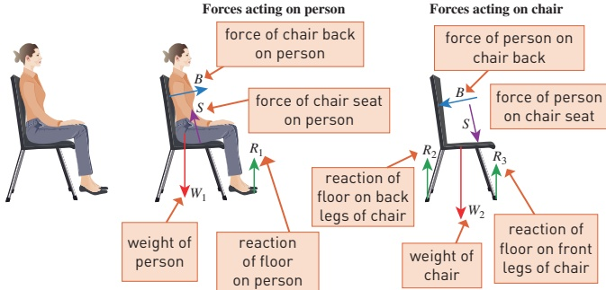

Figure 3.8

The reactions of the floor on the chair and on your feet act where there is contact with the floor. You can use  $ R_{1} $,  $ R_{2} $ and  $ R_{3} $ to show that they have different magnitudes. There are equal and opposite forces acting on the floor, but the forces on the floor are not being considered and so do not appear here.

In Figure 3.8 why is the weight of the person not shown on the force diagram for the chair?

Gravitational forces obey Newton's third law, just as other forces between bodies do. According to Newton's universal law of gravitation, Earth pulls us towards its centre and we pull Earth in the opposite direction. However, in this book we are only concerned with the gravitational force on us and not the force we exert on Earth.

All the forces you meet in mechanics, apart from the gravitational force, are the result of physical contact. This might be between two solids or between a solid and a liquid or gas.

<!-- page 60 -->

## Friction and normal reaction

When you push your hand along a table, the table reacts in two ways.

Firstly there are forces that stop your hand going through the table. Such forces are always present when there is any contact between your hand and the table. They are at right angles to the surface of the table and their resultant is called the normal reaction between your hand and the table.

There is also another force that tends to prevent your hand from sliding. This is the friction and it acts in a direction that opposes the sliding.

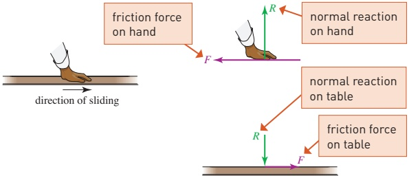

Figure 3.9

Figure 3.9 shows the reaction forces acting on your hand and on the table. By Newton's third law they are equal and opposite to each other. The frictional force is due to tiny bumps on the two surfaces (see the electronmicrograph in Figure 3.10). When you hold your hands together you will feel the normal reaction between them. When you slide them against each other you will feel the friction.

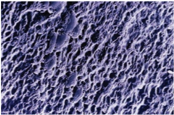

Figure 3.10 Etched glass magnified to high resolution, showing the tiny bumps

When the friction between two surfaces is negligible, at least one of the surfaces is said to be smooth. This is a modelling assumption which you will meet frequently in this book. Oil can make surfaces smooth and ice is often modelled as a smooth surface.

<!-- page 61 -->

» When the contact between two surfaces is smooth, the only forces between them are normal reactions which act at right angles to any possible sliding.

What direction is the reaction between the sweeper's broom and the smooth ice in Figure 3.11?

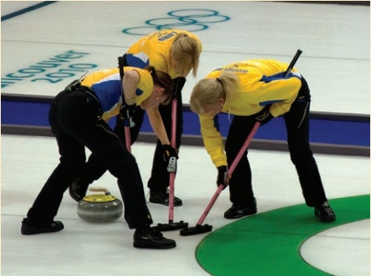

Figure 3.11

### Example 3.1

A TV set is standing on a small table. Draw a diagram to show the forces acting on the TV and on the table as seen from the front.

## Solution

Figure 3.12 shows the forces acting on the TV and on the table. They are all vertical because the weights are vertical and there are no horizontal forces acting.

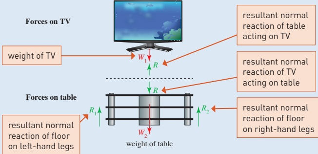

Figure 3.12

<!-- page 62 -->

Draw diagrams to show the forces acting on a tennis ball which is hit downwards across the court

(i) at the instant it is hit by the racket

(ii) as it crosses the net

(iii) at the instant it lands on the other side.

## Solution

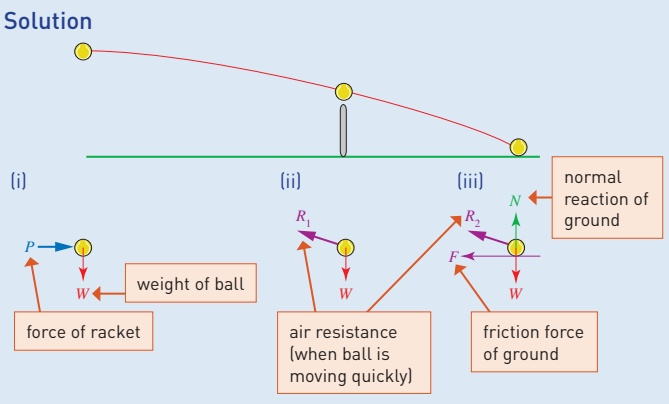

Figure 3.13

## Exercise 3A

In this exercise draw clear diagrams to show the forces acting on the objects named in italics. Clarity is more important than realism when drawing these diagrams.

1 A gymnast hanging at rest on a bar.

2 A light bulb hanging from a ceiling.

3 A book lying at rest on a table.

4 A book at rest on a table but being pushed by a small horizontal force.

5 Two books lying on a table, one on top of the other.

6 A horizontal plank being used to bridge a stream.

7 A snooker ball on a table which can be assumed to be smooth

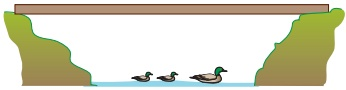

(i) as it lies at rest on the table

(ii) at the instant it is hit by the cue.

8 An ice hockey puck

(i) at the instant it is hit when standing on smooth ice

(ii) at the instant it is hit when standing on rough ice.

<!-- page 63 -->

9 A cricket ball which follows the path shown on the right.

Draw diagrams for each of the three positions A, B and C (include air resistance).

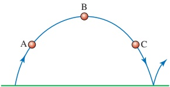

10 (i) Two balls colliding in mid-air.

(ii) Two balls colliding on a snooker table.

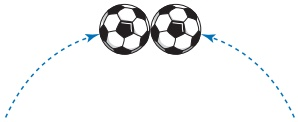

11 A paving stone leaning against a wall.

12 A cylinder at rest on smooth surfaces.

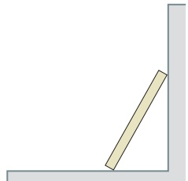

### 3.2 Force and motion

How are the rails and handles provided in buses and trains (Figure 3.14) used by standing passengers?

Figure 3.14

<!-- page 64 -->

## Newton's first law

Newton's first law can be stated as follows.

Every particle continues in a state of rest or uniform motion in a straight line unless acted on by a resultant external force.

Newton's first law provides a reason for the handles on trains and buses. When you are on a train which is stationary or moving at constant speed in a straight line you can easily stand without support. But when the velocity of the train changes, a force is required to change your velocity to match. This happens when the train slows down or speeds up. It also happens when the train goes round a bend even if the speed does not change. The velocity changes because the direction changes.

Why is Josh's car in the pond (Figure 3.15)?

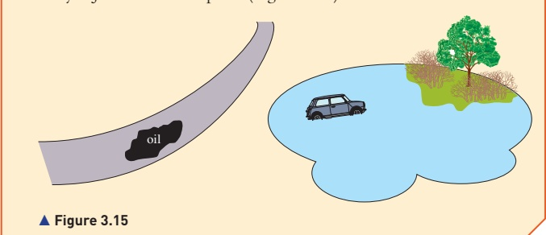

### Example 3.3

A coin is balanced on your finger and then you move it upwards, as in Figure 3.16.

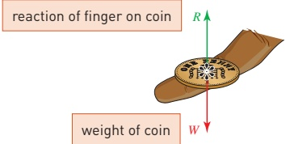

Figure 3.16

By considering Newton's first law, what can you say about W and R in each of these situations?

(i) The coin is stationary.

(ii) The coin is moving upwards with a constant velocity.

(iii) The speed of the coin is increasing as it moves upwards.

(iv) The speed of the coin is decreasing as it moves upwards.

<!-- page 65 -->

## Solution

(i) When the coin is stationary, as in Figure 3.17, the velocity does not change. The forces are in equilibrium and R = W.

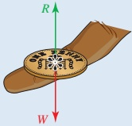

Figure 3.17

(ii) When the coin is moving upwards with a constant velocity, as in Figure 3.18, the velocity does not change. The forces are in equilibrium and R = W.

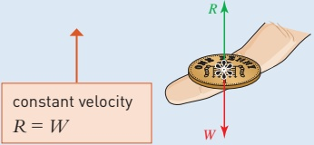

Figure 3.18

(iii) When the speed of the coin is increasing as it moves upwards (Figure 3.19) there must be a net upward force to make the velocity increase in the upward direction so R > W. The net force is R - W.

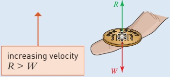

Figure 3.19

(iv) When the speed of the coin is decreasing as it moves upwards (Figure 3.20) there must be a net downward force to make the velocity decrease and slow the coin down as it moves upwards. In this case  $ W > R $ and the net force is  $ W - R $.

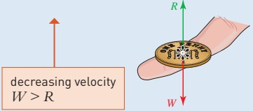

Figure 3.20

<!-- page 66 -->

(i) Draw diagrams showing the forces acting on

1 A book is resting on an otherwise empty table.

(a) the book

(b) the table as seen from the side.

(ii) Write down equations connecting the forces acting on the book and on the table.

2 You balance a coin on your finger and move it up and down. The reaction of your finger on the coin is R and its weight is W. Decide in each case whether R is greater than, less than or equal to W and describe the net force.

(i) The coin is moving downwards with a constant velocity.

(ii) The speed of the coin is increasing as it moves downwards.

(iii) The speed of the coin is decreasing as it moves downwards.

3 In each of the following situations say whether the forces acting on the object are in equilibrium by deciding whether its motion is changing.

(i) A car that has been stationary, as it moves away from a set of traffic lights.

(ii) A motorbike as it travels at a steady  $ 60 \, km h^{-1} $ along a straight road.

(iii) A parachutist descending at a constant rate.

(iv) A box in the back of a lorry as the lorry picks up speed along a straight, level motorway.

(v) An ice hockey puck sliding across a smooth ice rink.

(vi) A book resting on a table.

(vii) A plane flying at a constant speed in a straight line, but losing height at a constant rate.

(viii) A car going round a corner at constant speed.

4 Explain each of the following in terms of Newton's laws.

(i) Seat belts should be worn in cars.

(ii) Head rests are necessary in a car to prevent neck injuries when there is a collision from the rear.

## Driving forces and resistances to the motion of vehicles

In problems about such things as cycles, cars and trains, all the forces acting along the line of motion will usually be reduced to two or three: the driving force forwards, the resistance to motion (air resistance, etc.) and possibly a braking force backwards.

Resistances due to air or water always act in a direction opposite to the velocity of a vehicle or boat and are usually more significant for fast-moving objects.

<!-- page 67 -->

## Tension and thrust

The lines joining the crate of supplies to the parachute described at the beginning of this chapter are in tension. They pull upwards on the crate and downwards on the parachute. You are familiar with tensions in ropes and strings, but rigid objects can also be in tension.

When you hold the ends of a pencil, one with each hand, and pull your hands apart, you are pulling on the pencil. What is the pencil doing to each of your hands? Draw the forces acting on your hands and on the pencil.

Now draw the forces acting on your hands and on the pencil when you push the pencil inwards.

Your first diagram might look like Figure 3.21. The pencil is in tension so there is an inward tension force on each hand.

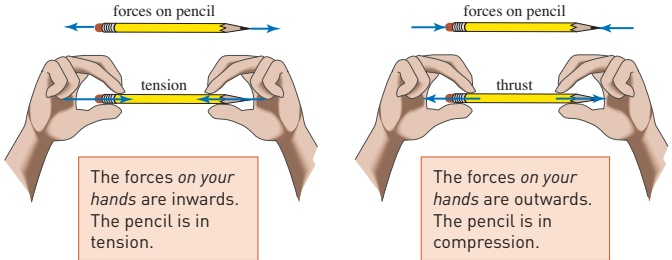

Figure 3.21

Figure 3.22

When you push the pencil inwards the forces on your hands are outwards as in Figure 3.22. The pencil is said to be in compression and the outward force on each hand is called a thrust.

If each hand applies a force of 2 units on the pencil, the tension or thrust acting on each hand is also 2 units because each hand is in equilibrium.

Which of the diagrams in Figures 3.21 and 3.22 is still possible if the pencil is replaced by a piece of string?

## Resultant forces and equilibrium

You have already met the idea that a single force can have the same effect as several forces acting together. Imagine that several people are pushing a car. A single rope pulled by another car can have the same effect. The force of the rope is equivalent to the resultant of the forces of the people pushing the car. When there is no resultant force, the forces are in equilibrium and there is no change in motion.

<!-- page 68 -->

A car is using a tow bar to pull a trailer along a straight, level road. There are resisting forces R acting on the car and S acting on the trailer. The driving force of the car is D and its braking force is B.

Draw diagrams showing the horizontal forces acting on the car and the trailer

(i) when the car is moving at constant speed

(ii) when the speed of the car is increasing

(iii) when the car brakes and slows down rapidly.

In each case write down the resultant force acting on the car and on the trailer.

## Solution

(i) When the car moves at constant speed, the forces are as shown in Figure 3.23. The tow bar is in tension and the effect is a forward force on the trailer and an equal and opposite backward force on the car.

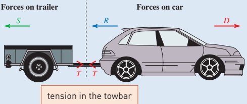

Figure 3.23 Car travelling at constant speed

There is no resultant force on either the car or the trailer when the speed is constant; the forces on each are in equilibrium.

For the trailer: T - S = 0

For the car: D - R - T = 0

(ii) When the car speeds up, the same diagram will do, but now the magnitudes of the forces are different. There is a resultant forward force on both the car and the trailer.

For the trailer:  $ \quad \text{resultant} = T - S $

For the car:  $ \quad \text{resultant} = D - R - T $

(iii) When the car brakes a resultant backward force is required to slow down the trailer. When the resistance S is not sufficiently large to do this, a thrust in the tow bar comes into play as shown in Figure 3.24.

<!-- page 69 -->

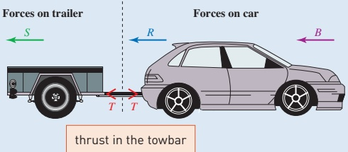

Figure 3.24 Car braking

For the trailer: resultant = T + S

## Newton's second law

Newton's second law gives more information about the relationship between the magnitude of the resultant force and the change in motion. Newton said that

The change in motion is proportional to the force.

For objects with constant mass, this can be interpreted as the force is proportional to the acceleration.

 $$ \mathrm{Resultant~force}=\mathrm{a~constant}\times\mathrm{acceleration} $$ 

The constant in this equation is proportional to the mass of the object: a more massive object needs a larger force to produce the same acceleration. For example, you and your friends would be able to give a car a greater acceleration than you would be able to give a lorry.

Newton's second law is so important that a special unit of force, the  $ \mathbf{newton} $ (N), has been defined so that the constant in equation ① is actually equal to the mass. A force of 1 newton will give a mass of 1 kilogram an acceleration of  $ 1 \, m s^{-2} $. The equation then becomes:

 $$ \mathrm{Resultant~force}=\mathrm{mass}\times\mathrm{acceleration} $$ 

This is written:

 $$ F=m a $$ 

The resultant force and the acceleration are always in the same direction.

## Relating mass and weight

The mass of an object is related to the amount of matter in the object. It is a scalar. The weight of an object is a force. It has magnitude and direction and so is a vector.

The mass of an astronaut on the moon (Figure 3.25) is the same as his mass on Earth but his weight is only about one-sixth of his weight on Earth. This is why he can bounce around more easily on the moon. The gravitational force on the moon is less because the mass of the moon is less than that of Earth.

<!-- page 70 -->

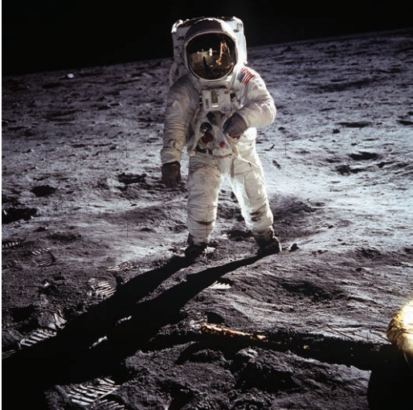

### Figure 3.25

When Buzz Aldrin made the first landing on the moon in 1969 with Neil Armstrong, one of the first things he did was to drop a feather and a hammer to demonstrate that they fell at the same rate. Their accelerations due to the gravitational force of the moon were equal, even though they had very different masses. The same is true on Earth. If other forces were negligible all objects would fall with an acceleration g.

When the weight is the only force acting on an object, Newton's second law means that

 $$ \mathrm{Weight\ in\ newtons=mass\ in\ kg\times g\ in\ ms^{-2}} $$ 

Using standard letters:

 $$ W=m g $$ 

Even when there are other forces acting, the weight can still be written as mg. A good way to visualise a force of 1 N is to think of the weight of an apple. 1 kg of apples weighs approximately  $ 1 \times 10 $ N = 10 N. There are about 10 small to medium-sized apples in 1 kg, so each apple weighs about 1 N.

## Note

Anyone who says 1 kg of apples weighs 1 kg is not strictly correct. The terms weight and mass are often confused in everyday language but it is very important for your study of mechanics that you should understand the difference.

<!-- page 71 -->

What is the weight of

(i) a baby of mass 3 kg

(ii) a golf ball of mass 46 g?

## Solution

(i) The baby's weight is  $ 3 \times 10 = 30 \, N $.

(ii) Mass of golf ball = 46g

= 0.046 kg

 $$ \begin{aligned}Weight&=0.046\times10\\&=0.46N.\end{aligned} $$ 

## Exercise 3C

Data: On Earth  $ g = 10 \, \text{ms}^{-2} $. On the moon  $ g = 1.6 \, \text{ms}^{-2} $. 1000 newtons (N) = 1 kilonewton (kN).

1000 newtons (N) = 1 kilonewton (kN).

1 Calculate the magnitude of the force of gravity on each of these objects on Earth.

(i) A suitcase of mass 15 kg.

(ii) A car of mass 1.2 tonnes. (1 tonne = 1000 kg)

(iii) A letter of mass 50 g.

2 Find the mass of each of these objects on Earth.

(i) A girl of weight 600 N.

(ii) A lorry of weight 11 kN.

3 A person has mass 65 kg. Calculate the force of gravity

(i) of Earth on the person

(ii) of the person on Earth.

4 What reaction force would an astronaut of mass 70 kg experience while standing on the moon?

5 Two balls of the same shape and size but with masses 1 kg and 3 kg are dropped from the same height.

(i) Which hits the ground first?

(ii) If they were dropped on the moon what difference would there be?

6 Estimate your mass in kilograms.

(ii) Calculate your weight when you are on Earth's surface.

(iii) What would your weight be if you were on the moon?

(iv) When people say that a baby weighs 4 kg, what do they mean?

<!-- page 72 -->

Most weighing machines have springs or some other means to measure force even though they are calibrated to show mass. Would something appear to weigh the same on the moon if you used one of these machines? What could you use to find the mass of an object irrespective of where you measure it?

### 3.3 Pulleys

In the remainder of this chapter weight will be represented by mg. You will learn to apply Newton's second law more generally in the next chapter.

The effect of a pulley is to change the line of action of the force in a string or rope. The same effect can be achieved by passing the string over a peg but in practice that almost always involves friction, making it harder to pull on the string. By contrast, when a pulley is well designed it takes a relatively small force to make it turn. The ideal pulley is described as smooth and light. Subject to these modelling assumptions the magnitude of the tension in the string is the same on both sides of the pulley. The term smooth applies to the contact between the pulley and the axle that it is rotating about. The string does not slide over the pulley but moves with it as it turns.

Figure 3.26 shows the forces acting when a pulley is used to lift a heavy parcel.

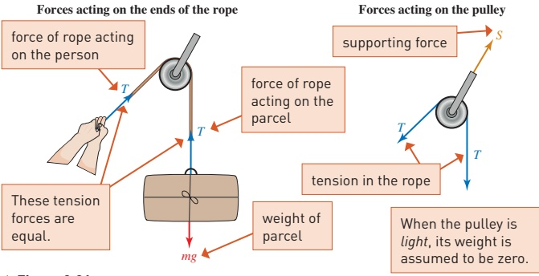

## Note

The rope is in tension. It is not possible for a rope to exert a thrust force.

<!-- page 73 -->

In Figure 3.27 the pulley is smooth and light and the 2kg block, A, is on a rough surface.

(i) Draw diagrams to show the forces acting on each of A and B.

(ii) If the block A does not slip, find the tension in the string and calculate the magnitude of the friction force on the block.

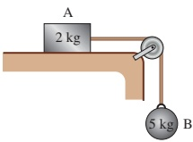

(iii) Write down the resultant force acting on each of A and B if the block slips and accelerates.

Figure 3.27

## Solution

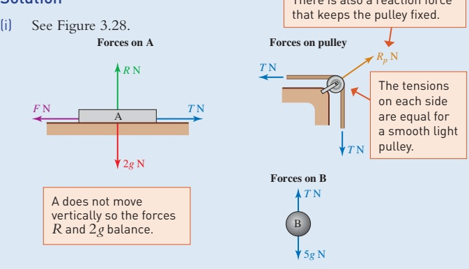

There is also a reaction force that keeps the pulley fixed.

Figure 3.28

## Note

The masses of 2kg and 5kg are not shown in the force diagram. The weights 2g N and 5g N are more appropriate.

(ii) When the block does not slip, the forces on B are in equilibrium so

 $$ \begin{array}{l} 5g-T=0\\ T=5g \end{array} $$ 

The tension throughout the string is 5g N. For A, the resultant horizontal force is zero so

 $$ \boldsymbol{T}-\boldsymbol{F}=0 $$ 

 $$ F=T=5g $$ 

The friction force is 5g N towards the left.

(iii) When the block slips, the forces are not in equilibrium and T and F have different magnitudes.

The resultant horizontal force on A is  $ (T-F) $ N towards the right. The resultant force on B is  $ (5g-T) $ N vertically downwards.

<!-- page 74 -->

In this exercise you are asked to draw force diagrams using the various types of force you have met in this chapter. Remember that all the forces you need, other than weight, occur when objects are in contact or joined together in some way. Where motion is involved, indicate its direction clearly.

1 Draw labelled diagrams showing the forces acting on the objects in italics.

(i) A car towing a caravan.

(ii) A caravan being towed by a car.

(iii) A person pushing a supermarket trolley.

(iv) A suitcase on a horizontal moving pavement (as at an airport)

(a) immediately after it has been put down

(b) when it is moving at the same speed as the pavement.

(v) A sledge being pulled uphill.

2 Ten boxes each of mass 5kg are stacked on top of each other on the floor.

(i) What forces act on the top box?

(ii) What forces act on the bottom box?

3 The diagrams show a box of mass $m$ under different systems of forces.

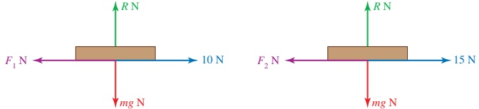

(i) In the first case the box is at rest. State the value of  $ F_{1} $.

(ii) In the second case the box is slipping. Write down the resultant horizontal force acting on it.

4 In this diagram the pulleys are smooth and light, the strings are light, and the table is rough.

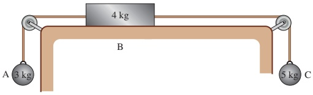

(i) What is the direction of the friction force on the block B?

(ii) Draw clear diagrams to show the forces on each of A, B and C.

(iii) By considering the equilibrium of A and C, calculate the tensions in the strings when there is no slipping.

(iv) Calculate the magnitude of the friction when there is no slipping. Now suppose that there is insufficient friction to stop the block from slipping.

(v) Write down the resultant force acting on each of A, B and C.

<!-- page 75 -->

5 A man who weighs 720 N is doing some repairs to a shed. In each of these situations draw diagrams showing

(a) the forces the man exerts on the shed

(b) all the forces acting on the man

(ignore any tools he might be using).

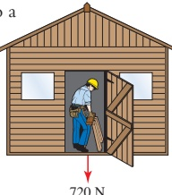

In each case, compare the reaction between the man and the floor with his weight of 720 N.

720 N

(i) He is pushing upwards on the ceiling with force UN.

(ii) He is pulling downwards on the ceiling with force D N.

(iii) He is pulling upwards on a nail in the floor with force F N.

(iv) He is pushing downwards on the floor with force T N.

6 The diagram shows a train, consisting of an engine of mass 50 000kg pulling two trucks, A and B, each of mass 10 000kg. The force of resistance on the engine is 2000 N and that on each of the trucks 200 N. The train is travelling at constant speed.

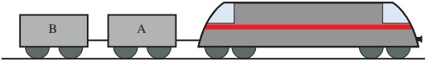

(i) Draw a diagram showing the horizontal forces on the train as a whole. Hence, by considering the equilibrium of the train as a whole, find the driving force provided by the engine.

The coupling connecting truck A to the engine exerts a force  $ T_{1} $ N on the engine and the coupling connecting truck B to truck A exerts a force  $ T_{2} $ N on truck B.

(ii) Draw diagrams showing the horizontal forces on the engine and on truck B.

(iii) By considering the equilibrium of the engine alone, find  $ T_{1} $

(iv) By considering the equilibrium of truck B alone, find  $ T_{2} $.

(v) Show that the forces on truck A are also in equilibrium.

## Historical note

Isaac Newton (Figure 3.29) was born in Lincolnshire in 1642. He was not an outstanding scholar either as a schoolboy or as a university student, yet later in life he made remarkable contributions in dynamics, optics, astronomy, chemistry, music theory and theology. He became Member of Parliament for Cambridge University and later Warden of the Royal Mint. His tomb in Westminster Abbey reads 'Let mortals rejoice that there existed such and so great an Ornament to the Human Race'.

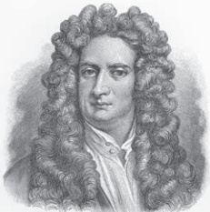

Isaak Newton

<!-- page 76 -->

### 3.4 Reviewing a mathematical model: air resistance

In mechanics you express the real world as mathematical models. The process of modelling involves the cycle shown in Figure 3.30 and this is used in the example that follows.

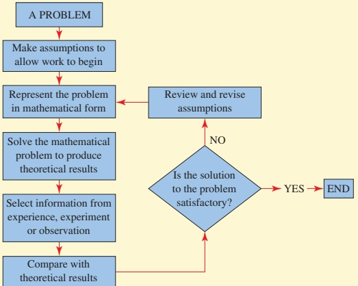

Figure 3.30

» Consider Figure 3.31. Why does a leaf or a feather or a piece of paper fall more slowly than other objects?

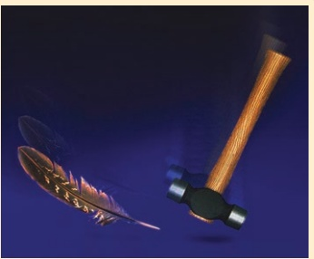

Figure 3.31

Model 1: The model you have used so far for falling objects has assumed no air resistance and this is clearly unrealistic in many circumstances. There are several possible models for air resistance but it is usually better when modelling to try simple models first. Having rejected the first model you could try a second one as follows.

<!-- page 77 -->

Model 2: Air resistance is constant and the same for all objects (Figure 3.32).

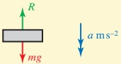

Figure 3.32

Assume an object of mass m falls vertically through the air.

The equation of motion is  $ mg - R = ma $

 $$ a=g-\frac{R}{m} $$ 

The model predicts that a heavy object will have a greater acceleration than a lighter one because  $ \frac{R}{m} $ is smaller for larger m.

This seems to agree with your experience of dropping a piece of paper and a book, for example. The heavier book has a greater acceleration.

However, think again about air resistance. Is there a property of the object other than its mass which might affect its motion as it falls? How do people and animals maximise or minimise the force of the air?

Try dropping two identical sheets of paper from a horizontal position, but fold one of them. The folded one lands first even though they have the same mass.

This contradicts the prediction of model 2. A large surface at right angles to the motion seems to increase the resistance.

Model 3: Air resistance is proportional to the area perpendicular to the motion.

Assume the air resistance is kA where k is constant and A is the area of the surface perpendicular to the motion (Figure 3.33).

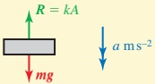

Figure 3.33

The equation of motion is now  $ mg - kA = ma $

 $$ a=g-\frac{kA}{m} $$ 

According to this model, the acceleration depends on the ratio of the area to the mass.

<!-- page 78 -->

## Testing the new model

For this experiment you will need some rigid corrugated card such as that used for packing or in grocery boxes (cereal box card is too thin), scissors and tape.

Cut out ten equal squares of side 8 cm. Stick two together by binding the edges with tape to make them smooth. Then stick three and four together in the same way so that you have four blocks A to D of different thickness as shown in Figure 3.34.

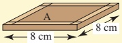

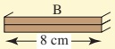

### Figure 3.34

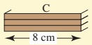

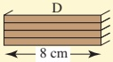

Cut out ten larger squares with 12 cm sides. Stick them together in the same way to make four blocks E, F, G and H.

Observe what happens when you hold one or two blocks horizontally at a height of about 2 m and let them fall. You do not need to measure anything in this experiment, unless you want to record the area and mass of each block, but write down your observations in an orderly fashion.

1 Drop each one separately. Could its acceleration be constant?

2 Compare A with B and C with D. Make sure you drop each pair from the same height and at the same instant of time. Do they take the same time to fall? Predict what will happen with other combinations and test your predictions.

3 Experiment in a similar way with E, F, G and H.

4 Now compare A with E, B with F, C with G and D with H. Compare also the two blocks whose dimensions are all in the same ratio, i.e. B and G.

Do your results suggest that model 3 might be better than model 2?

If you want to be more certain, the next step would be to make accurate measurements. Nevertheless, this model explains why small animals can be relatively unscathed after falling through heights which would cause serious injury to human beings.

All the above models ignore one important aspect of air resistance. What is that?

<!-- page 79 -->

## KEY POINTS

## 1 Newton's laws of motion

Every object continues in a state of rest or uniform motion in a straight line unless it is acted on by a resultant external force.

Resultant force = mass  $ \times $ acceleration or F = ma.

When one object exerts a force on another there is always a reaction which is equal, and opposite in direction, to the acting force.

Force is a vector; mass is a scalar.

The weight of an object is the force of gravity pulling it towards the centre of Earth. Weight = mg vertically downwards.

#### 2 S.I. units

length: metre (m)

time: second (s)

velocity:  $ m s^{-1} $

acceleration: m s^{-2}

mass: kilogram (kg)

1 tonne = 1000 kg

## 3 Force

1 newton (N) is the force required to give a mass of 1 kg an acceleration of 1 ms^{-2}.

A force of 1000 newtons (N) = 1 kilonewton (kN).

## 4 Types of force

Forces due to contact between surfaces

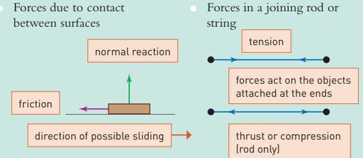

A smooth light pulley

Forces on a wheeled vehicle

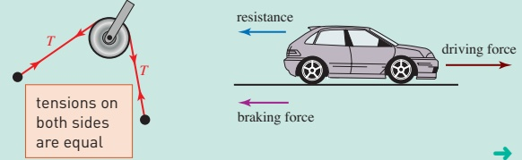

<!-- page 80 -->

## 5 Commonly used modelling terms

inextensible

does not vary in length

light

negligible mass

• negligible

small enough to ignore

particle

negligible dimensions

smooth

negligible friction

uniform

the same throughout

## 6 Reviewing a model

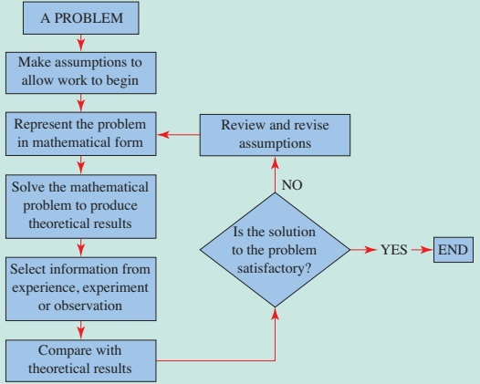

## LEARNING OUTCOMES

Now that you have finished this chapter, you should be able to

draw and label force diagrams

understand and use the terms

understand the vector nature of force

resultant force

equilibrium

friction

smooth

normal reaction

understand and use different types of force

resistance

weight

friction

<!-- page 81 -->

normal reaction

☐ tension

thrust or compression

understand and use Newton's three laws of motion

understand and use the relationship between mass and weight  $ W = mg $

form and solve the equations of motion when objects are in equilibrium

form and solve the equations of motion for connected particles

where the objects are in equilibrium

☐ where both objects travel in the same direction

where the objects are connected via a pulley and move in different directions

by looking at the system as a whole and by looking at each of the particles separately.

