# 4 Applying Newton’s second law along a line

<!-- Cambridge International AS  A Level Mathematics Mechanics (Sophie Goldie) .pdf p82-101 -->

<!-- page 82 -->

## 4 

## Applying Newton's second law along a line

Nature to him was an open book. He stands before us, strong, certain and alone.

Einstein (1879–1955) on Newton

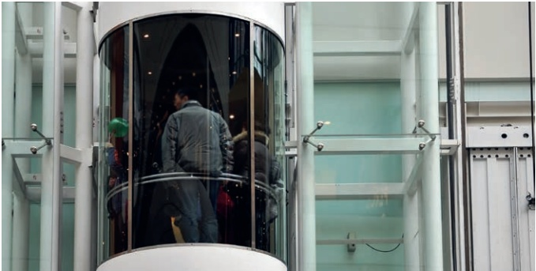

### 4.1 Newton's second law

Attach a weight to a spring balance and move it up and down. What happens to the pointer on the balance?

What would you observe if you stood on some bathroom scales in a moving lift?

Hold a heavy book on your hand and move it up and down. What force do you feel on your hand?

## Equation of motion

Suppose you make the book accelerate upwards at  $ a \text{ms}^{-2} $. Figure 4.1 shows the forces acting on the book and the acceleration.

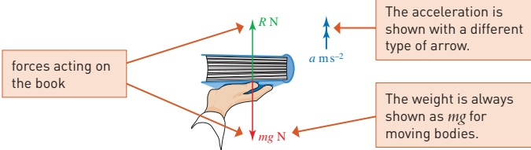

Figure 4.1

<!-- page 83 -->

By Newton's first law, a resultant force is required to produce an acceleration. In this case the resultant upward force is R - mg newtons.

You were introduced to Newton's second law in Chapter 3. When the forces are in newtons, the mass in kilograms and the acceleration in metres per second squared, this law is:

 $$ \text{Resultant force}=\text{mass}\times a\quad\leftarrow\quad\begin{array}{l}\text{where force and acceleration}\\ \text{are in the same direction}\end{array} $$ 

So for the book:

 $$ R-mg=ma $$ 

When Newton's second law is applied, the resulting equation is called the equation of motion.

When you give a book of mass 0.8kg an acceleration of 0.5ms^{-2}, equation ① becomes

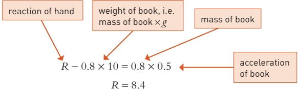

When the book is accelerating upwards, the reaction force of your hand on the book is 8.4N. This is equal and opposite to the force experienced by you so the book feels heavier than its actual weight, mg, which is  $ 0.8 \times 10 = 8 $N.

## Exercise 4A

1 Calculate the resultant force in newtons required to produce each acceleration.

(i) A car of mass 400kg has acceleration  $ 2m s^{-2} $.

(ii) A blue whale of mass 177 tonnes has acceleration  $ 0.5 \, m s^{-2} $.

(iii) A pygmy mouse of mass 7.5 grams has acceleration  $ 3 \, m s^{-2} $.

(iv) A freight train of mass 42000 tonnes brakes with deceleration  $ 0.02 \, \text{m} \, \text{s}^{-2} $.

(v) A bacterium of mass  $ 2 \times 10^{-16} $ grams has acceleration  $ 0.4 \, m s^{-2} $.

(vi) A woman of mass 56 kg falling off a high building has acceleration  $ 9.8 \, m s^{-2} $.

(vii) A jumping flea of mass 0.05mg accelerates at 1750ms^{-2} during take-off.

(viii) A galaxy of mass  $ 10^{42} $ kg has acceleration  $ 10^{-12} $ m s $ ^{-2} $.

2 A resultant force of 100N is applied to a body. Calculate the mass of the body when its acceleration is

 $$ 0.5\mathrm{m s}^{-2} $$ 

(ii)  $ 2 \, m s^{-2} $

(iii)

 $$ 0.01\mathrm{m s}^{-2} $$ 

(iv)  $ 10g $.

3 What is the reaction between a book of mass 0.8kg and your hand when it is

(i) accelerating downwards at  $ 0.3 \, m s^{-2} $

(ii) moving upwards at constant speed?

<!-- page 84 -->

A lift and its passengers have a total mass of 400kg. Find the tension in the cable supporting the lift when

(i) the lift is at rest

(ii) the lift is moving at constant speed

(iii) the lift is accelerating upwards at  $ 0.8 \, m s^{-2} $

(iv) the lift is accelerating downwards at  $ 0.6 \, m \, s^{-2} $.

## Solution

Before starting the calculations you must define a direction as positive. In this example the upward direction is chosen to be positive, as shown in Figure 4.2. T is the tension in the cable.

## (i) At rest

As the lift is at rest the forces must be in equilibrium. The equation of motion is

 $$ \begin{array}{r} T-mg=0 \\ T-400\times10=0 \\ T=4000 \end{array} $$ 

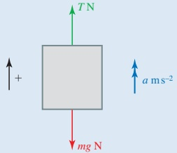

The tension in the cable is 4000 N.

Figure 4.2

(ii) Moving at constant speed

Again, the forces on the lift must be in equilibrium because it is moving at a constant speed, so the tension is 4000N.

## (iii) Accelerating upwards

The resultant upward force on the lift is  $ T - mg $ so the equation of motion is

 $$ T-mg=ma $$ 

which in this case gives

 $$ T-400\times10=400\times0.8 $$ 

 $$ T-4000=320 $$ 

 $$ T=4320 $$ 

The tension in the cable is 4320 N.

(iv) Accelerating downwards

The equation of motion is

 $$ T-mg=ma $$ 

In this case, a is negative so

A downward acceleration of  $ 0.6 \, m s^{-2} $ is an upward acceleration of  $ -0.6 \, m s^{-2} $

 $$ T-400\times10=400\times(-0.6) $$ 

 $$ T-4000=-240 $$ 

 $$ T=3760 $$ 

The tension in the cable is 3760N.

<!-- page 85 -->

How is it possible for the tension to be 3760N upwards but the lift to accelerate downwards?

Example 4.2

This example shows how the suvat formulae for motion with constant acceleration, which you met in Chapter 2, can be used with Newton's second law.

A supertanker of mass 500000 tonnes is travelling at a speed of  $ 10 \, m \, s^{-1} $ when its engines fail. It then takes half an hour for the supertanker to stop.

When the engines have been repaired it takes the supertanker 10 minutes to return to its full speed of  $ 10 \, m \, s^{-1} $.

(i) Find the force of resistance, assuming it to be constant, acting on the supertanker.

(ii) Find the driving force produced by the engines, assuming this also to be constant.

## Solution

Use the direction of motion as positive.

You have to be very careful with signs: the resultant force and acceleration are both positive towards the right.

(i) First find the acceleration of the supertanker, which is constant for constant forces. Figure 4.3 shows the velocities and acceleration.

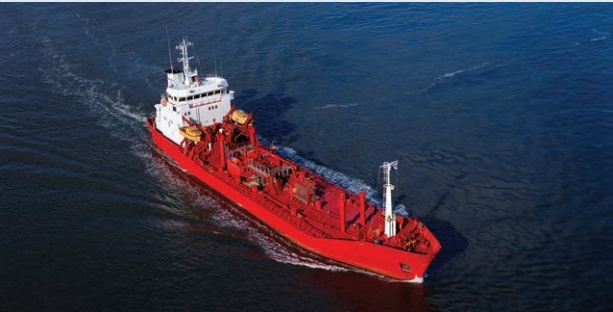

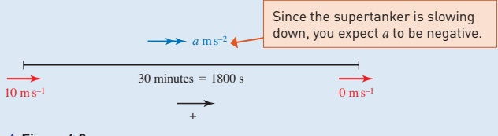

<!-- page 86 -->

You know u = 10, v = 0, t = 1800 and you want a, so use v = u + at.

 $$ \begin{array}{l}0=10+1800a\\a=-\frac{1}{180}\end{array} $$ 

Now you can use Newton's second law (Newton II) to write down the equation of motion. Figure 4.4 shows the horizontal forces and the acceleration.

The acceleration is negative because the supertanker is slowing down.

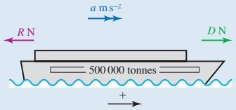

The upthrust of the water balances the weight of the supertanker in the vertical direction.

### Figure 4.4

The resultant forward force is $D - R$ newtons. When there is no driving force $D = 0$ so Newton II gives

 $$ 0-R=500000000\times a $$ 

The mass must be in kg.

 $$ a=\begin{array}{r}{-\frac{1}{180}}\end{array} $$ 

 $$ -R=500000000\times\left(-\frac{1}{180}\right) $$ 

The resistance to motion is  $ 2.77... \times 10^6\text{N} $ or  $ 2780\text{kN} $ (correct to 3 s.f.).

(ii) Now  $ u = 0 $,  $ \nu = 10 $ and  $ t = 600 $, and you want a, so use  $ \nu = u + at $ again.

 $$ 10=0+a\times600 $$ 

 $$ a=\frac{1}{60} $$ 

Using Newton's second law again

 $$ D-R=500000000\times a $$ 

 $$ D-2.77...\times10^{6}=500000000\times\frac{1}{60} $$ 

 $$ D=2.77...\times10^{6}+8.33...\times10^{6} $$ 

The driving force is  $ 1.11 \times 10^7 $N or 11 100kN (correct to 3 s.f.).

## Tackling mechanics problems

When you tackle mechanics problems such as these you will find them easier if you:

always draw a clear diagram

》 clearly indicate the positive direction

▶ label each object (A, B, etc. or whatever is appropriate)

show all the forces acting on each object

make it clear which object you are referring to when writing an equation of motion.

<!-- page 87 -->

(i) the acceleration of the car

1 A man pushes a car of mass 400 kg on level ground with a force of 200 N. The car is initially at rest and the man maintains this force until the car reaches a speed of  $ 5 \, m \, s^{-1} $. Ignoring any resistance forces, find

(ii) the distance the car travels while the man is pushing.

## M

2 The engine of a car of mass 1.2 tonnes can produce a driving force of 2000 N. Ignoring any resistance forces, find

(i) the car's resulting acceleration

(ii) the time taken for the car to go from rest to 27ms^{-1} (about 60 mph).

3 A top sprinter of mass 65kg starting from rest reaches a speed of  $ 10\, \text{ms}^{-1} $ in 2s.

## M

(i) Calculate the force required to produce this acceleration, assuming it is uniform.

(ii) Compare this to the force exerted by a weightlifter holding a mass of 180 kg above the ground.

4 An ice skater of mass 65kg is initially moving with speed  $ 2\,m\,s^{-1} $ and glides to a halt over a distance of 10m. Assuming that the force of resistance is constant, find

(i) the size of the resistance force

(ii) the distance he would travel gliding to rest from an initial speed of  $ 6\,m\,s^{-1} $

(iii) the force he would need to apply to maintain a steady speed of  $ 10 \, \text{m} \, \text{s}^{-1} $.

5 A helicopter of mass 1000kg is taking off vertically.

(i) Draw a labelled diagram showing the forces on the helicopter as it lifts off and the direction of its acceleration.

(ii) Its initial upward acceleration is  $ 1.5 \, m s^{-2} $. Calculate the upward force its rotors exert. Ignore the effects of air resistance.

6 A spaceship of mass 5000kg is stationary in deep space. It fires its engines, producing a forward thrust of 2000N for 2.5 minutes, and then turns them off.

(i) What is the speed of the spaceship at the end of the 2.5 minute period?

(ii) Describe the subsequent motion of the spaceship.

The spaceship then enters a cloud of interstellar dust which brings it to a halt after a further distance of 7200 km.

[iii] What is the force of resistance (assumed constant) on the spaceship from the interstellar dust cloud?

The spaceship is travelling in convoy with another spaceship which is the same in all respects except that it is carrying an extra 500kg of equipment. The second spaceship carries out exactly the same procedure as the first one.

(iv) Which spaceship travels further into the dust cloud?

<!-- page 88 -->

## PS

7 A crane is used to lift a hopper full of cement to a height of 20m on a building site. The hopper has mass 200 kg and the cement 500kg. Initially the hopper accelerates upwards at  $ 0.05\,m\,s^{-2} $, then it travels at constant speed for some time before decelerating at  $ 0.1\,m\,s^{-2} $ until it is at rest. The hopper is then emptied.

## PS

The cable's maximum safe load is 10000 N.

(i) Find the tension in the crane's cable during each of the three phases of the motion and after emptying.

(ii) What is the greatest mass of cement that can safely be transported in the same manner?

The cable is in fact faulty and on a later occasion breaks without the hopper leaving the ground. On that occasion the hopper is loaded with 720kg of cement.

(iii) What can you say about the strength of the cable?

8 The police estimate that for good road conditions the frictional force, F, on a skidding vehicle of mass m is given by  $ F = 0.8 \, mg $. A car of mass 450 kg skids to a halt narrowly missing a child. The police measure the skid marks and find they are 12.0 m long.

## PS

(i) Calculate the deceleration of the car when it was skidding to a halt. The child's mother says the car was travelling well over the speed limit of  $ 50 \, km \, h^{-1} $ but the driver of the car says she was travelling at  $ 48 \, km \, h^{-1} $ and the child ran out in front of her.

(ii) Calculate the speed of the car when it started to skid.

Who was telling the truth?

An object is hung from a spring balance suspended from the roof of a life. When the lift is descending with uniform acceleration  $ 0.8 \, \text{m s}^{-2} $ the balance indicates a weight of 245 N. When the lift is ascending with uniform acceleration  $ a \, \text{m s}^{-2} $ the reading is 294 N.

## PS

Find the value of a.

10 An engine and train weigh 250 tonnes. The engine exerts a pull of  $ 1.5 \times 10^{5} $ N. The resistance to motion is  $ \frac{1}{100} $ of the weight of the train and its braking force is  $ \frac{1}{10} $ of the weight.

The train starts from rest and accelerates uniformly until it reaches a speed of  $ 45 \, km \, h^{-1} $. At this point the brakes are applied until the train stops.

Find the time taken for the train to stop to the nearest second.

<!-- page 89 -->

### 4.2 Newton's second law applied to connected objects

This section is about using Newton's second law for more than one object. It is important to be very clear which forces act on which object in these cases.

A stationary helicopter is raising two people of masses 90kg and 70kg as shown in the diagram in Figure 4.5.

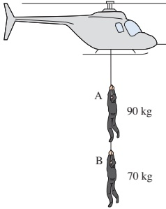

Figure 4.5

Imagine that you are each person in turn. Your eyes are shut so you cannot see the helicopter or the other person. What forces act on you? Remember that all the forces acting, apart from your weight, are due to contact between you and something else.

Which forces acting on A and B are equal in magnitude? What can you say about their accelerations?

### Example 4.3

(i) Draw a diagram to show the forces acting on the two people being raised by the helicopter in Figure 4.5 and their acceleration.

(ii) Write down the equation of motion for each person.

(iii) When the force applied to the first person, A, by the helicopter is 180g N, calculate

(a) the acceleration of the two people being raised

(b) the tension in the ropes.

## Solution

(i) Figure 4.6 shows the acceleration and forces acting on the two people.

(ii) When the helicopter applies a force  $ T_{1} $ N to A, the resultant upward forces are

A  $ (T_{1}-90g-T_{2})N $

B  $ (T_{2}-70g) $ N

<!-- page 90 -->

Their equations of motion are

A ( $ \uparrow $)  $ T_{1}-90g-T_{2}=90a $

B ( $ \uparrow $)  $ T_{2}-70g=70a $

(iii) (a) You can eliminate  $ T_{2} $ from equations ① and ② by adding:

 $$ \begin{array}{r} \begin{aligned} T_{1}-90g-T_{2}+T_{2}-70g&=90a+70a\\ T_{1}-160g&=160a\end{aligned} \quad \textcircled{3} $$ 

When the force, $T_{1}$, applied by the helicopter is 180g

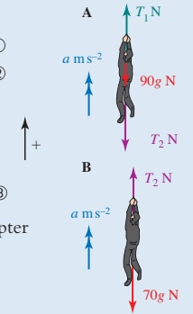

 $$ \begin{aligned}20g&=160a\\a&=1.25\end{aligned} $$ 

Figure 4.6

(b) Substituting for a in equation ② gives

 $$ \begin{aligned}T_{2}&=70\times1.25+70g\\&=787.5\end{aligned} $$ 

The acceleration is  $ 1.25 \, m s^{-2} $ and the tensions in the ropes are 1800N and 787.5N.

The force pulling downwards on A is 787.5 N. This is not equal to B's weight (700 N). Why are they different?

## Treating the system as a whole

When two objects are moving in the same direction with the same velocity at all times they can be treated as one. In Example 4.3 the two people can be treated as one object and then the equal and opposite forces  $ T_{2} $ cancel out. They are internal forces similar to the forces between your head and your body.

The resultant upward force on both people is  $ T_{1} - 90g - 70g $ and the total mass is 160kg so the equation of motion is:

 $$ T_{1}-90g-70g=160a\xleftarrow{\quad\quad}\begin{array}{l}\text{as equation③}\\ \text{above}\end{array} $$ 

So you can find a directly

 $$  whenT_{1}=180g $$ 

 $$ 20g=160a $$ 

 $$ a=1.25 $$ 

Treating the system as a whole finds a, but not the internal force  $ T_{2} $.

You need to consider the motion of B separately to obtain equation  $ {②} $.

 $$ \begin{array}{l}T_{2}-70g=70a\\\quad T_{2}=787.5\end{array}\quad\textcircled{2}\begin{array}{l}\end{array} $$

<!-- page 91 -->

Using this method, equation  $ \textcircled{1} $ can be used to check your answers. Alternatively, you could use equation  $ \textcircled{1} $ to find  $ T_{2} $ and equation  $ \textcircled{2} $ to check your answers.

When several objects are joined there are always more equations possible than are necessary to solve a problem and they are not all independent. In the above example, only two of the equations were necessary to solve the problem. The secret is to choose the most relevant ones.

## A note on mathematical modelling

Several modelling assumptions have been made in the solution to Example 4.3. It is assumed that:

the only forces acting on the people are their weights and the tensions in the ropes (forces due to the wind or air turbulence are ignored)

the motion is vertical and nobody swings from side to side

the ropes do not stretch (i.e. they are inextensible) so the accelerations of the two people are equal

the people are rigid bodies that do not change shape and can be treated as particles.

All these modelling assumptions make the problem simpler. In reality, if you were trying to solve such a problem you might work through it first, using these assumptions. You would then go back and decide which ones needed to be modified to produce a more realistic solution.

In the next example one person is moving vertically and the other horizontally. You might find it easier to decide on which forces are acting if you imagine you are Alvin or Bernard and you can't see the other person.

### Example 4.4

Alvin is using a snowmobile to pull Bernard out of a crevasse. His rope passes over a smooth block of ice at the top of the crevasse, as shown in Figure 4.7 (on page 76), and Bernard hangs freely away from the side. Alvin and his snowmobile together have a mass of 300 kg and Bernard's mass is 75 kg. Ignore any resistance to motion.

(i) Draw diagrams showing the forces on the snowmobile (including Alvin) and on Bernard.

(ii) Calculate the driving force required for the snowmobile to give Bernard an upward acceleration of  $ 0.5 \, m s^{-2} $ and the tension in the rope for this acceleration.

(iii) How long will it take for Bernard's speed to reach 5 m s $ ^{-1} $ starting from rest and how far will he have been raised in this time?

<!-- page 92 -->

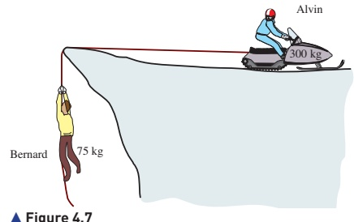

## Solution

(i) Figure 4.8 shows the essential features of the problem.

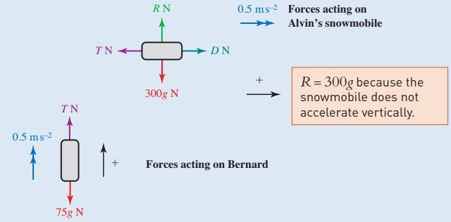

### Figure 4.8

(ii) Alvin and Bernard have the same acceleration, provided that the rope does not stretch. The tension in the rope is T newtons and Alvin's

driving force is D newtons.

The equations of motion are:

Alvin ( $ \rightarrow $)

 $$ \begin{aligned}&D-T=300\times0.5\\&D-T=150\\ \end{aligned} $$ 

The force towards the right = mass  $ \times $ acceleration towards the right.

Bernard ( $ \uparrow $)

 $$ \begin{aligned}T-75g&=75\times0.5\\ T-75g&=37.5\\ T&=37.5+75g\\ T&=787.5\end{aligned} $$ 

The upward force = mass  $ \times $ upward acceleration.

Substituting in equation ①

 $$ D-787.5=150 $$ 

 $$ D=937.5 $$ 

The driving force required is 937.5 N and the tension in the rope is 787.5 N.

<!-- page 93 -->

(iii) When u = 0, v = 5, a = 0.5 and t is required

 $$ \nu=u+at $$ 

 $$ 5=0+0.5\times t $$ 

 $$ t=10 $$ 

The time taken is 10 seconds. Using  $ s = ut + \frac{1}{2}at^{2} $ to find s gives

 $$ s=0+\tfrac{1}{2}a t^{2} $$ 

 $$ s=\frac{1}{2}\times0.5\times100 $$ 

 $ v^{2}=u^{2}+2as $ would also give s.

 $$ s=25 $$ 

The distance he has been raised is 25 m.

Alvin thinks the rope will not stand a tension of more than 1.2kN. What is the maximum safe acceleration in this case? Under the circumstances, is Alvin likely to use this acceleration?

Make a list of the modelling assumptions made in this example and suggest what effect a change in each of these assumptions might have on the solution.

### Example 4.5

A woman of mass 60kg is standing in a lift.

(i) Draw a diagram showing the forces acting on the woman.

Find the normal reaction of the floor of the lift on the woman in each case.

(ii) The lift is moving upwards at a constant speed of  $ 3 \, m s^{-1} $.

(iii) The lift is moving upwards with an acceleration of  $ 2 \, m s^{-2} $ upwards.

(iv) The lift is moving downwards with an acceleration of  $ 2 \, m s^{-2} $ downwards.

(v) The lift is moving downwards and slowing down with a deceleration of  $ 2 \, m s^{-2} $.

In order to calculate the maximum number of occupants that can safely be carried in the lift, the following assumptions are made:

The lift has mass 300kg, all resistances to motion may be neglected, the mass of each occupant is 75kg and the tension in the supporting cable should not exceed 12000N.

(vi) What is the greatest number of occupants that can be carried safely if the magnitude of the acceleration does not exceed  $ 3 \, m s^{-2} $?

<!-- page 94 -->

## Solution

(i) Figure 4.9 shows the forces acting on the woman and her acceleration.

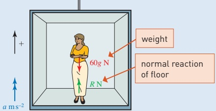

Figure 4.9

In general, when positive is upwards, her equation of motion is

 $$  R-60g=60a $$ 

This equation contains all the mathematics in the situation. It can be used to solve parts (ii) to (iv).

(ii) When the speed is constant a = 0 so R = 60g = 600.

The normal reaction is 600 N.

(iii) When a = 2

 $$ R-60g=60\times2 $$ 

 $$ R=120+600 $$ 

The normal reaction is 720 N.

(iv) When the acceleration is downwards, a = -2 so

 $$ R-60g=60\times(-2) $$ 

 $$ R=480 $$ 

The normal reaction is 480 N.

(v) When the lift is moving downwards and slowing down, the acceleration is negative downwards, so it is positive upwards, and $a=+2$. Then $R=720$ as in part (iii).

(vi) When there are $n$ passengers in the lift, the combined mass of these and the lift is $(300 + 75n)$ kg and their weight is $(300 + 75n)g$ N (Figure 4.10).

<!-- page 95 -->

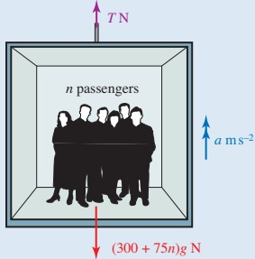

### Figure 4.10

The equation of motion for the lift and passengers together is

 $$ T-(300+75n)g=(300+75n)a $$ 

So when a = 3 and g = 10,

 $$ \begin{aligned}T&=(300+75n)\times3+(300+75n)\times10\\&=13(300+75n)\end{aligned} $$ 

For a maximum tension of 12000 N

 $$ 12000=13(300+75n) $$ 

 $$ 12000=3900+975n $$ 

 $$ 8100=975n $$ 

 $$ n=8.31(to3s.f.) $$ 

The lift cannot carry more than 8 passengers.

### Example 4.6

Two particles A and B, of masses 0.6kg and 0.4kg respectively, are connected by a light inextensible string which passes over a smooth fixed pulley. The particles hang freely, as shown in Figure 4.11, and are released from rest.

(i) Find the acceleration of the system and the tension in the string.

After 2 seconds the string is cut and in the subsequent motion both particles move freely under gravity.

(ii) Find the height of both particles at the instant that the string is cut.

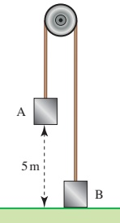

Figure 4.11

(iii) Find the total time taken for B to reach its maximum height above the ground.

<!-- page 96 -->

So at the instant the string is cut B has a velocity of  $ 4\,m\,s^{-1} $ and it has an acceleration of  $ -10\,m\,s^{-1} $ due to gravity. When B reaches its maximum height, its velocity is  $ 0\,m\,s^{-1} $

## Solution

(i) Since the pulley is smooth, the tension, T N, is the same throughout the string. When the particles start to move, particle A accelerates downwards and particle B accelerates upwards. Let their acceleration be  $ a \, \text{m s}^{-2} $.

Draw separate force diagrams for each particle (Figure 4.12).

At the instant B starts to move, the normal reaction is 0.

Figure 4.12

Applying F = ma to each particle gives:

Particle A:  $ 6 - T = 0.6a $ ①
Particle B:  $ T - 4 = 0.4a $ ②

Adding equations ① and ② gives:

 $ 2 = 1a $
 $ a = 2 $

Substituting a = 2 into equation ① or ② gives T = 4.8.

The acceleration is  $ 2 \, \text{m s}^{-2} $ and the tension is 4.8 N.

(ii) Let the particles' initial velocity be  $ u \, \text{m s}^{-1} $ and the distance they have travelled to s after they are released be  $ s \, \text{m} $.

u = 0 as the particles are initially at rest.

To find the height, s, use

 $ s = ut + \frac{1}{2}at^2 $

with a = 2 and t = 2.

 $ s = \frac{1}{2} \times 2 \times 2^2 $

s = 4

Particle A moves down 4m and particle B moves up 4m so that when the string is cut:

particle A is 5m - 4m = 1m above the ground
particle B is 4m above the ground.

(iii) First find the speed of B at the instant the string is cut.

Substituting u = 0, a = 2 and t = 2 into v = u + at gives

 $ v = 0 + 2 \times 2 = 4 $

Substituting v = 0, a = -10 and u = 4 into v = u + at gives

 $ 0 = 4 - 10t $

 $ \Rightarrow t = 0.4 $

The total time taken for B to reach its maximum height is  $ 2s + 0.4s = 2.4s $.

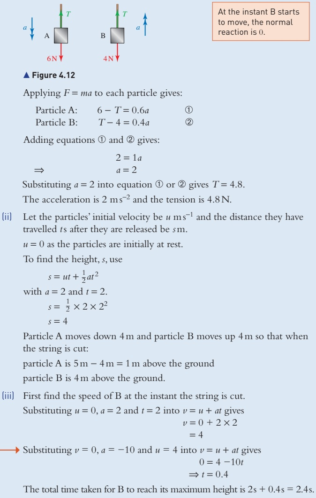

<!-- page 97 -->

Remember: Always make it clear which object each equation of motion refers to.

1 Masses A of 100g and B of 200g are attached to the ends of a light, inextensible string which hangs over a smooth pulley as shown in the diagram.

Initially B is held at rest 2m above the ground and A rests on the ground with the string taut. Then B is let go.

(i) Draw a diagram for each mass showing the forces acting on it and the direction of its acceleration at a later time when A and B are moving with an acceleration of  $ ams^{-2} $ and before B hits the ground.

(ii) Write down the equation of motion of each mass in the direction it moves using Newton's second law.

(iii) Use your equations to find a and the tension in the string.

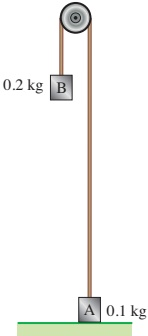

(iv) Find the time taken for B to hit the ground.

2 The diagram shows a block of mass 5 kg lying on a smooth table. It is attached to blocks of mass 2 kg and 3 kg by strings that pass over smooth pulleys. The tensions in the strings are  $ T_{1} $ and  $ T_{2} $, as shown, and the blocks have acceleration  $ a_{ms}^{-2} $.

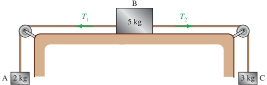

(i) Draw a diagram for each block showing all the forces acting on it and its acceleration.

(ii) Write down the equation of motion for each of the blocks.

(iii) Use your equations to find the values of a,  $ T_{1} $ and  $ T_{2} $.

In practice, the table is not truly smooth and a is found to be  $ 0.5 \, ms^{-2} $.

(iv) Repeat parts (i) and (ii) including a frictional force on B and use your new equations to find the frictional force that would produce this result.

3 The diagram shows a good train consisting of an engine of mass 40 tonnes and two trucks of 20 tonnes each. The engine is producing a driving force of  $ 5 \times 10^4 $ N, causing the train to accelerate. The ground is level and resistance forces may be neglected.

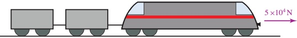

<!-- page 98 -->

(ii) Draw a diagram to show the forces acting on the engine and use this to help you to find the tension in the first coupling.

(i) By considering the motion of the whole train, find its acceleration.

(iii) Find the tension in the second coupling.

The brakes on the first truck are faulty and suddenly engage, causing a resistance of  $ 10^{4} $N.

(iv) What effect does this have on the tension in the coupling to the last truck?

4 The diagram shows a lift containing a single passenger.

(i) Make clear diagrams to show the forces acting on the passenger and the forces acting on the lift using the following letters:

the tension in the cable, TN

the reaction of the lift on the passenger,  $ R_{p}N $

the reaction of the passenger on the lift,  $ R_{L}N $

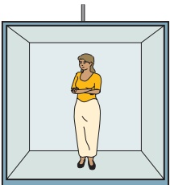

the weight of the passenger, mg N

the weight of the lift, MgN.

The masses of the lift and the passenger are 450kg and 50kg respectively.

(ii) Calculate  $ T, R_{p} $ and  $ R_{L} $ when the lift is stationary.

The lift then accelerates upwards at 0.8ms^{-2}.

(iii) Find the new values of $T, R_{\mathrm{p}}$ and $R_{\mathrm{L}}$.

5 A man of mass 70kg is standing in a lift which has an upward acceleration  $ a \, m s^{-2} $.

(i) Draw a diagram showing the man's weight, the force, R N, that the lift floor exerts on him and the direction of his acceleration.

(ii) Find the value of a when R = 770 N. The graph shows the value of R from the time (t = 0) when the man steps into the lift to the time (t = 12) when he steps out.

(iii) Explain what is happening in each section of the journey.

(iv) Draw the corresponding speed-time graph.

(v) To what height does the man ascend?

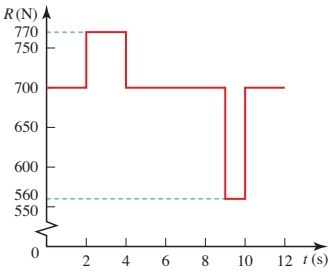

<!-- page 99 -->

## M

6 A lift in a mine shaft takes exactly one minute to descend 500m. It starts from rest, accelerates uniformly for 12.5 seconds to a constant speed which it maintains for some time and then decelerates uniformly to stop at the bottom of the shaft.

The mass of the lift is 5 tonnes and on the day in question it is carrying 12 miners whose average mass is 80kg.

(i) Sketch the speed-time graph of the lift.

During the first stage of the motion the tension in the cable is 53 640 N.

(ii) Find the acceleration of the lift during this stage.

(iii) Find the length of time for which the lift is travelling at constant speed and find the final deceleration.

(iv) What is the maximum value of the tension in the cable?

(v) Just before the lift stops one miner experiences an upthrust of 1002N from the floor of the lift. What is the mass of the miner?

7 Particles A and B, of masses 0.35kg and 0.15kg respectively, are attached to the ends of a light inextensible string. A is held at rest on a smooth horizontal surface with the string passing over a

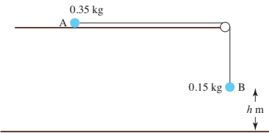

small smooth pulley fixed at the edge of the surface. B hangs vertically below the pulley at a distance h m above the floor (see diagram). A is released and the particles move. B reaches the floor and A subsequently reaches the pulley with a speed of  $ 3 \, \text{m} \, \text{s}^{-1} $.

(i) Explain briefly why the speed with which B reaches the floor is  $ 3 \, m s^{-1} $.

(ii) Find the value of h.

Cambridge International AS & A Level Mathematics

9709 Paper 43 Q2 June 2015

8 Particle A of mass 0.2kg and particle B of mass 0.6kg are attached to the ends of a light inextensible string. The string passes over a fixed smooth pulley. B is held at rest at a height of 1.6m above the floor. A hangs freely at a height of h m above the floor. Both straight parts of the string are vertical (see diagram). B is released and both particles start to move. When B reaches the floor it remains at rest, but A continues to move vertically upwards until it reaches a height of 3m above the floor. Find the speed

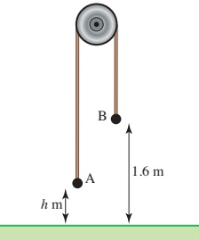

of B immediately before it hits the floor, and hence find the value of h.

<!-- page 100 -->

9 Particles A and B, of masses 0.5kg and m kg respectively, are attached to the ends of a light inextensible string which passes over a smooth fixed pulley. Particle B is held at rest on the horizontal floor and particle A hangs in equilibrium (see diagram). B is released and each particle starts to move vertically. A hits the floor 2s after B is released. The speed of each particle when A hits the floor is  $ 5m s^{-1} $.

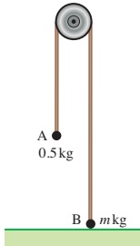

(i) For the motion while A is moving downwards, find

(a) the acceleration of A.

(b) the tension in the string.

(ii) Find the value of m.

Cambridge International AS & A Level Mathematics

9709 Paper 4 Q5 November 2008

10 Particles P and Q, of masses 0.55 kg and 0.45 kg respectively, are attached to the ends of a light inextensible string which passes over a smooth fixed pulley. The particles are held at rest with the string taut and its straight parts vertical. Both particles are at a height of 5 m above the ground (see diagram). The system is released.

(i) Find the acceleration with which

P starts to move.

The string breaks after 2s and in the subsequent motion P and Q move vertically under gravity.

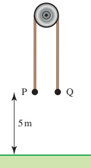

(ii) At the instant that the string breaks, find

(a) the height above the ground of P and of Q.

(b) the speed of the particles.

(iii) Show that Q reaches the ground 0.8s later than P.

Cambridge International AS & A Level Mathematics

9709 Paper 41 Q6 November 2009

11 A particle P of mass 0.2kg is released from rest at a point 7.2m above the surface of the liquid in a container. P falls through the air and into the liquid. There is no air resistance and there is no instantaneous change of speed as P enters the liquid. When P is at a distance of 0.8 m below the surface of the liquid, P's speed is  $ 6\, \text{m s}^{-1} $. The only force on P due to the liquid is a constant resistance to motion of magnitude R N.

(i) Find the deceleration of P while it is falling through the liquid, and hence find the value of R.

<!-- page 101 -->

The depth of the liquid in the container is 3.6 m. P is taken from the container and attached to one end of a light inextensible string. P is placed at the bottom of the container and then pulled vertically upwards with constant acceleration. The resistance to motion of R N continues to act. The particle reaches the surface 4 s after leaving the bottom of the container.

(ii) Find the tension in the string.

Cambridge International AS & A Level Mathematics

9709 Paper 42 Q6 June 2014

## KEY POINTS

1 The equation of motion

Newton's second law gives the equation of motion for an object.

The resultant force = mass  $ \times $ acceleration or F = ma

The acceleration is always in the same direction as the resultant force.

2 Connected objects

Reaction forces between two objects (such as tension forces in joining rods or strings) are equal and opposite.

When connected objects are moving along a line, the equations of motion can be obtained for each one separately or for a system containing more than one object. The number of independent equations is equal to the number of separate objects.

## LEARNING OUTCOMES

Now that you have finished this chapter, you should be able to

use Newton's second law of motion to form and solve the equations of motion of accelerating objects travelling in a straight line

form and solve the equations of motion for connected particles

where the objects are in equilibrium

where both objects travel in the same direction

where the objects are connected via a pulley and move in different directions

by looking at the system as a whole and by looking at each of the particles separately

solve problems which combine information about forces and information about travel using acceleration to link the two aspects

understand the modelling assumptions used when solving problems.

