# 5 Vectors b

<!-- Cambridge International AS  A Level Mathematics Mechanics (Sophie Goldie) .pdf p102-115 -->

<!-- page 102 -->

## 5 

## Vectors

I can't change the direction of the wind, but I can adjust my sails to always reach my destination.

Jimmy Dean (1928-2010)

## Note

This chapter introduces vectors as a useful way to simplify and solve mechanics problems. However, the Cambridge International syllabus does not require students to use vector notation.

Can you sail faster than the wind? How?

### 5.1 Adding vectors

If you walk 12m east and then 5m north, how far and in what direction will you be from your starting point?

A bird is caught in a wind blowing east at  $ 12 \, m \, s^{-1} $ and flies so that its speed would be  $ 5 \, m \, s^{-1} $ north in still air. What is its actual velocity?

A sledge is being pulled by two children with forces of 12N east and 5N north. What single force would have the same effect?

<!-- page 103 -->

All these situations involve vectors. A vector has size (magnitude) and direction. By contrast a scalar quantity has only magnitude. There are many vector quantities; in this book you meet four of them: displacement, velocity, acceleration and force. When two or more dimensions are involved, the ideas underlying vectors are very important; however, in one dimension, along a straight line, you can use scalars to solve problems involving these quantities.

Although they involve quite different situations, the three problems can be reduced to one by using the same vector techniques for finding magnitude and direction.

## Displacement vectors

The instruction ‘walk 12m east and then 5m north’ can be modelled mathematically using a diagram, as in Figure 5.1. The arrowed lines AB and BC are examples of vectors.

You write the vectors as  $ \overrightarrow{AB} $ and  $ \overrightarrow{BC} $. The arrow above the letters is very important as it indicates the direction of the vector.  $ \overrightarrow{AB} $ means from A to B.  $ \overrightarrow{AB} $ and  $ \overrightarrow{BC} $ are examples of displacement vectors. Their lengths represent the magnitude of the displacements.

It is often more convenient to use a single letter to denote a vector. For example you might see the displacement vectors  $ \overrightarrow{AB} $ and  $ \overrightarrow{BC} $ written as  $ \mathbf{p} $ and  $ \mathbf{q} $ (i.e. in bold print) as in Figure 5.2. When writing these vectors yourself, you should underline your letters, e.g.  $ \underline{p} $ and  $ \underline{q} $.

The magnitudes of  $ \mathbf{p} $ and  $ \mathbf{q} $ are

then shown as  $ |\mathbf{p}| $ and  $ |\mathbf{q}| $ or p and q

(in italics). These are scalar quantities.

The combined effect of the two displacements  $ \overrightarrow{AB} $ (=  $ \mathbf{p} $) and  $ \overrightarrow{BC} $ (=  $ \mathbf{q} $) is  $ \overrightarrow{AC} $ and this is called the resultant vector. It is marked with two arrows to distinguish it from  $ \mathbf{p} $ and  $ \mathbf{q} $. The process of combining vectors in this way is called vector addition. You can write  $ \overrightarrow{AB} + \overrightarrow{BC} = \overrightarrow{AC} $ or  $ \mathbf{p} + \mathbf{q} = \mathbf{s} $.

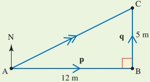

Figure 5.1

 $$ p=12 $$ 

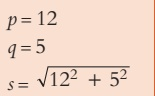

 $$ q=5 $$ 

 $$ s=\sqrt{12^{2}+5^{2}} $$ 

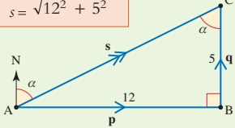

Figure 5.2

You can use Pythagoras' theorem and trigonometry to calculate the resultant.

In triangle ABC

 $$ AC=\sqrt{12^{2}+5^{2}}=13 $$ 

and

 $$ \tan\alpha=\frac{12}{5} $$ 

 $$ \alpha=67^{\circ}\ (to~the~nearest~degree) $$ 

The distance from the starting point is 13 m and the direction is  $ 067^{\circ} $.

<!-- page 104 -->

A special case of a displacement is a position vector. This is the displacement of a point from the origin.

## Velocity and force

The other two problems that begin this chapter are illustrated in Figures 5.3 and 5.4.

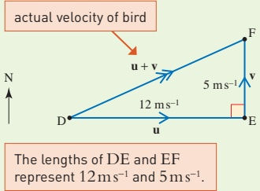

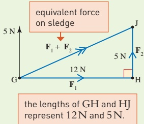

Figure 5.3

Figure 5.4

When  $ \overrightarrow{DF} $ represents the velocity (u) of the wind and  $ \overrightarrow{EF} $ represents the velocity (v) of the bird in still air, the vector  $ \overrightarrow{DF} $ represents the resultant velocity,  $ \mathbf{u} + \mathbf{v} $.

Why does the bird move in the direction DF? Think what happens in very small intervals of time.

In Figure 5.4, the vector  $ \overline{GJ} $ represents the equivalent (resultant) force. You know that it acts at the same point on the sledge as the children's forces, but its magnitude and direction can be found using the triangle GHJ which is similar to the two triangles, ABC and DEF.

The same diagram does for all, you just have to supply the units. The bird travels at  $ 13 \, \text{m} \, \text{s}^{-1} $ in the direction of  $ 067^\circ $ and one child would have the same effect as the others by pulling with a force of  $ 13 \, \text{N} $ in the direction  $ 067^\circ $. In most of this chapter vectors are treated in the abstract. You can then apply what you learn to different real situations.

### 5.2 Components of a vector

It is often convenient to write one vector in terms of two others called components.

The vector  $ \mathbf{a} $ in Figure 5.5 can be split into two components in an infinite number of ways. All you need to do is to make  $ \mathbf{a} $ one side of a triangle. It is most sensible, however, to split vectors into components in convenient directions and these directions are usually perpendicular.

<!-- page 105 -->

Using the given grid, a is 4 units east combined with 2 units north.

You can write  $ \mathbf{a} $ in Figure 5.5 as  $ \binom{4}{2} $. This is called a \textit{column vector}. The unit vector  $ \begin{pmatrix} 1 \\ 0 \end{pmatrix} $ is in the direction east and the unit vector  $ \begin{pmatrix} 0 \\ 1 \end{pmatrix} $ is in the direction north.

Alternatively a can be written as  $ 4i + 2j $ but this notation is not used in this book.

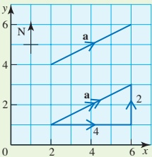

Figure 5.5

## Note

You have already used components in your work and so have met the idea of vectors. For example, the total reaction between two surfaces is often split into two components. One (friction) is opposite to the direction of possible sliding and the other (normal reaction) is perpendicular to it.

### Example 5.1

Four forces a, b, c and d are shown in Figure 5.6. The units are in newtons.

(i) Write them in component form.

(ii) Draw a diagram to show 2c and -d and write them in component form.

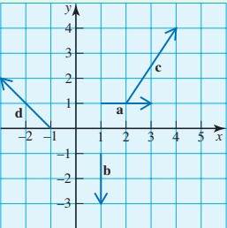

Figure 5.6

## Solution

(i)

 $$ \mathbf{a}=\binom{2}{0} $$ 

 $$ \mathbf{b}=\begin{pmatrix}0\\ -2\end{pmatrix} $$ 

(ii)

 $$ \begin{aligned}2\mathbf{c}&=2\begin{pmatrix}2\\ 3\end{pmatrix}\\&=\begin{pmatrix}4\\ 6\end{pmatrix}\end{aligned} $$ 

 $$ \mathbf{c}=\binom{2}{3} $$ 

 $$ \mathbf{d}=\binom{-2}{2} $$ 

 $$ \begin{aligned}-\mathbf{d}&=-\begin{pmatrix}-2\\ 2\end{pmatrix}\\&=\begin{pmatrix}2\\ -2\end{pmatrix}\end{aligned} $$ 

The diagram is shown in Figure 5.7.

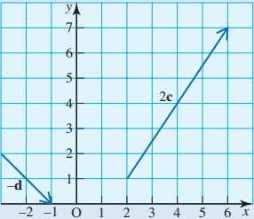

Figure 5.7

<!-- page 106 -->

## Equal vectors and parallel vectors

When two vectors,  $ \mathbf{p} $ and  $ \mathbf{q} $, are equal then they must be equal in both magnitude and direction. If they are written in component form their components must be equal.

So if

 $$ \mathbf{p}=\binom{a_{1}}{b_{1}} $$ 

and

 $$ \mathbf{q}=\begin{pmatrix}a_{2}\\ b_{2}\end{pmatrix} $$ 

then

 $$ a_{1}=a_{2} $$ 

 $$ b_{1}=b_{2} $$ 

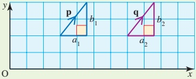

This should be clear from Figure 5.8.

Thus in two dimensions, the statement  $ \mathbf{p} = \mathbf{q} $ is the equivalent of two equations (and in three dimensions, three equations).

Figure 5.8

If $\mathbf{p}$ and $\mathbf{q}$ are parallel but not equal, they make the same angle with the $x$ axis (as in Figure 5.9).

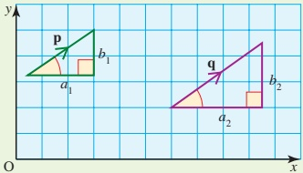

Figure 5.9

Then

 $$ \frac{b_{1}}{a_{1}}=\frac{b_{2}}{a_{2}}\text{or}\frac{a_{1}}{a_{2}}=\frac{b_{1}}{b_{2}} $$ 

If$\binom{4}{3}$ is parallel to$\binom{-8}{\gamma}$ what is $\gamma?$

You will often meet parallel vectors when using Newton's second law, as in the following example.

### Example 5.2

A force of  $ \binom{6}{8} $ N acts on an object of mass 2 kg. Find the object's acceleration as a column vector.

## Solution

Using Force = mass  $ \times $ acceleration

 $$ \binom{6}{8}=2\times acceleration $$ 

So the acceleration is  $ \binom{3}{4} \mathrm{~m s}^{-2} $.

## Adding vectors in component form

In component form, addition and subtraction of vectors is simply carried out by adding or subtracting the components of the vectors.

<!-- page 107 -->

Two vectors  $ \mathbf{a} $ and  $ \mathbf{b} $ are given by  $ \mathbf{a} = \begin{pmatrix} 2 \\ 3 \end{pmatrix} $ and  $ \mathbf{b} = \begin{pmatrix} -1 \\ 4 \end{pmatrix} $.

(i) Find the vectors  $ \mathbf{a} + \mathbf{b} $ and  $ \mathbf{a} - \mathbf{b} $.

(ii) Verify that your results are the same if you use a scale drawing.

## Solution

(i)

 $$ \begin{aligned}\mathbf{a}+\mathbf{b}&=\binom{2}{3}+\binom{-1}{4}\\&=\binom{1}{7}\end{aligned} $$ 

 $$ \begin{aligned}\mathbf{a}-\mathbf{b}&=\binom{2}{3}-\binom{-1}{4}\\&=\binom{3}{-1}\end{aligned} $$ 

(ii)

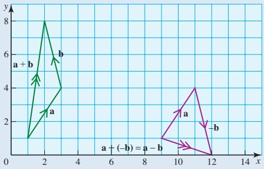

Figure 5.10

From the diagram in Figure 5.10 you can see that  $ \mathbf{a} + \mathbf{b} = \begin{pmatrix} 1 \\ 7 \end{pmatrix} $

 $$ \mathrm{and}\mathbf{a}-\mathbf{b}=\begin{pmatrix}3\\ -1\end{pmatrix}. $$ 

These vectors are the same as those obtained in part (i).

a and b are the position vectors of points A and B as shown in Figure 5.11.

How can you write the displacement vector  $ \overrightarrow{AB} $ in terms of a and b?

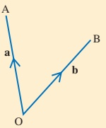

Figure 5.11

<!-- page 108 -->

1 The diagram shows a grid of 1 m squares. A person walks first east and then north. How far should the person walk in each of these directions to travel

(i) from A to B

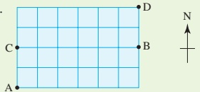

(ii) from B to C

(iii) from A to D?

2 The diagram shows nine different forces. The units are newtons. Write each of the forces as a column vector.

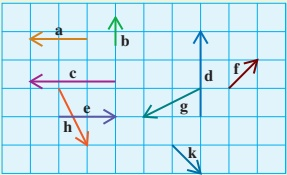

3 Two forces a and b are given in newtons by  $ \mathbf{a} = \begin{pmatrix} 2 \\ -1 \end{pmatrix} $ and  $ \mathbf{b} = \begin{pmatrix} 1 \\ 4 \end{pmatrix} $. Write the force 3a - 2b as a column vector.

4 Four forces  $ \mathbf{a} $,  $ \mathbf{b} $,  $ \mathbf{c} $ and  $ \mathbf{d} $ are given in newtons by  $ \mathbf{a} = \begin{pmatrix} 4 \\ 1 \end{pmatrix} $,  $ \mathbf{b} = \begin{pmatrix} -1 \\ 0 \end{pmatrix} $,  $ \mathbf{c} = \begin{pmatrix} -2 \\ -3 \end{pmatrix} $ and  $ \mathbf{d} = \begin{pmatrix} 2 \\ 6 \end{pmatrix} $. Write each of these forces as a column vector.

(i)  $ a + 2b $

(ii) 2c - 3d

(iii)  $ \mathbf{a} + \mathbf{c} - 2\mathbf{b} $

(iv)  $ -2a + 3b + 4d $.

5 A, B and C are the points (1, 2), (5, 1) and (7, 8).

(i) Write down the position vectors of these three points.

(ii) Find the displacement vectors  $ \overrightarrow{AB} $,  $ \overrightarrow{BC} $ and  $ \overrightarrow{CD} $

(iii) Draw a diagram to show the position vectors of A, B and C and your answers to part (ii).

6 A, B and C are the points  $ (0, -3) $,  $ (2, 5) $ and  $ (3, 9) $.

(i) Write down the position vectors of these three points.

(ii) Find the displacement vectors  $ \overrightarrow{AB} $ and  $ \overrightarrow{BC} $.

(iii) Show that the three points all lie on a straight line.

7 A, B, C and D are the points  $ (4, 2) $,  $ (1, 3) $,  $ (0, 10) $ and  $ (3, d) $.

(i) Find the value of d so that DC is parallel to AB.

(ii) Find a relationship between  $ \overrightarrow{BC} $ and  $ \overrightarrow{AD} $. What shape is ABCD?

8 Four forces $\mathbf{a}, \mathbf{b}, \mathbf{c}$ and $\mathbf{d}$ are given in newtons by $\mathbf{a} = \begin{pmatrix} 1 \\ 1 \end{pmatrix}, \mathbf{b} = \begin{pmatrix} 1 \\ 2 \end{pmatrix}$, $\mathbf{c} = \begin{pmatrix} 3 \\ -4 \end{pmatrix}$ and $\mathbf{d} = \begin{pmatrix} 1 \\ 2 \end{pmatrix}$.

A force given by  $ 2a + 3b + c - 8d $ acts on a particle of mass 3kg. Find the acceleration of the particle as a column vector and write down its magnitude.

<!-- page 109 -->

### 5.3 The magnitude and direction of vectors written in component form

At the beginning of this chapter the magnitude of a vector was found by using Pythagoras' theorem (see page 87). The direction was given using bearings, measured clockwise from the north.

When the vectors are in an x-y plane, a mathematical convention is used for direction. Starting from the x-axis, angles measured anticlockwise are positive and angles in a clockwise direction are negative as in Figure 5.12.

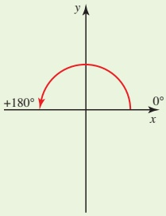

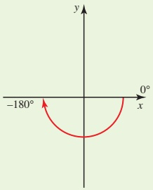

angle A is  $ 110^{\circ} $

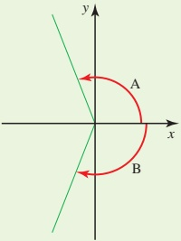

angle B is  $ -110^{\circ} $

Figure 5.12

Using the notation in Figure 5.13, the magnitude and direction can be written in general form.

Magnitude of the vector

 $$ \left|\begin{pmatrix}a_{1}\\ a_{2}\end{pmatrix}\right|=\sqrt{a_{1}^{2}+a_{2}^{2}} $$ 

Direction

 $$ \tan\theta=\frac{a_{2}}{a_{1}} $$ 

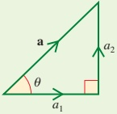

Figure 5.13

<table border=1 style='margin: auto; word-wrap: break-word;'><tr><td style='text-align: center; word-wrap: break-word;'>Find the magnitude and direction of the vectors</td></tr><tr><td style='text-align: center; word-wrap: break-word;'>$ \begin{pmatrix} 4 \\ 3 \end{pmatrix} $,  $ \begin{pmatrix} 4 \\ -3 \end{pmatrix} $,  $ \begin{pmatrix} -4 \\ 3 \end{pmatrix} $ and  $ \begin{pmatrix} -4 \\ -3 \end{pmatrix} $.</td></tr><tr><td style='text-align: center; word-wrap: break-word;'>Solution</td></tr><tr><td style='text-align: center; word-wrap: break-word;'>First draw diagrams so that you can see which lengths and acute angles to find.</td></tr></table>

<!-- page 110 -->

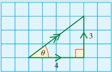

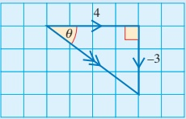

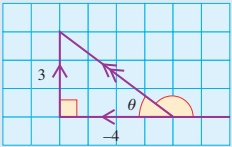

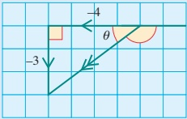

### Figure 5.14

The vectors in each of the diagrams in Figure 5.14 have the same magnitude and, using Pythagoras' theorem, the resultants all have magnitude  $ \sqrt{4^2 + 3^2} = 5 $.

The angles  $ \theta $ are also the same size in each diagram and can be found from

 $$ \tan\theta=\frac{3}{4}\quad\theta=37^{\circ} $$ 

The angles the vectors make with the x-axis specify their directions:

 $$ \begin{pmatrix}4\\ 3\end{pmatrix}\qquad37^{\circ} $$ 

 $$ \begin{pmatrix}4\\ -3\end{pmatrix}\qquad-37^{\circ} $$ 

 $$ \begin{pmatrix}-4\\ 3\end{pmatrix}\qquad\begin{array}{l}180^{\circ}-37^{\circ}=143^{\circ}\end{array} $$ 

 $$ \begin{pmatrix}-4\\ -3\end{pmatrix}\qquad-143^{\circ} $$ 

## Exercise 5B

Use sketches to help you in this exercise.

1 Find the magnitude and direction of

(i)  $ \begin{pmatrix} 6 \\ -8 \end{pmatrix} $ (ii)  $ \begin{pmatrix} -4 \\ 0 \end{pmatrix} $ (iii)  $ \begin{pmatrix} -1 \\ -2 \end{pmatrix} $.

2 Find the resultant,  $ \mathbf{F}_{1} + \mathbf{F}_{2} $, of the two forces  $ \mathbf{F}_{1} = \begin{pmatrix} 10 \\ 40 \end{pmatrix} $ and  $ \mathbf{F}_{2} = \begin{pmatrix} 20 \\ -10 \end{pmatrix} $ and then find its magnitude and direction.

3 Find the resultant of the three forces  $ \mathbf{F}_1 = \begin{pmatrix} -1 \\ 5 \end{pmatrix} $,  $ \mathbf{F}_2 = \begin{pmatrix} 2 \\ -10 \end{pmatrix} $ and  $ \mathbf{F}_3 = \begin{pmatrix} -2 \\ 7 \end{pmatrix} $ and then find its magnitude and direction.

Show that  $ \begin{pmatrix}0.6\\0.8\end{pmatrix} $ is a unit vector.

» Find unit vectors in the directions of

[i]  $ \begin{pmatrix} 8 \\ 6 \end{pmatrix} $ [ii]  $ \begin{pmatrix} 1 \\ -1 \end{pmatrix} $.

<!-- page 111 -->

### 5.4 Resolving vectors

A vector has magnitude 10 units and it makes an angle of  $ 60^{\circ} $ with the x axis. How can it be represented in component form?

In the diagram in Figure 5.15:

 $$ \frac{AC}{AB}=\cos60^{\circ}\quad and\quad\frac{BC}{AB}=\sin60^{\circ} $$ 

 $$ \begin{aligned}AC&=AB\cos60^{\circ}\quad&BC&=AB\sin60^{\circ}\\&=10\cos60^{\circ}\quad&=10\sin60^{\circ}\end{aligned} $$ 

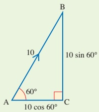

Figure 5.15

So you can write the vector as  $ \begin{pmatrix} 10 \cos 60^\circ \\ 10 \sin 60^\circ \end{pmatrix} = \begin{pmatrix} 5 \\ 8.66 \end{pmatrix} $ (to 3 s.f.).

In a similar way, you can write any vector  $ \mathbf{a} $ with magnitude  $ a $ that makes

an angle  $ \alpha $ with the x-axis in component form as

 $ \mathbf{a} = \begin{pmatrix} a \cos \alpha \\ a \sin \alpha \end{pmatrix} $ as shown in Figure 5.16.

 $$ \mathrm{O A}=a=|\mathbf{a}| $$ 

AB is the opposite side to  $ \alpha $ so use sin.

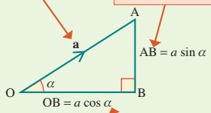

OB is the adjacent side to  $ \alpha $ so use cos.

Figure 5.16

When  $ \alpha $ is an obtuse angle, this expression is still true. For example, when  $ \alpha = 120^{\circ} $ and a = 10 (Figure 5.17),

 $$ \begin{array}{rl}\mathbf{a}=\left(\begin{array}{l}a\cos\alpha\\ a\sin\alpha\end{array}\right)\\ &\\=\left(\begin{array}{l}10\cos120^{\circ}\\ 10\sin120^{\circ}\end{array}\right)\\ &\\=\left(\begin{array}{l}-5\\ 8.66\end{array}\right)\end{array} $$ 

However, it is usually easier to write

 $$ \mathbf{a}={\left(\begin{array}{c}{-10~\cos~60^{\circ}}\\ {10~\sin~60^{\circ}}\\ \end{array}\right)} $$ 

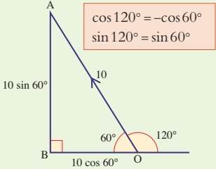

Figure 5.17

<!-- page 112 -->

Two forces P and Q have magnitudes 4N and 5N in the directions shown in Figure 5.18.

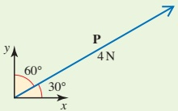

Figure 5.18

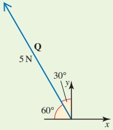

Find the magnitude and direction of the resultant force  $ \mathbf{P} + \mathbf{Q} $.

Solution

 $$ \begin{aligned}\mathbf{P}&=\begin{pmatrix}4\cos30^{\circ}\\4\sin30^{\circ}\end{pmatrix}\\&=\begin{pmatrix}3.46\ldots\\2\end{pmatrix}\end{aligned} $$ 

 $$ \begin{aligned}\mathbf{Q}&=\begin{pmatrix}-5\cos60^{\circ}\\5\sin60^{\circ}\end{pmatrix}\\&=\begin{pmatrix}-2.5\\4.33...\end{pmatrix}\end{aligned} $$ 

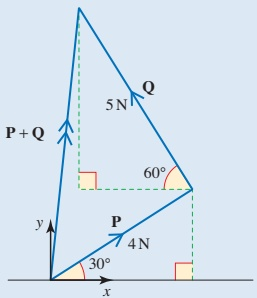

Figure 5.19

 $$ \begin{aligned}\mathbf{P}+\mathbf{Q}&=\begin{pmatrix}3.46...\\ 2\end{pmatrix}+\begin{pmatrix}-2.5\\ 4.33...\end{pmatrix}\\&=\begin{pmatrix}0.964...\\ 6.33...\end{pmatrix}\end{aligned} $$ 

This resultant is shown in Figure 5.19.

Magnitude

 $$ \begin{aligned}\left|\mathrm{P}+\mathrm{Q}\right|&=\sqrt{0.964\ldots^{2}+6.33\ldots^{2}}\\&=\sqrt{41}\\&=6.40\ldots\end{aligned} $$ 

Direction

 $$ \begin{aligned}\tan\theta&=\frac{6.33\ldots}{0.964\ldots}\\&=6.56\ldots\\\theta&=81.3^{\circ}\end{aligned} $$ 

The force  $ \mathbf{P} + \mathbf{Q} $ has magnitude 6.40N and direction  $ 81.3^\circ $ relative to the positive x direction, as shown in Figure 5.20.  $ \mathbf{\Lambda} $ Figure 5.20

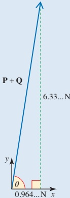

<!-- page 113 -->

1 Write these forces as column vectors.

(i)

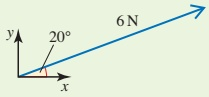

(ii)

(iii)

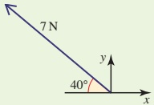

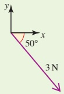

(iv)

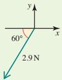

2 Draw a diagram showing each of these displacements. Write each as a column vector in directions east and north respectively.

(i) 130 km, bearing  $ 060^{\circ} $

(ii) 250 km, bearing  $ 130^{\circ} $

(iii) 400 km, bearing  $ 210^{\circ} $

(iv) 50 km, bearing  $ 300^{\circ} $

3 A boat has a speed of 4km h $ ^{-1} $ in still water and sets its course north-east in an easterly current of 3km h $ ^{-1} $. Write each velocity as a column vector in directions east and north and hence find the magnitude and direction of the resultant velocity.

4 A boy walks 30 m north and then 50 m south-west.

(i) Draw a diagram to show the boy's path.

(ii) Write each displacement as a column vector in directions east and north.

(iii) In which direction should he walk to get directly back to his starting point?

5(i)

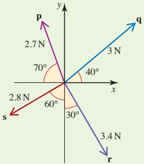

(ii)

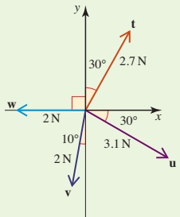

(a) Write each of these forces as a column vector.

(b) Find the resultant of each set of vectors.

<!-- page 114 -->

6 (i) Find the distance and bearing of Sean relative to his starting point if he goes for a walk with the following three stages.

Stage 1: 600m on a bearing  $ 030^{\circ} $

Stage 2: 1 km on a bearing  $ 100^{\circ} $

Stage 3: 700 m on a bearing  $ 340^{\circ} $

(ii) Shona sets off from the same place at the same time as Sean. She walks at the same speed but takes the stages in the order 3-1-2. How far apart are Sean and Shona at the end of their walks?

7 The diagram shows the big wheel ride at a fairground. The radius of the wheel is 5 m and the length of the arms that support each carriage is 1 m.

Express the position vector of the carriages A, B, C and D as column vectors.

8 Two walkers set off from the same place in different directions. After a period they stop. Their displacements are  $ \binom{2}{5} $ and  $ \binom{-3}{4} $

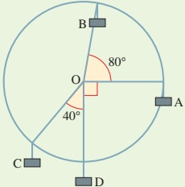

where the distances are in kilometres and the directions are east and north. On what bearing and for what distance does the second walker have to walk to be reunited with the first (who does not move)?

## KEY POINTS

1 A scalar quantity has only magnitude (size).

A vector quantity has both magnitude and direction.

Displacement, velocity, acceleration and force are all vector quantities.

2 Vectors may be represented in either magnitude–direction form or in component form.

Magnitude-direction form

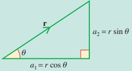

Magnitude, r; direction,  $ \theta $

Component form

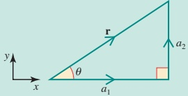

 $$ \begin{pmatrix}a_{1}\\a_{2}\end{pmatrix} $$ 

where

 $$ r=\sqrt{a_{1}^{2}+a_{2}^{2}} $$ 

 $$ a_{1}=r\cos\theta $$ 

and

 $$ \theta=\frac{a_{2}}{a_{1}} $$ 

 $$ a_{2}=r\sin\ \theta=r\cos\ (90^\circ-\theta) $$

<!-- page 115 -->

3 When two or more vectors are added, the resultant is obtained. Vector addition may be done graphically or algebraically.

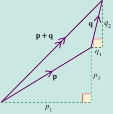

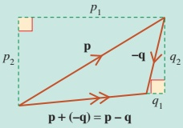

 $$ \mathbf{p}+\mathbf{q}=\begin{pmatrix}p_{1}\\ p_{2}\end{pmatrix}+\begin{pmatrix}q_{1}\\ q_{2}\end{pmatrix}=\begin{pmatrix}p_{1}+q_{1}\\ p_{2}+q_{2}\end{pmatrix} $$ 

4 Multiplication by a scalar:  $ n\binom{a_1}{a_2} = \binom{na_1}{na_2} $

5 The position vector of a point P is  $ \overrightarrow{OP} $, its displacement from a fixed origin.

6 When A and B have position vectors  $ \mathbf{a} $ and  $ \mathbf{b} $,  $ \overrightarrow{AB} = \mathbf{b} - \mathbf{a} $.

7 Equal vectors have equal magnitude and are in the same direction.

 $$ \begin{pmatrix}p_{1}\\ p_{2}\end{pmatrix}=\begin{pmatrix}q_{1}\\ q_{2}\end{pmatrix}\Rightarrow p_{1}=q_{1}\mathrm{~a n d~}p_{2}=q_{2}. $$ 

8 When  $ \binom{p_{1}}{p_{2}} $ and  $ \binom{q_{1}}{q_{2}} $ are parallel,  $ \frac{p_{1}}{q_{1}} = \frac{p_{2}}{q_{2}} $.

## LEARNING OUTCOMES

Now that you have finished this chapter, you should be able to

understand and use vectors

in component form

in magnitude—direction form

resolve vectors

find the resultant of two or more vectors.

