# 6 Forces in equilibrium and resultant forces

<!-- Cambridge International AS  A Level Mathematics Mechanics (Sophie Goldie) .pdf p116-141 -->

<!-- page 116 -->

## 6 

## Forces in equilibrium and resultant forces

Give me matter and motion and I will construct the Universe. René Descartes (1596–1650)

These cable cars are stationary. Are the tensions in the cable greater than the weight of a car?

### 6.1 Finding resultant forces

A child on a sledge is being pulled up a smooth slope of  $ 20^{\circ} $ by a rope that makes an angle of  $ 40^{\circ} $ with the slope. The mass of the child and sledge together is 20 kg and the tension in the rope is 170 N. Draw a diagram to show the forces acting on the child and sledge together. In what direction is the resultant of these forces?

When the child and sledge are modelled as a particle, all the forces can be assumed to be acting at a point. There is no friction force

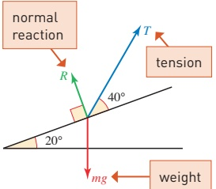

Figure 6.1

because the slope is smooth. The force diagram is shown in Figure 6.1.

The sledge is sliding along the slope. What direction is the resultant force acting on it?

<!-- page 117 -->

You can use components to find the normal reaction and the resultant force on the sledge. Resolve each force in two perpendicular directions (as in Chapter 5). It is easiest to use the components of the forces parallel and perpendicular to the slope in the directions shown in Figure 6.2.

components of weight

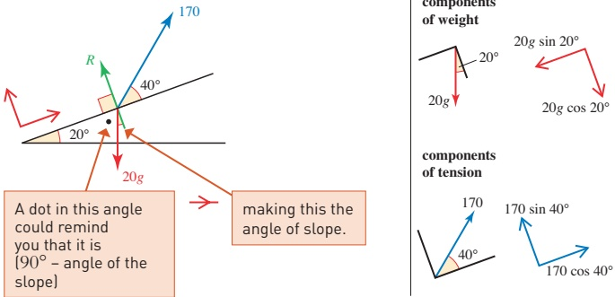

Figure 6.2

Resolve parallel to the slope  $ (\vec{n}) $: ◇

The resultant

The force R is perpendicular to the slope so it has no component in this direction.

 $$ \begin{aligned}F&=170\cos40^{\circ}-20g\sin20^{\circ}\\&=61.8(to3s.f.)\end{aligned} $$ 

Resolve perpendicular to the slope  $ (\overrightarrow{k}) $: ◇

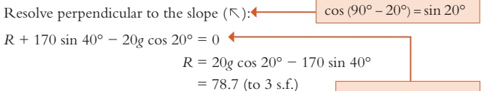

 $$ R+170\sin40^{\circ}-20g\cos20^{\circ}=0 $$ 

 $$ \begin{aligned}R&=20g\cos20^{\circ}-170\sin40^{\circ}\\&=78.7(to3s.f.)\end{aligned} $$ 

The normal reaction is 78.7N and the resultant is 61.8N up the slope.

Alternatively, you could have worked in column vectors as follows.

There is no resultant in this direction because the motion is parallel to the slope.

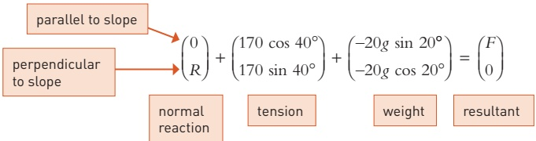

<!-- page 118 -->

## Note

Try resolving horizontally and vertically. You will obtain two equations in the two unknowns R and F. It is perfectly possible to solve these equations, but it takes quite a lot of work. It is much easier to choose to resolve in directions that ensure that one component of at least one of the unknown forces is zero.

Once you know the resultant force, you can use Newton's second law to work out the acceleration of the sledge.

 $$ F=m a $$ 

 $$ 61.8=20a $$ 

The acceleration is  $ 3.1 \, m s^{-2} $ (correct to 1 d.p.).

Exercise 6A

For questions 1 to 6, write the forces in component form, using the directions indicated and so obtain the components of the resultant.

Hence find the magnitude and direction of the resultant.

All forces are in newtons.

1

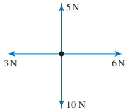

2

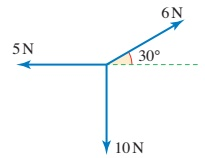

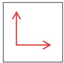

3

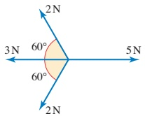

4

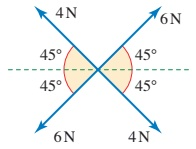

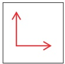

5

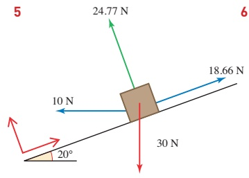

6

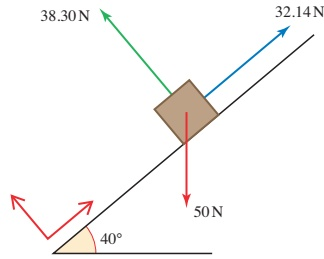

<!-- page 119 -->

7 Four coplanar forces of magnitudes 4N, 8N, 12N and 16 N act at a point. The directions in which the forces act are shown in Fig. 1.

(i) Find the magnitude and direction of the resultant of the four forces.

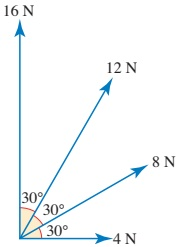

Fig. 1

The forces of magnitudes 4N and 16N exchange their directions and the forces of magnitudes 8N and 12N also exchange their directions (see Fig. 2).

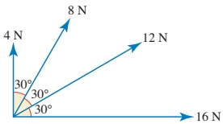

Fig. 2

(ii) State the magnitude and direction of the resultant of the four forces in Fig. 2.

Cambridge International AS & A Level Mathematics

9709 Paper 43 Q5 June 2015

8 Three coplanar forces of magnitudes 15N, 12N and 12N act at a point A in directions as shown in the diagram.

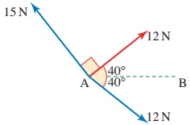

(i) Find the component of the resultant of the three forces

(a) in the direction of AB.

(b) perpendicular to AB.

(ii) Hence find the magnitude and direction of the resultant of the three forces.

<!-- page 120 -->

### 6.2 Forces in equilibrium

When forces are in equilibrium their vector sum is zero and the sum of their resolved parts in any direction is zero.

Example 6.1

A brick of mass 3kg is at rest on a rough plane inclined at an angle of  $ 30^{\circ} $ to the horizontal. Find the friction force FN, and the normal reaction RN of the plane on the brick.

## Solution

Figure 6.3 shows the forces acting on the brick.

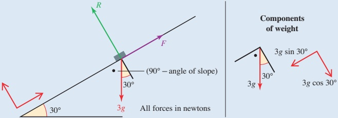

Figure 6.3

Use directions parallel and perpendicular to the plane, as shown. Since the brick is in equilibrium the resultant of the three forces acting on it is zero.

Resolving parallel to the slope:

 $$ \begin{array}{c}F-30\sin30^{\circ}=0\\F=15\end{array}\begin{array}{l}3g=30\\\end{array} $$ 

Resolving perpendicular to the slope:

 $$ R-30\cos30^{\circ}=0 $$ 

 $$ R=26.0(to3s.f.) $$ 

Written in vector form the equivalent is

 $$ \begin{pmatrix}F\\ 0\end{pmatrix}+\begin{pmatrix}0\\ R\end{pmatrix}+\begin{pmatrix}-30\sin30^{\circ}\\ -30\cos30^{\circ}\end{pmatrix}=\begin{pmatrix}0\\ 0\end{pmatrix} $$ 

This leads to the equations ① and ②.

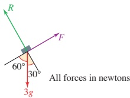

Figure 6.4

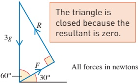

All forces in newtons

Figure 6.5

## The triangle of forces

When there are only three (non-parallel) forces acting and they are in equilibrium, the polygon of forces becomes a closed triangle as shown in Figures 6.4 and 6.5 for the brick on the plane.

<!-- page 121 -->

Then

 $$ \frac{F}{3g}=\cos60^{\circ} $$ 

 $$ F=30\cos60^{\circ}=15N $$ 

and similarly  $ R = 30 \, \text{sin} \, 60^\circ = 26.0 \, \text{N (to } 3 \, \text{s.f.)} $

This is an example of the theorem known as the triangle of forces.

» When a body is in equilibrium under the action of three non-parallel forces, then

(i) the forces can be represented in magnitude and direction by the sides of a triangle

(ii) the lines of action of the forces pass through the same point.

When more than three forces are in equilibrium the first statement still holds but the triangle is then a polygon. The second is not necessarily true.

Often mechanics questions involve the angles  $ 30^{\circ} $,  $ 45^{\circ} $ and  $ 60^{\circ} $ so that you can use the exact values of  $ \cos \theta $,  $ \sin \theta $ and  $ \tan \theta $ in your working. Here is a table to remind you of the exact values.

<table border=1 style='margin: auto; word-wrap: break-word;'><tr><td style='text-align: center; word-wrap: break-word;'>$ \theta^{\circ} $</td><td style='text-align: center; word-wrap: break-word;'>$ \cos \theta^{\circ} $</td><td style='text-align: center; word-wrap: break-word;'>$ \sin \theta^{\circ} $</td><td style='text-align: center; word-wrap: break-word;'>$ \tan \theta^{\circ} $</td></tr><tr><td style='text-align: center; word-wrap: break-word;'>30°</td><td style='text-align: center; word-wrap: break-word;'>$ \frac{\sqrt{3}}{2} $</td><td style='text-align: center; word-wrap: break-word;'>$ \frac{1}{2} $</td><td style='text-align: center; word-wrap: break-word;'>$ \frac{1}{\sqrt{3}} $</td></tr><tr><td style='text-align: center; word-wrap: break-word;'>45°</td><td style='text-align: center; word-wrap: break-word;'>$ \frac{1}{\sqrt{2}} $</td><td style='text-align: center; word-wrap: break-word;'>$ \frac{1}{\sqrt{2}} $</td><td style='text-align: center; word-wrap: break-word;'>1</td></tr><tr><td style='text-align: center; word-wrap: break-word;'>60°</td><td style='text-align: center; word-wrap: break-word;'>$ \frac{1}{2} $</td><td style='text-align: center; word-wrap: break-word;'>$ \frac{\sqrt{3}}{2} $</td><td style='text-align: center; word-wrap: break-word;'>$ \sqrt{3} $</td></tr></table>

You can see where these values come from in Pure Mathematics 1 Chapter 8.

### Example 6.2

This example illustrates two methods for solving problems involving forces in equilibrium. With experience, you will find it easier to judge which method is best for a particular problem.

A sign of mass 10kg is to be suspended by two strings arranged as shown in Figure 6.6. Find the tension in each string.

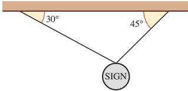

Figure 6.6

<!-- page 122 -->

## Solution

The force diagram for this situation is given in Figure 6.7.

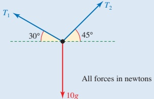

### Figure 6.7

Method 1: Resolving forces

Vertically ( $ \uparrow $):

 $$ \begin{aligned}T_{1}\sin30^{\circ}+T_{2}\sin45^{\circ}-10g&=0\\\frac{1}{2}T_{1}+\frac{1}{\sqrt{2}}T_{2}&=100\\-T_{1}\cos30^{\circ}+T_{2}\cos45^{\circ}&=0\\-\frac{\sqrt{3}}{2}T_{1}+\frac{1}{\sqrt{2}}T_{2}&=0\end{aligned} $$ 

Horizontally ( $ \rightarrow $):

Subtracting ② from ①

 $$ \left(\frac{1}{2}+\frac{\sqrt{3}}{2}\right)T_{1}=100 $$ 

 $$ 1.36\ldots T_{1}=100 $$ 

 $$ T_{1}=73.2... $$ 

Back substitution gives

 $$ T_{2}=89.6... $$ 

The tensions are 73.2N and 89.7N (to 3 s.f.).

## Method 2: Triangle of forces

Since the three forces are in equilibrium they can be represented by the sides of a triangle, taken in order, as in Figure 6.8.

You can use the sine rule to calculate  $ T_{1} $ and  $ T_{2} $ accurately.

In the triangle ABC,  $ \angle CAB = 60^\circ $ and

 $$ \angle ABC=45^{\circ},so\angle BCA=75^{\circ}. $$ 

So  $ \frac{T_{1}}{\sin45^{\circ}}=\frac{T_{2}}{\sin60^{\circ}}=\frac{100}{\sin75^{\circ}} $

giving  $ T_{1}=\frac{100\sin45^{\circ}}{\sin75^{\circ}} $ and  $ T_{2}=\frac{100\sin60^{\circ}}{\sin75^{\circ}} $

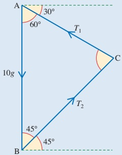

Figure 6.8

As before the tensions are found to be 73.2N and 89.7N.

In what order would you draw the three lines in this diagram?

<!-- page 123 -->

Lami's theorem states that when three forces acting at a point, as shown in Figure 6.9, are in equilibrium then

 $$ \frac{F_{1}}{\sin\alpha}=\frac{F_{2}}{\sin\beta}=\frac{F_{3}}{\sin\gamma}. $$ 

Sketch a triangle of forces and say how the angles in the triangle are related to $\alpha, \beta$ and $\gamma$. Hence explain why Lami's theorem is true.

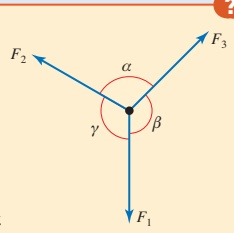

Figure 6.9

You can use Lami's theorem to solve Example 6.2.

Method 3: Using Lami's theorem

 $$ \frac{10g}{\sin105^{\circ}}=\frac{T_{1}}{\sin135^{\circ}}=\frac{T_{2}}{\sin120^{\circ}} $$ 

 $$ \begin{array}{r} T_{1}=\frac{10g\times\sin135^{\circ}}{\sin105^{\circ}}=73.205... \end{array} $$ 

 $$ \mathrm{and}\qquad T_{2}=\frac{10g\times\sin120^{\circ}}{\sin105^{\circ}}=89.657... $$ 

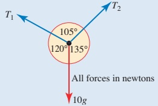

Figure 6.10

So, as before, the tensions are found to be 73.2N and 89.7N to 3 s.f.

### Example 6.3

Figure 6.11 shows three men involved in moving a packing case up to the top floor of a warehouse. Bahir is pulling on a rope which passes round smooth pulleys at X and Y and is then secured to the point Z at the end of the loading beam.

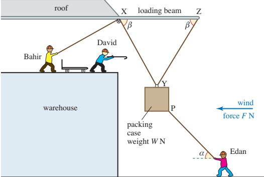

Figure 6.11

The wind is blowing directly towards the building. To counteract this, Edan is pulling on another rope, attached to the packing case at P, with just enough force and in the right direction to keep the packing case central between X and Z.

<!-- page 124 -->

(ii) Draw a diagram showing all the forces acting on the packing case using  $ T_{1} $ and  $ T_{2} $ for the tensions in Bahir's and Edan's ropes, respectively.

At the time of the picture the men are holding the packing case motionless.

(ii) Write down equations for the horizontal and vertical equilibrium of the packing case.

In one particular situation,  $ W = 100, F = 50, \alpha = 45^{\circ} $ and  $ \beta = 75^{\circ} $.

(iii) Find the tension  $ T_{1} $.

(iv) Explain why Bahir has to pull harder if the wind blows more strongly.

## Solution

(i) Figure 6.12 shows all the forces acting on the packing case and the relevant angles.

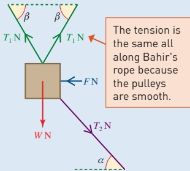

(ii) Equilibrium equations

Resolving horizontally ( $ \rightarrow $):

 $ T_{1}\cos\beta + T_{2}\cos\alpha - F - T_{1}\cos\beta = 0 $

 $$ T_{2}\cos\alpha-F=0 $$ 

Resolving vertically  $ (\uparrow) $:

 $ T_{1}\sin\beta + T_{1}\sin\beta - T_{2}\sin\alpha - W = 0 $

 $ 2T_{1}\sin\beta - T_{2}\sin\alpha - W = 0 $

(iii) When $F = 50$ and $\alpha = 45^{\circ}$ equation ① gives

 $$ T_{2}\cos45^{\circ}=50 $$ 

This tells you that  $ T_{2} $ is  $ \frac{50}{\cos 45^{\circ}} $

 $$ \Rightarrow T_{2}\sin45^{\circ}=50 $$ 

Substituting in ② gives $2T_{1}\sin\beta-50-W=0$

 $$ \cos45^{\circ}=\sin45^{\circ}. $$ 

So when W = 100 and  $ \beta = 75^{\circ} $,  $ 2T_{1}\sin75^{\circ} = 150 $

 $$ T_{1}=\frac{150}{2\sin75^{\circ}} $$ 

The tension in Bahir's rope is 77.65N = 78N (to the nearest newton).

(iv) When the wind blows more strongly,

F increases. Given that all the angles

remain unchanged, Edan will have to

pull harder so the vertical component of

 $ T_2 $ will increase. This means that  $ T_1 $ must

increase and Bahir must pull harder.

0r  $ F = T_2 \cos \alpha $,

so as Fincreases,

 $ T_2 $ increases

 $ \Rightarrow T_2 \sin \alpha + W $ increases

 $ \Rightarrow 2 T_1 \sin \beta $ increases.

Hence  $ T_1 $ increases.

<!-- page 125 -->

1 The picture shows a boy, Halley, holding onto a post while his two older sisters, Sheuli and Veronica, try to pull him away. Using perpendicular horizontal directions the forces, in newtons, exerted by the two girls are:

Sheuli

Veronica

(i) Calculate the magnitude and direction of the force of each of the girls.

(ii) Write the resultant as a vector and so calculate (to 3 significant figures) its magnitude and direction.

2 The diagram shows a girder CD of mass 20 tonnes being held stationary by a crane (which is not shown). The rope from the crane (AB) is attached to a ring at B. Two ropes, BC and BD, of equal length attach the girder to B; the tension in each of these ropes is T N.

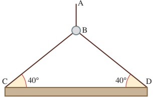

(i) Draw a diagram showing the forces acting on the girder.

(ii) Write down, in terms of T, the horizontal and vertical components of the tensions in the ropes acting at C and D.

(iii) Hence show that the tension in the rope BC is 155.6 kN (to 1 d.p.).

(iv) Draw a diagram to show the three forces acting on the ring at B.

(v) Hence calculate the tension in the rope AB.

(vi) How could you have known the answer to part (v) without any calculations?

<!-- page 126 -->

3 The diagram shows a simple model of a crane. The structure is at rest in a vertical plane. The rod and cables are of negligible mass and the load suspended from the joint at A is 30 N.

(i) Draw a diagram showing the forces acting on

(a) the load

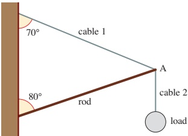

(b) the joint at A.

(ii) Calculate the forces in the rod and cable 1 and state whether they are in compression or in tension.

4 An angler catches a very large fish. When he tries to weigh it he finds that it is more than the 10kg limit of his spring balance. He borrows another spring balance of exactly the same design and uses the two to weigh the fish, as shown in figure (A). Both balances read 8kg.

(i) What is the mass of the fish?

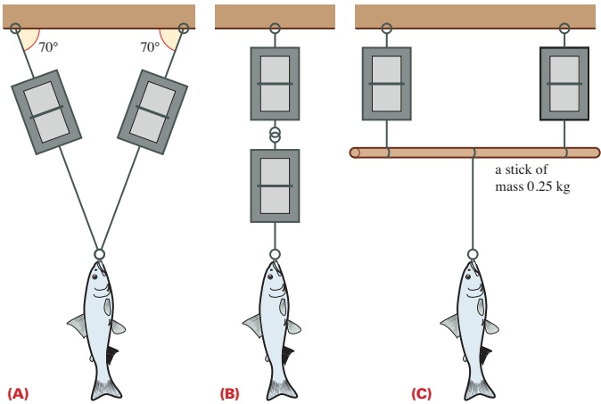

The angler believes the mass of the fish is a record and asks a witness to confirm it. The witness agrees with the measurements but cannot follow the calculations. He asks the angler to weigh the fish in two different positions, still using both balances. These are shown in figures (B) and (C). Assuming the spring balances themselves to have negligible mass, state the readings of the balances as set up in

(ii) figure (B)

(iii) figure (C).

(iv) Which of the three methods do you think is the best?

<!-- page 127 -->

5 The diagram shows a device for crushing scrap cars. The light rod AB is hinged at A and raised by a cable which runs from B round a pulley at D and down to a winch at E. The vertical strut EAD is rigid and strong and AD = AB. A weight of mass 1 tonne is suspended from B by the cable BC. When the weight is correctly situated above the car it is released and falls on to the car.

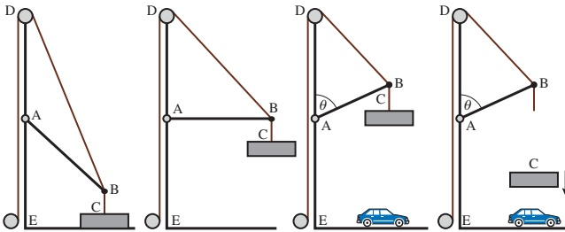

Just before the weight is released the rod AB makes angle  $ \theta $ with the upward vertical AD and the weight is at rest.

(i) Draw a diagram showing the forces acting at point B in this position.

(ii) Explain why the rod AB must be in thrust and not in tension.

(iii) Draw a diagram showing the vector sum of the forces at B (i.e. the polygon of forces).

(iv) Calculate each of the three forces acting at B when

(a)  $ \theta = 90^{\circ} $ (b)  $ \theta = 60^{\circ} $

6 Four wires, all of them horizontal, are attached to the top of a telegraph pole as shown in the plan view below. The pole is in equilibrium and tensions in the wires are as shown.

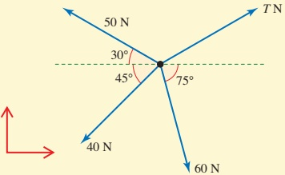

(i) Using perpendicular directions as shown in the diagram, show that the force of 60N may be written as  $ \begin{pmatrix} 15.5 \\ -58.0 \end{pmatrix} $N (to 3 significant figures).

(ii) Find T in both component form and magnitude and direction form.

(iii) The force T is changed to  $ \begin{pmatrix} 40 \\ 35 \end{pmatrix} $ N. Show that there is now a resultant force on the pole and find its magnitude and direction.

<!-- page 128 -->

7 A ship is being towed by two tugs. Each tug exerts forces on the ship as indicated. There is also a drag force on the ship.

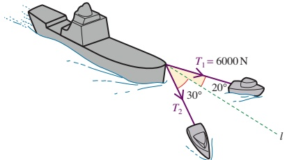

(i) Write down the components of the tensions in the towing cables along and perpendicular to the line of motion, l, of the ship.

(ii) There is no resultant force perpendicular to the line l. Find  $ T_{2} $.

(iii) The ship is travelling with constant velocity along the line l. Find the magnitude of the drag force acting on it.

8 A skier of mass 50kg is skiing down a  $ 15^{\circ} $ slope.

(i) Draw a diagram showing the forces acting on the skier.

(ii) Resolve these forces into components parallel and perpendicular to the slope.

(iii) The skier is travelling at constant speed. Find the normal reaction of the slope on the skier and the resistance force on her.

(iv) The skier later returns to the top of the slope by being pulled up it at constant speed by a rope parallel to the slope. Assuming the resistance on the skier is the same as before, calculate the tension in the rope.

9 The diagram shows a block of mass

5kg on a rough inclined plane.

The block is attached to a 3kg weight by a light string which passes over a smooth pulley and is on the point of sliding up the slope.

(i) Draw a diagram showing the forces acting on the block.

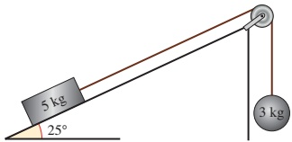

(ii) Resolve these forces into components parallel and perpendicular to the slope.

(iii) Find the force of resistance to the block's motion.

The 3 kg weight is replaced by one of mass m kg.

(iv) Find the value of m for which the block is on the point of sliding down the slope, assuming the resistance to motion is the same as before.

<!-- page 129 -->

10 Two husky dogs are pulling a sledge. They both exert forces of 60N but at different angles to the line of the sledge, as shown in the diagram. The sledge is moving straight forwards.

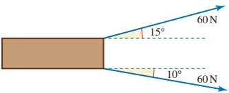

(i) Resolve the two forces into components parallel and perpendicular to the line of the sledge.

(ii) Hence find

(a) the overall forward force from the dogs

(b) the sideways force.

The resistance to motion is 20N along the line of the sledge but up to 400N perpendicular to it.

(iii) Find the magnitude and direction of the overall horizontal force on the sledge.

(iv) How much force is lost due to the dogs not pulling straight forwards?

11 One end of a string of length 1 m is fixed to a mass of 1 kg and the other end is fixed to a point A. Another string is fixed to the mass and passes over a frictionless pulley at B which is 1 m horizontally from A but 2 m above it. The tension in the second string is such that the mass is held at the same horizontal level as the point A.

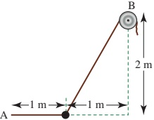

(i) Show that the tension in the horizontal string fixed to the mass and to A is 5N and find the tension in the string which passes over the pulley at B. Find also the angle that this second string makes with the horizontal.

(ii) If the tension in this second string is slowly increased by drawing more of it over the pulley at B describe the path followed by the mass. Will the point A, the mass and the point B, ever lie in a straight line? Give reasons for your answer.

<!-- page 130 -->

12 A and B are fixed points of a vertical wall with A vertically above B. A particle P of mass 0.7kg is attached to A by a light inextensible string of length 3m. P is also attached to B by a light inextensible string of length 2.5m. P is maintained in equilibrium at a distance of 2.4m from the wall by a horizontal force of magnitude 10N acting on P (see diagram). Both strings are taut, and the 10N force acts in the plane APB which is perpendicular to the wall. Find the tensions in the strings.

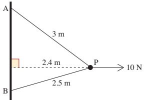

Cambridge International AS & A Level Mathematics 9709 Paper 42 Q3 June 2014

13 Each of three light strings has a particle attached to one of its ends. The other ends of the strings are tied together at a point A. The strings are in equilibrium with two of them passing over fixed smooth horizontal pegs, and with the particles hanging freely. The weights of the particles, and the angles between the sloping parts of the strings and the vertical, are as shown in the diagram. Find the values of  $ W_{1} $ and  $ W_{2} $.

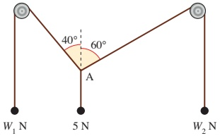

Cambridge International AS & A Level Mathematics 9709 Paper 4 Q3 November 2005

14 Small blocks A and B are held at rest on a smooth plane inclined at  $ 30^{\circ} $ to the horizontal. Each is held in equilibrium by a force of magnitude 18N. The force on A acts upwards, parallel to a line of greatest slope of the plane, and the force on B acts horizontally in the vertical plane containing a line of

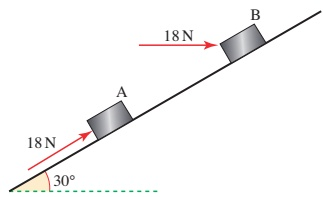

greatest slope (see diagram). Find the weight of A and the weight of B.

Cambridge International AS & A Level Mathematics

9709 Paper 41 Q2 November 2014

<!-- page 131 -->

### 6.3 Newton's second law in two dimensions

When the forces acting on an object are not in equilibrium it will have an acceleration and you can use Newton's second law to solve problems about its motion.

The equation  $ \mathbf{F} = m\mathbf{a} $ is a vector equation. The resultant force acting on a particle is equal in both magnitude and direction to the mass  $ \times $ acceleration. It can be written in components as

 $$ \binom{F_{1}}{F_{2}}=m\binom{a_{1}}{a_{2}} $$ 

so that  $ F_{1}=ma_{1} $ and  $ F_{2}=ma_{2} $.

What direction is the resultant force acting on a child sliding on a sledge down a smooth straight slope inclined at  $ 15^{\circ} $ to the horizontal?

Example 6.4

Anna is sledging. Her sister gives her a push at the top of a smooth straight  $ 15^{\circ} $ slope and lets go when she is moving at  $ 2\,m\,s^{-1} $. She continues to slide for 5 seconds before using her feet to produce a braking force of 95 N parallel to the slope. This brings her to rest. Anna and her sledge have a mass of 30 kg.

How far does she travel altogether?

## Solution

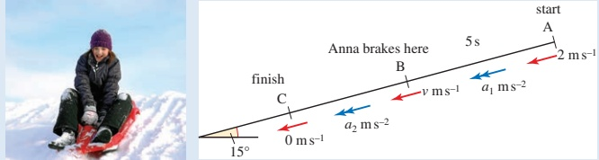

Figure 6.13

Figure 6.13 shows the situation.

To answer this question, you need to know Anna's acceleration for the two parts of her journey. These are constant so you can then use the constant acceleration formulae.

<!-- page 132 -->

### Sliding freely (Figure 6.14)

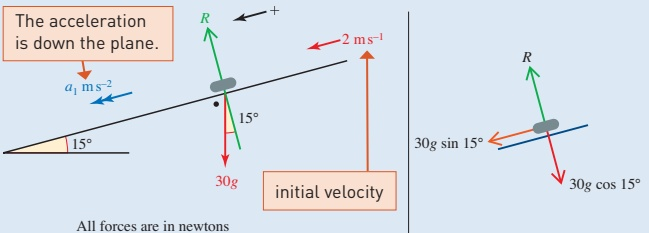

### Figure 6.14

Using Newton's second law in the direction of the acceleration gives:

 $$ 15^{\circ}=30a_{1} $$ 

 $$ a_{1}=10\sin15^{\circ} $$ 

Resultant force down the plane = mass  $ \times $ acceleration

 $$ a_{1}=2.58... $$ 

Now you know  $ a_{1} $ you can find how far Anna slides ( $ s_{1} $) and her speed ( $ \nu \, ms^{-1} $) before braking.

Store all the working values in the memory of your calculator so that you avoid rounding errors.

Given u = 2, t = 5, a = 10 sin 15°:

 $$ s=u t+\tfrac{1}{2}a t^{2} $$ 

 $$ s_{1}=2\times5+\frac{1}{2}\times10\sin15^{\circ}\times25 $$ 

 $$ s_{1}=42.3... $$ 

So Anna slides 42.35 m (to the nearest centimetre).

 $$ \nu=u+at $$ 

 $$ \nu=2+10\sin15^{\circ}\times5 $$ 

 $$ \nu=14.9... $$ 

So Anna's speed is  $ 14.9 \, \text{m} \, \text{s}^{-1} $ (to 3 s.f.).

Braking (Figure 6.15)

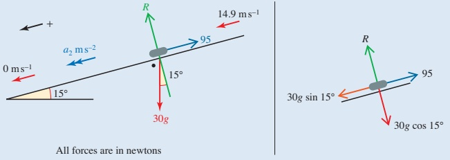

Figure 6.15

<!-- page 133 -->

By Newton's second law down the plane:

 $$ \mathrm{Resultant~force}=\mathrm{mass}\times\mathrm{acceleration} $$ 

 $$ 30g\sin15^{\circ}-95=30a_{2} $$ 

 $$ a_{2}=-0.578... $$ 

 $$ v^{2}=u^{2}+2a s $$ 

 $$ 0=14.9\ldots^{2}-2\times0.578\ldots\times s_{2}\xleftarrow[\substack{a=-0.578\ldots}]{\mathrm{G i v e n~}u=14.9,\nu=0,} $$ 

 $$ s_{2}=\frac{14.9\ldots^{2}}{2\times0.578\ldots}=192.9\ldots $$ 

Anna travels a total distance of (42.3...+192.9...)m = 235m to the nearest metre.

Make a list of the modelling assumptions used in Example 6.4. What would be the effect of changing these?

### Example 6.5

A skier is being pulled up a smooth  $ 25^{\circ} $ dry ski slope by a rope which makes an angle of  $ 35^{\circ} $ with the horizontal. The mass of the skier is 75kg and the tension in the rope is 350N. Initially the skier is at rest at the bottom of the slope. The slope is smooth. Find the skier's speed after 5 s and find the distance he has travelled in that time.

## Solution

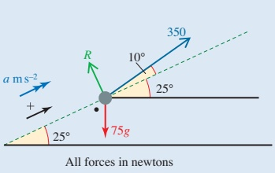

Figure 6.16 shows the situation.

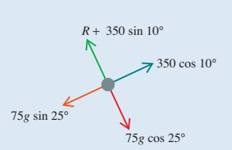

### Figure 6.16

In the diagram the skier is modelled as a particle. Since the skier moves parallel to the slope consider motion in that direction.

 $$ \mathrm{Resultant~force}=\mathrm{mass}\times\mathrm{acceleration} $$ 

 $$ 350\cos10^{\circ}-75g\sin25^{\circ}=75\times a $$ 

 $$ \text{Taking}g\text{as}10\longrightarrow a=\frac{27.7...}{75}=0.369... $$ 

This is a constant acceleration so use the constant acceleration formulae.

 $$ \nu=u+at $$ 

 $$ \nu=0+0.369...\times5\xleftarrow{\quad}u=0,a=0.369...,t=5 $$ 

 $$ \mathrm{S p e e d}=1.85\mathrm{m s}^{-1}\mathrm{(t o}2\mathrm{d.p.)}. $$

<!-- page 134 -->

$$ s=u t+\frac{1}{2}a t^{2} $$ 

 $$ s=0+\frac{1}{2}\times0.369...\times25 $$ 

Distance travelled = 4.62 m (to 2 d.p.).

Example 6.6

A car of mass 1000kg including its driver, is being pushed along a horizontal road by three people as indicated in the diagram. The car is moving in the direction AB (Figure 6.17).

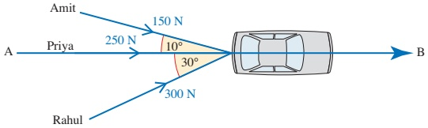

### Figure 6.17

(i) Calculate the total force exerted by the three people in the direction

(a) AB

(b) perpendicular to AB.

(ii) Will the car move in the direction perpendicular to AB? Give a reason for your answer.

Amit, Priya and Rahul continue to push the car as shown in the diagram. It takes them 10 seconds to move the car from rest to a velocity of  $ 3 \, m s^{-1} $ in the direction AB.

(iii) Calculate the force of resistance to the car's movement in the direction AB.

## Solution

(i) (a) Resolving in the direction AB ( $ \rightarrow $) the components are

Amit:  $ 150\cos10^{\circ}=147.7 $...N

Priya: 250N

Rahul:  $ 300 \cos 30^\circ = 259.8 $...N

Total force in the direction AB = 658N (to 3 s.f).

(b) Resolving perpendicular to AB ( $ \uparrow $) the components are

Amit:  $ -150\sin10^\circ = -26.0\ldots\text{N} $

Priya: ON

Rahul:  $ 300 \sin 30^\circ = 150 N $

Total force in the direction perpendicular to AB = 124N (to 3 s.f).

<!-- page 135 -->

(ii) The car does not move perpendicular to AB because the force in this direction is balanced by a sideways (lateral) friction force between the tyres and the road.

(iii) The acceleration of the car is constant, so you can use the constant acceleration formula

 $$ \nu=u+at $$ 

 $$ 3=0+10a $$ 

 $$ a=0.3 $$ 

When the resistance to motion in the direction AB is R N, Figure 6.18 shows all the horizontal forces acting on the car and its acceleration.

The weight of the car is in the third dimension, perpendicular to this plane and is balanced by the normal reaction of the ground.

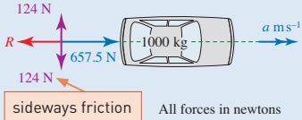

Figure 6.18

The resultant force in the direction AB is  $ (657.5... - R) $ N. So by Newton's second law

 $$ 657.5\ldots-R=m a $$ 

 $$ 657.5\ldots-R=1000\times0.3 $$ 

 $$ R=657.5...-300=357.5... $$ 

The resistance to motion in the direction AB is 358N to 3s.f.

### Example 6.7

A train consists of a locomotive of mass 40 tonnes pulling a truck of mass 20 tonnes up a slope inclined at an angle  $ \theta $ to the horizontal where  $ \sin\theta = 0.05 $. The driving force of the locomotive is 60 000 N and the resistances to the locomotive and truck are 4000 N and 2000 N respectively.

Remember

1 tonne = 1000 kg.

(i) Find the acceleration of the train.

(ii) Find the tension in the coupling connecting the locomotive to the truck.

When the train is travelling at  $ 30 \, m \, s^{-1} $, the driving force becomes zero.

(iii) Find the distance the train travels before coming to rest.

<!-- page 136 -->

## Solution

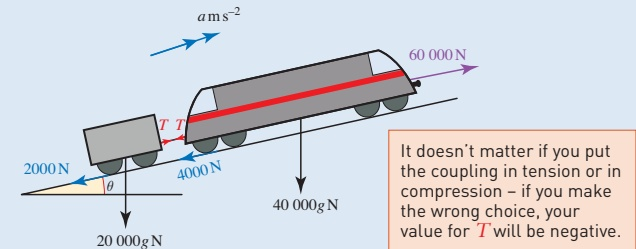

Let the force in the coupling be  $ T N $.

### Figure 6.19

Look at the system as a whole:

 $$ \mathrm{Resultant~force}=ma $$ 

 $$ 60000-2000-4000-20000g\sin\theta-40000g\sin\theta=60000a $$ 

 $$ \begin{array}{r l}{{54000}-20000g\times0.05-40000g\times0.05}&{=60000a}\\ &{24000=60000a}\\ &{\Rightarrow a=0.4\mathrm{m s}^{-2}}\end{array}\quad\mathrm{T h e~q u e s t i o n}\quad\mathrm{t e l l s~y o u t h a t~}\quad\mathrm{s i n}\theta=0.05. $$ 

## (ii) Method 1

Look at the forces acting on the engine.

 $$ \mathrm{Resultant~force}=ma $$ 

 $$ 60000-T-4000-40000g\times0.05=40000\times0.4 $$ 

 $$ \begin{aligned}36000-T&=16000\\\Rightarrow T&=20000N\end{aligned} $$ 

## Method 2

Look at the forces acting on the carriage.

 $$ \begin{aligned}Resultant~force&=ma\\T-2000-20000g\times0.05&=20000\times0.4\\T-12000&=8000\\\Rightarrow T&=20000N\end{aligned} $$   $ \begin{aligned}&Both methods\\ &give the same\\ &answer.\end{aligned} $

(iii) First you need to find the acceleration when the driving force is 0N. Look at the system as a whole:

 $$ \begin{aligned}Resultant~force&=ma\\-2000-4000-20000g\times0.05-40000g\times0.05&=60000a\\ The~acceleration~is~negative~because\\ the~train~is~decelerating.\\\xrightarrow{-36000}a&=-0.6m s^{-2}\end{aligned} $$ 

You know u = 30,  $ \nu = 0 $, a = -0.6 and you need s, so use  $ \nu^2 = u^2 + 2as $

 $$ 0=30^{2}-2\times0.6s $$ 

 $$ s=750 $$ 

The train travels 750 m before it stops.

<!-- page 137 -->

1 The diagram shows a girl pulling a sledge at steady speed across level snow-covered ground using a rope which makes an angle of  $ 30^{\circ} $ to the horizontal. The mass of the sledge is 8kg and there is a resistance force of 10N.

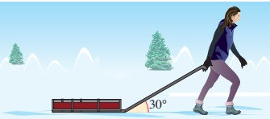

(i) Draw a diagram showing the forces acting on the sledge.

(ii) Find the magnitude of the tension in the rope.

The girl comes to an area of ice where the resistance force on the sledge is only 2N. She continues to pull the sledge with the same force as before and with the rope still taut at  $ 30^{\circ} $.

(iii) What acceleration must the girl have in order to do this?

(iv) How long will it take to double her initial speed of  $ 0.4 \, m s^{-1} $?

2 The picture shows a situation which has arisen between two anglers, Davies and Jones, standing at the ends of adjacent jetties. Their lines have become entangled under the water with the result that they have both hooked the same fish, which has mass 1.9kg. Both are reeling in their lines as hard as they can in order to claim the fish.

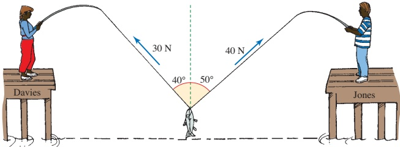

(i) Draw a diagram showing the forces acting on the fish.

(ii) Resolve the tensions in both anglers' lines into horizontal and vertical components and so find the total force acting on the fish.

(iii) Find the magnitude and direction of the acceleration of the fish.

(iv) At this point Davies' line breaks. What happens to the fish?

3 A crate of mass 30kg is being pulled up a smooth slope inclined at  $ 30^{\circ} $ to the horizontal by a rope which is parallel to the slope. The crate has acceleration  $ 0.75 \, m s^{-2} $.

(i) Draw a diagram showing the forces acting on the crate and the direction of its acceleration.

(ii) Resolve the forces in directions parallel and perpendicular to the slope.

(iii) Find the tension in the rope.

(iv) The rope suddenly snaps. What happens to the crate?

<!-- page 138 -->

4 A cyclist of mass 60kg rides a cycle of mass 7kg. The greatest forward force that she can produce is 200N but she is subject to air resistance and friction totalling 50N.

(i) Draw a diagram showing the forces acting on the cyclist when she is going uphill.

(ii) What is the angle of the steepest slope that she can ascend?

What is the angle of the steepest slope that she can ascend?

The cyclist reaches a slope of  $ 8^{\circ} $ with a speed of  $ 5\, \text{m s}^{-1} $ and rides as hard as she can up it.

(iii) Find her acceleration and the distance she travels in 5s.

(iv) What is her speed now?

5 A builder is demolishing the chimney of a house and slides the old bricks down to the ground on a straight chute 10m long inclined at  $ 42^{\circ} $ to the horizontal. Each brick has mass 3kg.

(i) Draw a diagram showing the forces acting on a brick as it slides down the chute, assuming the chute to have a flat cross-section and a smooth surface.

(ii) Find the acceleration of the brick.

(iii) Find the time the brick takes to reach the ground.

In fact the chute is not smooth and the brick takes 3s to reach the ground.

(iv) Find the frictional force acting on the brick, assuming it to be constant.

6 A block of mass 12kg is placed on a smooth plane inclined at  $ 40^{\circ} $ to the horizontal. It is connected by a light inextensible string, which passes over a smooth pulley at the top of the plane, to a block of mass 7kg hanging freely (see diagram). Find the common acceleration and the tension in the string.

7 A car of mass 1500kg pulls a caravan of mass 600kg up a slope inclined at an angle  $ \theta $ to the horizontal where  $ \sin\theta = 0.2 $. The driving force of the car's engine is 5000N and the resistances to the car and caravan are 200N and 150N respectively.

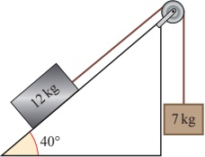

(i) Find the acceleration of the car.

(ii) Find the tension in the tow-bar connecting the car to the caravan. When the car is travelling at  $ 20 \, m s^{-1} $, the driving force becomes zero.

(iii) Find the time taken for the car to stop.

<!-- page 139 -->

8 Two toy trucks are travelling down a slope inclined at an angle of  $ 5^{\circ} $ to the horizontal (see diagram). Truck A has a mass of 6 kg, truck B has a mass of 4 kg.

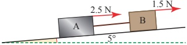

The trucks are linked by a light rigid rod which is parallel to the slope. The resistances to motion of the trucks are 2.5N for truck A and 1.5N for truck B. The initial speed of the trucks is  $ 2 \, m \, s^{-1} $.

Calculate the speed of the trucks after 3 seconds and also the force in the rod connecting the trucks, stating whether the rod is in tension or in thrust.

Particles p and q, of masses 0.6kg and 0.4kg respectively, are attached to the ends of a light inextensible string. The string passes over a small smooth pulley which is fixed at the top of a vertical cross-section of a triangular prism. The base of the prism is fixed

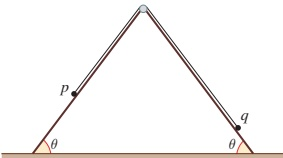

on horizontal ground and each of the sloping sides is smooth. Each sloping side makes an angle  $ \theta $ with the ground, where  $ \sin\theta = 0.8 $.

Initially the particles are held at rest on the sloping sides, with the string taut (see diagram). The particles are released and move along lines of greatest slope.

(i) Find the tension in the string and the acceleration of the particles while both are moving.

The speed of $p$ when it reaches the ground is $2\,\mathrm{m\,s}^{-1}$. On reaching the ground $p$ comes to rest and remains at rest. $q$ continues to move up the slope but does not reach the pulley.

(ii) Find the time taken from the instant that the particles are released until q reaches its greatest height above the ground.

Cambridge International AS & A Level Mathematics

9709 Paper 41 Q6 June 2012

10 A small bead Q can move freely along a smooth horizontal straight wire AB of length 3m. Three horizontal forces of magnitudes  $ F_N $, 10N and 20N act on the bead in the directions shown in the diagram. The magnitude of the resultant of the three forces is  $ R_N $ in the direction shown in the diagram.

(i) Find the values of F and R.

(ii) Initially the bead is at rest at A. It reaches B with a speed of  $ 11.7 \, m s^{-1} $. Find the mass of the bead.

<!-- page 140 -->

## KEY POINTS

1 The forces acting on a particle can be combined to form a resultant force by resolving the forces into their components.

 $$ \mathbf{When}\;\mathbf{F}=\begin{pmatrix}X\\ Y\end{pmatrix} $$ 

 $$ X=F_{1}\cos\alpha+F_{2}\cos\beta-F_{3}\cos\gamma $$ 

 $$ Y=-F_{1}\sin\alpha+F_{2}\sin\beta+F_{3}\sin\gamma $$ 

 $$ |\mathbf{F}|=~\sqrt{X^{2}+Y^{2}} $$ 

 $$ \tan\theta=\frac{Y}{X} $$ 

## 2 Equilibrium

When the resultant F is zero, the forces are in equilibrium.

## 3 Triangle of forces

If a body is in equilibrium under three non-parallel forces, their lines of action are concurrent and they can be represented by a triangle.

4 Lami's theorem

When three forces act at a point then  $ \frac{F_{1}}{\sin\alpha}=\frac{F_{2}}{\sin\beta}=\frac{F_{3}}{\sin\gamma} $

5 Newton's second law

When the resultant  $ \mathbf{F} $ is not zero there is an acceleration  $ \mathbf{a} $ and  $ \mathbf{F} = m\mathbf{a} $.

6 When a particle is on a slope, it is usually helpful to resolve in directions parallel and perpendicular to the slope.

<!-- page 141 -->

## LEARNING OUTCOMES

Now that you have finished this chapter, you should be able to:

identify the forces in a given situation

work with forces as vectors

resolve a force into components

find the resultant of several forces by resolving and adding components

know the condition for equilibrium of a particle

their vector sum of the forces is zero

three forces in equilibrium may be represented as a triangle of forces

formulate and solve equations of a particle in equilibrium

use Newton's second law to formulate the equation of motion for a particle moving in a straight line or in two dimensions

including vertically and on an inclined plane.

