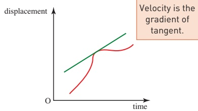
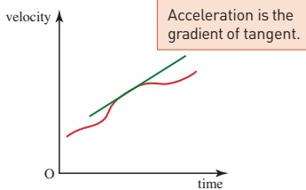
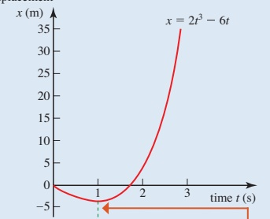
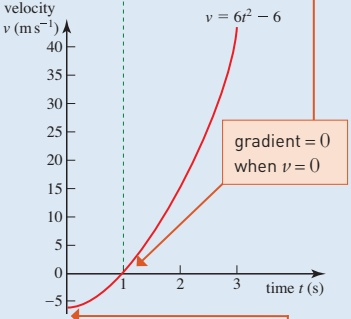
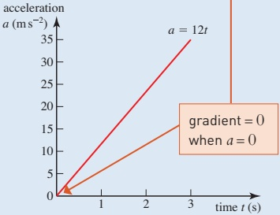
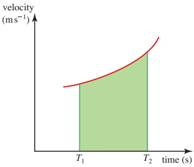
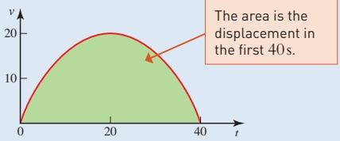
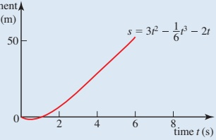
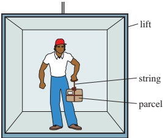
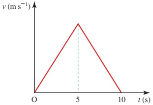

# 7 General motion in a straight line

<!-- Cambridge International AS  A Level Mathematics Mechanics (Sophie Goldie) .pdf p142-156 -->

<!-- page 142 -->

# General motion in a straight line

The goal of applied mathematics is to understand reality mathematically.

G. G. Hall (1925-)

So far you have studied motion with constant acceleration in a straight line, but the motion of a runner on a running track is much more complex. In this chapter you will see how to deal with variable acceleration.

The equations you have used for constant acceleration do not apply when the acceleration varies. You need to go back to first principles.

Consider how displacement, velocity and acceleration are related to each other. The velocity of an object is the rate at which its position changes with time. When the velocity is not constant the displacement-time graph is a curve.

The rate of change of displacement is the gradient of the tangent to the curve (Figure 7.1). You can find this by differentiating.

 $$ \nu=\frac{\mathrm{d}s}{\mathrm{d}t} $$ 

Velocity is the gradient of tangent.

Figure 7.1

<!-- page 143 -->

Similarly, the acceleration is the rate at which the velocity changes (Figure 7.2), so

 $$ a=\frac{\mathrm{d}\nu}{\mathrm{d}t}=\frac{\mathrm{d}^{2}s}{\mathrm{d}t^{2}} $$ 

Figure 7.2

### 7.1 Using differentiation

When you are given the position of a moving object in terms of time, you can use equations  $ \textcircled{1} $ and  $ \textcircled{2} $ to solve problems even when the acceleration is not constant.

### Example 7.1

An object moves along a straight line so that its displacement at time t in seconds is given by

 $$ x=2t^{3}-6t\left(\mathrm{i n~m e t r e s}\right)(t\geqslant0). $$ 

(i) Find expressions for the velocity and acceleration of the object at time t.

(ii) Find the values of x, v and a when t = 0, 1, 2 and 3.

(iii) Sketch the graphs of $x$, $\nu$ and $a$ against time.

(iv) Describe the motion of the object.

## Solution

(i) Displacement

 $$ x=2t^{3}-6t $$ 

Velocity

 $$ \nu=\frac{\mathrm{d}x}{\mathrm{d}t}=6t^{2}-6 $$ 

Acceleration

 $$ a=\frac{\mathrm{d}\nu}{\mathrm{d}t}=12t $$ 

You can now use these three equations to solve problems about the motion of the object.

(ii) When  $ t = 0 \quad 1 \quad 2 \quad 3 $

From ①  $ x = 0 \quad -4 \quad 4 \quad 36 $

From ②  $ \nu = -6 \quad 0 \quad 18 \quad 48 $

From ③  $ a = 0 \quad 12 \quad 24 \quad 36 $

(iii) The graphs in Figure 7.3 are drawn one under another so that you can see how they relate.

<!-- page 144 -->

(iv) The object starts at the origin and moves towards the negative direction, gradually slowing down.

At  $ t = 1 $ it stops

instantaneously ( $ \nu = 0 $) and

changes direction, returning

to its initial position at

about  $ t = \sqrt{3} = 1.732 $

It then continues moving in the positive direction with increasing speed.

The acceleration is increasing at a constant rate. This cannot go on for much longer or the speed will become excessive.

Figure 7.3

<!-- page 145 -->

1 In each of these cases

(a) find an expression for the velocity

(b) use your equations to write down the initial displacement and velocity

(c) find the time and displacement when the velocity is zero.

(i)  $ s = 10 + 2t - t^{2} $

(ii)  $ s = -4t + t^{2} $

(iii)  $ s = t^{3} - 5t^{2} + 4 $

2 In each of these cases

(a) find an expression for the acceleration

(b) use your equations to write down the initial velocity and acceleration.

(i)  $ \nu = 4t + 3 $

(ii)  $ \nu = 6t^{2} - 2t + 1 $

(iii)  $ \nu = 7t - 5 $

3 The distance travelled by a cyclist is modelled by

s = 4t + 0.5t^{2} in S.I. units

Find expressions for the velocity and the acceleration of the cyclist at time t.

4 In each of these cases

(a) find expressions for the velocity and the acceleration

(b) draw the acceleration-time graph and, below it, the velocity-time graph with the same scale for time and the origins in line

(c) describe how the two graphs for each object relate to each other

(d) describe how the velocity and acceleration change during the motion of each object.

 $$ \begin{array}{l l l l l l l } (i) & &x=15t-5t^{2} \end{array} $$ 

[ii]  $ x = 6t^{3} - 18t^{2} - 6t + 3 $

### 7.2 Finding displacement from velocity

How can you find an expression for the displacement of an object when you know its velocity in terms of time?

One way of thinking about this is to remember that  $ \nu = \frac{ds}{dt} $, so you need to do the opposite of differentiation, that is integrate, to find s.

 $$ s=\int\nu\mathrm{d}t $$ 

The  $ d_{t} $ indicates that you must write  $ \nu $ in terms of t before integrating.

<!-- page 146 -->

The velocity (in m s $ ^{-1} $) of a model train that is moving along straight rails is
 $ \nu = 0.3t^{2} - 0.5 $
Find its displacement from its initial position
(i) after time t
(ii) after 3 seconds.
Solution
(i) The displacement at any time is  $  s = \int \nu \, dt  $
 $  = \int (0.3t^{2} - 0.5) \, dt  $
 $  = 0.1t^{3} - 0.5t + c  $
To find the train's displacement from its initial position, put s = 0 when t = 0.
This gives c = 0 and so s = 0.1t^{3} - 0.5t.
You can use this equation to find the displacement at any time before the motion changes.
(ii) After 3 seconds, t = 3 and s = 2.7 - 1.5.
The train is 1.2m from its initial position.

When using integration don't forget the constant. This is very important in mechanics problems and you are usually given some extra information to help you find the value of the constant.

### 7.3 The area under a velocity-time graph

In Chapter 1 you saw that the area under a velocity-time graph represents a displacement. Both the area under the graph and the displacement are found by integrating. To find a particular displacement you calculate the area under the velocity-time graph by integration using suitable limits.

The distance travelled between the times  $ T_{1} $ and  $ T_{2} $ is shown by the shaded area on the graph in Figure 7.4.

 $$ s=\mathrm{area}=\int_{T_{1}}^{T_{2}}\nu\,\mathrm{d}t $$ 

Figure 7.4

<!-- page 147 -->

A car moves between two sets of traffic lights, stopping at both. Its speed  $ \nu_{ms^{-1}} $ at time  $ t_{s} $ is modelled by

 $$ \nu=\frac{1}{20}t\;(40-t),\qquad0\leqslant t\leqslant40. $$ 

Find the times at which the car is stationary and the distance between the two sets of traffic lights.

## Solution

The car is stationary when  $ \nu = 0 $. Substituting this into the expression for the speed gives

 $$ 0=\frac{1}{20}t(40-t) $$ 

 $$ t=0or t=40. $$ 

These are the times when the car starts to move away from the first set of traffic lights and stops at the second set (Figure 7.5).

Figure 7.5

The distance between the two sets of lights is given by

 $$ \mathrm{Distance}=\int_{0}^{40}\frac{1}{20}t(40-t)\mathrm{d}t $$ 

 $$ =\frac{1}{20}\int_{0}^{40}(40t-t^{2})\mathrm{d}t $$ 

 $$ =\frac{1}{20}\bigg[20t^{2}-\frac{t^{3}}{3}\bigg]_{0}^{40} $$ 

 $$ =533\mathrm{~m~(t o~}3\mathrm{~s.f.}\mathrm{)} $$ 

### 7.4 Finding velocity from acceleration

You can also use integration to find the velocity from the acceleration.

 $$ \begin{array}{l}a=\frac{\mathrm{d}\nu}{\mathrm{d}t}\\\Longrightarrow\qquad\qquad\qquad\nu=\int a\,\mathrm{d}t\end{array} $$ 

The next example shows how you can use integration to obtain equations for motion.

<!-- page 148 -->

The acceleration of a particle (in ms^{-2}) at time t seconds is given by
 $ a = 6 - t $.
(ii) The particle is initially at the origin with velocity  $ -2\, \text{m s}^{-1} $. Find an expression for
(a) the velocity of the particle after t s
(b) the displacement of the particle after t s.
(ii) Hence find the velocity and displacement 6s later.

## Solution

(i) The information given may be summarised as:

at $t=0$, $s=0$ and $\nu=-2$

at time $t$, $a=6-t$. ①

(a) $\frac{d\nu}{dt}=a=6-t$

Integrating gives

$\nu=6t-\frac{1}{2}t^{2}+c$

When $t=0$, $\nu=-2$

so $-2=0-0+c$

$c=-2$

At time $t$

$\nu=6t-\frac{1}{2}t^{2}-2$ ②

(b) $\frac{ds}{dt}=\nu=6t-\frac{1}{2}t^{2}-2$

Integrating gives

$s=3t^{2}-\frac{1}{6}t^{3}-2t+k$

When $t=0$, $s=0$

so $0=0-0-0+k$

$k=0$

At time $t$

$s=3t^{2}-\frac{1}{6}t^{3}-2t$ ③

Figure 7.6 shows the development of the solution. Figure 7.6

Notice that two different arbitrary constants  $ (c $ and  $ k $)\ are necessary when you integrate twice. You could call them  $ c_1 $ and  $ c_2 $ if you wish.

<!-- page 149 -->

[ii] You can now use equations ①, ② and ③ to give more information about the motion in a similar way to the suvat formulae. (The suvat formulae only apply when the acceleration is constant.)

When t = 6  $ \nu = 36 - 18 - 2 = 16 $ from ②

When t = 6 s = 108 - 36 - 12 = 60 from ③

The particle has a velocity of +16 m s $ ^{-1} $ and is at +60 m after 6 s.

Exercise 7B

1 Find expressions for the displacement in each of these cases.
(i)  $ \nu = 4t + 3 $; initial position 0.
(ii)  $ \nu = 6t^{3} - 2t^{2} + 1 $; when  $ t = 0, s = 1 $.
(iii)  $ \nu = 7t^{2} - 5 $; when  $ t = 0, s = 2 $.
2 The speed of a ball rolling down a hill is modelled by  $ \nu = 1.7t $ (in  $ m s^{-1} $).
(i) Draw the speed-time graph of the ball.
(ii) How far does the ball travel in 10s?
3 Until it stops moving, the speed of a bullet t s after entering water is modelled by  $ \nu = 216 - t^{3} $ (in  $ m s^{-1} $).
(i) When does the bullet stop moving?
(ii) How far has it travelled by this time?
4 During braking the speed of a car is modelled by  $ \nu = 40 - 2t^{2} $ (in  $ m s^{-1} $) until it stops moving.
(i) How long does the car take to stop?
(ii) How far does it move before it stops?
5 In each case below, the object moves along a straight line with acceleration a in  $ m s^{-2} $. Find an expression for the velocity  $ \nu $ ( $ m s^{-1} $) and displacement x (m) of each object at time t s.
(i)  $ a = 10 + 3t - t^{2} $; the object is initially at the origin and at rest.
(ii)  $ a = 4t - 2t^{2} $; at t = 0, x = 1 and  $ \nu = 2 $.
(iii) a = 10 - 6t; at t = 1, x = 0 and  $ \nu = -5 $.

### 7.5 The constant acceleration formulae revisited

In which of the cases in question 1 in Exercise 7B is the acceleration constant? Which constant acceleration formulae give the same results for $s$, $\nu$ and $a$ in this case? Why would the constant acceleration formulae not apply in the other two cases?

<!-- page 150 -->

You can use integration to prove the equations for constant acceleration.

When a is constant (and only then)

 $$ \nu=\int a\mathrm{d}t=a t+c_{1} $$ 

When t = 0,  $ \nu = u $

 $$ \begin{array}{r} u=0+c_{1} \\ \Rightarrow \quad v=u+a t \end{array} $$ 

You can integrate this again to find  $ s = ut + \frac{1}{2}at^2 + c_2 $

 $ u $ and  $ a $ are both

constant.

If  $ s = s_0 $ when  $ t = 0 $,  $ c_2 = s_0 $ and  $ s = ut + \frac{1}{2}at^2 + s_0 $

How can you use these to derive the other equations for constant acceleration?

 $$ s=\frac{1}{2}(u+v)t+s_{0} $$ 

 $$ \nu^{2}-u^{2}=2a(s-s_{0}) $$ 

 $$ s=v t-\tfrac{1}{2}a t^{2}+s_{0} $$ 

## Exercise 7C

1 A boy throws a ball up in the air from a height of 1.5 m and catches it at the same height. Its height in metres at time t seconds is

 $$ \gamma=1.5+15t-5t^{2}. $$ 

(ii) What is the vertical velocity  $ \nu \, m s^{-1} $ of the ball at time  $ t $?

(ii) Find the displacement, velocity and speed of the ball at t = 1 and t = 2.

(iii) Sketch the displacement-time, velocity-time and speed-time graphs for  $ 0 \leq t \leq 3 $.

(iv) When does the boy catch the ball?

(v) Explain why the distance travelled by the ball is not equal to  $ \int_{0}^{3} v \, dt $ and state what information this expression does give.

2 An object moves along a straight line so that its displacement in metres at time t seconds is given by

 $$ x=t^{3}-3t^{2}-t+3\quad(t\geqslant0). $$ 

(i) Find the displacement, velocity and speed of the object at t = 2.

(ii) Find the smallest time when

(a) the displacement is zero

(b) the velocity is zero.

(iii) Sketch displacement–time, velocity–time and speed–time graphs for  $ 0 \leq t \leq 3 $.

(iv) Describe the motion of the object.

<!-- page 151 -->

3 Two objects move along the same straight line. The velocities of the objects (in  $ ms^{-1} $) are given by  $ \nu_1 = 16t - 6t^2 $ and  $ \nu_2 = 2t - 10 $ for  $ t \geq 0 $. Initially the objects are 32 m apart. At what time do they collide?

4 An object moves along a straight line so that its acceleration (in  $ ms^{-2} $) is given by  $ a = 4 - 2t $. It starts its motion at the origin with speed  $ 4ms^{-1} $ in the direction of increasing x.

## M

(i) Find as functions of $t$ the velocity and displacement of the object.

(ii) Sketch the displacement-time, velocity-time and acceleration-time graphs for  $ 0 \leq t \leq 2 $.

(iii) Describe the motion of the object.

5 Nick watches a golfer putting her ball 24m from the edge of the green and into the hole and he decides to model the motion of the ball. Assuming that the ball is a particle travelling along a straight line he models its distance, s metres, from the golfer at time t seconds by

 $$ s=-\frac{3}{2}t^{2}+12t\qquad0\leqslant t\leqslant4. $$ 

(i) Find the value of s when t=0, 1, 2, 3 and 4.

(ii) Explain the restriction  $ 0 \leq t \leq 4 $.

(iii) Find the velocity of the ball at time t seconds.

(iv) With what speed does the ball enter the hole?

## M

(v) Find the acceleration of the ball at time t seconds.

6 Andrew and Elizabeth are having a race over 100 m. Their accelerations (in ms $ ^{-2} $) are as follows:

Andrew Elizabeth

 $$ a=4-0.8t\quad0\leq t\leq5\quad a=4\quad0\leq t\leq2.4 $$ 

 $$ a=0\qquad\quad t>5\qquad\quad a=0\quad t>2.4 $$ 

(i) Find the greatest speed of each runner.

(ii) Sketch the speed-time graph for each runner.

(iii) Find the distance Elizabeth runs while reaching her greatest speed.

(iv) How long does Elizabeth take to complete the race?

(v) Who wins the race, by what time margin and by what distance?

On another day they race over 120m, both running in exactly the same manner.

(vi) What is the result now?

<!-- page 152 -->

## CP

7 Christine is a parachutist. On one of her descents her vertical speed,  $ \nu $ m s $ ^{-1} $, t s after leaving an aircraft is modelled by

 $$ \nu=8.5t\quad0\leq t\leq10 $$ 

 $$ \nu=5+0.8(t-20)^{2}\quad10<t\leq20 $$ 

## PS

 $$ \nu=5\quad20<t\leq90 $$ 

 $$ \nu=0\quad t>90 $$ 

(i) Sketch the speed-time graph for Christine's descent and explain the shape of each section.

(ii) How high is the aircraft when Christine jumps out?

(iii) Write down expressions for the acceleration during the various phases of Christine's descent. What is the greatest magnitude of her acceleration?

8 A man of mass 70kg is standing in a lift which, at a particular time, has an acceleration of  $ 1.6 \, m s^{-2} $ upwards. He is holding a parcel of mass 5kg by a single string.

(i) Draw a diagram marking the forces acting on the parcel and the direction of the acceleration.

(ii) Show that the tension in the string is 58 N.

(iii) Calculate the reaction of the lift floor on the man.

During the first two seconds after starting from rest, the lift has acceleration in  $ ms^{-2} $ modelled by  $ 3t $  $ (2 - t) $, where  $ t $ is in seconds. The maximum tension the string can withstand is 60 N.

(iv) By investigating the maximum acceleration of the system, or otherwise, determine whether the string will break during this time.

<!-- page 153 -->

9 A particle P moves on a straight line. It starts at a point O on the line and returns to O 100 s later. The velocity of P is  $ \nu m s^{-1} $ at time t s after leaving O, where

 $$ \nu=0.0001t^{3}-0.015t^{2}+0.5t. $$ 

(i) Show that P is instantaneously at rest when t = 0, t = 50 and t = 100.

(ii) Find the values of  $ \nu $ at the times for which the acceleration of P is zero, and sketch the velocity-time graph for P's motion for  $ 0 \leq t \leq 100 $.

(iii) Find the greatest distance of P from O for  $ 0 \leq t \leq 100 $.

Cambridge International AS & A Level Mathematics

9709 Paper 43 Q7 June 2015

10 A particle P travels in a straight line from A to D, passing through the points B and C. For the section AB the velocity of the particle is  $ (0.5t - 0.01t^{2}) $ ms $ ^{-1} $, where t is the time after leaving A.

(i) Given that the acceleration of P at B is  $ 0.1 \, m s^{-2} $, find the time taken for P to travel from A to B.

The acceleration of P from B to C is constant and equal to  $ 0.1 \, m s^{-2} $.

(ii) Given that P reaches C with speed  $ 14 \, m s^{-1} $, find the time taken for P to travel from B to C.

P travels with constant deceleration  $ 0.3 \, m s^{-2} $ from C to D. Given that the distance CD is 300 m, find

(iii) the speed with which P reaches D.

(iv) the distance AD.

Cambridge International AS & A Level Mathematics

9709 Paper 4 Q7 June 2009

11 Particles P and Q move on a straight line AOB. The particles leave O simultaneously, with P moving towards A and with Q moving towards B. The initial speed of P is  $ 1.3 \, m s^{-1} $ and its acceleration in the direction OA is  $ 0.1 \, m s^{-2} $. Q moves with acceleration in the direction OB of  $ 0.016 \, t m s^{-2} $, where t seconds is the time elapsed since the instant that P and Q started to move from O. When t = 20, particle P passes through A and particle Q passes through B.

(i) Given that the speed of Q at B is the same as the speed of P at A, find the speed of Q at time t = 0.

(ii) Find the distance AB.

Cambridge International AS & A Level Mathematics

9709 Paper 41 Q4 November 2014

<!-- page 154 -->

12 A particle P starts from rest at the point A and travels in a straight line, coming to rest again after 10 s. The velocity-time graph for P consists of two straight line segments (see diagram). A particle Q starts from rest at A at the same instant as P and travels along the same straight line as P. The velocity of Q is given by  $ \nu = 3t - 0.3t^2 $ for  $ 0 \leq t \leq 10 $. The displacements from A of P and Q are the same when  $ t = 10 $.

(i) Show that the greatest velocity of P during its motion is  $ 10 \, m \, s^{-1} $.

(ii) Find the value of t, in the interval 0 < t < 5, for which the acceleration of Q is the same as the acceleration of P.

Cambridge International AS & A Level Mathematics

9709 Paper 4 Q6 June 2007

13 A particle P starts from rest at the point A at time  $ t = 0 $, where  $ t $ is in seconds, and moves in a straight line with constant acceleration  $ a_{ms}^{-2} $ for 10s. For  $ 10 \leq t \leq 20 $, P continues to move along the line with velocity  $ \nu_{ms}^{-1} $, where

 $ v = \frac{800}{t^2} - 2 $. Find

(i) the speed of P when $t=10$, and the value of $a$,

(ii) the value of t for which the acceleration of P is  $ -a m s^{-2} $,

(iii) the displacement of P from A when t = 20.

Cambridge International AS & A Level Mathematics

9709 Paper 41 Q7 November 2009

14 A vehicle is moving in a straight line. The velocity  $ \nu m s^{-1} $ at time t is after the vehicle starts is given by

 $$ \nu=A(t-0.05t^{2})\qquad\mathrm{f o r}0\leqslant t\leqslant15, $$ 

 $$ \nu=\frac{B}{t^{2}}\quad for t\geq15, $$ 

where A and B are constants. The distance travelled by the vehicle between t = 0 and t = 15 is 225 m.

(i) Find the value of A and show that B = 3375.

(ii) Find an expression in terms of t for the total distance travelled by the vehicle when  $ t \geq 15 $.

(iii) Find the speed of the vehicle when it has travelled a total distance of 315 m.

<!-- page 155 -->

15 Particle P travels along a straight line from A to B with constant acceleration  $ 0.05 \, \text{m} \, \text{s}^{-2} $. Its speed at A is  $ 2 \, \text{m} \, \text{s}^{-1} $ and its speed at B is  $ 5 \, \text{m} \, \text{s}^{-1} $.

(i) Find the time taken for P to travel from A to B, and find also the distance AB.

Particle Q also travels along the same straight line from A to B, starting from rest at A. At time t_s after leaving A, the speed of Q is  $ kt^3 \, \text{m} \, \text{s}^{-1} $, where k is a constant. Q takes the same time to travel from A to B as P does.

(ii) Find the value of k and find Q's speed at B.

Cambridge International AS & A Level Mathematics

9709 Paper 41 Q5 November 2012

## KEY POINTS

## 1 Relationships between the variables describing motion

<table border=1 style='margin: auto; word-wrap: break-word;'><tr><td style='text-align: center; word-wrap: break-word;'>Displacement</td><td style='text-align: center; word-wrap: break-word;'>→</td><td style='text-align: center; word-wrap: break-word;'>Velocity</td><td style='text-align: center; word-wrap: break-word;'>→</td><td style='text-align: center; word-wrap: break-word;'>Acceleration</td></tr><tr><td style='text-align: center; word-wrap: break-word;'></td><td style='text-align: center; word-wrap: break-word;'></td><td style='text-align: center; word-wrap: break-word;'>differentiate</td><td style='text-align: center; word-wrap: break-word;'></td><td style='text-align: center; word-wrap: break-word;'></td></tr><tr><td style='text-align: center; word-wrap: break-word;'>s</td><td style='text-align: center; word-wrap: break-word;'></td><td style='text-align: center; word-wrap: break-word;'>$  \nu = \frac{ds}{dt}  $</td><td style='text-align: center; word-wrap: break-word;'></td><td style='text-align: center; word-wrap: break-word;'>$  a = \frac{dv}{dt} = \frac{d^{2}s}{dt^{2}}  $</td></tr><tr><td style='text-align: center; word-wrap: break-word;'>Acceleration</td><td style='text-align: center; word-wrap: break-word;'>→</td><td style='text-align: center; word-wrap: break-word;'>Velocity</td><td style='text-align: center; word-wrap: break-word;'>→</td><td style='text-align: center; word-wrap: break-word;'>Displacement</td></tr><tr><td style='text-align: center; word-wrap: break-word;'></td><td style='text-align: center; word-wrap: break-word;'></td><td style='text-align: center; word-wrap: break-word;'>integrate</td><td style='text-align: center; word-wrap: break-word;'></td><td style='text-align: center; word-wrap: break-word;'></td></tr><tr><td style='text-align: center; word-wrap: break-word;'>a</td><td style='text-align: center; word-wrap: break-word;'></td><td style='text-align: center; word-wrap: break-word;'>$  \nu = \int a \, dt  $</td><td style='text-align: center; word-wrap: break-word;'></td><td style='text-align: center; word-wrap: break-word;'>$  s = \int \nu \, dt  $</td></tr></table>

2 Acceleration may be due to change in direction or change in speed or both.

<!-- page 156 -->

## LEARNING OUTCOMES

Now that you have finished this chapter, you should be able to

differentiate an expression in t for displacement s to obtain an expression for velocity v

■ differentiate an expression in t for velocity v to obtain an expression for acceleration a

sketch displacement—time graphs and velocity—time graphs where acceleration is not constant

integrate an expression in t for velocity to obtain an expression for displacement

use additional information to obtain a value for the constant of integration

use limits of integration to find the value of the displacement

integrate an expression in t for acceleration to obtain an expression for velocity

use additional information to obtain a value for the constant of integration

use limits of integration to find the value of the velocity

solve problems where the motion has variable acceleration.

