# 8 A model for friction

<!-- Cambridge International AS  A Level Mathematics Mechanics (Sophie Goldie) .pdf p157-172 -->

<!-- page 157 -->

## 8 

## A model for friction

A gem cannot be polished without friction, nor a man perfected without trials.

Lucius Annaeus

Seneca

(c 4 BC-AD 65)

When a collision accident happens, skid marks are sometimes left on the roadway by a vehicle that has locked its brakes, as shown in Figure 8.1. By measuring the skid marks and applying mechanics it is possible to estimate the speed of the vehicle, before the collision.

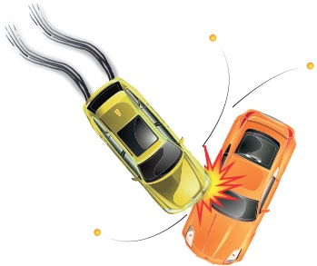

Figure 8.1

<!-- page 158 -->

### 8.1 A model for friction

Clearly the key information about the incident involving the yellow car is provided by the skid marks. To interpret it, you need a model for how friction works: in this case between the car's tyres and the road.

As a result of experimental work, Coulomb formulated a model for friction between two surfaces. The following laws are usually attributed to him.

1 Friction always opposes relative motion between two surfaces in contact.

2 Friction is independent of the relative speed of the surfaces.

3 The magnitude of the frictional force has a maximum which depends on the normal reaction between the surfaces and on the roughness of the surfaces in contact.

4 If there is no sliding between the surfaces

 $$ F\leq\mu R $$ 

where F is the force due to friction and R is the normal reaction.  $ \mu $ is called the coefficient of friction.

5 When sliding is just about to occur, friction is said to be limiting and  $ F = \mu R $.

6 When sliding occurs  $ F = \mu R $.

According to Coulomb's model,  $ \mu $ is a constant for any pair of surfaces. Typical values and ranges of values for the coefficient of friction  $ \mu $ are given in this table.

<table border=1 style='margin: auto; word-wrap: break-word;'><tr><td style='text-align: center; word-wrap: break-word;'>Surfaces in contact</td><td style='text-align: center; word-wrap: break-word;'>$ \mu $</td></tr><tr><td style='text-align: center; word-wrap: break-word;'>wood sliding on wood</td><td style='text-align: center; word-wrap: break-word;'>0.2-0.6</td></tr><tr><td style='text-align: center; word-wrap: break-word;'>metal sliding on metal</td><td style='text-align: center; word-wrap: break-word;'>0.15-0.3</td></tr><tr><td style='text-align: center; word-wrap: break-word;'>normal tyres on dry road</td><td style='text-align: center; word-wrap: break-word;'>0.8</td></tr><tr><td style='text-align: center; word-wrap: break-word;'>racing tyres on dry road</td><td style='text-align: center; word-wrap: break-word;'>1.0</td></tr><tr><td style='text-align: center; word-wrap: break-word;'>sandpaper on sandpaper</td><td style='text-align: center; word-wrap: break-word;'>2.0</td></tr><tr><td style='text-align: center; word-wrap: break-word;'>skis on snow</td><td style='text-align: center; word-wrap: break-word;'>0.02</td></tr></table>

## How fast was the driver of the yellow car going?

You can now proceed with the problem. As an initial model, the driver of the yellow car made these assumptions:

1 that the road was level

2 that his car was travelling at  $ 2\,m\,s^{-1} $ when it hit the orange car. (This was consistent with the damage to the cars.)

3 that the car and driver could be treated as a particle, subject to Coulomb's laws of friction with  $ \mu = 0.8 $ (i.e. dry road conditions).

<!-- page 159 -->

The driver of the yellow car measured the length of the skid marks and found they were 10 metres long. Taking the direction of travel as positive, let the car and driver have acceleration  $ a_{ms}^{-2} $ and mass m kg. You have probably realised that the acceleration will be negative. The forces (in N) and acceleration are shown in Figure 8.2.

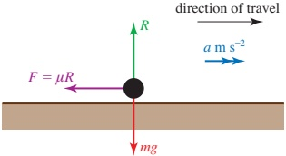

### Figure 8.2

Applying Newton's second law:

perpendicular to the road, since there is no vertical acceleration

 $$ R-mg=0 $$ 

parallel to the road, there is a constant force  $ -\mu R $ from friction, so

 $$ -\mu R=m a $$ 

Solving for a gives

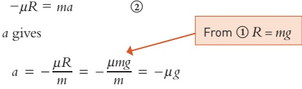

 $$ a=-\frac{\mu R}{m}=-\frac{\mu mg}{m}=-\mu g $$ 

Taking  $ g = 10 \, \text{m} \, \text{s}^{-2} $ and  $ \mu = 0.8 $ gives  $ a = -8 \, \text{m} \, \text{s}^{-2} $.

You can use the constant acceleration equation

The skid marks were 10m long.

 $$ \nu^{2}=u^{2}+2a s $$ 

to calculate the initial speed of the yellow car. Substituting  $ s = 10, \nu = 2 $ and a = -8 gives

 $$ u=\sqrt{2^{2}+2\times8\times10}=12.81...m s^{-1} $$ 

Convert this figure to kilometres per hour:

 $$ \begin{aligned}speed&=\frac{12.81...\times3600}{1000}\\&=46.1kmh^{-1}(to3s.f.)\end{aligned} $$ 

So the model suggests that the yellow car was travelling at a speed of just over 46km h $ ^{-1} $ before skidding began.

How good is this model and would you be confident in offering the answer as evidence in court? Look carefully at the three assumptions on page 142. What effect do they have on the estimate of the initial speed?

<!-- page 160 -->

### 8.2 Modelling with friction

Whilst there is always some frictional force between two sliding surfaces its magnitude is often very small. In such cases you can ignore the frictional force and describe the surfaces as smooth.

In situations where frictional forces cannot be ignored you can describe the surface(s) as  $ \underline{\text{rough}} $. Coulomb's law is the standard model for dealing with such cases.

Frictional forces are essential in many ways. For example, a ladder leaning against a wall would always slide if there were no friction between the foot of the ladder and the ground. The absence of friction in icy conditions causes difficulties for road users: pedestrians slip over, cars and motorcycles skid.

Remember that friction always opposes sliding motion.

In what direction is the frictional force between the back wheel of a cycle and the road?

## Historical note

Charles Augustin de Coulomb was born in Angoulême in France in 1736 and is best remembered for his work on electricity rather than for that on friction. The unit for electric charge is named after him.

Coulomb was a military engineer and worked for many years in the West Indies, eventually returning to France in poor health not long before the Revolution. He worked in many fields, including the elasticity of metal, silk fibres and the design of windmills. He died in Paris in 1806.

### Example 8.1

A horizontal rope is attached to a crate of mass 70kg at rest on a flat surface. The coefficient of friction between the floor and the crate is 0.6. Find the maximum force that the rope can exert on the crate without moving it.

## Solution

The forces (in N) acting on the crate are shown in Figure 8.3. Since the crate does not move, it is in equilibrium.

Horizontal forces: T = F

Vertical forces:

 $$ \begin{aligned}R&=mg\\&=70\times10=700\end{aligned} $$ 

The law of friction states that

 $$ F\leq\mu R $$ 

for objects at rest.

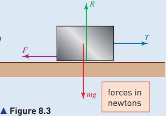

<!-- page 161 -->

So in this case

 $$ F\leq0.6\times700 $$ 

 $$ F\leq420 $$ 

The maximum frictional force is 420 N. As the tension in the rope and the force of friction are the only forces that have horizontal components, the crate will remain in equilibrium unless the tension in the rope is greater than 420 N.

### Example 8.2

Figure 8.4 shows a block of mass 5kg on a rough table. It is connected by light inextensible strings passing over smooth pulleys to masses of 4kg and 7kg, both of which hang vertically. The coefficient of friction between the block and the table is 0.4.

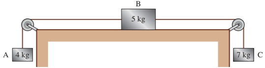

### Figure 8.4

(i) Draw a diagram showing the forces acting on the three blocks and the direction of acceleration if the system moves.

(ii) Show that acceleration does take place.

(iii) Find the acceleration of the system and the tensions in the strings.

## Solution

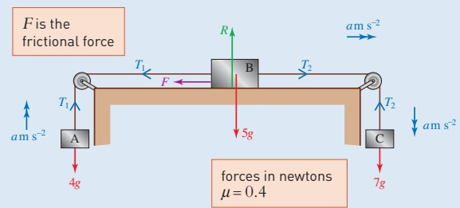

### Figure 8.5

If acceleration takes place it is in the direction shown in Figure 8.5 and a > 0.

<!-- page 162 -->

<table border=1 style='margin: auto; word-wrap: break-word;'><tr><td style='text-align: center; word-wrap: break-word;'>(ii)</td><td style='text-align: center; word-wrap: break-word;'>When the acceleration is  $ a \mathrm{~m s^{-2}} $ ( $ \geq 0 $), Newton&#x27;s second law gives for B, horizontally:  $ T_{2} - T_{1} - F = 5a $ ①for A, vertically upwards:  $ T_{1} - 4g = 4a $ ②for C, vertically downwards:  $ 7g - T_{2} = 7a $ ③Adding ①, ② and ③,  $ 3g - F = 16a $ ④B has no vertical acceleration so  $ R = 5g $ The maximum possible value of F is  $ \mu R = 0.4 \times 5g = 2g $. In ④, a can be zero only if  $ F = 3g $, so a &gt; 0 and sliding occurs.</td></tr></table>

(iii) When sliding occurs, you can replace F by  $ \mu R = 2g $

Then ④ gives

 $$ g=16a $$ 

 $$ a=0.625 $$ 

Back-substituting gives  $ T_{1}=42.5 $ and  $ T_{2}=65.625 $.

The acceleration is  $ 0.625 \, m s^{-2} $ and the tensions are 42.5 N and 65.6 N.

Example 8.3

Angus is pulling a sledge of mass 12 kg at steady speed across level snow by means of a rope which makes an angle of  $ 20^{\circ} $ with the horizontal. The coefficient of friction between the sledge and the ground is 0.15. What is the tension in the rope?

## Solution

Since the sledge is travelling at steady speed, the forces acting on it are in equilibrium. They are shown in Figure 8.6.

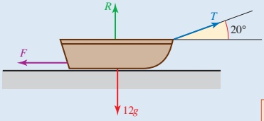

### Figure 8.6

Horizontally:

Notice that the normal reaction is reduced when the rope is pulled in an upward direction. This has the effect of reducing the friction and making the sledge easier to pull.

 $$ \begin{array}{l}forces~in~newtons\\\mu=0.15\end{array} $$ 

 $$ T\cos20^{\circ}=F $$ 

Vertically:

 $ F = \mu R $ when the sledge slides

 $$ T\sin20^{\circ}+R=12g $$ 

 $$ R=12\times10-T\sin20^{\circ} $$ 

Combining these gives

 $$ T\cos20^{\circ}=0.15(12\times10-T\sin20^{\circ}) $$ 

 $$ T\left(\cos20^{\circ}+0.15\sin20^{\circ}\right)=0.15\times12\times10 $$ 

 $$ T=18.2(to3s.f.) $$ 

The tension is 18.2N.

<!-- page 163 -->

A ski slope is designed for beginners. Its angle to the horizontal is such that skiers will either remain at rest on the point of moving or, if they are pushed off, move at constant speed. The coefficient of friction between the skis and the slope is 0.35. Find the angle that the slope makes with the horizontal.

## Solution

Figure 8.7 shows the forces on the skier.

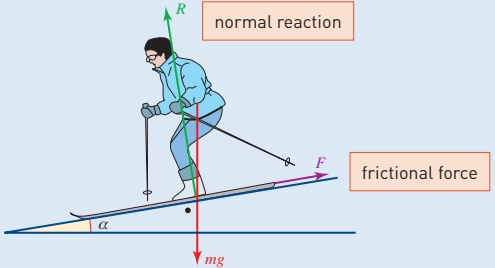

### Figure 8.7

The weight mg can be resolved into components mg  $ \cos\alpha $ perpendicular to the slope and mg  $ \sin\alpha $ parallel to the slope, as in Figure 8.8.

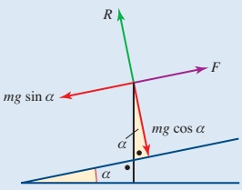

You can think of the weight mg as the resultant of two resolved components.

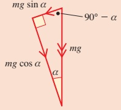

### Figure 8.8

Since the skier is in equilibrium (at rest or moving with constant speed) applying Newton's second law:

Parallel to slope:

 $$ \begin{aligned}mg\sin\alpha-F&=0\\\Rightarrow F&=mg\sin\alpha\end{aligned} $$ 

Perpendicular to slope:

 $$ \begin{aligned}R-mg\cos\alpha&=0\\\Rightarrow R&=mg\cos\alpha\end{aligned}\quad\textcircled{2} $$

<!-- page 164 -->

In limiting equilibrium or moving at constant speed,

 $$ F=\mu R $$ 

 $ mg \sin \alpha = \mu mg \cos \alpha $

substituting for F and R from ① and ②

 $$ \mu\;=\;\frac{\sin\alpha}{\cos\alpha}\;=\;\tan\alpha. $$ 

In this case  $ \mu = 0.35 $, so  $ \tan \alpha = 0.35 $ and  $ \alpha = 19.3^{\circ} $.

## Note

The result is independent of the mass of the skier. This is often found in simple mechanics models. For example, two objects of different mass fall to the ground with the same acceleration. However, when such models are refined, for example to take account of air resistance, mass is often found to have some effect on the result.

2 The angle for which the skier is about to slide down the slope is called the angle of friction. The angle of friction is often denoted by $\lambda$ (lambda) and defined by $\tan \lambda = \mu$.

When the angle of the slope ( $ \alpha $) is equal to the angle of the friction ( $ \lambda $), it is just possible for the skier to stand on the slope without sliding. If the slope is slightly steeper, the skier will slide immediately, and if it is less steep he or she will find it difficult to slide at all without using the ski poles.

## Exercise 8A

You will find it helpful to draw diagrams when answering these questions.

1 A block of mass 10kg is resting on a horizontal surface. It is being pulled by a horizontal force  $ T $ (in N), and is on the point of sliding. Draw a diagram showing the forces acting and find the coefficient of friction when

(i)  $ T = 10 $

(ii)  $ T = 5 $.

2 In each of the situations described, use the equation of motion for each object to decide whether the block moves. If so, find the magnitude of the acceleration and if not, write down the magnitude of the frictional force.

 $$ \mu=\frac{1}{2} $$ 

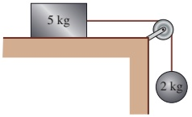

 $$ \mu=\frac{1}{4} $$ 

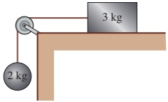

(iii)  $ \mu = 0.3 $

 $$ \mu=\frac{1}{4} $$ 

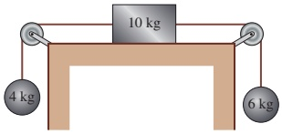

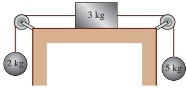

<!-- page 165 -->

## M

3 The brakes on a caravan of mass 700kg have seized so that the wheels will not turn. What force must be exerted on the caravan to make it move horizontally? (The coefficient of friction between the tyres and the road is 0.7.)

4 A boy slides a piece of ice of mass 100g across the surface of a frozen lake. Its initial speed is  $ 10 \, m \, s^{-1} $ and it takes 49m to come to rest.

(i) Find the deceleration of the piece of ice.

(iii) Find the coefficient of friction between the piece of ice and the surface of the lake.

(ii) Find the frictional force acting on the piece of ice.

(iv) How far will a 200g piece of ice travel if it, too, is given an initial speed of 10 ms^{-1}?

5 Jasmine is cycling at 12ms $ ^{-1} $ when her bag falls off the back of her cycle. The bag slides a distance of 9m before coming to rest. Calculate the coefficient of friction between the bag and the road.

6 A box of mass 50kg is being moved across a room. To help it to slide a suitable mat is placed underneath the box.

(i) Explain why the mat makes it easier to slide the box.

A force of 100N is needed to slide the mat at a constant velocity.

(ii) What is the value of the coefficient of friction between the mat and the floor?

A child of mass 20 kg climbs onto the box.

(iii) What force is now needed to slide the mat at constant velocity?

7 A car of mass 1200kg is travelling at  $ 30\,m\,s^{-1} $ when it is forced to perform an emergency stop. Its wheels lock as soon as the brakes are applied so that they slide along the road without rotating. For the first 40m the coefficient of friction between the wheels and the road is 0.75 but then the road surface changes and the coefficient of friction becomes 0.8.

(i) Find the deceleration of the car immediately after the brakes are applied.

(ii) Find the speed of the car when it comes to the change of road surface.

(iii) Find the total distance the car travels before it comes to rest.

8 Shona, whose mass is 30kg, is sitting on a sledge of mass 10kg which is being pulled at constant speed along horizontal ground by her older brother, Aloke. The coefficient of friction between the sledge and the snow-covered ground is 0.15. Find the tension in the rope from Aloke's hand to the sledge when

(i) the rope is horizontal

(ii) the rope makes an angle of  $ 30^{\circ} $ with the horizontal.

<!-- page 166 -->

9 In each of the following situations a brick is about to slide down a rough inclined plane. Find the unknown quantity.

(i) The plane is inclined at  $ 30^{\circ} $ to the horizontal and the brick has mass 2kg: find  $ \mu $.

(ii) The brick has mass 4kg and the coefficient of friction is 0.7: find the angle of the slope.

(iii) The plane is at  $ 65^{\circ} $ to the horizontal and the brick has mass 5kg: find  $ \mu $.

(iv) The brick has mass 6kg and  $ \mu $ is 1.2: find the angle of slope.

10 The diagram shows a boy on a playground slide. The coefficient of friction between a typically clothed child and the slide is 0.25. It is assumed that no speed is lost when changing direction at B. The section AB is 3m long and makes an angle of  $ 40^{\circ} $ with the horizontal. The slide is designed so that a child, starting from rest, stops at just the right moment of arrival at C.

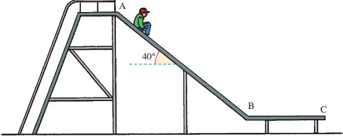

(i) Draw a diagram showing the forces acting on the boy when on the sloping section AB.

(ii) Calculate the acceleration of the boy when on the section AB.

(iii) Calculate the speed on reaching B.

(iv) Find the length of the horizontal section BC.

11 A chute at a water sports centre has been designed so that swimmers first slide down a steep part which is 10m long and at an angle of  $ 40^{\circ} $ to the horizontal. They then come to a 20m section with a gentler slope,  $ 11^{\circ} $ to the horizontal, where they travel at constant speed.

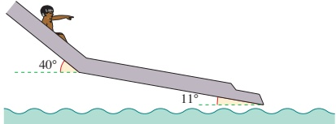

(i) Find the coefficient of friction between a swimmer and the chute.

(ii) Find the acceleration of a swimmer on the steep part.

(iii) Find the speed at the end of the chute of a swimmer who starts at rest.

(Assume that no speed is lost at the point where the slope changes.) An alternative design of chute has the same starting and finishing points but has a constant gradient.

(iv) With what speed do swimmers arrive at the end of this chute?

<!-- page 167 -->

PS

12 A box of weight 100N is pulled at steady speed across a rough horizontal surface by a rope which makes an angle  $ \alpha $ with the horizontal. The coefficient of friction between the box and the surface is 0.4. Assume that the box slides on its underside and does not tip up.

(i) Find the tension in the string when the value of  $ \alpha $ is

(a)  $ 10^{\circ} $

(b)  $ 20^{\circ} $

(c)  $ 30^{\circ} $

(ii) Find an expression for the value of T for any angle  $ \alpha $.

(iii) For what value of  $ \alpha $ is T a minimum?

13 A block of mass 2kg is at rest on a horizontal floor. The coefficient of friction between the block and the floor is  $ \mu $. A force of magnitude 12N acts on the block at an angle  $ \alpha $ to the horizontal, where  $ \tan\alpha=\frac{3}{4} $. When the applied force acts downwards, as on the left, the block remains at rest.

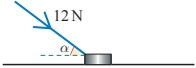

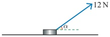

(i) Show that  $ \mu \geqslant \frac{6}{17} $.

When the applied force acts upwards, as in the figure on the right, the block slides along the floor.

(ii) Find another inequality for  $ \mu $.

Cambridge International AS & A Level Mathematics

9709 Paper 41 Q5 November 2011

14 A small block B of mass 0.25 kg is attached to the midpoint of a light inextensible string. Particles P and Q, of masses 0.2 kg and 0.3 kg respectively, are attached to the ends of the string. The string passes over two smooth pulleys fixed at opposite sides of a rough table, with B resting in limiting equilibrium on the table between the pulleys and particles P and Q and block B are in the same vertical plane (see diagram).

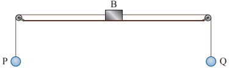

(i) Find the coefficient of friction between B and the table.

Q is now removed so that P and B begin to move.

(ii) Find the acceleration of P and the tension in the part PB of the string.

Cambridge International AS & A Level Mathematics

9709 Paper 41 Q5 November 2014

<!-- page 168 -->

15 Blocks P and Q, of mass mkg and 5kg respectively, are attached to the ends of a light inextensible string. The string passes over a small smooth pulley which is fixed at the top of a rough plane inclined at  $ 35^{\circ} $ to the horizontal. Block P is at rest on the plane and block Q hangs vertically below the pulley (see diagram). The coefficient of friction between block P and the plane is 0.2. Find the set of values of m for which the two blocks remain at rest.

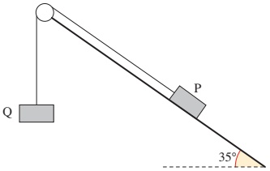

Cambridge International AS & A Level Mathematics

9709 Paper 41 Q4 November 2015

16 A block of weight 7.5 N is at rest on a plane which is inclined to the horizontal at angle  $ \alpha $, where  $ \tan\alpha = \frac{7}{24} $. The coefficient of friction between the block and the plane is  $ \mu $. A force of magnitude 7.2 N acting parallel to a line of greatest slope is applied to the block. When the force acts up the plane (see Fig. 1) the block remains at rest.

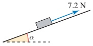

Fig. 1

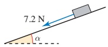

Fig. 2

(i) Show that  $ \mu \geqslant \frac{17}{24} $.

When the force acts down the plane (see Fig. 2) the block slides downwards.

(ii) Show that $\mu < \frac{31}{24}$.

Cambridge International AS & A Level Mathematics

9709 Paper 41 Q3 November 2014

17 A small box of mass 5kg is pulled at a constant speed of  $ 2.5 \, m \, s^{-1} $ down a line of greatest slope of a rough plane inclined at  $ 10^{\circ} $ to the horizontal. The pulling force has magnitude 20N and acts downwards parallel to a line of greatest slope of the plane.

(i) Find the coefficient of friction between the box and the plane.

The pulling force is removed while the box is moving at  $ 2.5 \, m \, s^{-1} $.

(ii) Find the distance moved by the box after the instant at which the pulling force is removed.

<!-- page 169 -->

18 A block of mass 8kg is at rest on a plane inclined at  $ 20^{\circ} $ to the horizontal. The block is connected to a vertical wall at the top of the plane by a string. The string is taut and parallel to a line of greatest slope of the plane (see diagram).

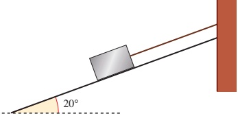

(i) Given that the tension in the string is 13N, find the frictional and normal components of the force exerted on the block by the plane. The string is cut; the block remains at rest, but is on the point of slipping down the plane.

(ii) Find the coefficient of friction between the block and the plane.

Cambridge International AS & A Level Mathematics

9709 Paper 4 Q4 June 2009

19 A stone slab of mass 320kg rests in equilibrium on rough horizontal ground. A force of magnitude XN acts upwards on the slab at an angle of $\theta$ to the vertical, where $\tan\theta = \frac{7}{24}$ (see diagram).

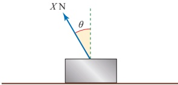

(i) Find, in terms of X, the normal component of the force exerted on the slab by the ground.

(ii) Given that the coefficient of friction between the slab and the ground is  $ \frac{3}{8} $, find the value of X for which the slab is about to slip. Cambridge International AS & A Level Mathematics

Cambridge International AS & A Level Mathematics

9709 Paper 4 Q4 November 2005

20 A block of mass 20 kg is at rest on a plane inclined at  $ 10^{\circ} $ to the horizontal. A force acts on the block parallel to a line of greatest slope of the plane. The coefficient of friction between the block and the plane is 0.32. Find the least magnitude of the force necessary to move the block

(i) given that the force acts up the plane

(ii) given instead that the force acts down the plane.

Cambridge International AS & A Level Mathematics

9709 Paper 4 Q2 November 2008

<!-- page 170 -->

21 A rough inclined plane of length 65 cm is fixed with one end at a height of 16 cm above the other end. Particles P and Q, of masses 0.13 kg and 0.11 kg respectively, are attached to the ends of a light inextensible string which passes over a small smooth pulley at the top of the plane. Particle P is held at rest on the plane and particle Q hangs vertically below the pulley (see diagram). The system is released from rest and P starts to move up the plane.

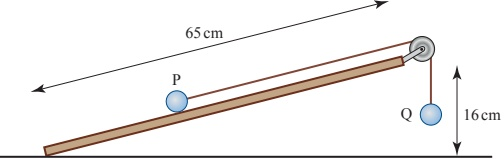

(i) Draw a diagram showing the forces acting on P during its motion up the plane.

(ii) Show that T - F > 0.32, where TN is the tension in the string and FN is the magnitude of the frictional force on P.

The coefficient of friction between P and the plane is 0.6.

(iii) Find the acceleration of P.

Cambridge International AS & A Level Mathematics

9709 Paper 4 Q7 November 2007

22 A particle P of mass 0.6kg moves upwards along a line of greatest slope of a plane inclined at  $ 18^{\circ} $ to the horizontal. The deceleration of P is  $ 4ms^{-2} $.

(i) Find the frictional and normal components of the force exerted on P by the plane. Hence find the coefficient of friction between P and the plane, correct to 2 significant figures.

After P comes to instantaneous rest it starts to move down the plane with acceleration  $ a \, m s^{-2} $.

(ii) Find the value of $a$.

Cambridge International AS & A Level Mathematics

9709 Paper 41 Q5 November 2009

23 A small ring of mass 0.8kg is threaded on a rough rod which is fixed horizontally. The ring is in equilibrium, acted on by a force of magnitude 7N pulling upwards at  $ 45^{\circ} $ to the horizontal (see diagram).

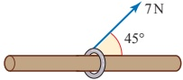

(i) Show that the normal component of the contact force acting on the ring has magnitude 3.05 N, correct to 3 significant figures.

(ii) The ring is in limiting equilibrium. Find the coefficient of friction between the ring and the rod.

<!-- page 171 -->

## The sliding ruler

Hold a metre ruler horizontally across your two index fingers and slide your fingers smoothly together, fairly slowly, as in Figure 8.9. What happens?

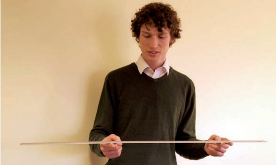

Use the laws of friction to investigate what you observe.

## Optimum angle

### Figure 8.9

A packing case is pulled across rough ground by means of a rope making an angle  $ \theta $ with the horizontal. Investigate how the tension can be minimised by varying the angle between the rope and the horizontal.

## KEY POINTS

## Coulomb's laws

1 The frictional force, F, between two surfaces is given by

 $ F < \mu R $ when there is no sliding except in limiting equilibrium

 $ F = \mu R $ in limiting equilibrium

 $ F = \mu R $ when sliding occurs

where R is the normal reaction of one surface on the other and  $ \mu $ is the coefficient of friction between the surfaces.

3 Remember that the value of the normal reaction is affected by

2 The frictional force always acts in the direction to oppose sliding.

- a force which has a component perpendicular to the direction of sliding

the angle of inclination of the surface.

<!-- page 172 -->

## LEARNING OUTCOMES

Now that you have finished this chapter, you should be able to

understand that the total contact force between surfaces may be expressed in terms of a frictional force and a normal reaction

draw a force diagram to represent a situation involving friction

understand that a frictional force may be modelled by  $ F \leq \mu R $

know that a frictional force acts in the direction to oppose sliding

model friction using  $ F = \mu R $ when sliding occurs

know how to apply Newton's laws of motion to situations involving friction

derive and use the result that a body on a rough slope inclined at angle  $ \alpha $ to the horizontal is on the point of slipping if  $ \mu = \tan \alpha $.

