# 9 Energy, work and power

<!-- Cambridge International AS  A Level Mathematics Mechanics (Sophie Goldie) .pdf p173-204 -->

<!-- page 173 -->

## 9 

## Energy, work and power

I like work: it fascinates me. I can sit and look at it for hours. Jerome K. Jerome (1859–1927)

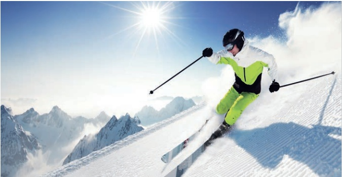

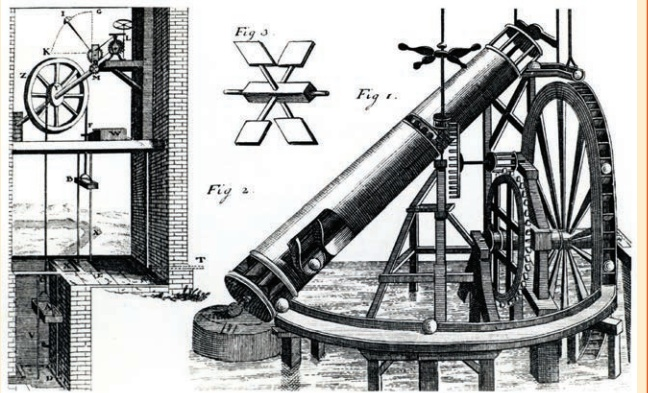

### Figure 9.1

Figure 9.1 is a picture of a perpetual motion machine. What does this term mean and will this one work?

<!-- page 174 -->

### 9.1 Energy and momentum

When describing the motion of objects in everyday language the words energy and momentum are often used quite loosely and sometimes no distinction is made between them. In mechanics they must be defined precisely.

For an object of mass m moving with velocity v and speed v:

kinetic energy =  $ \frac{1}{2}mv^{2} $ (this is the energy it has due to its motion)

» momentum = m∨

Notice that kinetic energy is a scalar quantity with magnitude only, but momentum is a vector in the same direction as the velocity.

Both the kinetic energy and the momentum are liable to change when a force acts on a body and you will learn more about how the energy is changed in this chapter. You will learn about momentum in Chapter 10.

### 9.2 Work and energy

In everyday life you encounter many forms of energy, such as heat, light, electricity and sound. You are familiar with the conversion of one form of energy to another: from chemical energy stored in wood to heat energy when you burn it; from electrical energy to the energy of a train's motion, and so on. The S.I. unit for energy is the joule, J.

## Mechanical energy and work

In mechanics two forms of energy are particularly important.

Kinetic energy is the energy that a body possesses because of its motion.

» The kinetic energy of a moving object =  $ \frac{1}{2} \times mass \times (speed)^2 $.

Potential energy is the energy that a body possesses because of its position. It may be thought of as stored energy that can be converted into kinetic or other forms of energy. You will meet this again on page 168.

The energy of an object is usually changed when it is acted on by a force. When a force is applied to an object that moves in the direction of its line of action, the force is said to do work. For a constant force this is defined as follows.

» The work done by a constant force = force × distance moved in the direction of the force.

In general, work done =  $ Fd\cos\theta $ where  $ \theta $ is the angle between F and d.

The following examples illustrate how to use these ideas.

<!-- page 175 -->

A brick, initially at rest, is raised by a force averaging 40 N to a height 5 m above the ground where it is left stationary (Figure 9.2). How much work is done by the force?

## Solution

The work done by the force raising the brick is

 $$ 40\times5=200J. $$ 

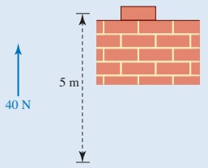

Figure 9.2

Examples 9.2 and 9.3 show how the work done by a force can be related to the change in kinetic energy of an object.

### Example 9.2

A train travelling on level ground is subject to a resisting force (from the brakes and air resistance) of 250 kN for a distance of 5 km. How much kinetic energy does the train lose?

## Solution

The forward force is -250 000N.

Work and energy have the same units.

The work done by it is  $ -250\,000 \times 5000 = -1250\,000\,000 $J.

Hence the train gains  $ -1250000000 $ J of kinetic energy; in other words +1250000000 J of kinetic energy are lost and the train slows down. This energy is converted to other forms such as heat and perhaps a little sound.

### Example 9.3

A car of mass  $ m\,kg $ is travelling at  $ u\,ms^{-1} $ when the driver applies a constant driving force of F N. The ground is level and the road is straight and air resistance can be ignored. The speed of the car increases to  $ \nu\,ms^{-1} $ in a period of  $ t\,s $ over a distance of  $ s\,m $. Find the relationship between F, s, m, u and  $ \nu $.

## Solution

Treating the car as a particle and applying Newton's second law:

 $$ F=m a $$ 

 $$ a=\frac{F}{m} $$

<!-- page 176 -->

Since $F$ is assumed constant, the acceleration is constant also, so using $v^{2}=u^{2}+2as$

 $$ \nu^{2}=u^{2}+\frac{2Fs}{m} $$ 

 $$ \Longrightarrow\quad\scriptstyle\frac{1}{2}m v^{2}=\frac{1}{2}m u^{2}+F s $$ 

 $$ Fs=\frac{1}{2}mv^{2}-\frac{1}{2}mu^{2} $$ 

Thus

» Work done by force = final kinetic energy – initial kinetic energy of car.

## The work-energy principle

Examples 9.4 and 9.5 illustrate the work-energy principle, which states that:

The total work done by the forces acting on a body is equal to the increase in the kinetic energy of the body.

### Example 9.4

A sledge of total mass 30kg, initially moving at  $ 2\,m\,s^{-1} $, is pulled 14m across smooth horizontal ice by a horizontal rope in which there is a constant tension of 45N, as shown in Figure 9.3. Find its final velocity.

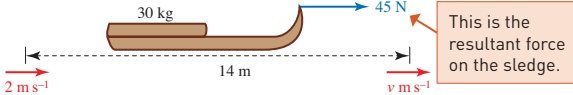

This is the resultant force on the sledge.

### Figure 9.3

## Solution

Since the ice is smooth, the work done by the force is all converted into kinetic energy and the final velocity can be found from

Work done by the force = final kinetic energy – initial kinetic energy

 $$ 45\times14=\frac{1}{2}\times30\times\nu^{2}-\frac{1}{2}\times30\times2^{2} $$ 

So  $ \nu^2 = 46 $ and the final velocity of the sledge is  $ 6.8 \, \text{m} \, \text{s}^{-1} $ (to 2 s.f.).

<!-- page 177 -->

The combined mass of a cyclist and her bicycle is 65kg. She accelerated from rest to  $ 8\,m\,s^{-1} $ in 80m along a horizontal road.

(i) Calculate the work done by the net force in accelerating the cyclist and her bicycle.

(ii) Hence calculate the net forward force (assuming the force to be constant).

## Solution

The situation is shown in Figure 9.4.

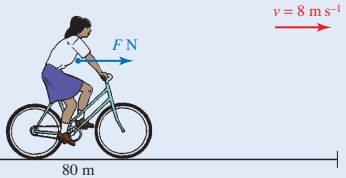

### Figure 9.4

(i) The work done by the net force F is given by

[i] The work done by the net force
work = final K.E. - initial K.E.
=  $ \frac{1}{2}mv^{2} - \frac{1}{2}mu^{2} $
=  $ \frac{1}{2} \times 65 \times 8^{2} - 0 $
= 2080 J
The work done is 2080J.
[ii] Work done = Fs
= F  $ \times $ 80
So \quad 80F = 2080
F = 26
The net forward force is 26 N.

<!-- page 178 -->

## Work

It is important to realise that:

» work is done by a force

» work is only done when there is movement

a force only does work on an object when it has a component in the direction of motion of the object.

It is quite common to speak of the work done by a person, say in pushing a lawn mower. In fact this is the work done by the force of the person on the lawn mower.

Notice that if you stand holding a brick stationary above your head, painful though it may be, the force you are exerting on it is doing no work. Nor is this vertical force doing any work if you walk round the room, keeping the brick at the same height. However, once you start climbing the stairs, a component of the brick's movement is in the direction of the upward force that you are exerting on it, so the force is now doing some work.

When applying the work–energy principle, you have to be careful to include all the forces acting on the body. In the example of a brick of weight 40N being raised 5m vertically, starting and ending at rest, the change in kinetic energy is clearly 0.

This seems paradoxical when it is clear that the force that raised the brick has done  $ 40 \times 5 = 200 $ J of work. However, the brick was subject to another force, namely its weight, which did  $ -40 \times 5 = -200 $ J of work on it, giving a total of  $ 200 + (-200) = 0 $ J.

## Conservation of mechanical energy

The net forward force on the cyclist in Example 9.5 is the girl's driving force minus resistive forces such as air resistance and friction in the bearings. In the absence of such resistive forces, she would gain more kinetic energy; also the work she does against them is lost, dissipated as heat and sound. Contrast this with the work a cyclist does against gravity when going uphill. This work can be recovered as kinetic energy on a downhill run. The work done against the force of gravity is conserved and gives the cyclist potential energy (see page 168).

Forces such as friction, which result in the dissipation of mechanical energy, are called dissipative forces. Forces that conserve mechanical energy are called conservative forces. The force of gravity is a conservative force and so is the tension in an elastic string; you can test this with an elastic band.

<!-- page 179 -->

A bullet of mass 25 g is fired at a wooden barrier 3 cm thick. When it hits the barrier it is travelling at 200 ms $ ^{-1} $. The barrier exerts a constant resistive force of 5000 N on the bullet.

(i) Does the bullet pass through the barrier and if so with what speed does it emerge?

(ii) Is energy conserved in this situation?

## Solution

The situation is shown in Figure 9.5.

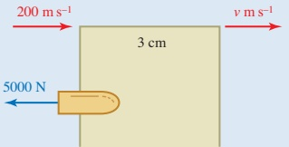

### Figure 9.5

(i) The work done by the force is defined as the product of the force and the distance moved in the direction of the force. Since the bullet is moving in the direction opposite to the net resistive force, the work done by this force is negative.

 $$ \begin{aligned}Work~done&=-5000\times0.03\\&=-150J\end{aligned} $$ 

The initial kinetic energy of the bullet is

 $$ \begin{aligned}Initial\ K.E.&=\frac{1}{2}mu^{2}\\&=\frac{1}{2}\times0.025\times200^{2}\\&=500J\end{aligned} $$ 

A loss in energy of 150J will not reduce kinetic energy to zero, so the bullet will still be moving on exit.

Since the work done is equal to the change in kinetic energy,

 $$ -150=\begin{matrix}\frac{1}{2}\end{matrix}m\nu^{2}-500 $$ 

Solving for  $ \nu $

 $$ \frac{1}{2}m v^{2}=500-150 $$ 

 $$ \nu^{2}=\frac{2\times(500-150)}{0.025} $$ 

 $ \nu = 167 $ (to nearest whole number)

So the bullet emerges from the barrier with a speed of  $ 167 \, m s^{-1} $

(ii) Total energy is conserved but there is a loss of mechanical energy of  $ \frac{1}{2} mu^2 - \frac{1}{2} m v^2 = 150\,\text{J} $. This energy is converted into non-mechanical forms such as heat and sound.

<!-- page 180 -->

An aircraft of mass  $ m\,kg $ is flying at a constant velocity  $ \nu\,m\,s^{-1} $ horizontally. Its engines are providing a horizontal driving force  $ F\,N $.

(i) Draw a diagram showing the driving force, the lift force L N, the air resistance (drag force) R N and the weight of the aircraft.

(ii) State which of these forces are equal in magnitude.

(iii) State which of the forces are doing no work.

(iv) In the case when m = 100000,  $ \nu = 270 $ and F = 350000, find the work done in a 10-second period by those forces which are doing work, and show that the work-energy principle holds in this case.

At a later time the pilot increases the thrust of the aircraft's engines to 400 000 N. When the aircraft has travelled a distance of 30 km, its speed has increased to 300 ms $ ^{-1} $.

(v) Find the work done against air resistance during this period, and the average resistance force.

## Solution

(i) The diagram is shown in Figure 9.6.

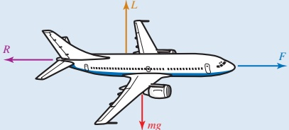

Figure 9.6

(ii) Since the aircraft is travelling at constant velocity it is in equilibrium.

Horizontal forces: F = R

Vertical forces: L = mg

(iii) Since the aircraft's velocity has no vertical component, the vertical forces, L and mg, are doing no work.

(iv) In 10s at 270 ms $ ^{-1} $ the aircraft travels 2700 m.

Work done by force  $ F = 350\,000 \times 2700 = 945\,000\,000\,J $

Work done by force R = 350 000  $ \times $ -2700 = -945 000 000 J

The work-energy principle states that in this situation

Work done by F + work done by R = change in kinetic energy.

<!-- page 181 -->

Now work done by  $ F+ $ work done by  $ R=945\,000\,000-945\,000\,000=0J $, and change in kinetic energy = 0 (since velocity is constant), so the work-energy principle does indeed hold in this case.

 $$ \begin{aligned}\{v\}\quad Final K.E.-initial K.E.&=\frac{1}{2}m\nu^{2}-\frac{1}{2}m u^{2}\\&=\frac{1}{2}\times100000\times300^{2}-\frac{1}{2}\times100000\times270^{2}\\&=855\times10^{6}J\end{aligned} $$ 

Work done by driving force = 400000  $ \times $ 30000 = 12000  $ \times $ 10 $ ^{6} $J

Work done by driving force = increase in K.E. + work done against resistance

 $$ 12\,000\times10^{6}=855\times10^{6}+work~done~against~resistance $$ 

 $$ \mathrm{~W o r k~d o n e~a g a i n s t~r e s i s t a n c e}=11145\times10^{6}\mathrm{J} $$ 

 $$ \Rightarrow\mathrm{~W o r k~d o n e~b y~r e s i s t a n c e}=-11145\times10^{6}\mathrm{J} $$ 

 $$  Average~force\times distance=work~done~by $$ 

 $$ Average~force\times30000=11145\times10^{6} $$ 

 $ \Rightarrow $The average resistance force is 371 500 N (in the negative direction).

## Note

When an aircraft is in flight, most of the work done by the resistance force results in air currents and the generation of heat. A typical large jet cruising at 35 000 feet (10 600 metres) has a body temperature about  $ 30^{\circ} $C above the surrounding air temperature. For supersonic flight the temperature difference is much greater. Concorde used to fly with a skin temperature more than  $ 200^{\circ} $C above that of the surrounding air.

## Exercise 9A

1 Find the kinetic energy of each object.

(i) An ice skater of mass 50kg travelling with speed 10ms^{-1}.

(ii) An elephant of mass 5 tonnes moving at 4ms^{-1}.

(iii) A train of mass 7000 tonnes travelling at 40 m s $ ^{-1} $.

(iv) The moon, mass  $ 7.4 \times 10^{22} $ kg, travelling at  $ 1000 \, \text{ms}^{-1} $ in its orbit round Earth.

(v) A bacterium of mass  $ 2 \times 10^{-16} $ g which has speed 1 mm s $ ^{-1} $.

<!-- page 182 -->

2 Find the work done by a man in these situations.

(i) He pushes a packing case of mass 35 kg a distance of 5 m across a rough floor against a resistance of 200 N. The case starts and finishes at rest.

(ii) He pushes a packing case of mass 35 kg a distance of 5 m across a rough floor against a resistance force of 200 N. The case starts at rest and finishes with a speed of  $ 2 \, m s^{-1} $.

(iii) He pushes a packing case of mass 35kg a distance of 5m across a rough floor against a resistance force of 200 N. Initially the case has speed  $ 2ms^{-1} $ but it ends at rest.

(iv) He is handed a packing case of mass 35 kg. He holds it stationary, at the same height, for 20 s and then someone else takes it from him.

3 A sprinter of mass 60kg is at rest at the beginning of a race and accelerates to 12ms^{-1} in a distance of 30m. Assume air resistance to be negligible.

(i) Calculate the kinetic energy of the sprinter at the end of the 30 m.

(ii) Write down the work done by the sprinter over this distance.

(iii) Calculate the forward force exerted by the sprinter, assuming it to be constant, using work = force × distance.

(iv) Using force = mass × acceleration and the constant acceleration formulae, show that this force is consistent with the sprinter having speed $12\mathrm{~m s}^{-1}$ after 30m.

4 A sports car of mass 1.2 tonnes accelerates from rest to  $ 30\,m\,s^{-1} $ in a distance of 150 m. Assume air resistance to be negligible.

(i) Calculate the work done in accelerating the car. Does your answer depend on an assumption that the driving force is constant?

(ii) If the driving force is in fact constant, what is its magnitude?

5 A car of mass 1600kg is travelling at speed  $ 25 \, m s^{-1} $ when the brakes are applied so that it stops after moving a further 75 m.

(i) Find the work done by the brakes.

(ii) Find the retarding force from the brakes, assuming that it is constant and that other resistive forces may be neglected.

6 The forces acting on a hot air balloon of mass 500kg are its weight and the total uplift force.

(ii) Find the total work done when the speed of the balloon changes from

(a)  $ 2 \, ms^{-1} $ to  $ 5 \, ms^{-1} $

(b)  $ 8\, \text{ms}^{-1} $ to  $ 3\, \text{ms}^{-1} $.

(ii) If the balloon rises 100 m vertically while its speed changes calculate in each case the work done by the uplift force.

<!-- page 183 -->

## PS

7 A bullet of mass 20g, found at the scene of a police investigation, had penetrated 16cm into a wooden post. The speed for that type of bullet is known to be 80ms^{-1}.

(i) Find the kinetic energy of the bullet before it entered the post.

## CP

(ii) What happened to this energy when the bullet entered the wooden post?

(iv) Calculate the resistive force on the bullet, assuming it to be constant.

(iii) Write down the work done in stopping the bullet.

Another bullet of the same mass and shape had clearly been fired from a different and unknown type of gun. This bullet had penetrated 20 cm into the post.

(v) Estimate the speed of this bullet before it hit the post.

8 The UK Highway Code gives the braking distance for a car travelling at  $ 22\, \text{ms}^{-1} $ (50 mph) to be 38 m (125 ft). A car of mass 1300 kg is brought to rest in just this distance. It may be assumed that the only resistance forces come from the car's brakes.

(i) Find the work done by the brakes.

(ii) Find the average force exerted by the brakes.

(iii) What happened to the kinetic energy of the car?

(iv) What happens when you drive a car with the handbrake on?

9 A chest of mass 60kg is resting on a rough horizontal floor. The coefficient of friction between the floor and the chest is 0.4. A woman pushes the chest in such a way that its speed-time graph is as shown below.

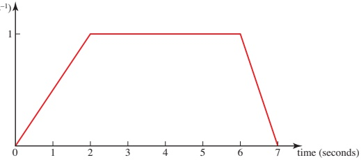

(i) Find the force of frictional resistance acting on the chest when it moves.

(ii) Use the speed-time graph to find the total distance travelled by the chest.

(iii) Find the total work done by the woman.

(iv) Find the acceleration of the chest in the first 2s of its motion and hence the force exerted by the woman during this time, and the work done.

(v) In the same way find the work done by the woman during the time intervals 2s to 6s, and 6s to 7s.

(vi) Show that your answers to parts (iv) and (v) are consistent with your answer to part (iii).

<!-- page 184 -->

## PS

10 A car of mass 1200kg experiences a constant resistance force of 600N. The driving force from the engine depends upon the gear, as shown in the table.

<table border=1 style='margin: auto; word-wrap: break-word;'><tr><td style='text-align: center; word-wrap: break-word;'>Gear</td><td style='text-align: center; word-wrap: break-word;'>1</td><td style='text-align: center; word-wrap: break-word;'>2</td><td style='text-align: center; word-wrap: break-word;'>3</td><td style='text-align: center; word-wrap: break-word;'>4</td></tr><tr><td style='text-align: center; word-wrap: break-word;'>Force (N)</td><td style='text-align: center; word-wrap: break-word;'>2800</td><td style='text-align: center; word-wrap: break-word;'>2100</td><td style='text-align: center; word-wrap: break-word;'>1400</td><td style='text-align: center; word-wrap: break-word;'>1000</td></tr></table>

Starting from rest, the car is driven 20 m in first gear, 40 m in second, 80 m in third and 100 m in fourth. How fast is the car travelling at the end?

### 9.3 Gravitational potential energy

As you have seen, kinetic energy (K.E.) is the energy that an object has because of its motion. Potential energy (P.E.) is the energy an object has because of its position. The units of potential energy are the same as those of kinetic energy or any other form of energy, namely joules.

One form of potential energy is gravitational potential energy. The gravitational potential energy of the object in Figure 9.7 of mass mkg at height hm above a fixed reference level, 0, is mghJ. If it falls to the reference level, the force of gravity does mghJ of work and the body loses mghJ of potential energy.

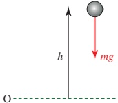

### Figure 9.7

A loss in gravitational potential energy is an alternative way of accounting for the work done by the force of gravity.

If a mass mkg is raised through a distance hm, the gravitational potential energy increases by mghJ. If a mass mkg is lowered through a distance hm the gravitational potential energy decreases by mghJ.

### Example 9.8

Calculate the gravitational potential energy, relative to the ground, of a ball of mass 0.15 kg at a height of 2 m above the ground.

## Solution

Mass m = 0.15, height h = 2.

Gravitational potential energy = mgh

= 0.15  $ \times $ 10  $ \times $ 2

= 3J

<!-- page 185 -->

## Note

If the ball falls:

Loss in P.E. = work done by gravity

     = gain in K.E.

There is no change in the total energy  $ (P.E. + K.E.) $ of the ball.

## Using conservation of mechanical energy

When gravity is the only force that does work on a body, mechanical energy is conserved. When this is the case, many problems are easily solved using energy. This is possible even when the acceleration is not constant and also when a particle moves on a curve when constant acceleration does not apply.

### Example 9.9

A skier slides down a smooth ski slope 400m long, which is at an angle of  $ 30^{\circ} $ to the horizontal.

(i) Find the speed of the skier when he reaches the bottom of the slope.

At the foot of the slope the ground becomes horizontal and is made rough in order to help him to stop. The coefficient of friction between his skis and the ground is  $ \frac{1}{4} $.

(ii) Find how far the skier travels before coming to rest.

(iii) In what way is your model unrealistic?

## Solution

The skier is modelled as a particle (Figure 9.8).

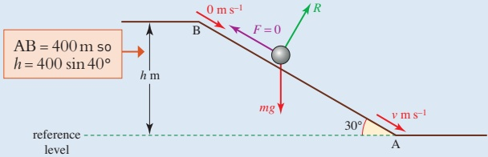

### Figure 9.8

(i) Since in this case the slope is smooth, the frictional force is zero. The skier is subject to two external forces: his weight mg and the normal reaction from the slope.

The normal reaction between the skier and the slope does no work because the skier does not move in the direction of this force. The only force that does work is gravity, so mechanical energy is conserved.

<!-- page 186 -->

Notice that the

mass of the

skier cancels

out. Using

this model, all

skiers should

arrive at the

bottom of the

slope with the

same speed.

Also, the slope

could be curved

provided that

the total height

lost is the

same.

Total mechanical energy at B = mgh +  $ \frac{1}{2}mu^{2} $

= m × 10 × 400sin30° + 0

= 2000mJ

Total mechanical energy at A = (0 +  $ \frac{1}{2} $  $ mv^2 $) J

Since mechanical energy is conserved.

 $$ \begin{array}{r}{\frac{1}{2}m\nu^{2}=2000m}\\ {\nu^{2}=4000}\\ {\nu=63.2...}\end{array} $$ 

The skier's speed at the bottom of the slope is  $ 63.2 \, m s^{-1} $ (to 3 s.f.).

(ii) For the horizontal part there is some friction. Suppose that the skier travels a further distance s m before stopping (Figure 9.9).

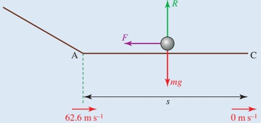

### Figure 9.9

Coulomb's law of friction gives  $ F = \mu R = \frac{1}{4} R $.

Since there is no vertical acceleration you can also say R = mg.

So

 $$ F=\frac{1}{4}m g. $$ 

Work done by the friction force =  $ F \times (-s) = -\frac{1}{4} mgs $.

Negative because the motion is in the opposite direction to the force.

The increase in kinetic energy between A and C =  $ (0 - \frac{1}{2}mv^{2}) $ J.

Using the work-energy principle

 $$ -\tfrac14m g s~=-\tfrac12m v^{2}=-2000m\textup{f r o m} $$ 

Solving for $s$ gives $s = 800$.

So the distance the skier travels before stopping is 800 m.

(iii) The assumptions made in solving this problem are that friction on the slope and air resistance are negligible, and that the slope ends in a smooth curve at A. Clearly the speed of  $ 63.2 \, \text{m} \, \text{s}^{-1} $ is very high, so the assumption that friction and air resistance are negligible must be suspect.

<!-- page 187 -->

Ama, whose mass is 40kg, is taking part in an assault course. The obstacle shown in Figure 9.10 is a river at the bottom of a ravine 8m wide which she has to cross by swinging on a rope 5m long secured to a point on the branch of a tree, immediately above the centre of the ravine.

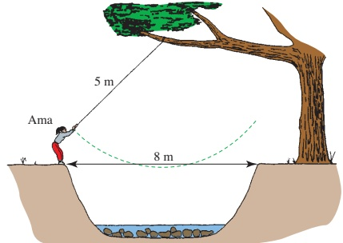

### Figure 9.10

(i) Find how fast Ama is travelling at the lowest point of her crossing

(a) if she starts from rest

(b) if she launches herself off at a speed of  $ 1 \, m s^{-1} $.

(ii) Will her speed be  $ 1 \, m s^{-1} $ faster throughout her crossing?

## Solution

(i) (a) The vertical height Ama loses is HB in Figure 9.11.

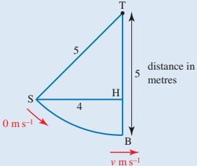

Figure 9.11

Using Pythagoras' theorem

 $$ \mathrm{TH}=\sqrt{5^{2}-4^{2}}=3 $$ 

 $$ \mathrm{HB}=5-3=2 $$ 

P.E. lost = mgh

= 40g  $ \times $ 2

 $$ \begin{aligned}K.E.gained&=\frac{1}{2}mv^{2}-0\\&=\frac{1}{2}\times40\times\nu^{2}\end{aligned} $$

<!-- page 188 -->

6.403... - 6.324...

= 0.078...

By conservation of energy, K.E. gained = P.E. lost

 $$ \begin{aligned}\frac{1}{2}\times40\times\nu^{2}&=40\times10\times2\\\nu&=6.324...\end{aligned} $$ 

Ama is travelling at 6.32 m s^{-1}.

(b) If she has initial speed  $ 1 \, \text{m} \, \text{s}^{-1} $ at S and speed  $ \nu \, \text{m} \, \text{s}^{-1} $ at B, her initial K.E. is  $ \frac{1}{2} \times 40 \times 1^2 $ and her K.E. at B is  $ \frac{1}{2} \times 40 \times \nu^2 $.

Using conservation of energy,

 $$ \begin{aligned}\frac{1}{2}\times40\times\nu^{2}-\frac{1}{2}\times40\times1^{2}=40\times10\times2\end{aligned} $$ 

 $$ \nu=6.403... $$ 

(ii) Ama's speed at the lowest point is only about 0.08 ms $ ^{-1} $ faster in part (i)(b) compared with that in part (i)(a), so she clearly will not travel 1 ms $ ^{-1} $ faster throughout in part (i)(b).

## Historical note

James Joule was born in Salford in Lancashire on Christmas Eve 1818. He studied at Manchester University at the same time as the famous chemist, Dalton.

Joule spent much of his life conducting experiments to measure the equivalence of heat and mechanical forms of energy to ever-increasing degrees of accuracy. Working with William Thomson, he also discovered that a gas cools when it expands without doing work against external forces. It was this discovery that paved the way for the development of refrigerators.

Joule died in 1889 but his contribution to science is remembered with the S.I. unit for energy named after him.

### 9.4 Work and kinetic energy for two-dimensional motion

Imagine that you are cycling along a level winding road in a strong wind. Suppose that the strength and direction of the wind are constant, but because the road is winding sometimes the wind is directly against you but at other times it is from your side.

How does the work you do in travelling a certain distance – say 1 m – change with your direction?

## Work done by a force at an angle to the direction of motion

You have probably deduced that as a cyclist you would do work against the component of the wind force that is directly against you. The sideways component does not resist your forward progress.

<!-- page 189 -->

Suppose that you are sailing and the angle between the force, $F$, of the wind on your sail and the direction of your motion is $\theta$. In a certain time you travel a distance $d$ in the direction of $F$, see Figure 9.12, but during that time you actually travel a distance $s$ along the line OP.

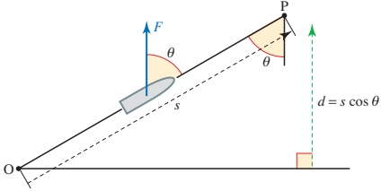

### Figure 9.12

Work done by  $ F = Fd $

Since $d = s \cos \theta$, the work done by the force $F$ is $Fs \cos \theta$. This can also be written as the product of the component of $F$ along OP, $F \cos \theta$, and the distance moved along OP, $s$.

 $$ \boldsymbol{F}\times\boldsymbol{s}\cos\theta=F\cos\theta\times\boldsymbol{s} $$ 

(Notice that the direction of F is not necessarily the same as the direction of the wind, it depends on how you have set your sails.)

### Example 9.11

As a car of mass  $ m \, kg $ drives up a slope at an angle  $ \alpha $ to the horizontal it experiences a constant resistive force  $ F \, N $ and a driving force  $ D \, N $. What can be deduced about the work done by  $ D $ as the car moves a distance  $ d \, m $ uphill if:

(i) the car moves at constant speed

(ii) the car slows down

(iii) the car gains speed?

The initial and final speeds of the car are denoted by  $ u \, \text{m s}^{-1} $ and  $ \nu \, \text{m s}^{-1} $ respectively.

(iv) Write  $ \nu^{2} $ in terms of the other variables.

## Solution

Figure 9.13 shows the forces acting on the car. The table shows the work done by each force. The normal reaction, R, does no work as the car moves no distance in the direction of R.

<!-- page 190 -->

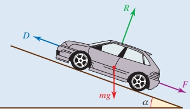

Angle between mg and the slope is  $ 90^{\circ} - \alpha $.

### Figure 9.13

<table border=1 style='margin: auto; word-wrap: break-word;'><tr><td style='text-align: center; word-wrap: break-word;'>Force</td><td style='text-align: center; word-wrap: break-word;'>Work done</td></tr><tr><td style='text-align: center; word-wrap: break-word;'>Resistance F</td><td style='text-align: center; word-wrap: break-word;'>$ -Fd $</td></tr><tr><td style='text-align: center; word-wrap: break-word;'>Normal reaction R</td><td style='text-align: center; word-wrap: break-word;'>0</td></tr><tr><td style='text-align: center; word-wrap: break-word;'>Force of gravity mg</td><td style='text-align: center; word-wrap: break-word;'>$ -mgd \cos (90^\circ - \alpha) = -mgd \sin \alpha $</td></tr><tr><td style='text-align: center; word-wrap: break-word;'>Driving force D</td><td style='text-align: center; word-wrap: break-word;'>Dd</td></tr><tr><td style='text-align: center; word-wrap: break-word;'>Total work done</td><td style='text-align: center; word-wrap: break-word;'>$ Dd - Fd - mgd \sin \alpha $</td></tr></table>

(i) If the car moves at a constant speed there is no change in kinetic energy so the total work done is zero, giving

Work done by D is

 $$ D d=F d+m g d\sin\alpha. $$ 

(ii) If the car slows down the total work done by the forces is negative, hence

Work done by D is

 $$ D d<F d+m g d\sin\alpha. $$ 

(iii) If the car gains speed the total work done by the forces is positive so Work done by D is

 $$ D d>F d+m g d\sin\alpha. $$ 

(iv) Total work done = final K.E. - initial K.E.

 $$ Dd-Fd-mgd\sin\alpha=\frac{1}{2}mv^{2}-\frac{1}{2}mu^{2} $$ 

Multiplying by  $ \frac{2}{m} $

 $$ \nu^{2}=u^{2}+\frac{2d}{m}(D-F)-2g d\sin\alpha $$

<!-- page 191 -->

1 Calculate the gravitational potential energy, relative to the reference level OA, for each of the objects shown.

(ii)

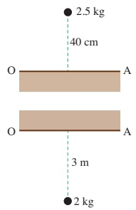

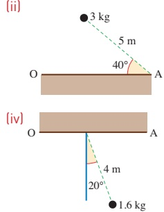

2 Calculate the change in gravitational potential energy when each object moves from A to B in the situations shown below. State whether the change is an increase or a decrease.

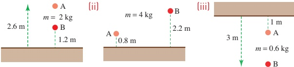

3 A vase of mass 1.2kg is lifted from ground level and placed on a shelf at a height of 1.5m. Find the work done against the force of gravity.

4 Find the increase in gravitational potential energy of a woman of mass 60kg who climbs to the twelfth floor of a block of flats. The distance between floors is 3.3m.

5 A car of mass 0.9 tonnes is driven 200m up a slope inclined at  $ 5^{\circ} $ to the horizontal. There is a resistance force of 100N.

(i) Find the work done by the car against gravity.

(ii) Find the work done against the resistance force.

(iii) When asked to work out the total work done by the car, a student replied  $ (900g + 100) \times 200J $. Explain the error in this answer.

(iv) If the car slows down from  $ 12 \, \text{ms}^{-1} $ to  $ 8 \, \text{ms}^{-1} $, what is the total work done by the engine?

6 A sledge of mass 10kg is being pulled across level ground by a rope which makes an angle of  $ 20^{\circ} $ with the horizontal. The tension in the rope is 80N and there is a resistance force of 14N.

(i) Find the work done while the sledge moves a distance of 20 m by

(a) the tension in the rope (b) the resistance force.

(ii) Find the speed of the sledge after it has moved 20 m

(a) if it starts at rest (b) if it starts at  $ 4\mathrm{~m s}^{-1} $

<!-- page 192 -->

## CP

7 A bricklayer carries a hod of bricks of mass 25kg up a ladder of length 10m inclined at an angle of  $ 60^{\circ} $ to the horizontal.

## M

(ii) Calculate the increase in the gravitational potential energy of the bricks.

(ii) If instead he had raised the bricks vertically to the same height, using a rope and pulleys, would the increase in potential energy be (a) less, (b) the same or (c) more than in part (i)?

8 A girl of mass 45 kg slides down a smooth water chute of length 6 m inclined at an angle of  $ 40^{\circ} $ to the horizontal.

(i) Find

(a) the decrease in her potential energy

(b) her speed at the bottom.

(ii) How are answers to part (i) affected if the slide is not smooth?

9 A gymnast of mass 50kg swings on a rope of length 10m. Initially the rope makes an angle of  $ 50^{\circ} $ with the vertical.

(i) Find the decrease in her potential energy when the rope has reached the vertical.

(iii) The gymnast continues to swing. What angle will the rope make with the vertical when she is next temporarily at rest?

(ii) Find her kinetic energy and hence her speed when the rope is vertical, assuming that air resistance may be neglected.

(iv) Explain why the tension in the rope does no work.

10 A stone of mass 0.2kg is dropped from the top of a building 80m high. After t s it has fallen a distance x m and has speed  $ \nu \, \text{m s}^{-1} $.

(i) What is the gravitational potential energy of the stone relative to ground level when it is at the top of the building?

(ii) What is the potential energy of the stone t s later?

(iii) Show that, for certain values of $t$, $\nu^{2}=20x$ and state the range of values of $t$ for which it is true.

(iv) Find the speed of the stone when it is half-way to the ground.

(v) At what height will the stone have half its final speed?

11 Wesley, whose mass is 70 kg, inadvertently steps off a bridge 50 m above water. When he hits the water, Wesley is travelling at 25 m s $ ^{-1} $.

(ii) Calculate the potential energy Wesley has lost and the kinetic energy he has gained.

(ii) Find the size of the resistance force acting on Wesley while he is in the air, assuming it to be constant.

Wesley descends to a depth of 5 m below the water surface, then returns to the surface.

(iii) Find the total upthrust (assumed constant) acting on him while he is moving downwards in the water.

<!-- page 193 -->

12 A hockey ball of mass 0.15 kg is hit from the centre of a pitch. Its position vector (in m), t s later is modelled by

 $$ \begin{pmatrix}x\\ \gamma\end{pmatrix}=\begin{pmatrix}10t\\ 10t-4.9t^{2}\end{pmatrix} $$ 

where the directions are along the line of the pitch and vertically upwards.

(i) What value of $g$ is used in this model?

(ii) Find an expression for the gravitational potential energy of the ball at time t. For what values of t is your answer valid?

(iii) What is the maximum height of the ball? What is its velocity at that instant?

(v) Show that according to this model mechanical energy is conserved and state what modelling assumption is implied by this. Is it reasonable in this context?

(iv) Find the initial velocity, speed and kinetic energy of the ball.

13 A ski-run starts at altitude 2471 m and ends at 1863 m.

(i) If all resistance forces could be ignored, what would the speed of a skier be at the end of the run?

A particular skier of mass 70kg actually attains a speed of 42ms^{-1}. The length of the run is 3.1km.

(ii) Find the average force of resistance acting on the skier.

Two skiers are equally skilful.

(iii) Which would you expect to be travelling faster by the end of the run, the heavier or the lighter?

14 Akosua draws water from a well 12m below the ground. Her bucket holds 5kg of water and by the time she has pulled it to the top of the well it is travelling at 1.2ms $ ^{-1} $.

(i) How much work does Akosua do in drawing the bucket of water?

On an average day 150 people in the village each draw six such buckets of water. One day a new electric pump is installed that takes water from the well and fills an overhead tank 5 m above ground level every morning. The flow rate through the pump is such that the water has speed  $ 2 \, m \, s^{-1} $ on arriving in the tank.

(ii) Assuming that the villagers' demand for water remains unaltered, how much work does the pump do in one day?

It takes the pump one hour to fill the tank each morning.

(iii) At what rate does the pump do work, in joules per second (watts)?

<!-- page 194 -->

15 A block of mass 50kg is pulled up a straight hill and passes through points A and B with speeds  $ 7\,m\,s^{-1} $ and  $ 3\,m\,s^{-1} $ respectively. The distance AB is 200 m and B is 15 m higher than A. For the motion of the block from A to B, find

(i) the loss in kinetic energy of the block,

(ii) the gain in potential energy of the block.

The resistance to motion of the block has magnitude 7.5 N.

(iii) Find the work done by the pulling force acting on the block.

The pulling force acting on the block has constant magnitude 45 N and acts at an angle  $ \alpha^{\circ} $ upwards from the hill.

(iv) Find the value of  $ \alpha $.

Cambridge International AS & A Level Mathematics

9709 Paper 4 Q6 June 2006

16 A lorry of mass 12500kg travels along a road that has a straight horizontal section AB and a straight inclined section BC. The length of BC is 500m. The speeds of the lorry at A, B and C are 17ms^{-1}, 25ms^{-1} and 17ms^{-1} respectively (see diagram).

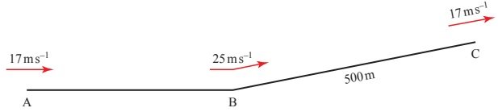

(i) The work done against the resistance to motion of the lorry, as it travels from A to B, is 5000 kJ. Find the work done by the driving force as the lorry travels from A to B.

(ii) As the lorry travels from B to C, the resistance to motion is 4800N and the work done by the driving force is 3300kJ. Find the height of C above the level of AB.

Cambridge International AS & A Level Mathematics

9709 Paper 4 Q5 June 2007

17 A car of mass 1250kg travels from the bottom to the top of a straight hill of length 600 m, which is inclined at an angle of  $ 2.5^\circ $ to the horizontal. The resistance to motion of the car is constant and equal to 400N. The work done by the driving force is 450kJ. The speed of the car at the bottom of the hill is  $ 30m s^{-1} $. Find the speed of the car at the top of the hill.

<!-- page 195 -->

18 The diagram shows the vertical cross-section of a surface. A and B are two points on the cross-section, and A is 5m higher than B. A particle of mass 0.35kg passes through A with speed 7ms^{-1}, moving on the surface towards B.

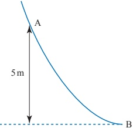

(i) Assuming that there is no resistance to motion, find the speed with which the particle reaches B.

(ii) Assuming instead that there is a resistance to motion, and that the particle reaches B with speed 11 m s $ ^{-1} $, find the work done against this resistance as the particle moves from A to B.

Cambridge International AS & A Level Mathematics

9709 Paper 4 Q4 November 2007

19 A load of mass 160kg is lifted vertically by a crane, with constant acceleration. The load starts from rest at the point O. After 7s, it passes through the point A with speed  $ 0.5\, \text{m s}^{-1} $. By considering energy, find the work done by the crane in moving the load from O to A.

Cambridge International AS & A Level Mathematics

9709 Paper 4 Q4 November 2008

### 9.5 Power

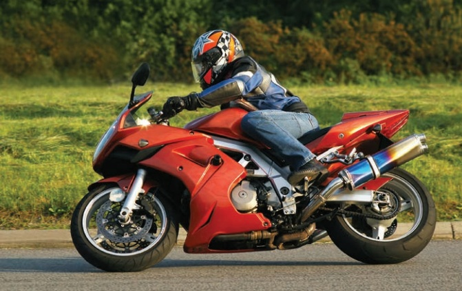

Figure 9.14

<!-- page 196 -->

It is claimed that a motorcycle engine can develop a maximum power of 26.5 kW at a top speed of 165 km h $ ^{-1} $. This suggests that power is related to speed and this is indeed the case.

Power is the rate at which work is being done. A powerful car does work at a greater rate than a less powerful one.

You might find it helpful to think in terms of a force,  $ F $, acting for a very short time  $ t $ over a small distance  $ s $. Assume  $ F $ to be constant over this short time.

Power is the rate of working so

 $$ \begin{array}{l} power~=~\frac{work~done}{time~taken}\\  ~=~\frac{Fs}{t}\\  ~=~F\nu\end{array} $$ 

This gives you the power at an instant of time. The result is true whether or not F is constant.

The power of a vehicle moving at speed  $ \nu $ under a driving force  $ F $ is given by  $ F\nu $.

For a motor vehicle the power is produced by the engine, whereas for a bicycle it is produced by the cyclist. They both make the wheels turn, and the friction between the rotating wheels and the ground produces a forward force on the machine.

The unit of power is the watt (W), named after James Watt. The power produced by a force of 1 N acting on an object that is moving at  $ 1 \, \text{ms}^{-1} $ is 1W. Because the watt is such a small unit you will probably use kilowatts more often ( $ 1 \, \text{kW} = 1000 \, \text{W} $).

### Example 9.12

A car of mass 1000kg can produce a maximum power of 45 kW. Its driver wishes to overtake another vehicle. Ignoring air resistance, find the maximum acceleration of the car when it is travelling at

 $$ (\mathrm{i}) \quad 12\mathrm{m s}^{-1} \quad (\mathrm{ii}) \quad 28\mathrm{m s}^{-1} $$ 

(these are about 43kmh $ ^{-1} $ and 101kmh $ ^{-1} $).

## Solution

(ii) Power = force × velocity
The driving force at 12 ms^{-1} is  $ F_{1} $ N where
 $ \Rightarrow $  $ F_{1}=3750 $
By Newton's second law  $ F = ma $
 $ \Rightarrow $ acceleration =  $ \frac{3750}{1000} $ = 3.75 ms^{-2}
(iii) Now the driving force  $ F_{2} $ is given by
 $ \Rightarrow $  $ 45000 = F_{2} \times 28 $
 $ \Rightarrow $  $ F_{2} = 1607.2 $
 $ \Rightarrow $ acceleration =  $ \frac{1607.2}{1000} $ = 1.61 ms^{-2}
This example shows why it is easier to overtake a slow moving vehicle.

<!-- page 197 -->

A car of mass 900kg produces power 45kW when moving at a constant speed. It experiences a resistance of 1700N.

(i) What is its speed?

(ii) The car comes to a downhill stretch inclined at  $ 2^{\circ} $ to the horizontal. What is its maximum speed downhill if the power and resistance remain unchanged?

## Solution

(i) As the car is travelling at a constant speed, there is no resultant force on the car. In this case the forward force of the engine must have the same magnitude as the resistance forces, i.e. 1700 N.

Denoting the speed of the car by  $ \nu \, \mathrm{m} \, \mathrm{s}^{-1} $,  $ P = F\nu $ gives

 $$ \nu=\frac{P}{F} $$ 

 $$ =\frac{45000}{1700} $$ 

 $$ =26.5(to3s.f.) $$ 

The speed of the car is 26.5 m s $ ^{-1} $ (approximately 95 km h $ ^{-1} $).

(ii) Figure 9.15 shows the forces acting.

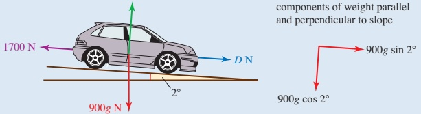

### Figure 9.15

At maximum speed there is no acceleration so the resultant force down the slope is zero.

When the driving force is D N

 $$ D+900g\sin2^{\circ}-1700=0 $$ 

 $$ \implies $$ 

 $$ D=1385.9\ldots $$ 

But power is  $ D\nu $ so

 $$ 45\ 000=1385.9\ldots\nu $$ 

 $$ \nu=\frac{45000}{1385.9\ldots} $$ 

 $$ \implies $$ 

The maximum speed is 32.5 m s $ ^{-1} $ (to 3 s.f.) (about 117 km h $ ^{-1} $).

<!-- page 198 -->

## Historical note

James Watt was born in 1736 in Greenock in Scotland, the son of a house-and ship-builder. As a boy James was frail and he was taught by his mother rather than going to school. This allowed him to spend time in his father's workshop where he developed practical and inventive skills.

As a young man he manufactured mathematical instruments: quadrants, scales, compasses and so on. One day he was repairing a model steam engine for a friend and noticed that its design was very wasteful of steam. He proposed an alternative arrangement, which was to become standard on later steam engines. This was the first of many engineering inventions which made possible the subsequent industrial revolution. James Watt died in 1819, a well-known and highly respected man. His name lives on as the S.I. unit for power.

## Exercise 9C

1 A builder hoists bricks up to the top of the house he is building. Each brick weighs 3.5 kg and the house is 9 m high. In the course of one hour the builder raises 120 bricks from ground level to the top of the house, where they are unloaded by his assistant.

(i) Find the increase in gravitational potential energy of one brick when it is raised in this way.

(ii) Find the total work done by the builder in one hour of raising bricks.

(iii) Find the average power with which he is working.

2 A weightlifter takes 2 seconds to lift 120kg from the floor to a position 2m above it, where the weight has to be held stationary.

(i) Calculate the work done by the weightlifter.

(ii) Calculate the average power developed by the weightlifter.

## CP

The weightlifter is using the ‘clean and jerk’ technique. This means that in the first stage of the lift he raises the weight 0.8m from the floor in 0.5s. He then holds it stationary for 1s before lifting it up to the final position in another 0.5s.

(iii) Find the average power developed by the weightlifter during each of the stages of the lift.

3 A winch is used to pull a crate of mass 180kg up a rough slope of angle  $ 30^{\circ} $ against a frictional force of 450N. The crate moves at a steady speed,  $ \nu $, of  $ 1.2\,m\,s^{-1} $.

(ii) Calculate the gravitational potential energy given to the crate during 30 s.

(ii) Calculate the work done against friction during this time.

(iii) Calculate the total work done per second by the winch.

The cable from the winch to the crate runs parallel to the slope.

(iv) Calculate the tension, T, in the cable.

(v) What information is given by  $ T \times \nu $?

<!-- page 199 -->

## CP

4 The power output from the engine of a car of mass 1500kg which is travelling along level ground at a constant speed of 33ms^{-1} is 23200W.

(i) Find the total resistance on the car under these conditions.

(ii) You were given one piece of unnecessary information. Which is it?

5 A motorcycle has a maximum power output of 26.5 kW and a top speed of 46 m·s $ ^{-1} $ (about 165 km·h $ ^{-1} $). Find the force exerted by the motorcycle engine when the motorcycle is travelling at top speed.

## M

## CP

6 A crane is raising a load of 500 tonnes at a steady rate of 5 cm s $ ^{-1} $. What power is the engine of the crane producing? (Assume that there are no forces from friction or air resistance.)

7 A cyclist, travelling at a constant speed of  $ 8 \, m s^{-1} $ along a level road, experiences a total resistance of 70 N.

(i) Find the power which the cyclist is producing.

(ii) Find the work done by the cyclist in 5 minutes under these conditions.

8 A mouse of mass 15 g is stationary 2 m below its hole when it sees a cat. It runs to its hole, arriving 1.5 seconds later with a speed of  $ 3 \, m s^{-1} $.

(i) Show that the acceleration of the mouse is not constant.

(ii) Calculate the average power of the mouse.

9 A train consists of a diesel shunter of mass 100 tonnes pulling a truck of mass 25 tonnes along a level track. The engine is working at a rate of 125 kW. The resistance to motion of the truck and shunter is 50 N per tonne.

(i) Calculate the constant speed of the train.

While travelling at this constant speed, the truck becomes uncoupled. The shunter engine continues to produce the same power.

(ii) Find the acceleration of the shunter immediately after this happens.

(iii) Find the greatest speed the shunter can now reach.

10 A supertanker of mass  $ 4 \times 10^8 $ kg is steaming at a constant speed of  $ 8 \, \text{m} \, \text{s}^{-1} $. The resistance force is  $ 2 \times 10^6 \, \text{N} $.

(i) What power are the ship's engines producing?

One of the ship's two engines suddenly fails but the other continues to work at the same rate.

(ii) Find the deceleration of the ship immediately after the failure. The resistance force is directly proportional to the speed of the ship.

(iii) Find the eventual steady speed of the ship under one engine only, assuming that the single engine maintains constant power output.

<!-- page 200 -->

## M

11 A car of mass 850kg has a maximum speed of 50ms $ ^{-1} $ and a maximum power output of 40 kW. The resistance force,  $ R $ N at speed  $ \nu $ m s $ ^{-1} $ is modelled by

 $$ R=k v $$ 

(i) Find the value of k.

(ii) Find the resistance force when the car's speed is  $ 20 \, m \, s^{-1} $.

(iii) Find the power needed to travel at a constant speed of  $ 20 \, m \, s^{-1} $ along a level road.

(iv) Find the maximum acceleration of the car when it is travelling at  $ 20\,m s^{-1} $

(a) along a level road

(b) up a hill at  $ 5^{\circ} $ to the horizontal.

12 A car of mass 1000kg moves along a horizontal straight road, passing through points A and B. The power of its engine is constant and equal to 15000W. The driving force exerted by the engine is 750N at A and 500N at B. Find the speed of the car at A and at B, and hence find the increase in the car's kinetic energy as it moves from A to B.

Cambridge International AS & A Level Mathematics

9709 Paper 41 Q1 November 2009

13 A car of mass 1150kg travels up a straight hill inclined at  $ 1.2^{\circ} $ to the horizontal. The resistance to motion of the car is 975N. Find the acceleration of the car at an instant when it is moving with speed  $ 16\,ms^{-1} $ and the engine is working at a power of 35 kW.

Cambridge International AS & A Level Mathematics

9709 Paper 41 Q1 June 2010

14 A lorry of mass 24000kg is travelling up a hill which is inclined at  $ 3^{\circ} $ to the horizontal. The power developed by the lorry's engine is constant, and there is a constant resistance to motion of 3200N.

(ii) When the speed of the lorry is  $ 25 \, m s^{-1} $, its acceleration is  $ 0.2 \, m s^{-2} $. Find the power developed by the lorry's engine.

(ii) Find the steady speed at which the lorry moves up the hill if the power is 500 kW and the resistance remains 3200 N.

Cambridge International AS & A Level Mathematics

9709 Paper 41 Q3 November 2015

<!-- page 201 -->

15 A load of mass 160kg is pulled vertically upwards, from rest at a fixed point O on the ground, using a winding drum. The load passes through a point A, 20m above O, with a speed of 1.25 ms^{-1} (see diagram).

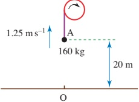

Find, for the motion from O to A,

(i) the gain in the potential energy of the load

(ii) the gain in the kinetic energy of the load.

The power output of the winding drum is constant while the load is in motion.

(iii) Given that the work done against the resistance to motion from O to A is 20kJ and that the time taken for the load to travel from O to A is 41.7s, find the power output of the winding drum.

Cambridge International AS & A Level Mathematics

9709 Paper 41 Q3 June 2012

16 A car of mass 1200kg moves in a straight line along horizontal ground. The resistance to motion of the car is constant and has magnitude 960N. The car's engine works at a rate of 17280W.

(i) Calculate the acceleration of the car at an instant when its speed is  $ 12 \, m s^{-1} $.

The car passes through the points A and B. While the car is moving between A and B it has constant speed  $ V_{ms}^{-1} $.

(ii) Show that V = 18.

At the instant that the car reaches B the engine is switched off and subsequently provides no energy.

The car continues along the straight line until it comes to rest at the point C. The time taken for the car to travel from A to C is 52.5 s.

(iii) Find the distance AC.

Cambridge International AS & A Level Mathematics

9709 Paper 41 Q7 November 2012

<!-- page 202 -->

17 AB and BC are straight roads inclined at  $ 5^{\circ} $ to the horizontal and  $ 1^{\circ} $ to the horizontal respectively.

A and C are at the same horizontal level and B is 45 m above the level of A and C (see diagram, which is not to scale). A car of mass 1200 kg travels from A to C, passing through B.

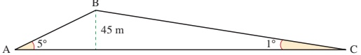

(i) For the motion from A to B, the speed of the car is constant and the work done against the resistance to motion is 360 kJ. Find the work done by the car's engine from A to B.

The resistance to motion is constant throughout the whole journey.

(ii) For the motion from B to C the work done by the driving force is 1660 kJ. Given that the speed of the car at B is 15 ms^{-1}, show that its speed at C is 29.9 ms^{-1}, correct to 3 significant figures.

(iii) The car's driving force immediately after leaving B is 1.5 times the driving force immediately before reaching C. Find, correct to 2 significant figures, the ratio of the power developed by the car's engine immediately after leaving B to the power developed immediately before reaching C.

Cambridge International AS & A Level Mathematics

9709 Paper 41 Q6 November 2011

18 A car of mass 600 kg travels along a straight horizontal road. The resistance to the car's motion is constant and equal to R N.

(i) Find the value of R, given that the car's acceleration is  $ 1.4 \, m s^{-2} $ at an instant when the car's speed is  $ 18 \, m s^{-1} $ and its engine is working at a rate of 22.5 kW.

(ii) Find the rate of working of the car's engine when the car is moving with a constant speed of  $ 15 \, m s^{-1} $.

Cambridge International AS & A Level Mathematics

9709 Paper 42 Q1 June 2014

19 A train of mass 400 000 kg is moving on a straight horizontal track. The power of the engine is constant and equal to 1500 kW and the resistance to the train's motion is 30 000 N. Find

(i) the acceleration of the train when its speed is 37.5 m s $ ^{-1} $,

(ii) the steady speed at which the train can move.

Cambridge International AS & A Level Mathematics

9709 Paper 41 Q4 June 2013

<!-- page 203 -->

20 A lorry of mass 12500kg travels along a road from A to C passing through a point B. The resistance to motion of the lorry is 4800N for the whole journey from A to C.

(ii) The section AB of the road is straight and horizontal. On this section of the road the power of the lorry's engine is constant and equal to 144 kW. The speed of the lorry at A is  $ 16 \, \text{m} \, \text{s}^{-1} $ and its acceleration at B is  $ 0.096 \, \text{m} \, \text{s}^{-2} $. Find the acceleration of the lorry at A and show that its speed at B is  $ 24 \, \text{m} \, \text{s}^{-1} $.

(ii) The section BC of the road has length 500m, is straight and inclined upwards towards C. On this section of the road the lorry's driving force is constant and equal to 5800 N. The speed of the lorry at C is  $ 16 \, m \, s^{-1} $. Find the height of C above the level of AB.

Cambridge International AS & A Level Mathematics

9709 Paper 43 Q6 November 2013

## INVESTIGATION

## Crawler lanes

Sometimes on single carriageway roads or even some highways, crawler lanes are introduced for slow-moving, heavily laden lorries going uphill. Investigate how steep a slope can be before a crawler lane is needed.

Data: Typical power output for a large lorry: 45 kW

Typical mass of a large laden lorry: 32 tonnes

## EXPERIMENT

## Energy losses

Set up a track like the one in Figure 9.16. Release cars or trolleys from different heights and record the heights that they reach on the opposite side. Use your results to formulate a model for the force of resistance acting on them.

Figure 9.16

<!-- page 204 -->

## KEY POINTS

The work done by a constant force F is given by Fs where s is the distance moved in the direction of the force.

2 The kinetic energy (K.E.) of a body of mass m moving with speed  $ \nu $ is given by  $ \frac{1}{2}mv^{2} $. Kinetic energy is the energy a body possesses on account of its motion.

3 The work-energy principle states that the total work done by all the forces acting on a body is equal to the increase in the kinetic energy of the body.

4 The gravitational potential energy of a body mass m at height h above a given reference level is given by mgh. It is the work done against the force of gravity in raising the body.

5 Mechanical energy (K.E. and P.E.) is conserved when no forces other than gravity do work.

6 Power is the rate of doing work, and is given by  $ F\nu $.

Power =  $ \frac{\text{work done}}{\text{time}} $ and so, work done = power  $ \times $ time

7 The S.I. unit for energy is the joule and that for power is the watt.

## LEARNING OUTCOMES

Now that you have finished this chapter, you should be able to

understand the language relating to work, energy and power

calculate the work done by a force which moves either along its line of action or at an angle to it

☑ calculate kinetic energy and gravitational potential energy

understand and use the principle of conservation of energy

understand and use the work-energy principle

understand and use the concept of power

use the relationship between power, force and velocity for a force acting in the direction of motion

solve problems involving work, energy and power.

