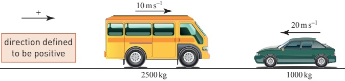
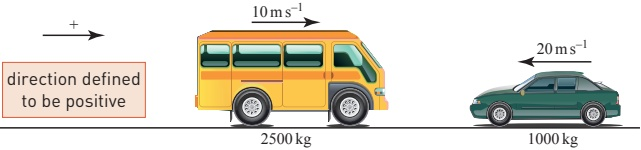
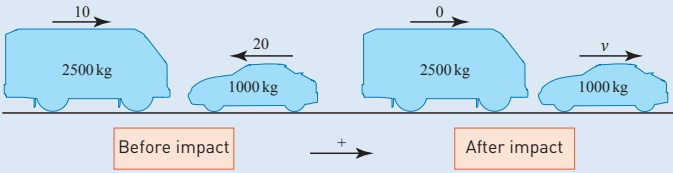
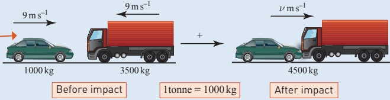
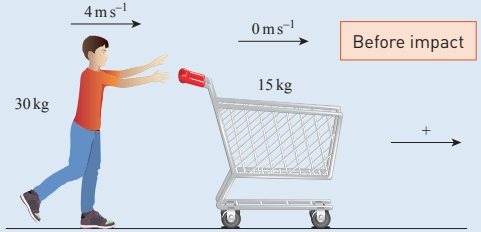
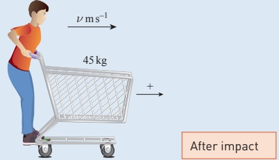
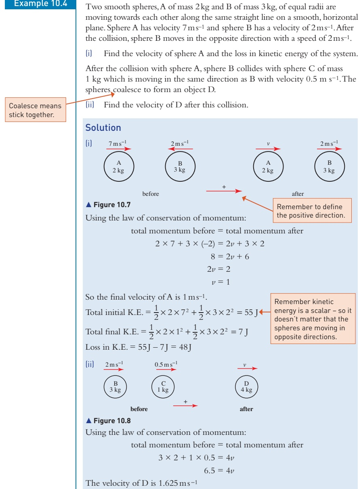
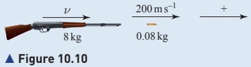
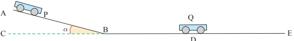

# 10 Momentum

<!-- Cambridge International AS  A Level Mathematics Mechanics (Sophie Goldie) .pdf p205-215 -->

<!-- page 205 -->

I collided with a stationary truck coming the other way. Statement on an insurance form reported in the Toronto news

### 10.1 Linear momentum

The linear momentum of an object of mass, m kg, travelling at velocity,  $ v_{ms^{-1}} $, is defined as

 $$ \begin{aligned}Momentum&=mass\times velocity\\&=m\mathbf{v}\end{aligned} $$ 

The units of momentum are kgm s $ ^{-1} $ or newton-seconds (Ns).

Show that Ns are dimensionally equivalent to  $ kg\cdot m^{-1} $

The momentum of a particular object is proportional to its velocity. Since mass is a scalar and velocity is a vector, it follows that momentum is a vector quantity.

The magnitude of the momentum of an object is often thought of as its resistance to being stopped. Compare the momentum and kinetic energy of a cricket ball of mass 0.15kg bowled very fast at 40ms $ ^{-1} $ and a 20 tonne railway truck moving at the very slow speed of 1 cm per second. Which would you rather be hit by, an object with high momentum and low energy, or one with high energy and low momentum?

<!-- page 206 -->

### 10.2 Conservation of momentum

## Collisions

In an experiment to investigate car design, two vehicles were made to collide head-on (Figure 10.1). How would you investigate this situation? What is the relationship between the change in momentum of the van and that of the car?

### Figure 10.1

Remember Newton's third law. The force that body A exerts on body B is equal to the force that B exerts on A, but in the opposite direction. Also, the increase in momentum of the car in the positive direction is exactly equal to the increase in momentum of the van in the negative direction. For the two vehicles together, the total change in momentum is zero.

## Note

The effect of the constant force F acting for a time t is a change in momentum of each vehicle of  $ Ft $ and this is described as the impulse acting on it. The impulse acts to the right on the car and to the left on the van.

This example illustrates the law of conservation of momentum.

The law of conservation of momentum states that when there are no external influences on a system, the total momentum of the system is constant.

Since momentum is a vector quantity, this applies to the magnitude of the momentum in any direction.

For a collision you can say

Total momentum before collision = total momentum after collision

## Note

It is important to remember that although momentum is conserved in a collision, mechanical energy is not conserved. Some of the work done by the forces is converted into heat and sound.

<!-- page 207 -->

The two vehicles in the previous discussion collide head-on, and, as a result, the van comes to rest (Figure 10.2).

### Figure 10.2

(i) Draw diagrams showing the situation before and after the collision.

(ii) Find the final velocity of the car,  $ \nu \, m \, s^{-1} $

(iii) Find the kinetic energy lost.

## Note

When you are solving an impact problem, always draw a 'before' and 'after' diagram like this one.

All relevant information on the masses and velocities of the two vehicles is given on it.

## Solution

(i) The vehicles are modelled as particles (Figure 10.3).

### Figure 10.3

(ii) Using conservation of momentum, and taking the positive direction as being to the right:

 $$ 2500\times10+1000\times(-20)=2500\times0+1000\times\nu $$ 

 $$ 5000=1000v $$ 

 $$ \nu=5 $$ 

The final velocity of the car is  $ 5 \, m s^{-1} $ in the positive direction (i.e. the car travels backwards).

<!-- page 208 -->

{iii} Total initial K.E. =  $ \frac{1}{2} \times 2500 \times 10^{2} + \frac{1}{2} \times 1000 \times 20^{2} $ = 325 000 joules

 $$ \begin{aligned}Total~final~K.E.&=\frac{1}{2}\times2500\times10^{2}+\frac{1}{2}\times1000\times5^{2}\\&=12500joules\end{aligned} $$ 

The vehicles are treated as particles and all relevant information is in the diagram.

Loss in K.E. = 312500 joules

### Example 10.2

In an experiment on lorry bumper design, the Transport Research Laboratory arranged for a car and a lorry, of masses 1 and 3.5 tonnes to travel towards each other, both with speed  $ 9 \, m s^{-1} $.

After colliding, both vehicles moved together. What was their combined velocity after the collision?

## Solution

The situation before the collision is illustrated in Figure 10.4.

### Figure 10.4

Taking the positive direction to be to the right, before the collision

Momentum of the car in Ns:  $ 1000 \times 9 = 9000 $

Momentum of the lorry in Ns:  $ 3500 \times (-9) = -31500 $

 $$ \mathrm{T o t a l~m o m e n t u m~i n~N s:}\quad9000-31500=-22500 $$ 

After the collision, assume that they move as a single object of mass 4.5 tonnes with velocity  $ \nu $ m $ s^{-1} $ in the positive direction so that the total momentum is now 4500 $ \nu $Ns.

Momentum is conserved so

 $$ 4500\nu=-22500 $$ 

 $$ \nu=-5 $$ 

The car and lorry move at  $ 5\,m\,s^{-1} $ in the direction in which the lorry was moving.

<!-- page 209 -->

A child of mass 30kg running through a supermarket at 4ms $ ^{-1} $ leaps on to a stationary shopping trolley of mass 15kg. Find the speed of the child and trolley together, assuming that the trolley is free to move easily.

## Solution

Figure 10.5 shows the situation before the child hits the trolley

Figure 10.5

Taking the direction of the child's velocity as positive, the total momentum before impact is equal to  $ 4 \times 30 + 0 \times 15 = 120 \, \text{Ns} $.

The situation after impact is shown in Figure 10.6.

Figure 10.6

The total mass of child and trolley is 45 kg, so the total momentum after is  $ 45\nu $ N s.

Conservation of momentum gives:

 $$ 45\nu=120 $$ 

 $$ \nu=2\frac{2}{3} $$ 

The child and the trolley together move at  $ 2\frac{2}{3} $ m s $ ^{-1} $.

<!-- page 210 -->

Two smooth spheres, A of mass 2kg and B of mass 3kg, of equal radii are moving towards each other along the same straight line on a smooth, horizontal plane. Sphere A has velocity 7ms $ ^{-1} $ and sphere B has a velocity of 2ms $ ^{-1} $. After the collision, sphere B moves in the opposite direction with a speed of 2ms $ ^{-1} $.

(i) Find the velocity of sphere A and the loss in kinetic energy of the system. After the collision with sphere A, sphere B collides with sphere C of mass 1 kg which is moving in the same direction as B with velocity 0.5 m s $ ^{-1} $. The spheres coalesce to form an object D.

(ii) Find the velocity of D after this collision.

<!-- page 211 -->

A common mistake is to try to use kinetic energy before = kinetic energy after to solve problems on collisions. This is wrong because energy is usually lost as heat and sound.

## Explosions

Conservation of momentum also applies when explosions take place provided there are no external forces. For example when a bullet is fired from a rifle, or a rocket is launched.

Example 10.5

A rifle of mass 8kg is used to fire a bullet of mass 80g at a speed of 200ms $ ^{-1} $. Calculate the initial recoil speed of the rifle.

## Solution

Before the bullet is fired, the total momentum of the system is zero (Figure 10.9).

After firing, the situation is as shown in Figure 10.10.

The total momentum in the positive direction after the firing is

 $$ 8\nu+0.08\times200 $$ 

For momentum to be conserved,

 $$ 8\nu+0.08\times200=0 $$ 

so that

 $$ \nu=\frac{-0.08\times200}{8}=-2 $$ 

The recoil speed of the rifle is  $ 2\,m\,s^{-1} $.

You have probably realised that  $ \nu $ would turn out to be negative.

## Exercise 10A

1 Find the momentum of each object, assuming each of them to be travelling in a straight line.

(i) An ice skater of mass 50kg travelling with speed 10m s^{-1}.

(ii) An elephant of mass 5 tonnes moving at 4ms^{-1}.

(iii) A train of mass 7000 tonnes travelling at 40 m s $ ^{-1} $.

(iv) A bacterium of mass  $ 2 \times 10^{-16} $ g moving with speed  $ 1 \, \text{mm} \, \text{s}^{-1} $.

<!-- page 212 -->

2 A girl throws a ball of mass 0.06 kg vertically upwards with initial speed  $ 20 \, m \, s^{-1} $. Neglecting air resistance calculate:

(i) the initial momentum of the ball

(ii) the time taken for the ball to reach the top of its flight

(iii) the momentum of the ball when it is at the top of its flight.

3 A spaceship of mass 50 000kg travelling with speed 200ms $ ^{-1} $ docks with a space station of mass 500 000kg travelling in the same direction with speed 195ms $ ^{-1} $. What is their speed after the docking is completed?

4 A railway truck of mass 20 tonnes is shunted with speed  $ 3 \, m s^{-1} $ towards a stationary truck of mass 10 tonnes. What is the speed after impact

(i) if the two trucks remain in contact

(ii) if the second truck now moves at  $ 3 \, m s^{-1} $?

5 The driver of a car of mass 1000kg falls asleep while it is travelling at 30ms^{-1}. The car runs into the back of the car in front which has mass 800kg and is travelling in the same direction at 20ms^{-1}. The bumpers of the two cars become locked together and they continue as one vehicle. What is the speed of the cars immediately after impact?

6 A lorry of mass 5 tonnes is about to tow a car of mass 1 tonne. Initially the tow rope is slack and the car stationary. As the rope becomes taut the lorry is travelling at  $ 2\,ms^{-1} $.

Find the speed of the car once it is being towed.

7 A bullet of mass 50g is moving horizontally at 200ms^{-1} when it becomes embedded in a stationary block of mass 16kg which is free to slide on a smooth horizontal table.

Calculate the speed of the bullet and the block after the impact.

8 A spaceship of mass 50000kg is travelling through space with speed  $ 5000\, \text{m} \cdot \text{s}^{-1} $ when a crew member throws a box of mass 5kg out of the back with speed  $ 10\, \text{m} \cdot \text{s}^{-1} $ relative to the spaceship.

(i) What is the absolute speed of the box?

(ii) What is the speed of the spaceship after the box has been thrown out?

A gun of mass 500kg fires a shell of mass 5kg horizontally with muzzle speed 300ms $ ^{-1} $. Calculate the recoil speed of the gun.

10 Two smooth spheres, P of mass 3kg and speed 8ms^{-1}, and Q of mass 2kg and speed 6ms^{-1}, move in the same direction along a straight line on a smooth horizontal plane. The spheres collide and coalesce.

Find the final speed of the two spheres and the kinetic energy lost in the collision.

<!-- page 213 -->

11 Two small, smooth marbles, A of mass  $ m $ kg and speed  $ 4u_{ms^{-1}} $, and B, of mass  $ 2m_{kg} $ and speed  $ u_{ms^{-1}} $, of equal radii, are moving towards each other along the same straight line on a smooth horizontal plane. The two marbles collide head on and marble A subsequently moves with speed  $ \frac{u}{2}m_{s^{-1}} $ in the opposite direction to its original motion, while marble B moves with speed  $ V_{ms^{-1}} $.

(i) Show that  $ V = \frac{5u}{4} $.

(ii) Hence express the final kinetic energy as a fraction of the original kinetic energy.

12 A truck P of mass 2000kg starts from rest and moves down an incline from A to B, as illustrated in the diagram. The distance from A to B is 50m and  $ \sin\alpha = 0.05 $. CBDE is horizontal.

Neglecting resistance to motion, calculate:

(i) the potential energy lost by the truck P as it moves from A to B

(ii) the speed of the truck P at B.

Truck P then continues from B without loss of speed towards a second truck Q of mass 1500kg at rest at D. The two trucks collide and move on towards E together. Still neglecting resistances to motion, calculate:

(iii) the common speed of the two trucks just after they become coupled together

(iv) the percentage loss of kinetic energy in the collision.

13 Yan (mass 40kg) and Chan (mass 30kg) are on a sledge (mass 10kg) which is travelling across smooth horizontal ice at 5ms $ ^{-1} $. Yan jumps off the back of the sledge with speed 4ms $ ^{-1} $ backwards relative to the sledge.

(i) What is Yan's absolute speed when she jumps off?

(ii) With what speed does Chan, still on the sledge, then go?

Chan then jumps off in the same manner, also with speed  $ 4 \, m s^{-1} $ relative to the sledge.

(iii) What is the speed of the sledge now?

(iv) What would the final speed of the sledge have been if Yan and Chan had both jumped off at the same time, with speed  $ 4 \, m \, s^{-1} $ backwards relative to the sledge?

<!-- page 214 -->

14 A sledge of mass 5kg is initially at rest on a smooth, horizontal surface. All resistances to motion may be neglected. Give all answers correct to three significant figures.

(i) A snowball of mass 0.1 kg is thrown at the sledge, strikes it horizontally at 10ms^{-1} and coalesces with it. At what speed does the sledge move off?

(ii) If a second identical snowball is thrown in the same way, what will the new speed of the sledge be?

(iii) After $n$ identical snowballs have been thrown in the same way show that the speed of the sledge, $\nu \mathrm{m s}^{-1}$ is given by

 $$ \nu=\frac{n}{5+0.1n}. $$ 

(iv) Show that the expression in (iii) may be written as

 $$ \nu=10-\frac{50}{5+0.1n} $$ 

and hence sketch a graph of the relationship between v and n. How does the velocity of the sledge change as n increases?

(v) If the snowball were replaced by a rubber ball of the same mass as in (i), so that it bounced back off the sledge, would the speed of the sledge be greater, the same or less? Give brief reasons for your answer.

15 Amir, whose mass is 80kg, is standing at the front of a sledge of length 5m and mass 40kg. The sledge is initially stationary and on smooth ice. Amir then walks towards the back with speed  $ 1\,m\,s^{-1} $ relative to the sledge.

(i) Find the velocity of the sledge while Amir is walking towards the back of it.

(ii) Show that, throughout his walk, the combined centre of mass of Amir and the sledge does not move.

(iii) Investigate whether the result of part (ii) is true in general for this type of situation, or just a fluke depending on the particular values of the variables involved.

## KEY POINTS

1 The momentum of a body of mass m travelling with velocity v is given by  $ mv $.

2 Momentum is a vector quantity.

3 The law of conservation of momentum states that when no external forces are acting on a system, the total momentum of the system is constant. Since momentum is a vector quantity this applies to the magnitude of the momentum in any direction.

<!-- page 215 -->

## LEARNING OUTCOMES

Now that you have finished this chapter, you should be able to

know the definition of linear momentum

know that momentum is a vector quantity

understand the principle of conservation of momentum

apply the principle of conservation of momentum to solve problems involving impacts including where the bodies coalesce.

