# Exploring data

<!-- Cambridge International AS  A Level Mathematics Probability  Statistics 1 (Sophie Goldie) .pdf p15-65 -->

<!-- page 15 -->

## 1 

## Exploring data

A judicious man looks at statistics, not to get knowledge but to save himself from having ignorance foisted on him. Thomas Carlyle (1795-1881)

A Sales Executive has been given the data shown above in order to write her company's annual Sales and Marketing report. Some of the data are shown as figures and some as diagrams.

How should she interpret this information?

What data should she take seriously and which can she dismiss as being insignificant or even misleading?

To answer these questions fully you need to understand how data are collected and analysed before they are presented to you, and how you should evaluate what you are given to read (or see on the television). This is an important part of the subject of statistics.

In this book, many of the examples are set as stories from fictional websites. Some of them are written as articles or blogs; others are presented from the journalists' viewpoint as they sort through data trying to write an interesting story. As you work through the book, look too at the ways you are given such information in your everyday life.

<!-- page 16 -->

## Biking Today Blog

### Another cyclist seriously hurt. Will you be next?

On her way back home from school on Wednesday afternoon, little Rita Roy was knocked off her bicycle and taken to hospital with suspected concussion. Rita was struck by a Ford Transit van, only 50 metres from her own house. Rita is the fourth child from the Nelson Mandela estate to be involved in a serious cycling accident this year.

The busy road where Rita Roy was knocked off her bicycle yesterday.

After reading the blog, the editor of a local newspaper commissioned one of the paper's reporters to investigate the situation and write a leading article for the paper on it. She explained to the reporter that there was growing concern locally about cycling accidents involving children. She emphasised the need to collect good quality data to support presentations to the paper's readers.

Is the aim of the investigation clear?

Is the investigation worth carrying out?

▶ What makes good quality data?

The reporter started by collecting data from two sources. He went through back numbers of the newspaper for the previous two years, finding all the reports of cycling accidents. He also asked an assistant to carry out a survey of the ages of local cyclists; he wanted to know whether most cyclists were children, young adults or whatever.

Are the reporter's data sources appropriate?

Before starting to write his article, the reporter needed to make sense of the data for himself. He then had to decide how he was going to present the information to his readers. The five examples on the page opposite are typical of the data he had to work with.

<!-- page 17 -->

<table border=1 style='margin: auto; word-wrap: break-word;'><tr><td style='text-align: center; word-wrap: break-word;'>Name</td><td style='text-align: center; word-wrap: break-word;'>Age</td><td style='text-align: center; word-wrap: break-word;'>Distance from home</td><td style='text-align: center; word-wrap: break-word;'>Cause</td><td style='text-align: center; word-wrap: break-word;'>Injuries</td><td style='text-align: center; word-wrap: break-word;'>Treatment</td></tr><tr><td style='text-align: center; word-wrap: break-word;'>Rahim Khan</td><td style='text-align: center; word-wrap: break-word;'>45</td><td style='text-align: center; word-wrap: break-word;'>3 km</td><td style='text-align: center; word-wrap: break-word;'>skid</td><td style='text-align: center; word-wrap: break-word;'>Concussion</td><td style='text-align: center; word-wrap: break-word;'>Hospital outpatient</td></tr><tr><td style='text-align: center; word-wrap: break-word;'>Debbie Lane</td><td style='text-align: center; word-wrap: break-word;'>5</td><td style='text-align: center; word-wrap: break-word;'>75 m</td><td style='text-align: center; word-wrap: break-word;'>hit kerb</td><td style='text-align: center; word-wrap: break-word;'>Broken arm</td><td style='text-align: center; word-wrap: break-word;'>Hospital outpatient</td></tr><tr><td style='text-align: center; word-wrap: break-word;'>Arvinder Sethi</td><td style='text-align: center; word-wrap: break-word;'>12</td><td style='text-align: center; word-wrap: break-word;'>1200 m</td><td style='text-align: center; word-wrap: break-word;'>lorry</td><td style='text-align: center; word-wrap: break-word;'>Multiple fractures</td><td style='text-align: center; word-wrap: break-word;'>Hospital 3 weeks</td></tr><tr><td style='text-align: center; word-wrap: break-word;'>Husna Mahar</td><td style='text-align: center; word-wrap: break-word;'>8</td><td style='text-align: center; word-wrap: break-word;'>300 m</td><td rowspan="2">hit each other</td><td style='text-align: center; word-wrap: break-word;'>Bruising</td><td style='text-align: center; word-wrap: break-word;'>Hospital outpatient</td></tr><tr><td style='text-align: center; word-wrap: break-word;'>David Huker</td><td style='text-align: center; word-wrap: break-word;'>8</td><td style='text-align: center; word-wrap: break-word;'>50 m</td><td style='text-align: center; word-wrap: break-word;'>Concussion</td><td style='text-align: center; word-wrap: break-word;'>Hospital outpatient</td></tr><tr><td colspan="6">There were 92 accidents listed in his table.</td></tr><tr><td colspan="6">Ages of cyclists (from survey)</td></tr><tr><td style='text-align: center; word-wrap: break-word;'>66</td><td style='text-align: center; word-wrap: break-word;'>6</td><td style='text-align: center; word-wrap: break-word;'>62</td><td style='text-align: center; word-wrap: break-word;'>19</td><td style='text-align: center; word-wrap: break-word;'>20</td><td style='text-align: center; word-wrap: break-word;'>15</td></tr><tr><td style='text-align: center; word-wrap: break-word;'>35</td><td style='text-align: center; word-wrap: break-word;'>26</td><td style='text-align: center; word-wrap: break-word;'>61</td><td style='text-align: center; word-wrap: break-word;'>13</td><td style='text-align: center; word-wrap: break-word;'>61</td><td style='text-align: center; word-wrap: break-word;'>28</td></tr><tr><td style='text-align: center; word-wrap: break-word;'>64</td><td style='text-align: center; word-wrap: break-word;'>11</td><td style='text-align: center; word-wrap: break-word;'>39</td><td style='text-align: center; word-wrap: break-word;'>22</td><td style='text-align: center; word-wrap: break-word;'>9</td><td style='text-align: center; word-wrap: break-word;'>13</td></tr><tr><td style='text-align: center; word-wrap: break-word;'>37</td><td style='text-align: center; word-wrap: break-word;'>18</td><td style='text-align: center; word-wrap: break-word;'>138</td><td style='text-align: center; word-wrap: break-word;'>16</td><td style='text-align: center; word-wrap: break-word;'>67</td><td style='text-align: center; word-wrap: break-word;'>45</td></tr><tr><td style='text-align: center; word-wrap: break-word;'>9</td><td style='text-align: center; word-wrap: break-word;'>23</td><td style='text-align: center; word-wrap: break-word;'>12</td><td style='text-align: center; word-wrap: break-word;'>9</td><td style='text-align: center; word-wrap: break-word;'>37</td><td style='text-align: center; word-wrap: break-word;'>7</td></tr><tr><td style='text-align: center; word-wrap: break-word;'>18</td><td style='text-align: center; word-wrap: break-word;'>20</td><td style='text-align: center; word-wrap: break-word;'>11</td><td style='text-align: center; word-wrap: break-word;'>25</td><td style='text-align: center; word-wrap: break-word;'>7</td><td style='text-align: center; word-wrap: break-word;'>42</td></tr><tr><td style='text-align: center; word-wrap: break-word;'>18</td><td style='text-align: center; word-wrap: break-word;'>15</td><td style='text-align: center; word-wrap: break-word;'></td><td style='text-align: center; word-wrap: break-word;'></td><td style='text-align: center; word-wrap: break-word;'></td><td style='text-align: center; word-wrap: break-word;'></td></tr></table>

This information is described as  $ \underline{\text{raw data}} $, which means that no attempt has yet been made to organise it to look for any patterns.

### 1.1 Looking at the data

At the moment the arrangement of the ages of the 92 cyclists tells you very little at all. Clearly these data must be organised to reveal the underlying shape, the distribution. The figures need to be ranked according to size and preferably grouped as well. The reporter had asked an assistant to collect the information and this was the order in which she presented it.

## Tally

Tallying is a quick, straightforward way of grouping data into suitable intervals.You have probably met it already.

<!-- page 18 -->

<table border=1 style='margin: auto; word-wrap: break-word;'><tr><td style='text-align: center; word-wrap: break-word;'>Stated age (years)</td><td style='text-align: center; word-wrap: break-word;'>Tally</td><td style='text-align: center; word-wrap: break-word;'>Frequency</td></tr><tr><td style='text-align: center; word-wrap: break-word;'>0-9</td><td style='text-align: center; word-wrap: break-word;'>||||</td><td style='text-align: center; word-wrap: break-word;'>13</td></tr><tr><td style='text-align: center; word-wrap: break-word;'>10-19</td><td style='text-align: center; word-wrap: break-word;'>||||</td><td style='text-align: center; word-wrap: break-word;'>26</td></tr><tr><td style='text-align: center; word-wrap: break-word;'>20-29</td><td style='text-align: center; word-wrap: break-word;'>||||</td><td style='text-align: center; word-wrap: break-word;'>16</td></tr><tr><td style='text-align: center; word-wrap: break-word;'>30-39</td><td style='text-align: center; word-wrap: break-word;'>||||</td><td style='text-align: center; word-wrap: break-word;'>10</td></tr><tr><td style='text-align: center; word-wrap: break-word;'>40-49</td><td style='text-align: center; word-wrap: break-word;'>||||</td><td style='text-align: center; word-wrap: break-word;'>6</td></tr><tr><td style='text-align: center; word-wrap: break-word;'>50-59</td><td style='text-align: center; word-wrap: break-word;'>||||</td><td style='text-align: center; word-wrap: break-word;'>5</td></tr><tr><td style='text-align: center; word-wrap: break-word;'>60-69</td><td style='text-align: center; word-wrap: break-word;'>||||</td><td style='text-align: center; word-wrap: break-word;'>14</td></tr><tr><td style='text-align: center; word-wrap: break-word;'>70-79</td><td style='text-align: center; word-wrap: break-word;'></td><td style='text-align: center; word-wrap: break-word;'>0</td></tr><tr><td style='text-align: center; word-wrap: break-word;'>80-89</td><td style='text-align: center; word-wrap: break-word;'>|</td><td style='text-align: center; word-wrap: break-word;'>1</td></tr><tr><td style='text-align: center; word-wrap: break-word;'>:</td><td style='text-align: center; word-wrap: break-word;'></td><td style='text-align: center; word-wrap: break-word;'></td></tr><tr><td style='text-align: center; word-wrap: break-word;'>130-139</td><td style='text-align: center; word-wrap: break-word;'>|</td><td style='text-align: center; word-wrap: break-word;'>1</td></tr><tr><td style='text-align: center; word-wrap: break-word;'>Total</td><td style='text-align: center; word-wrap: break-word;'></td><td style='text-align: center; word-wrap: break-word;'>92</td></tr></table>

## Extreme values

A tally immediately shows up any extreme values, that is values which are far away from the rest. In this case there are two extreme values, usually referred to as outliers: 88 and 138. Before doing anything else you must investigate these.

In this case the 88 is genuine, the age of Millie Smith, who is a familiar sight cycling to the shops.

The 138 needless to say is not genuine. It was the written response of a man who was insulted at being asked his age. Since no other information about him is available, this figure is best ignored and the sample size reduced from 92 to 91. You should always try to understand an outlier before deciding to ignore it; it may give you important information.

Practical statisticians are frequently faced with the problem of outlying observations; observations that depart in some way from the general pattern of a data set. What they, and you, have to decide is whether any such observations belong to the data set or not. In the above example the data value 88 is a genuine member of the data set and is retained. The data value 138 is not a member of the data set and is therefore rejected.

<!-- page 19 -->

## Describing the shape of a distribution

An obvious benefit of using a tally is that it shows the overall shape of the distribution.

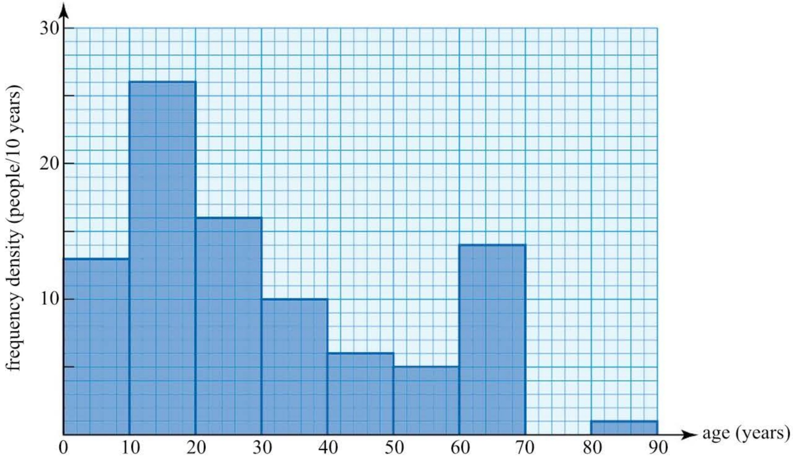

▲ Figure 1.1 Histogram to show the ages of a sample of 91 cyclists

You can now see that a large proportion (more than a quarter) of the sample are in the 10 to 19 years age range. This is the  $ \underline{\text{modal}} $ group as it is the one with the most members. The single value with the most members is called the  $ \underline{\text{mode}} $, in this case age 9.

You will also see that there is a second peak among those in their sixties; so this distribution is called bimodal, even though the frequency in the interval 10-19 is greater than the frequency in the interval 60-69.

Different types of distribution are described in terms of the position of their modes or modal groups; see Figure 1.2.

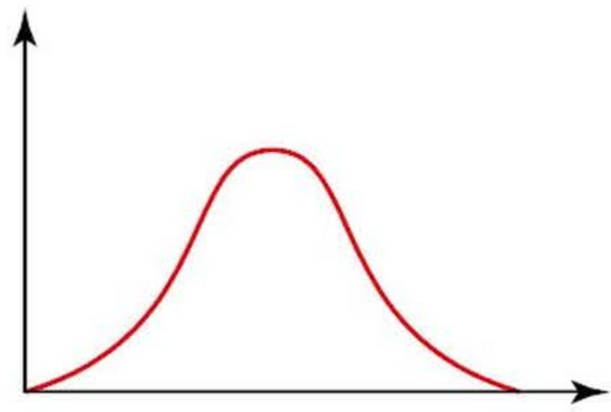

(a)

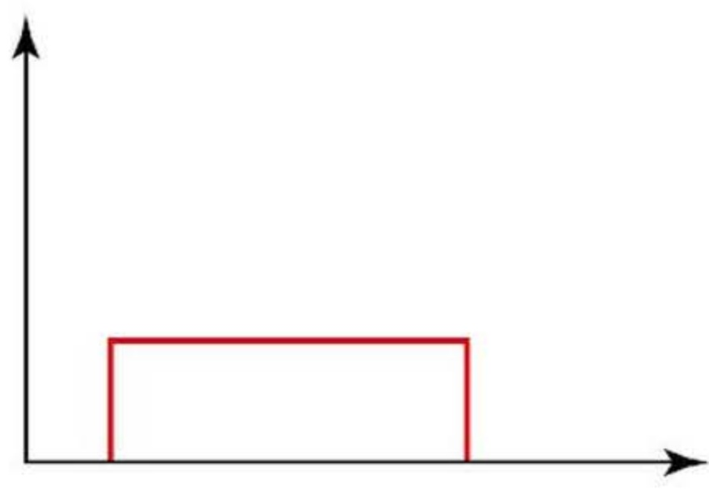

(b)

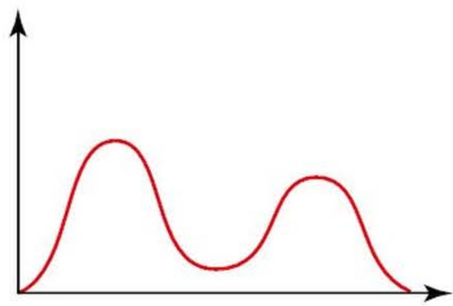

(c)

▲ Figure 1.2 Distribution shapes: (a) unimodal and symmetrical (b) uniform (no mode but symmetrical) (c) bimodal

When the mode is off to one side the distribution is said to be skewed. If the mode is to the left with a long tail to the right the distribution has positive (or right) skewness; if the long tail is to the left the distribution has negative (or left) skewness. These two cases are shown in Figure 1.3.

<!-- page 20 -->

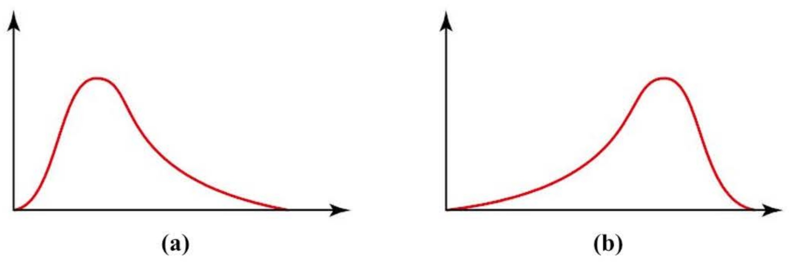

▲ Figure 1.3 Skewness: (a) positive (b) negative

### 1.2 Stem-and-leaf diagrams

The quick and easy view of the distribution from the tally has been achieved at the cost of losing information. You can no longer see the original figures that went into the various groups and so cannot, for example, tell from looking at the tally whether Millie Smith is 80, 81, 82, or any age up to 89. This problem of the loss of information can be solved by drawing a stem-and-leaf diagram (or stemplot).

This is a quick way of grouping the data so that you can see their distribution and still have access to the original figures. The one below shows the ages of the 91 cyclists surveyed.

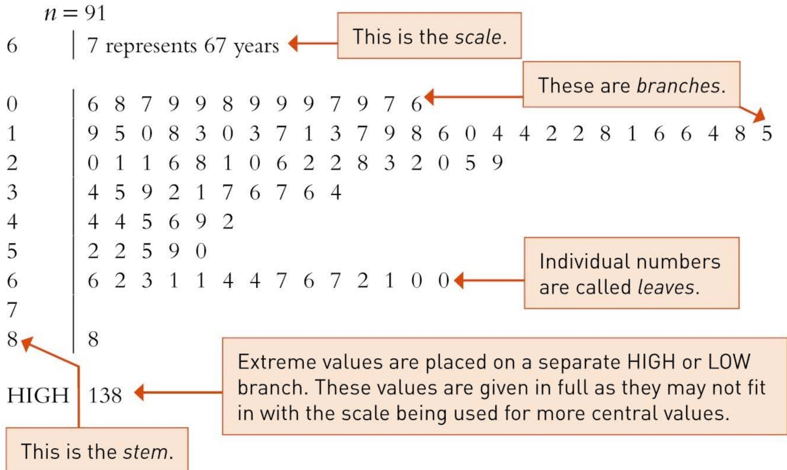

Value 138 is ignored

▲ Figure 1.4 Stem-and-leaf diagram showing the ages of a sample of 91 cyclists (unsorted)

Do all the branches have leaves?

<!-- page 21 -->

The column of figures on the left (going from 0 to 8) corresponds to the tens digits of the ages. This is called the stem and in this example it consists of 9 branches. On each branch on the stem are the leaves and these represent the units digits of the data values.

In Figure 1.4, the leaves for a particular branch have been placed in the order in which the numbers appeared in the original raw data. This is fine for showing the general shape of the distribution, but it is usually worthwhile sorting the leaves, as shown in Figure 1.5.

0 | 6 6 7 7 7 8 8 9 9 9 9 9 9 0 0 0 1 1 2 2 3 3 3 4 4 4 5 5 6 6 6 7 7 8 8 8 8 9 9 2 0 0 0 1 1 1 2 2 2 3 5 6 6 8 8 9 1 2 4 4 5 6 7 7 9 4 2 4 4 5 6 9 5 0 2 2 5 9 0 0 1 1 1 2 2 3 4 4 6 6 7 7 6 7 8 8

Note that the value 138 is left out as it has been identified as not belonging to this set of data.

▲ Figure 1.5 Stem-and-leaf diagram showing the ages of a sample of 91 cyclists (sorted)

The stem-and-leaf diagram gives you a lot of information at a glance:

The youngest cyclist is 6 and the oldest is 88 years of age.

More people are in the 10–19 years age range than in any other 10-year age range.

The modal age (i.e. the age with the most people) is 9.

There are three 61 year olds.

The 17th oldest cyclist in the survey is 55 years of age.

If the values on the basic stem-and-leaf diagram are too cramped, that is if there are so many leaves on a line that the diagram is not clear, you may  $ \underline{\text{stretch}} $ it. To do this you put values 0, 1, 2, 3, 4 on one line and 5, 6, 7, 8, 9 on another. Doing this to the example results in the diagram shown in Figure 1.6.

When stretched, this stem-and-leaf diagram reveals the skewed nature of the distribution.

<!-- page 22 -->

n = 91
6 | 7 represents 67 years

9

▲ Figure 1.6 Stem-and-leaf diagram showing the ages of a sample of 91 cyclists (sorted, stretched)

How would you squeeze a stem-and-leaf diagram?

What would you do if the data have more significant figures than can be shown on a stem-and-leaf diagram?

Stem-and-leaf diagrams are particularly useful for comparing data sets. With two data sets a back-to-back stem-and-leaf diagram can be drawn, as shown in Figure 1.7.

represents 590

represents 520

 $$ \begin{array}{ccc|c|ccccc}{{{9}}}&{{{5}}}&{{{1}}}&{{{7}}} \\{{{2}}}&{{{6}}}&{{{0}}}&{{{2}}}&{{{3}}}&{{{5}}}&{{{8}}} \\{{{5}}}&{{{3}}}&{{{0}}}&{{{7}}}&{{{1}}}&{{{2}}}&{{{5}}}&{{{6}}}&{{{6}}}&{{{7}}} \\{{{9}}}&{{{7}}}&{{{5}}}&{{{1}}}&{{{1}}}&{{{8}}}&{{{3}}}&{{{5}}} \\{{{8}}}&{{{6}}}&{{{2}}}&{{{1}}}&{{{9}}}&{{{2}}} \\\end{array} $$ 

Figure 1.7

Note the numbers on the left of the stem still have the smallest number next to the stem.

How would you represent positive and negative data on a stem-and-leaf diagram?

<!-- page 23 -->

1 Write down the lengths in centimetres that are represented by this stem-and-leaf diagram.

n = 15
32 | 1 represents 3.21 cm

32 | 7
33 | 2 6
34 | 3 5 9
35 | 0 2 6 6 8
36 | 1 1 4
37 | 2

2 Write down the lengths in millimetres that are represented by this stem-and-leaf diagram.

n = 19
8 | 9 represents 0.089 mm

8 | 3 6 7
9 | 0 1 4 8
10 | 2 3 5 8 9 9
11 | 0 1 4
12 | 3 5
13 | 1

3 Draw a sorted stem-and-leaf diagram with six branches to show the following numbers. Remember to include the appropriate scale.

<table border=1 style='margin: auto; word-wrap: break-word;'><tr><td style='text-align: center; word-wrap: break-word;'>0.212</td><td style='text-align: center; word-wrap: break-word;'>0.223</td><td style='text-align: center; word-wrap: break-word;'>0.226</td><td style='text-align: center; word-wrap: break-word;'>0.230</td><td style='text-align: center; word-wrap: break-word;'>0.233</td><td style='text-align: center; word-wrap: break-word;'>0.237</td><td style='text-align: center; word-wrap: break-word;'>0.241</td></tr><tr><td style='text-align: center; word-wrap: break-word;'>0.242</td><td style='text-align: center; word-wrap: break-word;'>0.248</td><td style='text-align: center; word-wrap: break-word;'>0.253</td><td style='text-align: center; word-wrap: break-word;'>0.253</td><td style='text-align: center; word-wrap: break-word;'>0.259</td><td style='text-align: center; word-wrap: break-word;'>0.262</td><td style='text-align: center; word-wrap: break-word;'></td></tr></table>

4 Draw a sorted stem-and-leaf diagram with five branches to show the following numbers. Remember to include the appropriate scale.

<table border=1 style='margin: auto; word-wrap: break-word;'><tr><td style='text-align: center; word-wrap: break-word;'>81.7</td><td style='text-align: center; word-wrap: break-word;'>82.0</td><td style='text-align: center; word-wrap: break-word;'>78.1</td><td style='text-align: center; word-wrap: break-word;'>80.8</td><td style='text-align: center; word-wrap: break-word;'>82.5</td></tr><tr><td style='text-align: center; word-wrap: break-word;'>81.9</td><td style='text-align: center; word-wrap: break-word;'>79.4</td><td style='text-align: center; word-wrap: break-word;'>81.3</td><td style='text-align: center; word-wrap: break-word;'>79.6</td><td style='text-align: center; word-wrap: break-word;'>80.4</td></tr></table>

<!-- page 24 -->

5 Write down the lengths in metres that are represented by this stem-and-leaf diagram.

$n = 21$

34 | 5 represents 3.45 m
LOW 0.013, 0.089, 1.79

34 | 3
35 | 1 7 9
36 | 0 4 6 8
37 | 1 1 3 8 9
38 | 0 5
39 | 4
HIGH 7.45, 10.87

6 Forty motorists entered a driving competition. The organisers were anxious to know if the contestants had enjoyed the event and also to know their ages, so that they could plan and promote future events effectively. They therefore asked entrants to fill in a form on which they commented on the various tests and gave their ages.

The information was copied from the forms and the ages listed as:

<table border=1 style='margin: auto; word-wrap: break-word;'><tr><td style='text-align: center; word-wrap: break-word;'>28</td><td style='text-align: center; word-wrap: break-word;'>52</td><td style='text-align: center; word-wrap: break-word;'>44</td><td style='text-align: center; word-wrap: break-word;'>28</td><td style='text-align: center; word-wrap: break-word;'>38</td><td style='text-align: center; word-wrap: break-word;'>46</td><td style='text-align: center; word-wrap: break-word;'>62</td><td style='text-align: center; word-wrap: break-word;'>59</td><td style='text-align: center; word-wrap: break-word;'>37</td><td style='text-align: center; word-wrap: break-word;'>60</td></tr><tr><td style='text-align: center; word-wrap: break-word;'>19</td><td style='text-align: center; word-wrap: break-word;'>55</td><td style='text-align: center; word-wrap: break-word;'>34</td><td style='text-align: center; word-wrap: break-word;'>35</td><td style='text-align: center; word-wrap: break-word;'>66</td><td style='text-align: center; word-wrap: break-word;'>37</td><td style='text-align: center; word-wrap: break-word;'>22</td><td style='text-align: center; word-wrap: break-word;'>26</td><td style='text-align: center; word-wrap: break-word;'>45</td><td style='text-align: center; word-wrap: break-word;'>5</td></tr><tr><td style='text-align: center; word-wrap: break-word;'>61</td><td style='text-align: center; word-wrap: break-word;'>38</td><td style='text-align: center; word-wrap: break-word;'>26</td><td style='text-align: center; word-wrap: break-word;'>29</td><td style='text-align: center; word-wrap: break-word;'>63</td><td style='text-align: center; word-wrap: break-word;'>38</td><td style='text-align: center; word-wrap: break-word;'>29</td><td style='text-align: center; word-wrap: break-word;'>36</td><td style='text-align: center; word-wrap: break-word;'>45</td><td style='text-align: center; word-wrap: break-word;'>33</td></tr><tr><td style='text-align: center; word-wrap: break-word;'>37</td><td style='text-align: center; word-wrap: break-word;'>41</td><td style='text-align: center; word-wrap: break-word;'>39</td><td style='text-align: center; word-wrap: break-word;'>81</td><td style='text-align: center; word-wrap: break-word;'>35</td><td style='text-align: center; word-wrap: break-word;'>35</td><td style='text-align: center; word-wrap: break-word;'>32</td><td style='text-align: center; word-wrap: break-word;'>36</td><td style='text-align: center; word-wrap: break-word;'>39</td><td style='text-align: center; word-wrap: break-word;'>33</td></tr></table>

(i) Identify the outlier and say why it should be excluded.

(ii) Draw a sorted stem-and-leaf diagram to illustrate these data.

(iii) Describe the shape of the distribution.

7 The unsorted stem-and-leaf diagram below gives the ages of males whose marriages were reported in a local newspaper one week.

n = 42
1 | 9 represents 19
0 |
1 | 9 6 9 8
2 | 5 6 8 9 1 1 0 3 6 8 4 1 2 7
3 | 0 0 5 2 3 9 1 2 0
4 | 8 4 7 9 6 5 3 3 5 6
5 | 2 2 1 7
6 |
7 |
8 | 3

<!-- page 25 -->

(i) What was the age of the oldest person whose marriage is included?

(ii) Redraw the stem-and-leaf diagram with the leaves sorted.

(iii) Stretch the stem-and-leaf diagram by using steps of five years between the levels rather than ten.

(iv) Describe and comment on the distribution.

8 On 1 January the average daily temperature was recorded for 30 cities around the world. The temperatures, in  $ {}^{\circ}\mathrm{C} $, were as follows.

 $$ \begin{array}{r r r r r r r r r}{21}&{3}&{18}&{-4}&{10}&{27}&{14}&{7}&{19}&{-14}\\ {32}&{2}&{-9}&{29}&{11}&{26}&{-7}&{-11}&{15}&{4}\\ {35}&{14}&{23}&{19}&{-15}&{8}&{8}&{-2}&{3}&{1} \end{array} $$ 

CP

(ii) Describe the shape of the distribution.

(i) Draw a sorted stem-and-leaf diagram to illustrate the temperature distribution.

9 The following marks were obtained on an A Level mathematics paper by the candidates at one centre.

 $$ \begin{array}{l l l l l l l l}{26}&{54}&{50}&{37}&{54}&{34}&{34}&{66}&{44}&{76}&{45}&{71}&{51}&{75}&{30}\\ {29}&{52}&{43}&{66}&{59}&{22}&{74}&{51}&{49}&{39}&{32}&{37}&{57}&{37}&{18}\\ {54}&{17}&{26}&{40}&{69}&{80}&{90}&{95}&{96}&{95}&{70}&{68}&{97}&{87}&{68}\\ {77}&{76}&{30}&{100}&{98}&{44}&{60}&{46}&{97}&{75}&{52}&{82}&{92}&{51}&{44}\\ {73}&{87}&{49}&{90}&{53}&{45}&{40}&{61}&{66}&{94}&{62}&{39}&{100}&{91}&{66}\\ {35}&{56}&{36}&{74}&{25}&{70}&{69}&{67}&{48}&{65}&{55}&{64}&{⋰}&{⋰}&{⋰} \end{array} $$ 

Draw a sorted stem-and-leaf diagram to illustrate these marks and comment on their distribution.

10 The ages of a sample of 40 hang-gliders (in years) are given below.

 $$ \begin{array}{l l l l l l l l}{28}&{19}&{24}&{20}&{28}&{26}&{22}&{19}&{37}&{40}&{19}&{25}&{65}&{34}&{66}\\ {35}&{69}&{65}&{26}&{17}&{22}&{26}&{45}&{58}&{30}&{31}&{58}&{26}&{29}&{23}\\ {72}&{23}&{21}&{30}&{28}&{65}&{21}&{67}&{23}&{57}&{⋰}&{⋰}&{⋰}&{⋰}&{⋰} \end{array} $$ 

(i) Using intervals of ten years, draw a sorted stem-and-leaf diagram to illustrate these figures.

(ii) Comment on and give a possible explanation for the shape of the distribution.

<!-- page 26 -->

11 An experimental fertiliser called GRO was applied to 50 lime trees, chosen at random, in a plantation. Another 50 trees were left untreated. The yields in kilograms were as follows.

<table border=1 style='margin: auto; word-wrap: break-word;'><tr><td colspan="16">Treated</td></tr><tr><td style='text-align: center; word-wrap: break-word;'>59</td><td style='text-align: center; word-wrap: break-word;'>25</td><td style='text-align: center; word-wrap: break-word;'>52</td><td style='text-align: center; word-wrap: break-word;'>19</td><td style='text-align: center; word-wrap: break-word;'>32</td><td style='text-align: center; word-wrap: break-word;'>26</td><td style='text-align: center; word-wrap: break-word;'>33</td><td style='text-align: center; word-wrap: break-word;'>24</td><td style='text-align: center; word-wrap: break-word;'>35</td><td style='text-align: center; word-wrap: break-word;'>30</td><td style='text-align: center; word-wrap: break-word;'>23</td><td style='text-align: center; word-wrap: break-word;'>54</td><td style='text-align: center; word-wrap: break-word;'>33</td><td style='text-align: center; word-wrap: break-word;'>31</td><td style='text-align: center; word-wrap: break-word;'>25</td><td style='text-align: center; word-wrap: break-word;'></td></tr><tr><td style='text-align: center; word-wrap: break-word;'>23</td><td style='text-align: center; word-wrap: break-word;'>61</td><td style='text-align: center; word-wrap: break-word;'>35</td><td style='text-align: center; word-wrap: break-word;'>38</td><td style='text-align: center; word-wrap: break-word;'>44</td><td style='text-align: center; word-wrap: break-word;'>27</td><td style='text-align: center; word-wrap: break-word;'>24</td><td style='text-align: center; word-wrap: break-word;'>30</td><td style='text-align: center; word-wrap: break-word;'>62</td><td style='text-align: center; word-wrap: break-word;'>23</td><td style='text-align: center; word-wrap: break-word;'>47</td><td style='text-align: center; word-wrap: break-word;'>42</td><td style='text-align: center; word-wrap: break-word;'>41</td><td style='text-align: center; word-wrap: break-word;'>53</td><td style='text-align: center; word-wrap: break-word;'>31</td><td style='text-align: center; word-wrap: break-word;'></td></tr><tr><td style='text-align: center; word-wrap: break-word;'>20</td><td style='text-align: center; word-wrap: break-word;'>21</td><td style='text-align: center; word-wrap: break-word;'>41</td><td style='text-align: center; word-wrap: break-word;'>33</td><td style='text-align: center; word-wrap: break-word;'>35</td><td style='text-align: center; word-wrap: break-word;'>38</td><td style='text-align: center; word-wrap: break-word;'>61</td><td style='text-align: center; word-wrap: break-word;'>63</td><td style='text-align: center; word-wrap: break-word;'>44</td><td style='text-align: center; word-wrap: break-word;'>18</td><td style='text-align: center; word-wrap: break-word;'>53</td><td style='text-align: center; word-wrap: break-word;'>38</td><td style='text-align: center; word-wrap: break-word;'>33</td><td style='text-align: center; word-wrap: break-word;'>49</td><td style='text-align: center; word-wrap: break-word;'>54</td><td style='text-align: center; word-wrap: break-word;'></td></tr><tr><td style='text-align: center; word-wrap: break-word;'>50</td><td style='text-align: center; word-wrap: break-word;'>44</td><td style='text-align: center; word-wrap: break-word;'>25</td><td style='text-align: center; word-wrap: break-word;'>42</td><td style='text-align: center; word-wrap: break-word;'>18</td><td style='text-align: center; word-wrap: break-word;'></td><td style='text-align: center; word-wrap: break-word;'></td><td style='text-align: center; word-wrap: break-word;'></td><td style='text-align: center; word-wrap: break-word;'></td><td style='text-align: center; word-wrap: break-word;'></td><td style='text-align: center; word-wrap: break-word;'></td><td style='text-align: center; word-wrap: break-word;'></td><td style='text-align: center; word-wrap: break-word;'></td><td style='text-align: center; word-wrap: break-word;'></td><td style='text-align: center; word-wrap: break-word;'></td><td style='text-align: center; word-wrap: break-word;'></td></tr><tr><td colspan="16">Untreated</td></tr><tr><td style='text-align: center; word-wrap: break-word;'>8</td><td style='text-align: center; word-wrap: break-word;'>11</td><td style='text-align: center; word-wrap: break-word;'>22</td><td style='text-align: center; word-wrap: break-word;'>22</td><td style='text-align: center; word-wrap: break-word;'>20</td><td style='text-align: center; word-wrap: break-word;'>5</td><td style='text-align: center; word-wrap: break-word;'>31</td><td style='text-align: center; word-wrap: break-word;'>40</td><td style='text-align: center; word-wrap: break-word;'>14</td><td style='text-align: center; word-wrap: break-word;'>45</td><td style='text-align: center; word-wrap: break-word;'>10</td><td style='text-align: center; word-wrap: break-word;'>16</td><td style='text-align: center; word-wrap: break-word;'>14</td><td style='text-align: center; word-wrap: break-word;'>20</td><td style='text-align: center; word-wrap: break-word;'>51</td><td style='text-align: center; word-wrap: break-word;'></td></tr><tr><td style='text-align: center; word-wrap: break-word;'>55</td><td style='text-align: center; word-wrap: break-word;'>30</td><td style='text-align: center; word-wrap: break-word;'>30</td><td style='text-align: center; word-wrap: break-word;'>25</td><td style='text-align: center; word-wrap: break-word;'>29</td><td style='text-align: center; word-wrap: break-word;'>12</td><td style='text-align: center; word-wrap: break-word;'>48</td><td style='text-align: center; word-wrap: break-word;'>17</td><td style='text-align: center; word-wrap: break-word;'>12</td><td style='text-align: center; word-wrap: break-word;'>52</td><td style='text-align: center; word-wrap: break-word;'>58</td><td style='text-align: center; word-wrap: break-word;'>61</td><td style='text-align: center; word-wrap: break-word;'>14</td><td style='text-align: center; word-wrap: break-word;'>32</td><td style='text-align: center; word-wrap: break-word;'>5</td><td style='text-align: center; word-wrap: break-word;'></td></tr><tr><td style='text-align: center; word-wrap: break-word;'>29</td><td style='text-align: center; word-wrap: break-word;'>40</td><td style='text-align: center; word-wrap: break-word;'>61</td><td style='text-align: center; word-wrap: break-word;'>53</td><td style='text-align: center; word-wrap: break-word;'>22</td><td style='text-align: center; word-wrap: break-word;'>33</td><td style='text-align: center; word-wrap: break-word;'>41</td><td style='text-align: center; word-wrap: break-word;'>62</td><td style='text-align: center; word-wrap: break-word;'>51</td><td style='text-align: center; word-wrap: break-word;'>56</td><td style='text-align: center; word-wrap: break-word;'>10</td><td style='text-align: center; word-wrap: break-word;'>48</td><td style='text-align: center; word-wrap: break-word;'>50</td><td style='text-align: center; word-wrap: break-word;'>14</td><td style='text-align: center; word-wrap: break-word;'>8</td><td style='text-align: center; word-wrap: break-word;'></td></tr><tr><td style='text-align: center; word-wrap: break-word;'>63</td><td style='text-align: center; word-wrap: break-word;'>43</td><td style='text-align: center; word-wrap: break-word;'>61</td><td style='text-align: center; word-wrap: break-word;'>12</td><td style='text-align: center; word-wrap: break-word;'>42</td><td style='text-align: center; word-wrap: break-word;'></td><td style='text-align: center; word-wrap: break-word;'></td><td style='text-align: center; word-wrap: break-word;'></td><td style='text-align: center; word-wrap: break-word;'></td><td style='text-align: center; word-wrap: break-word;'></td><td style='text-align: center; word-wrap: break-word;'></td><td style='text-align: center; word-wrap: break-word;'></td><td style='text-align: center; word-wrap: break-word;'></td><td style='text-align: center; word-wrap: break-word;'></td><td style='text-align: center; word-wrap: break-word;'></td><td style='text-align: center; word-wrap: break-word;'></td></tr></table>

Draw sorted back-to-back stem-and-leaf diagrams to compare the two sets of data and comment on the effects of GRO.

12 A group of 25 people were asked to estimate the length of a line which they were told was between 1 and 2 metres long. Here are their estimates, in metres.

<table border=1 style='margin: auto; word-wrap: break-word;'><tr><td style='text-align: center; word-wrap: break-word;'>1.15</td><td style='text-align: center; word-wrap: break-word;'>1.33</td><td style='text-align: center; word-wrap: break-word;'>1.42</td><td style='text-align: center; word-wrap: break-word;'>1.26</td><td style='text-align: center; word-wrap: break-word;'>1.29</td><td style='text-align: center; word-wrap: break-word;'>1.30</td><td style='text-align: center; word-wrap: break-word;'>1.30</td><td style='text-align: center; word-wrap: break-word;'>1.46</td><td style='text-align: center; word-wrap: break-word;'>1.18</td><td style='text-align: center; word-wrap: break-word;'>1.24</td></tr><tr><td style='text-align: center; word-wrap: break-word;'>1.21</td><td style='text-align: center; word-wrap: break-word;'>1.30</td><td style='text-align: center; word-wrap: break-word;'>1.32</td><td style='text-align: center; word-wrap: break-word;'>1.33</td><td style='text-align: center; word-wrap: break-word;'>1.29</td><td style='text-align: center; word-wrap: break-word;'>1.30</td><td style='text-align: center; word-wrap: break-word;'>1.40</td><td style='text-align: center; word-wrap: break-word;'>1.26</td><td style='text-align: center; word-wrap: break-word;'>1.32</td><td style='text-align: center; word-wrap: break-word;'>1.30</td></tr><tr><td style='text-align: center; word-wrap: break-word;'>1.41</td><td style='text-align: center; word-wrap: break-word;'>1.28</td><td style='text-align: center; word-wrap: break-word;'>1.65</td><td style='text-align: center; word-wrap: break-word;'>1.54</td><td style='text-align: center; word-wrap: break-word;'>1.14</td><td style='text-align: center; word-wrap: break-word;'></td><td style='text-align: center; word-wrap: break-word;'></td><td style='text-align: center; word-wrap: break-word;'></td><td style='text-align: center; word-wrap: break-word;'></td><td style='text-align: center; word-wrap: break-word;'></td></tr></table>

(i) Represent these data in a sorted stem-and-leaf diagram.

(ii) From the stem-and-leaf diagram which you drew, read off the third highest and third lowest length estimates.

(iv) On the evidence that you have, could you make an estimate of the length of the line? Justify your answer.

(iii) Find the middle of the 25 estimates.

### 1.3 Categorical or qualitative data

Chapter 2 will deal in more detail with ways of displaying data. The remainder of this chapter looks at types of data and the basic analysis of numerical data.

Some data come to you in classes or categories. Such data, like these for the sizes of sweatshirts, are called categorical or qualitative.

XL, S, S, L, M, S, M, M, XL, L, XS

XS = extra small; S = small; M = medium; L = large; XL = extra large

Most of the data you encounter, however, will be numerical data (also called quantitative data).

<!-- page 27 -->

### 1.4 Numerical or quantitative data Variables

The score you get when you throw an ordinary die is one of the values 1, 2, 3, 4, 5 or 6. Rather than repeatedly using the phrase 'The score you get when you throw an ordinary die', statisticians find it convenient to use a capital letter, X, say. They let X stand for 'The score you get when you throw an ordinary die' and because this varies, X is referred to as a variable.

Similarly, if you are collecting data and this involves, for example, noting the temperature in classrooms at noon, then you could let T stand for 'the temperature in a classroom at noon'. So T is another example of a variable.

Values of the variable X are denoted by the lower case letter x, e.g. x=1, 2, 3, 4, 5 or 6.

Values of the variable T are denoted by the lower case letter t, e.g. t=18,21,20,19,23,\ldots

## Discrete and continuous variables

The scores on a die, 1, 2, 3, 4, 5 and 6, the number of goals a football team scores, 0, 1, 2, 3, ... and amounts of money, $0.01, $0.02, ... are all examples of discrete variables. What they have in common is that all possible values can be listed.

Distance, mass, temperature and speed are all examples of continuous variables. Continuous variables, if measured accurately enough, can take any appropriate value. You cannot list all possible values.

You have already seen the example of age. This is rather a special case. It is nearly always given rounded down (i.e. truncated). Although your age changes continuously every moment of your life, you actually state it in steps of one year, in completed years, and not to the nearest whole year. So a man who is a few days short of his 20th birthday will still say he is 19.

In practice, data for a continuous variable are always given in a rounded form.

▶ A person’s height, h, given as 168 cm, measured to the nearest centimetre;  $ 167.5 \leq h < 168.5 $

▶ A temperature,  $ t $, given as  $ 21.8^{\circ}\mathrm{C} $, measured to the nearest tenth of a degree;  $ 21.75 \leq t < 21.85 $

The depth of an ocean, d, given as 9200m, measured to the nearest 100m;  $ 9150 \leq d < 9250 $

Notice the rounding convention here: if a figure is on the borderline it is rounded up. There are other rounding conventions.

<!-- page 28 -->

### 1.5 Measures of central tendency

When describing a typical value to represent a data set most people think of a value at the centre and use the word average. When using the word average they are often referring to the arithmetic mean, which is usually just called the mean, and when asked to explain how to get the mean most people respond by saying 'add up the data values and divide by the total number of data values'.

There are actually several different averages and so, in statistics, it is important for you to be more precise about the average to which you are referring. Before looking at the different types of average or measure of central tendency, you need to be familiar with some notation.

##  $ \Sigma $ notation and the mean,  $ \bar{x} $

A sample of size $n$ taken from a population can be identified as follows

The first item can be called $x_{1}$, the second item $x_{2}$ and so on up to $x_{n}$.

The sum of these $n$ items of data is given by $x_{1}+x_{2}+x_{3}+\ldots+x_{n}$.

A shorthand for this is  $ \sum_{i=1}^{i=n} x_{i} $ or  $ \sum_{i=1}^{n} x_{i} $. This is read as ‘the sum of all the terms  $ x_{i} $ when  $ i $ equals 1 to  $ n $.

 $$ \sum_{i=1}^{n}x_{i}=x_{1}+x_{2}+x_{3}+\cdots+x_{n}. $$ 

 $ \Sigma $ is the Greek capital letter, sigma.

If there is no ambiguity about the number of items of data, the subscripts i can be dropped and  $ \sum_{i=1}^{n} x_{i} $ becomes  $ \sum x $.

 $ \sum x $ is read as 'sigma x' meaning 'the sum of all the x items'.

The mean of these $n$ items of data is written as $\bar{x} = \frac{x_{1} + x_{2} + x_{3} + \ldots + x_{n}}{n}$ where $\bar{x}$ is the symbol for the mean, referred to as 'x-bar'.

It is usual to write  $ \overline{x} = \frac{\sum_{n} x}{n} $ or  $ \frac{1}{n} \sum x $.

This is a formal way of writing 'To get the mean you add up all the data values and divide by the total number of data values'.

## The mean from a frequency table

Often data is presented in a frequency table. The notation for the mean is slightly different in such cases.

Alex is a member of the local bird-watching group. The group are concerned about the effect of pollution and climatic change on the well-being of birds. One spring Alex surveyed the nests of a type of owl. Healthy owls usually

<!-- page 29 -->

lay up to 6 eggs. Alex collected data from 50 nests. His data are shown in the following frequency table.

<table border=1 style='margin: auto; word-wrap: break-word;'><tr><td style='text-align: center; word-wrap: break-word;'>Number of eggs, x</td><td style='text-align: center; word-wrap: break-word;'>Frequency, f</td></tr><tr><td style='text-align: center; word-wrap: break-word;'>1</td><td style='text-align: center; word-wrap: break-word;'>4</td></tr><tr><td style='text-align: center; word-wrap: break-word;'>2</td><td style='text-align: center; word-wrap: break-word;'>12</td></tr><tr><td style='text-align: center; word-wrap: break-word;'>3</td><td style='text-align: center; word-wrap: break-word;'>9</td></tr><tr><td style='text-align: center; word-wrap: break-word;'>4</td><td style='text-align: center; word-wrap: break-word;'>18</td></tr><tr><td style='text-align: center; word-wrap: break-word;'>5</td><td style='text-align: center; word-wrap: break-word;'>7</td></tr><tr><td style='text-align: center; word-wrap: break-word;'>6</td><td style='text-align: center; word-wrap: break-word;'>0</td></tr><tr><td style='text-align: center; word-wrap: break-word;'>Total</td><td style='text-align: center; word-wrap: break-word;'>$ \Sigma f = 50 $</td></tr></table>

This represents ‘the sum of the separate frequencies is 50’. That is,  $ 4 + 12 + 9 + 18 + 7 = 50 $

It would be possible to write out the data set in full as 1, 1, 1, ..., 5, 5 and then calculate the mean as before. However, it would not be sensible and in practice the mean is calculated as follows:

 $$ \begin{aligned}\overline{x}&=\frac{1\times4+2\times12+3\times9+4\times18+5\times7}{50}\\&=\frac{162}{50}\\&=3.24\end{aligned} $$ 

This represents the sum of each of the x terms multiplied by its frequency.

 $$ \ln\text{general,this is written as}\overline{x}=\frac{\sum xf}{n}\quad n=\Sigma f $$ 

In the survey at the beginning of this chapter the mean of the cyclists' ages,  $ \overline{x} = \frac{2717}{91} = 29.9 $ years.

However, a mean of the ages needs to be adjusted because age is always rounded down. For example, Rahim Khan gave his age as 45. He could be exactly 45 years old or possibly his 46th birthday may be one day away. So, each of the people in the sample could be from 0 to almost a year older than their quoted age. To adjust for this discrepancy you need to add 0.5 years on to the average of 29.9 to give 30.4 years.

## Note

The mean is the most commonly used average in statistics. The mean described here is correctly called the arithmetic mean; there are other forms, for example the geometric mean, harmonic mean and weighted mean, all of which have particular applications.

The mean is used when the total quantity is also of interest. For example, the staff at the water treatment works for a city would be interested in the mean amount of water used per household ( $ \bar{x} $) but would also need to know the

<!-- page 30 -->

total amount of water used in the city ( $ \Sigma x $). The mean can give a misleading result if exceptionally large or exceptionally small values occur in the data set.

There are two other commonly used statistical measures of a typical (or representative) value of a data set.These are the median and the mode.

## Median

The median is the value of the middle item when all the data items are ranked in order. If there are n items of data then the median is the value of the  $ \frac{n+1}{2} $th item.

If n is odd then there is a middle value and this is the median. In the survey

The 46th item of data is 22 years.

6,6,7,7,7,8,...,20,21,21,21,22,22,22,...

So for the ages of the 91 cyclists, the median is the age of the  $ \frac{91+1}{2}=46 $th person and this is 22 years.

If n is even and the two middle values are a and b then the median is  $ \frac{a+b}{2} $.

For example, if the reporter had not noticed that 138 was invalid there would have been 92 items of data. Then the median age for the cyclists would be

found as follows.

The 46th and 47th items of data are the two middle values and are both 22.

 $$ \overbrace{6,6,7,7,7,8,\dots,20,21,21,21,\overbrace{22,22}^{}22,\dots} $$ 

So the median age for the cyclists is given as the mean of the 46th and 47th items of data. That is,  $ \frac{22+22}{2}=22 $.

It is a coincidence that the median turns out to be the same. However, what is important to notice is that an extreme value has little or no effect on the value of the median. The median is said to be resistant to outliers.

The median is easy to work out if the data are already ranked, otherwise it can be tedious. However, with the increased availability of computers, it is easier to sort data and so the use of the median is increasing. Illustrating data on a stem-and-leaf diagram orders the data and makes it easy to identify the median. The median usually provides a good representative value and, as seen above, it is not affected by extreme values. It is particularly useful if some values are missing; for example, if 50 people took part in a marathon then the median is halfway between the 25th and 26th values. If some people failed to complete the course the mean would be impossible to calculate, but the median is easy to find.

<!-- page 31 -->

In finding an  $ \underline{average} $ salary the median is often a more appropriate measure than the mean since a few people earning very large salaries may have a big effect on the mean but not on the median.

## Mode

The mode is the value which occurs most frequently. If two non-adjacent values occur more frequently than the rest, the distribution is said to be bimodal, even if the frequencies are not the same for both modes.

Bimodal data usually indicates that the sample has been taken from two populations. For example, a sample of students' heights (male and female) would probably be bimodal reflecting the different average heights of males and females.

For the cyclists' ages, the mode is 9 years (the frequency is 6).

For a small set of discrete data the mode can often be misleading, especially if there are many values the data can take. Several items of data can happen to fall on a particular value. The mode is used when the most probable or most frequently occurring value is of interest. For example, a dress shop manager who is considering stocking a new style would first buy dresses of the new style in the modal size, as she would be most likely to sell those ones.

Which average you use will depend on the particular data you have and on what you are trying to find out.

The measures for the cyclists' ages are summarised below.

Mean 29.9 years (adjusted = 30.4 years)

Mode 9 years

Median 22 years

Which do you think is most representative?

### Example 1.1

These are the times, in minutes, that a group of people took to answer a Sudoku puzzle.

## 5 ,4,11,8,4,43,10,7,12

Calculate an appropriate measure of central tendency to summarise these times. Explain why the other measures are not suitable.

## Solution

First order the data.

## 4 ,4,5,7,8,10,11,12,43

<!-- page 32 -->

One person took much longer to solve the puzzle than the others, so the mean is not appropriate to use as it is affected by outliers.

The mode is 4, which is the lowest data value and is not representative of the data set.

So the most appropriate measure to use is the median.

There are nine data values; the median is the  $ \left(\frac{9+1}{2}\right) $th value, which is 8 minutes.

Exercise 1B

1 Find the mode, mean and median of these figures.

[i] 23 46 45 45 29 51 36 41 37 47 45 44 41 31 33
[ii] 110 111 116 119 129 126 132 116 122 130
116 132 118 122 127 132 126 138 117 111
[iii] 5 7 7 9 1 2 3 5 6 6 8 6 5 7 9 2 2 5 6 6
6 4 7 7 6 1 3 3 5 7 8 2 8 7 6 5 4 3 6 7
2 For each of these sets of data:
[a] find the mode, mean and median
[b] state, with reasons, which you consider to be the most appropriate form of average to describe the distribution.
[i] The ages of students in a class in years and months.
14.1 14.11 14.5 14.6 14.0 14.7 14.7 14.9 14.1 14.2
14.6 14.5 14.8 14.2 14.0 14.9 14.2 14.8 14.1 14.8
15.0 14.7 14.8 14.9 14.3 14.5 14.4 14.3 14.6 14.1
[ii] Students' marks on an examination paper.
55 78 45 54 0 62 43 56 71 65 0 67 67 75 51 100
39 45 66 71 52 71 0 0 59 61 56 59 59 64 57 63
[iii] The scores of a cricketer during a season's matches.
10 23 65 0 1 24 47 2 21 53 5 4 23 169 21
17 34 33 21 0 10 78 1 56 3 2 0 128 12 19
[iv] Scores when a die is thrown 40 times.
2 4 5 5 1 3 4 6 2 5 2 4 6 1 2 5 4 4 1 1
3 4 6 5 5 2 3 3 1 6 5 4 2 1 3 3 2 1 6 6
3 The lengths of time in minutes to swim a certain distance by the members of a class of twelve 9-year-olds and by the members of a class of eight 16-year-olds are shown below.
9-year-olds: 13.0 16.1 16.0 14.4 15.9 15.1 14.2 13.7 16.7 16.4 15.0 13.2
16-year-olds: 14.8 13.0 11.4 11.7 16.5 13.7 12.8 12.9

<!-- page 33 -->

(i) Draw a back-to-back stem-and-leaf diagram to represent the information above.

(ii) A new pupil joined the 16-year-old class and swam the distance. The mean time for the class of nine pupils was now 13.6 minutes. Find the new pupil's time to swim the distance.

Cambridge International AS & A Level Mathematics

9709 Paper 6 Q4 June 2007

### 1.6 Frequency distributions

You will often have to deal with data that are presented in a frequency table. Frequency tables summarise the data and also allow you to get an idea of the shape of the distribution.

Example 1.2

Claire runs a fairground stall. She has designed a game where customers pay $1 and are given 10 marbles which they have to try to get into a container 4 metres away. If they get more than 8 in the container they win $5. Before introducing the game to the customers she tries it out on a sample of 50 people. The number of successes scored by each person is noted.

 $$ \begin{array}{l l l l l l l}{5}&{7}&{8}&{7}&{5}&{4}&{0}&{9}&{10}&{6}\\ {4}&{8}&{8}&{9}&{5}&{6}&{3}&{2}&{4}&{4}\\ {6}&{5}&{5}&{7}&{6}&{7}&{5}&{6}&{9}&{2}\\ {7}&{7}&{6}&{3}&{5}&{5}&{6}&{9}&{8}&{7}\\ {5}&{2}&{1}&{6}&{8}&{5}&{4}&{4}&{3}&{3} \end{array} $$ 

The data are discrete. They have not been organised in any way, so they are referred to as raw data.

Calculate the mode, median and mean scores. Comment on your results.

## Solution

The frequency distribution of these data can be illustrated in a table. The number of 0s, 1s, 2s, etc. is counted to give the frequency of each mark.

<table border=1 style='margin: auto; word-wrap: break-word;'><tr><td style='text-align: center; word-wrap: break-word;'>Score</td><td style='text-align: center; word-wrap: break-word;'>Frequency</td></tr><tr><td style='text-align: center; word-wrap: break-word;'>0</td><td style='text-align: center; word-wrap: break-word;'>1</td></tr><tr><td style='text-align: center; word-wrap: break-word;'>1</td><td style='text-align: center; word-wrap: break-word;'>1</td></tr><tr><td style='text-align: center; word-wrap: break-word;'>2</td><td style='text-align: center; word-wrap: break-word;'>3</td></tr><tr><td style='text-align: center; word-wrap: break-word;'>3</td><td style='text-align: center; word-wrap: break-word;'>4</td></tr><tr><td style='text-align: center; word-wrap: break-word;'>4</td><td style='text-align: center; word-wrap: break-word;'>6</td></tr><tr><td style='text-align: center; word-wrap: break-word;'>5</td><td style='text-align: center; word-wrap: break-word;'>10</td></tr><tr><td style='text-align: center; word-wrap: break-word;'>6</td><td style='text-align: center; word-wrap: break-word;'>8</td></tr><tr><td style='text-align: center; word-wrap: break-word;'>7</td><td style='text-align: center; word-wrap: break-word;'>7</td></tr><tr><td style='text-align: center; word-wrap: break-word;'>8</td><td style='text-align: center; word-wrap: break-word;'>5</td></tr><tr><td style='text-align: center; word-wrap: break-word;'>9</td><td style='text-align: center; word-wrap: break-word;'>4</td></tr><tr><td style='text-align: center; word-wrap: break-word;'>10</td><td style='text-align: center; word-wrap: break-word;'>1</td></tr><tr><td style='text-align: center; word-wrap: break-word;'>Total</td><td style='text-align: center; word-wrap: break-word;'>50</td></tr></table>

With the data presented in this form it is easier to find or calculate the different averages.

<!-- page 34 -->

The mode is 5 (frequency 10).

As the number of items of data is even, the distribution has two middle values, the 25th and 26th scores. From the distribution, by adding up the frequencies, it can be seen that the 25th score is 5 and the 26th score is 6. Consequently the median score is  $ \frac{1}{2}(5+6)=5.5 $.

Representing a score by x and its frequency by f, the calculation of the mean is shown below.

<table border=1 style='margin: auto; word-wrap: break-word;'><tr><td style='text-align: center; word-wrap: break-word;'>Score, x</td><td style='text-align: center; word-wrap: break-word;'>Frequency, f</td><td style='text-align: center; word-wrap: break-word;'>x  $ \times $ f</td></tr><tr><td style='text-align: center; word-wrap: break-word;'>0</td><td style='text-align: center; word-wrap: break-word;'>1</td><td style='text-align: center; word-wrap: break-word;'>0  $ \times $ 1 = 0</td></tr><tr><td style='text-align: center; word-wrap: break-word;'>1</td><td style='text-align: center; word-wrap: break-word;'>1</td><td style='text-align: center; word-wrap: break-word;'>1  $ \times $ 1 = 1</td></tr><tr><td style='text-align: center; word-wrap: break-word;'>2</td><td style='text-align: center; word-wrap: break-word;'>3</td><td style='text-align: center; word-wrap: break-word;'>2  $ \times $ 3 = 6</td></tr><tr><td style='text-align: center; word-wrap: break-word;'>3</td><td style='text-align: center; word-wrap: break-word;'>4</td><td style='text-align: center; word-wrap: break-word;'>12</td></tr><tr><td style='text-align: center; word-wrap: break-word;'>4</td><td style='text-align: center; word-wrap: break-word;'>6</td><td style='text-align: center; word-wrap: break-word;'>24</td></tr><tr><td style='text-align: center; word-wrap: break-word;'>5</td><td style='text-align: center; word-wrap: break-word;'>10</td><td style='text-align: center; word-wrap: break-word;'>50</td></tr><tr><td style='text-align: center; word-wrap: break-word;'>6</td><td style='text-align: center; word-wrap: break-word;'>8</td><td style='text-align: center; word-wrap: break-word;'>48</td></tr><tr><td style='text-align: center; word-wrap: break-word;'>7</td><td style='text-align: center; word-wrap: break-word;'>7</td><td style='text-align: center; word-wrap: break-word;'>49</td></tr><tr><td style='text-align: center; word-wrap: break-word;'>8</td><td style='text-align: center; word-wrap: break-word;'>5</td><td style='text-align: center; word-wrap: break-word;'>40</td></tr><tr><td style='text-align: center; word-wrap: break-word;'>9</td><td style='text-align: center; word-wrap: break-word;'>4</td><td style='text-align: center; word-wrap: break-word;'>36</td></tr><tr><td style='text-align: center; word-wrap: break-word;'>10</td><td style='text-align: center; word-wrap: break-word;'>1</td><td style='text-align: center; word-wrap: break-word;'>10</td></tr><tr><td style='text-align: center; word-wrap: break-word;'>Totals</td><td style='text-align: center; word-wrap: break-word;'>50</td><td style='text-align: center; word-wrap: break-word;'>276</td></tr></table>

 $$ \begin{aligned}So\ \overline{x}&=\frac{\sum_{}^{}xf}{n}\quad n=\Sigma f\\&=\frac{276}{50}=5.52\end{aligned} $$ 

The values of the mode (5), the median (5.5) and the mean (5.52) are close. This is because the distribution of scores does not have any extreme values and is reasonably symmetrical.

### Example 1.3

The table shows the number of mobile phones owned by h households.

<table border=1 style='margin: auto; word-wrap: break-word;'><tr><td style='text-align: center; word-wrap: break-word;'>Number of mobile phones</td><td style='text-align: center; word-wrap: break-word;'>0</td><td style='text-align: center; word-wrap: break-word;'>1</td><td style='text-align: center; word-wrap: break-word;'>2</td><td style='text-align: center; word-wrap: break-word;'>3</td><td style='text-align: center; word-wrap: break-word;'>4</td><td style='text-align: center; word-wrap: break-word;'>5</td></tr><tr><td style='text-align: center; word-wrap: break-word;'>Frequency</td><td style='text-align: center; word-wrap: break-word;'>3</td><td style='text-align: center; word-wrap: break-word;'>5</td><td style='text-align: center; word-wrap: break-word;'>6</td><td style='text-align: center; word-wrap: break-word;'>10</td><td style='text-align: center; word-wrap: break-word;'>13</td><td style='text-align: center; word-wrap: break-word;'>7</td></tr></table>

The mean number of mobile phones is 3. Find the values of b and h.

## Solution

The total number of households, $h = 3 + 5 + b + 10 + 13 + 7$.

 $$ So \quad h=b+38 $$

<!-- page 35 -->

The total number of mobile phones =  $ 0 \times 3 + 1 \times 5 + 2 \times b + 3 \times 10 + 4 \times 13 + 5 \times 7 $

= 2b + 122

Mean =  $ \frac{\text{total number of mobile phones}}{\text{total frequency}} = 3 $

So

 $$ \frac{2b+122}{b+38}=3 $$ 

 $$ 2b+122=3(b+38) $$ 

 $$ 2b+122=3b+114 $$ 

So b = 8 and h = 8 + 38 = 46.

## Exercise 1C

1 A bag contained six counters numbered 1, 2, 3, 4, 5 and 6. A counter was drawn from the bag, its number was noted and then it was returned to the bag. This was repeated 100 times. The results were recorded in a table giving the frequency distribution shown.

(i) State the mode.

(ii) Find the median.

(iii) Calculate the mean.

<table border=1 style='margin: auto; word-wrap: break-word;'><tr><td style='text-align: center; word-wrap: break-word;'>Number, x</td><td style='text-align: center; word-wrap: break-word;'>Frequency, f</td></tr><tr><td style='text-align: center; word-wrap: break-word;'>1</td><td style='text-align: center; word-wrap: break-word;'>15</td></tr><tr><td style='text-align: center; word-wrap: break-word;'>2</td><td style='text-align: center; word-wrap: break-word;'>25</td></tr><tr><td style='text-align: center; word-wrap: break-word;'>3</td><td style='text-align: center; word-wrap: break-word;'>16</td></tr><tr><td style='text-align: center; word-wrap: break-word;'>4</td><td style='text-align: center; word-wrap: break-word;'>20</td></tr><tr><td style='text-align: center; word-wrap: break-word;'>5</td><td style='text-align: center; word-wrap: break-word;'>13</td></tr><tr><td style='text-align: center; word-wrap: break-word;'>6</td><td style='text-align: center; word-wrap: break-word;'>11</td></tr></table>

2 A sample of 50 boxes of matches with stated contents 40 matches was taken. The actual number of matches in each box was recorded. The resulting frequency distribution is shown in the table.

<table border=1 style='margin: auto; word-wrap: break-word;'><tr><td style='text-align: center; word-wrap: break-word;'>Number of matches, x</td><td style='text-align: center; word-wrap: break-word;'>Frequency, f</td></tr><tr><td style='text-align: center; word-wrap: break-word;'>37</td><td style='text-align: center; word-wrap: break-word;'>5</td></tr><tr><td style='text-align: center; word-wrap: break-word;'>38</td><td style='text-align: center; word-wrap: break-word;'>5</td></tr><tr><td style='text-align: center; word-wrap: break-word;'>39</td><td style='text-align: center; word-wrap: break-word;'>10</td></tr><tr><td style='text-align: center; word-wrap: break-word;'>40</td><td style='text-align: center; word-wrap: break-word;'>8</td></tr><tr><td style='text-align: center; word-wrap: break-word;'>41</td><td style='text-align: center; word-wrap: break-word;'>7</td></tr><tr><td style='text-align: center; word-wrap: break-word;'>42</td><td style='text-align: center; word-wrap: break-word;'>6</td></tr><tr><td style='text-align: center; word-wrap: break-word;'>43</td><td style='text-align: center; word-wrap: break-word;'>5</td></tr><tr><td style='text-align: center; word-wrap: break-word;'>44</td><td style='text-align: center; word-wrap: break-word;'>4</td></tr></table>

(i) State the mode.

(ii) Find the median.

(iii) Calculate the mean.

(iv) State, with reasons, which you think is the most appropriate form of average to describe the distribution.

<!-- page 36 -->

3 A survey of the number of students in 80 classrooms in Avonford College was carried out. The data were recorded in a table as follows.

(i) State the mode.

(ii) Find the median.

(iii) Calculate the mean.

(iv) State, with reasons, which you think is the most appropriate form of average to describe the distribution.

<table border=1 style='margin: auto; word-wrap: break-word;'><tr><td style='text-align: center; word-wrap: break-word;'>Number of students, x</td><td style='text-align: center; word-wrap: break-word;'>Frequency, f</td></tr><tr><td style='text-align: center; word-wrap: break-word;'>5</td><td style='text-align: center; word-wrap: break-word;'>1</td></tr><tr><td style='text-align: center; word-wrap: break-word;'>11</td><td style='text-align: center; word-wrap: break-word;'>1</td></tr><tr><td style='text-align: center; word-wrap: break-word;'>15</td><td style='text-align: center; word-wrap: break-word;'>6</td></tr><tr><td style='text-align: center; word-wrap: break-word;'>16</td><td style='text-align: center; word-wrap: break-word;'>9</td></tr><tr><td style='text-align: center; word-wrap: break-word;'>17</td><td style='text-align: center; word-wrap: break-word;'>12</td></tr><tr><td style='text-align: center; word-wrap: break-word;'>18</td><td style='text-align: center; word-wrap: break-word;'>16</td></tr><tr><td style='text-align: center; word-wrap: break-word;'>19</td><td style='text-align: center; word-wrap: break-word;'>18</td></tr><tr><td style='text-align: center; word-wrap: break-word;'>20</td><td style='text-align: center; word-wrap: break-word;'>13</td></tr><tr><td style='text-align: center; word-wrap: break-word;'>21</td><td style='text-align: center; word-wrap: break-word;'>3</td></tr><tr><td style='text-align: center; word-wrap: break-word;'>22</td><td style='text-align: center; word-wrap: break-word;'>1</td></tr><tr><td style='text-align: center; word-wrap: break-word;'>Total</td><td style='text-align: center; word-wrap: break-word;'>80</td></tr></table>

4 The tally below gives the scores of the football teams in the matches of the 1982 World Cup finals.

<table border=1 style='margin: auto; word-wrap: break-word;'><tr><td style='text-align: center; word-wrap: break-word;'>Score</td><td style='text-align: center; word-wrap: break-word;'>Tally</td></tr><tr><td style='text-align: center; word-wrap: break-word;'>0</td><td style='text-align: center; word-wrap: break-word;'>☑☑☑☑☑☑☑☑☑☑☑☑☑☑☑☑☑☑</td></tr><tr><td style='text-align: center; word-wrap: break-word;'>1</td><td style='text-align: center; word-wrap: break-word;'>☑☑☑☑☑☑☑☑☑☑☑☑☑☑</td></tr><tr><td style='text-align: center; word-wrap: break-word;'>2</td><td style='text-align: center; word-wrap: break-word;'>☑☑☑☑☑☑☑☑☑☑☑</td></tr><tr><td style='text-align: center; word-wrap: break-word;'>3</td><td style='text-align: center; word-wrap: break-word;'>☑☑☑☑☑☑☑☑</td></tr><tr><td style='text-align: center; word-wrap: break-word;'>4</td><td style='text-align: center; word-wrap: break-word;'>☑☑☑☑☑☑☑</td></tr><tr><td style='text-align: center; word-wrap: break-word;'>5</td><td style='text-align: center; word-wrap: break-word;'>☐</td></tr><tr><td style='text-align: center; word-wrap: break-word;'>6</td><td style='text-align: center; word-wrap: break-word;'></td></tr><tr><td style='text-align: center; word-wrap: break-word;'>7</td><td style='text-align: center; word-wrap: break-word;'></td></tr><tr><td style='text-align: center; word-wrap: break-word;'>8</td><td style='text-align: center; word-wrap: break-word;'></td></tr><tr><td style='text-align: center; word-wrap: break-word;'>9</td><td style='text-align: center; word-wrap: break-word;'></td></tr><tr><td style='text-align: center; word-wrap: break-word;'>10</td><td style='text-align: center; word-wrap: break-word;'>☐</td></tr></table>

(i) Find the mode, mean and median of these data.

(ii) State which of these you think is the most representative measure. (For football enthusiasts: find out which team conceded 10 goals and why.)

<!-- page 37 -->

5 The vertical line chart below shows the number of times the various members of a school year had to take their driving test before passing it.

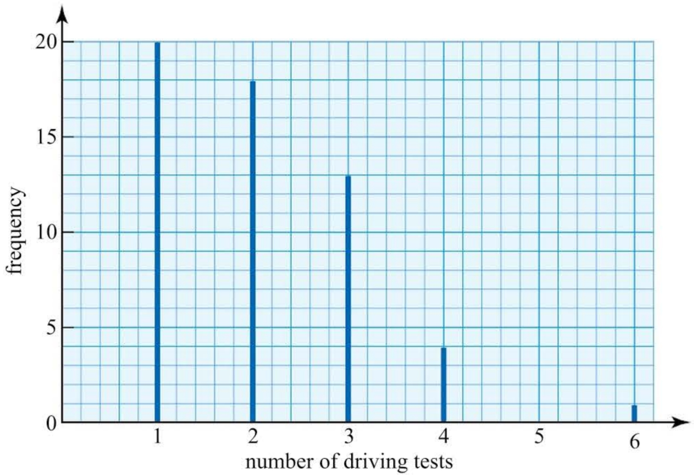

(i) Find the mode, mean and median of these data.

(ii) State which of these you think is the most representative measure.

### 1.7 Grouped data

Grouping means putting the data into a number of classes. The number of data items falling into any class is called the  $ \underline{\text{frequency}} $ for that class.

When numerical data are grouped, each item of data falls within a class interval lying between class boundaries.

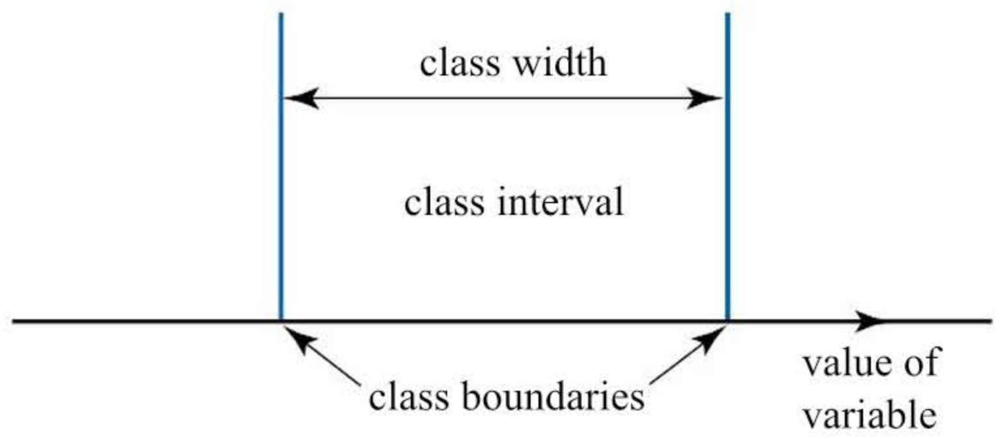

Figure 1.8

You must always be careful about the choice of class boundaries because it must be absolutely clear to which class any item belongs. A form with the following wording:

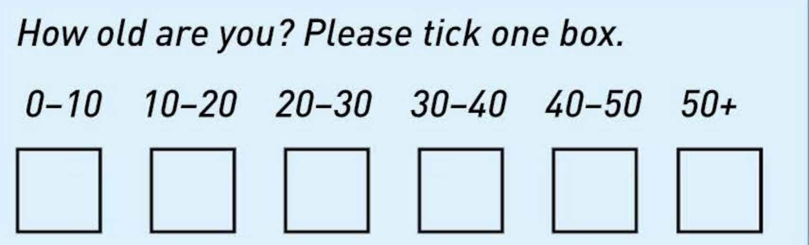

would cause problems. A ten-year-old could tick either of the first two boxes.

<!-- page 38 -->

A better form of wording would be:

How old are you (in completed years)? Please tick one box.

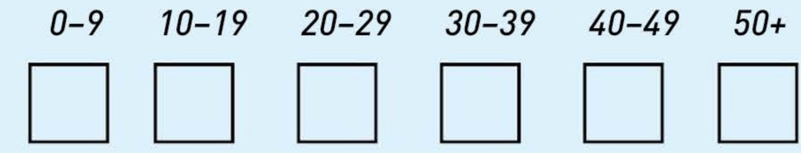

Notice that this says 'in completed years'. Otherwise a $9\frac{1}{2}$-year-old might not know which of the first two boxes to tick.

Another way of writing this is:

 $$ \begin{aligned}&0\leq\boldsymbol{A}<10\quad&10\leq\boldsymbol{A}<20\quad&20\leq\boldsymbol{A}<30\\&30\leq\boldsymbol{A}<40\quad&40\leq\boldsymbol{A}<50\quad&50\leq\boldsymbol{A}\end{aligned} $$ 

Even somebody aged 9 years and 364 days would clearly still come in the first group.

Another way of writing these classes, which you will sometimes see, is:

0-, 10-, 20-, …, 50-.

▶ What is the disadvantage of this way?

## Working with grouped data

There is often a good reason for grouping raw data.

There may be a lot of data.

▶ The data may be spread over a wide range.

» Most of the values collected may be different.

Whatever the reason, grouping data should make it easier to analyse and present a summary of findings, whether in a table or in a diagram.

For some discrete data it may not be necessary or desirable to group them. For example, a survey of the number of passengers in cars using a busy road is unlikely to produce many integer values outside the range 0 to 4 (not counting the driver). However, there are cases when grouping the data (or perhaps drawing a stem-and-leaf diagram) is an advantage.

## Discrete data

At various times during one week the number of cars passing a survey point was noted. Each item of data relates to the number of cars passing during a five-minute period. A hundred such periods were surveyed. The data is summarised in the following frequency table.

<!-- page 39 -->

<table border=1 style='margin: auto; word-wrap: break-word;'><tr><td style='text-align: center; word-wrap: break-word;'>Number of cars, x</td><td style='text-align: center; word-wrap: break-word;'>Frequency, f</td></tr><tr><td style='text-align: center; word-wrap: break-word;'>0-9</td><td style='text-align: center; word-wrap: break-word;'>5</td></tr><tr><td style='text-align: center; word-wrap: break-word;'>10-19</td><td style='text-align: center; word-wrap: break-word;'>8</td></tr><tr><td style='text-align: center; word-wrap: break-word;'>20-29</td><td style='text-align: center; word-wrap: break-word;'>13</td></tr><tr><td style='text-align: center; word-wrap: break-word;'>30-39</td><td style='text-align: center; word-wrap: break-word;'>20</td></tr><tr><td style='text-align: center; word-wrap: break-word;'>40-49</td><td style='text-align: center; word-wrap: break-word;'>22</td></tr><tr><td style='text-align: center; word-wrap: break-word;'>50-59</td><td style='text-align: center; word-wrap: break-word;'>21</td></tr><tr><td style='text-align: center; word-wrap: break-word;'>60-70</td><td style='text-align: center; word-wrap: break-word;'>11</td></tr><tr><td style='text-align: center; word-wrap: break-word;'>Total</td><td style='text-align: center; word-wrap: break-word;'>100</td></tr></table>

From the frequency table you can see there is a slight negative (or left) skew.

## Estimating the mean

When data are grouped the individual values are lost. This is not often a serious problem; as long as the data are reasonably distributed throughout each interval it is possible to  $ \underline{\text{estimate}} $ statistics such as the mean, knowing that your answers will be reasonably accurate.

To estimate the mean you first assume that all the values in an interval are equally spaced about a midpoint. The midpoints are taken as representative values of the intervals.

The mid-value for the interval 0-9 is  $ \frac{0+9}{2}=4.5 $.

The mid-value for the interval 10-19 is  $ \frac{10+19}{2}=14.5 $, and so on.

The  $ x \times f $ column can now be added to the frequency distribution table and an estimate for the mean found.

<table border=1 style='margin: auto; word-wrap: break-word;'><tr><td style='text-align: center; word-wrap: break-word;'>Number of cars,  $ x $ (mid-values)</td><td style='text-align: center; word-wrap: break-word;'>Frequency,  $ f $</td><td style='text-align: center; word-wrap: break-word;'>$ x \times f $</td></tr><tr><td style='text-align: center; word-wrap: break-word;'>4.5</td><td style='text-align: center; word-wrap: break-word;'>5</td><td style='text-align: center; word-wrap: break-word;'>$ 4.5 \times 5 = 22.5 $</td></tr><tr><td style='text-align: center; word-wrap: break-word;'>14.5</td><td style='text-align: center; word-wrap: break-word;'>8</td><td style='text-align: center; word-wrap: break-word;'>$ 14.5 \times 8 = 116.0 $</td></tr><tr><td style='text-align: center; word-wrap: break-word;'>24.5</td><td style='text-align: center; word-wrap: break-word;'>13</td><td style='text-align: center; word-wrap: break-word;'>318.5</td></tr><tr><td style='text-align: center; word-wrap: break-word;'>34.5</td><td style='text-align: center; word-wrap: break-word;'>20</td><td style='text-align: center; word-wrap: break-word;'>690.0</td></tr><tr><td style='text-align: center; word-wrap: break-word;'>44.5</td><td style='text-align: center; word-wrap: break-word;'>22</td><td style='text-align: center; word-wrap: break-word;'>979.0</td></tr><tr><td style='text-align: center; word-wrap: break-word;'>54.5</td><td style='text-align: center; word-wrap: break-word;'>21</td><td style='text-align: center; word-wrap: break-word;'>1144.5</td></tr><tr><td style='text-align: center; word-wrap: break-word;'>65.0</td><td style='text-align: center; word-wrap: break-word;'>11</td><td style='text-align: center; word-wrap: break-word;'>715.0</td></tr><tr><td style='text-align: center; word-wrap: break-word;'>Totals</td><td style='text-align: center; word-wrap: break-word;'>100</td><td style='text-align: center; word-wrap: break-word;'>3985.5</td></tr></table>

<!-- page 40 -->

The mean is given by:

 $$ \begin{aligned}\overline{x}&=\frac{\sum xf}{\sum f}\\&=\frac{3985.5}{100}=39.855\end{aligned} $$ 

The original raw data, summarised in the frequency table on the previous page, are shown below.

<table border=1 style='margin: auto; word-wrap: break-word;'><tr><td style='text-align: center; word-wrap: break-word;'>10</td><td style='text-align: center; word-wrap: break-word;'>18</td><td style='text-align: center; word-wrap: break-word;'>68</td><td style='text-align: center; word-wrap: break-word;'>67</td><td style='text-align: center; word-wrap: break-word;'>25</td><td style='text-align: center; word-wrap: break-word;'>62</td><td style='text-align: center; word-wrap: break-word;'>49</td><td style='text-align: center; word-wrap: break-word;'>11</td><td style='text-align: center; word-wrap: break-word;'>12</td><td style='text-align: center; word-wrap: break-word;'>8</td></tr><tr><td style='text-align: center; word-wrap: break-word;'>9</td><td style='text-align: center; word-wrap: break-word;'>46</td><td style='text-align: center; word-wrap: break-word;'>53</td><td style='text-align: center; word-wrap: break-word;'>57</td><td style='text-align: center; word-wrap: break-word;'>30</td><td style='text-align: center; word-wrap: break-word;'>63</td><td style='text-align: center; word-wrap: break-word;'>34</td><td style='text-align: center; word-wrap: break-word;'>21</td><td style='text-align: center; word-wrap: break-word;'>68</td><td style='text-align: center; word-wrap: break-word;'>31</td></tr><tr><td style='text-align: center; word-wrap: break-word;'>20</td><td style='text-align: center; word-wrap: break-word;'>16</td><td style='text-align: center; word-wrap: break-word;'>29</td><td style='text-align: center; word-wrap: break-word;'>13</td><td style='text-align: center; word-wrap: break-word;'>31</td><td style='text-align: center; word-wrap: break-word;'>56</td><td style='text-align: center; word-wrap: break-word;'>9</td><td style='text-align: center; word-wrap: break-word;'>34</td><td style='text-align: center; word-wrap: break-word;'>45</td><td style='text-align: center; word-wrap: break-word;'>55</td></tr><tr><td style='text-align: center; word-wrap: break-word;'>35</td><td style='text-align: center; word-wrap: break-word;'>40</td><td style='text-align: center; word-wrap: break-word;'>45</td><td style='text-align: center; word-wrap: break-word;'>48</td><td style='text-align: center; word-wrap: break-word;'>54</td><td style='text-align: center; word-wrap: break-word;'>50</td><td style='text-align: center; word-wrap: break-word;'>34</td><td style='text-align: center; word-wrap: break-word;'>32</td><td style='text-align: center; word-wrap: break-word;'>47</td><td style='text-align: center; word-wrap: break-word;'>60</td></tr><tr><td style='text-align: center; word-wrap: break-word;'>70</td><td style='text-align: center; word-wrap: break-word;'>52</td><td style='text-align: center; word-wrap: break-word;'>21</td><td style='text-align: center; word-wrap: break-word;'>25</td><td style='text-align: center; word-wrap: break-word;'>53</td><td style='text-align: center; word-wrap: break-word;'>41</td><td style='text-align: center; word-wrap: break-word;'>29</td><td style='text-align: center; word-wrap: break-word;'>63</td><td style='text-align: center; word-wrap: break-word;'>43</td><td style='text-align: center; word-wrap: break-word;'>50</td></tr><tr><td style='text-align: center; word-wrap: break-word;'>40</td><td style='text-align: center; word-wrap: break-word;'>48</td><td style='text-align: center; word-wrap: break-word;'>45</td><td style='text-align: center; word-wrap: break-word;'>38</td><td style='text-align: center; word-wrap: break-word;'>51</td><td style='text-align: center; word-wrap: break-word;'>25</td><td style='text-align: center; word-wrap: break-word;'>52</td><td style='text-align: center; word-wrap: break-word;'>55</td><td style='text-align: center; word-wrap: break-word;'>47</td><td style='text-align: center; word-wrap: break-word;'>46</td></tr><tr><td style='text-align: center; word-wrap: break-word;'>46</td><td style='text-align: center; word-wrap: break-word;'>50</td><td style='text-align: center; word-wrap: break-word;'>8</td><td style='text-align: center; word-wrap: break-word;'>25</td><td style='text-align: center; word-wrap: break-word;'>56</td><td style='text-align: center; word-wrap: break-word;'>18</td><td style='text-align: center; word-wrap: break-word;'>20</td><td style='text-align: center; word-wrap: break-word;'>36</td><td style='text-align: center; word-wrap: break-word;'>36</td><td style='text-align: center; word-wrap: break-word;'>9</td></tr><tr><td style='text-align: center; word-wrap: break-word;'>38</td><td style='text-align: center; word-wrap: break-word;'>39</td><td style='text-align: center; word-wrap: break-word;'>53</td><td style='text-align: center; word-wrap: break-word;'>45</td><td style='text-align: center; word-wrap: break-word;'>42</td><td style='text-align: center; word-wrap: break-word;'>42</td><td style='text-align: center; word-wrap: break-word;'>61</td><td style='text-align: center; word-wrap: break-word;'>55</td><td style='text-align: center; word-wrap: break-word;'>30</td><td style='text-align: center; word-wrap: break-word;'>38</td></tr><tr><td style='text-align: center; word-wrap: break-word;'>62</td><td style='text-align: center; word-wrap: break-word;'>47</td><td style='text-align: center; word-wrap: break-word;'>58</td><td style='text-align: center; word-wrap: break-word;'>54</td><td style='text-align: center; word-wrap: break-word;'>59</td><td style='text-align: center; word-wrap: break-word;'>25</td><td style='text-align: center; word-wrap: break-word;'>24</td><td style='text-align: center; word-wrap: break-word;'>53</td><td style='text-align: center; word-wrap: break-word;'>42</td><td style='text-align: center; word-wrap: break-word;'>61</td></tr><tr><td style='text-align: center; word-wrap: break-word;'>18</td><td style='text-align: center; word-wrap: break-word;'>30</td><td style='text-align: center; word-wrap: break-word;'>32</td><td style='text-align: center; word-wrap: break-word;'>45</td><td style='text-align: center; word-wrap: break-word;'>49</td><td style='text-align: center; word-wrap: break-word;'>28</td><td style='text-align: center; word-wrap: break-word;'>31</td><td style='text-align: center; word-wrap: break-word;'>27</td><td style='text-align: center; word-wrap: break-word;'>54</td><td style='text-align: center; word-wrap: break-word;'>38</td></tr></table>

In this form it is impossible to get an overview of the number of cars, nor would listing every possible value in a frequency table (0 to 70) be helpful.

However, grouping the data and estimating the mean was not the only option. Drawing a stem-and-leaf diagram and using it to find the median would have been another possibility.

Is it possible to find estimates for the other measures of centre?

Find the mean of the original data and compare it to the estimate.

The data the reporter collected when researching his article on cycling accidents included the distance from home, in metres, of those involved in cycling accidents. In full these were as follows.

<table border=1 style='margin: auto; word-wrap: break-word;'><tr><td style='text-align: center; word-wrap: break-word;'>3000</td><td style='text-align: center; word-wrap: break-word;'>75</td><td style='text-align: center; word-wrap: break-word;'>1200</td><td style='text-align: center; word-wrap: break-word;'>300</td><td style='text-align: center; word-wrap: break-word;'>50</td><td style='text-align: center; word-wrap: break-word;'>10</td><td style='text-align: center; word-wrap: break-word;'>150</td><td style='text-align: center; word-wrap: break-word;'>1500</td><td style='text-align: center; word-wrap: break-word;'>250</td><td style='text-align: center; word-wrap: break-word;'>25</td></tr><tr><td style='text-align: center; word-wrap: break-word;'>200</td><td style='text-align: center; word-wrap: break-word;'>4500</td><td style='text-align: center; word-wrap: break-word;'>35</td><td style='text-align: center; word-wrap: break-word;'>60</td><td style='text-align: center; word-wrap: break-word;'>120</td><td style='text-align: center; word-wrap: break-word;'>400</td><td style='text-align: center; word-wrap: break-word;'>2400</td><td style='text-align: center; word-wrap: break-word;'>140</td><td style='text-align: center; word-wrap: break-word;'>45</td><td style='text-align: center; word-wrap: break-word;'>5</td></tr><tr><td style='text-align: center; word-wrap: break-word;'>1250</td><td style='text-align: center; word-wrap: break-word;'>3500</td><td style='text-align: center; word-wrap: break-word;'>30</td><td style='text-align: center; word-wrap: break-word;'>75</td><td style='text-align: center; word-wrap: break-word;'>250</td><td style='text-align: center; word-wrap: break-word;'>1200</td><td style='text-align: center; word-wrap: break-word;'>250</td><td style='text-align: center; word-wrap: break-word;'>50</td><td style='text-align: center; word-wrap: break-word;'>250</td><td style='text-align: center; word-wrap: break-word;'>450</td></tr><tr><td style='text-align: center; word-wrap: break-word;'>15</td><td style='text-align: center; word-wrap: break-word;'>4000</td><td style='text-align: center; word-wrap: break-word;'></td><td style='text-align: center; word-wrap: break-word;'></td><td style='text-align: center; word-wrap: break-word;'></td><td style='text-align: center; word-wrap: break-word;'></td><td style='text-align: center; word-wrap: break-word;'></td><td style='text-align: center; word-wrap: break-word;'></td><td style='text-align: center; word-wrap: break-word;'></td><td style='text-align: center; word-wrap: break-word;'></td></tr></table>

It is clear that there is considerable spread in the data. It is continuous data and the reporter is aware that they appear to have been rounded but he does not know to what level of precision. Consequently there is no way of reflecting the level of precision in setting the interval boundaries.

<!-- page 41 -->

The reporter wants to estimate the mean and decides on the following grouping.

<table border=1 style='margin: auto; word-wrap: break-word;'><tr><td style='text-align: center; word-wrap: break-word;'>Location relative to home</td><td style='text-align: center; word-wrap: break-word;'>Distance,  $ d $, in metres</td><td style='text-align: center; word-wrap: break-word;'>Distance mid-value, x</td><td style='text-align: center; word-wrap: break-word;'>Frequency (number of accidents), f</td><td style='text-align: center; word-wrap: break-word;'>x  $ \times $ f</td></tr><tr><td style='text-align: center; word-wrap: break-word;'>Very close</td><td style='text-align: center; word-wrap: break-word;'>0 ≤ d &lt; 100</td><td style='text-align: center; word-wrap: break-word;'>50</td><td style='text-align: center; word-wrap: break-word;'>12</td><td style='text-align: center; word-wrap: break-word;'>600</td></tr><tr><td style='text-align: center; word-wrap: break-word;'>Close</td><td style='text-align: center; word-wrap: break-word;'>100 ≤ d &lt; 500</td><td style='text-align: center; word-wrap: break-word;'>300</td><td style='text-align: center; word-wrap: break-word;'>11</td><td style='text-align: center; word-wrap: break-word;'>3300</td></tr><tr><td style='text-align: center; word-wrap: break-word;'>Not far</td><td style='text-align: center; word-wrap: break-word;'>500 ≤ d &lt; 1500</td><td style='text-align: center; word-wrap: break-word;'>1000</td><td style='text-align: center; word-wrap: break-word;'>3</td><td style='text-align: center; word-wrap: break-word;'>3000</td></tr><tr><td style='text-align: center; word-wrap: break-word;'>Quite far</td><td style='text-align: center; word-wrap: break-word;'>1500 ≤ d &lt; 5000</td><td style='text-align: center; word-wrap: break-word;'>3250</td><td style='text-align: center; word-wrap: break-word;'>6</td><td style='text-align: center; word-wrap: break-word;'>19500</td></tr><tr><td style='text-align: center; word-wrap: break-word;'>Totals</td><td style='text-align: center; word-wrap: break-word;'></td><td style='text-align: center; word-wrap: break-word;'></td><td style='text-align: center; word-wrap: break-word;'>32</td><td style='text-align: center; word-wrap: break-word;'>26400</td></tr></table>

 $$ \overline{x}=\frac{26400}{32}=825m $$ 

A summary of the measures of centre for the original and grouped accident data is given below.

<table border=1 style='margin: auto; word-wrap: break-word;'><tr><td style='text-align: center; word-wrap: break-word;'></td><td style='text-align: center; word-wrap: break-word;'>Raw data</td><td style='text-align: center; word-wrap: break-word;'>Grouped data</td></tr><tr><td style='text-align: center; word-wrap: break-word;'>Mean</td><td style='text-align: center; word-wrap: break-word;'>25785 \div 32 = 806m</td><td style='text-align: center; word-wrap: break-word;'>825m</td></tr><tr><td style='text-align: center; word-wrap: break-word;'>Mode</td><td style='text-align: center; word-wrap: break-word;'>250m</td><td style='text-align: center; word-wrap: break-word;'>Modal group  $ 0 ≤ d &lt; 100m $</td></tr><tr><td style='text-align: center; word-wrap: break-word;'>Median</td><td style='text-align: center; word-wrap: break-word;'>$ \frac{1}{2}(200 + 250) = 225m $</td><td style='text-align: center; word-wrap: break-word;'></td></tr></table>

Which measure of centre seems most appropriate for these data?

## The reporter's article

The reporter decided that he had enough information and wrote the article below.

## A town council that does not care

The level of civilisation of any society can be measured by how much it cares for its most vulnerable members.

On that basis our town council rates somewhere between savages and barbarians. Every day they sit back complacently while those least able to defend themselves, the very old and the very young, run the gauntlet of our treacherous streets.

I refer of course to the lack of adequate safety measures for our cyclists, 60% of whom are children or senior citizens. Statistics show that they only have to put one wheel outside their front doors to be in mortal danger. 80% of cycling accidents happen within 1500 metres of home.

Last week Rita Roy became the latest unwitting addition to these statistics. Luckily she is now on the road to recovery but that is no thanks to the members of our unfeeling town council who set people on the road to death and injury without a second thought.

What, this paper asks our councillors, are you doing about providing safe cycle tracks from our housing estates to our schools and shopping centres? And what are you doing to promote safety awareness among our cyclists, young and old?

Answer: Nothing.

<!-- page 42 -->

Is it a fair article?

Is it justified, based on the available evidence?

## Continuous data

For a statistics project Robert, a student at Avonford College, collected the heights of 50 female students.

He constructed a frequency table for his project and included the calculations to find an estimate for the mean of his data.

<table border=1 style='margin: auto; word-wrap: break-word;'><tr><td style='text-align: center; word-wrap: break-word;'>Height, h</td><td style='text-align: center; word-wrap: break-word;'>Mid-value, x</td><td style='text-align: center; word-wrap: break-word;'>Frequency, f</td><td style='text-align: center; word-wrap: break-word;'>xf</td></tr><tr><td style='text-align: center; word-wrap: break-word;'>$ 157 &lt; h ≤ 159 $</td><td style='text-align: center; word-wrap: break-word;'>158</td><td style='text-align: center; word-wrap: break-word;'>4</td><td style='text-align: center; word-wrap: break-word;'>632</td></tr><tr><td style='text-align: center; word-wrap: break-word;'>$ 159 &lt; h ≤ 161 $</td><td style='text-align: center; word-wrap: break-word;'>160</td><td style='text-align: center; word-wrap: break-word;'>11</td><td style='text-align: center; word-wrap: break-word;'>1760</td></tr><tr><td style='text-align: center; word-wrap: break-word;'>$ 161 &lt; h ≤ 163 $</td><td style='text-align: center; word-wrap: break-word;'>162</td><td style='text-align: center; word-wrap: break-word;'>19</td><td style='text-align: center; word-wrap: break-word;'>3078</td></tr><tr><td style='text-align: center; word-wrap: break-word;'>$ 163 &lt; h ≤ 165 $</td><td style='text-align: center; word-wrap: break-word;'>164</td><td style='text-align: center; word-wrap: break-word;'>8</td><td style='text-align: center; word-wrap: break-word;'>1312</td></tr><tr><td style='text-align: center; word-wrap: break-word;'>$ 165 &lt; h ≤ 167 $</td><td style='text-align: center; word-wrap: break-word;'>166</td><td style='text-align: center; word-wrap: break-word;'>5</td><td style='text-align: center; word-wrap: break-word;'>830</td></tr><tr><td style='text-align: center; word-wrap: break-word;'>$ 167 &lt; h ≤ 169 $</td><td style='text-align: center; word-wrap: break-word;'>168</td><td style='text-align: center; word-wrap: break-word;'>3</td><td style='text-align: center; word-wrap: break-word;'>504</td></tr><tr><td style='text-align: center; word-wrap: break-word;'>Totals</td><td style='text-align: center; word-wrap: break-word;'></td><td style='text-align: center; word-wrap: break-word;'>50</td><td style='text-align: center; word-wrap: break-word;'>8116</td></tr></table>

 $$ \begin{aligned}\overline{x}&=\frac{8116}{50}\\&=162.32\end{aligned} $$ 

## Note: Class boundaries

His teacher was concerned about the class boundaries and asked Robert 'To what degree of accuracy have you recorded your data?' Robert told him 'I rounded all my data to the nearest centimetre'. Robert showed his teacher his raw data.

<table border=1 style='margin: auto; word-wrap: break-word;'><tr><td style='text-align: center; word-wrap: break-word;'>163</td><td style='text-align: center; word-wrap: break-word;'>160</td><td style='text-align: center; word-wrap: break-word;'>167</td><td style='text-align: center; word-wrap: break-word;'>168</td><td style='text-align: center; word-wrap: break-word;'>166</td><td style='text-align: center; word-wrap: break-word;'>164</td><td style='text-align: center; word-wrap: break-word;'>166</td><td style='text-align: center; word-wrap: break-word;'>162</td><td style='text-align: center; word-wrap: break-word;'>163</td><td style='text-align: center; word-wrap: break-word;'>163</td></tr><tr><td style='text-align: center; word-wrap: break-word;'>165</td><td style='text-align: center; word-wrap: break-word;'>163</td><td style='text-align: center; word-wrap: break-word;'>163</td><td style='text-align: center; word-wrap: break-word;'>159</td><td style='text-align: center; word-wrap: break-word;'>159</td><td style='text-align: center; word-wrap: break-word;'>158</td><td style='text-align: center; word-wrap: break-word;'>162</td><td style='text-align: center; word-wrap: break-word;'>163</td><td style='text-align: center; word-wrap: break-word;'>163</td><td style='text-align: center; word-wrap: break-word;'>166</td></tr><tr><td style='text-align: center; word-wrap: break-word;'>164</td><td style='text-align: center; word-wrap: break-word;'>162</td><td style='text-align: center; word-wrap: break-word;'>164</td><td style='text-align: center; word-wrap: break-word;'>160</td><td style='text-align: center; word-wrap: break-word;'>161</td><td style='text-align: center; word-wrap: break-word;'>162</td><td style='text-align: center; word-wrap: break-word;'>162</td><td style='text-align: center; word-wrap: break-word;'>160</td><td style='text-align: center; word-wrap: break-word;'>169</td><td style='text-align: center; word-wrap: break-word;'>162</td></tr><tr><td style='text-align: center; word-wrap: break-word;'>163</td><td style='text-align: center; word-wrap: break-word;'>160</td><td style='text-align: center; word-wrap: break-word;'>167</td><td style='text-align: center; word-wrap: break-word;'>162</td><td style='text-align: center; word-wrap: break-word;'>158</td><td style='text-align: center; word-wrap: break-word;'>161</td><td style='text-align: center; word-wrap: break-word;'>162</td><td style='text-align: center; word-wrap: break-word;'>163</td><td style='text-align: center; word-wrap: break-word;'>165</td><td style='text-align: center; word-wrap: break-word;'>165</td></tr><tr><td style='text-align: center; word-wrap: break-word;'>163</td><td style='text-align: center; word-wrap: break-word;'>163</td><td style='text-align: center; word-wrap: break-word;'>168</td><td style='text-align: center; word-wrap: break-word;'>165</td><td style='text-align: center; word-wrap: break-word;'>165</td><td style='text-align: center; word-wrap: break-word;'>161</td><td style='text-align: center; word-wrap: break-word;'>160</td><td style='text-align: center; word-wrap: break-word;'>161</td><td style='text-align: center; word-wrap: break-word;'>161</td><td style='text-align: center; word-wrap: break-word;'>161</td></tr></table>

Robert's teacher said that the class boundaries should have been:

 $$ \begin{aligned}&157.5\leq h<159.5\\&159.5\leq h<161.5,and so on.\end{aligned} $$ 

He explained that a height recorded to the nearest centimetre as 158 cm has a value in the interval $158 \pm 0.5$ cm (this can be written as $157.5 \leq h < 158.5$). Similarly the actual values of those recorded as 159 cm lie in the interval $158.5 \leq h < 159.5$. So, the interval $157.5 \leq h < 159.5$ covers the actual values of the data items 158 and 159. The interval $159.5 \leq h < 161.5$ covers the actual values of 160 and 161, and so on.

<!-- page 43 -->

What adjustment does Robert need to make to his estimated mean in the light of his teacher's comments?

Find the mean of the raw data. What do you notice when you compare it with your estimate?

You are not always told the level of precision of summarised data and the class widths are not always equal, as the reporter for the local newspaper discovered. Also, there are different ways of representing class boundaries, as the following example illustrates.

### Example 1.4

The frequency distribution shows the lengths of telephone calls made by Emily during August. Choose suitable mid-class values and estimate Emily's mean call time for August.

## Solution

<table border=1 style='margin: auto; word-wrap: break-word;'><tr><td style='text-align: center; word-wrap: break-word;'>Time (seconds)</td><td style='text-align: center; word-wrap: break-word;'>Mid-value, x</td><td style='text-align: center; word-wrap: break-word;'>Frequency, f</td><td style='text-align: center; word-wrap: break-word;'>xf</td></tr><tr><td style='text-align: center; word-wrap: break-word;'>0-</td><td style='text-align: center; word-wrap: break-word;'>30</td><td style='text-align: center; word-wrap: break-word;'>39</td><td style='text-align: center; word-wrap: break-word;'>1170</td></tr><tr><td style='text-align: center; word-wrap: break-word;'>60-</td><td style='text-align: center; word-wrap: break-word;'>90</td><td style='text-align: center; word-wrap: break-word;'>15</td><td style='text-align: center; word-wrap: break-word;'>1350</td></tr><tr><td style='text-align: center; word-wrap: break-word;'>120-</td><td style='text-align: center; word-wrap: break-word;'>150</td><td style='text-align: center; word-wrap: break-word;'>12</td><td style='text-align: center; word-wrap: break-word;'>1800</td></tr><tr><td style='text-align: center; word-wrap: break-word;'>180-</td><td style='text-align: center; word-wrap: break-word;'>240</td><td style='text-align: center; word-wrap: break-word;'>8</td><td style='text-align: center; word-wrap: break-word;'>1920</td></tr><tr><td style='text-align: center; word-wrap: break-word;'>300-</td><td style='text-align: center; word-wrap: break-word;'>400</td><td style='text-align: center; word-wrap: break-word;'>4</td><td style='text-align: center; word-wrap: break-word;'>1600</td></tr><tr><td style='text-align: center; word-wrap: break-word;'>500-1000</td><td style='text-align: center; word-wrap: break-word;'>750</td><td style='text-align: center; word-wrap: break-word;'>1</td><td style='text-align: center; word-wrap: break-word;'>750</td></tr><tr><td style='text-align: center; word-wrap: break-word;'>Totals</td><td style='text-align: center; word-wrap: break-word;'></td><td style='text-align: center; word-wrap: break-word;'>79</td><td style='text-align: center; word-wrap: break-word;'>8590</td></tr></table>

 $$ \begin{aligned}\overline{x}&=\frac{8590}{79}\\&=108.7seconds\end{aligned} $$ 

Emily's mean call time is 109 seconds, to 3 significant figures.

## Notes

The interval '0-'can be written as $0 \leq x < 60$, the interval '60-'can be written as $60 \leq x < 120$, and so on, up to '500-1000', which can be written as $500 \leq x \leq 1000$.

2 There is no indication of the level of precision of the recorded data. They may have been recorded to the nearest second.

3 The class widths vary.

<!-- page 44 -->

1 A college nurse keeps a record of the heights, measured to the nearest centimetre, of a group of students she treats.

Her data are summarised in the following grouped frequency table.

<table border=1 style='margin: auto; word-wrap: break-word;'><tr><td style='text-align: center; word-wrap: break-word;'>Height (cm)</td><td style='text-align: center; word-wrap: break-word;'>Number of students</td></tr><tr><td style='text-align: center; word-wrap: break-word;'>110-119</td><td style='text-align: center; word-wrap: break-word;'>1</td></tr><tr><td style='text-align: center; word-wrap: break-word;'>120-129</td><td style='text-align: center; word-wrap: break-word;'>3</td></tr><tr><td style='text-align: center; word-wrap: break-word;'>130-139</td><td style='text-align: center; word-wrap: break-word;'>10</td></tr><tr><td style='text-align: center; word-wrap: break-word;'>140-149</td><td style='text-align: center; word-wrap: break-word;'>28</td></tr><tr><td style='text-align: center; word-wrap: break-word;'>150-159</td><td style='text-align: center; word-wrap: break-word;'>65</td></tr><tr><td style='text-align: center; word-wrap: break-word;'>160-169</td><td style='text-align: center; word-wrap: break-word;'>98</td></tr><tr><td style='text-align: center; word-wrap: break-word;'>170-179</td><td style='text-align: center; word-wrap: break-word;'>55</td></tr><tr><td style='text-align: center; word-wrap: break-word;'>180-189</td><td style='text-align: center; word-wrap: break-word;'>15</td></tr></table>

Choose suitable mid-class values and calculate an estimate for the mean height.

2 A junior school teacher noted the times to the nearest minute a group of children spent reading during a particular day.

The data are summarised as follows.

<table border=1 style='margin: auto; word-wrap: break-word;'><tr><td style='text-align: center; word-wrap: break-word;'>Time (nearest minute)</td><td style='text-align: center; word-wrap: break-word;'>Number of children</td></tr><tr><td style='text-align: center; word-wrap: break-word;'>20-29</td><td style='text-align: center; word-wrap: break-word;'>12</td></tr><tr><td style='text-align: center; word-wrap: break-word;'>30-39</td><td style='text-align: center; word-wrap: break-word;'>21</td></tr><tr><td style='text-align: center; word-wrap: break-word;'>40-49</td><td style='text-align: center; word-wrap: break-word;'>36</td></tr><tr><td style='text-align: center; word-wrap: break-word;'>50-59</td><td style='text-align: center; word-wrap: break-word;'>24</td></tr><tr><td style='text-align: center; word-wrap: break-word;'>60-69</td><td style='text-align: center; word-wrap: break-word;'>12</td></tr><tr><td style='text-align: center; word-wrap: break-word;'>70-89</td><td style='text-align: center; word-wrap: break-word;'>9</td></tr><tr><td style='text-align: center; word-wrap: break-word;'>90-119</td><td style='text-align: center; word-wrap: break-word;'>2</td></tr></table>

(i) Choose suitable mid-class values and calculate an estimate for the mean time spent reading by the pupils.

(ii) Some time later, the teacher collected similar data from a group of 25 children from a neighbouring school. She calculated the mean to be 75.5 minutes. Compare the estimate you obtained in part (i) with this value.

What assumptions must you make for the comparison to be meaningful?

<!-- page 45 -->

3 The stated ages of the 91 cyclists considered earlier are summarised by the following grouped frequency distribution.

<table border=1 style='margin: auto; word-wrap: break-word;'><tr><td style='text-align: center; word-wrap: break-word;'>Stated age (years)</td><td style='text-align: center; word-wrap: break-word;'>Frequency</td></tr><tr><td style='text-align: center; word-wrap: break-word;'>0-9</td><td style='text-align: center; word-wrap: break-word;'>13</td></tr><tr><td style='text-align: center; word-wrap: break-word;'>10-19</td><td style='text-align: center; word-wrap: break-word;'>26</td></tr><tr><td style='text-align: center; word-wrap: break-word;'>20-29</td><td style='text-align: center; word-wrap: break-word;'>16</td></tr><tr><td style='text-align: center; word-wrap: break-word;'>30-39</td><td style='text-align: center; word-wrap: break-word;'>10</td></tr><tr><td style='text-align: center; word-wrap: break-word;'>40-49</td><td style='text-align: center; word-wrap: break-word;'>6</td></tr><tr><td style='text-align: center; word-wrap: break-word;'>50-59</td><td style='text-align: center; word-wrap: break-word;'>5</td></tr><tr><td style='text-align: center; word-wrap: break-word;'>60-69</td><td style='text-align: center; word-wrap: break-word;'>14</td></tr><tr><td style='text-align: center; word-wrap: break-word;'>70-79</td><td style='text-align: center; word-wrap: break-word;'>0</td></tr><tr><td style='text-align: center; word-wrap: break-word;'>80-89</td><td style='text-align: center; word-wrap: break-word;'>1</td></tr><tr><td style='text-align: center; word-wrap: break-word;'>Total</td><td style='text-align: center; word-wrap: break-word;'>91</td></tr></table>

(i) Choose suitable mid-interval values and calculate an estimate of the mean stated age.

(ii) Make a suitable error adjustment to your answer to part (i) to give an estimate of the mean age of the cyclists.

(iii) The adjusted mean of the actual data was 30.4 years. Compare this with your answer to part (ii) and comment.

4 In an agricultural experiment, 320 plants were grown on a plot. The lengths of the stems were measured, to the nearest centimetre, 10 weeks after planting. The lengths were found to be distributed as in the following table.

<table border=1 style='margin: auto; word-wrap: break-word;'><tr><td style='text-align: center; word-wrap: break-word;'>Length, x (cm)</td><td style='text-align: center; word-wrap: break-word;'>Frequency (number of plants)</td></tr><tr><td style='text-align: center; word-wrap: break-word;'>$ 20.5 ≤ x &lt; 32.5 $</td><td style='text-align: center; word-wrap: break-word;'>30</td></tr><tr><td style='text-align: center; word-wrap: break-word;'>$ 32.5 ≤ x &lt; 38.5 $</td><td style='text-align: center; word-wrap: break-word;'>80</td></tr><tr><td style='text-align: center; word-wrap: break-word;'>$ 38.5 ≤ x &lt; 44.5 $</td><td style='text-align: center; word-wrap: break-word;'>90</td></tr><tr><td style='text-align: center; word-wrap: break-word;'>$ 44.5 ≤ x &lt; 50.5 $</td><td style='text-align: center; word-wrap: break-word;'>60</td></tr><tr><td style='text-align: center; word-wrap: break-word;'>$ 50.5 ≤ x &lt; 68.5 $</td><td style='text-align: center; word-wrap: break-word;'>60</td></tr></table>

Calculate an estimate of the mean of the stem lengths from this experiment.

<!-- page 46 -->

5 The reporter for the local newspaper considered choosing different classes for the data dealing with the cyclists who were involved in accidents. He summarised the distances from home of 32 cyclists as follows.

<table border=1 style='margin: auto; word-wrap: break-word;'><tr><td style='text-align: center; word-wrap: break-word;'>Distance,  $ d $ (metres)</td><td style='text-align: center; word-wrap: break-word;'>Frequency</td></tr><tr><td style='text-align: center; word-wrap: break-word;'>$ 0 ≤ d &lt; 50 $</td><td style='text-align: center; word-wrap: break-word;'>7</td></tr><tr><td style='text-align: center; word-wrap: break-word;'>$ 50 ≤ d &lt; 100 $</td><td style='text-align: center; word-wrap: break-word;'>5</td></tr><tr><td style='text-align: center; word-wrap: break-word;'>$ 100 ≤ d &lt; 150 $</td><td style='text-align: center; word-wrap: break-word;'>2</td></tr><tr><td style='text-align: center; word-wrap: break-word;'>$ 150 ≤ d &lt; 200 $</td><td style='text-align: center; word-wrap: break-word;'>1</td></tr><tr><td style='text-align: center; word-wrap: break-word;'>$ 200 ≤ d &lt; 300 $</td><td style='text-align: center; word-wrap: break-word;'>5</td></tr><tr><td style='text-align: center; word-wrap: break-word;'>$ 300 ≤ d &lt; 500 $</td><td style='text-align: center; word-wrap: break-word;'>3</td></tr><tr><td style='text-align: center; word-wrap: break-word;'>$ 500 ≤ d &lt; 1000 $</td><td style='text-align: center; word-wrap: break-word;'>0</td></tr><tr><td style='text-align: center; word-wrap: break-word;'>$ 1000 ≤ d &lt; 5000 $</td><td style='text-align: center; word-wrap: break-word;'>9</td></tr><tr><td style='text-align: center; word-wrap: break-word;'>Total</td><td style='text-align: center; word-wrap: break-word;'>32</td></tr></table>

(i) Choose suitable mid-class values and estimate the mean.

(ii) The mean of the raw data is 806 m and his previous grouping gave an estimate for the mean of 825 m. Compare your answer to this value and comment.

6 A crate containing 270 oranges was opened and each orange was weighed. The masses, given to the nearest gram, were grouped and the resulting distribution is as follows.

<table border=1 style='margin: auto; word-wrap: break-word;'><tr><td style='text-align: center; word-wrap: break-word;'>Mass, x (grams)</td><td style='text-align: center; word-wrap: break-word;'>Frequency (number of oranges)</td></tr><tr><td style='text-align: center; word-wrap: break-word;'>60-99</td><td style='text-align: center; word-wrap: break-word;'>20</td></tr><tr><td style='text-align: center; word-wrap: break-word;'>100-119</td><td style='text-align: center; word-wrap: break-word;'>60</td></tr><tr><td style='text-align: center; word-wrap: break-word;'>120-139</td><td style='text-align: center; word-wrap: break-word;'>80</td></tr><tr><td style='text-align: center; word-wrap: break-word;'>140-159</td><td style='text-align: center; word-wrap: break-word;'>50</td></tr><tr><td style='text-align: center; word-wrap: break-word;'>160-220</td><td style='text-align: center; word-wrap: break-word;'>60</td></tr></table>

(i) State the class boundaries for the interval 60-99.

(ii) Calculate an estimate for the mean mass of the oranges from the crate.

### 1.8 Measures of spread (variation)

In the last section you saw how an estimate for the mean can be found from grouped data. The mean is just one example of a typical value of a data set. You also saw how the mode and the median can be found from small data sets. The next chapter considers the use of the median as a typical value when dealing with grouped data and also the interquartile range as a measure of spread. In this chapter we will consider the range, the mean absolute deviation, the variance and the standard deviation as measures of spread.

<!-- page 47 -->

## Range

The simplest measure of spread is the  $ \underline{\text{range}} $. This is just the difference between the largest value in the data set (the upper extreme) and the smallest value (the lower extreme).

## ▶ Range = largest - smallest

The figures below are the prices, in cents, of a 100g jar of Nesko coffee in ten different shops.

161 161 163 163 167 168 170 172 172 172

The range for this data is:

Range = 172 - 161 = 11 cents

Example 1.5

Ruth is investigating the amount of money, in dollars, students at Avonford College earn from part-time work on one particular weekend. She collects and orders data from two classes and this is shown below.

Class 1

10 10 10 10 10 10 10 10 10 10 10 10 10 10 10 10 10 10 10 10 10 10 10 10 10 10 10 10 10 10 10 10 10 10 10 10 10 10 10 10 10 10 10 10 10 10 10 10 10 10 10 10 10 10 10 10 10 10 10 10 10 10 10 10 10 10 10 10 10 10 10 10 10 10 10 10 10 10 10 10 10 10 10 10 10 10 10 10 10 10 10 10 10 10 10 10 10 10 10 10 10 10 10 10 10 10 10 10 10 10 10 10 10 10 10 10 10 10 10 10 10 10 10 10 10 10 10 10 10 10 10 10 10 10 10 10 10 10 10 10 10 10 10 10 10 10 10 10 10 10 10 10 10 10 10 10 10 10 10 10 10 10 10 10 10 10 10 10 10 10 10 10 10 10 10 10 10 10 10 10 10 10 10 10 10 10 10 10 10 10 10 10 10 10 10 10 10 10 10 10 10 10 10 10 10 10 10 10 10 10 10 10 10 10 10 10 10 10 10 10 10 10 10 10 10 10 10 10 10 10 10 10 10 10 10 10 10 10 10 10 10 10 10 10 10 10 10 10 10 10 10 10 10 10 10 10 10 10 10 10 10 10 10 10 10 10 10 10 10 10 10 10 10 10 10 10 10 10 10 10 10 10 10 10 10 10 10 10 10 10 10 10 10 10 10 10 10 10 10 10 10 10 10 10 10 10 10 10 10 10 10 10 10 10 10 10 10 10 10 10 10 10 10 10 10 10 10 10 10 10 10 10 10 10 10 10 10 10 10 10 10 10 10 10 10 10 10 10 10 10 10 10 10 10 10 10 10 10 10 10 10 10 10 10 10 10 10 10 10 10 10 10 10 10 10 10 10 10 10 10 10 10 10 10 10 10 10 10 10 10 10 10 10 10 10 10 10 10 10 10 10 10 10 10 10 10 10 10 10 10 10 10 10 10 10 10 10 10 10 10 10 10 10 10 10 10 10 10 10 10 10 10 10 10 10 10 10 10 10 10 10 10 10 10 10 10 10 10 10 10 10 10 10 10 10 10 10 10 10 10 10 10 10 10 10 10 10 10 10 10 10 10 10 10 10 10 10 10 10 10 10 10 10 10 10 10 10 10 10 10 10 10 10 10 10 10 10 10 10 10 10 10 10 10 10 10 10 10 10 10 10 10 10 10 10 10 10 10 10 10 10 10 10 10 10 10 10 10 10 10 10 10 10 10 10 10 10 10 10 10 10 10 10 10 10 10 10 10 10 10 10 10 10 10 10 10 10 10 10 10 10 10 10 10 10 10 10 10 10 10 10 10 10 10 10 10 10 10 10 10 10 10 10 10 10 10 10 10 10 10 10 10 10 10 10 10 10 10 10 10 10 10 10 10 10 10 10 10 10 10 10 10 10 10 10 10 10 10 10 10 10 10 10 10 10 10 10 10 10 10 10 10 10 10 10 10 10 10 10 10 10 10 10 10 10 10 10 10 10 10 10 10 10 10 10 10 10 10 10 10 10 10 10 10 10 10 10 10 10 10 10 10 10 10 10 10 10 10 10 10 10 10 10 10 10 10 10 10 10 10 10 10 10 10 10 10 10 10 10 10 10 10 10 10 10 10 10 10 10 10 10 10 10 10 10 10 10 10 10 10 10 10 10 10 10 10 10 10 10 10 10 10 10 10 10 10 10 10 10 10 10 10 10 10 10 10 10 10 10 10 10 10 10 10 10 10 10 10 10 10 10 10 10 10 10 10 10 10 10 10 10 10 10 10 10 10 10 10 10 10 10 10 10 10 10 10 10 10 10 10 10 10 10 10 10 10 10 10 10 10 10 10 10 10 10 10 10 10 10 10 10 10 10 10 10 10 10 10 10 10 10 10 10 10 10 10 10 10 10 10 10 10 10 10 10 10 10 10 10 10 10 10 10 10 10 10 10 10 10 10 10 10 10 10 10 10 10 10 10 10 10 10 10 10 10 10 10 10 10 10 10 10 10 10 10 10 10 10 10 10 10 10 10 10 10 10 10 10 10 10 10 10 10 10 10 10 10 10 10 10 10 10 10 10 10 10 10 10 10 10 10 10 10 10 10 10 10 10 10 10 10 10 10 10 10 10 10 10 10 10 10 10 10 10 10 10 10 10 10 10 10 10 10 10 10 10 10 10 10 10 10 10 10 10 10 10 10 10 10 10 10 10 10 10 10 10 10 10 10 10 10 10 10 10 10 10 10 10 10 10 10 10 10 10 10 10 10 10 10 10 10 10 10 10 10 10 10 10 10 10 10 10 10 10 10 10 10 10 10 10 10 10 10 10 10 10 10 10 10 10 10 10 10 10 10 10 10 10 10 10 10 10 10 10 10 10 10 10 10 10 10 10 10 10 10 10 10 10 10 10 10 10 10 10 10 10 10 10 10 10 10 10 10 10 10 10 10 10 10 10 10 10 10 10 10 10 10 10 10 10 10 10 10 10 10 10 10 10 10 10 10 10 10 10 10 10 10 10 10 10 10 10 10 10 10 10 10 10 10 10 10 10 10 10 10 10 10 10 10 10 10 10 10 10 10 10 10 10 10 10 10 10 10 10 10 10 10 10 10 10 10 10 10 10 10 10 10 10 10 10 10 10 10 10 10 10 10 10 10 10 10 10 10 10 10 10 10 10 10 10 10 10 10 10 10 10 10 10 10 10 10 10 10 10 10 10 10 10 10 10 10 10 10 10 10 10 10 10 10 10 10 10 10 10 10 10 10 10 10 10 10 10 10 10 10 10 10 10 10 10 10 10 10 10 10 10 10 10 10 10 10 10 10 10 10 10 10 10 10 10 10 10 10 10 10 10 10 10 10 10 10 10 10 10 10 10 10 10 10 10 10 10 10 10 10 10 10 10 10 10 10 10 10 10 10 10 10 10 10 10 10 10 10 10 10 10 10 10 10 10 10 10 10 10 10 10 10 10 10 10 10 10 10 10 10 10 10 10 10 10 10 10 10 10 10 10 10 10 10 10 10 10 10 10 10 10 10 10 10 10 10 10 10 10 10 10 10 10 10 10 10 10 10 10 10 10 10 10 10 10 10 10 10 10 10 10 10 10 10 10 10 10 10 10 

She calculates the mean amount earned for each class. Her results are:

Class 1:

 $$ \overline{x}_{1}=\19.50 $$ 

Class 2:

 $$ \overline{x}_{2}=\16.22 $$ 

She concludes that the students in Class 1 each earn about $3 more, on average, than the students in Class 2.

Her teacher suggests she look at the spread of the data. What further information does this reveal?

## Solution

Ruth calculates the range for each class:  $ \text{Range (Class 1)} = \80 $

 $ \text{Range (Class 2)} = \25 $

She concludes that the part-time earnings in Class 1 are much more spread out.

However, when Ruth looks again at the raw data she notices that one student in Class 1 earned $90, considerably more than anybody else. If that item of data is ignored then the spread of data for the two classes is similar.

<!-- page 48 -->

One of the problems with the range is that it is prone to the effect of extreme values.

Calculate the mean earnings of Class 1 with the item $90 removed.

What can you conclude about the effect of extreme values on the mean?

The range does not use all of the available information; only the extreme values are used. In quality control this can be an advantage as it is very sensitive to something going wrong on a production line. Also the range is easy to calculate. However, usually we want a measure of spread that uses all the available data and that relates to a central value.

## The mean absolute deviation

Kim and Joe play as strikers for two local football teams. They are being considered for the state team. The team manager is considering their scoring records.

Kim's scoring record over ten matches looks like this:

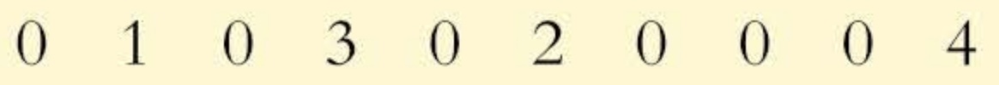

Joe's record looks like this:

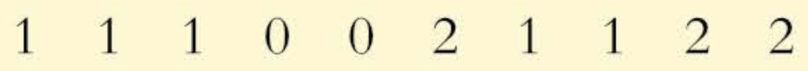

The mean scores are, for Kim,  $ \overline{x}_{1}=1 $ and, for Joe,  $ \overline{x}_{2}=1.1 $.

Looking first at Kim's data consider the differences, or deviations, of his scores from the mean.

<table border=1 style='margin: auto; word-wrap: break-word;'><tr><td style='text-align: center; word-wrap: break-word;'>Number of goals scored, x</td><td style='text-align: center; word-wrap: break-word;'>0</td><td style='text-align: center; word-wrap: break-word;'>1</td><td style='text-align: center; word-wrap: break-word;'>0</td><td style='text-align: center; word-wrap: break-word;'>3</td><td style='text-align: center; word-wrap: break-word;'>0</td><td style='text-align: center; word-wrap: break-word;'>2</td><td style='text-align: center; word-wrap: break-word;'>0</td><td style='text-align: center; word-wrap: break-word;'>0</td><td style='text-align: center; word-wrap: break-word;'>0</td><td style='text-align: center; word-wrap: break-word;'>4</td></tr><tr><td style='text-align: center; word-wrap: break-word;'>Deviations  $ (x - \bar{x}) $</td><td style='text-align: center; word-wrap: break-word;'>-1</td><td style='text-align: center; word-wrap: break-word;'>0</td><td style='text-align: center; word-wrap: break-word;'>-1</td><td style='text-align: center; word-wrap: break-word;'>2</td><td style='text-align: center; word-wrap: break-word;'>-1</td><td style='text-align: center; word-wrap: break-word;'>1</td><td style='text-align: center; word-wrap: break-word;'>-1</td><td style='text-align: center; word-wrap: break-word;'>-1</td><td style='text-align: center; word-wrap: break-word;'>-1</td><td style='text-align: center; word-wrap: break-word;'>3</td></tr></table>

To find a summary measure you need to combine the deviations in some way. If you just add them together they total zero.

## Why does the sum of the deviations always total zero?

The mean absolute deviation ignores the signs and adds together the absolute deviations. The symbol  $ |d| $ tells you to take the positive, or absolute, value of d.

For example |-2|=2 and |2|=2.

<!-- page 49 -->

It is now possible to sum the deviations:

 $$ \begin{aligned}1+0+1+2+1+1+1+1+1+3=12,\end{aligned} $$ 

the total of the absolute deviations.

It is important that any measure of spread is not linked to the sample size so you have to average out this total by dividing by the sample size.

In this case the sample size is 10. The mean absolute deviation =  $ \frac{12}{10} = 1.2 $.

The mean absolute deviation from the mean $=\frac{1}{n}\sum|x-\overline{x}|$

For Joe's data the mean absolute deviation is:

Remember

$n=\Sigma f.$

 $$ \frac{1}{10}(0.1+0.1+0.1+1.1+1.1+0.9+0.1+0.1+0.9+0.9)=0.54 $$ 

The average numbers of goals scored by Kim and Joe are similar (1.0 and 1.1) but Joe is less variable (or more consistent) in his goal scoring (0.54 compared to 1.2).

The mean absolute deviation is an acceptable measure of spread but is not widely used because it is difficult to work with. The standard deviation is more important mathematically and is more extensively used.

## The variance and standard deviation

An alternative to ignoring the signs is to square the differences or deviations. This gives rise to a measure of spread called the variance, which when square-rooted gives the standard deviation.

Though not as easy to calculate as the mean absolute deviation, the standard deviation has an important role in the study of more advanced statistics.

To find the variance of a data set:

» Square the deviations

For Kim's data this is:

▶ Sum the squared deviations

 $$ (x-\overline{x})^{2}\qquad(0-1)^{2},(1-1)^{2},(0-1)^{2},\mathrm{e t c}. $$ 

 $$ \begin{array}{r l}{\sum(x-\overline{{x}})^{2}}&{\ 1+0+1+4+1+1+}\\ &{\ 1+1+1+9=20}\end{array} $$ 

» Find their mean

 $$ \frac{\sum(x-\overline{x})^{2}}{n}\quad\frac{20}{10}=2 $$ 

This is known as the variance.

 $$ \Leftrightarrow\mathrm{Variance}=\frac{\sum(x-\overline{x})}{n} $$ 

The square root of the variance is called the standard deviation.

 $$ ↳s d=\sqrt{\frac{\sum{(x-\overline{x})^{2}}}{n}} $$ 

So, for Kim's data the variance is 2, but what are the units? In calculating the variance the data are squared. In order to get a measure of spread that has the same units as the original data it is necessary to take the square root of the variance. The resulting statistical measure is known as the standard deviation.

<!-- page 50 -->

In other books or on the internet, you may see this calculation carried out using $n-1$ rather than $n$ as the divisor. In this case the answer is denoted by $s$.

 $$ s= {\sqrt{\frac{\displaystyle \sum (x-\bar{x})^{2}} {{n - 1}}}} $$ 

In Probability & Statistics 1, you should always use n as the divisor. You will meet s if you go on to study Probability & Statistics 2.

So for Kim's data the variance is 2, sd is  $ \sqrt{2} = 1.41 $ (to 3 s.f.).

This example, using Joe's data, shows how the variance and standard deviation are calculated when the data are given in a frequency table. We've already calculated the mean;  $ \overline{x} = 1.1 $.

<table border=1 style='margin: auto; word-wrap: break-word;'><tr><td style='text-align: center; word-wrap: break-word;'>Number of goals scored, x</td><td style='text-align: center; word-wrap: break-word;'>Frequency, f</td><td style='text-align: center; word-wrap: break-word;'>Deviation  $ (x - \overline{x}) $</td><td style='text-align: center; word-wrap: break-word;'>Deviation $ ^{2} $  $ (x - \overline{x})^{2} $</td><td style='text-align: center; word-wrap: break-word;'>Deviation $ ^{2} $  $ (x - \overline{x})^{2}f $</td></tr><tr><td style='text-align: center; word-wrap: break-word;'>0</td><td style='text-align: center; word-wrap: break-word;'>2</td><td style='text-align: center; word-wrap: break-word;'>0 - 1.1 = -1.1</td><td style='text-align: center; word-wrap: break-word;'>1.21</td><td style='text-align: center; word-wrap: break-word;'>1.21 \times 2 = 2.42</td></tr><tr><td style='text-align: center; word-wrap: break-word;'>1</td><td style='text-align: center; word-wrap: break-word;'>5</td><td style='text-align: center; word-wrap: break-word;'>1 - 1.1 = -0.1</td><td style='text-align: center; word-wrap: break-word;'>0.01</td><td style='text-align: center; word-wrap: break-word;'>0.01 \times 5 = 0.05</td></tr><tr><td style='text-align: center; word-wrap: break-word;'>2</td><td style='text-align: center; word-wrap: break-word;'>3</td><td style='text-align: center; word-wrap: break-word;'>2 - 1.1 = 0.9</td><td style='text-align: center; word-wrap: break-word;'>0.81</td><td style='text-align: center; word-wrap: break-word;'>0.81 \times 3 = 2.43</td></tr><tr><td style='text-align: center; word-wrap: break-word;'>Totals</td><td style='text-align: center; word-wrap: break-word;'>10</td><td style='text-align: center; word-wrap: break-word;'></td><td style='text-align: center; word-wrap: break-word;'></td><td style='text-align: center; word-wrap: break-word;'>4.90</td></tr></table>

For data presented in this way,

 $$ \mathrm{standard~deviation}=\sqrt{\frac{\sum(x-\overline{x})^{2}f}{n}}=\sqrt{\frac{\sum(x-\overline{x})^{2}f}{\sum f}}\quad\Sigma f=n $$ 

The standard deviation for Joe's data is $sd=\sqrt{\frac{4.90}{10}}=0.7$ goals.

Comparing this to the standard deviation of Kim's data (1.41), we see that Joe's goal scoring is more consistent (or less variable) than Kim's. This confirms what was found when the mean absolute deviation was calculated for each data set. Joe was found to be a more consistent scorer (mean absolute deviation = 0.54) than Kim (mean absolute deviation = 1.2).

## An alternative form for the standard deviation

The arithmetic involved in calculating  $ \sum(x - \overline{x})^2 f $ can often be very messy. An alternative formula for calculating the standard deviation is given by:

 $$ ↳ standard~deviation=\sqrt{\frac{\sum x^{2}f}{n}-\overline{x}^{2}}\text{or}\sqrt{\frac{\sum x^{2}f}{\sum f}-\overline{x}^{2}} $$ 

Consider Joe's data one more time.

<!-- page 51 -->

<table border=1 style='margin: auto; word-wrap: break-word;'><tr><td style='text-align: center; word-wrap: break-word;'>Number of goals scored, x</td><td style='text-align: center; word-wrap: break-word;'>Frequency, f</td><td style='text-align: center; word-wrap: break-word;'>xf</td><td style='text-align: center; word-wrap: break-word;'>$ x^{2}f $</td></tr><tr><td style='text-align: center; word-wrap: break-word;'>0</td><td style='text-align: center; word-wrap: break-word;'>2</td><td style='text-align: center; word-wrap: break-word;'>0</td><td style='text-align: center; word-wrap: break-word;'>0</td></tr><tr><td style='text-align: center; word-wrap: break-word;'>1</td><td style='text-align: center; word-wrap: break-word;'>5</td><td style='text-align: center; word-wrap: break-word;'>5</td><td style='text-align: center; word-wrap: break-word;'>5</td></tr><tr><td style='text-align: center; word-wrap: break-word;'>2</td><td style='text-align: center; word-wrap: break-word;'>3</td><td style='text-align: center; word-wrap: break-word;'>6</td><td style='text-align: center; word-wrap: break-word;'>12</td></tr><tr><td style='text-align: center; word-wrap: break-word;'>Total</td><td style='text-align: center; word-wrap: break-word;'>10</td><td style='text-align: center; word-wrap: break-word;'>11</td><td style='text-align: center; word-wrap: break-word;'>17</td></tr></table>

 $$ \begin{aligned}\overline{x}&=\frac{11}{10}\\&=1.1\end{aligned} $$ 

 $$ \begin{aligned}standard~deviation&=\sqrt{\frac{17}{10}-1.1^{2}}\\&=\sqrt{1.7-1.21}\\&=\sqrt{0.49}\\&=0.7\end{aligned} $$ 

This gives the same result as using  $ \sqrt{\frac{\sum(x-\overline{x})^{2}f}{\sum f}} $. The derivation of this alternative form for the standard deviation is given in Appendix 1 at www.hoddereducation.com/cambridgeextras.

In practice you will make extensive use of your calculator's statistical functions to find the mean and standard deviation of sets of data.

Care should be taken as the notations S, s, sd,  $ \sigma $ and  $ \hat{\sigma} $ are used differently by different calculator manufacturers, authors and users. You will meet  $ \sigma $ in Chapter 4.

The following examples involve finding or using the sample variance.

### Example 1.6

Find the mean and the standard deviation of a sample with

 $$ \sum x=960,\sum x^{2}=18\ 000,\;n=60. $$ 

## Solution

 $$ \overline{x}\ =\frac{\sum_{}^{}x}{n}=\frac{960}{60}=16 $$ 

 $$ \begin{array}{c} variance~=~\frac{\displaystyle\sum x^{2}}{n}-\overline{x}^{2}=\frac{18\ 000}{60}-16^{2}=44\end{array} $$ 

 $$ \begin{array}{c} standard~deviation~=~\sqrt{44}=6.63\ (to\ 3\ s.f.)\end{array} $$

<!-- page 52 -->

Find the mean and the standard deviation of a sample with

 $$ \sum(x-\overline{x})^{2}=2000,\sum x=960,\sum f=60. $$ 

Solution

 $$ \overline{x}=\frac{960}{60}=16 $$ 

Remember:

 $ \Sigma f = n $

 $$  variance=\frac{\sum(x-\overline{x})^{2}}{\sum f}=\frac{2000}{60}=33.3\ldots. $$ 

standard deviation =  $ \sqrt{33.3\ldots}=5.77 $ (to 3 s.f.)

Example 1.8

As part of her job as quality controller, Stella collected data relating to the life expectancy of a sample of 60 light bulbs produced by her company. The mean life was 650 hours and the standard deviation was 8 hours. A second sample of 80 bulbs was taken by Sol and resulted in a mean life of 660 hours and standard deviation 7 hours.

Find the overall mean and standard deviation.

Solution

Mean of first sample

× first sample size

Mean of second sample

× second sample size

Overall mean:

 $$ \overline{x}=\frac{\overline{x}_{1}\times n+\overline{x}_{2}\times m}{n+m} $$ 

Overall  $ \sum x $

Total sample size

 $$ \overline{x}=\frac{650\times60+660\times80}{60+80}=\frac{91\ 800}{140}=655.71...=656\ hours(to\ 3\ s.f.) $$ 

For Stella's sample the variance is $8^{2}$. Therefore $8^{2}=\frac{\sum x_{1}^{2}}{60}-650^{2}$.

For Sol's sample the variance is $7^{2}$. Therefore $7^{2}=\frac{\sum x_{2}^{2}}{80}-660^{2}$.

From the above Stella found that

 $$ \sum x_{1}^{2}=(8^{2}+650^{2})\times60=25353840and\sum x_{2}^{2}=34851920. $$ 

The overall variance is

The total number of light bulbs is 140.

25353840 + 34851920 → 140

= 430041.14 ... - 429961.22 ...

= 79.91 ...

Do not round any numbers until you have completed all calculations.

The overall standard deviation is  $ \sqrt{79.91\ldots}=8.94 $ hours (to 3 s.f.).

<!-- page 53 -->

Carry out the calculation in Example 1.8 using rounded numbers.

That is, use 656 for the overall mean rather than 655.71....What do you notice?

## The standard deviation and outliers

Data sets may contain extreme values and when this occurs you are faced with the problem of how to deal with them.

Many data sets are samples drawn from parent populations which are normally distributed. You will learn more about the normal distribution in Chapter 7. In these cases approximately:

68% of the values lie within 1 standard deviation of the mean

95% lie within 2 standard deviations of the mean

99.75% lie within 3 standard deviations of the mean.

If a particular value is more than two standard deviations from the mean it should be investigated as possibly not belonging to the data set. If it is as much as three standard deviations or more from the mean then the case to investigate it is even stronger.

The 2-standard-deviation test should not be seen as a way of defining outliers. It is only a way of identifying those values which it might be worth looking at more closely.

In an A Level Spanish class the examination marks at the end of the year are shown below.

<table border=1 style='margin: auto; word-wrap: break-word;'><tr><td style='text-align: center; word-wrap: break-word;'>35</td><td style='text-align: center; word-wrap: break-word;'>52</td><td style='text-align: center; word-wrap: break-word;'>55</td><td style='text-align: center; word-wrap: break-word;'>61</td><td style='text-align: center; word-wrap: break-word;'>96</td><td style='text-align: center; word-wrap: break-word;'>63</td><td style='text-align: center; word-wrap: break-word;'>50</td><td style='text-align: center; word-wrap: break-word;'>58</td><td style='text-align: center; word-wrap: break-word;'>58</td><td style='text-align: center; word-wrap: break-word;'>49</td><td style='text-align: center; word-wrap: break-word;'>61</td></tr></table>

The value 96 was thought to be significantly greater than the other values. The mean and standard deviation of the data are  $ \bar{x} = 58 $ and sd = 14.16... The value 96 is more than two standard deviations above the mean:

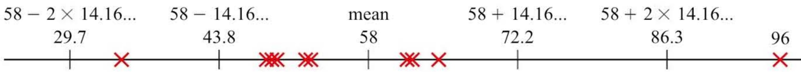

### Figure 1.9

Further investigation revealed that the mark of 96 was achieved by a Spanish boy who had taken A Level Spanish because he wanted to study Spanish at university. It might be appropriate to omit this value from the data set.

Calculate the mean and standard deviation of the data with the value 96 left out.

Investigate the value using your new mean and standard deviation.

<!-- page 54 -->

The times taken, in minutes, for some train journeys between Kolkata and Majilpur were recorded as shown.

<table border=1 style='margin: auto; word-wrap: break-word;'><tr><td style='text-align: center; word-wrap: break-word;'>56</td><td style='text-align: center; word-wrap: break-word;'>61</td><td style='text-align: center; word-wrap: break-word;'>57</td><td style='text-align: center; word-wrap: break-word;'>55</td><td style='text-align: center; word-wrap: break-word;'>58</td><td style='text-align: center; word-wrap: break-word;'>57</td><td style='text-align: center; word-wrap: break-word;'>5</td><td style='text-align: center; word-wrap: break-word;'>60</td><td style='text-align: center; word-wrap: break-word;'>61</td><td style='text-align: center; word-wrap: break-word;'>59</td></tr></table>

It is unnecessary here to calculate the mean and standard deviation. The value 5 minutes is obviously a mistake and should be omitted unless it is possible to correct it by referring to the original source of data.

Exercise 1E

1 (i) Find the mean of the following data.

0 0 0 1 1 1 1 1 2 2 2 2 2 2 3 3 3 3 4 4 4 4 4 5 5

(ii) Find the standard deviation using both forms of the formula.

2 Find the mean and standard deviation of the following data.

CP

3 Mahmood and Raheem are football players. In the 30 games played so far this season their scoring records are as follows.

<table border=1 style='margin: auto; word-wrap: break-word;'><tr><td style='text-align: center; word-wrap: break-word;'>x</td><td style='text-align: center; word-wrap: break-word;'>3</td><td style='text-align: center; word-wrap: break-word;'>4</td><td style='text-align: center; word-wrap: break-word;'>5</td><td style='text-align: center; word-wrap: break-word;'>6</td><td style='text-align: center; word-wrap: break-word;'>7</td><td style='text-align: center; word-wrap: break-word;'>8</td><td style='text-align: center; word-wrap: break-word;'>9</td></tr><tr><td style='text-align: center; word-wrap: break-word;'>f</td><td style='text-align: center; word-wrap: break-word;'>2</td><td style='text-align: center; word-wrap: break-word;'>5</td><td style='text-align: center; word-wrap: break-word;'>8</td><td style='text-align: center; word-wrap: break-word;'>14</td><td style='text-align: center; word-wrap: break-word;'>9</td><td style='text-align: center; word-wrap: break-word;'>4</td><td style='text-align: center; word-wrap: break-word;'>3</td></tr></table>

<table border=1 style='margin: auto; word-wrap: break-word;'><tr><td style='text-align: center; word-wrap: break-word;'>Goals scored</td><td style='text-align: center; word-wrap: break-word;'>0</td><td style='text-align: center; word-wrap: break-word;'>1</td><td style='text-align: center; word-wrap: break-word;'>2</td><td style='text-align: center; word-wrap: break-word;'>3</td><td style='text-align: center; word-wrap: break-word;'>4</td></tr><tr><td style='text-align: center; word-wrap: break-word;'>Frequency (Mahmood)</td><td style='text-align: center; word-wrap: break-word;'>12</td><td style='text-align: center; word-wrap: break-word;'>8</td><td style='text-align: center; word-wrap: break-word;'>8</td><td style='text-align: center; word-wrap: break-word;'>1</td><td style='text-align: center; word-wrap: break-word;'>1</td></tr><tr><td style='text-align: center; word-wrap: break-word;'>Frequency (Raheem)</td><td style='text-align: center; word-wrap: break-word;'>4</td><td style='text-align: center; word-wrap: break-word;'>21</td><td style='text-align: center; word-wrap: break-word;'>5</td><td style='text-align: center; word-wrap: break-word;'>0</td><td style='text-align: center; word-wrap: break-word;'>0</td></tr></table>

(i) Find the mean and the standard deviation of the number of goals each player scored.

(ii) Comment on the players' goal scoring records.

4 For a set of 20 items of data  $ \sum x = 22 $ and  $ \sum x^{2} = 55 $. Find the mean and the standard deviation of the data.

5 For a data set of 50 items of data  $ \sum(x - \overline{x})^{2}f = 8 $ and  $ \sum x f = 20 $. Find the mean and the standard deviation of the data.

6 Two thermostats were used under identical conditions. The water temperatures, in  $ {}^{\circ} $C, are given below.

Thermostat A: 24 25 27 23 26

Thermostat B: 26 26 23 22 28

(i) Calculate the mean and standard deviation for each set of water temperatures.

(ii) Which is the better thermostat? Give a reason.

A second sample of data was collected using thermostat A.

25 24 24 25 26 25 24 24

(iii) Find the overall mean and the overall standard deviation for the two sets of data for thermostat A.

<!-- page 55 -->

## CP

## M

## M

7 Ditshele has a choice of routes to work. She timed her journey along each route on several occasions and the times in minutes are given below.

Town route: 15 16 20 28 21

Country route: 19 21 20 22 18

(i) Calculate the mean and standard deviation of each set of journey times.

## M

(ii) Which route would you recommend? Give a reason.

8 In a certain district, the mean annual rainfall is 80 cm, with standard deviation 4 cm.

(i) One year it was 90 cm. Was this an exceptional year?

(ii) The next year had a total of 78 cm. Was that exceptional?

Jake, a local amateur meteorologist, kept a record of the weekly rainfall in his garden. His first data set, comprising 20 weeks of figures, resulted in a mean weekly rainfall of 1.5 cm. The standard deviation was 0.1 cm. His second set of data, over 32 weeks, resulted in a mean of 1.7 cm and a standard deviation of 0.09 cm.

(iii) Calculate the overall mean and the overall standard deviation for the whole year.

(iv) Estimate the annual rainfall in Jake's garden.

9 A farmer expects to harvest a crop of 3.8 tonnes, on average, from each hectare of his land, with standard deviation 0.2 tonnes.

One year there was much more rain than usual and he harvested 4.1 tonnes per hectare.

(i) Was this exceptional?

(ii) Do you think the crop was affected by the unusual weather or was the higher yield part of the variability which always occurs?

10 A machine is supposed to produce ball bearings with a mean diameter of 2.0 mm. A sample of eight ball bearings was taken from the production line and the diameters measured. The results, in millimetres, were as follows:

2.0 2.1 2.0 1.8 2.4 2.3 1.9 2.1

(i) Calculate the mean and standard deviation of the diameters.

(ii) Do you think the machine is correctly set?

<!-- page 56 -->

PS

11 On page 28 you saw the example about Robert, the student at Avonford College who collected data relating to the heights of female students. This is his corrected frequency table and his calculations so far.

<table border=1 style='margin: auto; word-wrap: break-word;'><tr><td style='text-align: center; word-wrap: break-word;'>Height, h</td><td style='text-align: center; word-wrap: break-word;'>Mid-value, x</td><td style='text-align: center; word-wrap: break-word;'>Frequency, f</td><td style='text-align: center; word-wrap: break-word;'>xf</td></tr><tr><td style='text-align: center; word-wrap: break-word;'>$ 157.5 ≤ h &lt; 159.5 $</td><td style='text-align: center; word-wrap: break-word;'>158.5</td><td style='text-align: center; word-wrap: break-word;'>4</td><td style='text-align: center; word-wrap: break-word;'>634.0</td></tr><tr><td style='text-align: center; word-wrap: break-word;'>$ 159.5 ≤ h &lt; 161.5 $</td><td style='text-align: center; word-wrap: break-word;'>160.5</td><td style='text-align: center; word-wrap: break-word;'>11</td><td style='text-align: center; word-wrap: break-word;'>1765.5</td></tr><tr><td style='text-align: center; word-wrap: break-word;'>$ 161.5 ≤ h &lt; 163.5 $</td><td style='text-align: center; word-wrap: break-word;'>162.5</td><td style='text-align: center; word-wrap: break-word;'>19</td><td style='text-align: center; word-wrap: break-word;'>3087.5</td></tr><tr><td style='text-align: center; word-wrap: break-word;'>$ 163.5 ≤ h &lt; 165.5 $</td><td style='text-align: center; word-wrap: break-word;'>164.5</td><td style='text-align: center; word-wrap: break-word;'>8</td><td style='text-align: center; word-wrap: break-word;'>1316.0</td></tr><tr><td style='text-align: center; word-wrap: break-word;'>$ 165.5 ≤ h &lt; 167.5 $</td><td style='text-align: center; word-wrap: break-word;'>166.5</td><td style='text-align: center; word-wrap: break-word;'>5</td><td style='text-align: center; word-wrap: break-word;'>832.5</td></tr><tr><td style='text-align: center; word-wrap: break-word;'>$ 167.5 ≤ h &lt; 169.5 $</td><td style='text-align: center; word-wrap: break-word;'>168.5</td><td style='text-align: center; word-wrap: break-word;'>3</td><td style='text-align: center; word-wrap: break-word;'>505.5</td></tr><tr><td style='text-align: center; word-wrap: break-word;'>Totals</td><td style='text-align: center; word-wrap: break-word;'></td><td style='text-align: center; word-wrap: break-word;'>50</td><td style='text-align: center; word-wrap: break-word;'>8141.0</td></tr></table>

 $$ \overline{x}=\frac{8141.0}{50}=162.82 $$ 

(i) Calculate the standard deviation.

Robert's friend Asha collected a sample of heights from 50 male PE students. She calculated the mean and standard deviation to be 170.4 cm and 2.50 cm. Later on they realised they had excluded two measurements. It was not clear to which of the two data sets, Robert's or Asha's, the two items of data belonged. The values were 171 cm and 166 cm. Robert felt confident about one of the values but not the other.

(ii) Investigate and comment.

12 As part of a biology experiment Thabo caught and weighed 120 minnows. He used his calculator to find the mean and standard deviation of their weights.

Mean  $ \quad $ 26.231 g

Standard deviation 4.023g

(i) Find the total weight,  $ \sum x $, of Thabo's 120 minnows.

(ii) Use the formula standard deviation =  $ \sqrt{\frac{\sum x^2}{n} - \overline{x}^2} $ to find  $ \sum x^2 $ for Thabo's minnows.

Another member of the class, Sharon, did the same experiment with minnows caught from a different stream. Her results are summarised by:

 $$ n=80\quad\overline{x}=25.214\quad standard~deviation=3.841 $$ 

Their teacher says they should combine their results into a single set but they have both thrown away their measurements.

(iii) Find $n$, $\sum x$ and $\sum x^{2}$ for the combined data set.

(iv) Find the mean and standard deviation for the combined data set.

<!-- page 57 -->

13 The table shows the mean and standard deviation of the weights of some turkeys and geese.

<table border=1 style='margin: auto; word-wrap: break-word;'><tr><td style='text-align: center; word-wrap: break-word;'></td><td style='text-align: center; word-wrap: break-word;'>Number of birds</td><td style='text-align: center; word-wrap: break-word;'>Mean (kg)</td><td style='text-align: center; word-wrap: break-word;'>Standard deviation (kg)</td></tr><tr><td style='text-align: center; word-wrap: break-word;'>Turkeys</td><td style='text-align: center; word-wrap: break-word;'>9</td><td style='text-align: center; word-wrap: break-word;'>7.1</td><td style='text-align: center; word-wrap: break-word;'>1.45</td></tr><tr><td style='text-align: center; word-wrap: break-word;'>Geese</td><td style='text-align: center; word-wrap: break-word;'>18</td><td style='text-align: center; word-wrap: break-word;'>5.2</td><td style='text-align: center; word-wrap: break-word;'>0.96</td></tr></table>

(i) Find the mean weight of the 27 birds.

(ii) The weights of individual turkeys are denoted by $x_{t}$ kg and the weights of individual geese by $x_{g}$ kg. By first finding $\sum x_{t}^{2}$ and $\sum x_{g}^{2}$, find the standard deviation of the weights of all 27 birds.

Cambridge International AS & A Level Mathematics

9709 Paper 61 Q5 June 2015

14 A group of 10 women and 13 men found that the mean age  $ \overline{x}_{w} $ of the 10 women was 41.2 years and the standard deviation of the women's ages was 15.1 years. For the 13 men, the mean age  $ \overline{x}_{m} $ was 46.3 years and the standard deviation was 12.7 years.

(i) Find the mean age of the whole group of 23 people.

(ii) The individual women's ages are denoted by  $ x_{w} $ and the individual men's ages by  $ x_{m} $. By first finding  $ \sum x_{w}^{2} $ and  $ \sum x_{m}^{2} $, find the standard deviation for the whole group.

Cambridge International AS & A Level Mathematics

9709 Paper 6 Q4 November 2005

15 The numbers of rides taken by two students, Fei and Graeme, at a fairground are shown in the following table.

<table border=1 style='margin: auto; word-wrap: break-word;'><tr><td style='text-align: center; word-wrap: break-word;'>Student</td><td style='text-align: center; word-wrap: break-word;'>Roller coaster</td><td style='text-align: center; word-wrap: break-word;'>Water slide</td><td style='text-align: center; word-wrap: break-word;'>Revolving drum</td></tr><tr><td style='text-align: center; word-wrap: break-word;'>Fei</td><td style='text-align: center; word-wrap: break-word;'>4</td><td style='text-align: center; word-wrap: break-word;'>2</td><td style='text-align: center; word-wrap: break-word;'>0</td></tr><tr><td style='text-align: center; word-wrap: break-word;'>Graeme</td><td style='text-align: center; word-wrap: break-word;'>1</td><td style='text-align: center; word-wrap: break-word;'>3</td><td style='text-align: center; word-wrap: break-word;'>6</td></tr></table>

(i) The mean cost of Fei's rides is $2.50 and the standard deviation of the costs of Fei's rides is $0. Explain how you can tell that the roller coaster and the water slide each cost $2.50 per ride.

(ii) The mean cost of Graeme's rides is $3.76. Find the standard deviation of the costs of Graeme's rides.

Cambridge International AS & A Level Mathematics

9709 Paper 61 Q4 June 2010

<!-- page 58 -->

### 1.9 Working with an assumed mean

## Human computer has it figured

Mathman Web

Schoolboy Simon Newton astounded his classmates and their parents at a school open evening when he calculated the average of a set of numbers in seconds while everyone else struggled with their adding up.

Mr Truscott, a parent of one of the other children, said, 'I was still looking for my calculator when Simon wrote the answer on the board'.

Simon modestly said when asked about his skill 'It's simply a matter of choosing a good assumed mean'.

Mathman Web wants to know 'What is the secret method, Simon?'

Without a calculator, see if you can match Simon's performance. The data is repeated below.

Send your result and how you did it into Mathman Web. Don't forget – no calculators!

<table border=1 style='margin: auto; word-wrap: break-word;'><tr><td style='text-align: center; word-wrap: break-word;'>Number</td><td style='text-align: center; word-wrap: break-word;'>Frequency</td></tr><tr><td style='text-align: center; word-wrap: break-word;'>3510</td><td style='text-align: center; word-wrap: break-word;'>6</td></tr><tr><td style='text-align: center; word-wrap: break-word;'>3512</td><td style='text-align: center; word-wrap: break-word;'>4</td></tr><tr><td style='text-align: center; word-wrap: break-word;'>3514</td><td style='text-align: center; word-wrap: break-word;'>3</td></tr><tr><td style='text-align: center; word-wrap: break-word;'>3516</td><td style='text-align: center; word-wrap: break-word;'>1</td></tr><tr><td style='text-align: center; word-wrap: break-word;'>3518</td><td style='text-align: center; word-wrap: break-word;'>2</td></tr><tr><td style='text-align: center; word-wrap: break-word;'>3520</td><td style='text-align: center; word-wrap: break-word;'>4</td></tr></table>

Simon gave a big clue about how he calculated the mean so quickly. He said 'It's simply a matter of choosing a good assumed mean'. Simon noticed that subtracting 3510 from each value simplified the data significantly. This is how he did his calculations.

<table border=1 style='margin: auto; word-wrap: break-word;'><tr><td style='text-align: center; word-wrap: break-word;'>Number, x</td><td style='text-align: center; word-wrap: break-word;'>Number - 3510,  $ \gamma $</td><td style='text-align: center; word-wrap: break-word;'>Frequency, f</td><td style='text-align: center; word-wrap: break-word;'>$ \gamma \times f $</td></tr><tr><td style='text-align: center; word-wrap: break-word;'>3510</td><td style='text-align: center; word-wrap: break-word;'>0</td><td style='text-align: center; word-wrap: break-word;'>6</td><td style='text-align: center; word-wrap: break-word;'>$ 0 \times 6 = 0 $</td></tr><tr><td style='text-align: center; word-wrap: break-word;'>3512</td><td style='text-align: center; word-wrap: break-word;'>2</td><td style='text-align: center; word-wrap: break-word;'>4</td><td style='text-align: center; word-wrap: break-word;'>$ 2 \times 4 = 8 $</td></tr><tr><td style='text-align: center; word-wrap: break-word;'>3514</td><td style='text-align: center; word-wrap: break-word;'>4</td><td style='text-align: center; word-wrap: break-word;'>3</td><td style='text-align: center; word-wrap: break-word;'>$ 4 \times 3 = 12 $</td></tr><tr><td style='text-align: center; word-wrap: break-word;'>3516</td><td style='text-align: center; word-wrap: break-word;'>6</td><td style='text-align: center; word-wrap: break-word;'>1</td><td style='text-align: center; word-wrap: break-word;'>$ 6 \times 1 = 6 $</td></tr><tr><td style='text-align: center; word-wrap: break-word;'>3518</td><td style='text-align: center; word-wrap: break-word;'>8</td><td style='text-align: center; word-wrap: break-word;'>2</td><td style='text-align: center; word-wrap: break-word;'>$ 8 \times 2 = 16 $</td></tr><tr><td style='text-align: center; word-wrap: break-word;'>3520</td><td style='text-align: center; word-wrap: break-word;'>10</td><td style='text-align: center; word-wrap: break-word;'>4</td><td style='text-align: center; word-wrap: break-word;'>$ 10 \times 4 = 40 $</td></tr><tr><td style='text-align: center; word-wrap: break-word;'>Totals</td><td style='text-align: center; word-wrap: break-word;'></td><td style='text-align: center; word-wrap: break-word;'>20</td><td style='text-align: center; word-wrap: break-word;'>82</td></tr></table>

 $$  Average(mean)=\frac{82}{20}=4.1 $$ 

(3510 is now added back) 3510 + 4.1 = 3514.1

Simon was using an  $ \underline{\text{assumed}} $ mean to ease his arithmetic.

Sometimes it is easier to work with an assumed mean in order to find the standard deviation.

<!-- page 59 -->

Using an assumed mean of 7, find the true mean and the standard deviation of the data set 5, 7, 9, 4, 3, 8.

It doesn't matter if the assumed mean is not very close to the correct value for the mean, but the closer it is the simpler the working will be.

## Solution

Let $d$ represent the variation from the assumed mean of 7. So $d = x - 7$.

<table border=1 style='margin: auto; word-wrap: break-word;'><tr><td style='text-align: center; word-wrap: break-word;'>x</td><td style='text-align: center; word-wrap: break-word;'>d = x - 7</td><td style='text-align: center; word-wrap: break-word;'>d^2 = (x - 7)^2</td></tr><tr><td style='text-align: center; word-wrap: break-word;'>5</td><td style='text-align: center; word-wrap: break-word;'>5 - 7 = -2</td><td style='text-align: center; word-wrap: break-word;'>4</td></tr><tr><td style='text-align: center; word-wrap: break-word;'>7</td><td style='text-align: center; word-wrap: break-word;'>7 - 7 = 0</td><td style='text-align: center; word-wrap: break-word;'>0</td></tr><tr><td style='text-align: center; word-wrap: break-word;'>9</td><td style='text-align: center; word-wrap: break-word;'>9 - 7 = 2</td><td style='text-align: center; word-wrap: break-word;'>4</td></tr><tr><td style='text-align: center; word-wrap: break-word;'>4</td><td style='text-align: center; word-wrap: break-word;'>4 - 7 = -3</td><td style='text-align: center; word-wrap: break-word;'>9</td></tr><tr><td style='text-align: center; word-wrap: break-word;'>3</td><td style='text-align: center; word-wrap: break-word;'>3 - 7 = -4</td><td style='text-align: center; word-wrap: break-word;'>16</td></tr><tr><td style='text-align: center; word-wrap: break-word;'>8</td><td style='text-align: center; word-wrap: break-word;'>8 - 7 = 1</td><td style='text-align: center; word-wrap: break-word;'>1</td></tr><tr><td style='text-align: center; word-wrap: break-word;'>Totals</td><td style='text-align: center; word-wrap: break-word;'>$ \sum d = \sum (x - 7) = -6 $</td><td style='text-align: center; word-wrap: break-word;'>$ \sum d^2 = \sum (x - 7)^2 = 34 $</td></tr></table>

The mean of $d$ is given by

 $$ \overline{d}=\frac{\sum d}{n}=\frac{-6}{6}=-1 $$ 

The standard deviation of $d$ is given by

 $$ \begin{aligned}s d_{d}=\sqrt{\frac{\sum d^{2}}{n}-\left(\frac{\sum d}{n}\right)^{2}}&=\sqrt{\frac{34}{6}-\left(\frac{-6}{6}\right)^{2}}\xleftarrow{\quad\overline{d}^{2}\quad}\\&=2.16\text{to}3\text{s.f.}\end{aligned} $$ 

So the true mean is 7-1=6.

The true standard deviation is 2.16 to 3 s.f.

7 is the assumed mean.

In general:

▶  $ \overline{x} = a + \overline{d} $ where a is the assumed mean.

▶ the standard deviation of x is the standard deviation of d.

The following example uses summary statistics, rather than the raw data values.

<!-- page 60 -->

For a set of 10 data items,  $ \sum(x-9)=7 $ and  $ \sum(x-9)^{2}=17 $.

Find their mean and standard deviation.

## Solution

Let x - 9 = d

 $$ \sum(x-9)=7\qquad\sum d=7 $$ 

 $$ \overline{d}=\frac{7}{10}=0.7 $$ 

 $$ \overline{x}=9+0.7=9.7 $$ 

The assumed

mean is 9.

The mean of x is 9.7.

 $$ \begin{aligned}The~standard~deviation~of~d&=\sqrt{\frac{\sum_{}^{}d^{2}}{n}-\left(\frac{\sum_{}^{}d}{n}\right)^{2}}\quad where~d=x-9\\&=\sqrt{\frac{17}{10}-\left(\frac{7}{10}\right)^{2}}\\&=\sqrt{1.7-0.49}\\&=\sqrt{1.21}\\&=1.1\end{aligned} $$ 

Since the standard deviation of x is equal to the standard deviation of $d$, it follows that the standard deviation of x is 1.1.

The next example shows you how to use an assumed mean with grouped data.

### Example 1.11

Using 162.5 as an assumed mean, find the mean and standard deviation of the data in this table. (These are Robert's figures for the heights of female students.)

<table border=1 style='margin: auto; word-wrap: break-word;'><tr><td style='text-align: center; word-wrap: break-word;'>Height, x (cm) midpoints</td><td style='text-align: center; word-wrap: break-word;'>Frequency, f</td></tr><tr><td style='text-align: center; word-wrap: break-word;'>158.5</td><td style='text-align: center; word-wrap: break-word;'>4</td></tr><tr><td style='text-align: center; word-wrap: break-word;'>160.5</td><td style='text-align: center; word-wrap: break-word;'>11</td></tr><tr><td style='text-align: center; word-wrap: break-word;'>162.5</td><td style='text-align: center; word-wrap: break-word;'>19</td></tr><tr><td style='text-align: center; word-wrap: break-word;'>164.5</td><td style='text-align: center; word-wrap: break-word;'>8</td></tr><tr><td style='text-align: center; word-wrap: break-word;'>166.5</td><td style='text-align: center; word-wrap: break-word;'>5</td></tr><tr><td style='text-align: center; word-wrap: break-word;'>168.5</td><td style='text-align: center; word-wrap: break-word;'>3</td></tr><tr><td style='text-align: center; word-wrap: break-word;'>Total</td><td style='text-align: center; word-wrap: break-word;'>50</td></tr></table>

## Solution

The working is summarised in the following table.

<!-- page 61 -->

<table border=1 style='margin: auto; word-wrap: break-word;'><tr><td style='text-align: center; word-wrap: break-word;'>Height, x (cm) midpoints</td><td style='text-align: center; word-wrap: break-word;'>d = x - 162.5</td><td style='text-align: center; word-wrap: break-word;'>Frequency, f</td><td style='text-align: center; word-wrap: break-word;'>df</td><td style='text-align: center; word-wrap: break-word;'>$ d^{2}f $</td></tr><tr><td style='text-align: center; word-wrap: break-word;'>158.5</td><td style='text-align: center; word-wrap: break-word;'>-4</td><td style='text-align: center; word-wrap: break-word;'>4</td><td style='text-align: center; word-wrap: break-word;'>-16</td><td style='text-align: center; word-wrap: break-word;'>64</td></tr><tr><td style='text-align: center; word-wrap: break-word;'>160.5</td><td style='text-align: center; word-wrap: break-word;'>-2</td><td style='text-align: center; word-wrap: break-word;'>11</td><td style='text-align: center; word-wrap: break-word;'>-22</td><td style='text-align: center; word-wrap: break-word;'>44</td></tr><tr><td style='text-align: center; word-wrap: break-word;'>162.5</td><td style='text-align: center; word-wrap: break-word;'>0</td><td style='text-align: center; word-wrap: break-word;'>19</td><td style='text-align: center; word-wrap: break-word;'>0</td><td style='text-align: center; word-wrap: break-word;'>0</td></tr><tr><td style='text-align: center; word-wrap: break-word;'>164.5</td><td style='text-align: center; word-wrap: break-word;'>2</td><td style='text-align: center; word-wrap: break-word;'>8</td><td style='text-align: center; word-wrap: break-word;'>16</td><td style='text-align: center; word-wrap: break-word;'>32</td></tr><tr><td style='text-align: center; word-wrap: break-word;'>166.5</td><td style='text-align: center; word-wrap: break-word;'>4</td><td style='text-align: center; word-wrap: break-word;'>5</td><td style='text-align: center; word-wrap: break-word;'>20</td><td style='text-align: center; word-wrap: break-word;'>80</td></tr><tr><td style='text-align: center; word-wrap: break-word;'>168.5</td><td style='text-align: center; word-wrap: break-word;'>6</td><td style='text-align: center; word-wrap: break-word;'>3</td><td style='text-align: center; word-wrap: break-word;'>18</td><td style='text-align: center; word-wrap: break-word;'>108</td></tr><tr><td style='text-align: center; word-wrap: break-word;'>Totals</td><td style='text-align: center; word-wrap: break-word;'></td><td style='text-align: center; word-wrap: break-word;'>50</td><td style='text-align: center; word-wrap: break-word;'>16</td><td style='text-align: center; word-wrap: break-word;'>328</td></tr></table>

 $$ \overline{d}=\frac{16}{50}=0.32 $$ 

 $$ (sd_{d})^{2}=\frac{328}{50}-0.32^{2}=6.4576 $$ 

 $$ s d_{d}=2.54\mathrm{~t o~}3\mathrm{~s.f.} $$ 

So the mean and standard deviation of the original data are:

 $$ \overline{x}=162.5+0.32=162.82 $$ 

 $$ s d_{x}=2.54\mathrm{~t o~}3\mathrm{s.f.} $$ 

## Exercise 1F

1 Calculate the mean and standard deviation of the following masses, measured to the nearest gram, using a suitable assumed mean.

<table border=1 style='margin: auto; word-wrap: break-word;'><tr><td style='text-align: center; word-wrap: break-word;'>Mass (g)</td><td style='text-align: center; word-wrap: break-word;'>241-244</td><td style='text-align: center; word-wrap: break-word;'>245-248</td><td style='text-align: center; word-wrap: break-word;'>249-252</td><td style='text-align: center; word-wrap: break-word;'>253-256</td><td style='text-align: center; word-wrap: break-word;'>257-260</td><td style='text-align: center; word-wrap: break-word;'>261-264</td></tr><tr><td style='text-align: center; word-wrap: break-word;'>Frequency</td><td style='text-align: center; word-wrap: break-word;'>4</td><td style='text-align: center; word-wrap: break-word;'>7</td><td style='text-align: center; word-wrap: break-word;'>14</td><td style='text-align: center; word-wrap: break-word;'>15</td><td style='text-align: center; word-wrap: break-word;'>7</td><td style='text-align: center; word-wrap: break-word;'>3</td></tr></table>

2 A production line produces steel bolts which have a nominal length of 95 mm. A sample of 50 bolts is taken and measured to the nearest 0.1 mm. Their deviations from 95 mm are recorded in tenths of a millimetre and summarised as  $ \sum x = -85 $,  $ \sum x^{2} = 734 $. (For example, a bolt of length 94.2 mm would be recorded as -8.)

(i) Find the mean and standard deviation of the x values.

(ii) Find the mean and standard deviation of the lengths of the bolts in millimetres. Give the mean to 4 significant figures.

(iii) One of the figures recorded is -18. Suggest why this can be regarded as an outlier.

(iv) The figure of -18 is thought to be a mistake in the recording. Calculate the new mean (to 4 significant figures) and standard deviation of the lengths in millimetres, with the -18 value removed.

<!-- page 62 -->

3 A system is used at a college to predict a student's A Level grade in a particular subject using their GCSE results. The GCSE score is g and the predicted A Level score is a and for Maths in 2018 the equation of the line of best fit relating them was  $ a = 2.6g - 9.42 $.

This year there are 66 second-year students and their GCSE scores are summarised as $\sum g = 408.6, \sum g^{2} = 2545.06$.

(ii) Find the mean of the predicted A Level scores using the 2018 line of best fit.

(i) Find the mean and standard deviation of the GCSE scores.

4 [i] Find the mode, mean and median of:

2 8 6 5 4 5 6 3 6 4 9 1 5 6 5

Hence write down, without further working, the mode, mean and median of:

[ii] 20 80 60 50 40 50 60 30 60 40 90 10 50 60 50

[iii] 12 18 16 15 14 15 16 13 16 14 19 11 15 16 15

[iv] 4 16 12 10 8 10 12 6 12 8 18 2 10 12 10

5 A manufacturer produces electrical cable which is sold on reels. The reels are supposed to hold 100 metres of cable. In the quality control department the length of cable on randomly chosen reels is measured. These measurements are recorded as deviations, in centimetres, from 100 m. (So, for example, a length of 99.84 m is recorded as -16.)

For a sample of 20 reels the recorded values, x, are summarised by:

 $ \sum x = -86 $

 $ \sum x^{2} = 4281 $

(i) Calculate the mean and standard deviation of the values of x.

(ii) Later it is noticed that one of the values of x is -47, and it is thought that so large a value is likely to be an error. Give a reason to support this view.

(iii) Find the new mean and standard deviation of the values of x when the value -47 is discarded.

6 On her summer holiday, Felicity recorded the temperatures at noon each day for use in a statistics project. The values recorded, $f$ degrees Fahrenheit, were as follows, correct to the nearest degree.

47 59 68 62 49 67 66 73 70 68 74 84 80 72

(i) Represent Felicity's data on a stem-and-leaf diagram. Comment on the shape of the distribution.

(ii) Using a suitable assumed mean, find the mean and standard deviation of Felicity's data.

7 For a set of ten data items,  $ \sum(x-20)=-140 $ and  $ \sum(x-20)^{2}=2050 $. Find their mean and standard deviation.

<!-- page 63 -->

8 For a set of 20 data items,  $ \sum(x+3)=140 $ and  $ \sum(x+3)^{2}=1796 $. Find their mean and standard deviation.

9 For a set of 15 data items,  $ \sum(x+a)=156 $ and  $ \sum(x+a)^{2}=1854 $. The mean of these values is 5.4.

Find the value of a and the standard deviation.

10 For a set of 10 data items,  $ \sum(x-a) = -11 $ and  $ \sum(x-a)^2 = 75 $. The mean of these values is 5.9.

Find the value of a and the standard deviation.

11 The length of time, t minutes, taken to do the crossword in a certain newspaper was observed on 12 occasions. The results are summarised below.

 $$ \begin{array}{r l}{\sum(t-35)=-15}&{{}\sum(t-35)^{2}=82.23}\end{array} $$ 

Calculate the mean and standard deviation of these times taken to do the crossword.

Cambridge International AS & A Level Mathematics

9709 Paper & Q1 June 2007

12 A summary of 24 observations of x gave the following information:

 $$ \begin{array}{r l}{\sum(x-a)=-73.2}&{{}{\mathrm{a n d}}\quad\sum(x-a)^{2}=2115.}\end{array} $$ 

The mean of these values of x is 8.95.

(i) Find the value of the constant a.

(ii) Find the standard deviation of these values of x.

Cambridge International AS & A Level Mathematics

9709 Paper 6 Q1 November 2007

## KEY POINTS

1 An item of data x may be identified as an outlier if

 $ |x-\overline{x}|>2\times $ standard deviation.

That is, if x is more than two standard deviations above or below the sample mean.

2 Categorical data are non-numerical; discrete data can be listed; continuous data can be measured to any degree of accuracy and it is not possible to list all values.

3 Stem-and-leaf diagrams (or stemplots) are suitable for discrete or continuous data. All data values are retained as well as indicating properties of the distribution.

4 The mean, median and the mode or modal class are measures of central tendency.

<!-- page 64 -->

5 The mean,  $ \overline{x} = \frac{\sum_{x}^{n} f}{n} $. For grouped data  $ \overline{x} = \frac{\sum_{x}^{n} f}{\sum_{x}^{n} f} $.

6 The median is the mid-value when the data are presented in rank order; it is the value of the  $ \frac{n+1}{2} $th item of n data items.

7 The mode is the most common item of data. The modal class is the class containing the most data, when the classes are of equal width.

8 The range, variance and standard deviation are measures of spread or variation or dispersion.

9 Range = maximum data value - minimum data value.

10 The standard deviation =  $ \sqrt{\frac{\sum(x-\bar{x})^{2}f}{n}} $ or  $ \sqrt{\frac{\sum(x-\bar{x})^{2}f}{\sum f}} $

11 An alternative form is

standard deviation =  $ \sqrt{\frac{\sum x^{2}f}{n} - \overline{x}^{2}} $ or  $ \sqrt{\frac{\sum x^{2}f}{\sum f} - \overline{x}^{2}} $

12 Working with an assumed mean $a$,

 $$ \overline{x}=a+\overline{d} $$ 

where $a$ is the assumed mean and $d$ is the deviation from the assumed mean and the standard deviation of $x$ is the standard deviation of $d$.

## LEARNING OUTCOMES

Now that you have finished this chapter, you should be able to

draw and interpret stem-and-leaf diagrams and back-to-back stem-and-leaf diagrams

understand the terms:

variable

discrete data

continuous data

frequency distribution

calculate and use measures of central tendency:

mean

median

mode

<!-- page 65 -->

calculate and use measures of variation:

range

■ variance

standard deviation

work with raw data

work with grouped data

work with raw data and grouped data

use summary statistics ( $ \Sigma x $ and  $ \Sigma x^{2} $) to calculate the mean and standard deviation

work with an assumed mean to find the mean and standard deviation from coded totals (coded totals $\Sigma(x-a)$ and $\Sigma(x-a)^{2}$)

find the mean and standard deviation of data drawn from two samples.

