# Representing and interpreting data

<!-- Cambridge International AS  A Level Mathematics Probability  Statistics 1 (Sophie Goldie) .pdf p66-91 -->

<!-- page 66 -->

## 2 

## Representing and interpreting data

A picture is worth a thousand numbers. Anon

## Latest news from Alpha High

The Psychology department at Alpha High have found that girls have more online friends than boys. Mr Rama, the head of department, said ‘The results are quite marked, girls in all age groups with the exception of the youngest age group had significantly more online friends. We have several hypotheses to explain this, but want to do more research before we draw any conclusions.’ The group of student psychologists have won first prize in a competition run by Psychology Now for their research.

The Psychology department are now intending to compare these results with the number of friends that students have ‘real-life’ contact with.

<!-- page 67 -->

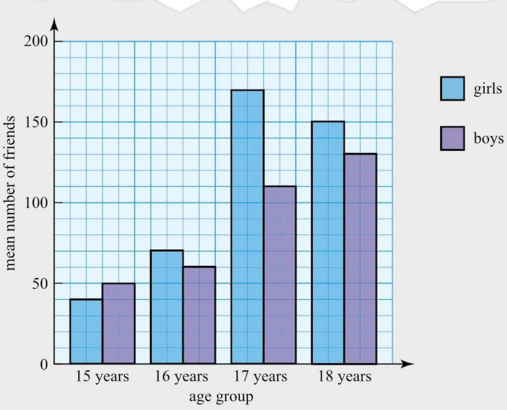

What is the mean number of friends for 17-year-old girls?

220 students aged 17 were surveyed from Alpha High. 120 of these students were girls. What is the overall mean number of friends for the 17-year-olds?

Most raw data need to be summarised to make it easier to see any patterns that may be present. You will often want to draw a diagram too. The Psychology department used the following table to construct the diagram for their article.

<table border=1 style='margin: auto; word-wrap: break-word;'><tr><td style='text-align: center; word-wrap: break-word;'>Age group</td><td style='text-align: center; word-wrap: break-word;'>15 years</td><td style='text-align: center; word-wrap: break-word;'>16 years</td><td style='text-align: center; word-wrap: break-word;'>17 years</td><td style='text-align: center; word-wrap: break-word;'>18 years</td></tr><tr><td style='text-align: center; word-wrap: break-word;'>Sample size</td><td style='text-align: center; word-wrap: break-word;'>200</td><td style='text-align: center; word-wrap: break-word;'>170</td><td style='text-align: center; word-wrap: break-word;'>220</td><td style='text-align: center; word-wrap: break-word;'>310</td></tr><tr><td style='text-align: center; word-wrap: break-word;'>Mean number of friends - girls</td><td style='text-align: center; word-wrap: break-word;'>40</td><td style='text-align: center; word-wrap: break-word;'>70</td><td style='text-align: center; word-wrap: break-word;'>170</td><td style='text-align: center; word-wrap: break-word;'>150</td></tr><tr><td style='text-align: center; word-wrap: break-word;'>Mean number of friends - boys</td><td style='text-align: center; word-wrap: break-word;'>50</td><td style='text-align: center; word-wrap: break-word;'>60</td><td style='text-align: center; word-wrap: break-word;'>110</td><td style='text-align: center; word-wrap: break-word;'>130</td></tr></table>

You will often want to use a diagram to communicate statistical findings. People find diagrams are a very useful and easy way of presenting and understanding statistical information.

### 2.1 Histograms

Histograms are used to illustrate continuous data. The columns in a histogram may have different widths and the area of each column is proportional to the frequency. Unlike bar charts, there are no gaps between the columns because where one class ends, the next begins.

<!-- page 68 -->

## Continuous data with equal class widths

A sample of 60 components is taken from a production line and their diameters, d mm, recorded. The resulting data are summarised in the following frequency table.

<table border=1 style='margin: auto; word-wrap: break-word;'><tr><td style='text-align: center; word-wrap: break-word;'>Diameter (mm)</td><td style='text-align: center; word-wrap: break-word;'>Frequency</td></tr><tr><td style='text-align: center; word-wrap: break-word;'>$ 25 ≤ d &lt; 30 $</td><td style='text-align: center; word-wrap: break-word;'>1</td></tr><tr><td style='text-align: center; word-wrap: break-word;'>$ 30 ≤ d &lt; 35 $</td><td style='text-align: center; word-wrap: break-word;'>3</td></tr><tr><td style='text-align: center; word-wrap: break-word;'>$ 35 ≤ d &lt; 40 $</td><td style='text-align: center; word-wrap: break-word;'>7</td></tr><tr><td style='text-align: center; word-wrap: break-word;'>$ 40 ≤ d &lt; 45 $</td><td style='text-align: center; word-wrap: break-word;'>15</td></tr><tr><td style='text-align: center; word-wrap: break-word;'>$ 45 ≤ d &lt; 50 $</td><td style='text-align: center; word-wrap: break-word;'>17</td></tr><tr><td style='text-align: center; word-wrap: break-word;'>$ 50 ≤ d &lt; 55 $</td><td style='text-align: center; word-wrap: break-word;'>10</td></tr><tr><td style='text-align: center; word-wrap: break-word;'>$ 55 ≤ d &lt; 60 $</td><td style='text-align: center; word-wrap: break-word;'>5</td></tr><tr><td style='text-align: center; word-wrap: break-word;'>$ 60 ≤ d &lt; 65 $</td><td style='text-align: center; word-wrap: break-word;'>2</td></tr></table>

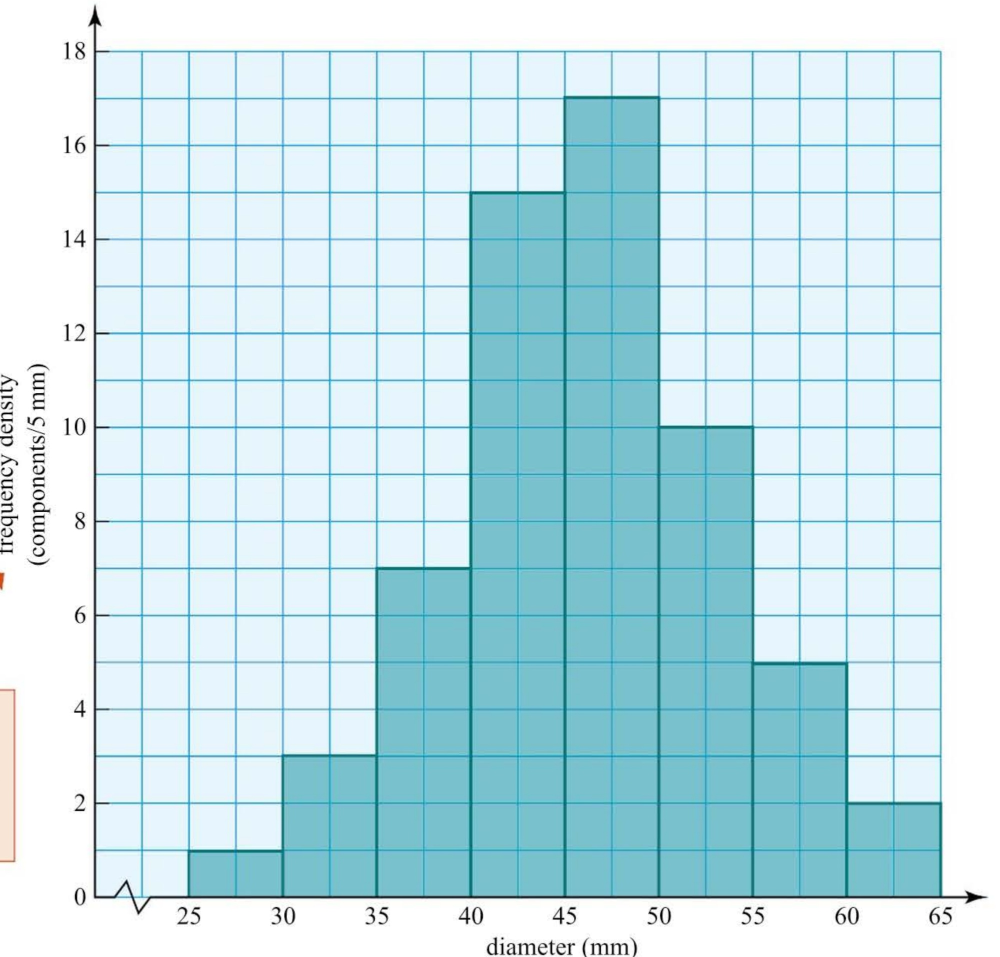

The vertical axis shows the frequency density. In this example it is frequency per 5 mm.

▲ Figure 2.1 Histogram to show the distribution of component diameters

The class boundaries are 25, 30, 35, 40, 45, 50, 55, 60 and 65. The width of each class is 5.

<!-- page 69 -->

The area of each column is proportional to the class frequency. In this example the class widths are equal so the height of each column is also proportional to the class frequency.

The column representing $45 \leq d < 50$ is the highest and this tells you that this is the modal class, that is the class with highest frequency per 5 mm.

How would you identify the modal class if the intervals were not of equal width?

## Labelling the frequency axis

The vertical axis tells you the frequency density. Figure 2.3 looks the same as Figure 2.2 but it is not a histogram. This type of diagram is, however, often incorrectly referred to as a histogram. It is more correctly called a frequency chart. A histogram shows the frequency density on the vertical axis.

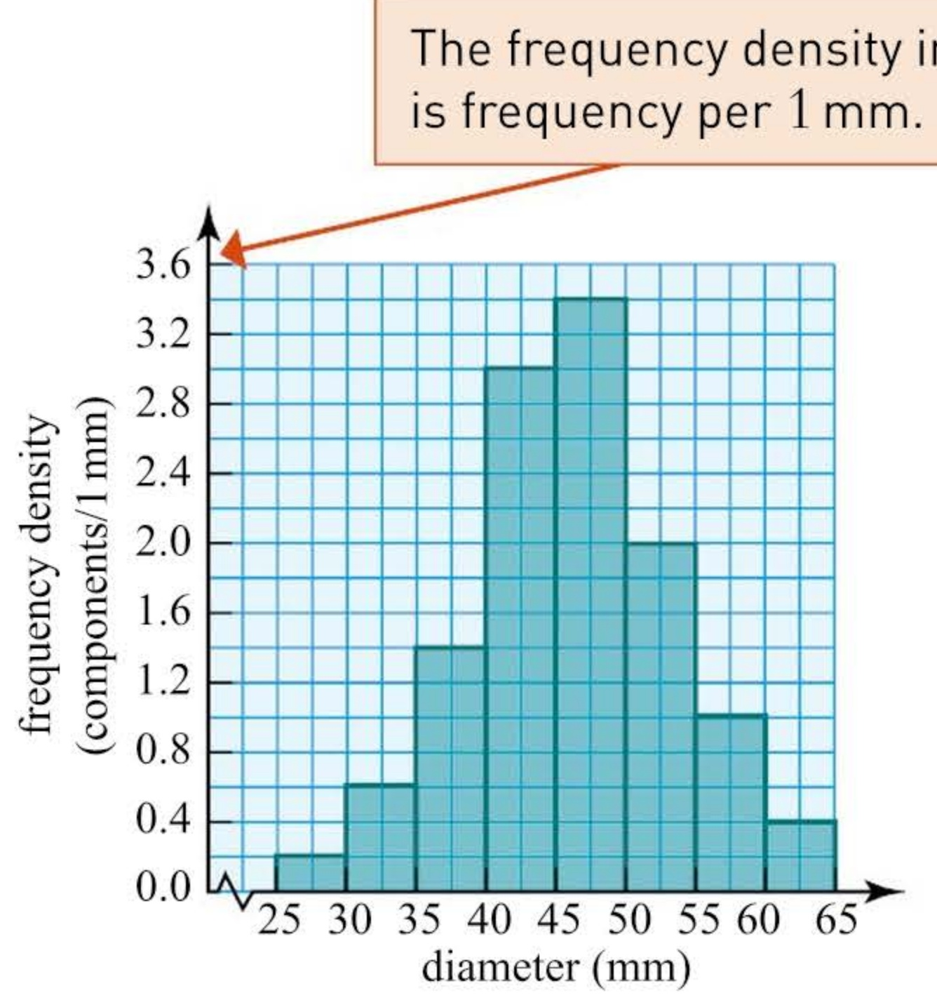

Figure 2.2

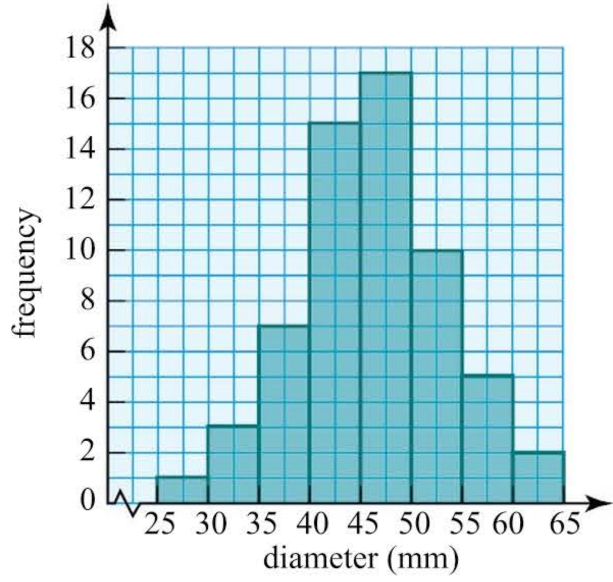

Figure 2.3

Comparing Figures 2.2 and 2.3, you will see that the shape of the distribution remains the same but the values on the vertical axes are different. This is because different units have been used for the frequency density.

## Continuous data with unequal class widths

The heights of 80 broad bean plants were measured, correct to the nearest centimetre, ten weeks after planting. The data are summarised in the following frequency table.

<!-- page 70 -->

<table border=1 style='margin: auto; word-wrap: break-word;'><tr><td style='text-align: center; word-wrap: break-word;'>Height (cm)</td><td style='text-align: center; word-wrap: break-word;'>Frequency</td><td style='text-align: center; word-wrap: break-word;'>Class width (cm)</td><td style='text-align: center; word-wrap: break-word;'>Frequency density</td></tr><tr><td style='text-align: center; word-wrap: break-word;'>7.5 ≤ x &lt; 11.5</td><td style='text-align: center; word-wrap: break-word;'>1</td><td style='text-align: center; word-wrap: break-word;'>4</td><td style='text-align: center; word-wrap: break-word;'>0.25</td></tr><tr><td style='text-align: center; word-wrap: break-word;'>11.5 ≤ x &lt; 13.5</td><td style='text-align: center; word-wrap: break-word;'>3</td><td style='text-align: center; word-wrap: break-word;'>2</td><td style='text-align: center; word-wrap: break-word;'>1.5</td></tr><tr><td style='text-align: center; word-wrap: break-word;'>13.5 ≤ x &lt; 15.5</td><td style='text-align: center; word-wrap: break-word;'>7</td><td style='text-align: center; word-wrap: break-word;'>2</td><td style='text-align: center; word-wrap: break-word;'>3.5</td></tr><tr><td style='text-align: center; word-wrap: break-word;'>15.5 ≤ x &lt; 17.5</td><td style='text-align: center; word-wrap: break-word;'>11</td><td style='text-align: center; word-wrap: break-word;'>2</td><td style='text-align: center; word-wrap: break-word;'>5.5</td></tr><tr><td style='text-align: center; word-wrap: break-word;'>17.5 ≤ x &lt; 19.5</td><td style='text-align: center; word-wrap: break-word;'>19</td><td style='text-align: center; word-wrap: break-word;'>2</td><td style='text-align: center; word-wrap: break-word;'>9.5</td></tr><tr><td style='text-align: center; word-wrap: break-word;'>19.5 ≤ x &lt; 21.5</td><td style='text-align: center; word-wrap: break-word;'>14</td><td style='text-align: center; word-wrap: break-word;'>2</td><td style='text-align: center; word-wrap: break-word;'>7</td></tr><tr><td style='text-align: center; word-wrap: break-word;'>21.5 ≤ x &lt; 23.5</td><td style='text-align: center; word-wrap: break-word;'>13</td><td style='text-align: center; word-wrap: break-word;'>2</td><td style='text-align: center; word-wrap: break-word;'>6.5</td></tr><tr><td style='text-align: center; word-wrap: break-word;'>23.5 ≤ x &lt; 25.5</td><td style='text-align: center; word-wrap: break-word;'>9</td><td style='text-align: center; word-wrap: break-word;'>2</td><td style='text-align: center; word-wrap: break-word;'>4.5</td></tr><tr><td style='text-align: center; word-wrap: break-word;'>25.5 ≤ x &lt; 28.5</td><td style='text-align: center; word-wrap: break-word;'>3</td><td style='text-align: center; word-wrap: break-word;'>3</td><td style='text-align: center; word-wrap: break-word;'>1</td></tr></table>

When the class widths are unequal you can use

 $$  frequency density=\frac{frequency}{class~width} $$ 

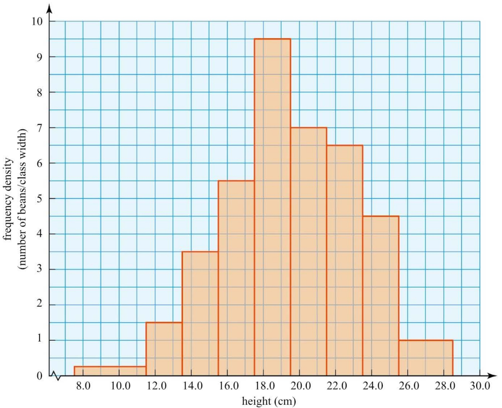

Figure 2.4

<!-- page 71 -->

## Discrete data

Histograms are occasionally used for grouped discrete data. However, you should always first consider the alternatives.

A test was given to 100 students. The maximum mark was 70. The raw data are shown below.

<table border=1 style='margin: auto; word-wrap: break-word;'><tr><td style='text-align: center; word-wrap: break-word;'>10</td><td style='text-align: center; word-wrap: break-word;'>18</td><td style='text-align: center; word-wrap: break-word;'>68</td><td style='text-align: center; word-wrap: break-word;'>67</td><td style='text-align: center; word-wrap: break-word;'>25</td><td style='text-align: center; word-wrap: break-word;'>62</td><td style='text-align: center; word-wrap: break-word;'>49</td><td style='text-align: center; word-wrap: break-word;'>11</td><td style='text-align: center; word-wrap: break-word;'>12</td><td style='text-align: center; word-wrap: break-word;'>8</td></tr><tr><td style='text-align: center; word-wrap: break-word;'>9</td><td style='text-align: center; word-wrap: break-word;'>46</td><td style='text-align: center; word-wrap: break-word;'>53</td><td style='text-align: center; word-wrap: break-word;'>57</td><td style='text-align: center; word-wrap: break-word;'>30</td><td style='text-align: center; word-wrap: break-word;'>63</td><td style='text-align: center; word-wrap: break-word;'>34</td><td style='text-align: center; word-wrap: break-word;'>21</td><td style='text-align: center; word-wrap: break-word;'>68</td><td style='text-align: center; word-wrap: break-word;'>31</td></tr><tr><td style='text-align: center; word-wrap: break-word;'>20</td><td style='text-align: center; word-wrap: break-word;'>16</td><td style='text-align: center; word-wrap: break-word;'>29</td><td style='text-align: center; word-wrap: break-word;'>13</td><td style='text-align: center; word-wrap: break-word;'>31</td><td style='text-align: center; word-wrap: break-word;'>56</td><td style='text-align: center; word-wrap: break-word;'>9</td><td style='text-align: center; word-wrap: break-word;'>34</td><td style='text-align: center; word-wrap: break-word;'>45</td><td style='text-align: center; word-wrap: break-word;'>55</td></tr><tr><td style='text-align: center; word-wrap: break-word;'>35</td><td style='text-align: center; word-wrap: break-word;'>40</td><td style='text-align: center; word-wrap: break-word;'>45</td><td style='text-align: center; word-wrap: break-word;'>48</td><td style='text-align: center; word-wrap: break-word;'>54</td><td style='text-align: center; word-wrap: break-word;'>50</td><td style='text-align: center; word-wrap: break-word;'>34</td><td style='text-align: center; word-wrap: break-word;'>32</td><td style='text-align: center; word-wrap: break-word;'>47</td><td style='text-align: center; word-wrap: break-word;'>60</td></tr><tr><td style='text-align: center; word-wrap: break-word;'>70</td><td style='text-align: center; word-wrap: break-word;'>52</td><td style='text-align: center; word-wrap: break-word;'>21</td><td style='text-align: center; word-wrap: break-word;'>25</td><td style='text-align: center; word-wrap: break-word;'>53</td><td style='text-align: center; word-wrap: break-word;'>41</td><td style='text-align: center; word-wrap: break-word;'>29</td><td style='text-align: center; word-wrap: break-word;'>63</td><td style='text-align: center; word-wrap: break-word;'>43</td><td style='text-align: center; word-wrap: break-word;'>50</td></tr><tr><td style='text-align: center; word-wrap: break-word;'>40</td><td style='text-align: center; word-wrap: break-word;'>48</td><td style='text-align: center; word-wrap: break-word;'>45</td><td style='text-align: center; word-wrap: break-word;'>38</td><td style='text-align: center; word-wrap: break-word;'>51</td><td style='text-align: center; word-wrap: break-word;'>25</td><td style='text-align: center; word-wrap: break-word;'>52</td><td style='text-align: center; word-wrap: break-word;'>55</td><td style='text-align: center; word-wrap: break-word;'>47</td><td style='text-align: center; word-wrap: break-word;'>46</td></tr><tr><td style='text-align: center; word-wrap: break-word;'>46</td><td style='text-align: center; word-wrap: break-word;'>50</td><td style='text-align: center; word-wrap: break-word;'>8</td><td style='text-align: center; word-wrap: break-word;'>25</td><td style='text-align: center; word-wrap: break-word;'>56</td><td style='text-align: center; word-wrap: break-word;'>18</td><td style='text-align: center; word-wrap: break-word;'>20</td><td style='text-align: center; word-wrap: break-word;'>36</td><td style='text-align: center; word-wrap: break-word;'>36</td><td style='text-align: center; word-wrap: break-word;'>9</td></tr><tr><td style='text-align: center; word-wrap: break-word;'>38</td><td style='text-align: center; word-wrap: break-word;'>39</td><td style='text-align: center; word-wrap: break-word;'>53</td><td style='text-align: center; word-wrap: break-word;'>45</td><td style='text-align: center; word-wrap: break-word;'>42</td><td style='text-align: center; word-wrap: break-word;'>42</td><td style='text-align: center; word-wrap: break-word;'>61</td><td style='text-align: center; word-wrap: break-word;'>55</td><td style='text-align: center; word-wrap: break-word;'>30</td><td style='text-align: center; word-wrap: break-word;'>38</td></tr><tr><td style='text-align: center; word-wrap: break-word;'>62</td><td style='text-align: center; word-wrap: break-word;'>47</td><td style='text-align: center; word-wrap: break-word;'>58</td><td style='text-align: center; word-wrap: break-word;'>54</td><td style='text-align: center; word-wrap: break-word;'>59</td><td style='text-align: center; word-wrap: break-word;'>25</td><td style='text-align: center; word-wrap: break-word;'>24</td><td style='text-align: center; word-wrap: break-word;'>53</td><td style='text-align: center; word-wrap: break-word;'>42</td><td style='text-align: center; word-wrap: break-word;'>61</td></tr><tr><td style='text-align: center; word-wrap: break-word;'>18</td><td style='text-align: center; word-wrap: break-word;'>30</td><td style='text-align: center; word-wrap: break-word;'>32</td><td style='text-align: center; word-wrap: break-word;'>45</td><td style='text-align: center; word-wrap: break-word;'>49</td><td style='text-align: center; word-wrap: break-word;'>28</td><td style='text-align: center; word-wrap: break-word;'>31</td><td style='text-align: center; word-wrap: break-word;'>27</td><td style='text-align: center; word-wrap: break-word;'>54</td><td style='text-align: center; word-wrap: break-word;'>38</td></tr></table>

Illustrating this data using a vertical line graph results in Figure 2.5.

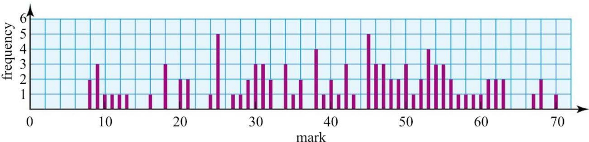

Figure 2.5

This diagram fails to give a clear picture of the overall distribution of marks. In this case you could consider a bar chart or, as the individual marks are known, a stem-and-leaf diagram, as follows.

 $$ \begin{array}{l}n=100\\2\left|\begin{array}{ccccccccccccc}5&represents~25&marks&\end{array}\right.\\0\left|\begin{array}{cccccccccccc}8&8&9&9&9&0&0&0&1&1&4&5&5&5&5&5&7&8&9&9\\0&1&2&3&6&8&8&8&0&0&1&1&1&1&2&2&4&4&4&5&6&6&8&8&8&9\\2\left|\begin{array}{ccccccccccccc}0&0&0&0&1&1&1&2&2&4&4&5&6&6&8&8&8&8&9&9&9&9&9&9&9&9\end{array}\right.\right.\\3\left|\begin{array}{ccccccccccccccccccccc}0&0&0&1&2&2&2&3&5&5&5&5&5&6&6&6&7&7&7&8&8&9&9&9&9&9&9&9\\0&0&1&2&2&2&2&3&3&3&3&3&4&4&4&5&5&5&6&6&7&8&9&9&9&9&9&9&9\\0&0&0&1&2&2&3&3&7&8&8&0&0&0&0&0&0&0&0&0&0&0&0&0&0&0&0&0&0\end{array}\right.\\6\left|\begin{array}{ccccccccccccccccccc}0&1&1&2&2&3&3&7&8&8&0&0&0&0&0&0&0&0&0&0&0&0&0&0&0&0&0&0&0\end{array}\right.\\7\left|\begin{array}{ccccccccccccccccccc}0&0&0&0&0&0&0&0&0&0&0&0&0&0&0&0&0&0&0&0&0&0&0&0&0&0&0&0&0\end{array}\right.\\\end{array} $$

<!-- page 72 -->

If the data have been grouped and the original data have been lost, or are otherwise unknown, then a histogram may be considered. A grouped frequency table and histogram illustrating the marks are shown below.

<table border=1 style='margin: auto; word-wrap: break-word;'><tr><td style='text-align: center; word-wrap: break-word;'>Marks, x</td><td style='text-align: center; word-wrap: break-word;'>Frequency, f</td></tr><tr><td style='text-align: center; word-wrap: break-word;'>0-9</td><td style='text-align: center; word-wrap: break-word;'>5</td></tr><tr><td style='text-align: center; word-wrap: break-word;'>10-19</td><td style='text-align: center; word-wrap: break-word;'>8</td></tr><tr><td style='text-align: center; word-wrap: break-word;'>20-29</td><td style='text-align: center; word-wrap: break-word;'>14</td></tr><tr><td style='text-align: center; word-wrap: break-word;'>30-39</td><td style='text-align: center; word-wrap: break-word;'>19</td></tr><tr><td style='text-align: center; word-wrap: break-word;'>40-49</td><td style='text-align: center; word-wrap: break-word;'>22</td></tr><tr><td style='text-align: center; word-wrap: break-word;'>50-59</td><td style='text-align: center; word-wrap: break-word;'>21</td></tr><tr><td style='text-align: center; word-wrap: break-word;'>60-70</td><td style='text-align: center; word-wrap: break-word;'>11</td></tr></table>

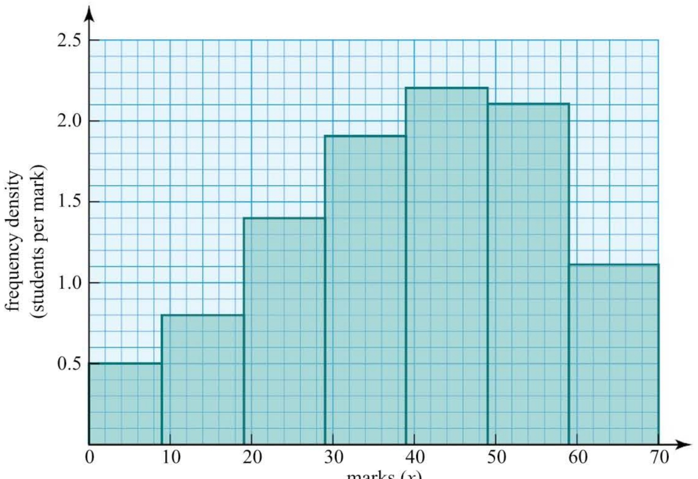

Figure 2.7

## Note

The class boundary 10–19 becomes  $ 9.5 \leq x < 19.5 $ for the purpose of drawing the histogram. You must give careful consideration to class boundaries, particularly if you are using rounded data.

Look at the intervals for the first and last classes. How do they differ from the others? Why is this the case?

Grouped discrete data are illustrated well by a histogram if the distribution is particularly skewed as is the case in the next example.

The first 50 positive integers squared are:

<table border=1 style='margin: auto; word-wrap: break-word;'><tr><td style='text-align: center; word-wrap: break-word;'>1</td><td style='text-align: center; word-wrap: break-word;'>4</td><td style='text-align: center; word-wrap: break-word;'>9</td><td style='text-align: center; word-wrap: break-word;'>16</td><td style='text-align: center; word-wrap: break-word;'>25</td><td style='text-align: center; word-wrap: break-word;'>36</td><td style='text-align: center; word-wrap: break-word;'>49</td><td style='text-align: center; word-wrap: break-word;'>64</td></tr><tr><td style='text-align: center; word-wrap: break-word;'>81</td><td style='text-align: center; word-wrap: break-word;'>100</td><td style='text-align: center; word-wrap: break-word;'>121</td><td style='text-align: center; word-wrap: break-word;'>144</td><td style='text-align: center; word-wrap: break-word;'>169</td><td style='text-align: center; word-wrap: break-word;'>196</td><td style='text-align: center; word-wrap: break-word;'>225</td><td style='text-align: center; word-wrap: break-word;'>256</td></tr><tr><td style='text-align: center; word-wrap: break-word;'>289</td><td style='text-align: center; word-wrap: break-word;'>324</td><td style='text-align: center; word-wrap: break-word;'>361</td><td style='text-align: center; word-wrap: break-word;'>400</td><td style='text-align: center; word-wrap: break-word;'>441</td><td style='text-align: center; word-wrap: break-word;'>484</td><td style='text-align: center; word-wrap: break-word;'>529</td><td style='text-align: center; word-wrap: break-word;'>576</td></tr><tr><td style='text-align: center; word-wrap: break-word;'>625</td><td style='text-align: center; word-wrap: break-word;'>676</td><td style='text-align: center; word-wrap: break-word;'>729</td><td style='text-align: center; word-wrap: break-word;'>784</td><td style='text-align: center; word-wrap: break-word;'>841</td><td style='text-align: center; word-wrap: break-word;'>900</td><td style='text-align: center; word-wrap: break-word;'>961</td><td style='text-align: center; word-wrap: break-word;'>1024</td></tr><tr><td style='text-align: center; word-wrap: break-word;'>1089</td><td style='text-align: center; word-wrap: break-word;'>1156</td><td style='text-align: center; word-wrap: break-word;'>1225</td><td style='text-align: center; word-wrap: break-word;'>1296</td><td style='text-align: center; word-wrap: break-word;'>1369</td><td style='text-align: center; word-wrap: break-word;'>1444</td><td style='text-align: center; word-wrap: break-word;'>1521</td><td style='text-align: center; word-wrap: break-word;'>1600</td></tr><tr><td style='text-align: center; word-wrap: break-word;'>1681</td><td style='text-align: center; word-wrap: break-word;'>1764</td><td style='text-align: center; word-wrap: break-word;'>1849</td><td style='text-align: center; word-wrap: break-word;'>1936</td><td style='text-align: center; word-wrap: break-word;'>2025</td><td style='text-align: center; word-wrap: break-word;'>2116</td><td style='text-align: center; word-wrap: break-word;'>2209</td><td style='text-align: center; word-wrap: break-word;'>2304</td></tr><tr><td style='text-align: center; word-wrap: break-word;'>2401</td><td style='text-align: center; word-wrap: break-word;'>2500</td><td style='text-align: center; word-wrap: break-word;'></td><td style='text-align: center; word-wrap: break-word;'></td><td style='text-align: center; word-wrap: break-word;'></td><td style='text-align: center; word-wrap: break-word;'></td><td style='text-align: center; word-wrap: break-word;'></td><td style='text-align: center; word-wrap: break-word;'></td></tr></table>

<!-- page 73 -->

<table border=1 style='margin: auto; word-wrap: break-word;'><tr><td style='text-align: center; word-wrap: break-word;'>Number, n</td><td style='text-align: center; word-wrap: break-word;'>Frequency, f</td></tr><tr><td style='text-align: center; word-wrap: break-word;'>$ 0 &lt; n ≤ 250 $</td><td style='text-align: center; word-wrap: break-word;'>15</td></tr><tr><td style='text-align: center; word-wrap: break-word;'>$ 250 &lt; n ≤ 500 $</td><td style='text-align: center; word-wrap: break-word;'>7</td></tr><tr><td style='text-align: center; word-wrap: break-word;'>$ 500 &lt; n ≤ 750 $</td><td style='text-align: center; word-wrap: break-word;'>5</td></tr><tr><td style='text-align: center; word-wrap: break-word;'>$ 750 &lt; n ≤ 1000 $</td><td style='text-align: center; word-wrap: break-word;'>4</td></tr><tr><td style='text-align: center; word-wrap: break-word;'>$ 1000 &lt; n ≤ 1250 $</td><td style='text-align: center; word-wrap: break-word;'>4</td></tr><tr><td style='text-align: center; word-wrap: break-word;'>$ 1250 &lt; n ≤ 1500 $</td><td style='text-align: center; word-wrap: break-word;'>3</td></tr><tr><td style='text-align: center; word-wrap: break-word;'>$ 1500 &lt; n ≤ 1750 $</td><td style='text-align: center; word-wrap: break-word;'>3</td></tr><tr><td style='text-align: center; word-wrap: break-word;'>$ 1750 &lt; n ≤ 2000 $</td><td style='text-align: center; word-wrap: break-word;'>3</td></tr><tr><td style='text-align: center; word-wrap: break-word;'>$ 2000 &lt; n ≤ 2250 $</td><td style='text-align: center; word-wrap: break-word;'>3</td></tr><tr><td style='text-align: center; word-wrap: break-word;'>$ 2250 &lt; n ≤ 2500 $</td><td style='text-align: center; word-wrap: break-word;'>3</td></tr></table>

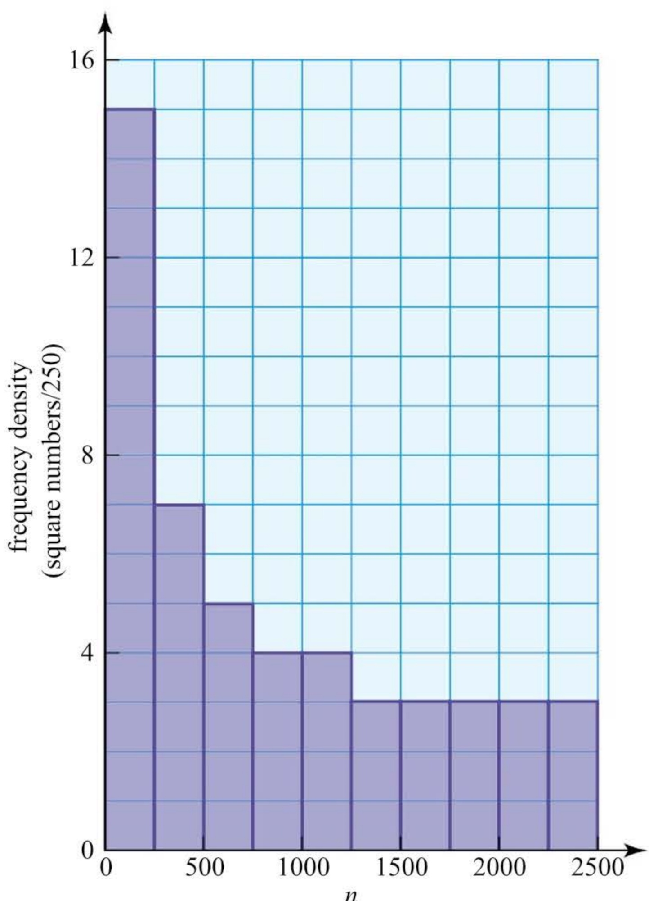

Figure 2.8

Histograms are usually used for illustrating continuous data. For discrete data it is better to draw a stem-and-leaf diagram, line graph or bar chart.

The main points to remember when drawing a histogram are:

Since the data are continuous, or treated as if they were continuous, adjacent columns of the histogram should touch (unlike a bar chart where the columns should be drawn with gaps between them).

It is the areas and not the heights of the columns that are proportional to the frequency of each class.

The vertical axis should be marked with the appropriate frequency density (frequency per 5 mm for example), rather than frequency.

<!-- page 74 -->

Exercise 2A

1 A number of trees in two woods were measured. Their diameters, correct to the nearest centimetre, are summarised in the table below.

<table border=1 style='margin: auto; word-wrap: break-word;'><tr><td style='text-align: center; word-wrap: break-word;'>Diameter (cm)</td><td style='text-align: center; word-wrap: break-word;'>1-10</td><td style='text-align: center; word-wrap: break-word;'>11-15</td><td style='text-align: center; word-wrap: break-word;'>16-20</td><td style='text-align: center; word-wrap: break-word;'>21-30</td><td style='text-align: center; word-wrap: break-word;'>31-50</td><td style='text-align: center; word-wrap: break-word;'>Total</td></tr><tr><td style='text-align: center; word-wrap: break-word;'>Mensah&#x27;s Wood</td><td style='text-align: center; word-wrap: break-word;'>10</td><td style='text-align: center; word-wrap: break-word;'>5</td><td style='text-align: center; word-wrap: break-word;'>3</td><td style='text-align: center; word-wrap: break-word;'>11</td><td style='text-align: center; word-wrap: break-word;'>1</td><td style='text-align: center; word-wrap: break-word;'>30</td></tr><tr><td style='text-align: center; word-wrap: break-word;'>Ashanti Forest</td><td style='text-align: center; word-wrap: break-word;'>6</td><td style='text-align: center; word-wrap: break-word;'>8</td><td style='text-align: center; word-wrap: break-word;'>20</td><td style='text-align: center; word-wrap: break-word;'>5</td><td style='text-align: center; word-wrap: break-word;'>1</td><td style='text-align: center; word-wrap: break-word;'>40</td></tr></table>

(Trees less than 0.5 cm in diameter are not included.)

(i) Write down the actual class boundaries.

(ii) Draw two separate histograms to illustrate this information.

(iii) State the modal class for each wood.

(iv) Describe the main features of the distributions for the two woods.

2 Listed below are the prime numbers, $p$, from 1 up to 1000. (1 itself is not usually defined as a prime.)

Primes up to 1000

<table border=1 style='margin: auto; word-wrap: break-word;'><tr><td style='text-align: center; word-wrap: break-word;'>2</td><td style='text-align: center; word-wrap: break-word;'>3</td><td style='text-align: center; word-wrap: break-word;'>5</td><td style='text-align: center; word-wrap: break-word;'>7</td><td style='text-align: center; word-wrap: break-word;'>11</td><td style='text-align: center; word-wrap: break-word;'>13</td><td style='text-align: center; word-wrap: break-word;'>17</td><td style='text-align: center; word-wrap: break-word;'>19</td><td style='text-align: center; word-wrap: break-word;'>23</td><td style='text-align: center; word-wrap: break-word;'>29</td><td style='text-align: center; word-wrap: break-word;'>31</td><td style='text-align: center; word-wrap: break-word;'>37</td><td style='text-align: center; word-wrap: break-word;'>41</td><td style='text-align: center; word-wrap: break-word;'>43</td></tr><tr><td style='text-align: center; word-wrap: break-word;'>47</td><td style='text-align: center; word-wrap: break-word;'>53</td><td style='text-align: center; word-wrap: break-word;'>59</td><td style='text-align: center; word-wrap: break-word;'>61</td><td style='text-align: center; word-wrap: break-word;'>67</td><td style='text-align: center; word-wrap: break-word;'>71</td><td style='text-align: center; word-wrap: break-word;'>73</td><td style='text-align: center; word-wrap: break-word;'>79</td><td style='text-align: center; word-wrap: break-word;'>83</td><td style='text-align: center; word-wrap: break-word;'>89</td><td style='text-align: center; word-wrap: break-word;'>97</td><td style='text-align: center; word-wrap: break-word;'>101</td><td style='text-align: center; word-wrap: break-word;'>103</td><td style='text-align: center; word-wrap: break-word;'>107</td></tr><tr><td style='text-align: center; word-wrap: break-word;'>109</td><td style='text-align: center; word-wrap: break-word;'>113</td><td style='text-align: center; word-wrap: break-word;'>127</td><td style='text-align: center; word-wrap: break-word;'>131</td><td style='text-align: center; word-wrap: break-word;'>137</td><td style='text-align: center; word-wrap: break-word;'>139</td><td style='text-align: center; word-wrap: break-word;'>149</td><td style='text-align: center; word-wrap: break-word;'>151</td><td style='text-align: center; word-wrap: break-word;'>157</td><td style='text-align: center; word-wrap: break-word;'>163</td><td style='text-align: center; word-wrap: break-word;'>167</td><td style='text-align: center; word-wrap: break-word;'>173</td><td style='text-align: center; word-wrap: break-word;'>179</td><td style='text-align: center; word-wrap: break-word;'>181</td></tr><tr><td style='text-align: center; word-wrap: break-word;'>191</td><td style='text-align: center; word-wrap: break-word;'>193</td><td style='text-align: center; word-wrap: break-word;'>197</td><td style='text-align: center; word-wrap: break-word;'>199</td><td style='text-align: center; word-wrap: break-word;'>211</td><td style='text-align: center; word-wrap: break-word;'>223</td><td style='text-align: center; word-wrap: break-word;'>227</td><td style='text-align: center; word-wrap: break-word;'>229</td><td style='text-align: center; word-wrap: break-word;'>233</td><td style='text-align: center; word-wrap: break-word;'>239</td><td style='text-align: center; word-wrap: break-word;'>241</td><td style='text-align: center; word-wrap: break-word;'>251</td><td style='text-align: center; word-wrap: break-word;'>257</td><td style='text-align: center; word-wrap: break-word;'>263</td></tr><tr><td style='text-align: center; word-wrap: break-word;'>269</td><td style='text-align: center; word-wrap: break-word;'>271</td><td style='text-align: center; word-wrap: break-word;'>277</td><td style='text-align: center; word-wrap: break-word;'>281</td><td style='text-align: center; word-wrap: break-word;'>283</td><td style='text-align: center; word-wrap: break-word;'>293</td><td style='text-align: center; word-wrap: break-word;'>307</td><td style='text-align: center; word-wrap: break-word;'>311</td><td style='text-align: center; word-wrap: break-word;'>313</td><td style='text-align: center; word-wrap: break-word;'>317</td><td style='text-align: center; word-wrap: break-word;'>331</td><td style='text-align: center; word-wrap: break-word;'>337</td><td style='text-align: center; word-wrap: break-word;'>347</td><td style='text-align: center; word-wrap: break-word;'>349</td></tr><tr><td style='text-align: center; word-wrap: break-word;'>353</td><td style='text-align: center; word-wrap: break-word;'>359</td><td style='text-align: center; word-wrap: break-word;'>367</td><td style='text-align: center; word-wrap: break-word;'>373</td><td style='text-align: center; word-wrap: break-word;'>379</td><td style='text-align: center; word-wrap: break-word;'>383</td><td style='text-align: center; word-wrap: break-word;'>389</td><td style='text-align: center; word-wrap: break-word;'>397</td><td style='text-align: center; word-wrap: break-word;'>401</td><td style='text-align: center; word-wrap: break-word;'>409</td><td style='text-align: center; word-wrap: break-word;'>419</td><td style='text-align: center; word-wrap: break-word;'>421</td><td style='text-align: center; word-wrap: break-word;'>431</td><td style='text-align: center; word-wrap: break-word;'>433</td></tr><tr><td style='text-align: center; word-wrap: break-word;'>439</td><td style='text-align: center; word-wrap: break-word;'>443</td><td style='text-align: center; word-wrap: break-word;'>449</td><td style='text-align: center; word-wrap: break-word;'>457</td><td style='text-align: center; word-wrap: break-word;'>461</td><td style='text-align: center; word-wrap: break-word;'>463</td><td style='text-align: center; word-wrap: break-word;'>467</td><td style='text-align: center; word-wrap: break-word;'>479</td><td style='text-align: center; word-wrap: break-word;'>487</td><td style='text-align: center; word-wrap: break-word;'>491</td><td style='text-align: center; word-wrap: break-word;'>499</td><td style='text-align: center; word-wrap: break-word;'>503</td><td style='text-align: center; word-wrap: break-word;'>509</td><td style='text-align: center; word-wrap: break-word;'>521</td></tr><tr><td style='text-align: center; word-wrap: break-word;'>523</td><td style='text-align: center; word-wrap: break-word;'>541</td><td style='text-align: center; word-wrap: break-word;'>547</td><td style='text-align: center; word-wrap: break-word;'>557</td><td style='text-align: center; word-wrap: break-word;'>563</td><td style='text-align: center; word-wrap: break-word;'>569</td><td style='text-align: center; word-wrap: break-word;'>571</td><td style='text-align: center; word-wrap: break-word;'>577</td><td style='text-align: center; word-wrap: break-word;'>587</td><td style='text-align: center; word-wrap: break-word;'>593</td><td style='text-align: center; word-wrap: break-word;'>599</td><td style='text-align: center; word-wrap: break-word;'>601</td><td style='text-align: center; word-wrap: break-word;'>607</td><td style='text-align: center; word-wrap: break-word;'>613</td></tr><tr><td style='text-align: center; word-wrap: break-word;'>617</td><td style='text-align: center; word-wrap: break-word;'>619</td><td style='text-align: center; word-wrap: break-word;'>631</td><td style='text-align: center; word-wrap: break-word;'>641</td><td style='text-align: center; word-wrap: break-word;'>643</td><td style='text-align: center; word-wrap: break-word;'>647</td><td style='text-align: center; word-wrap: break-word;'>653</td><td style='text-align: center; word-wrap: break-word;'>659</td><td style='text-align: center; word-wrap: break-word;'>661</td><td style='text-align: center; word-wrap: break-word;'>673</td><td style='text-align: center; word-wrap: break-word;'>677</td><td style='text-align: center; word-wrap: break-word;'>683</td><td style='text-align: center; word-wrap: break-word;'>691</td><td style='text-align: center; word-wrap: break-word;'>701</td></tr><tr><td style='text-align: center; word-wrap: break-word;'>709</td><td style='text-align: center; word-wrap: break-word;'>719</td><td style='text-align: center; word-wrap: break-word;'>727</td><td style='text-align: center; word-wrap: break-word;'>733</td><td style='text-align: center; word-wrap: break-word;'>739</td><td style='text-align: center; word-wrap: break-word;'>743</td><td style='text-align: center; word-wrap: break-word;'>751</td><td style='text-align: center; word-wrap: break-word;'>757</td><td style='text-align: center; word-wrap: break-word;'>761</td><td style='text-align: center; word-wrap: break-word;'>769</td><td style='text-align: center; word-wrap: break-word;'>773</td><td style='text-align: center; word-wrap: break-word;'>787</td><td style='text-align: center; word-wrap: break-word;'>797</td><td style='text-align: center; word-wrap: break-word;'>809</td></tr><tr><td style='text-align: center; word-wrap: break-word;'>811</td><td style='text-align: center; word-wrap: break-word;'>821</td><td style='text-align: center; word-wrap: break-word;'>823</td><td style='text-align: center; word-wrap: break-word;'>827</td><td style='text-align: center; word-wrap: break-word;'>829</td><td style='text-align: center; word-wrap: break-word;'>839</td><td style='text-align: center; word-wrap: break-word;'>853</td><td style='text-align: center; word-wrap: break-word;'>857</td><td style='text-align: center; word-wrap: break-word;'>859</td><td style='text-align: center; word-wrap: break-word;'>863</td><td style='text-align: center; word-wrap: break-word;'>877</td><td style='text-align: center; word-wrap: break-word;'>881</td><td style='text-align: center; word-wrap: break-word;'>883</td><td style='text-align: center; word-wrap: break-word;'>887</td></tr><tr><td style='text-align: center; word-wrap: break-word;'>907</td><td style='text-align: center; word-wrap: break-word;'>911</td><td style='text-align: center; word-wrap: break-word;'>919</td><td style='text-align: center; word-wrap: break-word;'>929</td><td style='text-align: center; word-wrap: break-word;'>937</td><td style='text-align: center; word-wrap: break-word;'>941</td><td style='text-align: center; word-wrap: break-word;'>947</td><td style='text-align: center; word-wrap: break-word;'>953</td><td style='text-align: center; word-wrap: break-word;'>967</td><td style='text-align: center; word-wrap: break-word;'>971</td><td style='text-align: center; word-wrap: break-word;'>977</td><td style='text-align: center; word-wrap: break-word;'>983</td><td style='text-align: center; word-wrap: break-word;'>991</td><td style='text-align: center; word-wrap: break-word;'>997</td></tr></table>

(i) Draw a histogram to illustrate these data with the following class intervals:

 $ 1 \leq p < 20 $ \quad  $ 20 \leq p < 50 $ \quad  $ 50 \leq p < 100 $ \quad  $ 100 \leq p < 200 $

 $ 200 \leq p < 300 $ \quad  $ 300 \leq p < 500 $ and  $ 500 \leq p < 1000 $.

(ii) Comment on the shape of the distribution.

3 A crate containing 270 oranges was opened and each orange was weighed to the nearest gram.The masses were found to be distributed as in this table.

(i) Draw a histogram to illustrate the data.

(ii) From the table, calculate an estimate of the mean mass of an orange from this crate.

<table border=1 style='margin: auto; word-wrap: break-word;'><tr><td style='text-align: center; word-wrap: break-word;'>Mass (grams)</td><td style='text-align: center; word-wrap: break-word;'>Number of oranges</td></tr><tr><td style='text-align: center; word-wrap: break-word;'>60-99</td><td style='text-align: center; word-wrap: break-word;'>20</td></tr><tr><td style='text-align: center; word-wrap: break-word;'>100-119</td><td style='text-align: center; word-wrap: break-word;'>60</td></tr><tr><td style='text-align: center; word-wrap: break-word;'>120-139</td><td style='text-align: center; word-wrap: break-word;'>80</td></tr><tr><td style='text-align: center; word-wrap: break-word;'>140-159</td><td style='text-align: center; word-wrap: break-word;'>50</td></tr><tr><td style='text-align: center; word-wrap: break-word;'>160-219</td><td style='text-align: center; word-wrap: break-word;'>60</td></tr></table>

<!-- page 75 -->

4 In an agricultural experiment, 320 plants were grown on a plot, and the lengths of the stems were measured to the nearest centimetre ten weeks after planting. The lengths were found to be distributed as in this table.

(i) Draw a histogram to illustrate the data.

(ii) From the table, calculate an estimate of the mean length of stem of a plant from this experiment.

<table border=1 style='margin: auto; word-wrap: break-word;'><tr><td style='text-align: center; word-wrap: break-word;'>Length (cm)</td><td style='text-align: center; word-wrap: break-word;'>Number of plants</td></tr><tr><td style='text-align: center; word-wrap: break-word;'>20-31</td><td style='text-align: center; word-wrap: break-word;'>30</td></tr><tr><td style='text-align: center; word-wrap: break-word;'>32-37</td><td style='text-align: center; word-wrap: break-word;'>80</td></tr><tr><td style='text-align: center; word-wrap: break-word;'>38-43</td><td style='text-align: center; word-wrap: break-word;'>90</td></tr><tr><td style='text-align: center; word-wrap: break-word;'>44-49</td><td style='text-align: center; word-wrap: break-word;'>60</td></tr><tr><td style='text-align: center; word-wrap: break-word;'>50-67</td><td style='text-align: center; word-wrap: break-word;'>60</td></tr></table>

5 The lengths of time of sixty songs recorded by a certain group of singers are summarised in the table below.

<table border=1 style='margin: auto; word-wrap: break-word;'><tr><td style='text-align: center; word-wrap: break-word;'>Song length in seconds (x)</td><td style='text-align: center; word-wrap: break-word;'>Number of songs</td></tr><tr><td style='text-align: center; word-wrap: break-word;'>0 &lt; x &lt; 120</td><td style='text-align: center; word-wrap: break-word;'>1</td></tr><tr><td style='text-align: center; word-wrap: break-word;'>120 ≤ x &lt; 180</td><td style='text-align: center; word-wrap: break-word;'>9</td></tr><tr><td style='text-align: center; word-wrap: break-word;'>180 ≤ x &lt; 240</td><td style='text-align: center; word-wrap: break-word;'>15</td></tr><tr><td style='text-align: center; word-wrap: break-word;'>240 ≤ x &lt; 300</td><td style='text-align: center; word-wrap: break-word;'>17</td></tr><tr><td style='text-align: center; word-wrap: break-word;'>300 ≤ x &lt; 360</td><td style='text-align: center; word-wrap: break-word;'>13</td></tr><tr><td style='text-align: center; word-wrap: break-word;'>360 ≤ x &lt; 600</td><td style='text-align: center; word-wrap: break-word;'>5</td></tr></table>

(i) Display the data on a histogram.

(ii) Determine the mean song length.

6 The doctors in a hospital in an African country are concerned about the health of pregnant women in the region. They decide to record and monitor the weights of newborn babies.

(i) A junior office clerk suggests recording the babies' weights in this frequency table.

<table border=1 style='margin: auto; word-wrap: break-word;'><tr><td style='text-align: center; word-wrap: break-word;'>Weight (kg)</td><td style='text-align: center; word-wrap: break-word;'>2.0-2.5</td><td style='text-align: center; word-wrap: break-word;'>2.5-3.0</td><td style='text-align: center; word-wrap: break-word;'>3.0-3.5</td><td style='text-align: center; word-wrap: break-word;'>3.5-4.0</td></tr><tr><td style='text-align: center; word-wrap: break-word;'>Frequency</td><td style='text-align: center; word-wrap: break-word;'>Doctors</td><td style='text-align: center; word-wrap: break-word;'>to</td><td style='text-align: center; word-wrap: break-word;'>fill</td><td style='text-align: center; word-wrap: break-word;'>in</td></tr></table>

Give three criticisms of the table.

(ii) After some months the doctors have enough data to draw this histogram.

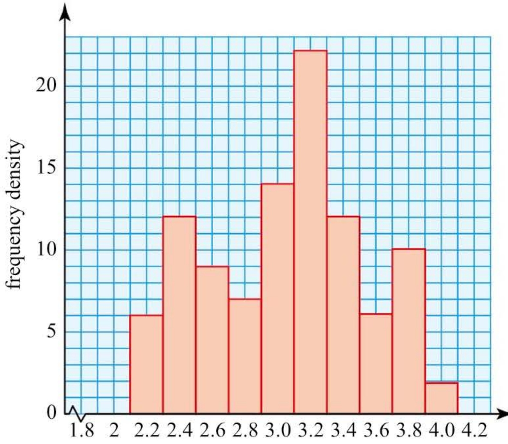

birth weight (kg)

<!-- page 76 -->

The doctors consider babies less than 2.7kg to be small and those over 3.9kg to be large.

They then consider a number of possible courses of action:

» carry on as at present

induce any babies that are more than a week overdue

▶ set up a special clinic for 'at risk' pregnant women.

Comment on what features of the histogram give rise to each of these suggestions.

(iii) The doctors decide that the best option is to set up a special clinic.

Suggest what other data they will need in order to make a strong case for funding.

7 After completing a long assignment, a student was told by his tutor that it was more like a book than an essay. He decided to investigate how many pages there are in a typical book and started by writing down the numbers of pages in the books on one of his shelves, as follows.

<table border=1 style='margin: auto; word-wrap: break-word;'><tr><td style='text-align: center; word-wrap: break-word;'>256</td><td style='text-align: center; word-wrap: break-word;'>128</td><td style='text-align: center; word-wrap: break-word;'>160</td><td style='text-align: center; word-wrap: break-word;'>128</td><td style='text-align: center; word-wrap: break-word;'>192</td><td style='text-align: center; word-wrap: break-word;'>64</td><td style='text-align: center; word-wrap: break-word;'>356</td><td style='text-align: center; word-wrap: break-word;'>96</td><td style='text-align: center; word-wrap: break-word;'>64</td><td style='text-align: center; word-wrap: break-word;'>160</td></tr><tr><td style='text-align: center; word-wrap: break-word;'>464</td><td style='text-align: center; word-wrap: break-word;'>128</td><td style='text-align: center; word-wrap: break-word;'>96</td><td style='text-align: center; word-wrap: break-word;'>96</td><td style='text-align: center; word-wrap: break-word;'>556</td><td style='text-align: center; word-wrap: break-word;'>148</td><td style='text-align: center; word-wrap: break-word;'>64</td><td style='text-align: center; word-wrap: break-word;'>192</td><td style='text-align: center; word-wrap: break-word;'>96</td><td style='text-align: center; word-wrap: break-word;'>512</td></tr><tr><td style='text-align: center; word-wrap: break-word;'>940</td><td style='text-align: center; word-wrap: break-word;'>676</td><td style='text-align: center; word-wrap: break-word;'>128</td><td style='text-align: center; word-wrap: break-word;'>196</td><td style='text-align: center; word-wrap: break-word;'>640</td><td style='text-align: center; word-wrap: break-word;'>44</td><td style='text-align: center; word-wrap: break-word;'>64</td><td style='text-align: center; word-wrap: break-word;'>144</td><td style='text-align: center; word-wrap: break-word;'>256</td><td style='text-align: center; word-wrap: break-word;'>72</td></tr></table>

(i) Look carefully at the data and state, giving your reasons, whether they are continuous or discrete. Give an explanation for your answer.

(ii) Decide on the most helpful method of displaying the data and draw the appropriate diagram.

8 As part of a data collection exercise, members of a certain school year group were asked how long they spent on their Mathematics homework during one particular week. The times are given to the nearest 0.1 hour. The results are displayed in the following table.

<table border=1 style='margin: auto; word-wrap: break-word;'><tr><td style='text-align: center; word-wrap: break-word;'>Time spent (t hours)</td><td style='text-align: center; word-wrap: break-word;'>$ 0.1 ≤ t ≤ 0.5 $</td><td style='text-align: center; word-wrap: break-word;'>$ 0.6 ≤ t ≤ 1.0 $</td><td style='text-align: center; word-wrap: break-word;'>$ 1.1 ≤ t ≤ 2.0 $</td><td style='text-align: center; word-wrap: break-word;'>$ 2.1 ≤ t ≤ 3.0 $</td><td style='text-align: center; word-wrap: break-word;'>$ 3.1 ≤ t ≤ 4.5 $</td></tr><tr><td style='text-align: center; word-wrap: break-word;'>Frequency</td><td style='text-align: center; word-wrap: break-word;'>11</td><td style='text-align: center; word-wrap: break-word;'>15</td><td style='text-align: center; word-wrap: break-word;'>18</td><td style='text-align: center; word-wrap: break-word;'>30</td><td style='text-align: center; word-wrap: break-word;'>21</td></tr></table>

(i) Draw, on graph paper, a histogram to illustrate this information.

(ii) Calculate an estimate of the mean time spent on their Mathematics homework by members of this year group.

Cambridge International AS & A Level Mathematics

9709 Paper 6 Q5 June 2008

### 2.2 Measures of central tendency and of spread using quartiles

You saw in Chapter 1 how to find the median of a set of discrete data. As a reminder, the median is the value of the middle item when all the data items have been ranked in order.

<!-- page 77 -->

The median is the value of the  $ \frac{n+1}{2} $th item and is half-way through the data set.

The values one-quarter of the way through the data set and three-quarters of the way through the data set are called the lower quartile and the upper quartile respectively. The lower quartile, median and upper quartile are usually denoted using  $ Q_{1} $,  $ Q_{2} $ and  $ Q_{3} $.

Quartiles are used mainly with large data sets and their values found by looking at the  $ \frac{1}{4} $,  $ \frac{1}{2} $ and  $ \frac{3}{4} $ points. So, for a data set of 1000, you would take  $ Q_{1} $ to be the value of the 250th data item,  $ Q_{2} $ to be the value of the 500th data item and  $ Q_{3} $ to be the value of the 750th data item.

## Quartiles for small data sets

For small data sets, where each data item is known (raw data), calculation of the middle quartile $Q_{2}$, the median, is straightforward. However, there are no standard formulae for the calculation of the lower and upper quartiles, $Q_{1}$ and $Q_{3}$, and you may meet different ones. The one we will use is consistent with the output from some calculators which display the quartiles of a data set and depends on whether the number of items, $n$, is even or odd.

If n is even then there will be an equal number of items in the lower half and upper half of the data set. To calculate the lower quartile,  $ Q_{1} $, find the median of the lower half of the data set. To calculate the upper quartile,  $ Q_{3} $, find the median of the upper half of the data set.

For example, for the data set {1, 3, 6, 10, 15, 21, 28, 36, 45, 55} the median, $Q_{2}$, is $\frac{15+21}{2}=18$. The lower quartile, $Q_{1}$, is the median of {1, 3, 6, 10, 15}, i.e. 6. The upper quartile, $Q_{3}$, is the median of {21, 28, 36, 45, 55}, i.e. 36.

If n is odd then define the ‘lower half’ to be all data items below the median. Similarly define the ‘upper half’ to be all data items above the median. Then proceed as if n were even.

For example, for the data set \{1, 3, 6, 10, 15, 21, 28, 36, 45\} the median,  $ Q_{2} $, is 15. The lower quartile,  $ Q_{1} $, is the median of \{1, 3, 6, 10\}, i.e.  $ \frac{3+6}{2}=4.5 $. The upper quartile,  $ Q_{3} $, is the median of \{21, 28, 36, 45\}, i.e.  $ \frac{28+36}{2}=32 $.

The definition of quartiles on a spreadsheet may be different from that described above. Values of  $ Q_{1} $ and  $ Q_{3} $ in the even case shown above are given as 7 and 34 respectively on an Excel spreadsheet. Similarly, values of  $ Q_{1} $ and  $ Q_{3} $ in the odd case shown above are given as 6 and 28 respectively.

<!-- page 78 -->

### ACTIVITY 2.1

If you have access to a computer, use a spreadsheet to find the median and quartiles of a small data set. Find out the method the spreadsheet uses to determine the position of the lower and upper quartiles.

Example 2.1

Catherine is a junior reporter. As part of an investigation into consumer affairs she purchases 0.5 kg of chicken from 12 shops and supermarkets in the town. The resulting data, put into rank order, are as follows:

1.39 1.39 1.46 1.48 1.48 1.50 1.52 1.54 1.60 1.65 1.68 1.72

Find  $ Q_{1} $,  $ Q_{2} $ and  $ Q_{3} $.

## Solution

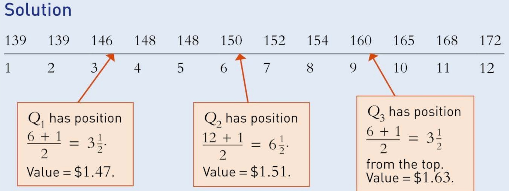

In fact, the upper quartile has a value of $1.625 but this has been rounded up to the nearest cent.

You may encounter different formulae for finding the lower and upper quartiles. The ones given here are relatively easy to calculate and usually lead to values of  $ Q_{1} $ and  $ Q_{3} $ which are close to the true values.

What are the true values?

## Interquartile range or quartile spread

The difference between the lower and upper quartiles is known as the interquartile range or quartile spread.

▶ Interquartile range (IQR) = Q_{3} - Q_{1}.

In Example 2.1,  $ IQR = 163 - 147 = 16 $ cents.

The interquartile range covers the middle 50% of the data. It is relatively easy to calculate and is a useful measure of spread as it avoids extreme values. It is said to be resistant to outliers.

<!-- page 79 -->

## Box-and-whisker plots (boxplots)

The three quartiles and the two extreme values of a data set may be illustrated in a box-and-whisker plot. This is designed to give an easy-to-read representation of the location and spread of a distribution. Figure 2.9 shows a box-and-whisker plot for the data in Example 2.1.

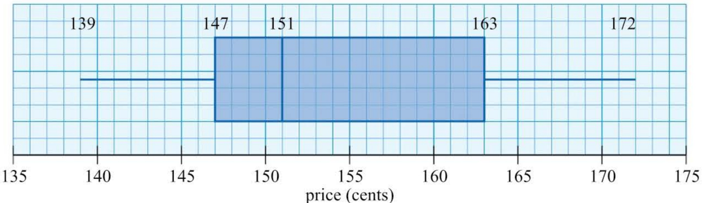

Figure 2.9

The box represents the middle 50% of the distribution and the whiskers stretch out to the extreme values.

## Outliers

In Chapter 1 you met a definition of an outlier based on the mean and standard deviation. A different approach gives the definition of an outlier in terms of the median and interquartile range (IQR).

Data that are more than  $ 1.5 \times IQR $ beyond the lower or upper quartiles are regarded as outliers.

The corresponding boundary values beyond which outliers may be found are

 $$ \mathrm{Q}_{1}-1.5\times(\mathrm{Q}_{3}-\mathrm{Q}_{1})\qquad\mathrm{and}\qquad\mathrm{Q}_{3}+1.5\times(\mathrm{Q}_{3}-\mathrm{Q}_{1}). $$ 

For the data relating to the ages of the cyclists involved in accidents discussed in Chapter 1, for all 92 data values  $ Q_{1}=13.5 $ and  $ Q_{3}=45.5 $.

 $$ \begin{aligned}Q_{1}-1.5\times(Q_{3}-Q_{1})&=13.5-1.5\times(45.5-13.5)\\&=13.5-1.5\times32\\&=-34.5\end{aligned} $$ 

and

 $$ \begin{aligned}Q_{3}+1.5\times(Q_{3}-Q_{1})&=45.5+1.5\times(45.5-13.5)\\&=45.5+1.5\times32\\&=93.5\end{aligned} $$ 

From these boundary values you will see that there are no outliers at the lower end of the range, but the value of 138 is an outlier at the upper end of the range.

Figure 2.10 shows a box-and-whisker plot for the ages of the cyclists with the outlier removed. For the remaining 91 data items $Q_{1}=13$ and $Q_{3}=45$.

<!-- page 80 -->

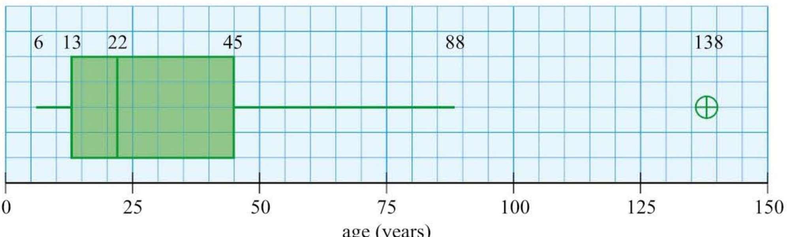

Figure 2.10

From the diagram you can see that the distribution has positive or right skewness. The  $ \oplus $ indicates an outlier and is above the upper quartile. Outliers are usually labelled as they are often of special interest. The whiskers are drawn to the most extreme data points which are not outliers.

### 2.3 Cumulative frequency graphs

When working with large data sets or grouped data, percentiles and quartiles can be found from cumulative frequency graphs (also known as cumulative frequency curves) as shown in the next section.

I am a student trying to live on a small allowance. I'm trying my best to allow myself a sensible monthly budget but my lecturers have given me a long list of textbooks to buy. If I buy just half of them I will have nothing left to live on this month. The majority of books on my list are over $16.

I want to do well at my studies but I won't do well without books and I won't do well if I am ill through not eating properly.

Please tell me what to do, and don't say 'go to the library' because the books I need are never there.

After reading this opening post a journalist wondered if there was a story in it. He decided to carry out a survey of the prices of textbooks in a large shop. The reporter took a large sample of 470 textbooks and the results are summarised in the table.

<table border=1 style='margin: auto; word-wrap: break-word;'><tr><td style='text-align: center; word-wrap: break-word;'>Cost, C ($)</td><td style='text-align: center; word-wrap: break-word;'>Frequency (no. of books)</td></tr><tr><td style='text-align: center; word-wrap: break-word;'>0 ≤ C &lt; 10</td><td style='text-align: center; word-wrap: break-word;'>13</td></tr><tr><td style='text-align: center; word-wrap: break-word;'>10 ≤ C &lt; 15</td><td style='text-align: center; word-wrap: break-word;'>53</td></tr><tr><td style='text-align: center; word-wrap: break-word;'>15 ≤ C &lt; 20</td><td style='text-align: center; word-wrap: break-word;'>97</td></tr><tr><td style='text-align: center; word-wrap: break-word;'>20 ≤ C &lt; 25</td><td style='text-align: center; word-wrap: break-word;'>145</td></tr><tr><td style='text-align: center; word-wrap: break-word;'>25 ≤ C &lt; 30</td><td style='text-align: center; word-wrap: break-word;'>81</td></tr><tr><td style='text-align: center; word-wrap: break-word;'>30 ≤ C &lt; 35</td><td style='text-align: center; word-wrap: break-word;'>40</td></tr><tr><td style='text-align: center; word-wrap: break-word;'>35 ≤ C &lt; 40</td><td style='text-align: center; word-wrap: break-word;'>23</td></tr><tr><td style='text-align: center; word-wrap: break-word;'>40 ≤ C &lt; 45</td><td style='text-align: center; word-wrap: break-word;'>12</td></tr><tr><td style='text-align: center; word-wrap: break-word;'>45 ≤ C &lt; 50</td><td style='text-align: center; word-wrap: break-word;'>6</td></tr></table>

<!-- page 81 -->

He decided to estimate the median and the upper and lower quartiles of the costs of the books. (Without the original data you cannot find the actual values so all calculations will be estimates.) The first step is to make a cumulative frequency table, then to plot a cumulative frequency graph.

<table border=1 style='margin: auto; word-wrap: break-word;'><tr><td style='text-align: center; word-wrap: break-word;'>Cost, C ($)</td><td style='text-align: center; word-wrap: break-word;'>Frequency</td><td style='text-align: center; word-wrap: break-word;'>Cost</td><td style='text-align: center; word-wrap: break-word;'>Cumulative frequency</td></tr><tr><td style='text-align: center; word-wrap: break-word;'>0 ≤ C &lt; 10</td><td style='text-align: center; word-wrap: break-word;'>13</td><td style='text-align: center; word-wrap: break-word;'>C &lt; 10</td><td style='text-align: center; word-wrap: break-word;'>13</td></tr><tr><td style='text-align: center; word-wrap: break-word;'>10 ≤ C &lt; 15</td><td style='text-align: center; word-wrap: break-word;'>53</td><td style='text-align: center; word-wrap: break-word;'>C &lt; 15</td><td style='text-align: center; word-wrap: break-word;'>66</td></tr><tr><td style='text-align: center; word-wrap: break-word;'>15 ≤ C &lt; 20</td><td style='text-align: center; word-wrap: break-word;'>97</td><td style='text-align: center; word-wrap: break-word;'>C &lt; 20</td><td style='text-align: center; word-wrap: break-word;'>163</td></tr><tr><td style='text-align: center; word-wrap: break-word;'>20 ≤ C &lt; 25</td><td style='text-align: center; word-wrap: break-word;'>145</td><td style='text-align: center; word-wrap: break-word;'>C &lt; 25</td><td style='text-align: center; word-wrap: break-word;'>308</td></tr><tr><td style='text-align: center; word-wrap: break-word;'>25 ≤ C &lt; 30</td><td style='text-align: center; word-wrap: break-word;'>81</td><td style='text-align: center; word-wrap: break-word;'>C &lt; 30</td><td style='text-align: center; word-wrap: break-word;'>389</td></tr><tr><td style='text-align: center; word-wrap: break-word;'>30 ≤ C &lt; 35</td><td style='text-align: center; word-wrap: break-word;'>40</td><td style='text-align: center; word-wrap: break-word;'>C &lt; 35</td><td style='text-align: center; word-wrap: break-word;'>429</td></tr><tr><td style='text-align: center; word-wrap: break-word;'>35 ≤ C &lt; 40</td><td style='text-align: center; word-wrap: break-word;'>23</td><td style='text-align: center; word-wrap: break-word;'>C &lt; 40</td><td style='text-align: center; word-wrap: break-word;'>452</td></tr><tr><td style='text-align: center; word-wrap: break-word;'>40 ≤ C &lt; 45</td><td style='text-align: center; word-wrap: break-word;'>12</td><td style='text-align: center; word-wrap: break-word;'>C &lt; 45</td><td style='text-align: center; word-wrap: break-word;'>464</td></tr><tr><td style='text-align: center; word-wrap: break-word;'>45 ≤ C &lt; 50</td><td style='text-align: center; word-wrap: break-word;'>6</td><td style='text-align: center; word-wrap: break-word;'>C &lt; 50</td><td style='text-align: center; word-wrap: break-word;'>470</td></tr></table>

## Notes

1 Notice that the interval

 $ C < 15 $ means  $ 0 \leq C < 15 $

and so includes the

13 books in the interval

 $ 0 \leq C < 10 $ and the 53

books in the interval

 $ 10 \leq C < 15 $, giving 66

books in total.

2 Similarly, to find the total for the interval C < 20 you must add the number of books in the interval  $ 15 \leq C < 20 $ to your previous total, giving you  $ 66 + 97 = 163 $.

A cumulative frequency graph is obtained by plotting the upper boundary of each class against the cumulative frequency. The points are joined by a smooth curve, as shown in Figure 2.11.

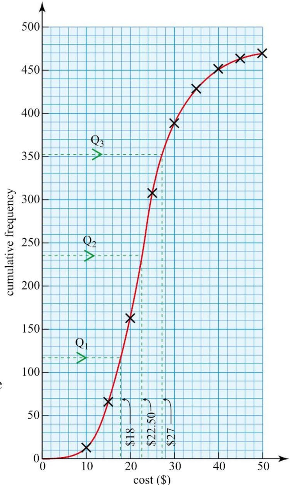

Figure 2.11

<!-- page 82 -->

In this example the actual values are unknown and the median must therefore be an estimate. It is usual in such cases to find the estimated value of the  $ \frac{n}{2} $th item. This gives a better estimate of the median than is obtained by using  $ \frac{n+1}{2} $, which is used for ungrouped data. Similarly, estimates of the lower and upper quartiles are found from the  $ \frac{n}{4} $th and  $ \frac{3n}{4} $th items.

The 235th  $ \left(\frac{470}{2}\right) $ item of data identifies the median, which has a value of about 22.50. The 117.5th  $ \left(\frac{470}{2}\right) $ item of data identifies the lower quartile, which has a value of about 18 and the 352.5th  $ \left(\frac{3}{4}\times470\right) $ item of data identifies the upper quartile, which has a value of about 27.

Notice the distinctive shape of the cumulative frequency graph. It is like a stretched-out S-shape leaning forwards.

What about Sheuligirl's claim that the majority of textbooks cost more than 16?  $ Q_{1} = \18 $. By definition 75% of books are more expensive than this, so Sheuligirl's claim seems to be well founded. We need to check exactly how many books are estimated to be more expensive than 16.

From the cumulative frequency graph 85 books cost 16 or less (Figure 2.12). So 385 books, or about 82%, are more expensive.

You should be cautious about any conclusions you draw. This example deals with books, many of which have prices like $9.95 or $39.99. In using a cumulative frequency graph you are assuming an even spread of data throughout the intervals and this may not always be the case.

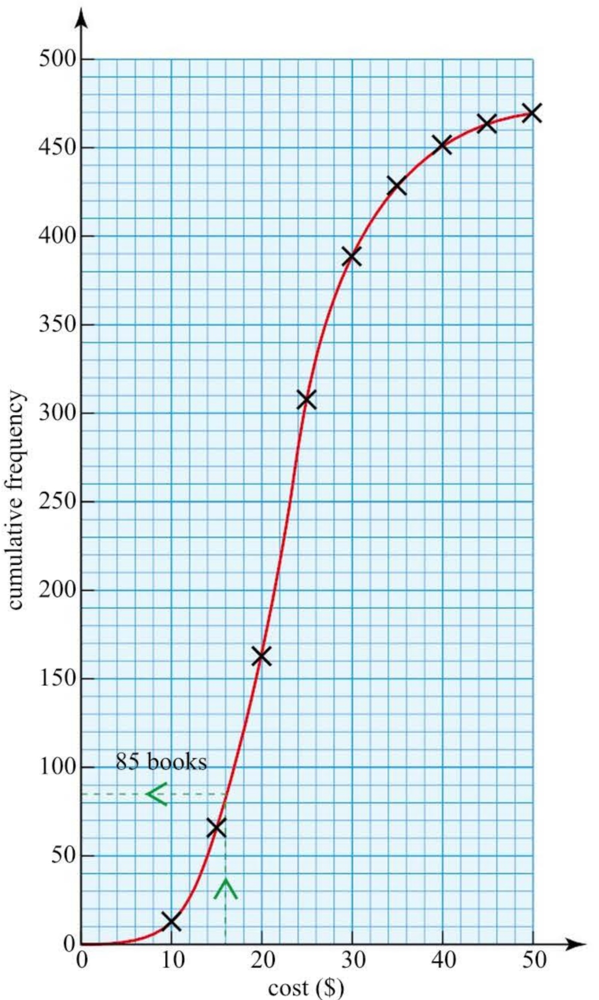

Figure 2.12

<!-- page 83 -->

## Box-and-whisker plots for grouped data

It is often helpful to draw a box-and-whisker plot. In cases when the extreme values are unknown the whiskers are drawn out to the 10th and 90th percentiles. Arrows indicate that the minimum and maximum values are further out.

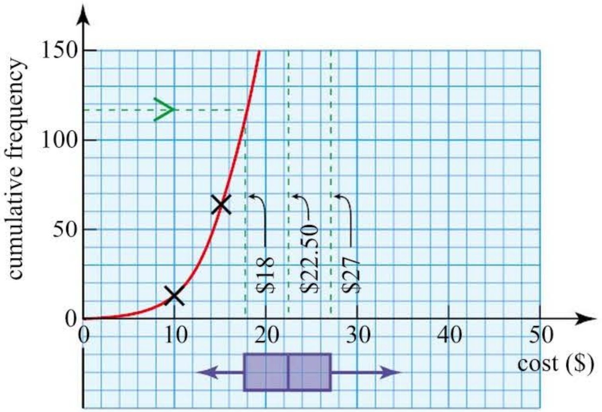

Figure 2.13

Example 2.2

A random sample of people were asked how old they were when they first met their partner.The histogram represents this information.

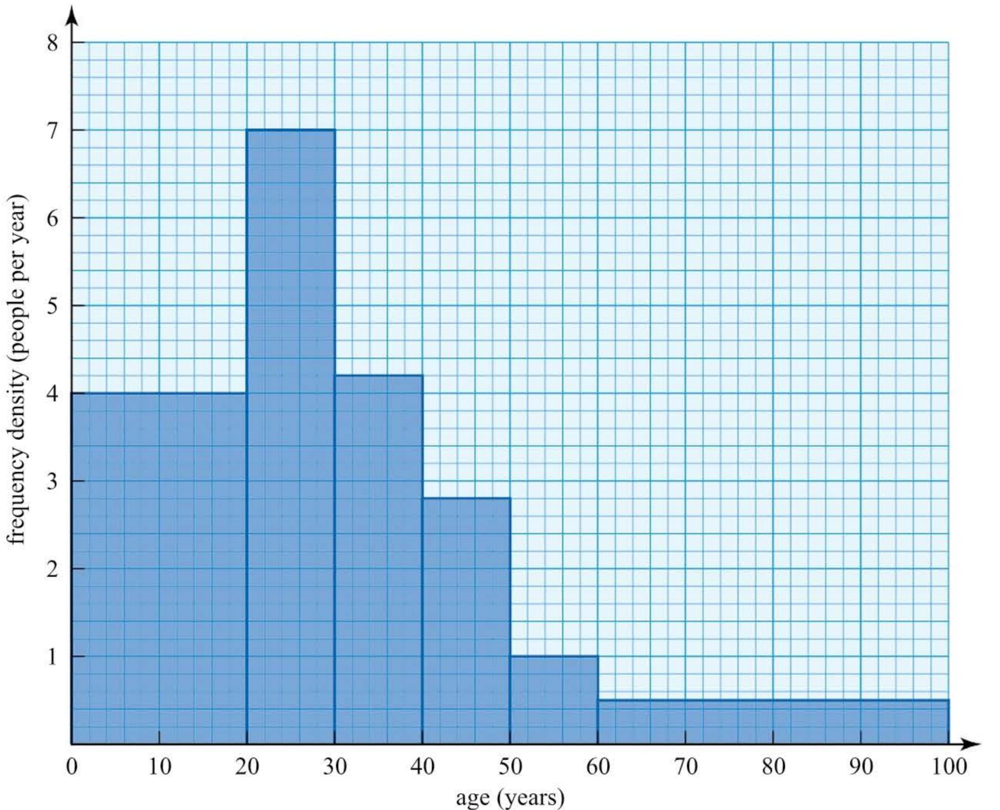

Figure 2.14

<!-- page 84 -->

(ii) How many people took part in the survey?

(i) What is the modal age group?

(iv) Draw a cumulative frequency graph for the data and use the graph to provide an estimate for the median.

(iii) Find an estimate for the mean age that a person first met their partner.

## Solution

(i) The bar with the greatest frequency density represents the modal age group. So the modal age group is $20 \leq a < 30$.

 $$ \textcircled{i i}\quad\text{F r e q u e n c y d e n s i t y}=\frac{\mathit{f r e q u e n c y}}{\mathit{c l a s s w i d t h}} $$ 

Frequency = frequency density  $ \times $ class width

<table border=1 style='margin: auto; word-wrap: break-word;'><tr><td style='text-align: center; word-wrap: break-word;'>Age (years)</td><td style='text-align: center; word-wrap: break-word;'>Frequency density</td><td style='text-align: center; word-wrap: break-word;'>Class width</td><td style='text-align: center; word-wrap: break-word;'>Frequency</td></tr><tr><td style='text-align: center; word-wrap: break-word;'>$ 0 ≤ a &lt; 20 $</td><td style='text-align: center; word-wrap: break-word;'>4</td><td style='text-align: center; word-wrap: break-word;'>20</td><td style='text-align: center; word-wrap: break-word;'>$ 4 \times 20 = 80 $</td></tr><tr><td style='text-align: center; word-wrap: break-word;'>$ 20 ≤ a &lt; 30 $</td><td style='text-align: center; word-wrap: break-word;'>7</td><td style='text-align: center; word-wrap: break-word;'>10</td><td style='text-align: center; word-wrap: break-word;'>$ 7 \times 10 = 70 $</td></tr><tr><td style='text-align: center; word-wrap: break-word;'>$ 30 ≤ a &lt; 40 $</td><td style='text-align: center; word-wrap: break-word;'>4.2</td><td style='text-align: center; word-wrap: break-word;'>10</td><td style='text-align: center; word-wrap: break-word;'>$ 4.2 \times 10 = 42 $</td></tr><tr><td style='text-align: center; word-wrap: break-word;'>$ 40 ≤ a &lt; 50 $</td><td style='text-align: center; word-wrap: break-word;'>2.8</td><td style='text-align: center; word-wrap: break-word;'>10</td><td style='text-align: center; word-wrap: break-word;'>$ 2.8 \times 10 = 28 $</td></tr><tr><td style='text-align: center; word-wrap: break-word;'>$ 50 ≤ a &lt; 60 $</td><td style='text-align: center; word-wrap: break-word;'>1</td><td style='text-align: center; word-wrap: break-word;'>10</td><td style='text-align: center; word-wrap: break-word;'>$ 1 \times 10 = 10 $</td></tr><tr><td style='text-align: center; word-wrap: break-word;'>$ 60 ≤ a &lt; 100 $</td><td style='text-align: center; word-wrap: break-word;'>0.5</td><td style='text-align: center; word-wrap: break-word;'>40</td><td style='text-align: center; word-wrap: break-word;'>$ 0.5 \times 40 = 20 $</td></tr></table>

The total number of people is  $ 80 + 70 + 42 + 28 + 10 + 20 = 250 $.

You will see that the class with the greatest frequency is $0 \leq a < 20$, with 80 people. However, this is not the modal class because its frequency density of 4 people per year is lower than the frequency density of 7 people per year for the $20 \leq a < 30$ class. The modal class is that with the highest frequency density. The class width for $0 \leq a < 20$ is twice that for $20 \leq a < 30$ and this is taken into account in working out the frequency density.

(iii) To find an estimate for the mean, work out the midpoint of each class multiplied by its frequency; then sum the results and divide the answer by the total frequency.

 $$ \begin{aligned}Estimated~mean&=\frac{80\times10+70\times25+42\times35+28\times45+10\times55+20\times80}{250}\\&=\frac{7430}{250}\\&=29.7~years~to~3~s.f.\end{aligned} $$

<!-- page 85 -->

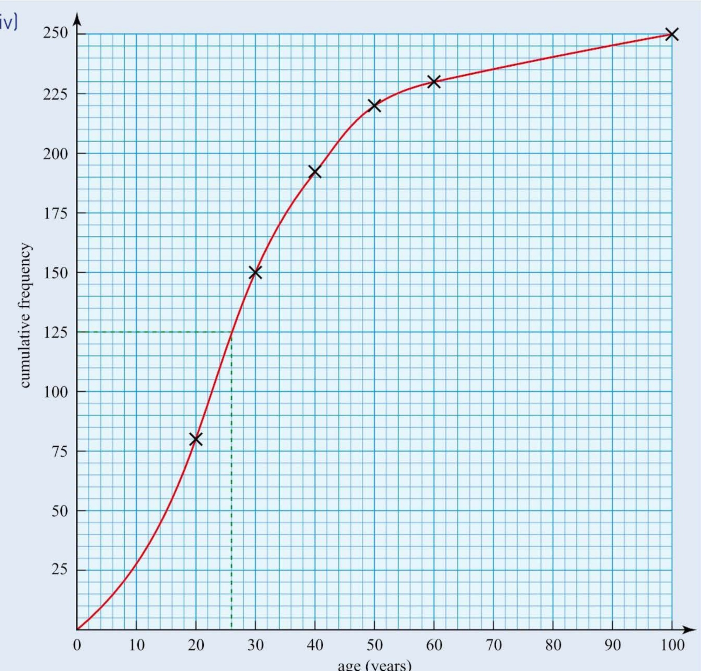

Figure 2.15

The median age is 26 years.

### Example 2.3

These are the times, in seconds, that 15 members of an athletics club took to run 800 metres.

<table border=1 style='margin: auto; word-wrap: break-word;'><tr><td style='text-align: center; word-wrap: break-word;'>139</td><td style='text-align: center; word-wrap: break-word;'>148</td><td style='text-align: center; word-wrap: break-word;'>151</td><td style='text-align: center; word-wrap: break-word;'>140</td><td style='text-align: center; word-wrap: break-word;'>162</td></tr><tr><td style='text-align: center; word-wrap: break-word;'>182</td><td style='text-align: center; word-wrap: break-word;'>154</td><td style='text-align: center; word-wrap: break-word;'>171</td><td style='text-align: center; word-wrap: break-word;'>157</td><td style='text-align: center; word-wrap: break-word;'>142</td></tr><tr><td style='text-align: center; word-wrap: break-word;'>145</td><td style='text-align: center; word-wrap: break-word;'>178</td><td style='text-align: center; word-wrap: break-word;'>132</td><td style='text-align: center; word-wrap: break-word;'>148</td><td style='text-align: center; word-wrap: break-word;'>166</td></tr></table>

(i) Draw a stem-and-leaf diagram of the data.

(ii) Find the median, the upper and lower quartiles and the interquartile range.

(iii) Draw a box-and-whisker plot of the data.

<!-- page 86 -->

Solution

(i) n = 15

13 | 2 represents 132 seconds

13 | 2 9

14 | 0 2 5 8 8

15 | 1 4 7

16 | 2 6

17 | 1 8

18 | 2

(ii) There are 15 data values, so the median is the 8th data value.
So the median is 151 seconds.

The upper quartile is the median of the upper half of the data set.
So the upper quartile is 166 seconds.

The lower quartile is the median of the lower half of the data set.
So the lower quartile is 142 seconds.

Interquartile range = upper quartile - lower quartile
= 166 - 142
= 24 seconds

(iii) Draw a box that starts at the lower quartile and ends at the upper
quartile.

Add a line inside the box to show the position of the median.

Extend the whiskers to the greatest and least values in the data set.

130 140 150 160 170 180 190

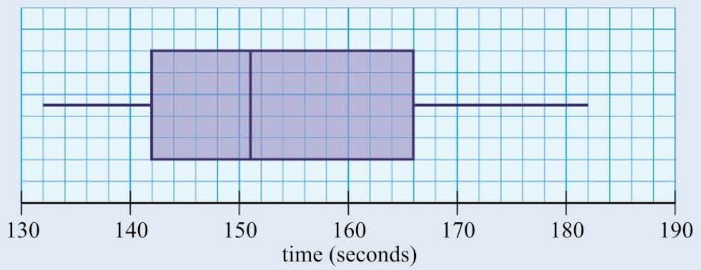

Figure 2.16

## Exercise 2B

1 For each of the following data sets, find:

(c) the lower and upper quartiles

<!-- page 87 -->

<table border=1 style='margin: auto; word-wrap: break-word;'><tr><td rowspan="10">3</td><td style='text-align: center; word-wrap: break-word;'>Find:</td><td style='text-align: center; word-wrap: break-word;'>Score</td><td style='text-align: center; word-wrap: break-word;'>Tally</td></tr><tr><td style='text-align: center; word-wrap: break-word;'>(i) the median</td><td style='text-align: center; word-wrap: break-word;'>70</td><td style='text-align: center; word-wrap: break-word;'>|</td></tr><tr><td style='text-align: center; word-wrap: break-word;'>(ii) the upper and lower quartiles</td><td style='text-align: center; word-wrap: break-word;'>71</td><td style='text-align: center; word-wrap: break-word;'>||</td></tr><tr><td style='text-align: center; word-wrap: break-word;'>(iii) the interquartile range</td><td style='text-align: center; word-wrap: break-word;'>72</td><td style='text-align: center; word-wrap: break-word;'>||||</td></tr><tr><td style='text-align: center; word-wrap: break-word;'>for the scores of golfers in the first round of a competition</td><td style='text-align: center; word-wrap: break-word;'>73</td><td style='text-align: center; word-wrap: break-word;'>|||</td></tr><tr><td style='text-align: center; word-wrap: break-word;'>(iv) 12 5 17 11 4</td><td style='text-align: center; word-wrap: break-word;'>74</td><td style='text-align: center; word-wrap: break-word;'>|||</td></tr><tr><td style='text-align: center; word-wrap: break-word;'>18 12 8 9 11</td><td style='text-align: center; word-wrap: break-word;'>75</td><td style='text-align: center; word-wrap: break-word;'>|||</td></tr><tr><td style='text-align: center; word-wrap: break-word;'>(iii) 25 28 33 14 37</td><td style='text-align: center; word-wrap: break-word;'>76</td><td style='text-align: center; word-wrap: break-word;'>|||</td></tr><tr><td style='text-align: center; word-wrap: break-word;'>(iv) 115 123 132 109 127</td><td style='text-align: center; word-wrap: break-word;'>77</td><td style='text-align: center; word-wrap: break-word;'>|||</td></tr><tr><td style='text-align: center; word-wrap: break-word;'>125 121 117 118 117</td><td style='text-align: center; word-wrap: break-word;'>78</td><td style='text-align: center; word-wrap: break-word;'>|||</td></tr><tr><td rowspan="6">2</td><td colspan="3">(i) For the following data set, find the median and interquartile range.</td></tr><tr><td colspan="3">2 8 4 6 3 5 1 8 2 5 8 0 3 7 8 5</td></tr><tr><td colspan="3">Use your answers to part (i) to deduce the median and interquartile range for each of the following data sets.</td></tr><tr><td colspan="3">(ii) 32 38 34 36 33 35 31 38 32 35 38 30 33 37 38 35</td></tr><tr><td colspan="3">(iii) 20 80 40 60 30 50 10 80 20 50 80 0 30 70 80 50</td></tr><tr><td colspan="3">(iv) 50 110 70 90 60 80 40 110 50 80 110 30 60 100 110 80</td></tr></table>

(iv) Illustrate the data with a box-and-whisker plot.

(v) The scores for the second round are illustrated on the box-and-whisker plot below. Compare the two and say why you think the differences might have arisen.

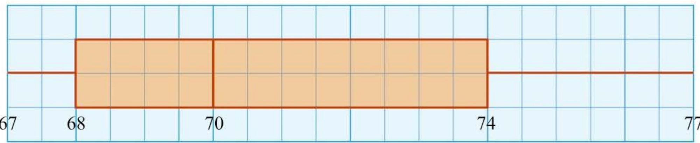

<!-- page 88 -->

CP

4 The numbers of goals scored by a hockey team in its matches one season are illustrated on the vertical line chart below.

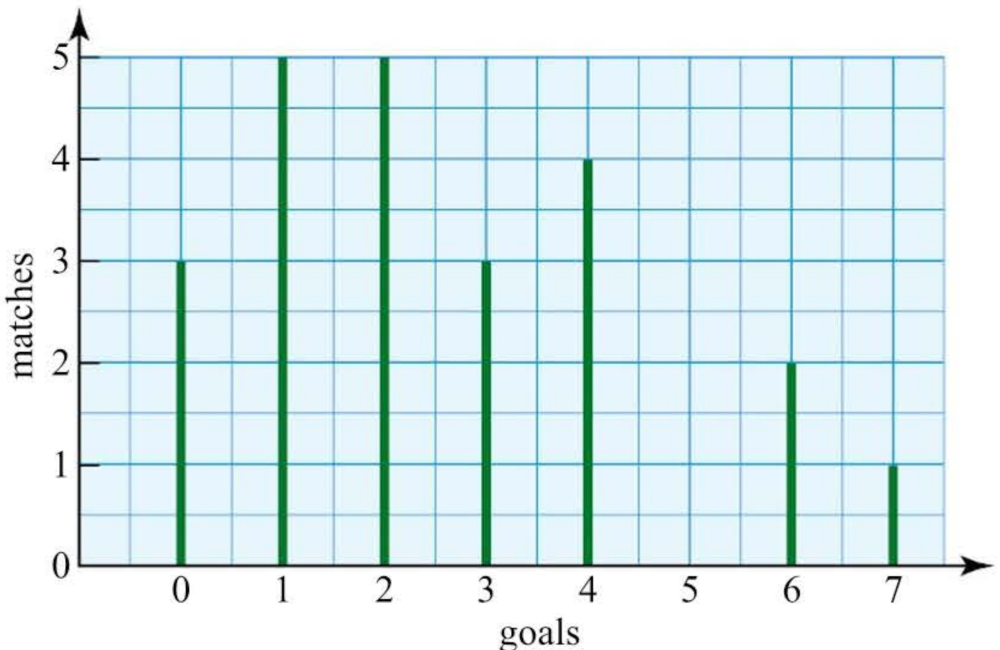

(i) Draw a box-and-whisker plot to illustrate the same data.

(ii) State, with reasons, which you think is the better method of display in this case.

5 One year the yields,  $ \gamma $, of a number of walnut trees were recorded to the nearest kilogram, as follows.

<table border=1 style='margin: auto; word-wrap: break-word;'><tr><td style='text-align: center; word-wrap: break-word;'>Yield,  $ \gamma $ (kg)</td><td style='text-align: center; word-wrap: break-word;'>Frequency</td></tr><tr><td style='text-align: center; word-wrap: break-word;'>40 &lt;  $ \gamma $ ≤ 50</td><td style='text-align: center; word-wrap: break-word;'>1</td></tr><tr><td style='text-align: center; word-wrap: break-word;'>50 &lt;  $ \gamma $ ≤ 60</td><td style='text-align: center; word-wrap: break-word;'>5</td></tr><tr><td style='text-align: center; word-wrap: break-word;'>60 &lt;  $ \gamma $ ≤ 70</td><td style='text-align: center; word-wrap: break-word;'>7</td></tr><tr><td style='text-align: center; word-wrap: break-word;'>70 &lt;  $ \gamma $ ≤ 80</td><td style='text-align: center; word-wrap: break-word;'>4</td></tr><tr><td style='text-align: center; word-wrap: break-word;'>80 &lt;  $ \gamma $ ≤ 90</td><td style='text-align: center; word-wrap: break-word;'>2</td></tr><tr><td style='text-align: center; word-wrap: break-word;'>90 &lt;  $ \gamma $ ≤ 100</td><td style='text-align: center; word-wrap: break-word;'>1</td></tr></table>

(i) Construct the cumulative frequency table for these data.

(ii) Draw the cumulative frequency graph.

(iii) Use your graph to estimate the median and interquartile range of the yields.

(iv) Draw a box-and-whisker plot to illustrate the data.

The piece of paper where the actual figures had been recorded was then found, and these were:

<table border=1 style='margin: auto; word-wrap: break-word;'><tr><td style='text-align: center; word-wrap: break-word;'>44</td><td style='text-align: center; word-wrap: break-word;'>59</td><td style='text-align: center; word-wrap: break-word;'>67</td><td style='text-align: center; word-wrap: break-word;'>76</td><td style='text-align: center; word-wrap: break-word;'>52</td><td style='text-align: center; word-wrap: break-word;'>62</td><td style='text-align: center; word-wrap: break-word;'>68</td><td style='text-align: center; word-wrap: break-word;'>78</td><td style='text-align: center; word-wrap: break-word;'>53</td><td style='text-align: center; word-wrap: break-word;'>63</td></tr><tr><td style='text-align: center; word-wrap: break-word;'>85</td><td style='text-align: center; word-wrap: break-word;'>93</td><td style='text-align: center; word-wrap: break-word;'>56</td><td style='text-align: center; word-wrap: break-word;'>65</td><td style='text-align: center; word-wrap: break-word;'>74</td><td style='text-align: center; word-wrap: break-word;'>69</td><td style='text-align: center; word-wrap: break-word;'>82</td><td style='text-align: center; word-wrap: break-word;'>53</td><td style='text-align: center; word-wrap: break-word;'>65</td><td style='text-align: center; word-wrap: break-word;'>70</td></tr></table>

(v) Use these data to find the median and interquartile range and compare your answers with those you obtained from the grouped data.

(vi) What are the advantages and disadvantages of grouping data?

<!-- page 89 -->

6 The intervals of time, t seconds, between successive emissions from a weak radioactive source were measured for 200 consecutive intervals, with the following results.

<table border=1 style='margin: auto; word-wrap: break-word;'><tr><td style='text-align: center; word-wrap: break-word;'>Interval (t seconds)</td><td style='text-align: center; word-wrap: break-word;'>0 &lt; t ≤ 5</td><td style='text-align: center; word-wrap: break-word;'>5 &lt; t ≤ 10</td><td style='text-align: center; word-wrap: break-word;'>10 &lt; t ≤ 15</td><td style='text-align: center; word-wrap: break-word;'>15 &lt; t ≤ 20</td></tr><tr><td style='text-align: center; word-wrap: break-word;'>Frequency</td><td style='text-align: center; word-wrap: break-word;'>23</td><td style='text-align: center; word-wrap: break-word;'>67</td><td style='text-align: center; word-wrap: break-word;'>42</td><td style='text-align: center; word-wrap: break-word;'>26</td></tr><tr><td style='text-align: center; word-wrap: break-word;'>Interval (t seconds)</td><td style='text-align: center; word-wrap: break-word;'>20 &lt; t ≤ 25</td><td style='text-align: center; word-wrap: break-word;'>25 &lt; t ≤ 30</td><td style='text-align: center; word-wrap: break-word;'>30 &lt; t ≤ 35</td><td rowspan="2"></td></tr><tr><td style='text-align: center; word-wrap: break-word;'>Frequency</td><td style='text-align: center; word-wrap: break-word;'>21</td><td style='text-align: center; word-wrap: break-word;'>15</td><td style='text-align: center; word-wrap: break-word;'>6</td></tr></table>

(i) Draw a cumulative frequency graph for this distribution.

(ii) Use your graph to estimate:

(a) the median

(b) the interquartile range.

(iii) Calculate an estimate of the mean of the distribution.

7 In a sample of 800 eggs from an egg farm each egg was weighed and classified according to its mass, m grams. The frequency distribution was as follows.

<table border=1 style='margin: auto; word-wrap: break-word;'><tr><td style='text-align: center; word-wrap: break-word;'>Mass in grams</td><td style='text-align: center; word-wrap: break-word;'>$ 40 &lt; m \leq 45 $</td><td style='text-align: center; word-wrap: break-word;'>$ 45 &lt; m \leq 50 $</td><td style='text-align: center; word-wrap: break-word;'>$ 50 &lt; m \leq 55 $</td></tr><tr><td style='text-align: center; word-wrap: break-word;'>Number of eggs</td><td style='text-align: center; word-wrap: break-word;'>36</td><td style='text-align: center; word-wrap: break-word;'>142</td><td style='text-align: center; word-wrap: break-word;'>286</td></tr><tr><td style='text-align: center; word-wrap: break-word;'>Mass in grams</td><td style='text-align: center; word-wrap: break-word;'>$ 55 &lt; m \leq 60 $</td><td style='text-align: center; word-wrap: break-word;'>$ 60 &lt; m \leq 65 $</td><td style='text-align: center; word-wrap: break-word;'>$ 65 &lt; m \leq 70 $</td></tr><tr><td style='text-align: center; word-wrap: break-word;'>Number of eggs</td><td style='text-align: center; word-wrap: break-word;'>238</td><td style='text-align: center; word-wrap: break-word;'>76</td><td style='text-align: center; word-wrap: break-word;'>22</td></tr></table>

Draw a cumulative frequency graph of the data, using a scale of 2 cm to represent 5 grams on the horizontal axis (which should be labelled from 40 to 70 grams) and a scale of 2 cm to represent 100 eggs on the vertical axis. Use your graph to estimate for this sample:

(i) the percentage of eggs that would be classified as large (over 62 grams)

(ii) the median mass of an egg

(iii) the interquartile range.

Indicate clearly on your diagram how you arrive at your results.

8 The table summarises the observed lifetimes, x, in seconds, of 50 fruit flies subjected to a new spray in a controlled experiment.

<table border=1 style='margin: auto; word-wrap: break-word;'><tr><td style='text-align: center; word-wrap: break-word;'>Interval</td><td style='text-align: center; word-wrap: break-word;'>Mid-interval value</td><td style='text-align: center; word-wrap: break-word;'>Frequency</td></tr><tr><td style='text-align: center; word-wrap: break-word;'>$ 0.5 ≤ x &lt; 5.5 $</td><td style='text-align: center; word-wrap: break-word;'>3</td><td style='text-align: center; word-wrap: break-word;'>3</td></tr><tr><td style='text-align: center; word-wrap: break-word;'>$ 5.5 ≤ x &lt; 10.5 $</td><td style='text-align: center; word-wrap: break-word;'>8</td><td style='text-align: center; word-wrap: break-word;'>22</td></tr><tr><td style='text-align: center; word-wrap: break-word;'>$ 10.5 ≤ x &lt; 15.5 $</td><td style='text-align: center; word-wrap: break-word;'>13</td><td style='text-align: center; word-wrap: break-word;'>12</td></tr><tr><td style='text-align: center; word-wrap: break-word;'>$ 15.5 ≤ x &lt; 20.5 $</td><td style='text-align: center; word-wrap: break-word;'>18</td><td style='text-align: center; word-wrap: break-word;'>9</td></tr><tr><td style='text-align: center; word-wrap: break-word;'>$ 20.5 ≤ x &lt; 25.5 $</td><td style='text-align: center; word-wrap: break-word;'>23</td><td style='text-align: center; word-wrap: break-word;'>2</td></tr><tr><td style='text-align: center; word-wrap: break-word;'>$ 25.5 ≤ x &lt; 30.5 $</td><td style='text-align: center; word-wrap: break-word;'>28</td><td style='text-align: center; word-wrap: break-word;'>1</td></tr><tr><td style='text-align: center; word-wrap: break-word;'>$ 30.5 ≤ x &lt; 35.5 $</td><td style='text-align: center; word-wrap: break-word;'>33</td><td style='text-align: center; word-wrap: break-word;'>1</td></tr></table>

<!-- page 90 -->

(i) Making clear your methods and showing all your working, estimate the mean and standard deviation of these lifetimes. Give your answers correct to 3 significant figures and do not make any corrections for grouping.

(ii) Draw the cumulative frequency graph and use it to estimate the minimum lifetime below which 70% of all lifetimes lie.

9 During January the numbers of people entering a store during the first hour after opening were as follows.

<table border=1 style='margin: auto; word-wrap: break-word;'><tr><td style='text-align: center; word-wrap: break-word;'>Time after opening, x minutes</td><td style='text-align: center; word-wrap: break-word;'>Frequency</td><td style='text-align: center; word-wrap: break-word;'>Cumulative frequency</td></tr><tr><td style='text-align: center; word-wrap: break-word;'>$ 0 &lt; x ≤ 10 $</td><td style='text-align: center; word-wrap: break-word;'>210</td><td style='text-align: center; word-wrap: break-word;'>210</td></tr><tr><td style='text-align: center; word-wrap: break-word;'>$ 10 &lt; x ≤ 20 $</td><td style='text-align: center; word-wrap: break-word;'>134</td><td style='text-align: center; word-wrap: break-word;'>344</td></tr><tr><td style='text-align: center; word-wrap: break-word;'>$ 20 &lt; x ≤ 30 $</td><td style='text-align: center; word-wrap: break-word;'>78</td><td style='text-align: center; word-wrap: break-word;'>422</td></tr><tr><td style='text-align: center; word-wrap: break-word;'>$ 30 &lt; x ≤ 40 $</td><td style='text-align: center; word-wrap: break-word;'>72</td><td style='text-align: center; word-wrap: break-word;'>a</td></tr><tr><td style='text-align: center; word-wrap: break-word;'>$ 40 &lt; x ≤ 60 $</td><td style='text-align: center; word-wrap: break-word;'>b</td><td style='text-align: center; word-wrap: break-word;'>540</td></tr></table>

(i) Find the values of a and b.

(ii) Draw a cumulative frequency graph to represent this information. Take a scale of 2 cm for 10 minutes on the horizontal axis and 2 cm for 50 people on the vertical axis.

(iii) Use your graph to estimate the median time after opening that people entered the store.

(iv) Calculate estimates of the mean, m minutes, and standard deviation, s minutes, of the time after opening that people entered the store.

(v) Use your graph to estimate the number of people entering the store between  $ (m - \frac{1}{2}s) $ and  $ (m + \frac{1}{2}s) $ minutes after opening.

Cambridge International AS & A Level Mathematics

9709 Paper 6 Q6 June 2009

10 The numbers of people travelling on a certain bus at different times of the day are as follows.

<table border=1 style='margin: auto; word-wrap: break-word;'><tr><td style='text-align: center; word-wrap: break-word;'>17</td><td style='text-align: center; word-wrap: break-word;'>5</td><td style='text-align: center; word-wrap: break-word;'>2</td><td style='text-align: center; word-wrap: break-word;'>23</td><td style='text-align: center; word-wrap: break-word;'>16</td><td style='text-align: center; word-wrap: break-word;'>31</td><td style='text-align: center; word-wrap: break-word;'>8</td></tr><tr><td style='text-align: center; word-wrap: break-word;'>22</td><td style='text-align: center; word-wrap: break-word;'>14</td><td style='text-align: center; word-wrap: break-word;'>25</td><td style='text-align: center; word-wrap: break-word;'>35</td><td style='text-align: center; word-wrap: break-word;'>17</td><td style='text-align: center; word-wrap: break-word;'>27</td><td style='text-align: center; word-wrap: break-word;'>12</td></tr><tr><td style='text-align: center; word-wrap: break-word;'>6</td><td style='text-align: center; word-wrap: break-word;'>23</td><td style='text-align: center; word-wrap: break-word;'>19</td><td style='text-align: center; word-wrap: break-word;'>21</td><td style='text-align: center; word-wrap: break-word;'>23</td><td style='text-align: center; word-wrap: break-word;'>8</td><td style='text-align: center; word-wrap: break-word;'>26</td></tr></table>

(i) Draw a stem-and-leaf diagram to illustrate the information given above.

(ii) Find the median, the lower quartile, the upper quartile and the interquartile range.

(iii) State, in this case, which of the median and mode is preferable as a measure of central tendency, and why.

<!-- page 91 -->

## KEY POINTS

1 Histograms:

commonly used to illustrate continuous data

horizontal axis shows the variable being measured (cm, kg, etc.)

vertical axis labelled frequency density where

frequency density =  $ \frac{\text{frequency}}{\text{class width}} $

no gaps between columns

the frequency is proportional to the area of each column.

2 For a small data set with n items,

the median,  $ Q_{2} $, is the value of the  $ \frac{n+1}{2} $th item of data. If n is even then:

the lower quartile, $Q_{1}$, is the median of the lower half of the data set

the upper quartile, $Q_{3}$, is the median of the upper half of the data set. If $n$ is odd then exclude the median from either 'half' and proceed as if $n$ were even.

3 Interquartile range (IQR) =  $ Q_{3} - Q_{1} $.

4 When data are illustrated using a cumulative frequency graph, the median and the lower and upper quartiles are estimated by identifying the data values with cumulative frequencies  $ \frac{1}{2}n $,  $ \frac{1}{4}n $ and  $ \frac{3}{4}n $.

5 An item of data x may be identified as an outlier if it is more than  $ 1.5 \times IQR $ beyond the lower or upper quartile, i.e. if

 $$ x<Q_{1}-1.5\times(Q_{3}-Q_{1})\quad or\quad x>Q_{3}+1.5\times(Q_{3}-Q_{1}). $$ 

6 A box-and-whisker plot is a useful way of summarising data and showing the median, upper and lower quartiles and any outliers.

## LEARNING OUTCOMES

Now that you have finished this chapter, you should be able to

draw the following diagrams:

histogram

box-and-whisker plot

cumulative frequency graph

select a suitable way of presenting raw statistical data

■ discuss advantages and/or disadvantages of a particular way of presenting data

use a cumulative frequency graph to calculate or estimate the:

lower quartile

upper quartile

interquartile range

identify outliers.

proportion in a given interval

