# Probability

<!-- Cambridge International AS  A Level Mathematics Probability  Statistics 1 (Sophie Goldie) .pdf p92-121 -->

<!-- page 92 -->

## 3 

## Probability

If we knew Lady Luck better, Las Vegas would still be a roadstop in the desert. Stephen Jay Gould (1941-2002)

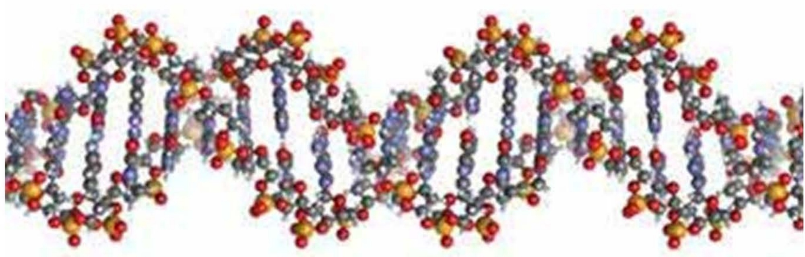

# The Librarian Blogosphere

## A library without books

If you plan to pop into your local library and pick up the latest bestseller, then forget it. All the best books 'disappear' practically as soon as they are put on the shelves.

I talked about the problem with the local senior librarian, Gina Clarke.

'We have a real problem with unauthorised loans at the moment,' Gina told me. 'Out of our total stock of, say, 80000 books, something like 44000 are out on loan at any one time. About 20000 are on the shelves and I'm afraid the rest are unaccounted for.'

Librarian Gina Clarke is worried about the problem of ‘disappearing books’

That means that the probability of finding a particular book you want from the library's list is exactly  $ \frac{1}{4} $. With odds like that, don't count on being lucky next time you visit your library.

How do you think the figure of  $ \frac{1}{4} $ at the end of the article was arrived at?

Do you agree that the probability is exactly  $ \frac{1}{4} $?

<!-- page 93 -->

The information about the different categories of book can be summarised as follows.

<table border=1 style='margin: auto; word-wrap: break-word;'><tr><td style='text-align: center; word-wrap: break-word;'>Category of book</td><td style='text-align: center; word-wrap: break-word;'>Typical numbers</td></tr><tr><td style='text-align: center; word-wrap: break-word;'>On the shelves</td><td style='text-align: center; word-wrap: break-word;'>20 000</td></tr><tr><td style='text-align: center; word-wrap: break-word;'>Out on loan</td><td style='text-align: center; word-wrap: break-word;'>44 000</td></tr><tr><td style='text-align: center; word-wrap: break-word;'>Unauthorised loan</td><td style='text-align: center; word-wrap: break-word;'>16 000</td></tr><tr><td style='text-align: center; word-wrap: break-word;'>Total stock</td><td style='text-align: center; word-wrap: break-word;'>80 000</td></tr></table>

On the basis of these figures it is possible to estimate the probability of finding the book you want. Of the total stock of 80000 books bought by the library, you might expect to find about 20000 on the shelves at any one time. As a fraction, this is  $ \frac{20}{80} $ or  $ \frac{1}{4} $ of the total. So, as a rough estimate, the probability of your finding a particular book is 0.25 or 25%.

Similarly, 16000 out of the total of 80000 books are on unauthorised loan, a euphemism for stolen, and this is 20%, or  $ \frac{1}{5} $.

An important assumption underlying these calculations is that all the books are equally likely to be unavailable, which is not very realistic since popular books are more likely to be stolen. Also, the numbers given are only rough approximations, so it is definitely incorrect to say that the probability is exactly  $ \frac{1}{4} $.

### 3.1 Measuring probability

Probability (or chance) is a way of describing the likelihood of different possible outcomes occurring as a result of some experiment.

In the example of the library books, the experiment is looking in the library for a particular book. Let us assume that you already know that the book you want is on the library's stocks. The three possible outcomes are that the book is on the shelves, out on loan or missing.

It is important in probability to distinguish experiments from the outcomes that they may generate. A list of all possible outcomes is called a sample space. Here are a few examples.

<table border=1 style='margin: auto; word-wrap: break-word;'><tr><td style='text-align: center; word-wrap: break-word;'>Experiment</td><td style='text-align: center; word-wrap: break-word;'>Possible outcomes</td></tr><tr><td rowspan="4">Guessing the answer to a four-option multiple choice question</td><td style='text-align: center; word-wrap: break-word;'>A</td></tr><tr><td style='text-align: center; word-wrap: break-word;'>B</td></tr><tr><td style='text-align: center; word-wrap: break-word;'>C</td></tr><tr><td style='text-align: center; word-wrap: break-word;'>D</td></tr><tr><td rowspan="6">Predicting the next vehicle to go past the corner of my road</td><td style='text-align: center; word-wrap: break-word;'>car</td></tr><tr><td style='text-align: center; word-wrap: break-word;'>bus</td></tr><tr><td style='text-align: center; word-wrap: break-word;'>lorry</td></tr><tr><td style='text-align: center; word-wrap: break-word;'>bicycle</td></tr><tr><td style='text-align: center; word-wrap: break-word;'>van</td></tr><tr><td style='text-align: center; word-wrap: break-word;'>other</td></tr><tr><td rowspan="2">Tossing a coin</td><td style='text-align: center; word-wrap: break-word;'>heads</td></tr><tr><td style='text-align: center; word-wrap: break-word;'>tails</td></tr></table>

<!-- page 94 -->

Another word for experiment is  $ \underline{\text{trial}} $. This is used in Chapter 6 of this book to describe the binomial situation where there are just two possible outcomes.

Another word you should know is  $ \underline{event} $. This often describes several outcomes put together. For example, when rolling a die, an event could be 'the die shows an even number'. This event corresponds to three different outcomes from the trial, the die showing 2, 4 or 6. However, the term event is also often used to describe a single outcome.

### 3.2 Estimating probability

Probability is a number that measures likelihood. It may be estimated experimentally or theoretically.

## Experimental estimation of probability

In many situations probabilities are estimated on the basis of data collected experimentally, as in the following example.

Of 30 drawing pins tossed in the air, 21 of them were found to have landed with their pins pointing up. From this you would estimate the probability that the next pin tossed in the air will land with its pin pointing up to be  $ \frac{21}{30} $ or 0.7.

You can describe this in more formal notation.

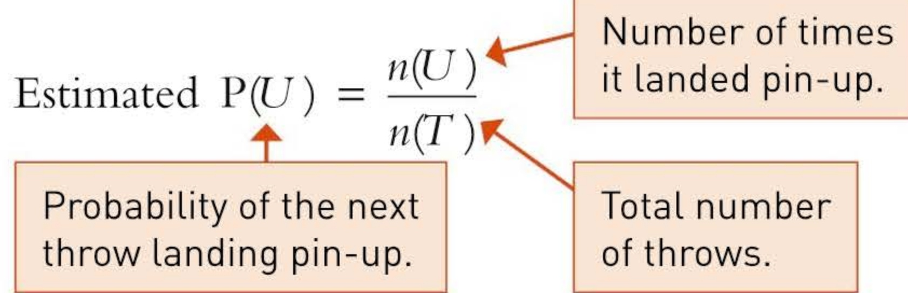

## Theoretical estimation of probability

There are, however, some situations where you do not need to collect data to make an estimate of probability.

For example, when tossing a coin, common sense tells you that there are only two realistic outcomes and, given the symmetry of the coin, you would expect them to be equally likely. So the probability,  $ P(H) $, that the next coin will produce the outcome heads can be written as follows:

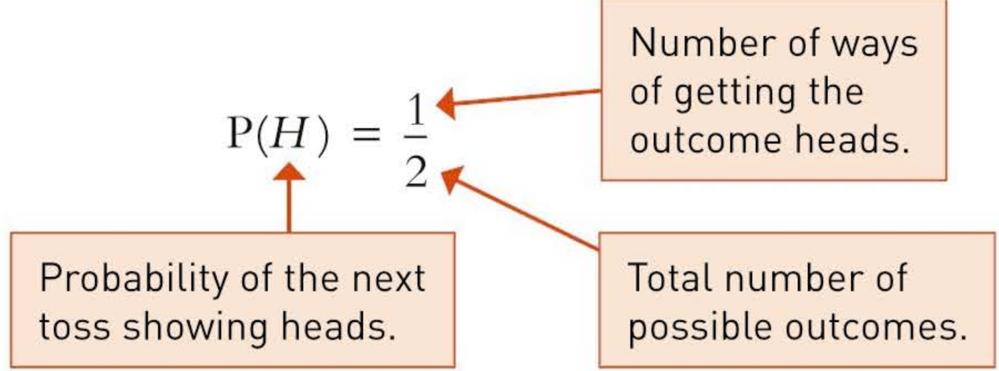

<!-- page 95 -->

Using the notation described above, write down the probability that the correct answer for the next four-option multiple choice question will be answer A. What assumptions are you making?

## Solution

Assuming that the test-setter has used each letter equally often, the probability,  $ \mathrm{P}(A) $, that the next question will have answer A can be written as follows:

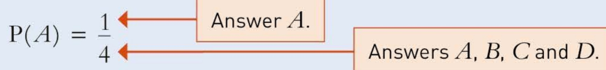

Answers A, B, C and D.

Notice that we have assumed that the four options are equally likely. Equiprobability is an important assumption underlying most work on probability.

Expressed formally, the probability, P(A), of event A occurring is:

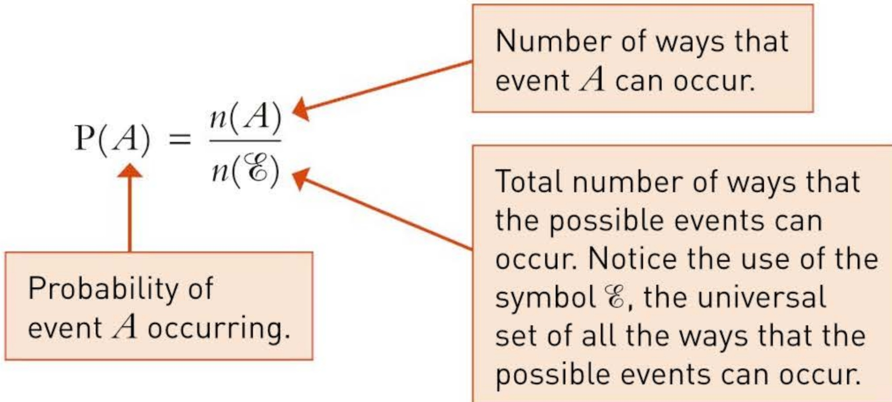

## Probabilities of 0 and 1

The two extremes of probability are certainty at one end of the scale and impossibility at the other. Here are examples of certain and impossible events.

<table border=1 style='margin: auto; word-wrap: break-word;'><tr><td style='text-align: center; word-wrap: break-word;'>Experiment</td><td style='text-align: center; word-wrap: break-word;'>Certain event</td><td style='text-align: center; word-wrap: break-word;'>Impossible event</td></tr><tr><td style='text-align: center; word-wrap: break-word;'>Rolling a single die</td><td style='text-align: center; word-wrap: break-word;'>The result is in the range 1 to 6 inclusive</td><td style='text-align: center; word-wrap: break-word;'>The result is a 7</td></tr><tr><td style='text-align: center; word-wrap: break-word;'>Tossing a coin</td><td style='text-align: center; word-wrap: break-word;'>Getting either heads or tails</td><td style='text-align: center; word-wrap: break-word;'>Getting neither heads nor tails</td></tr></table>

## Certainty

As you can see from the table above, for events that are certain, the number of ways that the event can occur, $n(A)$ in the formula, is equal to the total number of possible events, $n(\mathcal{E})$.

 $$ \frac{n(A)}{n(\mathcal{E})}=1 $$ 

So the probability of an event that is certain is one.

<!-- page 96 -->

## Impossibility

For impossible events, the number of ways that the event can occur,  $ n(A) $, is zero.

 $$ \frac{n(A)}{n(\mathcal{E})}=\frac{0}{n(\mathcal{E})}=0 $$ 

So the probability of an event that is impossible is zero.

Typical values of probabilities might be something like 0.3 or 0.9. If you arrive at probability values of, say, -0.4 or 1.7, you will know that you have made a mistake since these are meaningless.

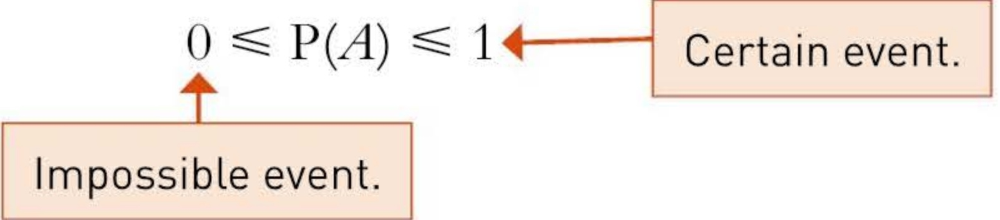

## The complement of an event

The complement of an event A, denoted by  $ A^{\prime} $, is the event not-A, that is the event 'A does not happen'.

Example 3.2

It was found that, out of a box of 50 matches, 45 lit but the others did not.

What was the probability that a randomly selected match would not have lit?

## Solution

The probability that a randomly selected match lit was

 $$ \mathrm{P}(A^{\prime})=\frac{45}{50}=0.9. $$ 

The probability that a randomly selected match did not light was

 $$ \mathrm{P}(A^{\prime})=\frac{50-45}{50}=\frac{5}{50}=0.1. $$ 

From this example you can see that

 $$ \mathrm{P}(\mathcal{A}^{\prime})=1-\mathrm{P}(\mathcal{A}) $$ 

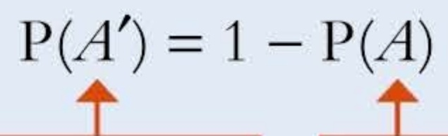

The probability of A not occurring.

The probability of A occurring.

This is illustrated in Figure 3.1.

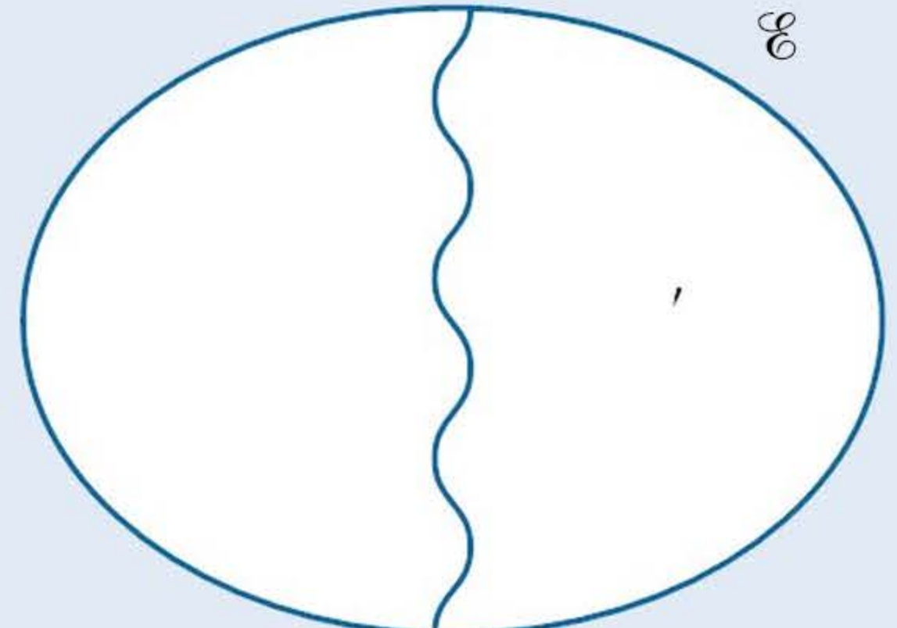

Figure 3.1 Venn diagram showing events A and  $ A' $ (i.e. not-A)

<!-- page 97 -->

### 3.3 Expectation

## Health services braced for flu epidemic

Local health services are poised for their biggest challenge in years. The virulent strain of flu, named Trengganu B from its origins in Malaysia, currently sweeping across the world, is expected to hit any day.

With a chance of one in three of any individual contracting the disease, and 120 000 people within the Health Area, surgeries and hospitals are expecting to be swamped with patients.

Local doctor Aloke Ghosh says 'Immunisation seems to be ineffective against this strain'.

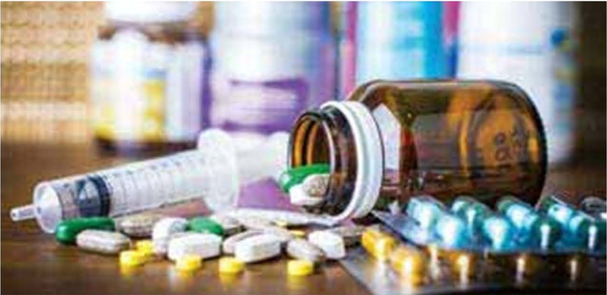

How many people can the health services expect to contract flu? The answer is easily seen to be  $ 120\,000 \times \frac{1}{3} = 40\,000 $. This is called the expectation or expected frequency and is given in this case by np, where n is the population size and p the probability.

Expectation is a technical term and need not be a whole number. Thus the expectation of the number of heads when a coin is tossed 5 times is  $ 5 \times \frac{1}{2} = 2.5 $. You would be wrong to go on to say 'That means either 2 or 3' or to qualify your answer as 'about  $ 2\frac{1}{2} $'. The expectation is 2.5.

The idea of expectation of a discrete random variable is explored more thoroughly in Chapter 4. Applications of the binomial distribution are covered in Chapter 6.

### 3.4 The probability of either one event or another

So far we have looked at just one event at a time. However, it is often useful to bracket two or more of the events together and calculate their combined probability.

<!-- page 98 -->

The table below is based on the data at the beginning of this chapter and shows the probability of the next book requested falling into each of the three categories listed, assuming that each book is equally likely to be requested.

<table border=1 style='margin: auto; word-wrap: break-word;'><tr><td style='text-align: center; word-wrap: break-word;'>Category of book</td><td style='text-align: center; word-wrap: break-word;'>Typical numbers</td><td style='text-align: center; word-wrap: break-word;'>Probability</td></tr><tr><td style='text-align: center; word-wrap: break-word;'>On the shelves (S)</td><td style='text-align: center; word-wrap: break-word;'>20000</td><td style='text-align: center; word-wrap: break-word;'>0.25</td></tr><tr><td style='text-align: center; word-wrap: break-word;'>Out on loan (L)</td><td style='text-align: center; word-wrap: break-word;'>44000</td><td style='text-align: center; word-wrap: break-word;'>0.55</td></tr><tr><td style='text-align: center; word-wrap: break-word;'>Unauthorised loan (U)</td><td style='text-align: center; word-wrap: break-word;'>16000</td><td style='text-align: center; word-wrap: break-word;'>0.20</td></tr><tr><td style='text-align: center; word-wrap: break-word;'>Total (S + L + U)</td><td style='text-align: center; word-wrap: break-word;'>80000</td><td style='text-align: center; word-wrap: break-word;'>1</td></tr></table>

What is the probability that a randomly requested book is either out on loan or on unauthorised loan (i.e. that it is not available)?

Solution

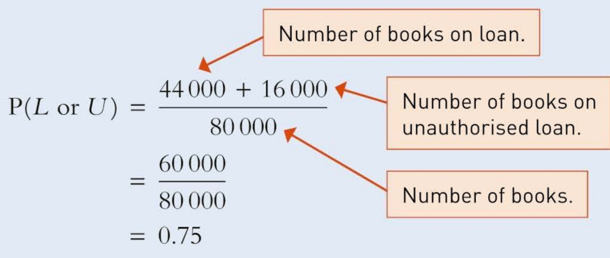

This can be written in more formal notation as

 $$ \begin{aligned}\mathrm{P}(L\cup U)&=\frac{n(L\cup U)}{n(\mathcal{E})}\\&=\frac{n(L)}{n(\mathcal{E})}+\frac{n(U)}{n(\mathcal{E})}\end{aligned} $$ 

 $$ \mathrm{P}(L\cup U)=\mathrm{P}(L)+\mathrm{P}(U) $$ 

Notice the use of the union symbol,  $ \cup $, to mean or. This is illustrated in Figure 3.2.

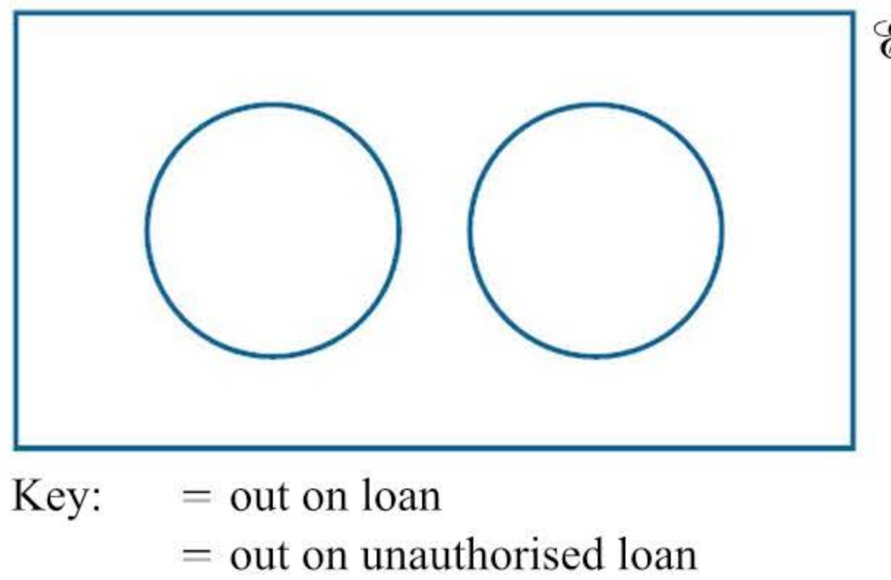

Key: = out on loan

= out on unauthorised loan

#### ▲ Figure 3.2 Venn diagram showing events L and U. It is not possible for both to occur

In this example you could add the probabilities of the two events to get the combined probability of either one or the other event occurring. However, you have to be very careful adding probabilities as you will see in the next example.

<!-- page 99 -->

Below are further details of the categories of books in the library.

<table border=1 style='margin: auto; word-wrap: break-word;'><tr><td style='text-align: center; word-wrap: break-word;'>Category of book</td><td style='text-align: center; word-wrap: break-word;'>Number of books</td></tr><tr><td style='text-align: center; word-wrap: break-word;'>On the shelves</td><td style='text-align: center; word-wrap: break-word;'>20000</td></tr><tr><td style='text-align: center; word-wrap: break-word;'>Out on loan</td><td style='text-align: center; word-wrap: break-word;'>44000</td></tr><tr><td style='text-align: center; word-wrap: break-word;'>Adult fiction</td><td style='text-align: center; word-wrap: break-word;'>22000</td></tr><tr><td style='text-align: center; word-wrap: break-word;'>Adult non-fiction</td><td style='text-align: center; word-wrap: break-word;'>40000</td></tr><tr><td style='text-align: center; word-wrap: break-word;'>Junior</td><td style='text-align: center; word-wrap: break-word;'>18000</td></tr><tr><td style='text-align: center; word-wrap: break-word;'>Unauthorised loan</td><td style='text-align: center; word-wrap: break-word;'>16000</td></tr><tr><td style='text-align: center; word-wrap: break-word;'>Total stock</td><td style='text-align: center; word-wrap: break-word;'>80000</td></tr></table>

Asaph is trying to find the probability that the next book requested will be either out on loan or a book of adult non-fiction.

He writes:

Assuming all the books in the library are equally likely to be requested,

 $$ \begin{aligned}P(on loan)+P(adult non-fiction)&=\frac{44000}{80000}+\frac{40000}{80000}\\&=0.55+0.5\\&=1.05\end{aligned} $$ 

Explain why Asaph's answer must be wrong. What is his mistake?

## Solution

This answer is clearly wrong as you cannot have a probability greater than 1.

The way this calculation was carried out involved some double counting. Some of the books classed as adult non-fiction were counted twice because they were also in the on-loan category, as you can see from Figure 3.3.

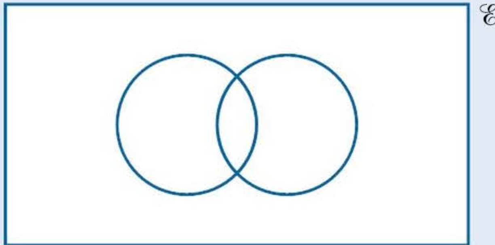

Key: = out on loan

= adult non-fiction

#### ▲ Figure 3.3 Venn diagram showing events L and A. It is possible for both to occur

If you add all six of the book categories together, you find that they add up to 160 000, which represents twice the total number of books owned by the library.

<!-- page 100 -->

A more useful representation of the data in the previous example is given in the two-way table below.

<table border=1 style='margin: auto; word-wrap: break-word;'><tr><td style='text-align: center; word-wrap: break-word;'></td><td style='text-align: center; word-wrap: break-word;'>Adult fiction</td><td style='text-align: center; word-wrap: break-word;'>Adult non-fiction</td><td style='text-align: center; word-wrap: break-word;'>Junior</td><td style='text-align: center; word-wrap: break-word;'>Total</td></tr><tr><td style='text-align: center; word-wrap: break-word;'>On the shelves</td><td style='text-align: center; word-wrap: break-word;'>4000</td><td style='text-align: center; word-wrap: break-word;'>12000</td><td style='text-align: center; word-wrap: break-word;'>4000</td><td style='text-align: center; word-wrap: break-word;'>20000</td></tr><tr><td style='text-align: center; word-wrap: break-word;'>Out on loan</td><td style='text-align: center; word-wrap: break-word;'>14000</td><td style='text-align: center; word-wrap: break-word;'>20000</td><td style='text-align: center; word-wrap: break-word;'>10000</td><td style='text-align: center; word-wrap: break-word;'>44000</td></tr><tr><td style='text-align: center; word-wrap: break-word;'>Unauthorised loan</td><td style='text-align: center; word-wrap: break-word;'>4000</td><td style='text-align: center; word-wrap: break-word;'>8000</td><td style='text-align: center; word-wrap: break-word;'>4000</td><td style='text-align: center; word-wrap: break-word;'>16000</td></tr><tr><td style='text-align: center; word-wrap: break-word;'>Totals</td><td style='text-align: center; word-wrap: break-word;'>22000</td><td style='text-align: center; word-wrap: break-word;'>40000</td><td style='text-align: center; word-wrap: break-word;'>18000</td><td style='text-align: center; word-wrap: break-word;'>80000</td></tr></table>

If you simply add 44000 and 40000, you double count the 20000 books that fall into both categories. So you need to subtract the 20000 to ensure that it is counted only once. Thus:

Number either out on loan or adult non-fiction

 $$ \begin{aligned}&=44000+40000-20000\\&=64000books.\end{aligned} $$ 

 $$  So,the~required~probability=\frac{64\ 000}{80\ 000}=0.8. $$ 

## Mutually exclusive events

The problem of double counting does not occur when adding two rows in the table. Two rows cannot overlap, or intersect, which means that those categories are mutually exclusive (i.e. the one excludes the other, also known as exclusive). The same is true for two columns within the table.

Where two events, A and B, are mutually exclusive, the probability that either A or B occurs is equal to the sum of the separate probabilities of A and B occurring.

Where two events, A and B, are not mutually exclusive, the probability that either A or B occurs is equal to the sum of the separate probabilities of A and B occurring minus the probability of A and B occurring together.

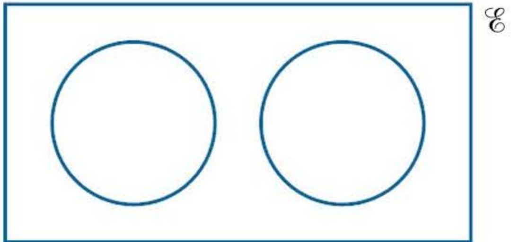

Figure 3.4 (a) Mutually exclusive events

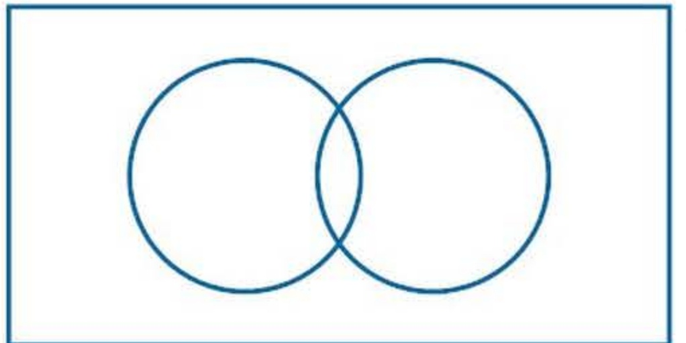

(b) Not mutually exclusive events

 $$ \mathrm{P}(A or B)=\mathrm{P}(A)+\mathrm{P}(B) $$ 

 $$ \mathrm{P}(A\cup B)=\mathrm{P}(A)+\mathrm{P}(B) $$ 

 $$ \mathrm{P}(A or B)=\mathrm{P}(A)+\mathrm{P}(B)-\mathrm{P}(A and B) $$ 

 $$ \mathrm{P}(A\cup B)=\mathrm{P}(A)+\mathrm{P}(B)-\mathrm{P}(A\cap\mathrm{B}) $$ 

Notice the use of the intersection sign,  $ \cap $, to mean both ... and ...

<!-- page 101 -->

A fair die is thrown. What is the probability that it shows each of these?

(i) Event A: an even number

(ii) Event B: a number greater than 4

(iii) Either A or B (or both): a number which is either even or greater than 4

## Solution

## (i) Event A:

Three out of the six numbers on a die are even, namely 2, 4 and 6.

So

 $$ \mathrm{P}(A)=\frac{3}{6}=\frac{1}{2}. $$ 

(ii) Event B:

Two out of the six numbers on a die are greater than 4, namely 5 and 6.

So  $ \mathrm{P}(B)=\frac{2}{6}=\frac{1}{3}. $

(iii) Either A or B (or both):

Four of the numbers on a die are either even or greater than 4, namely 2, 4, 5 and 6.

So

 $$ \mathrm{P}(A\cup B)=\frac{4}{6}=\frac{2}{3}. $$ 

This could also be found using

 $$ \mathrm{P}(A\cup B)=\mathrm{P}(A)+\mathrm{P}(B)-\mathrm{P}(A\cap B) $$ 

 $$ \begin{aligned}P(A\cup B)&=\frac{3}{6}+\frac{2}{6}-\frac{1}{6}\\&=\frac{4}{6}=\frac{2}{3}\end{aligned} $$ 

This is the number 6 which is both even and greater than 4.

## Exercise 3A

## CP

1 Three separate electrical components, switch, bulb and contact point, are used together in the construction of a pocket torch. Of 534 defective torches, examined to identify the cause of failure, 468 are found to have a defective bulb. For a given failure of the torch, what is the probability that either the switch or the contact point is responsible for the failure? State clearly any assumptions that you have made in making this calculation.

2 If a fair die is thrown, what is the probability that it shows:

(i) 4

(ii) 4 or more

(iii) less than 4

(iv) an even number?

<!-- page 102 -->

3 A bag containing Scrabble letters has the following letter distribution.

<table border=1 style='margin: auto; word-wrap: break-word;'><tr><td style='text-align: center; word-wrap: break-word;'>A</td><td style='text-align: center; word-wrap: break-word;'>B</td><td style='text-align: center; word-wrap: break-word;'>C</td><td style='text-align: center; word-wrap: break-word;'>D</td><td style='text-align: center; word-wrap: break-word;'>E</td><td style='text-align: center; word-wrap: break-word;'>F</td><td style='text-align: center; word-wrap: break-word;'>G</td><td style='text-align: center; word-wrap: break-word;'>H</td><td style='text-align: center; word-wrap: break-word;'>I</td><td style='text-align: center; word-wrap: break-word;'>J</td><td style='text-align: center; word-wrap: break-word;'>K</td><td style='text-align: center; word-wrap: break-word;'>L</td><td style='text-align: center; word-wrap: break-word;'>M</td></tr><tr><td style='text-align: center; word-wrap: break-word;'>9</td><td style='text-align: center; word-wrap: break-word;'>2</td><td style='text-align: center; word-wrap: break-word;'>2</td><td style='text-align: center; word-wrap: break-word;'>4</td><td style='text-align: center; word-wrap: break-word;'>12</td><td style='text-align: center; word-wrap: break-word;'>2</td><td style='text-align: center; word-wrap: break-word;'>3</td><td style='text-align: center; word-wrap: break-word;'>2</td><td style='text-align: center; word-wrap: break-word;'>9</td><td style='text-align: center; word-wrap: break-word;'>1</td><td style='text-align: center; word-wrap: break-word;'>1</td><td style='text-align: center; word-wrap: break-word;'>4</td><td style='text-align: center; word-wrap: break-word;'>2</td></tr><tr><td style='text-align: center; word-wrap: break-word;'>N</td><td style='text-align: center; word-wrap: break-word;'>O</td><td style='text-align: center; word-wrap: break-word;'>P</td><td style='text-align: center; word-wrap: break-word;'>Q</td><td style='text-align: center; word-wrap: break-word;'>R</td><td style='text-align: center; word-wrap: break-word;'>S</td><td style='text-align: center; word-wrap: break-word;'>T</td><td style='text-align: center; word-wrap: break-word;'>U</td><td style='text-align: center; word-wrap: break-word;'>V</td><td style='text-align: center; word-wrap: break-word;'>W</td><td style='text-align: center; word-wrap: break-word;'>X</td><td style='text-align: center; word-wrap: break-word;'>Y</td><td style='text-align: center; word-wrap: break-word;'>Z</td></tr><tr><td style='text-align: center; word-wrap: break-word;'>6</td><td style='text-align: center; word-wrap: break-word;'>8</td><td style='text-align: center; word-wrap: break-word;'>2</td><td style='text-align: center; word-wrap: break-word;'>1</td><td style='text-align: center; word-wrap: break-word;'>6</td><td style='text-align: center; word-wrap: break-word;'>4</td><td style='text-align: center; word-wrap: break-word;'>6</td><td style='text-align: center; word-wrap: break-word;'>4</td><td style='text-align: center; word-wrap: break-word;'>2</td><td style='text-align: center; word-wrap: break-word;'>2</td><td style='text-align: center; word-wrap: break-word;'>1</td><td style='text-align: center; word-wrap: break-word;'>2</td><td style='text-align: center; word-wrap: break-word;'>1</td></tr></table>

The first letter is chosen at random from the bag; find the probability that it is:

(i) an E

(ii) in the first half of the alphabet

(iii) in the second half of the alphabet

## CP

(iv) a vowel

(v) a consonant

(vi) the only one of its kind.

4 A sporting chance

(i) Two players, A and B, play tennis. On the basis of their previous results, the probability of A winning,  $ P(A) $, is calculated to be 0.65. What is  $ P(B) $, the probability of B winning?

(ii) Two hockey teams, A and B, play a game. On the basis of their previous results, the probability of team A winning, P(A), is calculated to be 0.65. Why is it not possible to calculate directly P(B), the probability of team B winning, without further information?

(iii) In a tennis tournament, player A, the favourite, is estimated to have a 0.3 chance of winning the competition. Player B is estimated to have a 0.15 chance. Find the probability that either A or B will win the competition.

(iv) In the Six Nations Rugby Championship, France and England are each given a 25% chance of winning or sharing the championship cup. It is also estimated that there is a 5% chance that they will share the cup. Estimate the probability that either England or France will win or share the cup.

5 The diagram shows even (E), odd (O) and square (S) numbers.

(i) Copy the diagram and place the numbers 1 to 20 on it.

The numbers 1 to 20 are written on separate cards.

(ii) A card is chosen at random. Find the probability that the number showing is:

(a) even, E

(b) square, S

(c) odd, O

<!-- page 103 -->

(d) both even and square,  $ E \cap S $

(e) either even or square,  $ E \cup S $

(f) both even and odd,  $ E \cap O $

(g) either even or odd,  $ E \cup O $.

Write down equations connecting the probabilities of the following events.

(h) $E, S, E \cap S, E \cup S$

(i) $E, O, E \cap O, E \cup O$

### 3.5 Independent and dependent events

## My lucky day!

Won $100 when the number on my newspaper came up in the daily draw and $50 in the weekly draw too. A chance in a million!

This story describes two pieces of good fortune on the same day. Veronica said the probability was about  $ \frac{1}{1000\,000} $. What was it really?

The two events resulted from two different experiments, the daily draw and the weekly draw. Consequently this situation is different from those you met in the previous section. There you were looking at two events from a single experiment (like the number coming up when a die is thrown being even or being greater than 4).

The total number of entrants in the daily draw was 1245 and in the weekly draw 324. The draws were conducted fairly, that is each number had an equal chance of being selected. The following table sets out the two experiments and their corresponding events with associated probabilities.

<table border=1 style='margin: auto; word-wrap: break-word;'><tr><td style='text-align: center; word-wrap: break-word;'>Experiment</td><td style='text-align: center; word-wrap: break-word;'>Events (and estimated probabilities)</td></tr><tr><td rowspan="2">Daily draw</td><td style='text-align: center; word-wrap: break-word;'>Winning:  $ \frac{1}{1245} $</td></tr><tr><td style='text-align: center; word-wrap: break-word;'>Not winning:  $ \frac{1244}{1245} $</td></tr><tr><td rowspan="2">Weekly draw</td><td style='text-align: center; word-wrap: break-word;'>Winning:  $ \frac{1}{324} $</td></tr><tr><td style='text-align: center; word-wrap: break-word;'>Not winning:  $ \frac{323}{324} $</td></tr></table>

The two events 'win daily draw' and 'win weekly draw' are independent events. Two events are said to be independent when the outcome of the first event does not affect the outcome of the second event. The fact that Veronica has won the daily draw does not alter her chances of winning the weekly draw.

For two independent events, $A$ and $B$, $\mathrm{P}(A \cap B) = \mathrm{P}(A) \times \mathrm{P}(B)$.

In situations like this the possible outcomes resulting from the different experiments are often shown on a tree diagram.

<!-- page 104 -->

Find, in advance of the results of the two draws, the probability that:

(i) Veronica would win both draws

(ii) Veronica would fail to win either draw

(iii) Veronica would win one of the two draws.

## Solution

The possible results are shown on the tree diagram in Figure 3.5.

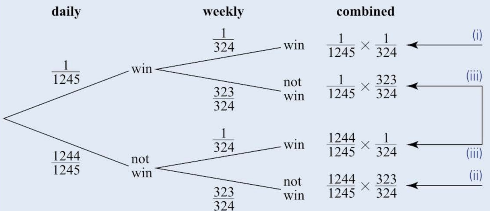

### Figure 3.5

(i) The probability that Veronica wins both

 $$ =\frac{1}{1245}\times\frac{1}{324}=\frac{1}{403380} $$ 

This is not quite Veronica's 'one in a million' but it is not very far off it.

(ii) The probability that Veronica wins neither

 $$ =\frac{1244}{1245}\times\frac{323}{324}=\frac{401812}{403380} $$ 

This of course is much the most likely outcome.

(iii) The probability that Veronica wins one but not the other

 $$ =\underbrace{\frac{1}{1245}\times\frac{323}{324}}_{}+\underbrace{\frac{1244}{1245}\times\frac{1}{324}}_{}=\frac{1567}{403380} $$ 

Wins daily draw but not weekly draw.

Wins weekly draw but not daily draw.

Look again at the structure of the tree diagram in Figure 3.5.

There are two experiments, the daily draw and the weekly draw. These are considered as First, Then experiments, and set out First on the left and Then on the right. Once you understand this, the rest of the layout falls into place, with the different outcomes or events appearing as branches. In this example there are two branches at each stage; sometimes there may be three or more.

<!-- page 105 -->

Notice that for a given situation the component probabilities sum to 1, as before.

 $$ \frac{1}{403380}+\frac{323}{403380}+\frac{1244}{403380}+\frac{401812}{403380}=\frac{403380}{403380}=1 $$ 

Example 3.7

## Note

The answer to part (ii) hinged on the fact that two orderings (S then F, and F then S) are possible for the same combined event (that the two bags selected include one salted and one fruit-flavoured bag).

Some friends buy a six-pack of popcorn. Two of the bags are salted (S), the rest are fruit flavoured (F). They decide to allocate the bags by lucky dip.

Find the probability that:

(i) the first two bags chosen are the same as each other

(ii) the first two bags chosen are different from each other.

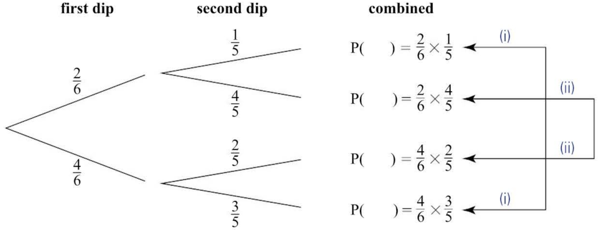

 $$ )=\frac{4}{6}\times\frac{3}{5}\xleftarrow{\quad(i) $$ 

### Figure 3.6

## Solution

Note: P(F, S) means the probability of drawing a fruit-flavoured bag (F) on the first dip and a salted bag (S) on the second.

(i) The probability that the first two bags chosen are the same as each other is

 $$ \begin{aligned}P(S,S)+P(F,F)&=\frac{2}{6}\times\frac{1}{5}+\frac{4}{6}\times\frac{3}{5}\\&=\frac{1}{15}+\frac{6}{15}\\&=\frac{7}{15}\end{aligned} $$ 

(ii) The probability that the first two bags chosen are different from each other is

 $$ \begin{aligned}P(S,F)+P(F,S)&=\frac{2}{6}\times\frac{4}{5}+\frac{4}{6}\times\frac{2}{5}\\&=\frac{4}{15}+\frac{4}{15}\\&=\frac{8}{15}\end{aligned} $$

<!-- page 106 -->

The probabilities changed between the first dip and the second dip. This is because the outcome of the second dip is  $ \underline{\text{dependent}} $ on the outcome of the first one (with fewer bags remaining to choose from).

By contrast, the outcomes of the two experiments involved in tossing a coin twice are independent, and so the probability of getting a head on the second toss remains unchanged at 0.5, whatever the outcome of the first toss.

Although you may find it helpful to think about combined events in terms of how they would be represented on a tree diagram, you may not always actually draw them in this way. If there are several experiments and perhaps more than two possible outcomes from each, drawing a tree diagram can be very time-consuming.

Example 3.8

## Free our David online campaign

## Is this justice?

In 2012, David Starr was sentenced to 12 years' imprisonment for armed robbery solely on the basis of an identification parade. He was one of 12 people in the parade and was picked out by one witness but not by three others.

Many people who knew David well believe he was incapable of such a crime. Please add your voice to the clamour for a review of his case by clicking on the 'Free David' button.

Free David

How conclusive is this sort of evidence, or, to put it another way, how likely is it that a mistake has been made?

Investigate the likelihood that David Starr really did commit the robbery.

## Solution

In this situation you need to assess the probability of an innocent individual being picked out by chance alone. Assume that David Starr was innocent and the witnesses were selecting in a purely random way (that is, with a probability of  $ \frac{1}{12} $ of selecting each person and a probability of  $ \frac{11}{12} $ of not selecting each person). If each of the witnesses selected just one of the twelve people in the identity parade in this random manner, how likely is it that David Starr would be picked out by at least one witness?

 $$ \begin{aligned}P(at least one selection)&=1-P(no~selections)\\&=1-\frac{11}{12}\times\frac{11}{12}\times\frac{11}{12}\times\frac{11}{12}\\&=1-0.706=0.294(i.e.roughly~30\%).\end{aligned} $$ 

In other words, there is about a 30% chance of an innocent person being chosen in this way by at least one of the witnesses.

<!-- page 107 -->

The website concluded:

Is 30% really the sort of figure we have in mind when judges use the phrase 'beyond reasonable doubt'? Because if it is, many innocent people will be condemned to a life behind bars.

This raises an important statistical idea, which you will meet again if you study Probability & Statistics 2, about how we make judgements and decisions.

Judgements are usually made under conditions of uncertainty and involve us in having to weigh up the plausibility of one explanation against that of another. Statistical judgements are usually made on such a basis. We choose one explanation if we judge the alternative explanation to be sufficiently unlikely, that is if the probability of its being true is sufficiently small. Exactly how small this probability has to be will depend on the individual circumstances and is called the significance level.

## Exercise 3B

1 The probability of a pregnant woman giving birth to a girl is about 0.49. Draw a tree diagram showing the possible outcomes if she has two babies (not twins).

From the tree diagram, calculate the following probabilities:

(i) that the babies are both girls

(ii) that the babies are the same sex

(iii) that the second baby is of different sex from the first.

2 In a certain district of a large city, the probability of a household suffering a break-in in a particular year is 0.07 and the probability of its car being stolen is 0.12.

Assuming these two trials are independent of each other, draw a tree diagram showing the possible outcomes for a particular year.

Calculate, for a randomly selected household with one car, the following probabilities:

(i) that the household is a victim of both crimes during that year

(ii) that the household suffers only one of these misfortunes during that year

(iii) that the household suffers at least one of these misfortunes during that year.

<!-- page 108 -->

3 There are 12 people at an identification parade. Three witnesses are called to identify the accused person.

Assuming they make their choice purely by random selection, draw a tree diagram showing the possible events.

(i) From the tree diagram, calculate the following probabilities:

(a) that all three witnesses select the accused person

(b) that none of the witnesses selects the accused person

(c) that at least two of the witnesses select the accused person.

(ii) Suppose now that by changing the composition of people in the identification parade, the first two witnesses increase their chances of selecting the accused person to 0.25.

Draw a new tree diagram and calculate the following probabilities:

(a) that all three witnesses select the accused person

(b) that none of the witnesses selects the accused person

(c) that at least two of the witnesses select the accused person.

4 Ruth drives her car to work – provided she can get it to start! When she remembers to put the car in the garage the night before, it starts next morning with a probability of 0.95. When she forgets to put the car away, it starts next morning with a probability of 0.75. She remembers to garage her car 90% of the time.

## M

What is the probability that Ruth drives her car to work on a randomly chosen day?

5 Around 0.8% of men are red-green colour-blind (the figure is slightly different for women) and roughly 1 in 5 men is left-handed.

Assuming these characteristics are inherited independently, calculate with the aid of a tree diagram the probability that a man chosen at random will:

(i) be both colour-blind and left-handed

(ii) be colour-blind and not left-handed

(iii) be colour-blind or left-handed

(iv) be neither colour-blind nor left-handed.

6 Three dice are thrown. Find the probability of obtaining:

(i) at least two 6s

(ii) no 6s

## CP

(iii) different scores on all the dice.

7 Explain the flaw in this argument and rewrite it as a valid statement.

The probability of throwing a 6 on a fair die =  $ \frac{1}{6} $. Therefore the probability

of throwing at least one 6 in six throws of the die is  $ \frac{1}{6} + \frac{1}{6} + \frac{1}{6} + \frac{1}{6} + \frac{1}{6} = 1 $ so it is a certainty.

<!-- page 109 -->

CP

(i) Copy and complete this sample space diagram.

8 Two dice are thrown. The scores on the dice are added.

<table border=1 style='margin: auto; word-wrap: break-word;'><tr><td rowspan="2" colspan="2"></td><td colspan="6">First die</td></tr><tr><td style='text-align: center; word-wrap: break-word;'>1</td><td style='text-align: center; word-wrap: break-word;'>2</td><td style='text-align: center; word-wrap: break-word;'>3</td><td style='text-align: center; word-wrap: break-word;'>4</td><td style='text-align: center; word-wrap: break-word;'>5</td><td style='text-align: center; word-wrap: break-word;'>6</td></tr><tr><td rowspan="6">Second die</td><td style='text-align: center; word-wrap: break-word;'>1</td><td style='text-align: center; word-wrap: break-word;'></td><td style='text-align: center; word-wrap: break-word;'></td><td style='text-align: center; word-wrap: break-word;'></td><td style='text-align: center; word-wrap: break-word;'></td><td style='text-align: center; word-wrap: break-word;'></td><td style='text-align: center; word-wrap: break-word;'></td></tr><tr><td style='text-align: center; word-wrap: break-word;'>2</td><td style='text-align: center; word-wrap: break-word;'></td><td style='text-align: center; word-wrap: break-word;'></td><td style='text-align: center; word-wrap: break-word;'></td><td style='text-align: center; word-wrap: break-word;'></td><td style='text-align: center; word-wrap: break-word;'></td><td style='text-align: center; word-wrap: break-word;'></td></tr><tr><td style='text-align: center; word-wrap: break-word;'>3</td><td style='text-align: center; word-wrap: break-word;'></td><td style='text-align: center; word-wrap: break-word;'></td><td style='text-align: center; word-wrap: break-word;'></td><td style='text-align: center; word-wrap: break-word;'></td><td style='text-align: center; word-wrap: break-word;'></td><td style='text-align: center; word-wrap: break-word;'></td></tr><tr><td style='text-align: center; word-wrap: break-word;'>4</td><td style='text-align: center; word-wrap: break-word;'></td><td style='text-align: center; word-wrap: break-word;'></td><td style='text-align: center; word-wrap: break-word;'></td><td style='text-align: center; word-wrap: break-word;'></td><td style='text-align: center; word-wrap: break-word;'></td><td style='text-align: center; word-wrap: break-word;'>10</td></tr><tr><td style='text-align: center; word-wrap: break-word;'>5</td><td style='text-align: center; word-wrap: break-word;'></td><td style='text-align: center; word-wrap: break-word;'></td><td style='text-align: center; word-wrap: break-word;'></td><td style='text-align: center; word-wrap: break-word;'></td><td style='text-align: center; word-wrap: break-word;'></td><td style='text-align: center; word-wrap: break-word;'>11</td></tr><tr><td style='text-align: center; word-wrap: break-word;'>6</td><td style='text-align: center; word-wrap: break-word;'>7</td><td style='text-align: center; word-wrap: break-word;'>8</td><td style='text-align: center; word-wrap: break-word;'>9</td><td style='text-align: center; word-wrap: break-word;'>10</td><td style='text-align: center; word-wrap: break-word;'>11</td><td style='text-align: center; word-wrap: break-word;'>12</td></tr></table>

(ii) What is the probability of a score of 4?

(iii) What is the most likely outcome?

## PS

(iv) Criticise this argument:

There are 11 possible outcomes, 2, 3, 4, up to 12. Therefore each of them has a probability of  $ \frac{1}{11} $.

The probability of someone catching flu in a particular winter when they have been given the flu vaccine is 0.1. Without the vaccine, the probability of catching flu is 0.4. If 30% of the population has been given the vaccine, what is the probability that a person chosen at random from the population will catch flu over that winter?

### 3.6 Conditional probability

## Sad news

My best friend had a heart attack while out shopping. Sachit was rushed to hospital but died on the way. He was only 47 – too young ☺

What is the probability that somebody chosen at random will die of a heart attack in the next 12 months?

One approach would be to say that, since there are about 300 000 deaths per year from heart and circulatory diseases (H & CD) among the 57 000 000 population of the country where Sachit lived,

 $$ \begin{aligned}probability&=\frac{number of deaths from H\&CD per year}{total population}\\&=\frac{300000}{57000000}=0.0053.\end{aligned} $$ 

However, if you think about it, you will probably realise that this is rather a meaningless figure. For a start, young people are much less at risk than those in or beyond middle age.

<!-- page 110 -->

So you might wish to give two answers:

 $$ \mathrm{P}_{1}=\frac{\text{deaths from H\&CD among over-40s}}{\text{population of over-40s}} $$ 

 $$ \mathrm{P}_{2}=\frac{\text{deaths from H\&CD among under-40s}}{\text{population of under-40s}} $$ 

Typically only 1500 of the deaths would be among the under-40s, leaving (on the basis of these figures) 298 500 among the over-40s. About 25 000 000 people in the country are over 40, and 32 000 000 under 40 (40 years and 1 day counts as over 40). This gives

 $$ \begin{aligned}P_{1}&=\frac{deaths~from~H\&CD~among~over-40s}{population~of~over-40s}\\&=\frac{298500}{25000000}\\&=0.0119\end{aligned} $$ 

 $$ \begin{aligned}and\quad\mathrm{P}_{2}&=\frac{deaths~from~H\&~CD~among~under-40s}{population~of~under-40s}\\&=\frac{1500}{32000000}\\&=0.000047.\end{aligned} $$ 

So somebody in the older group is over 200 times more likely to die of a heart attack than somebody in the younger group. Putting them both together as an average figure resulted in a figure that was representative of neither group.

But why stop there? You could, if you had the figures, divide the population up into 10-year, 5-year, or even 1-year intervals. That would certainly improve the accuracy; but there are also more factors that you might wish to take into account, such as the following.

》 Is the person overweight?

》 Does the person smoke?

» Does the person take regular exercise?

The more conditions you build in, the more accurate the estimate of the probability.

You can see how the conditions are brought in by looking at  $ P_{1} $:

 $$ \begin{aligned}P_{1}&=\frac{deaths~from~H\&CD~among~over-40s}{population~of~over-40s}\\&=\frac{298500}{25000000}\\&=0.0119\end{aligned} $$ 

You would write this in symbols as follows:

Event G: Somebody selected at random is over 40.

Event H: Somebody selected at random dies from H & CD.

<!-- page 111 -->

The probability of someone dying from H & CD given that he or she is over 40 is given by the conditional probability  $ \mathrm{P}(H \mid G) $.

 $$ \mathbf{\check{P}}(H\mid G)=\frac{n(H\cap G)}{n(G)} $$ 

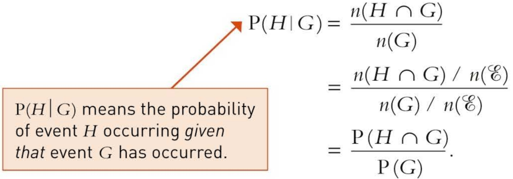

 $$ =\frac{n(H\cap G)\;/\;n(\mathcal{E})}{n(G)\;/\;n(\mathcal{E})} $$ 

 $$ =\frac{\mathrm{P}\left(H\cap G\right)}{\mathrm{P}\left(G\right)}. $$ 

This result may be written in general form for all cases of conditional probability for events A and B.

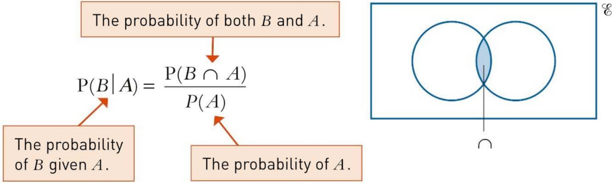

### Figure 3.7

Conditional probability is used when your estimate of the probability of an event is altered by your knowledge of whether some other event has occurred. In this case the estimate of the probability of somebody dying from heart and circulatory diseases, P(H), is altered by a knowledge of whether or not the person is over 40.

Thus conditional probability addresses the question of whether one event is dependent on another one. If the probability of event B is not affected by the occurrence of event A, we say that B is independent of A. If, on the other hand, the probability of event B is affected by the occurrence (or not) of event A, we say that B is dependent on A.

If $A$ and $B$ are independent, then $\mathrm{P}(B|A) = \mathrm{P}(B|A')$ and this is just $\mathrm{P}(B)$.

If $A$ and $B$ are dependent, then $\mathrm{P}(B|A) \neq \mathrm{P}(B|A')$.

As you have already seen, the probability of a combined event is the product of the separate probabilities of each event, provided the question of dependence between the two events is properly dealt with. Specifically:

The probability of both A and B occurring.

» for dependent events P(A ∩ B) = P(A) × P(B | A).

The probability of A occurring.

The probability of B occurring, given that A has occurred.

When $A$ and $B$ are independent events, then, because $\mathrm{P}(B \mid A) = \mathrm{P}(B)$, this can be written as:

» for independent events  $ \mathrm{P}(A \cap B) = \mathrm{P}(A) \times \mathrm{P}(B) $.

<!-- page 112 -->

A company is worried about the high turnover of its employees and decides to investigate whether they are more likely to stay if they are given training. On 1 January one year the company was employing 256 people (excluding those about to retire). During that year a record was kept of who received training as well as who left the company. The results are summarised in this table.

<table border=1 style='margin: auto; word-wrap: break-word;'><tr><td style='text-align: center; word-wrap: break-word;'></td><td style='text-align: center; word-wrap: break-word;'>Still employed</td><td style='text-align: center; word-wrap: break-word;'>Left company</td><td style='text-align: center; word-wrap: break-word;'>Total</td></tr><tr><td style='text-align: center; word-wrap: break-word;'>Given training</td><td style='text-align: center; word-wrap: break-word;'>109</td><td style='text-align: center; word-wrap: break-word;'>43</td><td style='text-align: center; word-wrap: break-word;'>152</td></tr><tr><td style='text-align: center; word-wrap: break-word;'>Not given training</td><td style='text-align: center; word-wrap: break-word;'>60</td><td style='text-align: center; word-wrap: break-word;'>44</td><td style='text-align: center; word-wrap: break-word;'>104</td></tr><tr><td style='text-align: center; word-wrap: break-word;'>Totals</td><td style='text-align: center; word-wrap: break-word;'>169</td><td style='text-align: center; word-wrap: break-word;'>87</td><td style='text-align: center; word-wrap: break-word;'>256</td></tr></table>

(i) Find the probability that a randomly selected employee:

(a) received training

(b) received training and did not leave the company.

(ii) Are the events T and S independent?

(iii) Find the probability that a randomly selected employee:

(a) did not leave the company, given that the person had received training

(b) did not leave the company, given that the person had not received training.

## Solution

Using the notation T: The employee received training

S: The employee stayed in the company

(i) (a)

 $$ \mathrm{P}(T)=\frac{n(T)}{n(\mathcal{E})}=\frac{152}{256}=0.594 $$ 

(b)

 $$ \mathrm{P}(T\cap S)=\frac{n(T\cap S)}{n(\mathcal{E})}=\frac{109}{256}=0.426 $$ 

(ii) If $T$ and $S$ are independent events then $P(T \cap S) = P(T) \times P(S)$.

 $$ \mathrm{P}(S)=\frac{n(S)}{n(\mathcal{E})}=\frac{169}{256}=0.660 $$ 

 $$ \mathrm{P}(T)\times\mathrm{P}(S)=\frac{152}{256}\times\frac{169}{256}=0.392 $$ 

As  $ \mathrm{P}(T \cap S) \neq \mathrm{P}(T) \times \mathrm{P}(S) $, the events T and S are not independent.

 $$ \begin{array}{r l r}{\mathrm{i i i i}}&{[a]}&{\mathrm{P}(S\mid T)=\frac{\mathrm{P}(S\cap T)}{\mathrm{P}(T)}=\frac{\frac{109}{256}}{\frac{152}{256}}=\frac{109}{152}=0.717}\end{array} $$ 

 $$ \textcircled{b} \quad \mathrm{P}(S\mid T^{\prime})=\frac{\mathrm{P}(S\cap T^{\prime})}{\mathrm{P}(T^{\prime})}=\frac{\frac{60}{256}}{\frac{104}{256}}=\frac{60}{104}=0.577 $$

<!-- page 113 -->

Since P(S \mid T) is not the same as P(S \mid T'), the event S is not independent of the event T. Each of S and T is dependent on the other, a conclusion which matches common sense. It is almost certainly true that training increases employees' job satisfaction and so makes them more likely to stay, but it is also probably true that the company is more likely to go to the expense of training the employees who seem less inclined to move on to other jobs.

How would you show that the event T is not independent of the event S?

In some situations you may find it helps to represent a problem such as this as a Venn diagram.

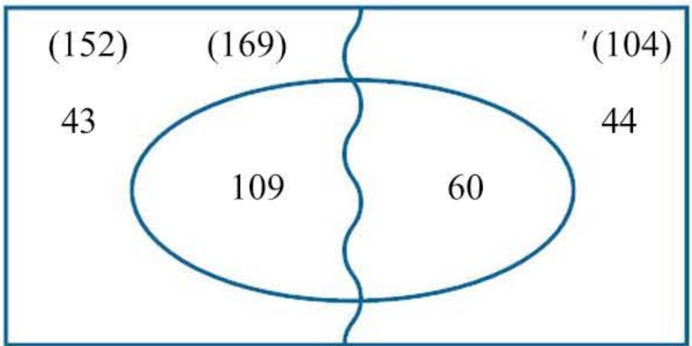

Figure 3.8

What do the various numbers and letters represent?

Where is the region S'?

How are the numbers on the diagram related to the answers to parts (i) to (iii)?

In other situations it may be helpful to think of conditional probabilities in terms of tree diagrams. Conditional probabilities are needed when events are dependent, that is when the outcome of one trial affects the outcomes from a subsequent trial, so, for dependent events, the probabilities of all but the first layer of a tree diagram will be conditional.

### Example 3.10

Rebecca is buying two goldfish from a pet shop. The shop's tank contains seven male fish and eight female fish but they all look the same.

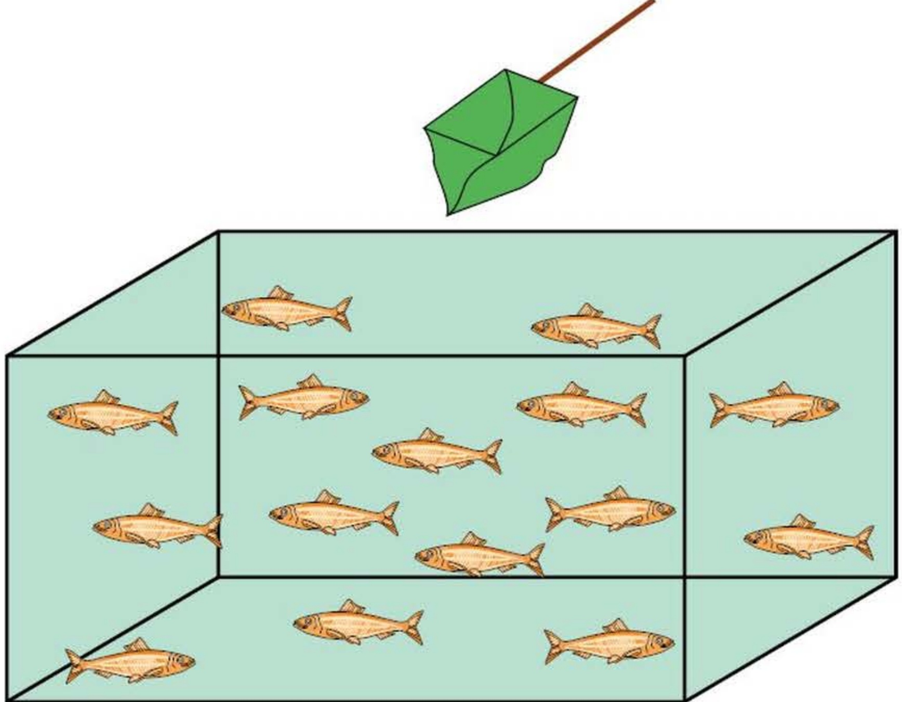

Figure 3.9

<!-- page 114 -->

Find the probability that Rebecca's fish are:

(i) both the same sex

(ii) both female

(iii) both female given that they are the same sex.

## Solution

The situation is shown on this tree diagram.

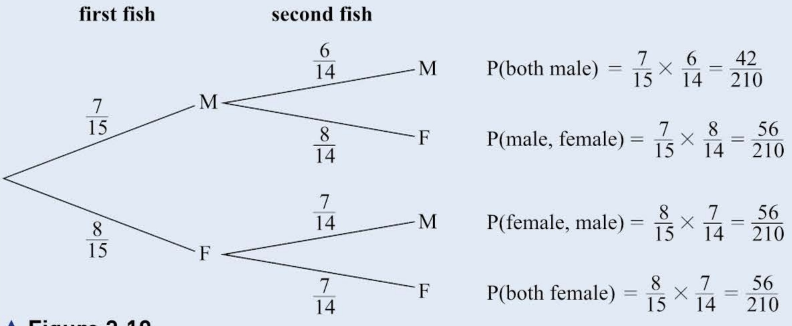

 $$ \begin{aligned}(i)\quad&P(both~the~same~sex)=P(both~male)+P(both~female)\\&=\frac{42}{210}+\frac{56}{210}=\frac{98}{210}=\frac{7}{15}\end{aligned} $$ 

 $$ (ii)\quad P(both~female)=\frac{56}{210}=\frac{4}{15} $$ 

 $$ \begin{align*}(iii)\quad&\mathrm{P}(\mathrm{both~female}\mid\mathrm{both~the~same~sex})\\&=\mathrm{P}(\mathrm{both~female~and~the~same~sex})\div\mathrm{P}(\mathrm{both~the~same~sex})=\frac{\frac{4}{15}}{\frac{7}{15}}=\frac{4}{7}\end{align*} $$ 

The ideas in the last example can be expressed more generally for any two dependent events, A and B. The tree diagram would be as shown in Figure 3.11.

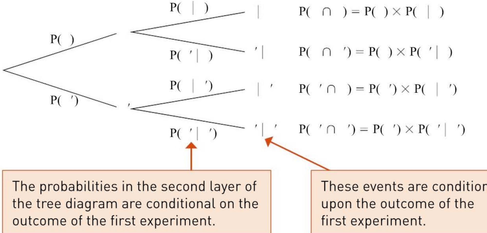

<!-- page 115 -->

The tree diagram shows you that:

 $$ \textcircled{>}\mathrm{~P}(B)=\mathrm{P}(A\cap B)+\mathrm{P}(A^{\prime}\cap B) $$ 

 $$ =\mathrm{P}(A)\times\mathrm{P}(B\mid A)+\mathrm{P}(A^{\prime})\times\mathrm{P}(B\mid A^{\prime}) $$ 

 $$ \Leftrightarrow\mathrm{P}(A\cap B)=\mathrm{P}(A)\times\mathrm{P}(B\mid A) $$ 

 $$ \Rightarrow\mathrm{P}(B\mid A)=\frac{\mathrm{P}(A\cap B)}{P(A)} $$ 

How were these results used in Example 3.10 about the goldfish?

## Exercise 3C

1 In a school of 600 students, 360 are girls. There are 320 hockey players, of whom 200 are girls. Among the hockey players there are 28 goalkeepers, 19 of them girls. Find the probability that:

(i) a student chosen at random is a girl

(ii) a girl chosen at random plays hockey

(iii) a hockey player chosen at random is a girl

(iv) a student chosen at random is a goalkeeper

(v) a goalkeeper chosen at random is a boy

(vi) a male hockey player chosen at random is a goalkeeper

(vii) a hockey player chosen at random is a male goalkeeper

(viii) two students chosen at random are both goalkeepers

(ix) two students chosen at random are a male goalkeeper and a female goalkeeper

(x) two students chosen at random are one boy and one girl.

2 100 cars are entered for a road-worthiness test which is in two parts, mechanical and electrical. A car passes only if it passes both parts. Half the cars fail the electrical test and 62 pass the mechanical. 15 pass the electrical but fail the mechanical test.

Find the probability that a car chosen at random:

(i) passes overall

(iii) given that it has failed, failed the mechanical test only.

3 Two dice are thrown. What is the probability that the total is:

(i) 7

(ii) a prime number

## CP

(iii) 7, given that it is a prime number?

4 A and B are two events with probabilities given by  $ \mathrm{P}(A)=0.4 $,  $ \mathrm{P}(B)=0.7 $ and  $ \mathrm{P}(A \cap B)=0.35 $.

(i) Find P(A \mid B) and P(B \mid A).

(ii) Show that the events A and B are not independent.

<!-- page 116 -->

PS

5 Quark hunting is a dangerous occupation. On a quark hunt, there is a probability of  $ \frac{1}{4} $ that the hunter is killed. The quark is twice as likely to be killed as the hunter. There is a probability of  $ \frac{1}{3} $ that both survive.

(i) Copy and complete this table of probabilities.

<table border=1 style='margin: auto; word-wrap: break-word;'><tr><td style='text-align: center; word-wrap: break-word;'></td><td style='text-align: center; word-wrap: break-word;'>Hunter dies</td><td style='text-align: center; word-wrap: break-word;'>Hunter lives</td><td style='text-align: center; word-wrap: break-word;'>Total</td></tr><tr><td style='text-align: center; word-wrap: break-word;'>Quark dies</td><td style='text-align: center; word-wrap: break-word;'></td><td style='text-align: center; word-wrap: break-word;'></td><td style='text-align: center; word-wrap: break-word;'>$ \frac{1}{2} $</td></tr><tr><td style='text-align: center; word-wrap: break-word;'>Quark lives</td><td style='text-align: center; word-wrap: break-word;'></td><td style='text-align: center; word-wrap: break-word;'>$ \frac{1}{3} $</td><td style='text-align: center; word-wrap: break-word;'>$ \frac{1}{2} $</td></tr><tr><td style='text-align: center; word-wrap: break-word;'>Total</td><td style='text-align: center; word-wrap: break-word;'>$ \frac{1}{4} $</td><td style='text-align: center; word-wrap: break-word;'></td><td style='text-align: center; word-wrap: break-word;'>1</td></tr></table>

Find the probability that:

(ii) both the hunter and the quark die

(iii) the hunter lives and the quark dies

(iv) the hunter lives, given that the quark dies.

6 There are 90 players in a tennis club. Of these, 23 are juniors, the rest are seniors. 34 of the seniors and 10 of the juniors are male. There are 8 juniors who are left-handed, 5 of whom are male. There are 18 left-handed players in total, 4 of whom are female seniors.

(i) Represent this information in a Venn diagram.

(ii) What is the probability that:

(a) a male player selected at random is left-handed?

(b) a left-handed player selected at random is a female junior?

(c) a player selected at random is either a junior or a female?

(d) a player selected at random is right-handed?

(e) a right-handed player selected at random is not a junior?

(f) a right-handed female player selected at random is a junior?

7 Data about employment for males and females in a small rural area are shown in the table.

<table border=1 style='margin: auto; word-wrap: break-word;'><tr><td style='text-align: center; word-wrap: break-word;'></td><td style='text-align: center; word-wrap: break-word;'>Unemployed</td><td style='text-align: center; word-wrap: break-word;'>Employed</td></tr><tr><td style='text-align: center; word-wrap: break-word;'>Male</td><td style='text-align: center; word-wrap: break-word;'>206</td><td style='text-align: center; word-wrap: break-word;'>412</td></tr><tr><td style='text-align: center; word-wrap: break-word;'>Female</td><td style='text-align: center; word-wrap: break-word;'>358</td><td style='text-align: center; word-wrap: break-word;'>305</td></tr></table>

A person from this area is chosen at random. Let M be the event that the person is male and let E be the event that the person is employed.

(i) Find P(M).

(ii) Find P(M and E).

(iii) Are M and E independent events? Justify your answer.

(iv) Given that the person chosen is unemployed, find the probability that the person is female.

<!-- page 117 -->

8 The probability that Henk goes swimming on any day is 0.2. On a day when he goes swimming, the probability that Henk has burgers for supper is 0.75. On a day when he does not go swimming, the probability that he has burgers for supper is x. This information is shown on the following tree diagram.

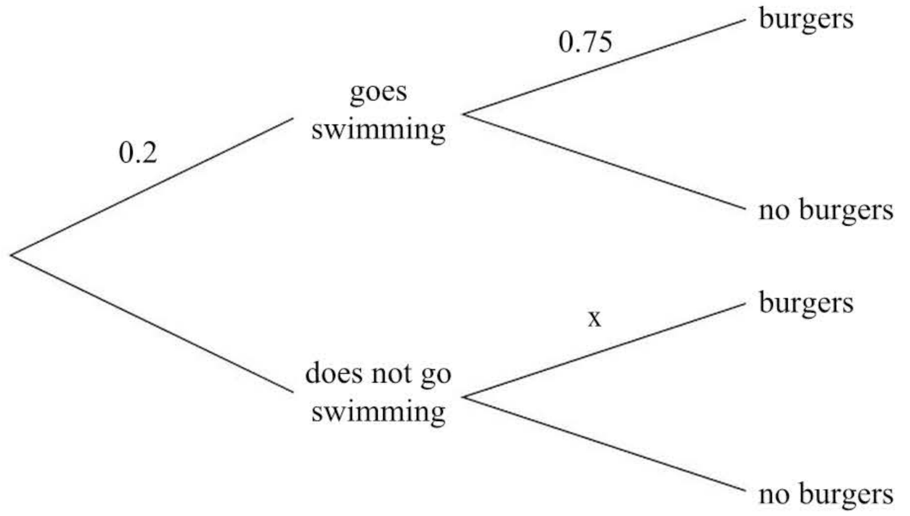

The probability that Henk has burgers for supper on any day is 0.5.

(i) Find x.

(ii) Given that Henk has burgers for supper, find the probability that he went swimming that day.

Cambridge International AS & A Level Mathematics

9709 Paper 6 Q2 June 2006

9 Boxes of sweets contain toffees and chocolate. Box A contains 6 toffees and 4 chocolates, box B contains 5 toffees and 3 chocolates, and box C contains 3 toffees and 7 chocolates. One of the boxes is chosen at random and two sweets are taken out, one after the other, and eaten.

(i) Find the probability that they are both toffees.

(ii) Given that they are both toffees, find the probability that they both come from box A.

Cambridge International AS & A Level Mathematics

9709 Paper 6 Q2 November 2005

10 There are three sets of traffic lights on Karinne's journey to work. The independent probabilities that Karinne has to stop at the first, second and third set of lights are 0.4, 0.8 and 0.3 respectively.

(i) Draw a tree diagram to show this information.

(ii) Find the probability that Karinne has to stop at each of the first two sets of lights but does not have to stop at the third set.

(iii) Find the probability that Karinne has to stop at exactly two of the three sets of lights.

(iv) Find the probability that Karinne has to stop at the first set of lights, given that she has to stop at exactly two sets of lights.

Cambridge International AS & A Level Mathematics

9709 Paper 6 Q6 November 2008

<!-- page 118 -->

11 A survey is undertaken to investigate how many photos people take on a one-week holiday and also how many times they view past photos. For a randomly chosen person, the probability of taking fewer than 100 photos is x. The probability that these people view past photos at least 3 times is 0.76.

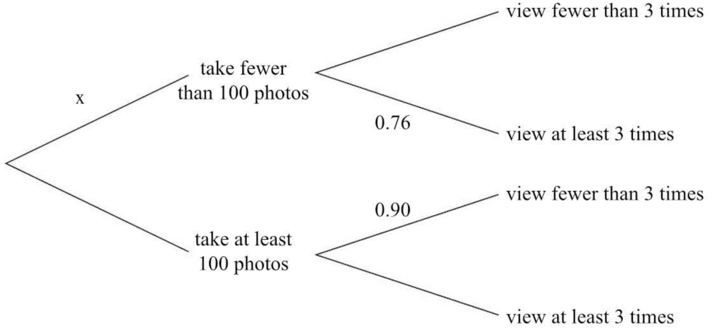

For those who take at least 100 photos, the probability that they view past photos fewer than 3 times is 0.90. This information is shown in the tree diagram. The probability that a randomly chosen person views past photos fewer than 3 times is 0.801.

(i) Find x.

(ii) Given that a person views past photos at least 3 times, find the probability that this person takes at least 100 photos.

Cambridge International AS & A Level Mathematics

9709 Paper 61 Q4 June 2015

12 Playground equipment consists of swings (S), roundabouts (R), climbing frames (C) and play-houses (P). The numbers of pieces of equipment in each of 3 playgrounds are as follows.

<table border=1 style='margin: auto; word-wrap: break-word;'><tr><td style='text-align: center; word-wrap: break-word;'>Playground X</td><td style='text-align: center; word-wrap: break-word;'>Playground Y</td><td style='text-align: center; word-wrap: break-word;'>Playground Z</td></tr><tr><td style='text-align: center; word-wrap: break-word;'>3S, 2R, 4P</td><td style='text-align: center; word-wrap: break-word;'>6S, 3R, 1C, 2P</td><td style='text-align: center; word-wrap: break-word;'>8S, 3R, 4C, 1P</td></tr></table>

Each day Nur takes her child to one of the playgrounds. The probability that she chooses playground X is  $ \frac{1}{4} $. The probability that she chooses playground Y is  $ \frac{1}{4} $. The probability that she chooses playground Z is  $ \frac{1}{2} $. When she arrives at the playground, she chooses one piece of equipment at random.

(i) Find the probability that Nur chooses a play-house.

(ii) Given that Nur chooses a climbing frame, find the probability that she chose playground Y.

<!-- page 119 -->

## Estimating minnows

A building company is proposing to fill in a pond that is the home for many different species of wildlife.The local council commission a naturalist called Henry to do a survey of the wildlife that is dependent on the pond.As part of this exercise Henry decides to estimate how many minnows are living in the pond.The minnows cannot all be seen at the same time so it is not possible just to count them.

This task involves the various stages of the problem solving cycle.

## 1 Problem specification and analysis

Henry starts by planning how he will go about the task.

The procedure he chooses is based on a method called capture-recapture. To carry it out he needs a minnow trap and some suitable markers for minnows.

## 2 Information collection

Henry sets the trap once a day for a week, starting on Sunday. Each time that he opens the trap he counts how many minnows he caught and how many of them are already marked. He then marks those that are not already marked and returns the minnows to the pond.

The following table shows his results for the week.

<table border=1 style='margin: auto; word-wrap: break-word;'><tr><td style='text-align: center; word-wrap: break-word;'>Day</td><td style='text-align: center; word-wrap: break-word;'>Sun</td><td style='text-align: center; word-wrap: break-word;'>Mon</td><td style='text-align: center; word-wrap: break-word;'>Tues</td><td style='text-align: center; word-wrap: break-word;'>Wed</td><td style='text-align: center; word-wrap: break-word;'>Thurs</td><td style='text-align: center; word-wrap: break-word;'>Fri</td><td style='text-align: center; word-wrap: break-word;'>Sat</td></tr><tr><td style='text-align: center; word-wrap: break-word;'>Number caught</td><td style='text-align: center; word-wrap: break-word;'>10</td><td style='text-align: center; word-wrap: break-word;'>12</td><td style='text-align: center; word-wrap: break-word;'>8</td><td style='text-align: center; word-wrap: break-word;'>15</td><td style='text-align: center; word-wrap: break-word;'>6</td><td style='text-align: center; word-wrap: break-word;'>12</td><td style='text-align: center; word-wrap: break-word;'>16</td></tr><tr><td style='text-align: center; word-wrap: break-word;'>Number already marked</td><td style='text-align: center; word-wrap: break-word;'>-</td><td style='text-align: center; word-wrap: break-word;'>1</td><td style='text-align: center; word-wrap: break-word;'>1</td><td style='text-align: center; word-wrap: break-word;'>3</td><td style='text-align: center; word-wrap: break-word;'>2</td><td style='text-align: center; word-wrap: break-word;'>4</td><td style='text-align: center; word-wrap: break-word;'>6</td></tr></table>

## 3 Processing and representation

(i) After Henry has returned the minnows to the pond on Monday, he estimates that there are 120 minnows in the pond. After Tuesday's catch he makes a new estimate of 168 minnows. Show how he calculates these figures.

(ii) Use the figures for the subsequent days' catches to make four more estimates of the number of minnows in the pond.

(iii) Draw a suitable diagram to illustrate the estimates.

## 4 Interpretation

(i) Henry has to write a report to the council. It will include a short section about the minnows. Comment briefly on what it might say about the following:

(b) Any assumptions required for the calculations and if they are reasonable

(a) The best estimate of the number of minnows

(c) How accurate the estimate is likely to be.

(ii) Suggest a possible improvement to Henry's method for data collection.

<!-- page 120 -->

## KEY POINTS

1 The probability of an event A is

 $$ \mathrm{P}(A)=\frac{n(A)}{n(\mathfrak{E})} $$ 

where $n(A)$ is the number of ways that $A$ can occur and $n(\mathcal{E})$ is the total number of ways that all possible events can occur, all of which are equally likely.

2 A sample space is a list of all possible outcomes of an experiment.

3 For any two events, A and B, of the same experiment,

 $$ \mathrm{P}(A\cup B)=\mathrm{P}(A)+\mathrm{P}(B)-\mathrm{P}(A\cap B). $$ 

Where the events are mutually exclusive (i.e. where the events do not overlap) the rule still holds but, since $P(A \cap B)$ is now equal to zero, the equation simplifies to:

 $$ \mathrm{P}(A\cup B)=\mathrm{P}(A)+\mathrm{P}(B). $$ 

4 Where an experiment produces two or more mutually exclusive events, the probabilities of the separate events sum to 1.

5  $ \mathrm{P}(A)+\mathrm{P}(A^{\prime})=1 $

6 For two independent events, A and B,

 $$ \mathrm{P}(A\cap B)=\mathrm{P}(A)\times\mathrm{P}(B). $$ 

7 P(B \mid A) means the probability of event B occurring given that event A has already occurred,

 $$ \mathrm{P}(B\mid A)=\frac{\mathrm{P}(A\cap B)}{\mathrm{P}(A)}. $$ 

8 The probability that event A and then event B occur, in that order, is  $ \mathrm{P}(A) \times \mathrm{P}(B \mid A) $.

9 If event B is independent of event A,

 $$ \mathrm{P}(B\mid A)=\mathrm{P}(B\mid A^{\prime})=\mathrm{P}(B). $$

<!-- page 121 -->

## LEARNING OUTCOMES

Now that you have finished this chapter, you should be able to

measure probability using the number of ways an event can happen and the number of equally likely outcomes

interpret probabilities of 0 and 1

complete a sample space diagram to list all possible outcomes

find the probability of the complement of an event

use Venn diagrams in probability problems

understand the terms mutually exclusive and independent

determine whether a pair of events are mutually exclusive or independent

use addition and multiplication of probabilities

understand that  $ \mathrm{P}(A \cup B) = \mathrm{P}(A) + \mathrm{P}(B) - \mathrm{P}(A \cap B) $

solve probability problems with two events

use a tree diagram to solve probability problems with two events

solve problems involving conditional probability

use the formula  $ P(A|B) = \frac{P(A \cap B)}{P(B)} $.

