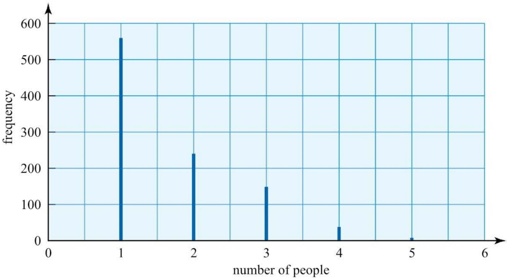
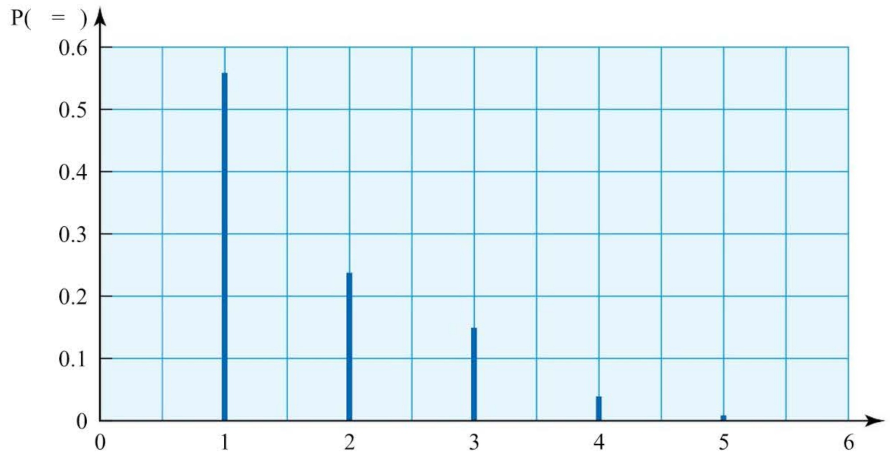
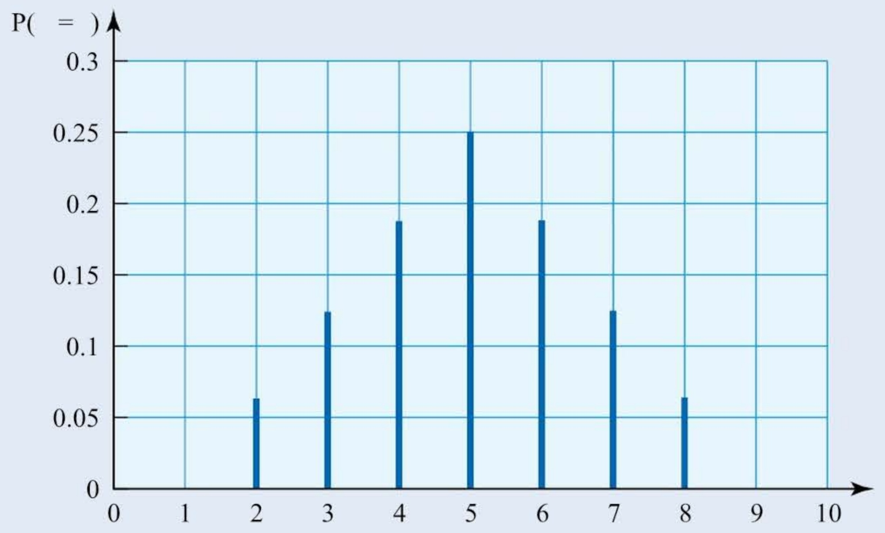
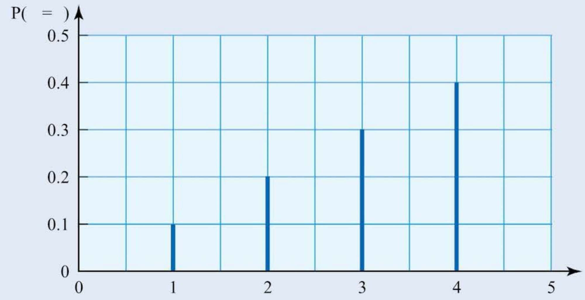

# Discrete random variables

<!-- Cambridge International AS  A Level Mathematics Probability  Statistics 1 (Sophie Goldie) .pdf p122-139 -->

<!-- page 122 -->

## Discrete random variables

An approximate answer to the right problem is worth a good deal more than an exact answer to an approximate problem. John Tukey (1915-2000)

## Car Share World

## Share life's journey!

Towns and cities around the country are gridlocked with traffic – many of these cars have just one occupant. To solve this problem, Car Share World is launching a new scheme for people to carshare on journeys into all major cities. Our comprehensive database can put interested drivers in touch with each other and live updates via your mobile will display the number of car shares available in any major city. Car shares are available from centralised locations for maximum convenience.

Car Share World is running a small trial scheme in a busy town just south of the capital. We will be conducting a survey to measure the success of the trial. Keep up to date with the trial via the latest news on our website.

How would you collect information on the volume of traffic in the town?

<!-- page 123 -->

A traffic survey, at critical points around the town centre, was conducted at peak travelling times over a period of a working week. The survey involved 1000 cars. The number of people in each car was noted, with the following results.

<table border=1 style='margin: auto; word-wrap: break-word;'><tr><td style='text-align: center; word-wrap: break-word;'>Number of people per car</td><td style='text-align: center; word-wrap: break-word;'>1</td><td style='text-align: center; word-wrap: break-word;'>2</td><td style='text-align: center; word-wrap: break-word;'>3</td><td style='text-align: center; word-wrap: break-word;'>4</td><td style='text-align: center; word-wrap: break-word;'>5</td><td style='text-align: center; word-wrap: break-word;'>&gt; 5</td></tr><tr><td style='text-align: center; word-wrap: break-word;'>Frequency</td><td style='text-align: center; word-wrap: break-word;'>560</td><td style='text-align: center; word-wrap: break-word;'>240</td><td style='text-align: center; word-wrap: break-word;'>150</td><td style='text-align: center; word-wrap: break-word;'>40</td><td style='text-align: center; word-wrap: break-word;'>10</td><td style='text-align: center; word-wrap: break-word;'>0</td></tr></table>

How would you illustrate such a distribution?

What are the main features of this distribution?

The numbers of people per car are necessarily discrete. A discrete frequency distribution is best illustrated by a vertical line chart, as in Figure 4.1. This shows you that the distribution has positive skew, with most of the data at the lower end of the distribution.

Figure 4.1

The survey involved 1000 cars. This is a large sample and so it is reasonable to use the results to estimate the probabilities of the various possible outcomes: 1, 2, 3, 4, 5 people per car. You divide each frequency by 1000 to obtain the relative frequency, or probability, of each outcome (number of people).

<table border=1 style='margin: auto; word-wrap: break-word;'><tr><td style='text-align: center; word-wrap: break-word;'>Outcome (Number of people)</td><td style='text-align: center; word-wrap: break-word;'>1</td><td style='text-align: center; word-wrap: break-word;'>2</td><td style='text-align: center; word-wrap: break-word;'>3</td><td style='text-align: center; word-wrap: break-word;'>4</td><td style='text-align: center; word-wrap: break-word;'>5</td><td style='text-align: center; word-wrap: break-word;'>&gt;5</td></tr><tr><td style='text-align: center; word-wrap: break-word;'>Probability (Relative frequency)</td><td style='text-align: center; word-wrap: break-word;'>0.56</td><td style='text-align: center; word-wrap: break-word;'>0.24</td><td style='text-align: center; word-wrap: break-word;'>0.15</td><td style='text-align: center; word-wrap: break-word;'>0.04</td><td style='text-align: center; word-wrap: break-word;'>0.01</td><td style='text-align: center; word-wrap: break-word;'>0</td></tr></table>

### 4.1 Discrete random variables

You now have a mathematical model to describe a particular situation. In statistics you are often looking for models to describe and explain the data you find in the real world. In this chapter you are introduced to some of the techniques for working with models for discrete data. Such models use discrete random variables.

<!-- page 124 -->

The model is  $ \underline{\text{discrete}} $ since the number of passengers can be counted and takes positive integer values only. The number of passengers is a  $ \underline{\text{random}} $ variable since the actual value of the outcome is variable and can only be predicted with a given probability, i.e. the outcomes occur at random.

Discrete random variables may have a finite or an infinite number of possible outcomes.

The distribution we have outlined so far is finite – in the survey the maximum number of people observed was five, but the maximum could be, say, eight, depending on the size of car. In this case there would be eight possible outcomes. A well-known example of a finite discrete random variable occurs in the binomial distribution, which you will study in Chapter 6.

On the other hand, if you considered the number of hits on a website in a given day, there may be no theoretical maximum, in which case the distribution may be considered as infinite. A well-known example of an infinite discrete random variable occurs in the Poisson distribution, which you will meet if you study Probability & Statistics 2.

The study of discrete random variables in this chapter will be limited to finite cases.

## Notation and conditions for a discrete random variable

A discrete random variable is usually denoted by an upper case letter, such as X, Y or Z. You may think of this as the name of the variable. The particular values that the variable takes are denoted by lower case letters, such as r. Sometimes these are given suffixes  $ r_{1}, r_{2}, r_{3}, \ldots $. Thus  $ \mathrm{P}(X = r_{1}) $ is the probability that the discrete random variable X takes the particular value  $ r_{1} $. The expression  $ \mathrm{P}(X = r) $ is used to express a more general idea, as, for example, in a table heading.

Another, shorter way of writing probabilities is $p_{1}, p_{2}, p_{3}, \ldots$. If a finite discrete random variable has $n$ distinct outcomes $r_{1}, r_{2}, \ldots, r_{n}$, with associated probabilities $p_{1}, p_{2}, \ldots, p_{n}$, then the sum of the probabilities must equal 1. Since the various outcomes cover all possibilities, they are exhaustive.

Formally we have:

 $$ \begin{aligned}&p_{1}+p_{2}+\cdots+p_{n}=1\\&or\quad\sum_{i=1}^{n}p_{i}=\sum_{i=1}^{n}P(X=r_{i})=1.\end{aligned} $$ 

You should be familiar with all these notations.

If there is no ambiguity then  $ \sum_{i=1}^{n} \mathrm{P}(X=r_i) $ is often abbreviated to  $ \sum \mathrm{P}(X=r) $ or  $ p_r $

You will often see an alternative notation used, in which the values that the variable takes are denoted by x rather than r. In this book, r is used for a discrete variable and in Probability & Statistics 2, x is used for a continuous variable.

<!-- page 125 -->

## Diagrams of discrete random variables

Just as with frequency distributions for discrete data, the most appropriate diagram to illustrate a discrete random variable is a vertical line chart. Figure 4.2 shows a diagram of the probability distribution of X, the number of people per car. Note that it is identical in shape to the corresponding frequency diagram in Figure 4.1. The only real difference is the change of scale on the vertical axis.

Figure 4.2

Example 4.1

Two tetrahedral dice, each with faces labelled 1, 2, 3 and 4, are thrown and the random variable X represents the sum of the numbers shown on the dice.

(i) Find the probability distribution of X.

(ii) Illustrate the distribution and describe the shape of the distribution.

(iii) What is the probability that any throw of the dice results in a value of X which is an odd number?

## Solution

(i) The table shows all the possible totals when the two dice are thrown.

<table border=1 style='margin: auto; word-wrap: break-word;'><tr><td rowspan="2" colspan="2"></td><td colspan="4">First die</td></tr><tr><td style='text-align: center; word-wrap: break-word;'>1</td><td style='text-align: center; word-wrap: break-word;'>2</td><td style='text-align: center; word-wrap: break-word;'>3</td><td style='text-align: center; word-wrap: break-word;'>4</td></tr><tr><td rowspan="4">Second die</td><td style='text-align: center; word-wrap: break-word;'>1</td><td style='text-align: center; word-wrap: break-word;'>2</td><td style='text-align: center; word-wrap: break-word;'>3</td><td style='text-align: center; word-wrap: break-word;'>4</td><td style='text-align: center; word-wrap: break-word;'>5</td></tr><tr><td style='text-align: center; word-wrap: break-word;'>2</td><td style='text-align: center; word-wrap: break-word;'>3</td><td style='text-align: center; word-wrap: break-word;'>4</td><td style='text-align: center; word-wrap: break-word;'>5</td><td style='text-align: center; word-wrap: break-word;'>6</td></tr><tr><td style='text-align: center; word-wrap: break-word;'>3</td><td style='text-align: center; word-wrap: break-word;'>4</td><td style='text-align: center; word-wrap: break-word;'>5</td><td style='text-align: center; word-wrap: break-word;'>6</td><td style='text-align: center; word-wrap: break-word;'>7</td></tr><tr><td style='text-align: center; word-wrap: break-word;'>4</td><td style='text-align: center; word-wrap: break-word;'>5</td><td style='text-align: center; word-wrap: break-word;'>6</td><td style='text-align: center; word-wrap: break-word;'>7</td><td style='text-align: center; word-wrap: break-word;'>8</td></tr></table>

You can use the table to write down the probability distribution for X.

<table border=1 style='margin: auto; word-wrap: break-word;'><tr><td style='text-align: center; word-wrap: break-word;'>r</td><td style='text-align: center; word-wrap: break-word;'>2</td><td style='text-align: center; word-wrap: break-word;'>3</td><td style='text-align: center; word-wrap: break-word;'>4</td><td style='text-align: center; word-wrap: break-word;'>5</td><td style='text-align: center; word-wrap: break-word;'>6</td><td style='text-align: center; word-wrap: break-word;'>7</td><td style='text-align: center; word-wrap: break-word;'>8</td></tr><tr><td style='text-align: center; word-wrap: break-word;'>$ \mathbf{P}(X=r) $</td><td style='text-align: center; word-wrap: break-word;'>$ \frac{1}{16} $</td><td style='text-align: center; word-wrap: break-word;'>$ \frac{2}{16} $</td><td style='text-align: center; word-wrap: break-word;'>$ \frac{3}{16} $</td><td style='text-align: center; word-wrap: break-word;'>$ \frac{4}{16} $</td><td style='text-align: center; word-wrap: break-word;'>$ \frac{3}{16} $</td><td style='text-align: center; word-wrap: break-word;'>$ \frac{2}{16} $</td><td style='text-align: center; word-wrap: break-word;'>$ \frac{1}{16} $</td></tr></table>

<!-- page 126 -->

(ii) The vertical line chart in Figure 4.3 illustrates this distribution, which is symmetrical.

### Figure 4.3

(iii) The probability that X is an odd number

 $  = \mathrm{P}(X = 3) + \mathrm{P}(X = 5) + \mathrm{P}(X = 7)  $

 $  = \frac{2}{16} + \frac{4}{16} + \frac{2}{16}  $

 $  = \frac{1}{2}  $

As well as defining a discrete random variable by tabulating the probability distribution, another effective way is to use an algebraic definition of the form  $ \mathrm{P}(X=r)=\mathrm{f}(r) $ for given values of r.

The following example illustrates how this may be used.

### Example 4.2

The probability distribution of a random variable X is given by

 $$ \mathrm{P}(X=r)=kr\quad\text{for}r=1,2,3,4 $$ 

 $$ \mathrm{P}(X=r)=0\qquad\quad\mathrm{o t h e r w i s e}. $$ 

(i) Find the value of the constant k.

(ii) Illustrate the distribution and describe the shape of the distribution.

(iii) Two successive values of X are generated independently of each other.

Find the probability that:

(a) both values of X are the same

(b) the total of the two values of X is greater than 6.

## Solution

(i) Tabulating the probability distribution for X gives:

<table border=1 style='margin: auto; word-wrap: break-word;'><tr><td style='text-align: center; word-wrap: break-word;'>r</td><td style='text-align: center; word-wrap: break-word;'>1</td><td style='text-align: center; word-wrap: break-word;'>2</td><td style='text-align: center; word-wrap: break-word;'>3</td><td style='text-align: center; word-wrap: break-word;'>4</td></tr><tr><td style='text-align: center; word-wrap: break-word;'>$ \mathbf{P}(X = r) $</td><td style='text-align: center; word-wrap: break-word;'>k</td><td style='text-align: center; word-wrap: break-word;'>2k</td><td style='text-align: center; word-wrap: break-word;'>3k</td><td style='text-align: center; word-wrap: break-word;'>4k</td></tr></table>

<!-- page 127 -->

$$ \begin{array}{l}\sum\mathrm{P}(X=r)&=1\\ \Rightarrow k+2k+3k+4k=1\\ \Rightarrow&10k=1\\ \Rightarrow&k=0.1\end{array} $$ 

Hence P(X=r)=0.1r, for r=1,2,3,4, which gives the following probability distribution.

<table border=1 style='margin: auto; word-wrap: break-word;'><tr><td style='text-align: center; word-wrap: break-word;'>r</td><td style='text-align: center; word-wrap: break-word;'>1</td><td style='text-align: center; word-wrap: break-word;'>2</td><td style='text-align: center; word-wrap: break-word;'>3</td><td style='text-align: center; word-wrap: break-word;'>4</td></tr><tr><td style='text-align: center; word-wrap: break-word;'>$ \mathbf{P}(X = r) $</td><td style='text-align: center; word-wrap: break-word;'>0.1</td><td style='text-align: center; word-wrap: break-word;'>0.2</td><td style='text-align: center; word-wrap: break-word;'>0.3</td><td style='text-align: center; word-wrap: break-word;'>0.4</td></tr></table>

(ii) The vertical line chart in Figure 4.4 illustrates this distribution. It has negative skew.

### Figure 4.4

(iii) Let  $ X_{1} $ represent the first value generated and  $ X_{2} $ the second value generated.

 $$ \begin{aligned}&\{a\}\quad P(both~values~of~X~are~the~same)\\&\quad=P(X_{1}=X_{2}=1~or~X_{1}=X_{2}=2~or~X_{1}=X_{2}=3~or~X_{1}=X_{2}=4)\\&\quad=P(X_{1}=X_{2}=1)+P(X_{1}=X_{2}=2)+P(X_{1}=X_{2}=3)\\&\quad\quad+P(X_{1}=X_{2}=4)\\&\quad=P(X_{1}=1)\times P(X_{2}=1)+P(X_{1}=2)\times P(X_{2}=2)\\&\quad\quad+P(X_{1}=3)\times P(X_{2}=3)+P(X_{1}=4)\times P(X_{2}=4)\\&\quad=(0.1)^{2}+(0.2)^{2}+(0.3)^{2}+(0.4)^{2}\\&\quad=0.01+0.04+0.09+0.16\\&\quad=0.3\end{aligned} $$ 

 $$ \begin{aligned}\{b\}&\quad\mathrm{P}(\text{total of the two values is greater than}6)\\&=\mathrm{P}(X_{1}+X_{2}>6)\\&=\mathrm{P}(X_{1}+X_{2}=7or8)\\&=\mathrm{P}(X_{1}+X_{2}=7)+\mathrm{P}(X_{1}+X_{2}=8)\\&=\mathrm{P}(X_{1}=3)\times\mathrm{P}(X_{2}=4)+\mathrm{P}(X_{1}=4)\times\mathrm{P}(X_{2}=3)\\&\quad+\mathrm{P}(X_{1}=4)\times\mathrm{P}(X_{2}=4)\\&=0.3\times0.4+0.4\times0.3+0.4\times0.4\\&=0.12+0.12+0.16\\&=0.4\end{aligned} $$

<!-- page 128 -->

1 The random variable X is given by the sum of the scores when two ordinary dice are thrown.

(i) Find the probability distribution of X.

(ii) Illustrate the distribution and describe the shape of the distribution.

## CP

(iii) Find the values of:

(a) P(X > 8)

(b) P(X is even)

(c) P(|X-7|<3).

2 The random variable Y is given by the absolute difference between the scores when two ordinary dice are thrown.

(i) Find the probability distribution of Y.

(ii) Illustrate the distribution and describe the shape of the distribution.

(iii) Find the values of:

## CP

(a) P(Y < 3)

(b) P(Y is odd).

3 The probability distribution of a discrete random variable X is given by:

 $$ \mathrm{P}(X=r)=\frac{kr}{8}\quad\text{for}r=2,4,6,8 $$ 

P(X=r)=0 \quad \text{otherwise.}

(i) Find the value of k and tabulate the probability distribution.

(ii) If two successive values of X are generated independently find the probability that:

(a) the two values are equal

(b) the first value is greater than the second value.

4 An irregular die with six faces produces scores, X, for which the probability distribution is given by:

 $$ \mathrm{P}(X=r)=\frac{k}{r}\quad\text{for}r=1,2,3,4,5,6 $$ 

P(X=r)=0 \quad \text{otherwise.}

## CP

(i) Find the value of k and illustrate the distribution.

(ii) Show that, when this die is thrown twice, the probability of obtaining two equal scores is very nearly  $ \frac{1}{4} $.

5 Three fair coins are tossed.

(i) By considering the set of possible outcomes, HHH, HHT, etc., tabulate the probability distribution for X, the number of heads occurring.

(ii) Illustrate the distribution and describe the shape of the distribution.

(iii) Find the probability that there are more heads than tails.

(iv) Without further calculation, state whether your answer to part (iii) would be the same if four fair coins were tossed. Give a reason for your answer.

<!-- page 129 -->

6 Two fair tetrahedral dice, each with faces labelled 1, 2, 3 and 4, are thrown and the random variable X is the product of the numbers shown on the dice.

(i) Find the probability distribution of X.

(ii) What is the probability that any throw of the dice results in a value of X which is an odd number?

7 An ornithologist carries out a study of the number of eggs laid per pair by a species of rare bird in its annual breeding season. He concludes that it may be considered as a discrete random variable X with probability distribution given by

 $$ \begin{array}{r l}&{\mathrm{P}(X=0)=0.2}\\ &{\mathrm{P}(X=r)=k(4r-r^{2})\qquad\mathrm{f o r~}r=1,2,3,4}\\ &{\mathrm{P}(X=r)=0\qquad\mathrm{o t h e r w i s e}.}\end{array} $$ 

(i) Find the value of k and write the probability distribution as a table.

The ornithologist observes that the probability of survival (that is of an egg hatching and of the chick living to the stage of leaving the nest) is dependent on the number of eggs in the nest. He estimates the probabilities to be as follows.

<table border=1 style='margin: auto; word-wrap: break-word;'><tr><td style='text-align: center; word-wrap: break-word;'>r</td><td style='text-align: center; word-wrap: break-word;'>Probability of survival</td></tr><tr><td style='text-align: center; word-wrap: break-word;'>1</td><td style='text-align: center; word-wrap: break-word;'>0.8</td></tr><tr><td style='text-align: center; word-wrap: break-word;'>2</td><td style='text-align: center; word-wrap: break-word;'>0.6</td></tr><tr><td style='text-align: center; word-wrap: break-word;'>3</td><td style='text-align: center; word-wrap: break-word;'>0.4</td></tr></table>

(ii) Find, in the form of a table, the probability distribution of the number of chicks surviving per pair of adults.

8 A sociologist is investigating the changing pattern of the number of children which women have in a country. She denotes the present number by the random variable X which she finds to have the following probability distribution.

<table border=1 style='margin: auto; word-wrap: break-word;'><tr><td style='text-align: center; word-wrap: break-word;'>r</td><td style='text-align: center; word-wrap: break-word;'>0</td><td style='text-align: center; word-wrap: break-word;'>1</td><td style='text-align: center; word-wrap: break-word;'>2</td><td style='text-align: center; word-wrap: break-word;'>3</td><td style='text-align: center; word-wrap: break-word;'>4</td><td style='text-align: center; word-wrap: break-word;'>5 +</td></tr><tr><td style='text-align: center; word-wrap: break-word;'>P(X = r)</td><td style='text-align: center; word-wrap: break-word;'>0.09</td><td style='text-align: center; word-wrap: break-word;'>0.22</td><td style='text-align: center; word-wrap: break-word;'>a</td><td style='text-align: center; word-wrap: break-word;'>0.19</td><td style='text-align: center; word-wrap: break-word;'>0.08</td><td style='text-align: center; word-wrap: break-word;'>negligible</td></tr></table>

(i) Find the value of a.

She is keen to find an algebraic expression for the probability distribution and suggests the following model.

 $$ \mathrm{P}(X=r)=k(r+1)(5-r)\qquad\qquad\mathrm{f o r~}r=0,1,2,3,4,5 $$ 

P(X = r) = 0

otherwise.

(ii) Find the value of k for this model.

(iii) Compare the algebraic model with the probabilities she found, illustrating both distributions on one diagram.

Do you think it is a good model?

<!-- page 130 -->

9 In a game, each player throws three ordinary six-sided dice. The random variable X is the largest number showing on the dice, so for example, for scores of 2, 5 and 4, X = 5.

(i) Find the probability that X = 1, i.e. P(X = 1).

(ii) Find P(X ≤ 2) and deduce that P(X = 2) =  $ \frac{7}{216} $.

(iii) Find P(X \leq r) and so deduce P(X = r), for r = 3, 4, 5, 6.

(iv) Illustrate and describe the probability distribution of X.

10 A box contains six black pens and four red pens. Three pens are taken at random from the box.

(i) By considering the selection of pens as sampling without replacement, illustrate the various outcomes on a probability tree diagram.

(ii) The random variable X represents the number of red pens obtained. Find the probability distribution of X.

11 A vegetable basket contains 12 peppers, of which 3 are red, 4 are green and 5 are yellow. Three peppers are taken, at random and without replacement, from the basket.

(i) Find the probability that the three peppers are all different colours.

(ii) Show that the probability that exactly 2 of the peppers taken are green is  $ \frac{12}{55} $.

(iii) The number of green peppers taken is denoted by the discrete random variable X. Draw up a probability distribution table for X.

Cambridge International AS & A Level Mathematics

9709 Paper 6 Q7 June 2007

### 4.2 Expectation and variance

## Car Share World

Share life's journey!

Latest update ...

Car-share trial a massive success. Traffic volume down and number of occupants per car up!

What statistical evidence do you think Car Share World's claim is based on?

A second traffic survey, at critical points around the town centre, was conducted at peak travelling times over a period of a working week. This time the survey involved 800 cars. The number of people in each car is shown in the table.

<!-- page 131 -->

<table border=1 style='margin: auto; word-wrap: break-word;'><tr><td style='text-align: center; word-wrap: break-word;'>Number of people per car</td><td style='text-align: center; word-wrap: break-word;'>1</td><td style='text-align: center; word-wrap: break-word;'>2</td><td style='text-align: center; word-wrap: break-word;'>3</td><td style='text-align: center; word-wrap: break-word;'>4</td><td style='text-align: center; word-wrap: break-word;'>5</td><td style='text-align: center; word-wrap: break-word;'>&gt;5</td></tr><tr><td style='text-align: center; word-wrap: break-word;'>Frequency</td><td style='text-align: center; word-wrap: break-word;'>280</td><td style='text-align: center; word-wrap: break-word;'>300</td><td style='text-align: center; word-wrap: break-word;'>164</td><td style='text-align: center; word-wrap: break-word;'>52</td><td style='text-align: center; word-wrap: break-word;'>4</td><td style='text-align: center; word-wrap: break-word;'>0</td></tr></table>

How would you compare the results in the two traffic surveys?

The survey involved 800 cars. This is a fairly large sample and so, once again, it is reasonable to use the results to estimate the probabilities of the various possible outcomes: 1, 2, 3, 4 and 5 people per car, as before.

<table border=1 style='margin: auto; word-wrap: break-word;'><tr><td style='text-align: center; word-wrap: break-word;'>Outcome (Number of people)</td><td style='text-align: center; word-wrap: break-word;'>1</td><td style='text-align: center; word-wrap: break-word;'>2</td><td style='text-align: center; word-wrap: break-word;'>3</td><td style='text-align: center; word-wrap: break-word;'>4</td><td style='text-align: center; word-wrap: break-word;'>5</td><td style='text-align: center; word-wrap: break-word;'>&gt; 5</td></tr><tr><td style='text-align: center; word-wrap: break-word;'>Probability (Relative frequency)</td><td style='text-align: center; word-wrap: break-word;'>0.35</td><td style='text-align: center; word-wrap: break-word;'>0.375</td><td style='text-align: center; word-wrap: break-word;'>0.205</td><td style='text-align: center; word-wrap: break-word;'>0.065</td><td style='text-align: center; word-wrap: break-word;'>0.005</td><td style='text-align: center; word-wrap: break-word;'>0</td></tr></table>

One way to compare the two probability distributions, before and after the car-sharing campaign, is to calculate a measure of central tendency and a measure of spread.

The most useful measure of central tendency is the mean or expectation of the random variable and the most useful measure of spread is the variance. To a large extent the calculation of these statistics mirrors the corresponding statistics for a frequency distribution,  $ \bar{x} $ and  $ sd^{2} $.

### ACTIVITY 4.1

Find the mean and variance of the frequency distribution for the people-per-car survey following the introduction of the car-sharing scheme.

Using relative frequencies generates an alternative approach which gives the expectation  $ \mathrm{E}(X) = \mu $ and variance  $ \mathrm{Var}(X) = \sigma^{2} $ for a discrete random variable.

We define the expectation,  $ \mathrm{E}(X) $ as

 $$ \mathrm{E}(X)=\mu=\sum r\mathrm{P}(X=r)=\sum r p_{r} $$ 

and variance, Var(X) as

Notice the notation, $\mu$ for the distribution's mean and $\sigma$ for its standard deviation. Also notice the shortened notation for $\mathrm{P}(X = r)$.

 $$ \sigma^{2}=\mathrm{E}([X-\mu]^{2})=\sum(r-\mu)^{2}p_{r} $$ 

or

 $$ \sigma^{2}=\mathrm{E}(X^{2})-\mu^{2}=\sum r^{2}p_{r}-\left[\sum rp_{r}\right]^{2}. $$ 

 $ \sigma^{2} $ is read as 'sigma squared'.

The second version of the variance is often written as  $ \mathrm{E}(X^{2}) - [\mathrm{E}(X)]^{2} $, which can be remembered as ‘the expectation of the squares minus the square of the expectation’.

These formulae can also be written as:

 $$ \operatorname{E}(X)=\sum x p $$ 

 $$ \mathrm{Var}(X)=\sum x^{2}p-\left[\mathrm{E}(X)\right]^{2} $$

<!-- page 132 -->

Look at how expectation and variance are calculated using the probability distribution developed from the second survey of number of people per car. You can use these statistics to compare the distribution of number of people per car before and after the introduction of the car-sharing scheme.

When calculating the expectation and variance of a discrete probability distribution, you will find it helpful to set your work out systematically in a table.

<table border=1 style='margin: auto; word-wrap: break-word;'><tr><td colspan="3"></td><td style='text-align: center; word-wrap: break-word;'>(a)</td><td style='text-align: center; word-wrap: break-word;'>(b)</td></tr><tr><td style='text-align: center; word-wrap: break-word;'>r</td><td style='text-align: center; word-wrap: break-word;'>$ p_{r} $</td><td style='text-align: center; word-wrap: break-word;'>$ r p_{r} $</td><td style='text-align: center; word-wrap: break-word;'>$ r^{2} p_{r} $</td><td style='text-align: center; word-wrap: break-word;'>$ (r - \mu)^{2} p_{r} $</td></tr><tr><td style='text-align: center; word-wrap: break-word;'>1</td><td style='text-align: center; word-wrap: break-word;'>0.35</td><td style='text-align: center; word-wrap: break-word;'>0.35</td><td style='text-align: center; word-wrap: break-word;'>0.35</td><td style='text-align: center; word-wrap: break-word;'>0.35</td></tr><tr><td style='text-align: center; word-wrap: break-word;'>2</td><td style='text-align: center; word-wrap: break-word;'>0.375</td><td style='text-align: center; word-wrap: break-word;'>0.75</td><td style='text-align: center; word-wrap: break-word;'>1.5</td><td style='text-align: center; word-wrap: break-word;'>0</td></tr><tr><td style='text-align: center; word-wrap: break-word;'>3</td><td style='text-align: center; word-wrap: break-word;'>0.205</td><td style='text-align: center; word-wrap: break-word;'>0.615</td><td style='text-align: center; word-wrap: break-word;'>1.845</td><td style='text-align: center; word-wrap: break-word;'>0.205</td></tr><tr><td style='text-align: center; word-wrap: break-word;'>4</td><td style='text-align: center; word-wrap: break-word;'>0.065</td><td style='text-align: center; word-wrap: break-word;'>0.26</td><td style='text-align: center; word-wrap: break-word;'>1.04</td><td style='text-align: center; word-wrap: break-word;'>0.26</td></tr><tr><td style='text-align: center; word-wrap: break-word;'>5</td><td style='text-align: center; word-wrap: break-word;'>0.005</td><td style='text-align: center; word-wrap: break-word;'>0.025</td><td style='text-align: center; word-wrap: break-word;'>0.125</td><td style='text-align: center; word-wrap: break-word;'>0.045</td></tr><tr><td style='text-align: center; word-wrap: break-word;'>Totals</td><td style='text-align: center; word-wrap: break-word;'>$ \Sigma p_{r} = 1 $</td><td style='text-align: center; word-wrap: break-word;'>$ \mu = E(X) = 2 $</td><td style='text-align: center; word-wrap: break-word;'>4.86</td><td style='text-align: center; word-wrap: break-word;'>$ \text{Var}(X) = 0.86 $</td></tr></table>

In this case:

 $$ \begin{aligned}\mathrm{E}(X)=\mu&=\sum r p_{r}\\&=1\times0.35+2\times0.375+3\times0.205+4\times0.065+5\times0.005\\&=2\end{aligned} $$ 

 $$ \begin{aligned}&And~either~from~(a)\\&Var(X)=\sigma^{2}=\sum r^{2}p_{r}-\left[\sum r p_{r}\right]^{2}\\&\quad=1^{2}\times0.35+2^{2}\times0.375+3^{2}\times0.205+4^{2}\times0.065\\&\quad+5^{2}\times0.005-2^{2}\\&\quad=4.86-4\\&\quad=0.86\\&\\&This~is~\mu.\\ \end{aligned} $$ 

or from (b)

 $$ \begin{aligned}Var(X)=\sigma^{2}&=\sum(r-\mu)^{2}p_{r}\\&=(1-2)^{2}\times0.35+(2-2)^{2}\times0.375+(3-2)^{2}\times0.205\\&\quad+(4-2)^{2}\times0.065+(5-2)^{2}\times0.005\\&=0.86\end{aligned} $$ 

The equivalence of the two methods is proved in Appendix 2 at  $ \underline{\text{www.hoddereducation.com/cambridgeextras}} $.

In practice, method (a) is to be preferred since the computation is usually easier, especially when the expectation is other than a whole number.

<!-- page 133 -->

### ACTIVITY 4.2

Carry out similar calculations for the expectation and variance of the probability distribution before the car-sharing experiment using the data on page 109. Using these two statistics, judge the success or otherwise of the scheme.

### Example 4.3

The discrete random variable X has the following probability distribution:

<table border=1 style='margin: auto; word-wrap: break-word;'><tr><td style='text-align: center; word-wrap: break-word;'>r</td><td style='text-align: center; word-wrap: break-word;'>0</td><td style='text-align: center; word-wrap: break-word;'>1</td><td style='text-align: center; word-wrap: break-word;'>2</td><td style='text-align: center; word-wrap: break-word;'>3</td></tr><tr><td style='text-align: center; word-wrap: break-word;'>$ p_{r} $</td><td style='text-align: center; word-wrap: break-word;'>0.2</td><td style='text-align: center; word-wrap: break-word;'>0.3</td><td style='text-align: center; word-wrap: break-word;'>0.4</td><td style='text-align: center; word-wrap: break-word;'>0.1</td></tr></table>

Find:
(i) $\mathrm{E}(X)$
(ii) $\mathrm{E}(X^{2})$
(iii) $\mathrm{Var}(X)$
using
(a) $\mathrm{E}(X^{2}) - \mu^{2}$
(b) $\mathrm{E}([X - \mu]^{2})$.

## Solution

<table border=1 style='margin: auto; word-wrap: break-word;'><tr><td style='text-align: center; word-wrap: break-word;'>r</td><td style='text-align: center; word-wrap: break-word;'>$ p_{r} $</td><td style='text-align: center; word-wrap: break-word;'>$ r p_{r} $</td><td style='text-align: center; word-wrap: break-word;'>$ r^{2} p_{r} $</td><td style='text-align: center; word-wrap: break-word;'>$ (r - \mu)^{2} p_{r} $</td></tr><tr><td style='text-align: center; word-wrap: break-word;'>0</td><td style='text-align: center; word-wrap: break-word;'>0.2</td><td style='text-align: center; word-wrap: break-word;'>0</td><td style='text-align: center; word-wrap: break-word;'>0</td><td style='text-align: center; word-wrap: break-word;'>0.392</td></tr><tr><td style='text-align: center; word-wrap: break-word;'>1</td><td style='text-align: center; word-wrap: break-word;'>0.3</td><td style='text-align: center; word-wrap: break-word;'>0.3</td><td style='text-align: center; word-wrap: break-word;'>0.3</td><td style='text-align: center; word-wrap: break-word;'>0.048</td></tr><tr><td style='text-align: center; word-wrap: break-word;'>2</td><td style='text-align: center; word-wrap: break-word;'>0.4</td><td style='text-align: center; word-wrap: break-word;'>0.8</td><td style='text-align: center; word-wrap: break-word;'>1.6</td><td style='text-align: center; word-wrap: break-word;'>0.144</td></tr><tr><td style='text-align: center; word-wrap: break-word;'>3</td><td style='text-align: center; word-wrap: break-word;'>0.1</td><td style='text-align: center; word-wrap: break-word;'>0.3</td><td style='text-align: center; word-wrap: break-word;'>0.9</td><td style='text-align: center; word-wrap: break-word;'>0.256</td></tr><tr><td style='text-align: center; word-wrap: break-word;'>Totals</td><td style='text-align: center; word-wrap: break-word;'>1</td><td style='text-align: center; word-wrap: break-word;'>1.4</td><td style='text-align: center; word-wrap: break-word;'>2.8</td><td style='text-align: center; word-wrap: break-word;'>0.84</td></tr></table>

(i)  $ \mathrm{E}(X)=\mu=\sum r p_{r}=0\times0.2+1\times0.3+2\times0.4+3\times0.1=1.4 $

(ii)  $ \mathrm{E}(X^{2})=\sum r^{2}p_{r}=0\times0.2+1\times0.3+4\times0.4+9\times0.1=2.8 $

(iii) (a)  $ \mathrm{Var}(X)=\mathrm{E}(X^{2})-\mu^{2}=2.8-1.4^{2}=0.84 $

(b)  $ \mathrm{Var}(X)=\mathrm{E}([X-\mu]^{2})=\sum(r-\mu)^{2}p_{r}=(0-1.4)^{2}\times0.2+(1-1.4)^{2}\times0.3+(2-1.4)^{2}\times0.4+(3-1.4)^{2}\times0.1=0.392+0.048+0.144+0.256=0.84 $

<!-- page 134 -->

Notice that the two methods of calculating the variance in part (iii) give the same result, since one formula is just an algebraic rearrangement of the other.

Look carefully at both methods for calculating the variance.

Are there any situations where one method might be preferred to the other?

As well as being able to carry out calculations for the expectation and variance you are often required to solve problems in context. The following example illustrates this idea.

Example 4.4

Laura buys one litre of mango juice on three days out of every four and none on the fourth day. A litre of mango juice costs 40c. Let X represent her weekly juice bill.

(i) Find the probability distribution of her weekly juice bill.

(ii) Find the mean ( $ \mu $) and standard deviation ( $ \sigma $) of her weekly juice bill.

 $$  P(X>\mu+\sigma) $$ 

 $$ \mathrm{P}(X<\mu-\sigma). $$ 

<table border=1 style='margin: auto; word-wrap: break-word;'><tr><td style='text-align: center; word-wrap: break-word;'>M</td><td style='text-align: center; word-wrap: break-word;'>Tu</td><td style='text-align: center; word-wrap: break-word;'>W</td><td style='text-align: center; word-wrap: break-word;'>Th</td><td style='text-align: center; word-wrap: break-word;'>F</td><td style='text-align: center; word-wrap: break-word;'>Sa</td><td style='text-align: center; word-wrap: break-word;'>Su</td><td style='text-align: center; word-wrap: break-word;'>Number of litres</td><td style='text-align: center; word-wrap: break-word;'>Juice bill</td></tr><tr><td style='text-align: center; word-wrap: break-word;'>✓</td><td style='text-align: center; word-wrap: break-word;'>✓</td><td style='text-align: center; word-wrap: break-word;'>✓</td><td style='text-align: center; word-wrap: break-word;'>✗</td><td style='text-align: center; word-wrap: break-word;'>✓</td><td style='text-align: center; word-wrap: break-word;'>✓</td><td style='text-align: center; word-wrap: break-word;'>✓</td><td style='text-align: center; word-wrap: break-word;'>6</td><td style='text-align: center; word-wrap: break-word;'>$2.40</td></tr><tr><td style='text-align: center; word-wrap: break-word;'>✗</td><td style='text-align: center; word-wrap: break-word;'>✓</td><td style='text-align: center; word-wrap: break-word;'>✓</td><td style='text-align: center; word-wrap: break-word;'>✓</td><td style='text-align: center; word-wrap: break-word;'>✗</td><td style='text-align: center; word-wrap: break-word;'>✓</td><td style='text-align: center; word-wrap: break-word;'>✓</td><td style='text-align: center; word-wrap: break-word;'>5</td><td style='text-align: center; word-wrap: break-word;'>$2.00</td></tr><tr><td style='text-align: center; word-wrap: break-word;'>✓</td><td style='text-align: center; word-wrap: break-word;'>✗</td><td style='text-align: center; word-wrap: break-word;'>✓</td><td style='text-align: center; word-wrap: break-word;'>✓</td><td style='text-align: center; word-wrap: break-word;'>✓</td><td style='text-align: center; word-wrap: break-word;'>✗</td><td style='text-align: center; word-wrap: break-word;'>✓</td><td style='text-align: center; word-wrap: break-word;'>5</td><td style='text-align: center; word-wrap: break-word;'>$2.00</td></tr><tr><td style='text-align: center; word-wrap: break-word;'>✓</td><td style='text-align: center; word-wrap: break-word;'>✓</td><td style='text-align: center; word-wrap: break-word;'>✗</td><td style='text-align: center; word-wrap: break-word;'>✓</td><td style='text-align: center; word-wrap: break-word;'>✓</td><td style='text-align: center; word-wrap: break-word;'>✓</td><td style='text-align: center; word-wrap: break-word;'>✗</td><td style='text-align: center; word-wrap: break-word;'>5</td><td style='text-align: center; word-wrap: break-word;'>$2.00</td></tr></table>

Tabulating the probability distribution for X gives the following.

<table border=1 style='margin: auto; word-wrap: break-word;'><tr><td style='text-align: center; word-wrap: break-word;'>r ()</td><td style='text-align: center; word-wrap: break-word;'>2.00</td><td style='text-align: center; word-wrap: break-word;'>2.40</td></tr><tr><td style='text-align: center; word-wrap: break-word;'>$ \mathbf{P}(X = r) $</td><td style='text-align: center; word-wrap: break-word;'>0.75</td><td style='text-align: center; word-wrap: break-word;'>0.25</td></tr></table>

 $$ \begin{aligned}E(X)=\mu&=\sum r P(X=r)\\&=2\times0.75+2.4\times0.25\\&=2.1\end{aligned} $$ 

 $$ \begin{aligned}\operatorname{Var}(X)=\sigma^{2}&=\mathrm{E}(X^{2})-\mu^{2}\\&=4\times0.75+5.76\times0.25-2.1^{2}\\&=0.03\end{aligned} $$ 

 $$ \Rightarrow\quad\sigma=\sqrt{0.03}=0.17 $$ 

 $$ \mathrm{P}(X>\mu+\sigma)=\mathrm{P}(X>2.27)=0.25 $$ 

 $$ \mathrm{P}(X<\mu-\sigma)=\mathrm{P}(X<1.93)=0 $$

<!-- page 135 -->

1 Find by calculation the expectation of the outcome with the following probability distribution.

<table border=1 style='margin: auto; word-wrap: break-word;'><tr><td style='text-align: center; word-wrap: break-word;'>Outcome</td><td style='text-align: center; word-wrap: break-word;'>1</td><td style='text-align: center; word-wrap: break-word;'>2</td><td style='text-align: center; word-wrap: break-word;'>3</td><td style='text-align: center; word-wrap: break-word;'>4</td><td style='text-align: center; word-wrap: break-word;'>5</td></tr><tr><td style='text-align: center; word-wrap: break-word;'>Probability</td><td style='text-align: center; word-wrap: break-word;'>0.1</td><td style='text-align: center; word-wrap: break-word;'>0.2</td><td style='text-align: center; word-wrap: break-word;'>0.4</td><td style='text-align: center; word-wrap: break-word;'>0.2</td><td style='text-align: center; word-wrap: break-word;'>0.1</td></tr></table>

2 The probability distribution of the discrete random variable X is given by

 $$ \mathrm{P}(X=r)=\frac{2r-1}{16}\quad for r=1,2,3,4 $$ 

 $$ \mathrm{P}(X=r)=0\qquad\mathrm{otherwise}. $$ 

(i) Find  $ \mathrm{E}(X)=\mu $.

(ii) Find P(X < μ).

3 (i) A discrete random variable $X$ can take only the values 4 and 5, and has expectation 4.2.

By letting $P(X=4)=p$ and $P(X=5)=1-p$, solve an equation in $p$ and so find the probability distribution of $X$.

(ii) A discrete random variable Y can take only the values 50 and 100.

Given that  $ \mathrm{E}(Y)=80 $, write out the probability distribution of Y.

4 The random variable X is given by the sum of the scores when two ordinary dice are thrown.

(i) Use the shape of the distribution to find  $ \mathrm{E}(X) = \mu $.

Confirm your answer by calculation.

(ii) Calculate  $ \mathrm{Var}(X) = \sigma^{2} $.

(iii) Find the values of the following.

(a)  $ \mathrm{P}(X < \mu) $ (b)  $ \mathrm{P}(X > \mu + \sigma) $ (c)  $ \mathrm{P}(|X - \mu| < 2\sigma) $

5 The random variable Y is given by the absolute difference between the scores when two ordinary dice are thrown.

(i) Find E(Y) and Var(Y).

(ii) Find the values of the following.

(a)  $ \mathrm{P}(Y > \mu) $ (b)  $ \mathrm{P}(Y > \mu + 2\sigma) $

6 Three fair coins are tossed. Let X represent the number of tails.

(i) Find E(X). Show that this is equivalent to  $ 3 \times \frac{1}{2} $.

(ii) Find  $ \operatorname{Var}(X) $. Show that this is equivalent to  $ 3 \times \frac{1}{4} $.

If instead ten fair coins are tossed, let Y represent the number of tails.

(iii) Write down the values of E(Y) and Var(Y).

<!-- page 136 -->

7 Birds of a particular species lay either 0, 1, 2 or 3 eggs in their nests with probabilities as shown in the table.

<table border=1 style='margin: auto; word-wrap: break-word;'><tr><td style='text-align: center; word-wrap: break-word;'>Number of eggs</td><td style='text-align: center; word-wrap: break-word;'>0</td><td style='text-align: center; word-wrap: break-word;'>1</td><td style='text-align: center; word-wrap: break-word;'>2</td><td style='text-align: center; word-wrap: break-word;'>3</td></tr><tr><td style='text-align: center; word-wrap: break-word;'>Probability</td><td style='text-align: center; word-wrap: break-word;'>0.25</td><td style='text-align: center; word-wrap: break-word;'>0.35</td><td style='text-align: center; word-wrap: break-word;'>0.30</td><td style='text-align: center; word-wrap: break-word;'>k</td></tr></table>

Find:

(i) the value of k

(ii) the expected number of eggs laid in a nest

(iii) the standard deviation of the number of eggs laid in a nest.

8 An electronic device produces an output of 0, 1 or 3 volts, with probabilities  $ \frac{1}{2} $,  $ \frac{1}{3} $ and  $ \frac{1}{6} $ respectively. The random variable X denotes the result of adding the outputs for two such devices, which act independently.

(i) Show that P(X = 4) =  $ \frac{1}{9} $.

(ii) Tabulate all the possible values of X with their corresponding probabilities.

(iii) Hence calculate E(X) and Var(X), giving your answers as fractions in their lowest terms.

9 Bob earns $80 per day, Monday to Friday inclusive. He works every alternate Saturday for which he earns ‘time and a half’ and every fourth Sunday, for which he is paid ‘double time’.

(i) By considering a typical four-week period of 28 days, find the probability distribution for his daily wage.

(ii) Calculate the expectation and variance of his daily wage.

(iii) Show that there are two possible patterns Bob could work over a typical four-week period, depending on which Saturdays and Sunday he works. Hence find the expectation and variance of his weekly wage under either pattern.

10 The probability distribution of the discrete random variable X is shown in the table below.

<table border=1 style='margin: auto; word-wrap: break-word;'><tr><td style='text-align: center; word-wrap: break-word;'>x</td><td style='text-align: center; word-wrap: break-word;'>-3</td><td style='text-align: center; word-wrap: break-word;'>-1</td><td style='text-align: center; word-wrap: break-word;'>0</td><td style='text-align: center; word-wrap: break-word;'>4</td></tr><tr><td style='text-align: center; word-wrap: break-word;'>$ \mathbf{P}(X = x) $</td><td style='text-align: center; word-wrap: break-word;'>a</td><td style='text-align: center; word-wrap: break-word;'>b</td><td style='text-align: center; word-wrap: break-word;'>0.15</td><td style='text-align: center; word-wrap: break-word;'>0.4</td></tr></table>

<!-- page 137 -->

11 Every day Eduardo tries to phone his friend. Every time he phones there is a 50% chance that his friend will answer. If his friend answers, Eduardo does not phone again on that day. If his friend does not answer, Eduardo tries again in a few minutes' time. If his friend has not answered after 4 attempts, Eduardo does not try again on that day.

(i) Draw a tree diagram to illustrate this situation.

(ii) Let X be the number of unanswered phone calls made by Eduardo on a day. Copy and complete the table showing the probability distribution of X.

<table border=1 style='margin: auto; word-wrap: break-word;'><tr><td style='text-align: center; word-wrap: break-word;'>x</td><td style='text-align: center; word-wrap: break-word;'>0</td><td style='text-align: center; word-wrap: break-word;'>1</td><td style='text-align: center; word-wrap: break-word;'>2</td><td style='text-align: center; word-wrap: break-word;'>3</td><td style='text-align: center; word-wrap: break-word;'>4</td></tr><tr><td style='text-align: center; word-wrap: break-word;'>$ \mathbf{P}(X=x) $</td><td style='text-align: center; word-wrap: break-word;'></td><td style='text-align: center; word-wrap: break-word;'>$ \frac{1}{4} $</td><td style='text-align: center; word-wrap: break-word;'></td><td style='text-align: center; word-wrap: break-word;'></td><td style='text-align: center; word-wrap: break-word;'></td></tr></table>

(iii) Calculate the expected number of unanswered phone calls on a day.

Cambridge International AS & A Level Mathematics

9709 Paper 6 Q6 June 2008

12 Gohan throws a fair tetrahedral die with faces numbered 1, 2, 3, 4. If she throws an even number then her score is the number thrown. If she throws an odd number then she throws again and her score is the sum of both numbers thrown. Let the random variable X denote Gohan's score.

(i) Show that P(X = 2) =  $ \frac{5}{16} $.

(ii) The table below shows the probability distribution of X.

<table border=1 style='margin: auto; word-wrap: break-word;'><tr><td style='text-align: center; word-wrap: break-word;'>x</td><td style='text-align: center; word-wrap: break-word;'>2</td><td style='text-align: center; word-wrap: break-word;'>3</td><td style='text-align: center; word-wrap: break-word;'>4</td><td style='text-align: center; word-wrap: break-word;'>5</td><td style='text-align: center; word-wrap: break-word;'>6</td><td style='text-align: center; word-wrap: break-word;'>7</td></tr><tr><td style='text-align: center; word-wrap: break-word;'>$ \mathbf{P}(X=x) $</td><td style='text-align: center; word-wrap: break-word;'>$ \frac{5}{16} $</td><td style='text-align: center; word-wrap: break-word;'>$ \frac{1}{16} $</td><td style='text-align: center; word-wrap: break-word;'>$ \frac{3}{8} $</td><td style='text-align: center; word-wrap: break-word;'>$ \frac{1}{8} $</td><td style='text-align: center; word-wrap: break-word;'>$ \frac{1}{16} $</td><td style='text-align: center; word-wrap: break-word;'>$ \frac{1}{16} $</td></tr></table>

Calculate  $ \mathrm{E}(X) $ and  $ \mathrm{Var}(X) $.

Cambridge International AS & A Level Mathematics

9709 Paper 6 Q2 June 2009

13 The probability distribution of the random variable X is shown in the following table.

<table border=1 style='margin: auto; word-wrap: break-word;'><tr><td style='text-align: center; word-wrap: break-word;'>x</td><td style='text-align: center; word-wrap: break-word;'>-2</td><td style='text-align: center; word-wrap: break-word;'>-1</td><td style='text-align: center; word-wrap: break-word;'>0</td><td style='text-align: center; word-wrap: break-word;'>1</td><td style='text-align: center; word-wrap: break-word;'>2</td><td style='text-align: center; word-wrap: break-word;'>3</td></tr><tr><td style='text-align: center; word-wrap: break-word;'>$ \mathbf{P}(X=x) $</td><td style='text-align: center; word-wrap: break-word;'>0.08</td><td style='text-align: center; word-wrap: break-word;'>p</td><td style='text-align: center; word-wrap: break-word;'>0.12</td><td style='text-align: center; word-wrap: break-word;'>0.16</td><td style='text-align: center; word-wrap: break-word;'>q</td><td style='text-align: center; word-wrap: break-word;'>0.22</td></tr></table>

The mean of X is 1.05.

(i) Write down two equations involving p and q and hence find the values of p and q.

(ii) Find the variance of X.

<!-- page 138 -->

14 The random variable X takes the values -2, 0 and 4 only. It is given that  $ \mathrm{P}(X = -2) = 2p $,  $ \mathrm{P}(X = 0) = p $ and  $ \mathrm{P}(X = 4) = 3p $.

(i) Find p.

(ii) Find  $ E(X) $ and  $ \mathrm{Var}(X) $.

Cambridge International AS & A Level Mathematics

9709 Paper 6 Q2 November 2007

15 A fair die has one face numbered 1, one face numbered 3, two faces numbered 5 and two faces numbered 6.

(i) Find the probability of obtaining at least 7 odd numbers in 8 throws of the die.

The die is thrown twice. Let X be the sum of the two scores. The following table shows the possible values of X.

<table border=1 style='margin: auto; word-wrap: break-word;'><tr><td rowspan="2" colspan="2"></td><td colspan="6">Second throw</td></tr><tr><td style='text-align: center; word-wrap: break-word;'>1</td><td style='text-align: center; word-wrap: break-word;'>3</td><td style='text-align: center; word-wrap: break-word;'>5</td><td style='text-align: center; word-wrap: break-word;'>5</td><td style='text-align: center; word-wrap: break-word;'>6</td><td style='text-align: center; word-wrap: break-word;'>6</td></tr><tr><td rowspan="6">First throw</td><td style='text-align: center; word-wrap: break-word;'>1</td><td style='text-align: center; word-wrap: break-word;'>2</td><td style='text-align: center; word-wrap: break-word;'>4</td><td style='text-align: center; word-wrap: break-word;'>6</td><td style='text-align: center; word-wrap: break-word;'>6</td><td style='text-align: center; word-wrap: break-word;'>7</td><td style='text-align: center; word-wrap: break-word;'>7</td></tr><tr><td style='text-align: center; word-wrap: break-word;'>3</td><td style='text-align: center; word-wrap: break-word;'>4</td><td style='text-align: center; word-wrap: break-word;'>6</td><td style='text-align: center; word-wrap: break-word;'>8</td><td style='text-align: center; word-wrap: break-word;'>8</td><td style='text-align: center; word-wrap: break-word;'>9</td><td style='text-align: center; word-wrap: break-word;'>9</td></tr><tr><td style='text-align: center; word-wrap: break-word;'>5</td><td style='text-align: center; word-wrap: break-word;'>6</td><td style='text-align: center; word-wrap: break-word;'>8</td><td style='text-align: center; word-wrap: break-word;'>10</td><td style='text-align: center; word-wrap: break-word;'>10</td><td style='text-align: center; word-wrap: break-word;'>11</td><td style='text-align: center; word-wrap: break-word;'>11</td></tr><tr><td style='text-align: center; word-wrap: break-word;'>5</td><td style='text-align: center; word-wrap: break-word;'>6</td><td style='text-align: center; word-wrap: break-word;'>8</td><td style='text-align: center; word-wrap: break-word;'>10</td><td style='text-align: center; word-wrap: break-word;'>10</td><td style='text-align: center; word-wrap: break-word;'>11</td><td style='text-align: center; word-wrap: break-word;'>11</td></tr><tr><td style='text-align: center; word-wrap: break-word;'>6</td><td style='text-align: center; word-wrap: break-word;'>7</td><td style='text-align: center; word-wrap: break-word;'>9</td><td style='text-align: center; word-wrap: break-word;'>11</td><td style='text-align: center; word-wrap: break-word;'>11</td><td style='text-align: center; word-wrap: break-word;'>12</td><td style='text-align: center; word-wrap: break-word;'>12</td></tr><tr><td style='text-align: center; word-wrap: break-word;'>6</td><td style='text-align: center; word-wrap: break-word;'>7</td><td style='text-align: center; word-wrap: break-word;'>9</td><td style='text-align: center; word-wrap: break-word;'>11</td><td style='text-align: center; word-wrap: break-word;'>11</td><td style='text-align: center; word-wrap: break-word;'>12</td><td style='text-align: center; word-wrap: break-word;'>12</td></tr></table>

(ii) Draw up a table showing the probability distribution of X.

(iii) Calculate  $ \mathrm{E}(X) $.

(iv) Find the probability that X is greater than E(X).

Cambridge International AS & A Level Mathematics

9709 Paper 6 Q7 November 2008

## KEY POINTS

1 For a discrete random variable, $X$, which can take only the values $r_{1}, r_{2}, \ldots, r_{n}$, with probabilities $p_{1}, p_{2}, \ldots, p_{n}$ respectively:

 $$ p_{1}+p_{2}+\cdots+p_{n}=\sum_{i=1}^{n}p_{i}=\sum_{i=1}^{n}\mathrm{P}(X=r_{i})=p_{r}=1;p_{i}\geq0 $$ 

2 A discrete probability distribution is best illustrated by a vertical line chart.

The expectation = $\mathrm{E}(X) = \mu = \sum r\mathrm{P}(x = r) = \sum r p_{r}$

The variance, where  $ \sigma $ is the standard deviation, is

 $$ \mathrm{Var}(X)=\sigma^{2}=\mathrm{E}(X-\mu)^{2}=\sum(r-\mu)^{2}p_{r} $$ 

 $$ \mathrm{o r}\quad\mathrm{V a r}(X)\:=\:\sigma^{2}\:=\:\mathrm{E}(X^{2})-[\mathrm{E}(X)]^{2}\:=\:\sum r^{2}p_{r}\:-\:\left[\sum r p_{r}\right]^{2} $$

<!-- page 139 -->

3 Another common notation is to denote the values the variable may take by X.

The expectation =  $ \mathrm{E}(X) = \sum x_p $

The variance =  $ \text{Var}(X) = \sum x^2 p - [\text{E}(X)]^2 $

## LEARNING OUTCOMES

Now that you have finished this chapter, you should be able to

understand the terms:

probability distribution

discrete random variable

expectation

draw a probability distribution table

calculate expectation and variance

solve problems involving discrete random variables.

