# Permutations and combinations

<!-- Cambridge International AS  A Level Mathematics Probability  Statistics 1 (Sophie Goldie) .pdf p140-158 -->

<!-- page 140 -->

## 5 

## Permutations and combinations

The human brain, it has to be said, is the most complexly organised structure in the universe. There are 100 billion neurons in the adult human brain and each makes contacts with 1000 to 10000 other neurons. Based on this information it has been calculated that the number of permutations and combinations of brain activity exceeds the number of elementary particles in the universe. V. S. Ramachandran

V. S. Ramachandran (1951-)

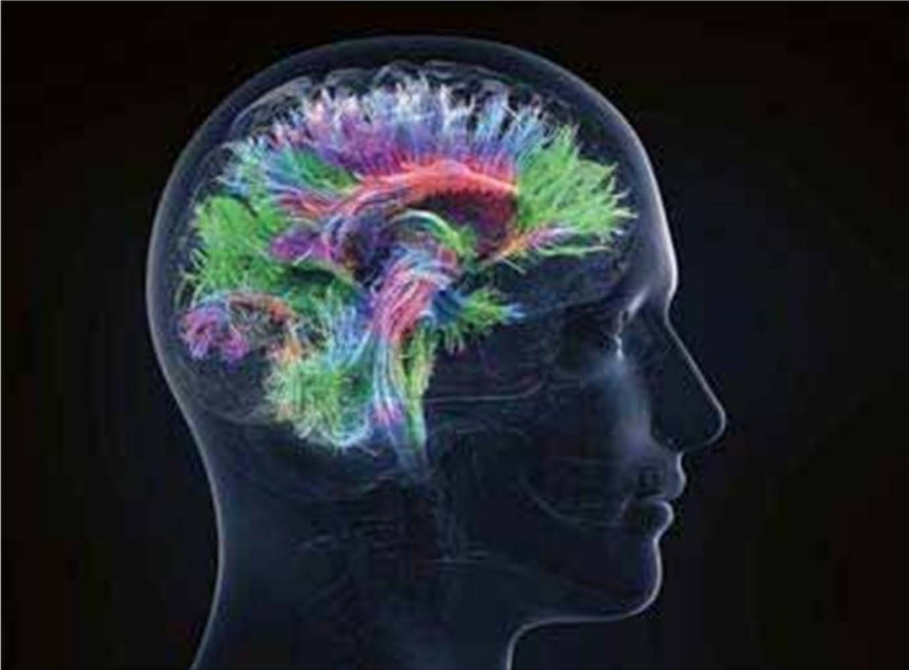

## ProudMum

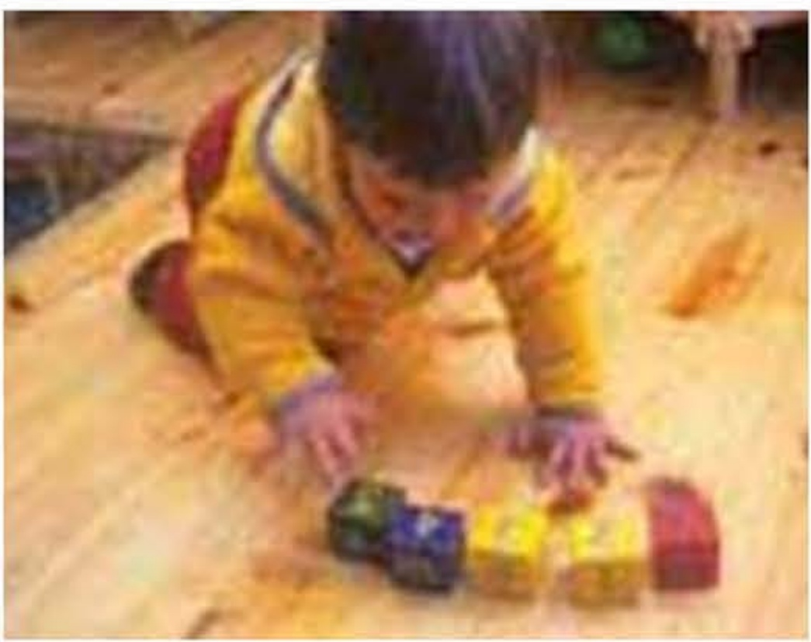

My son is a genius!

I gave Oscar five bricks and straightaway he did this! Is it too early to enrol him with MENSA?

What is the probability that Oscar chose the bricks at random and just happened by chance to get them in the right order?

There are two ways of looking at the situation. You can think of Oscar selecting the five bricks as five events, one after another. Alternatively, you

<!-- page 141 -->

can think of 1, 2, 3, 4, 5 as one outcome out of several possible outcomes and work out the probability that way.

## Five events

Look at the diagram.

### Figure 5.1

If Oscar had actually chosen them at random:

the probability of first selecting 1 is  $ \frac{1}{5} $

the probability of next selecting 2 is  $ \frac{1}{4} $

the probability of next selecting 3 is  $ \frac{1}{3} $

the probability of next selecting 4 is  $ \frac{1}{2} $

then only 5 remains so the probability of selecting it is 1.

So the probability of getting the correct numerical sequence at random is

 $$ \frac{1}{5}\times\frac{1}{4}\times\frac{1}{3}\times\frac{1}{2}\times1=\frac{1}{120}. $$ 

## Outcomes

How many ways are there of putting five bricks in a line?

To start with there are five bricks to choose from, so there are five ways of choosing brick 1. Then there are four bricks left and so there are four ways of choosing brick 2. And so on.

The total number of ways is

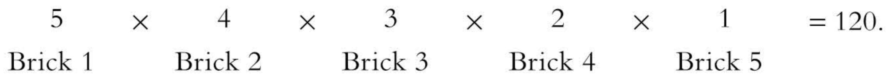

Only one of these is the order 1, 2, 3, 4, 5, so the probability of Oscar selecting it at random is  $ \frac{1}{120} $.

Number of possible outcomes.

Do you agree with Oscar's mother that he is a child prodigy, or do you think it was just by chance that he put the bricks down in the right order?

What further information would you want to be convinced that he is a budding genius?

<!-- page 142 -->

### 5.1 Factorials

In the last example you saw that the number of ways of placing five different bricks in a line is  $ 5 \times 4 \times 3 \times 2 \times 1 $. This number is called 5 factorial and is written 5!. You will often meet expressions of this form.

In general the number of ways of placing $n$ different objects in a line is $n!$, where $n! = n \times (n-1) \times (n-2) \times \ldots \times 3 \times 2 \times 1$.

$n$ must be a positive integer.

<table border=1 style='margin: auto; word-wrap: break-word;'><tr><td rowspan="6">Example 5.1</td><td style='text-align: center; word-wrap: break-word;'>Calculate 7!</td></tr><tr><td style='text-align: center; word-wrap: break-word;'>Solution</td></tr><tr><td style='text-align: center; word-wrap: break-word;'>7! =  $ 7 \times 6 \times 5 \times 4 \times 3 \times 2 \times 1 = 5040 $</td></tr><tr><td style='text-align: center; word-wrap: break-word;'>Some typical relationships between factorial numbers are illustrated below:</td></tr><tr><td style='text-align: center; word-wrap: break-word;'>10! =  $ 10 \times 9! $ or in general  $ n! = n \times [(n-1)!] $</td></tr><tr><td style='text-align: center; word-wrap: break-word;'>10! =  $ 10 \times 9 \times 8 \times 7! $ or in general  $ n! = n \times (n-1) \times (n-2) \times [(n-3)!] $ These are useful when simplifying expressions involving factorials.</td></tr><tr><td rowspan="3">Example 5.2</td><td style='text-align: center; word-wrap: break-word;'>Calculate  $ \frac{5!}{3!} $</td></tr><tr><td style='text-align: center; word-wrap: break-word;'>Solution</td></tr><tr><td style='text-align: center; word-wrap: break-word;'>$ \frac{5!}{3!} = \frac{5 \times 4 \times 3!}{3!} = 5 \times 4 = 20 $</td></tr><tr><td rowspan="3">Example 5.3</td><td style='text-align: center; word-wrap: break-word;'>Calculate  $ \frac{7! \times 5!}{3! \times 4!} $</td></tr><tr><td style='text-align: center; word-wrap: break-word;'>Solution</td></tr><tr><td style='text-align: center; word-wrap: break-word;'>$ \frac{7! \times 5!}{3! \times 4!} = \frac{7 \times 6 \times 5 \times 4 \times 3! \times 5 \times 4!}{3! \times 4!} = 7 \times 6 \times 5 \times 4 \times 5 = 4200 $</td></tr><tr><td rowspan="3">Example 5.4</td><td style='text-align: center; word-wrap: break-word;'>Write  $ 37 \times 36 \times 35 $ in terms of factorials only.</td></tr><tr><td style='text-align: center; word-wrap: break-word;'>Solution</td></tr><tr><td style='text-align: center; word-wrap: break-word;'>$ 37 \times 36 \times 35 = \frac{37 \times 36 \times 35 \times 34!}{34!} = \frac{37!}{34!} $</td></tr></table>

<!-- page 143 -->

(i) Find the number of ways in which all five letters in the word GREAT can be arranged.

(ii) In how many of these arrangements are the letters A and E next to each other?

## Solution

(i) There are five choices for the first letter (G, R, E, A or T). Then there are four choices for the next letter, then three for the third letter and so on. So the number of arrangements of the letters is

 $$ 5\times4\times3\times2\times1=5!=120 $$ 

(ii) The E and the A are to be together, so you can treat them as a single letter. So there are four choices for the first letter (G, R, EA or T), three choices for the next letter and so on.

So the number of arrangements of these four ‘letters’ is

 $$ 4\times3\times2\times1=4!=24 $$ 

However

is different from

So each of the 24 arrangements can be arranged into two different orders.

The total number of arrangements with the E and A next to each other is  $ 2 \times 4! = 48 $

## Note

The total number of ways of arranging the letters with the A and the E apart is  $ 120 - 48 = 72 $

Sometimes a question will ask you to deal with repeated letters.

### Example 5.6

Find the number of ways in which all five letters in the word GREET can be arranged.

## Solution

There are 5! = 120 arrangements of five letters.

However, G $ \underline{\text{REET}} $ has two repeated letters and so some of these arrangements are really the same.

For example,

is the same as

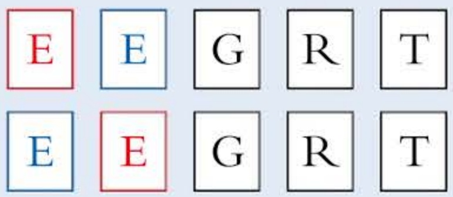

<!-- page 144 -->

The two Es can be arranged in 2!=2 ways, so the total number of arrangements is

 $$ \frac{5!}{2!}=60 $$ 

Example 5.7

How many different arrangements of the letters in the word MATHEMATICAL are there?

## Solution

There are 12 letters, so there are 12! = 479001600 arrangements.

However, there are repeated letters and so some of these arrangements are the same.

For example,

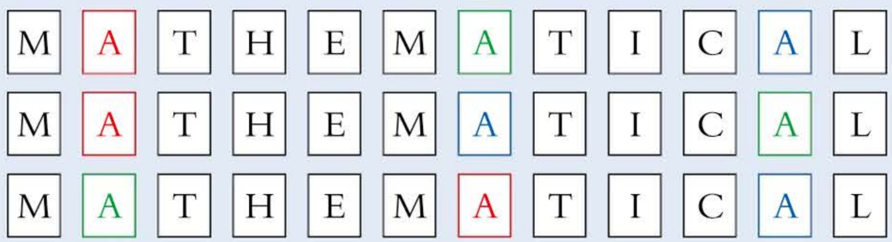

and

are the same.

In fact, there are 3! = 6 ways of arranging the As.

So the total number of arrangements of

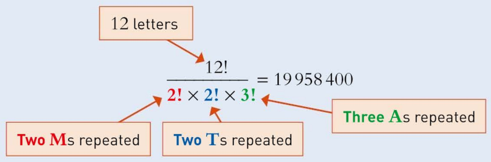

Example 5.7 illustrates how to deal with repeated objects. You can generalise from this example to obtain the following:

The number of distinct arrangements of $n$ objects in a line, of which $p$ are identical to each other, $q$ others are identical to each other, $r$ of a third type are identical, and so on is $\frac{n!}{p!a!r!}$

<!-- page 145 -->

1 Calculate (i) 8! (ii)  $ \frac{8!}{6!} $ (iii)  $ \frac{5! \times 6!}{7! \times 4!} $

2 Simplify (i)  $ \frac{(n-1)!}{n!} $ (ii)  $ \frac{(n-1)!}{(n-2)!} $

3 Simplify (i)  $ \frac{(n+3)!}{(n+1)!} $ (ii)  $ \frac{n!}{(n-2)!} $

4 Write in factorial notation.

## PS

 $$ \frac{8\times7\times6}{5\times4\times3} $$ 

## PS

 $$ \frac{15\times16}{4\times3\times2} $$ 

## PS

(iii)  $ \frac{(n+1)n(n-1)}{4\times3\times2} $

5 Factorise (i) 7! + 8!

(ii) n! + (n + 1)!

6 How many different four-letter words can be formed from the letters A, B, C and D if letters cannot be repeated? (The words do not need to mean anything.)

7 How many different ways can eight books be arranged in a row on a shelf?

8 In a motoring rally there are six drivers. How many different ways are there for the six drivers to finish?

9 In a 60-metre hurdles race there are five runners, one from each of the nations Austria, Belgium, Canada, Denmark and England.

(i) How many different finishing orders are there?

(ii) What is the probability of predicting the finishing order by choosing first, second, third, fourth and fifth at random?

10 Chenglei has an MP3 player which can play tracks in ‘shuffle’ mode. If an album is played in ‘shuffle’ mode the tracks are selected in a random order with a different track selected each time until all the tracks have been played.

Chenglei plays a 14-track album in 'shuffle' mode.

(i) In how many different orders could the tracks be played?

(ii) What is the probability that 'shuffle' mode will play the tracks in the normal set order listed on the album?

11 In a 'Goal of the season' competition, participants are asked to rank ten goals in order of quality.

The organisers select their ‘correct’ order at random. Anybody who matches their order will be invited to join the television commentary team for the next international match.

(i) What is the probability of a participant's order being the same as that of the organisers?

(ii) Five million people enter the competition. How many people would be expected to join the commentary team?

12 The letters O, P, S and T are placed in a line at random. What is the probability that they form a word in the English language?

<!-- page 146 -->

PS

13 Find how many arrangements there are of the letters in each of these words.

(i) EXAM (ii) MATHS (iii) CAMBRIDGE

(iv) PASS (v) SUCCESS (vi) STATISTICS

PS

14 How many arrangements of the word ACHIEVE are there if:

(i) there are no restrictions on the order the letters are to be in

(ii) the first letter is an A

(iii) the letters A and I are to be together

(iv) the letters C and H are to be apart?

INVESTIGATIONS

1 Solve the inequality $n! > 10^{m}$ for each of the cases $m = 3, 4, 5$.

2 In how many ways can you write 42 using factorials only?

3 (i) There are 4! ways of placing the four letters S, T, A, R in a line, if each of them must appear exactly once. How many ways are there if each letter may appear any number of times (i.e. between 0 and 4)? Formulate a general rule.

(ii) There are 4! ways of placing the letters S, T, A, R in line. How many ways are there of placing in line the letters:

(a) S, T, A, A (b) S, T, T, T?

Formulate a general rule for dealing with repeated letters.

### 5.2 Permutations

I should be one of the judges! When I heard the 16 songs in the competition, I knew which ones I thought were the best three. Last night they announced the results and I had picked the same three songs in the same order as the judges!

What is the probability of Joyeeta's result?

The winner can be chosen in 16 ways.

The second song can be chosen in 15 ways.

The third song can be chosen in 14 ways.

Thus the total number of ways of placing three songs in the first three positions is  $ 16 \times 15 \times 14 = 3360 $. So the probability that Joyeeta's selection is correct is  $ \frac{1}{3360} $.

In this example attention is given to the order in which the songs are placed. The solution required a  $ \underline{\text{permutation}} $ of three objects from sixteen.

In general the number of permutations,  $ ^{n}P_{r} $, of r objects from n is given by

 $$ {}^{n}\mathrm{P}_{r}=n\times(n-1)\times(n-2)\times\ldots\times(n-r+1). $$ 

This can be written more compactly as

 $$ \幣 \quad{}^{n}P_{r}\;=\;\frac{n!}{(n-r)!} $$

<!-- page 147 -->

Six people go to the cinema. They sit in a row with ten seats. Find how many ways can this be done if:

(i) they can sit anywhere

(ii) all the empty seats are next to each other.

## Solution

(i) The first person to sit down has a choice of ten seats.
The second person to sit down has a choice of nine seats.
The third person to sit down has a choice of eight seats.
The sixth person to sit down has a choice of five seats.
So the total number of arrangements is  $ 10 \times 9 \times 8 \times 7 \times 6 \times 5 = 151200 $. This is a permutation of six objects from ten, so a quicker way to work this out is
number of arrangements =  $ ^{10}P_{6} = 151200 $
(ii) Since all four empty seats are to be together you can consider them to be a single ‘empty seat’, albeit a large one!
So there are seven seats to seat six people.
So the number of arrangements is  $ ^{7}P_{6} = 5040 $

### 5.3 Combinations

It is often the case that you are not concerned with the order in which items are chosen, only with which ones are picked.

A maths teacher is playing a game with her students. Each student selects six numbers out of a possible 49 (numbers 1, 2, ..., 49). The maths teacher then uses a random number machine to generate six numbers. If a student's numbers match the teacher's numbers then they win a prize.

You have the six winning numbers. Does it matter in which order the machine picked them?

The teacher says that the probability of an individual student picking the winning numbers is about 1 in 14 million. How can you work out this figure?

The key question is, how many ways are there of choosing six numbers out of 49?

If the order mattered, the answer would be  $ ^{49}\mathrm{P}_{6} $, or  $ 49 \times 48 \times 47 \times 46 \times 45 \times 44 $.

However, the order does not matter. The selection 1, 3, 15, 19, 31 and 48 is the same as 15, 48, 31, 1, 19, 3 and as 3, 19, 48, 1, 15, 31, and lots more. For

<!-- page 148 -->

each set of six numbers there are 6! arrangements that all count as being the same.

So, the number of ways of selecting six numbers, given that the order does not matter, is

 $$ \frac{49\times48\times47\times46\times45\times44}{6!}\cdot\frac{49P_{6}}{6!} $$ 

This is called the number of combinations of 6 objects from 49 and is denoted by  $ {}^{49}C_{6} $.

▶ Show that  $ ^{49}\mathrm{C}_{6} $ can be written as  $ \frac{49!}{6!\times43!} $.

Returning to the maths teacher's game, it follows that the probability of a student winning is  $ \frac{1}{49C_{6}} $.

▶ Check that this is about 1 in 14 million.

This example shows a general result, that the number of ways of selecting r objects from n, when the order does not matter, is given by

 $$ ^{n}\mathrm{C}_{r}=\frac{n!}{r!(n-r)!}=\frac{^{n}\mathrm{P}_{r}}{r!} $$ 

How can you prove this general result?

Another common notation for $^{n}\mathrm{C}_{r}$ is $\binom{n}{r}$. Both notations are used in this book to help you become familiar with both of them.

The notation  $ \binom{n}{r} $ looks exactly like a column vector and so there is the possibility of confusing the two. However, the context should usually make the meaning clear.

### Example 5.9

A School Governors' committee of five people is to be chosen from eight applicants. How many different selections are possible?

Solution

Number of selections =  $ \binom{8}{5} = \frac{8!}{5! \times 3!} = \frac{8 \times 7 \times 6}{3 \times 2 \times 1} = 56 $

<!-- page 149 -->

In how many ways can a committee of four people be selected from four applicants?

## Solution

Common sense tells us that there is only one way to make the committee, that is by appointing all applicants. So  $ ^{4} $C $ _{4} $ = 1. However, if we work from the formula

 $$ {}^{4}C_{4}\;=\;\frac{4!}{4!\times0!}\;=\;\frac{1}{0!} $$ 

For this to equal 1 requires the convention that 0! is taken to be 1.

Use the convention 0!=1 to show that  $ ^{n}C_{0}=^{n}C_{n}=1 $ for all values of n.

### 5.4 The binomial coefficients

In the last section you met numbers of the form  $ ^{n}C_{r} $ or  $ \binom{n}{r} $. These are called the binomial coefficients; the reason for this is explained in Appendix 3 at www.hoddereducation.com/cambridgeextras and in the next chapter.

### ACTIVITY 5.1

Use the formula  $ \binom{n}{r} = \frac{n!}{r!(n-r)!} $ and the results  $ \binom{n}{0} = \binom{n}{n} = 1 $ to check that the entries in this table, for n = 6 and 7, are correct.

<table border=1 style='margin: auto; word-wrap: break-word;'><tr><td style='text-align: center; word-wrap: break-word;'>r</td><td style='text-align: center; word-wrap: break-word;'>0</td><td style='text-align: center; word-wrap: break-word;'>1</td><td style='text-align: center; word-wrap: break-word;'>2</td><td style='text-align: center; word-wrap: break-word;'>3</td><td style='text-align: center; word-wrap: break-word;'>4</td><td style='text-align: center; word-wrap: break-word;'>5</td><td style='text-align: center; word-wrap: break-word;'>6</td><td style='text-align: center; word-wrap: break-word;'>7</td></tr><tr><td style='text-align: center; word-wrap: break-word;'>n = 6</td><td style='text-align: center; word-wrap: break-word;'>1</td><td style='text-align: center; word-wrap: break-word;'>6</td><td style='text-align: center; word-wrap: break-word;'>15</td><td style='text-align: center; word-wrap: break-word;'>20</td><td style='text-align: center; word-wrap: break-word;'>15</td><td style='text-align: center; word-wrap: break-word;'>6</td><td style='text-align: center; word-wrap: break-word;'>1</td><td style='text-align: center; word-wrap: break-word;'>-</td></tr><tr><td style='text-align: center; word-wrap: break-word;'>n = 7</td><td style='text-align: center; word-wrap: break-word;'>1</td><td style='text-align: center; word-wrap: break-word;'>7</td><td style='text-align: center; word-wrap: break-word;'>21</td><td style='text-align: center; word-wrap: break-word;'>35</td><td style='text-align: center; word-wrap: break-word;'>35</td><td style='text-align: center; word-wrap: break-word;'>21</td><td style='text-align: center; word-wrap: break-word;'>7</td><td style='text-align: center; word-wrap: break-word;'>1</td></tr></table>

It is very common to present values of  $ ^{n}C_{r} $ in a table shaped like an isosceles triangle, known as Pascal's triangle.

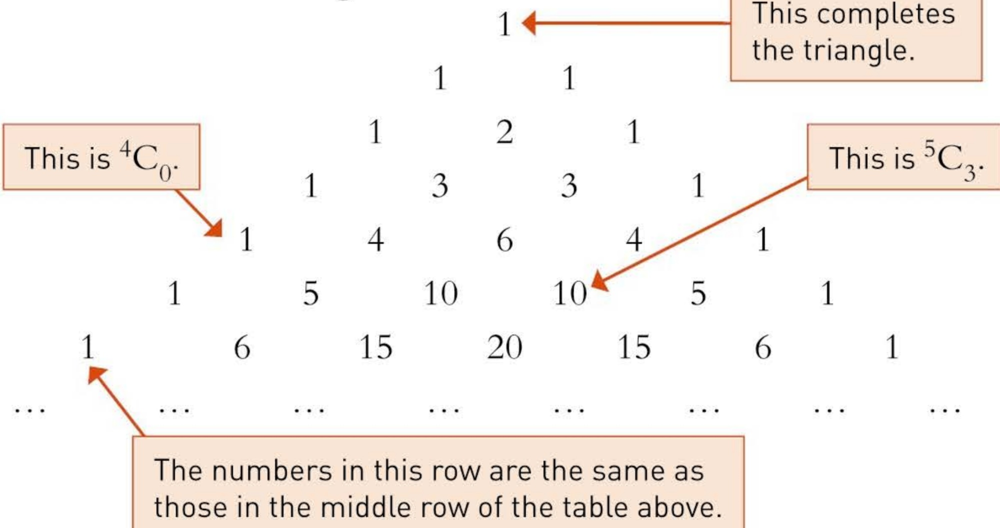

Pascal's triangle makes it easy to see two important properties of binomial coefficients.

<!-- page 150 -->

## 1 Symmetry:  $ ^{n}C_{r} = ^{n}C_{n-r} $

If you are choosing 11 players from a pool of 15 possible players you can either name the 11 you have selected or name the 4 you have rejected. Similarly, every choice of $r$ objects included in a selection from $n$ distinct objects corresponds to a choice of $(n-r)$ objects which are excluded. Therefore $^{n}C_{r} = ^{n}C_{n-r}$.

This provides a short cut in calculations when r is large. For example

 $$ ^{100}C_{96}={}^{100}C_{4}=\frac{100\times99\times98\times97}{1\times2\times3\times4}=3921225. $$ 

It also shows that the list of values of $^{n}C_{r}$ for any particular value of $n$ is unchanged by being reversed. For example, when $n=6$ the list is the seven numbers 1, 6, 15, 20, 15, 6, 1.

## 2 Addition:  $ ^{n+1}C_{r+1} = ^{n}C_{r} + ^{n}C_{r+1} $

Look at the entry 15 in the bottom row of Pascal's triangle, towards the right. The two entries above and either side of it are 10 and 5,

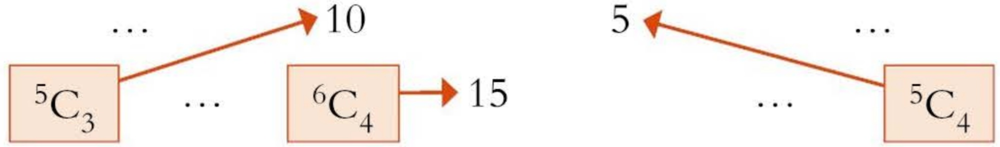

and 15 = 10 + 5. In this case  $ ^{6}C_{4} = ^{5}C_{3} + ^{5}C_{4} $. This is an example of the general result that  $ ^{n+1}C_{r+1} = ^{n}C_{r} + ^{n}C_{r+1} $. Check that all the entries in Pascal's triangle (except the 1s) are found in this way.

This can be used to build up a table of values of  $ ^{n}C_{r} $ without much calculation. If you know all the values of  $ ^{n}C_{r} $ for any particular value of n you can add pairs of values to obtain all the values of  $ ^{n+1}C_{r} $, i.e. the next row, except the first and last, which always equal 1.

### 5.5 Using binomial coefficients to calculate probabilities

### Example 5.11

A committee of 5 is to be chosen from a list of 14 people, 6 of whom are men and 8 women. Their names are to be put in a hat and then 5 drawn out.

What is the probability that this procedure produces a committee with no women?

## Solution

The probability of an all-male committee of 5 people is given by

There are 6 men.

the number of ways of choosing 5 people out of 6 the number of ways of choosing 5 people out of 14

 $$ \frac{6}{14}=\frac{^{6}C_{5}}{^{14}C_{5}}=\frac{6}{2002} $$ 

There are 14 people.

<!-- page 151 -->

# GoByBus News

## Help decide our new bus routes

The exact route for our new bus service is to be announced in April. Rest assured our service will run from Amli to Chatra via Bawal and will be extended to include Dhar once our new fleet of buses arrives in September. As local people know, there are several roads connecting these towns and we are keen to hear the views as to the most useful routes from our future passengers. Please post your views below!

This consultation is a farce.The chance of getting a route that suits me is less than one in a hundred :(

Is RChowdhry right? How many routes are there from Amli to Dhar? Start by looking at the first two legs, Amli to Bawal and Bawal to Chatra.

There are three roads from Amli to Bawal and two roads from Bawal to Chatra. How many routes are there from Amli to Chatra passing through Bawal on the way?

Look at Figure 5.2.

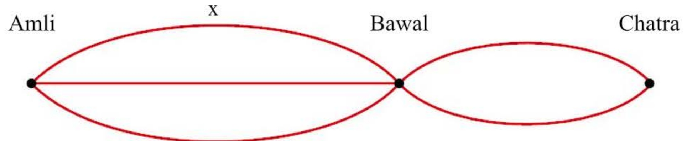

### Figure 5.2

The answer is  $ 3 \times 2 = 6 $ because there are three ways of doing the first leg, followed by two for the second leg. The six routes are

 $$ x-u\quad 傢gamma-u\quad 傢gamma-u $$ 

 $$ x-\nu\qquad\quad\gamma-\nu\qquad\quad z-\nu. $$ 

There are also four roads from Chatra to Dhar. So each of the six routes from Amli to Chatra has four possible ways of going on to Dhar. There are now  $ 6 \times 4 = 24 $ routes. See Figure 5.3.

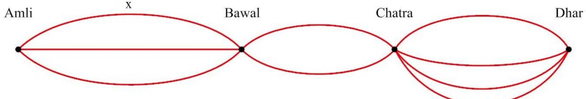

Figure 5.3

<!-- page 152 -->

They can be listed systematically as follows:

x - u - p     \gamma - u - p     z - u - p     x - v - p     \gamma - v - p     z - v - p
x - u - q ..... ..... ..... ..... ..... .....
x - u - r ..... ..... ..... ..... ..... .....
x - u - s ..... ..... ..... ..... ..... ..... .....
..... ..... ..... ..... ..... ..... .....

In general, if there are $a$ outcomes from experiment $A$, $b$ outcomes from experiment $B$ and $c$ outcomes from experiment $C$ then there are $a \times b \times c$ different possible combined outcomes from the three experiments.

If GoByBus chooses its route at random, what is the probability that it will be the one RChowdhry wants? Is the comment justified?

In this example the probability was worked out by finding the number of possible routes. How else could it have been worked out?

### Example 5.12

The manager of Avonford football squad wants to take a photo of the 13 players for the club magazine. She seats 6 players in the back row, then 5 best players in the middle row with the captain in the centre, and the 2 youngest players in the front row.

How many different ways can the players be organised for the photo?

Solution

The captain is sitting in the centre, so there are just 4 other players to seat in the middle row.

There are 6! = 720 ways of arranging the 6 players in the back row.

There are 4! = 24 ways of arranging the players in the middle row.

There are 2! = 2 ways of seating the youngest players.

So altogether there are  $ 6! \times 4! \times 2! = 720 \times 24 \times 2 $

= 34560 different ways to seat the players

### Example 5.13

A cricket team consisting of 6 batsmen, 4 bowlers and 1 wicket-keeper is to be selected from a group of 18 cricketers comprising 9 batsmen, 7 bowlers and 2 wicket-keepers. How many different teams can be selected?

## Solution

The batsmen can be selected in  $ {}^{9}C_{6} $ ways.

The bowlers can be selected in  $ {}^{7}C_{4} $ ways.

The wicket-keepers can be selected in  $ {}^{2}C_{1} $ ways.

<!-- page 153 -->

$$ \begin{aligned}Therefore~total~number~of~teams&=^{9}C_{6}\times^{7}C_{4}\times^{2}C_{1}\\&=\frac{9!}{3!\times6!}\times\frac{7!}{3!\times4!}\times\frac{2!}{1!\times1!}\\&=\frac{9\times8\times7}{3\times2\times1}\times\frac{7\times6\times5}{3\times2\times1}\times2\\&=5880\end{aligned} $$ 

Example 5.14

In a dance competition, the panel of ten judges sit on the same side of a long table. There are three female judges.

(i) How many different arrangements are there for seating the ten judges?

(ii) How many different arrangements are there if the three female judges all decide to sit together?

(iii) If the seating is at random, find the probability that the three female judges will not all sit together.

(iv) Four of the judges are selected at random to judge the final round of the competition. Find the probability that this final judging panel consists of two men and two women.

## Solution

(i) There are 10! = 3 628 800 ways of arranging the judges in a line.

(ii) If the three female judges sit together then you can treat them as a single judge.

So there are eight judges and there are 8! = 40 320 ways of arranging the judges in a line.

However, there are 3! = 6 ways of arranging the female judges.

So there are  $ 3! \times 8! = 241920 $ ways of arranging the judges so that all the female judges are together.

(iii) There are 3 628 800 - 241 920 = 3 386 880 ways of arranging the judges so that the female judges do not all sit together.

So the probability that the female judges do not all sit together is

 $$ \frac{3\;386\;880}{3\;628\;800}\;=\;0.933\quad(\mathrm{t o}\;3\;\mathrm{s.f.}). $$ 

(iv) The probability of selecting two men and two women on the panel of four is

 $$ \begin{aligned}\frac{^{3}C_{2}\times^{7}C_{2}}{^{10}C_{4}}&=\frac{3!}{1!\times2!}\times\frac{7!}{5!\times2!}\div\frac{10!}{6!\times4!}\\&=3\times21\div210\\&=0.3\end{aligned} $$

<!-- page 154 -->

1 (i) Find the values of (a)  $ ^{6}\text{P}_{2} $ (b)  $ ^{8}\text{P}_{4} $ (c)  $ ^{10}\text{P}_{4} $.

(ii) Find the values of (a)  $ ^{6}C_{2} $ (b)  $ ^{8}C_{4} $

## PS

(iii) Show that, for the values of n and r in parts (i) and (ii),

## PS

 $$ {}^{n}\mathrm{C}_{r}\;=\;\frac{n\mathrm{P}_{r}}{r!}. $$ 

3 A group of 5 computer programmers is to be chosen to form the night shift from a set of 14 programmers. In how many ways can the programmers be chosen if the 5 chosen must include the shift-leader who is one of the 14?

2 There are 15 runners in a camel race. What is the probability of correctly guessing the first three finishers in their finishing order?

## PS

4 My brother Mark decides to put together a rock band from amongst his year at school. He wants a lead singer, a guitarist, a keyboard player and a drummer. He invites applications and gets 7 singers, 5 guitarists, 4 keyboard players and 2 drummers. Assuming each person applies only once, in how many ways can Mark put the group together?

5 A touring party of cricket players is made up of 5 players from each of India, Pakistan and Sri Lanka and 3 from Bangladesh.

(i) How many different selections of 11 players can be made for a team?

(ii) In one match, it is decided to have 3 players from each of India, Pakistan and Sri Lanka and 2 from Bangladesh. How many different team selections can now be made?

6 A committee of four is to be selected from ten candidates, six men and four women.

(i) In how many distinct ways can the committee be chosen?

(ii) Assuming that each candidate is equally likely to be selected, determine the probabilities that the chosen committee contains:

## PS

(a) no women

(b) two men and two women.

7 A committee of four is to be selected from five boys and four girls. The members are selected at random.

(i) How many different selections are possible?

(ii) What is the probability that the committee will be made up of:

(a) all girls

(b) more boys than girls?

<!-- page 155 -->

## PS

8 Baby Imran has a set of alphabet blocks. His mother often uses the blocks I, M, R, A and N to spell Imran's name.

(i) One day she leaves him playing with these five blocks. When she comes back into the room Imran has placed them in the correct order to spell his name. What is the probability of Imran placing the blocks in this order? (He is only 18 months old so he certainly cannot spell!)

(ii) A couple of days later she leaves Imran playing with all 26 of the alphabet blocks. When she comes back into the room she again sees that he has placed the five blocks I, M, R, A and N in the correct order to spell his name. What is the probability of him choosing the five correct blocks and placing them in this order?

9 (a) A football team consists of 3 players who play in a defence position, 3 players who play in a midfield position and 5 players who play in a forward position. Three players are chosen to collect a gold medal for the team. Find in how many ways this can be done

(i) if the captain, who is a midfield player, must be included, together with one defence and one forward player,

(ii) if exactly one forward player must be included, together with any two others.

(b) Find how many different arrangements there are of the nine letters in the words GOLD MEDAL

(i) if there are no restrictions on the order of the letters,

(ii) if the two letters D come first and the two letters L come last.

Cambridge International AS & A Level Mathematics

9709 Paper 6 Q7 June 2005

10 (a) Find how many different numbers can be made by arranging all nine digits of the number 223677888 if:

(i) there are no restrictions

(ii) the number made is an even number.

(b) Sandra wishes to buy some applications (apps) for her smartphone but she only has enough money for 5 apps in total. There are 3 train apps, 6 social network apps and 14 games apps available. Sandra wants to have at least 1 of each type of app. Find the number of different possible selections of 5 apps that Sandra can choose.

Cambridge International AS & A Level Mathematics

9709 Paper 61 Q7 June 2015

<!-- page 156 -->

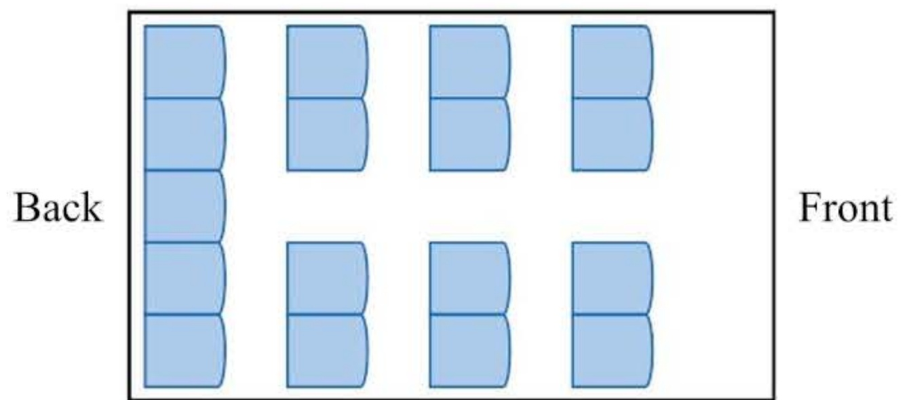

The diagram shows the seating plan for passengers in a minibus, which has 17 seats arranged in 4 rows. The back row has 5 seats and the other 3 rows have 2 seats on each side. 11 passengers get on the minibus.

(i) How many possible seating arrangements are there for the 11 passengers?

(ii) How many possible seating arrangements are there if 5 particular people sit in the back row?

Of the 11 passengers, 5 are unmarried and the other 6 consist of 3 married couples.

(iii) In how many ways can 5 of the 11 passengers on the bus be chosen if there must be 2 married couples and 1 other person, who may or may not be married?

Cambridge International AS & A Level Mathematics

9709 Paper 6 Q4 June 2006

12 Issam has 11 different CDs, of which 6 are pop music, 3 are jazz and 2 are classical.

(i) How many different arrangements of all 11 CDs on a shelf are there if the jazz CDs are all next to each other?

(ii) Issam makes a selection of 2 pop music CDs, 2 jazz CDs and 1 classical CD. How many different possible selections can be made?

Cambridge International AS & A Level Mathematics

9709 Paper 6 Q3 June 2008

13 A choir consists of 13 sopranois, 12 altos, 6 tenors and 7 basses. A group consisting of 10 sopranois, 9 altos, 4 tenors and 4 basses is to be chosen from the choir.

(i) In how many different ways can the group be chosen?

(ii) In how many ways can the 10 chosen sopranos be arranged in a line if the 6 tallest stand next to each other?

(iii) The 4 tenors and the 4 basses in the group stand in a single line with all the tenors next to each other and all the basses next to each other. How many possible arrangements are there if three of the tenors refuse to stand next to any of the basses?

Cambridge International AS & A Level Mathematics

9709 Paper 6 Q4 June 2009

<!-- page 157 -->

14 A staff car park at a school has 13 parking spaces in a row. There are 9 cars to be parked.

(i) How many different arrangements are there for parking the 9 cars and leaving 4 empty spaces?

(ii) How many different arrangements are there if the 4 empty spaces are next to each other?

(iii) If the parking is random, find the probability that there will not be 4 empty spaces next to each other.

Cambridge International AS & A Level Mathematics

9709 Paper 6 Q3 November 2005

15 A builder is planning to build 12 houses along one side of a road. He will build 2 houses in style A, 2 houses in style B, 3 houses in style C, 4 houses in style D and 1 house in style E.

(i) Find the number of possible arrangements of these 12 houses.

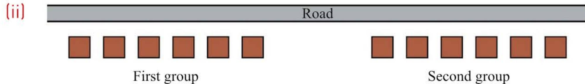

The 12 houses will be in two groups of 6 (see diagram). Find the number of possible arrangements if all the houses in styles A and D are in the first group and all the houses in styles B, C and E are in the second group.

(iii) Four of the 12 houses will be selected for a survey. Exactly one house must be in style B and exactly one house in style C. Find the number of ways in which these four houses can be selected.

Cambridge International AS & A Level Mathematics

9709 Paper 6 Q4 November 2008

16 (a) Find how many numbers between 5000 and 6000 can be formed from the digits 1, 2, 3, 4, 5 and 6

(i) if no digits are repeated

(ii) if repeated digits are allowed.

(b) Find the number of ways of choosing a school team of 5 pupils from 6 boys and 8 girls

(i) if there are more girls than boys in the team

(ii) if three of the boys are cousins and are either all in the team or all not in the team.

Cambridge International AS & A Level Mathematics

9709 Paper 61 Q5 November 2009

<!-- page 158 -->

## KEY POINTS

The number of ways of arranging $n$ unlike objects in a line is $n!$

2  $ n! = n \times (n - 1) \times (n - 2) \times (n - 3) \times \ldots \times 3 \times 2 \times 1. $

3 The number of distinct arrangements of $n$ objects in a line, of which $p$ are identical to each other, $q$ others are identical to each other, $r$ of a third type are identical, and so on is

 $$ \frac{n!}{p!q!r!\cdots}. $$ 

4 The number of permutations of $r$ objects from $n$ is

 $$ {}^{n}\mathrm{P}_{r}~=~\frac{n!}{(n-r)!}. $$ 

5 The number of combinations of r objects from n is

 $$ ^{n}\mathrm{C}_{r}\:=\frac{n!}{(n-r)!r!}. $$ 

This may also be written as  $ \binom{n}{r} $.

6 For permutations the order matters. For combinations it does not.

7 By convention 0!=1.

## LEARNING OUTCOMES

Now that you have finished this chapter, you should be able to

understand the terms:

factorial

permutation

combination

solve problems involving arrangements where there are:

restrictions (e.g. X must not be next to Y)

repetitions (e.g. arrange letters in the word POOL)

solve problems involving selections where:

order matters (permutations)

order doesn't matter (combinations)

■ groupings (e.g. people sitting in rows)

understand the difference between permutations and combinations

use permutations and combinations to evaluate probabilities.

