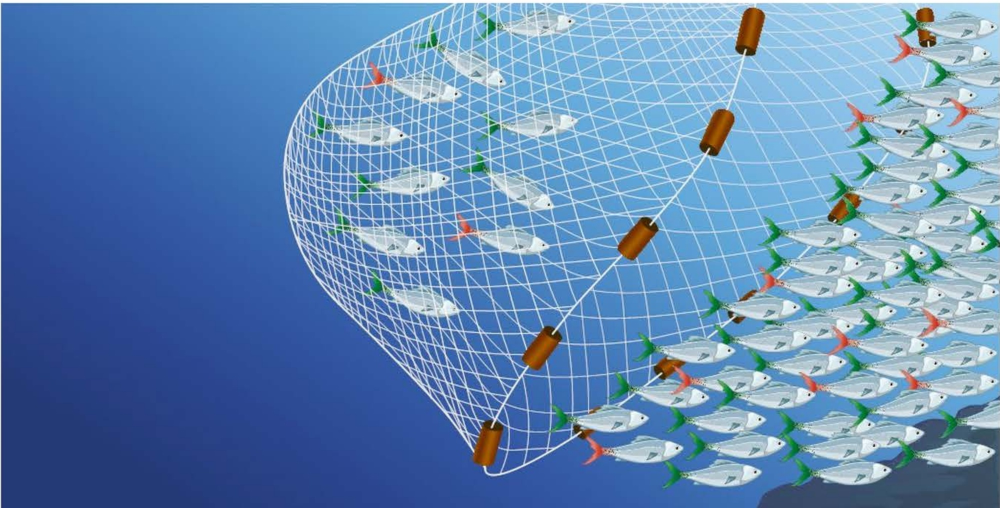
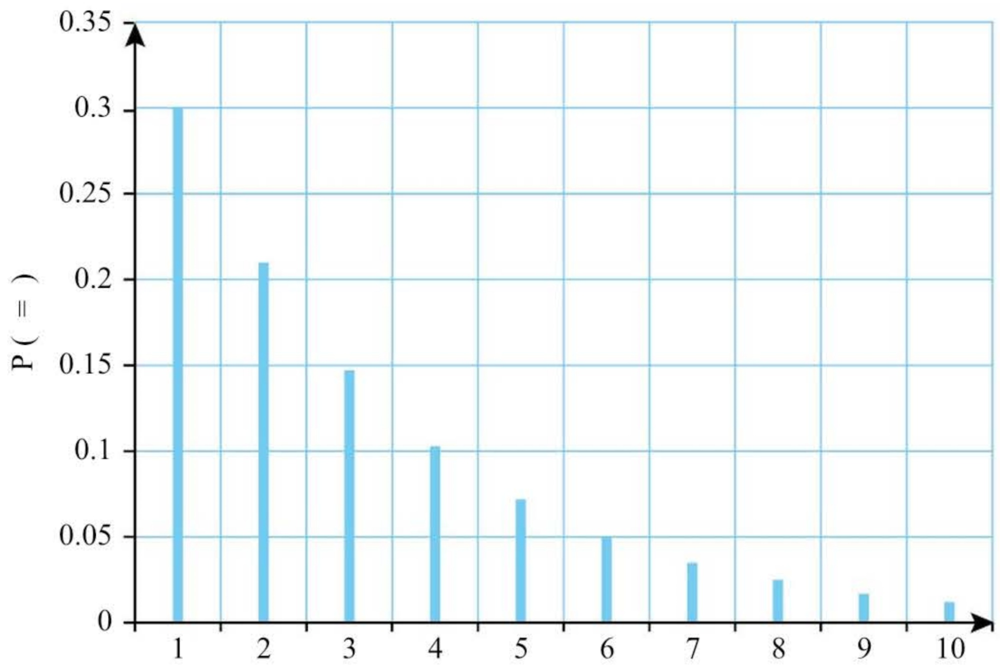

# Discrete probability distributions

<!-- Cambridge International AS  A Level Mathematics Probability  Statistics 1 (Sophie Goldie) .pdf p159-177 -->

<!-- page 159 -->

## Discrete probability distributions

To be or not to be, that is the question. William Shakespeare, Hamlet (1564-1616)

## Innovation Stars – Blog

## Samantha's great invention

Entrepreneur Samantha Weeks has done more than her bit to protect the environment. She has invented the first full spectrum LED bulb to operate on stored solar energy.

Now Samantha is out to prove that she is not only a clever scientist but a smart business woman as well. For Samantha is setting up her own factory to make and sell her bulbs.

Samantha admits there are still some technical problems ...

Samantha Weeks hopes to make a big success of her light industry

Samantha's production process is not very good and there is a probability of 0.1 that any bulb will be substandard and so not last as long as it should.

She decides to sell her bulbs in packs of three. She believes that if one bulb in a pack is substandard the customers will not complain but that if two or more are substandard they will do so. She also believes that complaints should be kept down to no more than 2.5% of customers.

<!-- page 160 -->

## Does Samantha meet her target?

Imagine a pack of Samantha's bulbs. There are eight different ways that good (G) and substandard (S) bulbs can be arranged in Samantha's packs, each with its associated probability.

<table border=1 style='margin: auto; word-wrap: break-word;'><tr><td style='text-align: center; word-wrap: break-word;'>Arrangement</td><td style='text-align: center; word-wrap: break-word;'>Probability</td><td style='text-align: center; word-wrap: break-word;'>Good</td><td style='text-align: center; word-wrap: break-word;'>Substandard</td></tr><tr><td style='text-align: center; word-wrap: break-word;'>G G G</td><td style='text-align: center; word-wrap: break-word;'>$ 0.9 \times 0.9 \times 0.9 = 0.729 $</td><td style='text-align: center; word-wrap: break-word;'>3</td><td style='text-align: center; word-wrap: break-word;'>0</td></tr><tr><td style='text-align: center; word-wrap: break-word;'>G G S</td><td style='text-align: center; word-wrap: break-word;'>$ 0.9 \times 0.9 \times 0.1 = 0.081 $</td><td style='text-align: center; word-wrap: break-word;'>2</td><td style='text-align: center; word-wrap: break-word;'>1</td></tr><tr><td style='text-align: center; word-wrap: break-word;'>G S G</td><td style='text-align: center; word-wrap: break-word;'>$ 0.9 \times 0.1 \times 0.9 = 0.081 $</td><td style='text-align: center; word-wrap: break-word;'>2</td><td style='text-align: center; word-wrap: break-word;'>1</td></tr><tr><td style='text-align: center; word-wrap: break-word;'>S G G</td><td style='text-align: center; word-wrap: break-word;'>$ 0.1 \times 0.9 \times 0.9 = 0.081 $</td><td style='text-align: center; word-wrap: break-word;'>2</td><td style='text-align: center; word-wrap: break-word;'>1</td></tr><tr><td style='text-align: center; word-wrap: break-word;'>G S S</td><td style='text-align: center; word-wrap: break-word;'>$ 0.9 \times 0.1 \times 0.1 = 0.009 $</td><td style='text-align: center; word-wrap: break-word;'>1</td><td style='text-align: center; word-wrap: break-word;'>2</td></tr><tr><td style='text-align: center; word-wrap: break-word;'>S G S</td><td style='text-align: center; word-wrap: break-word;'>$ 0.1 \times 0.9 \times 0.1 = 0.009 $</td><td style='text-align: center; word-wrap: break-word;'>1</td><td style='text-align: center; word-wrap: break-word;'>2</td></tr><tr><td style='text-align: center; word-wrap: break-word;'>S S G</td><td style='text-align: center; word-wrap: break-word;'>$ 0.1 \times 0.1 \times 0.9 = 0.009 $</td><td style='text-align: center; word-wrap: break-word;'>1</td><td style='text-align: center; word-wrap: break-word;'>2</td></tr><tr><td style='text-align: center; word-wrap: break-word;'>S S S</td><td style='text-align: center; word-wrap: break-word;'>$ 0.1 \times 0.1 \times 0.1 = 0.001 $</td><td style='text-align: center; word-wrap: break-word;'>0</td><td style='text-align: center; word-wrap: break-word;'>3</td></tr></table>

Putting these results together gives this table.

<table border=1 style='margin: auto; word-wrap: break-word;'><tr><td style='text-align: center; word-wrap: break-word;'>Good</td><td style='text-align: center; word-wrap: break-word;'>Substandard</td><td style='text-align: center; word-wrap: break-word;'>Probability</td></tr><tr><td style='text-align: center; word-wrap: break-word;'>3</td><td style='text-align: center; word-wrap: break-word;'>0</td><td style='text-align: center; word-wrap: break-word;'>0.729</td></tr><tr><td style='text-align: center; word-wrap: break-word;'>2</td><td style='text-align: center; word-wrap: break-word;'>1</td><td style='text-align: center; word-wrap: break-word;'>0.243</td></tr><tr><td style='text-align: center; word-wrap: break-word;'>1</td><td style='text-align: center; word-wrap: break-word;'>2</td><td style='text-align: center; word-wrap: break-word;'>0.027</td></tr><tr><td style='text-align: center; word-wrap: break-word;'>0</td><td style='text-align: center; word-wrap: break-word;'>3</td><td style='text-align: center; word-wrap: break-word;'>0.001</td></tr></table>

So the probability of more than one substandard bulb in a pack is

 $$ 0.027+0.001=0.028or2.8\%. $$ 

This is slightly more than the 2.5% that Samantha regards as acceptable.

What business advice would you give Samantha?

In this example we wrote down all the possible outcomes and found their probabilities one at a time. Even with just three bulbs this was repetitive. If Samantha had packed her bulbs in boxes of six it would have taken 64 lines to list them all. Clearly you need a more efficient approach.

You will have noticed that in the case of two good bulbs and one substandard, the probability is the same for each of the three arrangements in the box.

<table border=1 style='margin: auto; word-wrap: break-word;'><tr><td style='text-align: center; word-wrap: break-word;'>Arrangement</td><td style='text-align: center; word-wrap: break-word;'>Probability</td><td style='text-align: center; word-wrap: break-word;'>Good</td><td style='text-align: center; word-wrap: break-word;'>Substandard</td></tr><tr><td style='text-align: center; word-wrap: break-word;'>G G S</td><td style='text-align: center; word-wrap: break-word;'>$ 0.9 \times 0.9 \times 0.1 = 0.081 $</td><td style='text-align: center; word-wrap: break-word;'>2</td><td style='text-align: center; word-wrap: break-word;'>1</td></tr><tr><td style='text-align: center; word-wrap: break-word;'>G S G</td><td style='text-align: center; word-wrap: break-word;'>$ 0.9 \times 0.1 \times 0.9 = 0.081 $</td><td style='text-align: center; word-wrap: break-word;'>2</td><td style='text-align: center; word-wrap: break-word;'>1</td></tr><tr><td style='text-align: center; word-wrap: break-word;'>S G G</td><td style='text-align: center; word-wrap: break-word;'>$ 0.1 \times 0.9 \times 0.9 = 0.081 $</td><td style='text-align: center; word-wrap: break-word;'>2</td><td style='text-align: center; word-wrap: break-word;'>1</td></tr></table>

<!-- page 161 -->

So the probability of this outcome is  $ 3 \times 0.081 = 0.243 $. The number 3 arises because there are three ways of arranging two good and one substandard bulb in the box. This is a result you have already met in the previous chapter but written slightly differently.

Example 6.1

How many different ways are there of arranging the letters GGS?

## Solution

Since all the letters are either G or S, all you need to do is to count the number of ways of choosing the letter G two times out of three letters. This is

 $$ {}^{3}\mathrm{C}_{2}\;=\;\frac{3!}{2!\times1!}\;=\;\frac{6}{2}\;=\;3. $$ 

So what does this tell you? There was no need to list all the possibilities for Samantha's boxes of bulbs. The information could have been written down like this.

<table border=1 style='margin: auto; word-wrap: break-word;'><tr><td style='text-align: center; word-wrap: break-word;'>Good</td><td style='text-align: center; word-wrap: break-word;'>Substandard</td><td style='text-align: center; word-wrap: break-word;'>Expression</td><td style='text-align: center; word-wrap: break-word;'>Probability</td></tr><tr><td style='text-align: center; word-wrap: break-word;'>3</td><td style='text-align: center; word-wrap: break-word;'>0</td><td style='text-align: center; word-wrap: break-word;'>$ ^{3}C_{3}(0.9)^{3} $</td><td style='text-align: center; word-wrap: break-word;'>0.729</td></tr><tr><td style='text-align: center; word-wrap: break-word;'>2</td><td style='text-align: center; word-wrap: break-word;'>1</td><td style='text-align: center; word-wrap: break-word;'>$ ^{3}C_{2}(0.9)^{2}(0.1)^{1} $</td><td style='text-align: center; word-wrap: break-word;'>0.243</td></tr><tr><td style='text-align: center; word-wrap: break-word;'>1</td><td style='text-align: center; word-wrap: break-word;'>2</td><td style='text-align: center; word-wrap: break-word;'>$ ^{3}C_{1}(0.9)^{1}(0.1)^{2} $</td><td style='text-align: center; word-wrap: break-word;'>0.027</td></tr><tr><td style='text-align: center; word-wrap: break-word;'>0</td><td style='text-align: center; word-wrap: break-word;'>3</td><td style='text-align: center; word-wrap: break-word;'>$ ^{3}C_{0}(0.1)^{3} $</td><td style='text-align: center; word-wrap: break-word;'>0.001</td></tr></table>

### 6.1 The binomial distribution

Samantha's light bulbs are an example of a common type of situation which is modelled by the binomial distribution. In describing such situations in this book, we emphasise the fact by using the word trial rather than the more general term experiment.

▶ You are conducting trials on random samples of a certain size, denoted by n.

There are just two possible outcomes (in this case substandard and good). These are often referred to as success and failure.

Both outcomes have fixed probabilities, the two adding to 1. The probability of success is usually called p, that of failure q, so  $ p + q = 1 $.

The probability of success is the same on each trial.

The outcome of each trial is independent of any other trial.

You can then list the probabilities of the different possible outcomes as in the table above.

The method of the previous section can be applied more generally. You can call the probability of a substandard bulb p (instead of 0.1), the probability of a good bulb q (instead of 0.9) and the number of substandard bulbs in a packet of three, X.

<!-- page 162 -->

Then the possible values of X and their probabilities are as shown in the table below.

<table border=1 style='margin: auto; word-wrap: break-word;'><tr><td style='text-align: center; word-wrap: break-word;'>r</td><td style='text-align: center; word-wrap: break-word;'>0</td><td style='text-align: center; word-wrap: break-word;'>1</td><td style='text-align: center; word-wrap: break-word;'>2</td><td style='text-align: center; word-wrap: break-word;'>3</td></tr><tr><td style='text-align: center; word-wrap: break-word;'>$ \mathbf{P}(X = r) $</td><td style='text-align: center; word-wrap: break-word;'>$ q^{3} $</td><td style='text-align: center; word-wrap: break-word;'>$ 3pq^{2} $</td><td style='text-align: center; word-wrap: break-word;'>$ 3p^{2}q $</td><td style='text-align: center; word-wrap: break-word;'>$ p^{3} $</td></tr></table>

This package of values of X with their associated probabilities is called a binomial probability distribution, a special case of a discrete random variable.

If Samantha decided to put five bulbs in a packet the probability distribution would be as shown in the following table.

<table border=1 style='margin: auto; word-wrap: break-word;'><tr><td style='text-align: center; word-wrap: break-word;'>r</td><td style='text-align: center; word-wrap: break-word;'>0</td><td style='text-align: center; word-wrap: break-word;'>1</td><td style='text-align: center; word-wrap: break-word;'>2</td><td style='text-align: center; word-wrap: break-word;'>3</td><td style='text-align: center; word-wrap: break-word;'>4</td><td style='text-align: center; word-wrap: break-word;'>5</td></tr><tr><td style='text-align: center; word-wrap: break-word;'>$ \mathbf{P}(X=r) $</td><td style='text-align: center; word-wrap: break-word;'>$ q^{5} $</td><td style='text-align: center; word-wrap: break-word;'>$ 5pq^{4} $</td><td style='text-align: center; word-wrap: break-word;'>$ 10p^{2}q^{3} $</td><td style='text-align: center; word-wrap: break-word;'>$ 10p^{3}q^{2} $</td><td style='text-align: center; word-wrap: break-word;'>$ 5p^{4}q $</td><td style='text-align: center; word-wrap: break-word;'>$ p^{5} $</td></tr><tr><td colspan="7"></td></tr><tr><td colspan="7">10 is  $ ^{5}C_{2} $.</td></tr></table>

The entry for X = 2, for example, arises because there are two ‘successes’ (substandard bulbs), giving probability $p^{2}$, and three ‘failures’ (good bulbs), giving probability $q^{3}$, and these can happen in $^{5}\mathrm{C}_{2} = 10$ ways. This can be written as $\mathrm{P}(X = 2) = 10p^{2}q^{3}$.

If you are already familiar with the binomial theorem, you will notice that the probabilities in the table are the terms of the binomial expansion of  $ (q + p)^{5} $. This is why this is called a binomial distribution. Notice also that the sum of these probabilities is  $ (q + p)^{5} = 1^{5} = 1 $, since  $ q + p = 1 $, which is to be expected since the distribution covers all possible outcomes.

## Note

The binomial theorem on the expansion of powers such as  $ (q + p)^{n} $ is covered in Pure Mathematics 1. The essential points are given in Appendix 3 at www.hoddereducation.com/cambridgeextras.

## The general case

The general binomial distribution deals with the possible numbers of successes when there are $n$ trials, each of which may be a success (with probability $p$) or a failure (with probability $q$); $p$ and $q$ are fixed positive numbers and $p + q = 1$. This distribution is denoted by $\mathrm{B}(n, p)$. So, the original probability distribution for the number of substandard bulbs in Samantha's boxes of three is $\mathrm{B}(3, 0.1)$.

For $B(n, p)$, the probability of $r$ successes in $n$ trials is found by the same argument as before. Each success has probability $p$ and each failure has probability $q$, so the probability of $r$ successes and $(n-r)$ failures in a particular order is $p^{r}q^{n-r}$. The positions in the sequence of $n$ trials which the successes occupy can be chosen in $nC_{r}$ ways. Therefore

 $$ \mathrm{P}(X=r)={}^{n}\mathrm{C}_{r}p^{r}q^{n-r}\quad\mathrm{f o r}\;0\leq r\leq n. $$

<!-- page 163 -->

This can also be written as

 $$ p_{r}=\binom{n}{r}p^{r}(1-p)^{n-r}. $$ 

The successive probabilities for $X=0,1,2,\ldots,n$ are the terms of the binomial expansion of $(q+p)^{n}$.

## Notes

The number of successes, $X$, is a variable which takes a restricted set of values $(X=0,1,2,...,n)$ each of which has a known probability of occurring. This is an example of a random variable. Random variables are usually denoted by upper case letters, such as $X$, but the particular values they may take are written in lower case, such as $r$. To state that $X$ has the binomial distribution $B(n,p)$ you can use the abbreviation $X\sim B(n,p)$, where the symbol $\sim$ means 'has the distribution'.

2 It is often the case that you use a theoretical distribution, such as the binomial, to describe a random variable that occurs in real life. This process is called modelling and it enables you to carry out relevant calculations. If the theoretical distribution matches the real-life variable perfectly, then the model is perfect. Usually, however, the match is quite good but not perfect. In this case the results of any calculations will not necessarily give a completely accurate description of the real-life situation. They may, nonetheless, be very useful.

## Exercise 6A

1 A recovery ward in a maternity hospital has six beds. What is the probability that the mothers there have between them four girls and two boys? (You may assume that there are no twins and that a baby is equally likely to be a girl or a boy.)

2 A typist has a probability of 0.99 of typing a character correctly. He makes his mistakes at random. He types a sentence containing 200 characters. What is the probability that he makes exactly one mistake?

3 In a well-known game you have to decide which your opponent is going to choose: 'Paper', 'Stone' or 'Scissors'. If you guess entirely at random, what is the probability that you are right exactly 5 times out of 15?

4 There is a fault in a machine that makes microchips, with the result that only 80% of those it produces work. A random sample of eight microchips made by this machine is taken. What is the probability that exactly six of them work?

<!-- page 164 -->

5 An airport is situated in a place where poor visibility (less than 800m) can be expected 25% of the time. A pilot flies into the airport on ten different occasions.

(i) What is the probability that he encounters poor visibility exactly four times?

(ii) What other factors could influence the probability?

## PS

6 Three coins are tossed.

(i) What is the probability of all three showing heads?

(iii) What is the probability of one head and two tails?

(ii) What is the probability of two heads and one tail?

(iv) What is the probability of all three showing tails?

(v) Show that the probabilities for the four possible outcomes add up to 1.

7 A coin is tossed ten times.

(i) What is the probability of it coming down heads five times and tails five times?

(ii) Which is more likely: exactly seven heads or more than seven heads?

8 In an election 30% of people support the Progressive Party. A random sample of eight voters is taken.

(i) What is the probability that it contains:

(a) 0 (b) 1 (c) 2 (d) at least 3 supporters of the Progressive Party?

## CP

(ii) Which is the most likely number of Progressive Party supporters to find in a sample size of eight?

9 There are 15 children in a class.

(i) What is the probability that:

(a) 0 (b) 1 (c) 2 (d) at least 3 were born in January?

## CP

(ii) What assumption have you made in answering this question? How valid is this assumption in your view?

10 Criticise this argument.

If you toss two coins they can come down three ways: two heads, one head and one tail, or two tails. There are three outcomes and so each of them must have probability one third.

<!-- page 165 -->

### 6.2 The expectation and variance of B(n, p)

Example 6.2

The number of substandard bulbs in a packet of three of Samantha's bulbs is modelled by the random variable X where  $ X \sim B(3, 0.1) $.

(i) Find the expected frequencies of obtaining 0, 1, 2 and 3 substandard bulbs in 2000 packets.

(i) Find the mean number of substandard bulbs per packet.

## Solution

(i) P(X = 0) = 0.729 (as on page 146), so the expected frequency of packets with no substandard bulbs is $2000 \times 0.729 = 1458$.

Similarly, the other expected frequencies are:

for 1 substandard bulb:  $ 2000 \times 0.243 = 486 $

for 2 substandard bulbs:  $ 2000 \times 0.027 = 54 $

for 3 substandard bulbs:  $ 2000 \times 0.001 = 2 $.

Check:

1458 + 486 + 54

+ 2 = 2000

(ii) The expected total of substandard bulbs in 2000 packets is

 $$ 0\times1458+1\times486+2\times54+3\times2=600. $$ 

This is also called the expectation.

Therefore the mean number of substandard bulbs per packet is  $ \frac{600}{2000}=0.3 $.

Notice in this example that to calculate the mean we have multiplied each probability by 2000 to get the frequency, multiplied each frequency by the number of faulty bulbs, added these numbers together and finally divided by 2000. Of course we could have obtained the mean with less calculation by just multiplying each number of faulty bulbs by its probability and then summing,

i.e. by finding  $ \sum_{r=0}^{3} r\mathrm{P}(X = r) $. This is the standard method for finding an expectation, as you saw in Chapter 4.

Notice also that the mean or expectation of X is $0.3 = 3 \times 0.1 = np$. The result for the general binomial distribution is the same:

» if  $ X \sim \mathrm{B}(n, p) $ then the expectation or mean of  $ X = \mu = np $.

<!-- page 166 -->

This seems obvious: if the probability of success in each single trial is p, then the expected numbers of successes in n independent trials is np. However, since what seems obvious is not always true, a proper proof is required.

Let us take the case when $n=5$. The distribution table for B(5, p) is as on page 148, and the expectation of X is:

 $$ \begin{array}{l}0\times q^{5}+1\times5p q^{4}+2\times10p^{2}q^{3}+3\times10p^{3}q^{2}+4\times5p^{4}q+5\times p\\ =5p q^{4}+20p^{2}q^{3}+30p^{3}q^{2}+20p^{4}q+5p^{5}\\ =5p(q^{4}+4p q^{3}+6p^{2}q^{2}+4p^{3}q+p^{4})\\ =5p(q+p)^{4}\\ =5p\\\end{array} $$ 

The proof in the general case follows the same pattern: the common factor is now $np$, and the expectation simplifies to $np(q + p)^{n-1} = np$. The details are more fiddly because of the manipulations of the binomial coefficients.

Similarly, you can show that in this case the variance of X is given by 5pq. This is an example of the general results that for a binomial distribution:

» mean =  $ \mu = np $

variance,  $ \mathrm{Var}(X) = \sigma^{2} = npq = np(1 - p) $

standard deviation =  $ \sigma = \sqrt{npq} = \sqrt{np(1 - p)}. $

### ACTIVITY 6.1

If you want a challenge, write out the details of the proof that if $X \sim \mathrm{B}(n, p)$ then the expectation of $X$ is $np$.

### 6.3 Using the binomial distribution

### Example 6.3

Which is more likely: that you get at least one 6 when you throw a die six times, or that you get at least two 6s when you throw it twelve times?

## Solution

On a single throw of a die the probability of getting a 6 is  $ \frac{1}{6} $ and that of not getting a 6 is  $ \frac{5}{6} $.

So the probability distributions for the two situations required are $B(6,\frac{1}{6})$ and $B(12,\frac{1}{6})$ giving probabilities of:

 $$ 1-^{6}\mathrm{C}_{0}{\left(\frac{5}{6}\right)}^{6}=1-0.335=0.665\mathrm{~(a t~l e a s t~o n e~6~i n~s i x~t h r o w s)} $$ 

and

 $$ 1-\left[^{12}\mathrm{C}_{0}\left(\frac{5}{6}\right)^{12}+^{12}\mathrm{C}_{1}\left(\frac{5}{6}\right)^{11}\left(\frac{1}{6}\right)\right]=1-(0.112+0.269) $$ 

So at least one 6 in six throws is somewhat more likely.

<!-- page 167 -->

Extensive research has shown that 1 person out of every 4 is allergic to a particular grass seed. A group of 20 university students volunteer to try out a new treatment.

(i) What is the expectation of the number of allergic people in the group?

(ii) What is the probability that

(a) exactly two

(b) no more than two

of the group are allergic?

(iii) How large a sample would be needed for the probability of it containing at least one allergic person to be greater than 99.9%?

(iv) What assumptions have you made in your answer?

## Solution

This situation is modelled by the binomial distribution with $n=20, p=0.25$ and $q=0.75$. The number of allergic people is denoted by X.
(i) Expectation = $np = 20 \times 0.25 = 5$ people.
(ii) $X \sim \mathrm{B}(20, 0.25)$
(a) $\mathrm{P}(X=2) = 20C_{2}(0.75)^{18}(0.25)^{2} = 0.067$
(b) $\mathrm{P}(X \leq 2) = \mathrm{P}(X=0) + \mathrm{P}(X=1) + \mathrm{P}(X=2)$
$=(0.75)^{20} + 20C_{1}(0.75)^{19}(0.25) + 20C_{2}(0.75)^{18}(0.25)^{2} = 0.003 + 0.021 + 0.067 = 0.091$
(iii) Let the sample size be $n$ (people), so that $X \sim \mathrm{B}(n, 0.25)$.
The probability that none of them is allergic is
$P(X=0) = (0.75)^n$
and so the probability that at least one is allergic is
$P(X \geq 1) = 1 - P(X=0) = 1 - (0.75)^n$
So we need $1 - (0.75)^n > 0.999$
$n \log 0.75 < \log 0.001$
$n > \log 0.001 \div \log 0.75$
$n > 24.01$
log 0.75 is negative so you need to reverse the inequality.

## Notes

Although 24.01 is very close to 24 it would be incorrect to round down.  $ 1 - (0.75)^{24} = 0.9989966 $ which is just less than 99.9%.

2 You can also use trial and improvement on a calculator to solve for $n$.

<!-- page 168 -->

(iv) The assumptions made are:

» That the sample is random. This is almost certainly untrue.

University students are nearly all in the 18–25 age range and

so a sample of them cannot be a random sample of the whole

population. They may well also be unrepresentative of the whole

population in other ways. Volunteers are seldom truly random.

» That the outcome for one person is independent of that for another. This is probably true unless they are a group of friends from, say, an athletics team, where those with allergies are less likely to be members.

## EXPERIMENT

## Does the binomial distribution really work?

In the first case in Example 6.3, you threw a die six times (or six dice once each, which amounts to the same thing).

X  $ \sim $ B $ (6, \frac{1}{6}) $ and this gives the probabilities in the following table.

<table border=1 style='margin: auto; word-wrap: break-word;'><tr><td style='text-align: center; word-wrap: break-word;'>Number of 6s</td><td style='text-align: center; word-wrap: break-word;'>Probability</td></tr><tr><td style='text-align: center; word-wrap: break-word;'>0</td><td style='text-align: center; word-wrap: break-word;'>0.335</td></tr><tr><td style='text-align: center; word-wrap: break-word;'>1</td><td style='text-align: center; word-wrap: break-word;'>0.402</td></tr><tr><td style='text-align: center; word-wrap: break-word;'>2</td><td style='text-align: center; word-wrap: break-word;'>0.201</td></tr><tr><td style='text-align: center; word-wrap: break-word;'>3</td><td style='text-align: center; word-wrap: break-word;'>0.054</td></tr><tr><td style='text-align: center; word-wrap: break-word;'>4</td><td style='text-align: center; word-wrap: break-word;'>0.008</td></tr><tr><td style='text-align: center; word-wrap: break-word;'>5</td><td style='text-align: center; word-wrap: break-word;'>0.001</td></tr><tr><td style='text-align: center; word-wrap: break-word;'>6</td><td style='text-align: center; word-wrap: break-word;'>0.000</td></tr></table>

So if you carry out the experiment of throwing six dice 1000 times and record the number of 6s each time, you should get no 6s about 335 times, one 6 about 402 times, and so on. What does 'about' mean? How close an agreement can you expect between experimental and theoretical results?

You could carry out the experiment with dice, but it would be very tedious even if several people shared the work. Alternatively you could simulate the experiment on a spreadsheet using a random number generator.

## Exercise 6B

1 In a game five dice are rolled together.

(i) What is the probability that:

(a) all five show 1

(b) exactly three show 1

(c) none of them shows 1?

(ii) What is the most likely number of times for 6 to show?

<!-- page 169 -->

## PS

2 A certain type of sweet comes in eight colours: red, orange, yellow, green, blue, purple, pink and brown and these normally occur in equal proportions. Veronica's mother gives each of her children 16 of the sweets. Veronica says that the blue ones are much nicer than the rest and is very upset when she receives less than her fair share of them.

(i) How many blue sweets did Veronica expect to get?

(ii) What was the probability that she would receive fewer blue ones than she expected?

(iii) What was the probability that she would receive more blue ones than she expected?

3 Find the:

(i) mean

(ii) variance

of the following binomial distributions.

(a)  $ X \sim \mathrm{B}(10, 0.25) $

## CP

(b)  $ X \sim \mathrm{B}(10, 0.5) $

(c)  $ X \sim \mathrm{B}(10, 0.75) $

4 In a particular area 30% of men and 20% of women are overweight and there are four men and three women working in an office there. Find the probability that there are:

(i) 0

(ii) 1

(iii) 2

overweight men

(iv) 0

(v) 1

(vi) 2

overweight women

(vii) exactly 2 overweight people in the office.

What assumption have you made in answering this question?

5 On her drive to work Stella has to go through four sets of traffic lights. She estimates that for each set the probability of her finding them red is  $ \frac{2}{3} $ and green  $ \frac{1}{3} $. (She ignores the possibility of them being amber.) Stella also estimates that when a set of lights is red she is delayed by one minute.

(i) Find the probability of:

(a) 0

(b) 1

(c) 2

sets of lights being against her.

(d) 3

(ii) Find the expected extra journey time due to waiting at lights.

<!-- page 170 -->

6 Pepper moths are found in two varieties, light and dark. The proportion of dark moths increases with certain types of atmospheric pollution. At the time of the question 30% of the moths in a particular town are dark. A research student sets a moth trap and catches nine moths, four light and five dark.

(i) What is the probability of that result for a sample of nine moths?

(ii) Find the mean and variance of dark moths in samples of nine moths. The next night the student's trap catches ten pepper moths.

(iii) What is the expected number of dark moths in this sample?

(iv) Find the probability that the actual number of dark moths in the sample is the same as the expected number.

7 (i) State three conditions which must be satisfied for a situation to be modelled by a binomial distribution.

George wants to invest some of his monthly salary. He invests a certain amount of this every month for 18 months. For each month there is a probability of 0.25 that he will buy shares in a large company, a probability of 0.15 that he will buy shares in a small company and a probability of 0.6 that he will invest in a savings account.

(ii) Find the probability that George will buy shares in a small company in at least 3 of these 18 months.

Cambridge International AS & A Level Mathematics

9709 Paper 61 Q3 June 2014

8 Biscuits are sold in packets of 18. There is a constant probability that any biscuit is broken, independently of other biscuits. The mean number of broken biscuits in a packet has been found to be 2.7. Find the probability that a packet contains between 2 and 4 (inclusive) broken biscuits.

Cambridge International AS & A Level Mathematics

9709 Paper 61 Q1 June 2011

9 In a certain mountainous region in winter, the probability of more than 20 cm of snow falling on any particular day is 0.21.

(i) Find the probability that, in any 7-day period in winter, fewer than 5 days have more than 20 cm of snow falling.

(ii) For 4 randomly chosen 7-day periods in winter, find the probability that exactly 3 of these periods will have at least 1 day with more than 20 cm of snow falling.

Cambridge International AS & A Level Mathematics

9709 Paper 61 Q4 June 2012

10 A box contains 300 discs of different colours. There are 100 pink discs, 100 blue discs and 100 orange discs. The discs of each colour are numbered from 0 to 99. Five discs are selected at random, one at a time, with replacement. Find:

(i) the probability that no orange discs are selected

(ii) the probability that exactly 2 discs with numbers ending in a 6 are selected

<!-- page 171 -->

(iii) the probability that exactly 2 orange discs with numbers ending in a 6 are selected

(iv) the mean and variance of the number of pink discs selected.

Cambridge International AS & A Level Mathematics

9709 Paper 6 Q5 November 2005

11 The mean number of defective batteries in packs of 20 is 1.6. Use a binomial distribution to calculate the probability that a randomly chosen pack of 20 will have more than 2 defective batteries.

Cambridge International AS & A Level Mathematics

9709 Paper 61 Q1 November 2009

There are 36 possible outcomes when two dice are thrown. Those that give a total of 10 or more are 4, 6; 5, 5; 5, 6; 6, 4; 6, 5; 6, 6. So the probability of a total of 10 or more is  $ \frac{6}{36} = \frac{1}{6} $.

Asha is successful on her sixth attempt so her results are F, F, F, F, F, S with probabilities  $ \frac{5}{6}, \frac{5}{6}, \frac{5}{6}, \frac{5}{6}, \frac{1}{6} $.

### 6.4 The geometric distribution

Asha is playing a game where you have to throw ten or more on two dice in order to start. She takes six throws to get a score of ten or more, and says that she has always been unlucky. One of the other players was successful on her first attempt.

The probability that Asha is successful on any attempt is  $ \frac{1}{6} $.

▶ The probability that Asha is unsuccessful on any particular attempt is therefore  $ \frac{5}{6} $.

» Asha has to have five failures followed by one success. So the probability that Asha is successful on her sixth attempt is  $ \left(\frac{5}{6}\right)^{5} \times \frac{1}{6} = 0.0670 $.

So, in fact, it is about half as likely for Asha to succeed on her sixth attempt as it is on her first attempt.

The number of attempts that Asha takes to succeed is an example of a geometric random variable. The probability distribution is called the geometric distribution.

### Example 6.5

Gina likes having an attempt at the coconut shy whenever she goes to the fair. From experience, she knows that the probability of her knocking over a coconut at any throw is  $ \frac{1}{3} $.

(i) Find the probability that Gina knocks over a coconut for the first time on her fifth attempt.

(ii) Find the probability that it takes Gina at most three attempts to knock over a coconut.

(iii) Given that Gina has already had four unsuccessful attempts, find the probability that it takes her another three attempts to succeed.

<!-- page 172 -->

## Note

There is not much difference in the difficulty of these two methods if you want the probability of at most three attempts, but if you, for example, wanted the probability of at most 20 attempts, Method 2 would be far better as the calculation would take no more effort than in this case.

The probability of success is usually denoted by p and that of failure by q, so  $ p + q = 1 $.

## Solution

(i) Gina has to have 4 failures followed by 1 success. The probability of this

 $$  is\left(\frac{2}{3}\right)^{4}\times\frac{1}{3}=\frac{16}{243}=0.0658. $$ 

If Gina is successful on her fifth attempt her results are F, F, F, F, S with probabilities  $ \frac{2}{3}, \frac{2}{3}, \frac{2}{3}, \frac{2}{3}, \frac{1}{3} $.

## (ii) Method 1

This is the probability that she is successful on her first or second or third attempt. You can do similar calculations to the above:

 $$ \frac{1}{3}+\left(\frac{2}{3}\right)^{1}\times\frac{1}{3}+\left(\frac{2}{3}\right)^{2}\times\frac{1}{3}=\frac{1}{3}+\frac{2}{9}+\frac{4}{27}=\frac{19}{27}=0.7037 $$ 

## Method 2

You can, instead, first work out the probability that Gina fails on all of her first three attempts and then subtract this from 1.

P (at most three attempts) = 1 - P (fails on all of first three attempts)

 $$ =1-\left(\frac{2}{3}\right)^{3}=1-\frac{8}{27}=\frac{19}{27}=0.7037 $$ 

(iii) Unfortunately for Gina, however many unsuccessful attempts she has had makes no difference to how many more attempts she will need. Thus the required probability is  $ \left(\frac{2}{3}\right)^{2} \times \frac{1}{3} = \frac{4}{27} = 0.1481 $.

This is another example of a geometric random variable. Part (iii) illustrates how the geometric distribution has 'no memory'.

For a geometric distribution to be appropriate, the following conditions must apply:

▶ You are finding the number of trials it takes for the first success to occur.

On each trial, the outcomes can be classified as either success or failure.

In addition, the following assumptions are needed if the geometric distribution is to be a good model and give reliable answers:

The outcome of each trial is independent of the outcome of any other trial.

The probability of success is the same on each trial.

In general, the geometric probability distribution $X \sim \mathrm{Geo}(p)$ over the values $\{1,2,3,\ldots\}$ is defined as follows:

As with the binomial distribution, $q = 1 - p$.

 $$ \blacktriangleright\mathrm{P}(X=r)=(1-p)^{r-1}p\mathrm{o r}q^{r-1}p\qquad\mathrm{f o r~}r=1,2,3\ldots $$ 

 $$ \mathrm{P}(X=r)=0 $$ 

otherwise.

In Method 2 of part (ii) of Example 6.5, you saw that the probability of Gina failing on all of her first three attempts is  $ \left(\frac{2}{3}\right)^{3} $. More generally, a useful feature

<!-- page 173 -->

## Note

P(X > r) is the probability that you take more than r attempts to succeed. The first r tries must therefore be failures. So

P(X > r) = (1 - p)^{r}.

of the geometric distribution is that P(X > r) = (1 - p)^{r}, since this represents the probability that all of the first r attempts are failures.

The vertical line chart in Figure 6.1 illustrates the geometric distribution for p = 0.3.

Figure 6.1

For the geometric distribution with probability of success p

 $ \gg $ E(X) =  $ \frac{1}{p} $

Example 6.6

In a communication network, messages are received one at a time and checked for errors. It is known that 6% of messages have an error in them. Errors in one message are independent of errors in any other message.

(i) Find the probability that the first message that contains an error is the fifth message to be checked.

(ii) Find the mean number of messages before the first that contains an error is found.

(iii) Find the probability that there are no errors in the first ten messages.

(iv) Find the most likely number of messages to be checked to find the first that contains an error.

## Solution

In this situation, the distribution is geometric with probability 0.06, so Geo(0.06) so let $X \sim \mathrm{Geo}(0.06)$.

(i)

 $$ \begin{aligned}P(X=5)&=0.94^{4}\times0.06\\&=0.0468\end{aligned} $$ 

 $$ \begin{aligned}Mean&=\frac{1}{0.06}\\&=16.7massag\end{aligned} $$ 

(iii) P(X > 10) = 0.94^{10} = 0.539

<!-- page 174 -->

(iv) The probability of the first error being in the first message is 0.06.

The probability that it is in the second message is  $ 0.94 \times 0.06 $ and this is less than 0.06, and so on.

The probabilities get smaller each time.

So the most likely number is 1.

### Example 6.7

The random variable  $ X \sim \text{Geo}(p) $. You are given that  $ \text{E}(X) = 5 $.

(i) Find the value of p.

(ii) Find  $ \text{P}(X = 7) $.

(iii) Find  $ \text{P}(X = 10 \mid X > 7) $.

Solution

(i)  $ \text{E}(X) = \frac{1}{p} = 5 $
 $ \Rightarrow p = 0.2 $

(ii)  $ \text{P}(X = 7) = 0.8^6 \times 0.2 $
= 0.0524

(iii)  $ \text{P}(X = 10 \mid X > 7) = \text{P}(X = 3) $
= 0.8^2 \times 0.2
= 0.128

## Exercise 6C

1 A fair six-sided die is rolled. Find the probability that the first time a 6 comes up is

(i) on the first roll

(ii) on the third roll

(iii) before the third roll

(iv) after the third roll.

2 A fair three-sided spinner has sectors labelled 1, 2, 3. The spinner is spun until a 3 is scored. The number of spins required to get a 3 is denoted by X.

(i) Find P(X = 1).

(ii) Find P(X = 5).

(iii) Find P(X > 5).

3 A five-sided spinner has sectors labelled 2, 3, 4, 5 and 6. It is spun repeatedly and every time all the numbers are equally likely to come up when it is spun.

(i) Find the probability that

(a) on the first four spins it does not come up 2

(b) it comes up 2 before the fifth spin

## CP

<!-- page 175 -->

## M

(c) on the first five spins it does not come up 2

(d) the first time it comes up 2 is on the fifth spin.

(ii) Find which three of your answers to part (i) add to 1 and explain why.

4 Two fair six-sided dice are rolled until a double comes up; that is, until they both show the same number.

(i) What is the probability that on any roll of the dice a double comes up?

(ii) Find the expected number of rolls that are needed to obtain the first double.

(iii) What is the probability that the first double comes up on the sixth roll of the dice?

5 A game reserve runs safaris where people travel in a Jeep and look out for wild animals. Experience has shown that on one in four safaris a tiger is seen. The probability of seeing a tiger on any safari is independent of the probability of seeing one on any other safari.

Kamil goes on five safaris. Find the probability that

(i) he does not see any tigers

(ii) he sees at least one tiger

(iii) the first tiger he sees is on his last safari

(iv) he does not see any tigers on his first three safaris but does on his fourth and fifth safaris.

6 An archer is aiming for the bullseye on a target. The probability of the archer hitting the target on any attempt is 0.2, independent of any other attempt.

(i) Find the probability that the archer hits the bullseye on her fifth attempt.

(ii) Find the probability that the archer hits the bullseye for the first time on her fifth attempt.

(iii) Find the probability that the archer takes at least 5 attempts to hit the bullseye.

(iv) Find the mean of the number of attempts it takes for the archer to hit the bullseye.

(v) The archer takes n shots at the bullseye. Find the smallest value of n for which there is a chance of 50% or more that she will hit the target at least once.

7 Fair four-sided dice with faces labelled 1, 2, 3, 4 are rolled, one at a time, until a 4 is scored.

(i) Find the probability that the first 4 is rolled on the fifth attempt.

(ii) Find the probability that it takes at least six attempts to roll the first 4.

(iii) Given that a 4 is not rolled in the first six attempts, find the probability that a 4 is rolled within the next two attempts.

(iv) Write down the mean number of attempts that it takes to roll a 4.

<!-- page 176 -->

8 In a game show, a player is asked questions one after another until they get one wrong, after which it is the next player's turn. The probability that they get a question correct is 0.7, independent of any other question.

(i) Find the probability that the first player is asked a total of six questions.

(ii) Find the probability that the first player is asked at least six questions.

(iii) Find the average number of questions that the first player is asked.

(iv) Find the probability that the first two players are asked a total of five questions.

9 Hamish goes on a five-day salmon fishing holiday. The probability of catching a salmon on any day is  $ \frac{1}{3} $ and that is independent of what happens on any other day.

(i) What is the probability that he does not catch a salmon?

(ii) What is the probability that he catches his first salmon on the last day of his holiday?

(iii) What is the expectation of the number of days on which he catches a salmon?

(iv) What is the expectation of the number of days on which he does not catch a salmon?

10 In order to start a board game, each player rolls fair six-sided dice, one at a time, until a 6 is obtained. Let X be the number of goes a player takes to start the game.

(i) Write down the distribution of X.

(ii) Find:

(a) P(X = 4)

(b) P(X < 4)

(c) P(X > 4).

(iii) Given that X = 3, find the probability that the total score on all three of the dice is less than 10.

(iv) The game has two players and they each take turns at rolling the dice. Find the probability that:

(a) neither player has started within four rolls (two rolls each)

(b) both players have started within four rolls (two rolls each).

## KEY POINTS

1 The binomial distribution may be used to model situations in which these conditions hold:

you are conducting trials on random samples of a certain size, n

in each trial there are two possible outcomes, often referred to as success and failure

both outcomes have fixed probabilities, p and q, and $p+q=1$.

2 For the binomial distribution to be a good model, these assumptions are needed:

the probability of success is the same on each trial

the outcome of each trial is independent of any other trial.

<!-- page 177 -->

3 The probability that the number of successes, X, has the value r, is given by

 $$ \mathrm{P}(X=r)=\binom{n}{r}p^{r}q^{n-r}=\binom{n}{r}p^{r}\left(1-p\right)^{n-r} $$ 

An alternative notation for  $ \binom{n}{r} $ is  $ ^n C_r $.

4 For B(n, p):

the expectation or mean of the number of successes, $\mathrm{E}(X)=\mu=np$

the variance,  $ \mathrm{Var}(X) = \sigma^{2} = npq = np(1-p) $

the standard deviation, $\sigma = \sqrt{npq} = \sqrt{np(1-p)}$.

5 The geometric distribution may be used in situations in which

there are two possible outcomes, often referred to as success and failure

both outcomes have fixed probabilities, p and q, and $p+q=1$

you are finding the number of trials which it takes for the first success to occur.

6 For the geometric distribution to be a good model:

the probability of success is constant

the probability of success in any trial is independent of the outcome of any other trial.

7 For a geometric random variable $X$ where $X \sim \mathrm{Geo}(p)$:

 $$ \mathrm{P}(X=r)=(1-p)^{r-1}p\text{for}r=1,2,3\ldots $$ 

8 For Geo(p):

 $ \mathrm{E}(X)=\frac{1}{p} $

## LEARNING OUTCOMES

Now that you have finished this chapter, you should be able to

recognise situations that give rise to a binomial distribution, and express a binomial model in the form B(n, p)

calculate probabilities using the binomial distribution

find the mean and variance of a binomial distribution

recognise situations under which the geometric distribution is likely to be an appropriate model

calculate probabilities using a geometric distribution, including cumulative probabilities

know and be able to use the mean of a geometric distribution.

