# The normal distribution

<!-- Cambridge International AS  A Level Mathematics Probability  Statistics 1 (Sophie Goldie) .pdf p178-200 -->

<!-- page 178 -->

## 7 

## The normal distribution

The normal law of error stands out in the experience of mankind as one of the broadest generalisations of natural philosophy. It serves as the guiding instrument in researches in the physical and social sciences and in medicine, agriculture and engineering. It is an indispensable tool for the analysis and the interpretation of the basic data obtained by observation and experiment.

W. J. Youden (1900 – 1971)

To be and not be to, that is the answer.

Piet Hein

(1905-1996)

## UK Beanpole

Just had my height measured at the doctor's – I'm 194.3 cm. Can't be many around as tall as me!

UK Beanpole is clearly exceptionally tall, but how much so?

Is he one in a hundred, or a thousand or even a million? To answer that question you need to know the distribution of heights of adult British men.

The first point that needs to be made is that height is a continuous variable and not a discrete one. If you measure accurately enough it can take any value.

This means that it does not really make sense to ask 'What is the probability that somebody chosen at random has height exactly 194.3 cm?'. The answer is zero.

However, you can ask questions like 'What is the probability that somebody chosen at random has height between 194.25 cm and 194.35 cm?' and 'What is the probability that somebody chosen at random has height at least 194.3 cm?'. When the variable is continuous, you are concerned with a range of values rather than a single value.

<!-- page 179 -->

You should be aware that values given in tables are rounded. Consequently the final digit of an answer you obtain using tables may not be quite the same as if you have used the statistical function on your calculator instead. This table gives 4 figures so it is good practice to round your final answer to 3 significant figures.

Like many other naturally occurring variables, the heights of adult men may be modelled by a normal distribution, shown in Figure 7.1. You will see that this has a distinctive bell-shaped curve and is symmetrical about its middle. The curve is continuous as height is a continuous variable.

On Figure 7.1 area represents probability, so the shaded area to the right of 194.3 cm represents the probability that a randomly selected adult male is over 194.3 cm tall.

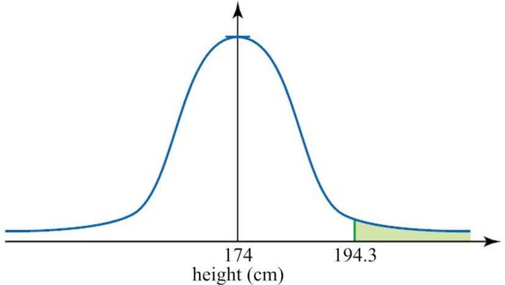

### Figure 7.1

Before you can start to find this area, you must know the mean and standard deviation of the distribution, in this case about 174 cm and 7 cm respectively. So UK Beanpole's height is 194.3 cm - 174 cm = 20.3 cm above the mean, and that is

 $$ \frac{20.3}{7}=2.9\mathrm{~s t a n d a r d~d e v i a t i o n s}. $$ 

The number of standard deviations beyond the mean, in this case 2.9, is denoted by the letter z. Thus the shaded area gives the probability of obtaining a value of  $ z \geq 2.9 $.

You find this area by looking up the value of $\Phi(z)$ when $z=2.9$ in a normal distribution table of $\Phi(z)$ as shown in Figure 7.2, and then calculating $1-\Phi(z)$. ($\Phi$ is the Greek letter phi.)

<table border=1 style='margin: auto; word-wrap: break-word;'><tr><td rowspan="2">z</td><td rowspan="2">0</td><td rowspan="2">1</td><td rowspan="2">2</td><td rowspan="2">3</td><td rowspan="2">4</td><td rowspan="2">5</td><td rowspan="2">6</td><td rowspan="2">7</td><td rowspan="2">8</td><td rowspan="2">9</td><td rowspan="2">1</td><td style='text-align: center; word-wrap: break-word;'>2</td><td style='text-align: center; word-wrap: break-word;'>3</td><td style='text-align: center; word-wrap: break-word;'>4</td><td style='text-align: center; word-wrap: break-word;'>5</td><td style='text-align: center; word-wrap: break-word;'>6</td><td style='text-align: center; word-wrap: break-word;'>7</td><td style='text-align: center; word-wrap: break-word;'>8</td><td style='text-align: center; word-wrap: break-word;'>9</td></tr><tr><td colspan="8">ADD</td></tr><tr><td style='text-align: center; word-wrap: break-word;'>0.0</td><td style='text-align: center; word-wrap: break-word;'>0.5000</td><td style='text-align: center; word-wrap: break-word;'>0.5040</td><td style='text-align: center; word-wrap: break-word;'>0.5080</td><td style='text-align: center; word-wrap: break-word;'>0.5120</td><td style='text-align: center; word-wrap: break-word;'>0.5160</td><td style='text-align: center; word-wrap: break-word;'>0.5199</td><td style='text-align: center; word-wrap: break-word;'>0.5239</td><td style='text-align: center; word-wrap: break-word;'>0.5279</td><td style='text-align: center; word-wrap: break-word;'>0.5319</td><td style='text-align: center; word-wrap: break-word;'>0.5359</td><td style='text-align: center; word-wrap: break-word;'>4</td><td style='text-align: center; word-wrap: break-word;'>8</td><td style='text-align: center; word-wrap: break-word;'>12</td><td style='text-align: center; word-wrap: break-word;'>16</td><td style='text-align: center; word-wrap: break-word;'>20</td><td style='text-align: center; word-wrap: break-word;'>24</td><td style='text-align: center; word-wrap: break-word;'>28</td><td style='text-align: center; word-wrap: break-word;'>32</td><td style='text-align: center; word-wrap: break-word;'>36</td></tr><tr><td style='text-align: center; word-wrap: break-word;'>0.1</td><td style='text-align: center; word-wrap: break-word;'>0.5398</td><td style='text-align: center; word-wrap: break-word;'>0.5438</td><td style='text-align: center; word-wrap: break-word;'>0.5478</td><td style='text-align: center; word-wrap: break-word;'>0.5517</td><td style='text-align: center; word-wrap: break-word;'>0.5557</td><td style='text-align: center; word-wrap: break-word;'>0.5596</td><td style='text-align: center; word-wrap: break-word;'>0.5636</td><td style='text-align: center; word-wrap: break-word;'>0.5675</td><td style='text-align: center; word-wrap: break-word;'>0.5714</td><td style='text-align: center; word-wrap: break-word;'>0.5753</td><td style='text-align: center; word-wrap: break-word;'>4</td><td style='text-align: center; word-wrap: break-word;'>8</td><td style='text-align: center; word-wrap: break-word;'>12</td><td style='text-align: center; word-wrap: break-word;'>16</td><td style='text-align: center; word-wrap: break-word;'>20</td><td style='text-align: center; word-wrap: break-word;'>24</td><td style='text-align: center; word-wrap: break-word;'>28</td><td style='text-align: center; word-wrap: break-word;'>32</td><td style='text-align: center; word-wrap: break-word;'>36</td></tr><tr><td style='text-align: center; word-wrap: break-word;'>0.2</td><td style='text-align: center; word-wrap: break-word;'>0.5793</td><td style='text-align: center; word-wrap: break-word;'>0.5832</td><td style='text-align: center; word-wrap: break-word;'>0.5871</td><td style='text-align: center; word-wrap: break-word;'>0.5910</td><td style='text-align: center; word-wrap: break-word;'>0.5948</td><td style='text-align: center; word-wrap: break-word;'>0.5987</td><td style='text-align: center; word-wrap: break-word;'>0.6026</td><td style='text-align: center; word-wrap: break-word;'>0.6064</td><td style='text-align: center; word-wrap: break-word;'>0.6103</td><td style='text-align: center; word-wrap: break-word;'>0.6141</td><td style='text-align: center; word-wrap: break-word;'>4</td><td style='text-align: center; word-wrap: break-word;'>8</td><td style='text-align: center; word-wrap: break-word;'>12</td><td style='text-align: center; word-wrap: break-word;'>15</td><td style='text-align: center; word-wrap: break-word;'>19</td><td style='text-align: center; word-wrap: break-word;'>23</td><td style='text-align: center; word-wrap: break-word;'>27</td><td style='text-align: center; word-wrap: break-word;'>31</td><td style='text-align: center; word-wrap: break-word;'>35</td></tr><tr><td style='text-align: center; word-wrap: break-word;'>0.3</td><td style='text-align: center; word-wrap: break-word;'>0.6179</td><td style='text-align: center; word-wrap: break-word;'>0.6217</td><td style='text-align: center; word-wrap: break-word;'>0.6255</td><td style='text-align: center; word-wrap: break-word;'>0.6293</td><td style='text-align: center; word-wrap: break-word;'>0.6331</td><td style='text-align: center; word-wrap: break-word;'>0.6368</td><td style='text-align: center; word-wrap: break-word;'>0.6406</td><td style='text-align: center; word-wrap: break-word;'>0.6443</td><td style='text-align: center; word-wrap: break-word;'>0.6480</td><td style='text-align: center; word-wrap: break-word;'>0.6517</td><td style='text-align: center; word-wrap: break-word;'>4</td><td style='text-align: center; word-wrap: break-word;'>7</td><td style='text-align: center; word-wrap: break-word;'>11</td><td style='text-align: center; word-wrap: break-word;'>15</td><td style='text-align: center; word-wrap: break-word;'>19</td><td style='text-align: center; word-wrap: break-word;'>22</td><td style='text-align: center; word-wrap: break-word;'>26</td><td style='text-align: center; word-wrap: break-word;'>30</td><td style='text-align: center; word-wrap: break-word;'>34</td></tr><tr><td style='text-align: center; word-wrap: break-word;'>0.4</td><td style='text-align: center; word-wrap: break-word;'>0.6554</td><td style='text-align: center; word-wrap: break-word;'>0.6591</td><td style='text-align: center; word-wrap: break-word;'>0.6628</td><td style='text-align: center; word-wrap: break-word;'>0.6664</td><td style='text-align: center; word-wrap: break-word;'>0.6700</td><td style='text-align: center; word-wrap: break-word;'>0.6736</td><td style='text-align: center; word-wrap: break-word;'>0.6772</td><td style='text-align: center; word-wrap: break-word;'>0.6808</td><td style='text-align: center; word-wrap: break-word;'>0.6844</td><td style='text-align: center; word-wrap: break-word;'>0.6879</td><td style='text-align: center; word-wrap: break-word;'>4</td><td style='text-align: center; word-wrap: break-word;'>7</td><td style='text-align: center; word-wrap: break-word;'>11</td><td style='text-align: center; word-wrap: break-word;'>14</td><td style='text-align: center; word-wrap: break-word;'>18</td><td style='text-align: center; word-wrap: break-word;'>22</td><td style='text-align: center; word-wrap: break-word;'>25</td><td style='text-align: center; word-wrap: break-word;'>29</td><td style='text-align: center; word-wrap: break-word;'>32</td></tr><tr><td style='text-align: center; word-wrap: break-word;'>0.5</td><td style='text-align: center; word-wrap: break-word;'>0.6915</td><td style='text-align: center; word-wrap: break-word;'>0.6950</td><td style='text-align: center; word-wrap: break-word;'>0.6985</td><td style='text-align: center; word-wrap: break-word;'>0.7019</td><td style='text-align: center; word-wrap: break-word;'>0.7054</td><td style='text-align: center; word-wrap: break-word;'>0.7088</td><td style='text-align: center; word-wrap: break-word;'>0.7123</td><td style='text-align: center; word-wrap: break-word;'>0.7157</td><td style='text-align: center; word-wrap: break-word;'>0.7190</td><td style='text-align: center; word-wrap: break-word;'>0.7224</td><td style='text-align: center; word-wrap: break-word;'>3</td><td style='text-align: center; word-wrap: break-word;'>7</td><td style='text-align: center; word-wrap: break-word;'>10</td><td style='text-align: center; word-wrap: break-word;'>14</td><td style='text-align: center; word-wrap: break-word;'>17</td><td style='text-align: center; word-wrap: break-word;'>20</td><td style='text-align: center; word-wrap: break-word;'>24</td><td style='text-align: center; word-wrap: break-word;'>27</td><td style='text-align: center; word-wrap: break-word;'>31</td></tr><tr><td style='text-align: center; word-wrap: break-word;'>0.6</td><td style='text-align: center; word-wrap: break-word;'>0.7257</td><td style='text-align: center; word-wrap: break-word;'>0.7291</td><td style='text-align: center; word-wrap: break-word;'>0.7324</td><td style='text-align: center; word-wrap: break-word;'>0.7357</td><td style='text-align: center; word-wrap: break-word;'>0.7389</td><td style='text-align: center; word-wrap: break-word;'>0.7422</td><td style='text-align: center; word-wrap: break-word;'>0.7454</td><td style='text-align: center; word-wrap: break-word;'>0.7486</td><td style='text-align: center; word-wrap: break-word;'>0.7517</td><td style='text-align: center; word-wrap: break-word;'>0.7549</td><td style='text-align: center; word-wrap: break-word;'>3</td><td style='text-align: center; word-wrap: break-word;'>7</td><td style='text-align: center; word-wrap: break-word;'>10</td><td style='text-align: center; word-wrap: break-word;'>13</td><td style='text-align: center; word-wrap: break-word;'>16</td><td style='text-align: center; word-wrap: break-word;'>19</td><td style='text-align: center; word-wrap: break-word;'>23</td><td style='text-align: center; word-wrap: break-word;'>26</td><td style='text-align: center; word-wrap: break-word;'>29</td></tr><tr><td style='text-align: center; word-wrap: break-word;'>0.7</td><td style='text-align: center; word-wrap: break-word;'>0.7580</td><td style='text-align: center; word-wrap: break-word;'>0.7611</td><td style='text-align: center; word-wrap: break-word;'>0.7642</td><td style='text-align: center; word-wrap: break-word;'>0.7673</td><td style='text-align: center; word-wrap: break-word;'>0.7704</td><td style='text-align: center; word-wrap: break-word;'>0.7734</td><td style='text-align: center; word-wrap: break-word;'>0.7764</td><td style='text-align: center; word-wrap: break-word;'>0.7794</td><td style='text-align: center; word-wrap: break-word;'>0.7823</td><td style='text-align: center; word-wrap: break-word;'>0.7852</td><td style='text-align: center; word-wrap: break-word;'>3</td><td style='text-align: center; word-wrap: break-word;'>6</td><td style='text-align: center; word-wrap: break-word;'>9</td><td style='text-align: center; word-wrap: break-word;'>12</td><td style='text-align: center; word-wrap: break-word;'>15</td><td style='text-align: center; word-wrap: break-word;'>18</td><td style='text-align: center; word-wrap: break-word;'>21</td><td style='text-align: center; word-wrap: break-word;'>24</td><td style='text-align: center; word-wrap: break-word;'>27</td></tr><tr><td style='text-align: center; word-wrap: break-word;'>0.8</td><td style='text-align: center; word-wrap: break-word;'>0.7881</td><td style='text-align: center; word-wrap: break-word;'>0.7910</td><td style='text-align: center; word-wrap: break-word;'>0.7939</td><td style='text-align: center; word-wrap: break-word;'>0.7967</td><td style='text-align: center; word-wrap: break-word;'>0.7995</td><td style='text-align: center; word-wrap: break-word;'>0.8023</td><td style='text-align: center; word-wrap: break-word;'>0.8051</td><td style='text-align: center; word-wrap: break-word;'>0.8078</td><td style='text-align: center; word-wrap: break-word;'>0.8106</td><td style='text-align: center; word-wrap: break-word;'>0.8133</td><td style='text-align: center; word-wrap: break-word;'>3</td><td style='text-align: center; word-wrap: break-word;'>5</td><td style='text-align: center; word-wrap: break-word;'>8</td><td style='text-align: center; word-wrap: break-word;'>11</td><td style='text-align: center; word-wrap: break-word;'>14</td><td style='text-align: center; word-wrap: break-word;'>16</td><td style='text-align: center; word-wrap: break-word;'>19</td><td style='text-align: center; word-wrap: break-word;'>22</td><td style='text-align: center; word-wrap: break-word;'>25</td></tr><tr><td colspan="20"></td></tr><tr><td style='text-align: center; word-wrap: break-word;'>2.5</td><td style='text-align: center; word-wrap: break-word;'>0.9938</td><td style='text-align: center; word-wrap: break-word;'>0.9940</td><td style='text-align: center; word-wrap: break-word;'>0.9941</td><td style='text-align: center; word-wrap: break-word;'>0.9943</td><td style='text-align: center; word-wrap: break-word;'>0.9945</td><td style='text-align: center; word-wrap: break-word;'>0.9946</td><td style='text-align: center; word-wrap: break-word;'>0.9948</td><td style='text-align: center; word-wrap: break-word;'>0.9949</td><td style='text-align: center; word-wrap: break-word;'>0.9951</td><td style='text-align: center; word-wrap: break-word;'>0.9952</td><td style='text-align: center; word-wrap: break-word;'>0</td><td style='text-align: center; word-wrap: break-word;'>0</td><td style='text-align: center; word-wrap: break-word;'>0</td><td style='text-align: center; word-wrap: break-word;'>1</td><td style='text-align: center; word-wrap: break-word;'>1</td><td style='text-align: center; word-wrap: break-word;'>1</td><td style='text-align: center; word-wrap: break-word;'>1</td><td style='text-align: center; word-wrap: break-word;'>1</td><td style='text-align: center; word-wrap: break-word;'>1</td></tr><tr><td style='text-align: center; word-wrap: break-word;'>2.6</td><td style='text-align: center; word-wrap: break-word;'>0.9953</td><td style='text-align: center; word-wrap: break-word;'>0.9955</td><td style='text-align: center; word-wrap: break-word;'>0.9956</td><td style='text-align: center; word-wrap: break-word;'>0.9957</td><td style='text-align: center; word-wrap: break-word;'>0.9959</td><td style='text-align: center; word-wrap: break-word;'>0.9960</td><td style='text-align: center; word-wrap: break-word;'>0.9961</td><td style='text-align: center; word-wrap: break-word;'>0.9962</td><td style='text-align: center; word-wrap: break-word;'>0.9963</td><td style='text-align: center; word-wrap: break-word;'>0.9964</td><td style='text-align: center; word-wrap: break-word;'>0</td><td style='text-align: center; word-wrap: break-word;'>0</td><td style='text-align: center; word-wrap: break-word;'>0</td><td style='text-align: center; word-wrap: break-word;'>0</td><td style='text-align: center; word-wrap: break-word;'>1</td><td style='text-align: center; word-wrap: break-word;'>1</td><td style='text-align: center; word-wrap: break-word;'>1</td><td style='text-align: center; word-wrap: break-word;'>1</td><td style='text-align: center; word-wrap: break-word;'>1</td></tr><tr><td style='text-align: center; word-wrap: break-word;'>2.7</td><td style='text-align: center; word-wrap: break-word;'>0.9965</td><td style='text-align: center; word-wrap: break-word;'>0.9966</td><td style='text-align: center; word-wrap: break-word;'>0.9967</td><td style='text-align: center; word-wrap: break-word;'>0.9968</td><td style='text-align: center; word-wrap: break-word;'>0.9969</td><td style='text-align: center; word-wrap: break-word;'>0.9970</td><td style='text-align: center; word-wrap: break-word;'>0.9971</td><td style='text-align: center; word-wrap: break-word;'>0.9972</td><td style='text-align: center; word-wrap: break-word;'>0.9973</td><td style='text-align: center; word-wrap: break-word;'>0.9974</td><td style='text-align: center; word-wrap: break-word;'>0</td><td style='text-align: center; word-wrap: break-word;'>0</td><td style='text-align: center; word-wrap: break-word;'>0</td><td style='text-align: center; word-wrap: break-word;'>0</td><td style='text-align: center; word-wrap: break-word;'>0</td><td style='text-align: center; word-wrap: break-word;'>1</td><td style='text-align: center; word-wrap: break-word;'>1</td><td style='text-align: center; word-wrap: break-word;'>1</td><td style='text-align: center; word-wrap: break-word;'>1</td></tr><tr><td style='text-align: center; word-wrap: break-word;'>2.8</td><td style='text-align: center; word-wrap: break-word;'>0.9974</td><td style='text-align: center; word-wrap: break-word;'>0.9975</td><td style='text-align: center; word-wrap: break-word;'>0.9976</td><td style='text-align: center; word-wrap: break-word;'>0.9977</td><td style='text-align: center; word-wrap: break-word;'>0.9977</td><td style='text-align: center; word-wrap: break-word;'>0.9978</td><td style='text-align: center; word-wrap: break-word;'>0.9979</td><td style='text-align: center; word-wrap: break-word;'>0.9979</td><td style='text-align: center; word-wrap: break-word;'>0.9980</td><td style='text-align: center; word-wrap: break-word;'>0.9981</td><td style='text-align: center; word-wrap: break-word;'>0</td><td style='text-align: center; word-wrap: break-word;'>0</td><td style='text-align: center; word-wrap: break-word;'>0</td><td style='text-align: center; word-wrap: break-word;'>0</td><td style='text-align: center; word-wrap: break-word;'>0</td><td style='text-align: center; word-wrap: break-word;'>0</td><td style='text-align: center; word-wrap: break-word;'>0</td><td style='text-align: center; word-wrap: break-word;'>1</td><td style='text-align: center; word-wrap: break-word;'>1</td></tr><tr><td style='text-align: center; word-wrap: break-word;'>2.9</td><td style='text-align: center; word-wrap: break-word;'>0.9981</td><td style='text-align: center; word-wrap: break-word;'>0.9982</td><td style='text-align: center; word-wrap: break-word;'>0.9982</td><td style='text-align: center; word-wrap: break-word;'>0.9983</td><td style='text-align: center; word-wrap: break-word;'>0.9984</td><td style='text-align: center; word-wrap: break-word;'>0.9984</td><td style='text-align: center; word-wrap: break-word;'>0.9985</td><td style='text-align: center; word-wrap: break-word;'>0.9985</td><td style='text-align: center; word-wrap: break-word;'>0.9986</td><td style='text-align: center; word-wrap: break-word;'>0.9986</td><td style='text-align: center; word-wrap: break-word;'>0</td><td style='text-align: center; word-wrap: break-word;'>0</td><td style='text-align: center; word-wrap: break-word;'>0</td><td style='text-align: center; word-wrap: break-word;'>0</td><td style='text-align: center; word-wrap: break-word;'>0</td><td style='text-align: center; word-wrap: break-word;'>0</td><td style='text-align: center; word-wrap: break-word;'>0</td><td style='text-align: center; word-wrap: break-word;'>0</td><td style='text-align: center; word-wrap: break-word;'>0</td></tr></table>

Figure 7.2 Extract from tables of  $ \Phi(z) $

<!-- page 180 -->

This gives  $ \Phi(2.9)=0.9981 $, and so  $ 1-\Phi(2.9)=0.0019 $.

The probability of a randomly selected adult male being 194.3 cm or over is 0.0019. One man in slightly more than 500 is at least as tall as UK Beanpole.

### 7.1 Using normal distribution tables

The function $\Phi(z)$ gives the area under the normal distribution curve to the left of the value $z$, that is the shaded area in Figure 7.3 (it is the cumulative distribution function). The total area under the curve is 1, and the area given by $\Phi(z)$ represents the probability of a value smaller than $z$.

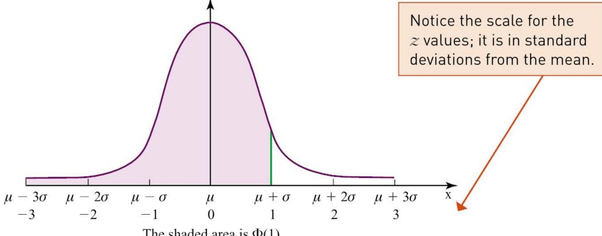

### Figure 7.3

If the variable X has mean  $ \mu $ and standard deviation  $ \sigma $ then x, a particular value of X, is transformed into z by the equation

 $$ z=\frac{x-\mu}{\sigma} $$ 

z is a particular value of the variable Z which has mean 0 and standard deviation 1 and is the standardised form of the normal distribution.

<table border=1 style='margin: auto; word-wrap: break-word;'><tr><td style='text-align: center; word-wrap: break-word;'></td><td style='text-align: center; word-wrap: break-word;'>Actual distribution, X</td><td style='text-align: center; word-wrap: break-word;'>Standardised distribution, Z</td></tr><tr><td style='text-align: center; word-wrap: break-word;'>Mean</td><td style='text-align: center; word-wrap: break-word;'>$ \mu $</td><td style='text-align: center; word-wrap: break-word;'>0</td></tr><tr><td style='text-align: center; word-wrap: break-word;'>Standard deviation</td><td style='text-align: center; word-wrap: break-word;'>$ \sigma $</td><td style='text-align: center; word-wrap: break-word;'>1</td></tr><tr><td style='text-align: center; word-wrap: break-word;'>Particular value</td><td style='text-align: center; word-wrap: break-word;'>x</td><td style='text-align: center; word-wrap: break-word;'>$ z = \frac{x - \mu}{\sigma} $</td></tr></table>

Notice how lower case letters, x and z, are used to indicate particular values of the random variables, whereas upper case letters, X and Z, are used to describe or name those variables.

Normal distribution tables are easy to use but you should always make a point of drawing a diagram and shading the region you are interested in.

<!-- page 181 -->

It is often helpful to know that in a normal distribution, roughly:

68% of the values lie within  $ \pm1 $ standard deviation of the mean

95% of the values lie within  $ \pm2 $ standard deviations of the mean

99.75% of the values lie within  $ \pm3 $ standard deviations of the mean.

The notation $N(\mu,\sigma^{2})$ is used to describe this distribution. The mean, $\mu$, and standard deviation, $\sigma$ (or variance, $\sigma^{2}$), are the two parameters used to define the distribution. Once you know their values, you know everything there is to know about the distribution. The standardised variable $Z$ has mean 0 and variance 1, so its distribution is $N(0,1)$.

### Example 7.1

Assuming the distribution of the heights of adult men is normal, with mean 174 cm and standard deviation 7 cm, find the probability that a randomly selected adult man is:

(i) under 185 cm

(ii) over 185 cm

(iii) over 180 cm

(iv) between 180 cm and 185 cm

(v) under 170 cm

giving your answers to 2 significant figures.

## Solution

The mean height,  $ \mu = 174 $ cm.

The standard deviation,  $ \sigma = 7 $ cm.

(i) The probability that an adult man selected at random is under 185 cm.

The area required is that shaded in Figure 7.4.

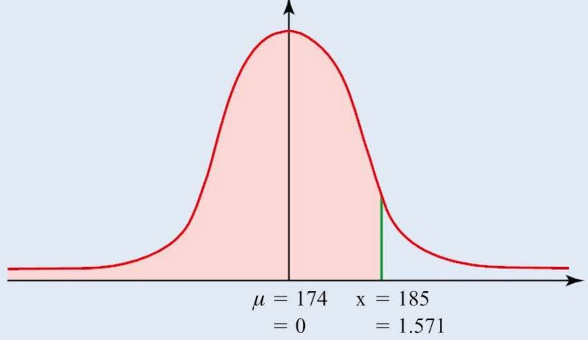

### Figure 7.4

x=185cm

and so  $ z=\frac{185-174}{7}=1.571 $

For calculations that involve standardisation, you should show full details of your working.

Look up the value of $\Phi(z)$ in a normal distribution table.

<!-- page 182 -->

<table border=1 style='margin: auto; word-wrap: break-word;'><tr><td style='text-align: center; word-wrap: break-word;'>z</td><td style='text-align: center; word-wrap: break-word;'>0</td><td style='text-align: center; word-wrap: break-word;'>1</td><td style='text-align: center; word-wrap: break-word;'>2</td><td style='text-align: center; word-wrap: break-word;'>3</td><td style='text-align: center; word-wrap: break-word;'>4</td><td style='text-align: center; word-wrap: break-word;'>5</td><td style='text-align: center; word-wrap: break-word;'>6</td><td style='text-align: center; word-wrap: break-word;'>7</td><td style='text-align: center; word-wrap: break-word;'>8</td><td style='text-align: center; word-wrap: break-word;'>9</td><td style='text-align: center; word-wrap: break-word;'>1</td><td style='text-align: center; word-wrap: break-word;'>2</td><td style='text-align: center; word-wrap: break-word;'>3</td><td style='text-align: center; word-wrap: break-word;'>4</td><td style='text-align: center; word-wrap: break-word;'>5</td><td style='text-align: center; word-wrap: break-word;'>6</td><td style='text-align: center; word-wrap: break-word;'>7</td><td style='text-align: center; word-wrap: break-word;'>8</td><td style='text-align: center; word-wrap: break-word;'>9</td></tr><tr><td style='text-align: center; word-wrap: break-word;'>0.0</td><td style='text-align: center; word-wrap: break-word;'>0.5000</td><td style='text-align: center; word-wrap: break-word;'>0.5040</td><td style='text-align: center; word-wrap: break-word;'>0.5080</td><td style='text-align: center; word-wrap: break-word;'>0.5120</td><td style='text-align: center; word-wrap: break-word;'>0.5160</td><td style='text-align: center; word-wrap: break-word;'>0.5199</td><td style='text-align: center; word-wrap: break-word;'>0.5239</td><td style='text-align: center; word-wrap: break-word;'>0.5279</td><td style='text-align: center; word-wrap: break-word;'>0.5319</td><td style='text-align: center; word-wrap: break-word;'>0.5359</td><td style='text-align: center; word-wrap: break-word;'>4</td><td style='text-align: center; word-wrap: break-word;'>8</td><td style='text-align: center; word-wrap: break-word;'>12</td><td style='text-align: center; word-wrap: break-word;'>16</td><td style='text-align: center; word-wrap: break-word;'>20</td><td style='text-align: center; word-wrap: break-word;'>24</td><td style='text-align: center; word-wrap: break-word;'>28</td><td style='text-align: center; word-wrap: break-word;'>32</td><td style='text-align: center; word-wrap: break-word;'>36</td></tr><tr><td style='text-align: center; word-wrap: break-word;'>0.1</td><td style='text-align: center; word-wrap: break-word;'>0.5398</td><td style='text-align: center; word-wrap: break-word;'>0.5438</td><td style='text-align: center; word-wrap: break-word;'>0.5478</td><td style='text-align: center; word-wrap: break-word;'>0.5517</td><td style='text-align: center; word-wrap: break-word;'>0.5557</td><td style='text-align: center; word-wrap: break-word;'>0.5596</td><td style='text-align: center; word-wrap: break-word;'>0.5636</td><td style='text-align: center; word-wrap: break-word;'>0.5675</td><td style='text-align: center; word-wrap: break-word;'>0.5714</td><td style='text-align: center; word-wrap: break-word;'>0.5753</td><td style='text-align: center; word-wrap: break-word;'>4</td><td style='text-align: center; word-wrap: break-word;'>8</td><td style='text-align: center; word-wrap: break-word;'>12</td><td style='text-align: center; word-wrap: break-word;'>16</td><td style='text-align: center; word-wrap: break-word;'>20</td><td style='text-align: center; word-wrap: break-word;'>24</td><td style='text-align: center; word-wrap: break-word;'>28</td><td style='text-align: center; word-wrap: break-word;'>32</td><td style='text-align: center; word-wrap: break-word;'>36</td></tr><tr><td style='text-align: center; word-wrap: break-word;'>1.4</td><td style='text-align: center; word-wrap: break-word;'>0.9192</td><td style='text-align: center; word-wrap: break-word;'>0.9207</td><td style='text-align: center; word-wrap: break-word;'>0.9222</td><td style='text-align: center; word-wrap: break-word;'>0.9236</td><td style='text-align: center; word-wrap: break-word;'>0.9251</td><td style='text-align: center; word-wrap: break-word;'>0.9265</td><td style='text-align: center; word-wrap: break-word;'>0.9279</td><td style='text-align: center; word-wrap: break-word;'>0.9292</td><td style='text-align: center; word-wrap: break-word;'>0.9306</td><td style='text-align: center; word-wrap: break-word;'>0.9319</td><td style='text-align: center; word-wrap: break-word;'>1</td><td style='text-align: center; word-wrap: break-word;'>3</td><td style='text-align: center; word-wrap: break-word;'>4</td><td style='text-align: center; word-wrap: break-word;'>6</td><td style='text-align: center; word-wrap: break-word;'>7</td><td style='text-align: center; word-wrap: break-word;'>8</td><td style='text-align: center; word-wrap: break-word;'>10</td><td style='text-align: center; word-wrap: break-word;'>11</td><td style='text-align: center; word-wrap: break-word;'>13</td></tr><tr><td style='text-align: center; word-wrap: break-word;'>1.5</td><td style='text-align: center; word-wrap: break-word;'>0.9332</td><td style='text-align: center; word-wrap: break-word;'>0.9345</td><td style='text-align: center; word-wrap: break-word;'>0.9357</td><td style='text-align: center; word-wrap: break-word;'>0.9370</td><td style='text-align: center; word-wrap: break-word;'>0.9382</td><td style='text-align: center; word-wrap: break-word;'>0.9394</td><td style='text-align: center; word-wrap: break-word;'>0.9406</td><td style='text-align: center; word-wrap: break-word;'>0.9418</td><td style='text-align: center; word-wrap: break-word;'>0.9429</td><td style='text-align: center; word-wrap: break-word;'>0.9441</td><td style='text-align: center; word-wrap: break-word;'>1</td><td style='text-align: center; word-wrap: break-word;'>2</td><td style='text-align: center; word-wrap: break-word;'>4</td><td style='text-align: center; word-wrap: break-word;'>5</td><td style='text-align: center; word-wrap: break-word;'>6</td><td style='text-align: center; word-wrap: break-word;'>7</td><td style='text-align: center; word-wrap: break-word;'>8</td><td style='text-align: center; word-wrap: break-word;'>10</td><td style='text-align: center; word-wrap: break-word;'>11</td></tr><tr><td style='text-align: center; word-wrap: break-word;'>1.6</td><td style='text-align: center; word-wrap: break-word;'>0.9452</td><td style='text-align: center; word-wrap: break-word;'>0.9463</td><td style='text-align: center; word-wrap: break-word;'>0.9474</td><td style='text-align: center; word-wrap: break-word;'>0.9484</td><td style='text-align: center; word-wrap: break-word;'>0.9495</td><td style='text-align: center; word-wrap: break-word;'>0.9505</td><td style='text-align: center; word-wrap: break-word;'>0.9515</td><td style='text-align: center; word-wrap: break-word;'>0.9525</td><td style='text-align: center; word-wrap: break-word;'>0.9535</td><td style='text-align: center; word-wrap: break-word;'>0.9545</td><td style='text-align: center; word-wrap: break-word;'>1</td><td style='text-align: center; word-wrap: break-word;'>2</td><td style='text-align: center; word-wrap: break-word;'>3</td><td style='text-align: center; word-wrap: break-word;'>4</td><td style='text-align: center; word-wrap: break-word;'>5</td><td style='text-align: center; word-wrap: break-word;'>6</td><td style='text-align: center; word-wrap: break-word;'>7</td><td style='text-align: center; word-wrap: break-word;'>8</td><td style='text-align: center; word-wrap: break-word;'>9</td></tr><tr><td style='text-align: center; word-wrap: break-word;'>1.7</td><td style='text-align: center; word-wrap: break-word;'>0.9554</td><td style='text-align: center; word-wrap: break-word;'>0.9564</td><td style='text-align: center; word-wrap: break-word;'>0.9573</td><td style='text-align: center; word-wrap: break-word;'>0.9582</td><td style='text-align: center; word-wrap: break-word;'>0.9591</td><td style='text-align: center; word-wrap: break-word;'>0.9599</td><td style='text-align: center; word-wrap: break-word;'>0.9608</td><td style='text-align: center; word-wrap: break-word;'>0.9616</td><td style='text-align: center; word-wrap: break-word;'>0.9625</td><td style='text-align: center; word-wrap: break-word;'>0.9633</td><td style='text-align: center; word-wrap: break-word;'>1</td><td style='text-align: center; word-wrap: break-word;'>2</td><td style='text-align: center; word-wrap: break-word;'>3</td><td style='text-align: center; word-wrap: break-word;'>4</td><td style='text-align: center; word-wrap: break-word;'>4</td><td style='text-align: center; word-wrap: break-word;'>5</td><td style='text-align: center; word-wrap: break-word;'>6</td><td style='text-align: center; word-wrap: break-word;'>7</td><td style='text-align: center; word-wrap: break-word;'>8</td></tr><tr><td style='text-align: center; word-wrap: break-word;'>1.8</td><td style='text-align: center; word-wrap: break-word;'>0.9641</td><td style='text-align: center; word-wrap: break-word;'>0.9649</td><td style='text-align: center; word-wrap: break-word;'>0.9656</td><td style='text-align: center; word-wrap: break-word;'>0.9664</td><td style='text-align: center; word-wrap: break-word;'>0.9671</td><td style='text-align: center; word-wrap: break-word;'>0.9678</td><td style='text-align: center; word-wrap: break-word;'>0.9686</td><td style='text-align: center; word-wrap: break-word;'>0.9693</td><td style='text-align: center; word-wrap: break-word;'>0.9699</td><td style='text-align: center; word-wrap: break-word;'>0.9706</td><td style='text-align: center; word-wrap: break-word;'>1</td><td style='text-align: center; word-wrap: break-word;'>1</td><td style='text-align: center; word-wrap: break-word;'>2</td><td style='text-align: center; word-wrap: break-word;'>3</td><td style='text-align: center; word-wrap: break-word;'>4</td><td style='text-align: center; word-wrap: break-word;'>4</td><td style='text-align: center; word-wrap: break-word;'>5</td><td style='text-align: center; word-wrap: break-word;'>6</td><td style='text-align: center; word-wrap: break-word;'>6</td></tr></table>

Figure 7.5 Extract from tables of  $ \Phi(z) $

 $$ \begin{aligned}\Phi(1.571)&=0.9418+0.0001\\&=0.9419\\&=0.94\quad(2\mathrm{~s.f.})\end{aligned} $$ 

Answer: The probability that an adult man selected at random is under 185 cm is 0.94.

(ii) The probability that an adult man selected at random is over 185 cm.

The area required is the complement of that for part (i) (see Figure 7.6).

 $$ \begin{aligned}Prob a b i l i t y&=1-\Phi(1.571)\\&=1-0.9419\\&=0.0581\\&=0.058\quad(2s.f.)\\ \end{aligned} $$ 

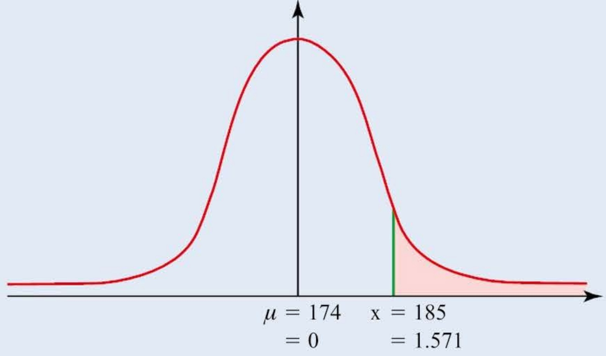

Figure 7.6

Answer: The probability that an adult man selected at random is over 185 cm is 0.058.

<!-- page 183 -->

(iii) The probability that an adult man selected at random is over 180 cm.

 $$ x=180cm\quad and~so\quad z=\frac{180-174}{7}=0.857 $$ 

The area required = 1 -  $ \Phi $(0.857)

= 1 - 0.8042

= 0.1958

= 0.20 (2 s.f.)

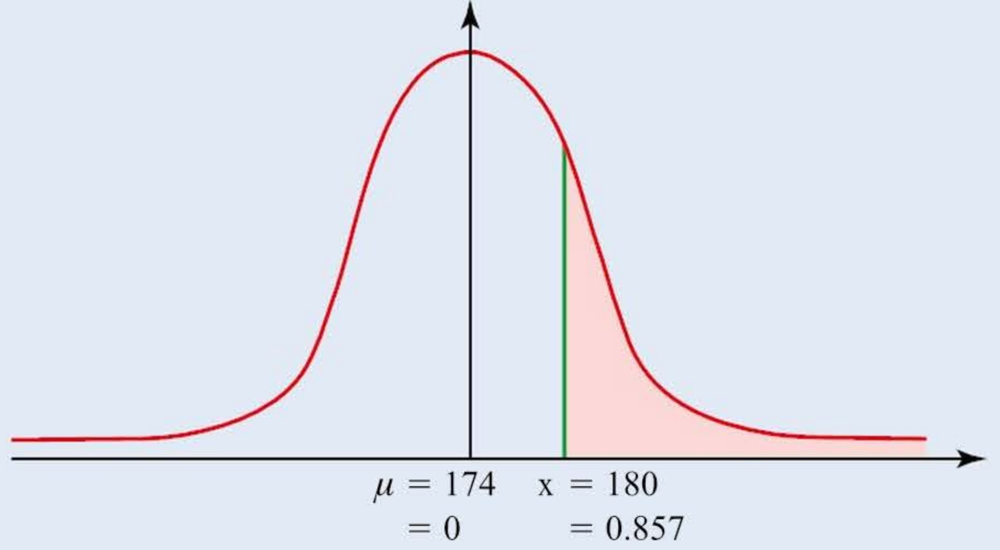

Figure 7.7

Answer: The probability that an adult man selected at random is over 180 cm is 0.20.

(iv) The probability that an adult man selected at random is between 180 cm and 185 cm.

The required area is shown in Figure 7.8. It is

 $$ \begin{aligned}\Phi(1.571)-\Phi(0.857)&=0.9419-0.8042\\&=0.1377\\&=0.14\quad(2\mathrm{~s.f.})\end{aligned} $$ 

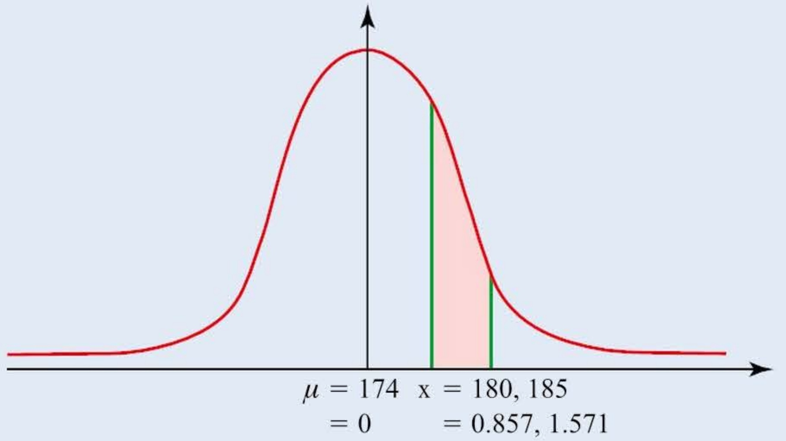

Figure 7.8

Answer: The probability that an adult man selected at random is over 180 cm but under 185 cm is 0.14.

<!-- page 184 -->

(v) The probability that an adult man selected at random is under 170 cm.

In this case

 $$ x=170 $$ 

and so

 $$ z=\frac{170-174}{7}=-0.571 $$ 

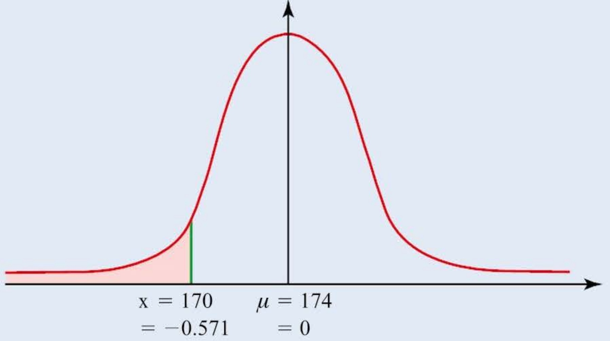

Figure 7.9

However, when you come to look up  $ \Phi(-0.571) $, you will find that only positive values of z are given in your tables. You overcome this problem by using the symmetry of the normal curve. The area you want in this case is that to the left of -0.571 and this is clearly just the same as that to the right of +0.571 (see Figure 7.10).

So

 $$ \begin{aligned}\Phi(-0.571)&=1-\Phi(0.571)\\&=1-0.716\\&=0.284\\&=0.28(2s.f.)\end{aligned} $$ 

Answer: The probability that an adult man selected at random is under 170 cm is 0.28.

## Note:

These graphs illustrate that  $ \Phi(-\mathcal{Z}) = 1 - \Phi(\mathcal{Z}) $.

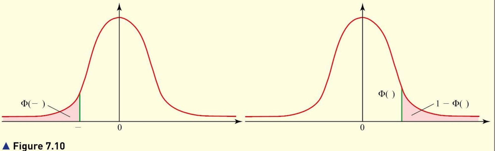

<!-- page 185 -->

### 7.2 The normal curve

All normal curves have the same basic shape, so that by scaling the two axes suitably you can always fit one normal curve exactly on top of another one.

The curve for the normal distribution with mean $\mu$ and standard deviation $\sigma$ (i.e. variance $\sigma^{2}$) is given by the function $\phi(x)$ in

 $$ \phi(x)\;=\;{\frac{1}{\sigma\sqrt{2\pi}}}\mathrm{e}^{-{\frac{1}{2}}\left({\frac{x-\mu}{\sigma}}\right)^{2}} $$ 

After the variable X has been transformed to Z using $z = \frac{x - \mu}{\sigma}$ the form of the curve (now standardised) becomes

 $$ \phi(z)\;=\;{\frac{1}{\sqrt{2\pi}}}\mathrm{e}^{-{\frac{1}{2}}z^{2}} $$ 

However, the exact shape of the normal curve is often less useful than the area underneath it, which represents a probability. For example, the probability that  $ Z \leq 2 $ is given by the shaded area in Figure 7.11.

Easy though it looks, the function \phi(z) cannot be integrated algebraically to find the area under the curve; this can only be found by using a numerical method. The values found by doing so are given as a table, and this area function is called \Phi(z).

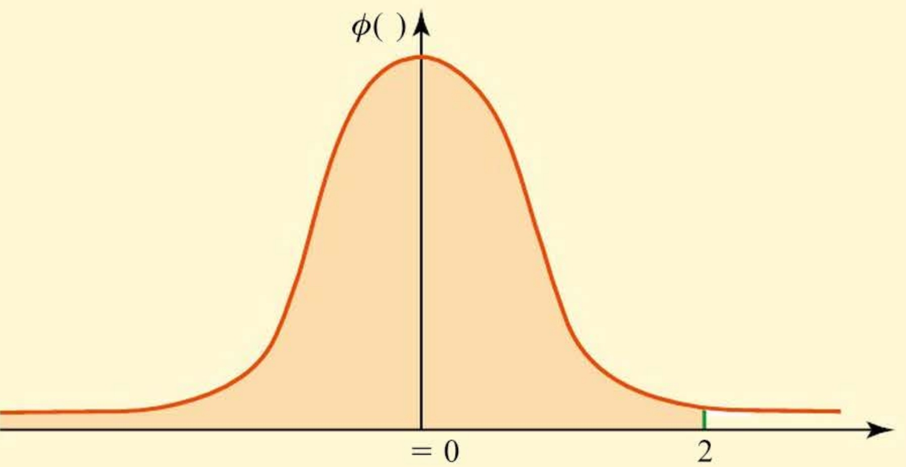

Figure 7.11

### Example 7.2

Skilled operators make a particular component for an engine. The company believes that the time taken to make this component may be modelled by the normal distribution with mean 95 minutes and standard deviation 4 minutes.

Assuming the company's belief to be true, find the probability that the time taken to make one of these components, selected at random, was:

(i) over 97 minutes

(ii) under 90 minutes

(iii) between 90 and 97 minutes.

Sheila believes that the company is allowing too long for the job and invites them to time her. They find that only 10% of the components take her over 90 minutes to make, and that 20% take her less than 70 minutes.

(iv) Estimate the mean and standard deviation of the time Sheila takes.

<!-- page 186 -->

## Solution

According to the company  $ \mu = 95 $ and  $ \sigma = 4 $ so the distribution is  $ \mathrm{N}(95, 4^2) $.

(i) The probability that a component required over 97 minutes.

 $$ z=\frac{97-95}{4}=0.5 $$ 

The probability is represented by the shaded area in Figure 7.12 and is given by

 $$ \begin{aligned}1-\Phi(0.5)&=1-0.6915\\&=0.3085\\&=0.309\quad(3\ s.f.)\\ \end{aligned} $$ 

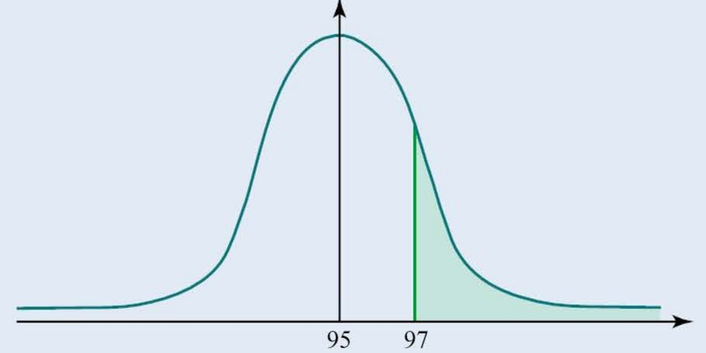

Figure 7.12

Answer: The probability it took the operator over 97 minutes to manufacture a randomly selected component is 0.309.

(ii) The probability that a component required under 90 minutes.

 $$ z=\frac{90-95}{4}=-1.25 $$ 

The probability is represented by the shaded area in Figure 7.13 and given by

 $$ \begin{aligned}1-\Phi(1.25)&=1-0.8944\\&=0.1056\\&=0.106\quad(3\ s.f.)\\ \end{aligned} $$ 

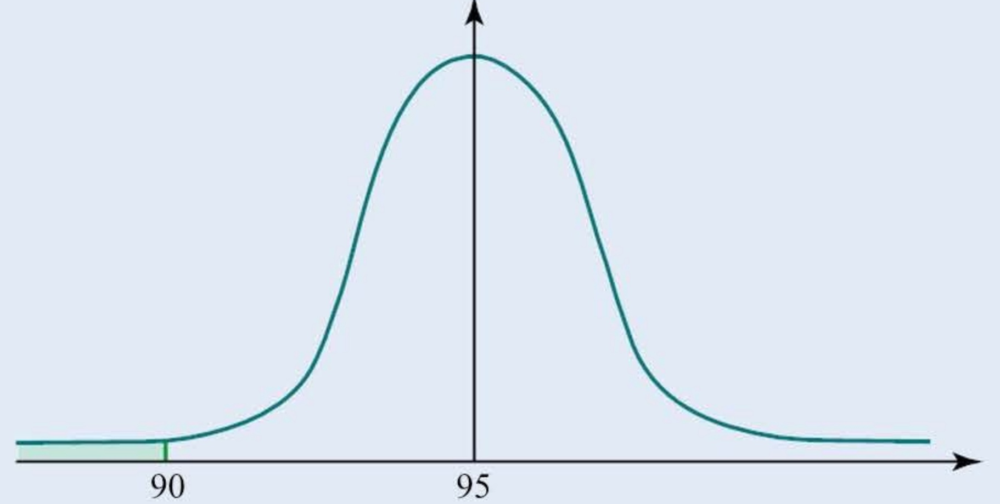

Figure 7.13

Answer: The probability it took the operator under 90 minutes to manufacture a randomly selected component is 0.106.

<!-- page 187 -->

(iii) The probability that a component required between 90 and 97 minutes.

The probability is represented by the shaded area in Figure 7.14 and given by

 $$ 1-0.1056-0.3085=0.5859 $$ 

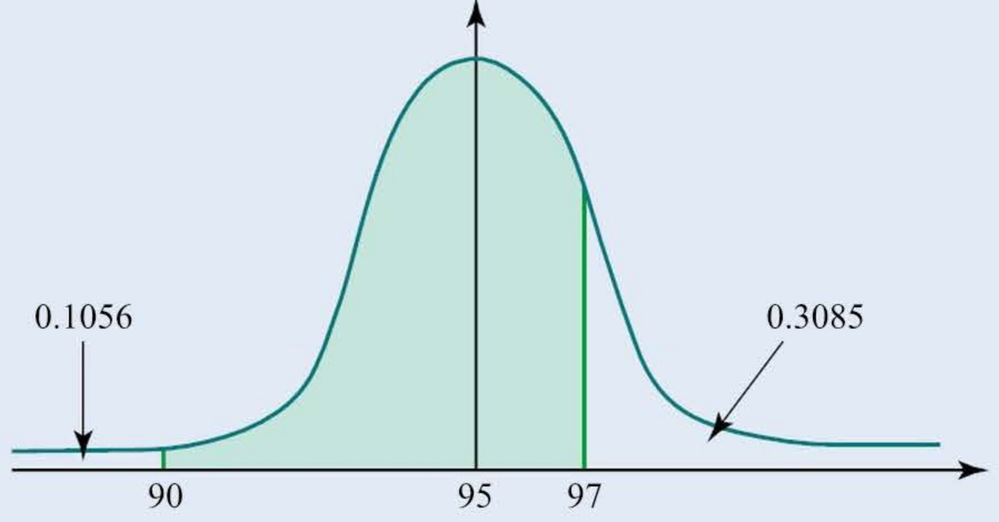

Figure 7.14

Answer: The probability it took the operator between 90 and 97 minutes to manufacture a randomly selected component is 0.586.

(iv) Estimate the mean and standard deviation of the time Sheila takes.

The question has now been put the other way round. You have to infer the mean,  $ \mu $, and standard deviation,  $ \sigma $, from the areas under different parts of the graph.

10% take her 90 minutes or more. This means that the shaded area in Figure 7.15 is 0.1.

 $$ z=\frac{90\ -\ \mu}{\sigma} $$ 

 $$ \Phi(z)=1-0.1=0.9 $$ 

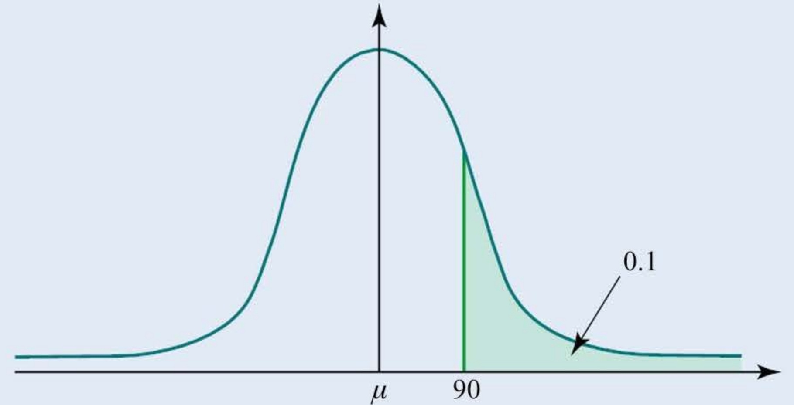

Figure 7.15

You now use the table of $\Phi(z) = p$ in reverse. $z = 1.28$ has a probability of 0.8997 which is as close to 0.9 as you can get using this middle part of the table. However, you can achieve greater accuracy by looking at the right-hand columns as well: $z = 1.281$ has a probability of 0.8999 and $z = 1.282$ has a probability of 0.9001. So the best value for $z$ is 1.2815.

<!-- page 188 -->

<table border=1 style='margin: auto; word-wrap: break-word;'><tr><td style='text-align: center; word-wrap: break-word;'>z</td><td style='text-align: center; word-wrap: break-word;'>0</td><td style='text-align: center; word-wrap: break-word;'>1</td><td style='text-align: center; word-wrap: break-word;'>2</td><td style='text-align: center; word-wrap: break-word;'>3</td><td style='text-align: center; word-wrap: break-word;'>4</td><td style='text-align: center; word-wrap: break-word;'>5</td><td style='text-align: center; word-wrap: break-word;'>6</td><td style='text-align: center; word-wrap: break-word;'>7</td><td style='text-align: center; word-wrap: break-word;'>8</td><td style='text-align: center; word-wrap: break-word;'>9</td><td style='text-align: center; word-wrap: break-word;'>1</td><td style='text-align: center; word-wrap: break-word;'>2</td><td style='text-align: center; word-wrap: break-word;'>3</td><td style='text-align: center; word-wrap: break-word;'>4</td><td style='text-align: center; word-wrap: break-word;'>5</td><td style='text-align: center; word-wrap: break-word;'>6</td><td style='text-align: center; word-wrap: break-word;'>7</td><td style='text-align: center; word-wrap: break-word;'>8</td><td style='text-align: center; word-wrap: break-word;'>9</td></tr><tr><td style='text-align: center; word-wrap: break-word;'>0.0</td><td style='text-align: center; word-wrap: break-word;'>0.5000</td><td style='text-align: center; word-wrap: break-word;'>0.5040</td><td style='text-align: center; word-wrap: break-word;'>0.5080</td><td style='text-align: center; word-wrap: break-word;'>0.5120</td><td style='text-align: center; word-wrap: break-word;'>0.5160</td><td style='text-align: center; word-wrap: break-word;'>0.5199</td><td style='text-align: center; word-wrap: break-word;'>0.5239</td><td style='text-align: center; word-wrap: break-word;'>0.5279</td><td style='text-align: center; word-wrap: break-word;'>0.5319</td><td style='text-align: center; word-wrap: break-word;'>0.5359</td><td style='text-align: center; word-wrap: break-word;'>4</td><td style='text-align: center; word-wrap: break-word;'>8</td><td style='text-align: center; word-wrap: break-word;'>12</td><td style='text-align: center; word-wrap: break-word;'>16</td><td style='text-align: center; word-wrap: break-word;'>20</td><td style='text-align: center; word-wrap: break-word;'>24</td><td style='text-align: center; word-wrap: break-word;'>28</td><td style='text-align: center; word-wrap: break-word;'>32</td><td style='text-align: center; word-wrap: break-word;'>36</td></tr><tr><td style='text-align: center; word-wrap: break-word;'>0.1</td><td style='text-align: center; word-wrap: break-word;'>0.5398</td><td style='text-align: center; word-wrap: break-word;'>0.5438</td><td style='text-align: center; word-wrap: break-word;'>0.5478</td><td style='text-align: center; word-wrap: break-word;'>0.5517</td><td style='text-align: center; word-wrap: break-word;'>0.5557</td><td style='text-align: center; word-wrap: break-word;'>0.5596</td><td style='text-align: center; word-wrap: break-word;'>0.5636</td><td style='text-align: center; word-wrap: break-word;'>0.5675</td><td style='text-align: center; word-wrap: break-word;'>0.5714</td><td style='text-align: center; word-wrap: break-word;'>0.5753</td><td style='text-align: center; word-wrap: break-word;'>4</td><td style='text-align: center; word-wrap: break-word;'>8</td><td style='text-align: center; word-wrap: break-word;'>12</td><td style='text-align: center; word-wrap: break-word;'>16</td><td style='text-align: center; word-wrap: break-word;'>20</td><td style='text-align: center; word-wrap: break-word;'>24</td><td style='text-align: center; word-wrap: break-word;'>28</td><td style='text-align: center; word-wrap: break-word;'>32</td><td style='text-align: center; word-wrap: break-word;'>36</td></tr><tr><td style='text-align: center; word-wrap: break-word;'>0.2</td><td style='text-align: center; word-wrap: break-word;'>0.5793</td><td style='text-align: center; word-wrap: break-word;'>0.5832</td><td style='text-align: center; word-wrap: break-word;'>0.5871</td><td style='text-align: center; word-wrap: break-word;'>0.5910</td><td style='text-align: center; word-wrap: break-word;'>0.5948</td><td style='text-align: center; word-wrap: break-word;'>0.5987</td><td style='text-align: center; word-wrap: break-word;'>0.6026</td><td style='text-align: center; word-wrap: break-word;'>0.6064</td><td style='text-align: center; word-wrap: break-word;'>0.6103</td><td style='text-align: center; word-wrap: break-word;'>0.6141</td><td style='text-align: center; word-wrap: break-word;'>4</td><td style='text-align: center; word-wrap: break-word;'>8</td><td style='text-align: center; word-wrap: break-word;'>12</td><td style='text-align: center; word-wrap: break-word;'>15</td><td style='text-align: center; word-wrap: break-word;'>19</td><td style='text-align: center; word-wrap: break-word;'>23</td><td style='text-align: center; word-wrap: break-word;'>27</td><td style='text-align: center; word-wrap: break-word;'>31</td><td style='text-align: center; word-wrap: break-word;'>35</td></tr><tr><td style='text-align: center; word-wrap: break-word;'>0.3</td><td style='text-align: center; word-wrap: break-word;'>0.6179</td><td style='text-align: center; word-wrap: break-word;'>0.6217</td><td style='text-align: center; word-wrap: break-word;'>0.6255</td><td style='text-align: center; word-wrap: break-word;'>0.6293</td><td style='text-align: center; word-wrap: break-word;'>0.6331</td><td style='text-align: center; word-wrap: break-word;'>0.6368</td><td style='text-align: center; word-wrap: break-word;'>0.6406</td><td style='text-align: center; word-wrap: break-word;'>0.6443</td><td style='text-align: center; word-wrap: break-word;'>0.6480</td><td style='text-align: center; word-wrap: break-word;'>0.6517</td><td style='text-align: center; word-wrap: break-word;'>4</td><td style='text-align: center; word-wrap: break-word;'>7</td><td style='text-align: center; word-wrap: break-word;'>11</td><td style='text-align: center; word-wrap: break-word;'>15</td><td style='text-align: center; word-wrap: break-word;'>19</td><td style='text-align: center; word-wrap: break-word;'>22</td><td style='text-align: center; word-wrap: break-word;'>26</td><td style='text-align: center; word-wrap: break-word;'>30</td><td style='text-align: center; word-wrap: break-word;'>34</td></tr><tr><td style='text-align: center; word-wrap: break-word;'>0.4</td><td style='text-align: center; word-wrap: break-word;'>0.6554</td><td style='text-align: center; word-wrap: break-word;'>0.6591</td><td style='text-align: center; word-wrap: break-word;'>0.6628</td><td style='text-align: center; word-wrap: break-word;'>0.6664</td><td style='text-align: center; word-wrap: break-word;'>0.6700</td><td style='text-align: center; word-wrap: break-word;'>0.6736</td><td style='text-align: center; word-wrap: break-word;'>0.6772</td><td style='text-align: center; word-wrap: break-word;'>0.6808</td><td style='text-align: center; word-wrap: break-word;'>0.6844</td><td style='text-align: center; word-wrap: break-word;'>0.6879</td><td style='text-align: center; word-wrap: break-word;'>4</td><td style='text-align: center; word-wrap: break-word;'>7</td><td style='text-align: center; word-wrap: break-word;'>11</td><td style='text-align: center; word-wrap: break-word;'>14</td><td style='text-align: center; word-wrap: break-word;'>18</td><td style='text-align: center; word-wrap: break-word;'>22</td><td style='text-align: center; word-wrap: break-word;'>25</td><td style='text-align: center; word-wrap: break-word;'>29</td><td style='text-align: center; word-wrap: break-word;'>32</td></tr><tr><td style='text-align: center; word-wrap: break-word;'>0.5</td><td style='text-align: center; word-wrap: break-word;'>0.6915</td><td style='text-align: center; word-wrap: break-word;'>0.6950</td><td style='text-align: center; word-wrap: break-word;'>0.6985</td><td style='text-align: center; word-wrap: break-word;'>0.7019</td><td style='text-align: center; word-wrap: break-word;'>0.7054</td><td style='text-align: center; word-wrap: break-word;'>0.7088</td><td style='text-align: center; word-wrap: break-word;'>0.7123</td><td style='text-align: center; word-wrap: break-word;'>0.7157</td><td style='text-align: center; word-wrap: break-word;'>0.7190</td><td style='text-align: center; word-wrap: break-word;'>0.7224</td><td style='text-align: center; word-wrap: break-word;'>3</td><td style='text-align: center; word-wrap: break-word;'>7</td><td style='text-align: center; word-wrap: break-word;'>10</td><td style='text-align: center; word-wrap: break-word;'>14</td><td style='text-align: center; word-wrap: break-word;'>17</td><td style='text-align: center; word-wrap: break-word;'>20</td><td style='text-align: center; word-wrap: break-word;'>24</td><td style='text-align: center; word-wrap: break-word;'>27</td><td style='text-align: center; word-wrap: break-word;'>31</td></tr><tr><td style='text-align: center; word-wrap: break-word;'>0.6</td><td style='text-align: center; word-wrap: break-word;'>0.7257</td><td style='text-align: center; word-wrap: break-word;'>0.7291</td><td style='text-align: center; word-wrap: break-word;'>0.7324</td><td style='text-align: center; word-wrap: break-word;'>0.7357</td><td style='text-align: center; word-wrap: break-word;'>0.7389</td><td style='text-align: center; word-wrap: break-word;'>0.7422</td><td style='text-align: center; word-wrap: break-word;'>0.7454</td><td style='text-align: center; word-wrap: break-word;'>0.7486</td><td style='text-align: center; word-wrap: break-word;'>0.7517</td><td style='text-align: center; word-wrap: break-word;'>0.7549</td><td style='text-align: center; word-wrap: break-word;'>3</td><td style='text-align: center; word-wrap: break-word;'>7</td><td style='text-align: center; word-wrap: break-word;'>10</td><td style='text-align: center; word-wrap: break-word;'>13</td><td style='text-align: center; word-wrap: break-word;'>16</td><td style='text-align: center; word-wrap: break-word;'>19</td><td style='text-align: center; word-wrap: break-word;'>23</td><td style='text-align: center; word-wrap: break-word;'>26</td><td style='text-align: center; word-wrap: break-word;'>29</td></tr><tr><td style='text-align: center; word-wrap: break-word;'>0.7</td><td style='text-align: center; word-wrap: break-word;'>0.7580</td><td style='text-align: center; word-wrap: break-word;'>0.7611</td><td style='text-align: center; word-wrap: break-word;'>0.7642</td><td style='text-align: center; word-wrap: break-word;'>0.7673</td><td style='text-align: center; word-wrap: break-word;'>0.7704</td><td style='text-align: center; word-wrap: break-word;'>0.7734</td><td style='text-align: center; word-wrap: break-word;'>0.7764</td><td style='text-align: center; word-wrap: break-word;'>0.7794</td><td style='text-align: center; word-wrap: break-word;'>0.7823</td><td style='text-align: center; word-wrap: break-word;'>0.7852</td><td style='text-align: center; word-wrap: break-word;'>3</td><td style='text-align: center; word-wrap: break-word;'>6</td><td style='text-align: center; word-wrap: break-word;'>9</td><td style='text-align: center; word-wrap: break-word;'>12</td><td style='text-align: center; word-wrap: break-word;'>15</td><td style='text-align: center; word-wrap: break-word;'>18</td><td style='text-align: center; word-wrap: break-word;'>21</td><td style='text-align: center; word-wrap: break-word;'>24</td><td style='text-align: center; word-wrap: break-word;'>27</td></tr><tr><td style='text-align: center; word-wrap: break-word;'>0.8</td><td style='text-align: center; word-wrap: break-word;'>0.7881</td><td style='text-align: center; word-wrap: break-word;'>0.7910</td><td style='text-align: center; word-wrap: break-word;'>0.7939</td><td style='text-align: center; word-wrap: break-word;'>0.7967</td><td style='text-align: center; word-wrap: break-word;'>0.7995</td><td style='text-align: center; word-wrap: break-word;'>0.8023</td><td style='text-align: center; word-wrap: break-word;'>0.8051</td><td style='text-align: center; word-wrap: break-word;'>0.8078</td><td style='text-align: center; word-wrap: break-word;'>0.8106</td><td style='text-align: center; word-wrap: break-word;'>0.8133</td><td style='text-align: center; word-wrap: break-word;'>3</td><td style='text-align: center; word-wrap: break-word;'>5</td><td style='text-align: center; word-wrap: break-word;'>8</td><td style='text-align: center; word-wrap: break-word;'>11</td><td style='text-align: center; word-wrap: break-word;'>14</td><td style='text-align: center; word-wrap: break-word;'>16</td><td style='text-align: center; word-wrap: break-word;'>19</td><td style='text-align: center; word-wrap: break-word;'>22</td><td style='text-align: center; word-wrap: break-word;'>25</td></tr><tr><td style='text-align: center; word-wrap: break-word;'>0.9</td><td style='text-align: center; word-wrap: break-word;'>0.8159</td><td style='text-align: center; word-wrap: break-word;'>0.8186</td><td style='text-align: center; word-wrap: break-word;'>0.8212</td><td style='text-align: center; word-wrap: break-word;'>0.8238</td><td style='text-align: center; word-wrap: break-word;'>0.8264</td><td style='text-align: center; word-wrap: break-word;'>0.8289</td><td style='text-align: center; word-wrap: break-word;'>0.8315</td><td style='text-align: center; word-wrap: break-word;'>0.8340</td><td style='text-align: center; word-wrap: break-word;'>0.8365</td><td style='text-align: center; word-wrap: break-word;'>0.8389</td><td style='text-align: center; word-wrap: break-word;'>3</td><td style='text-align: center; word-wrap: break-word;'>5</td><td style='text-align: center; word-wrap: break-word;'>8</td><td style='text-align: center; word-wrap: break-word;'>10</td><td style='text-align: center; word-wrap: break-word;'>13</td><td style='text-align: center; word-wrap: break-word;'>15</td><td style='text-align: center; word-wrap: break-word;'>18</td><td style='text-align: center; word-wrap: break-word;'>20</td><td style='text-align: center; word-wrap: break-word;'>23</td></tr><tr><td style='text-align: center; word-wrap: break-word;'>1.0</td><td style='text-align: center; word-wrap: break-word;'>0.8413</td><td style='text-align: center; word-wrap: break-word;'>0.8438</td><td style='text-align: center; word-wrap: break-word;'>0.8461</td><td style='text-align: center; word-wrap: break-word;'>0.8485</td><td style='text-align: center; word-wrap: break-word;'>0.8508</td><td style='text-align: center; word-wrap: break-word;'>0.8531</td><td style='text-align: center; word-wrap: break-word;'>0.8554</td><td style='text-align: center; word-wrap: break-word;'>0.8577</td><td style='text-align: center; word-wrap: break-word;'>0.8599</td><td style='text-align: center; word-wrap: break-word;'>0.8621</td><td style='text-align: center; word-wrap: break-word;'>2</td><td style='text-align: center; word-wrap: break-word;'>5</td><td style='text-align: center; word-wrap: break-word;'>7</td><td style='text-align: center; word-wrap: break-word;'>9</td><td style='text-align: center; word-wrap: break-word;'>12</td><td style='text-align: center; word-wrap: break-word;'>14</td><td style='text-align: center; word-wrap: break-word;'>16</td><td style='text-align: center; word-wrap: break-word;'>19</td><td style='text-align: center; word-wrap: break-word;'>21</td></tr><tr><td style='text-align: center; word-wrap: break-word;'>1.1</td><td style='text-align: center; word-wrap: break-word;'>0.8643</td><td style='text-align: center; word-wrap: break-word;'>0.8665</td><td style='text-align: center; word-wrap: break-word;'>0.8686</td><td style='text-align: center; word-wrap: break-word;'>0.8708</td><td style='text-align: center; word-wrap: break-word;'>0.8729</td><td style='text-align: center; word-wrap: break-word;'>0.8749</td><td style='text-align: center; word-wrap: break-word;'>0.8770</td><td style='text-align: center; word-wrap: break-word;'>0.8790</td><td style='text-align: center; word-wrap: break-word;'>0.8810</td><td style='text-align: center; word-wrap: break-word;'>0.8830</td><td style='text-align: center; word-wrap: break-word;'>2</td><td style='text-align: center; word-wrap: break-word;'>4</td><td style='text-align: center; word-wrap: break-word;'>6</td><td style='text-align: center; word-wrap: break-word;'>8</td><td style='text-align: center; word-wrap: break-word;'>10</td><td style='text-align: center; word-wrap: break-word;'>12</td><td style='text-align: center; word-wrap: break-word;'>14</td><td style='text-align: center; word-wrap: break-word;'>16</td><td style='text-align: center; word-wrap: break-word;'>18</td></tr><tr><td style='text-align: center; word-wrap: break-word;'>1.2</td><td style='text-align: center; word-wrap: break-word;'>0.8849</td><td style='text-align: center; word-wrap: break-word;'>0.8869</td><td style='text-align: center; word-wrap: break-word;'>0.8888</td><td style='text-align: center; word-wrap: break-word;'>0.8907</td><td style='text-align: center; word-wrap: break-word;'>0.8925</td><td style='text-align: center; word-wrap: break-word;'>0.8944</td><td style='text-align: center; word-wrap: break-word;'>0.8962</td><td style='text-align: center; word-wrap: break-word;'>0.8980</td><td style='text-align: center; word-wrap: break-word;'>0.8997</td><td style='text-align: center; word-wrap: break-word;'>0.9015</td><td style='text-align: center; word-wrap: break-word;'>2</td><td style='text-align: center; word-wrap: break-word;'>4</td><td style='text-align: center; word-wrap: break-word;'>6</td><td style='text-align: center; word-wrap: break-word;'>7</td><td style='text-align: center; word-wrap: break-word;'>9</td><td style='text-align: center; word-wrap: break-word;'>11</td><td style='text-align: center; word-wrap: break-word;'>13</td><td style='text-align: center; word-wrap: break-word;'>15</td><td style='text-align: center; word-wrap: break-word;'>17</td></tr><tr><td style='text-align: center; word-wrap: break-word;'>1.3</td><td style='text-align: center; word-wrap: break-word;'>0.9032</td><td style='text-align: center; word-wrap: break-word;'>0.9049</td><td style='text-align: center; word-wrap: break-word;'>0.9066</td><td style='text-align: center; word-wrap: break-word;'>0.9082</td><td style='text-align: center; word-wrap: break-word;'>0.9099</td><td style='text-align: center; word-wrap: break-word;'>0.9115</td><td style='text-align: center; word-wrap: break-word;'>0.9131</td><td style='text-align: center; word-wrap: break-word;'>0.9147</td><td style='text-align: center; word-wrap: break-word;'>0.9162</td><td style='text-align: center; word-wrap: break-word;'>0.9177</td><td style='text-align: center; word-wrap: break-word;'>2</td><td style='text-align: center; word-wrap: break-word;'>3</td><td style='text-align: center; word-wrap: break-word;'>5</td><td style='text-align: center; word-wrap: break-word;'>6</td><td style='text-align: center; word-wrap: break-word;'>8</td><td style='text-align: center; word-wrap: break-word;'>10</td><td style='text-align: center; word-wrap: break-word;'>11</td><td style='text-align: center; word-wrap: break-word;'>13</td><td style='text-align: center; word-wrap: break-word;'>14</td></tr><tr><td style='text-align: center; word-wrap: break-word;'>1.4</td><td style='text-align: center; word-wrap: break-word;'>0.9192</td><td style='text-align: center; word-wrap: break-word;'>0.9207</td><td style='text-align: center; word-wrap: break-word;'>0.9222</td><td style='text-align: center; word-wrap: break-word;'>0.9236</td><td style='text-align: center; word-wrap: break-word;'>0.9251</td><td style='text-align: center; word-wrap: break-word;'>0.9265</td><td style='text-align: center; word-wrap: break-word;'>0.9279</td><td style='text-align: center; word-wrap: break-word;'>0.9292</td><td style='text-align: center; word-wrap: break-word;'>0.9306</td><td style='text-align: center; word-wrap: break-word;'>0.9319</td><td style='text-align: center; word-wrap: break-word;'>1</td><td style='text-align: center; word-wrap: break-word;'>3</td><td style='text-align: center; word-wrap: break-word;'>4</td><td style='text-align: center; word-wrap: break-word;'>6</td><td style='text-align: center; word-wrap: break-word;'>7</td><td style='text-align: center; word-wrap: break-word;'>8</td><td style='text-align: center; word-wrap: break-word;'>10</td><td style='text-align: center; word-wrap: break-word;'>11</td><td style='text-align: center; word-wrap: break-word;'>13</td></tr></table>

Figure 7.16 Extract from tables of  $ \Phi(z) $

Returning to the problem, you now know that

 $$ \frac{90-\mu}{\sigma}=1.2815\quad\Rightarrow\quad90-\mu=1.2815\sigma. $$ 

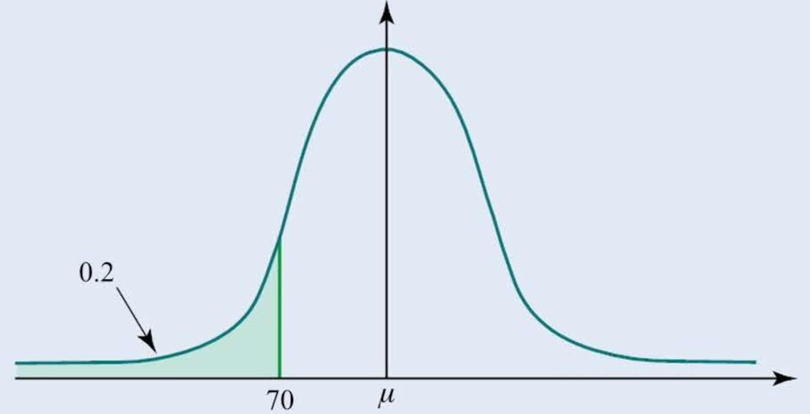

Figure 7.17

The second piece of information, that 20% of components took Sheila under 70 minutes, is illustrated in Figure 7.17.

 $$ z=\frac{70-~\mu}{\sigma} $$ 

(z has a negative value in this case, the point being to the left of the mean.)

 $$ \Phi(z)=0.2 $$ 

and so, by symmetry,

 $$ \Phi(-z)=1-0.2=0.8. $$ 

Using the table of the normal function gives

 $$ -z=0.842\quad\mathrm{o r}\quad z=-0.842. $$ 

This gives a second equation for $\mu$ and $\sigma$.

 $$ \frac{70-\mu}{\sigma}=-0.842\quad\Rightarrow\quad70-\mu=-0.842\sigma. $$

<!-- page 189 -->

You now solve equations ① and ② simultaneously.

 $$ 90-\mu=\quad1.2815\sigma $$ 

 $$ 70-\mu=-0.842\sigma $$ 

Subtract

 $$ 20\quad=\quad2.1235\sigma $$ 

 $$ \sigma=9.418=9.42\quad(3s.f.) $$ 

and

 $$ \mu=77.930=77.9\quad(3s.f.) $$ 

Answer: Sheila's mean time is 77.9 minutes with standard deviation 9.42 minutes.

## Exercise 7A

## M

1 The distribution of the heights of some plants is normal and has a mean of 40 cm and a standard deviation of 2 cm. Find the probability that a randomly selected plant is:

(i) under 42 cm

(ii) over 42 cm

(iii) over 40 cm

(iv) between 40 and 42 cm.

## M

2 The distribution of the masses of some baby parrots is normal and has a mean of 60 g and a standard deviation of 5 g. Find the probability that a randomly selected bird is:

(i) under 63g

(ii) over 63g

(iii) over 68 g

(iv) between 63 and 68g.

## M

3 The distribution of the mass of sweets in a bag is normal and has a mean of 100 g and a standard deviation of 2 g. Find the probability that a randomly selected bag is:

(i) under 98g

(ii) over 98g

(iii) under 102g

(iv) between 98 and 102g.

## M

4 The distribution of the heights of 18-year-old girls may be modelled by the normal distribution with mean 162.5 cm and standard deviation 6 cm. Find the probability that the height of a randomly selected 18-year-old girl is:

(i) under 168.5 cm

(ii) over 174.5 cm

(iii) between 168.5 and 174.5 cm.

<!-- page 190 -->

5 A pet shop has a tank of goldfish for sale. All the fish in the tank were hatched at the same time and their weights may be taken to be normally distributed with mean 100g and standard deviation 10g. Melanie is buying a goldfish and is invited to catch the one she wants in a small net. In fact the fish are much too quick for her to be able to catch any particular fish, and the one which she eventually nets is selected at random. Find the probability that its weight is:

(i) over 115g

(ii) under 105g

## M

(iii) between 105 and 115g.

6 When he makes instant coffee, Tony puts a spoonful of powder into a mug. The weight of coffee in grams on the spoon may be modelled by the normal distribution with mean 5g and standard deviation 1g. If he uses more than 6.5g Julia complains that it is too strong and if he uses less than 4g she tells him it is too weak. Find the probability that he makes the coffee:

## CP

(i) too strong

(ii) too weak

(iii) alright.

7 A biologist finds a nesting colony of a previously unknown sea bird on a remote island. She is able to take measurements on 100 of the eggs before replacing them in their nests. She records their weights, wg, in this frequency table.

<table border=1 style='margin: auto; word-wrap: break-word;'><tr><td style='text-align: center; word-wrap: break-word;'>Weight, w</td><td style='text-align: center; word-wrap: break-word;'>25 &lt; w ≤ 27</td><td style='text-align: center; word-wrap: break-word;'>27 &lt; w ≤ 29</td><td style='text-align: center; word-wrap: break-word;'>29 &lt; w ≤ 31</td><td style='text-align: center; word-wrap: break-word;'>31 &lt; w ≤ 33</td><td style='text-align: center; word-wrap: break-word;'>33 &lt; w ≤ 35</td><td style='text-align: center; word-wrap: break-word;'>35 &lt; w ≤ 37</td></tr><tr><td style='text-align: center; word-wrap: break-word;'>Frequency</td><td style='text-align: center; word-wrap: break-word;'>2</td><td style='text-align: center; word-wrap: break-word;'>13</td><td style='text-align: center; word-wrap: break-word;'>35</td><td style='text-align: center; word-wrap: break-word;'>33</td><td style='text-align: center; word-wrap: break-word;'>17</td><td style='text-align: center; word-wrap: break-word;'>0</td></tr></table>

## PS

(i) Find the mean and standard deviation of these data.

(ii) Assuming the weights of the eggs for this type of bird are normally distributed and that their mean and standard deviation are the same as those of this sample, find how many eggs you would expect to be in each of these categories.

(iii) Do you think the assumption that the weights of the eggs are normally distributed is reasonable?

8 A machine is set to produce nails of length 10 cm, with standard deviation 0.05 cm. The lengths of the nails are normally distributed.

(i) Find the percentage of nails produced between 9.95 cm and 10.08 cm in length.

The machine's setting is moved by a careless apprentice with the consequence that 16% of the nails are under 5.2 cm in length and 20% are over 5.3 cm.

(ii) Find the new mean and standard deviation.

<!-- page 191 -->

9 The random variable $X$ has the distribution $N(\mu, \sigma^{2})$. It is given that $P(X < 54.1) = 0.5$ and $P(X > 50.9) = 0.8665$. Find the values of $\mu$ and $\sigma$. Cambridge International AS & A Level Mathematics 9709 Paper 61 O2 November 2015

10 The petrol consumption of a certain type of car has a normal distribution with mean 24 kilometres per litre and standard deviation 4.7 kilometres per litre. Find the probability that the petrol consumption of a randomly chosen car of this type is between 21.6 kilometres per litre and 28.7 kilometres per litre.

Cambridge International AS & A Level Mathematics

9709 Paper 61 Q1 June 2014

11 Lengths of a certain type of white radish are normally distributed with mean  $ \mu $cm and standard deviation  $ \sigma $cm. 4% of these radishes are longer than 12 cm and 32% are longer than 9 cm. Find  $ \mu $ and  $ \sigma $.

Cambridge International AS & A Level Mathematics

9709 Paper 61 Q2 June 2014

12 A farmer finds that the weights of sheep on his farm have a normal distribution with mean 66.4kg and standard deviation 5.6kg.

(i) 250 sheep are chosen at random. Estimate the number of sheep which have a weight of between 70kg and 72.5kg.

(ii) The proportion of sheep weighing less than 59.2kg is equal to the proportion weighing more than  $ \gamma kg $. Find the value of  $ \gamma $.

Another farmer finds that the weights of sheep on his farm have a normal distribution with mean  $ \mu $kg and standard deviation 4.92kg. 25% of these sheep weigh more than 67.5kg.

(iii) Find the value of $\mu$.

Cambridge International AS & A Level Mathematics

9709 Paper 61 Q6 November 2014

13 It is given that  $ X \sim \mathrm{N}(30, 49) $,  $ Y \sim \mathrm{N}(30, 16) $ and  $ Z \sim \mathrm{N}(50, 16) $. On a single diagram, with the horizontal axis going from 0 to 70, sketch three curves to represent the distributions of X, Y and Z.

Cambridge International AS & A Level Mathematics

9709 Paper 61 Q1 November 2013

14 Lengths of a certain type of carrot have a normal distribution with mean 14.2 cm and standard deviation 3.6 cm.

(i) 8% of carrots are shorter than ccm. Find the value of c.

(ii) Rebekah picks 7 carrots at random. Find the probability that at least 2 of them have lengths between 15 cm and 16 cm.

Cambridge International AS & A Level Mathematics

9709 Paper 61 Q5 November 2013

<!-- page 192 -->

15 Tyre pressures on a certain type of car independently follow a normal distribution with mean 1.9 bars and standard deviation 0.15 bars.

(i) Find the probability that all four tyres on a car of this type have pressures between 1.82 bars and 1.92 bars.

(ii) Safety regulations state that the pressures must be between 1.9 – b bars and 1.9 + b bars. It is known that 80% of tyres are within these safety limits. Find the safety limits.

Cambridge International AS & A Level Mathematics

9709 Paper 6 Q6 June 2005

16 The lengths of fish of a certain type have a normal distribution with mean 38 cm. It is found that 5% of the fish are longer than 50 cm.

(i) Find the standard deviation.

(ii) When fish are chosen for sale, those shorter than 30 cm are rejected. Find the proportion of fish rejected.

(iii) 9 fish are chosen at random. Find the probability that at least one of them is longer than 50 cm.

Cambridge International AS & A Level Mathematics

9709 Paper 6 Q3 June 2006

17 (a) The random variable X is normally distributed. The mean is twice the standard deviation. It is given that P(X > 5.2) = 0.9. Find the standard deviation.

(b) A normal distribution has mean $\mu$ and standard deviation $\sigma$. If 800 observations are taken from this distribution, how many would you expect to be between $\mu - \sigma$ and $\mu + \sigma$?

Cambridge International AS & A Level Mathematics

9709 Paper 6 Q3 June 2007

18 In a certain country the time taken for a common infection to clear up is normally distributed with mean  $ \mu $ days and standard deviation 2.6 days. 25% of these infections clear up in less than 7 days.

(i) Find the value of  $ \mu $.

In another country the standard deviation of the time taken for the infection to clear up is the same as in part (i) but the mean is 6.5 days. The time taken is normally distributed.

(ii) Find the probability that, in a randomly chosen case from this country, the infection takes longer than 6.2 days to clear up.

Cambridge International AS & A Level Mathematics

9709 Paper 6 Q4 June 2008

<!-- page 193 -->

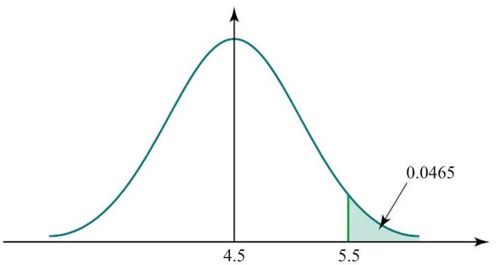

The random variable X has a normal distribution with mean 4.5. It is given that P(X > 5.5) = 0.0465 (see diagram).

(i) Find the standard deviation of X.

(ii) Find the probability that a random observation of X lies between 3.8 and 4.8.

Cambridge International AS & A Level Mathematics

9709 Paper 6 Q4 November 2007

20 (i) The daily minimum temperature in degrees Celsius (°C) in January in Ottawa is a random variable with distribution N(-15.1, 62.0). Find the probability that a randomly chosen day in January in Ottawa has a minimum temperature above 0°C.

(ii) In another city the daily minimum temperature in  $ {}^{\circ} $C in January is a random variable with distribution  $ N(\mu, 40.0) $. In this city the probability that a randomly chosen day in January has a minimum temperature above  $ 0 ${}^{\circ} $C is 0.8888. Find the value of  $ \mu $.

Cambridge International AS & A Level Mathematics

9709 Paper 6 Q3 November 2008

21 The times for a certain car journey have a normal distribution with mean 100 minutes and standard deviation 7 minutes. Journey times are classified as follows:

‘short’ (the shortest 33% of times)

'long' (the longest 33% of times)

'standard' (the remaining 34% of times).

(i) Find the probability that a randomly chosen car journey takes between 85 and 100 minutes.

(ii) Find the least and greatest times for 'standard' journeys.

Cambridge International AS & A Level Mathematics

9709 Paper 61 Q3 November 2009

<!-- page 194 -->

### 7.3 Modelling discrete situations

Although the normal distribution applies strictly to a continuous variable, it is also common to use it in situations where the variable is discrete providing that:

▶ the distribution is approximately normal; this requires that the steps in its possible values are small compared with its standard deviation

▶ continuity corrections are applied where appropriate.

The meaning of the term 'continuity correction' is explained in the following example.

Example 7.3

The result of an Intelligence Quotient (IQ) test is an integer score, X. Tests are designed so that X has a mean value of 100 with standard deviation 15. A large number of people have their IQs tested. What proportion of them would you expect to have IQs measuring between 106 and 110 (inclusive)?

## Solution

Although the random variable X is an integer and hence discrete, the steps of 1 in its possible values are small compared with the standard deviation of 15. So it is reasonable to treat it as if it is continuous.

If you assume that an IQ test is measuring innate, natural intelligence (rather than the results of learning), then it is reasonable to assume a normal distribution.

If you draw the probability distribution function for the discrete variable X it looks like Figure 7.18. The area you require is the total of the five bars representing 106, 107, 108, 109 and 110.

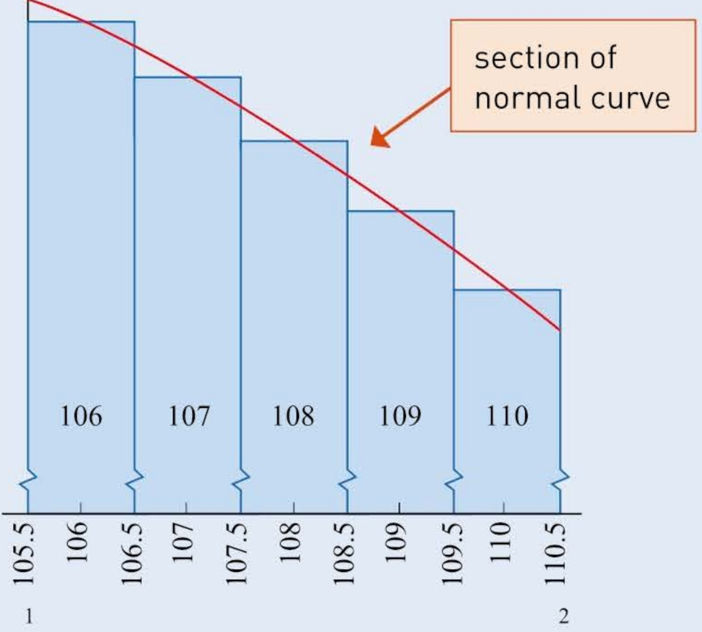

Figure 7.18

The equivalent section of the normal curve would run not from 106 to 110 but from 105.5 to 110.5, as you can see in Figure 7.18. When you change from the discrete scale to the continuous scale, the numbers 106, 107, etc. no longer represent the whole intervals, just their centre points.

<!-- page 195 -->

So the area you require under the normal curve is given by \Phi(z_{2}) - \Phi(z_{1})
where z_{1}=\frac{105.5-100}{15} and z_{2}=\frac{110.5-100}{15}.
This is
 $ \Phi(0.7000)-\Phi(0.3667)=0.7580-0.6431=0.1149 $
Answer: The proportion of IQs between 106 and 110 (inclusive) should be approximately 11%.

In this calculation, both end values needed to be adjusted to allow for the fact that a continuous distribution was being used to approximate a discrete one. These adjustments, $106 \rightarrow 105.5$ and $110 \rightarrow 110.5$, are called continuity corrections. Whenever a discrete distribution is approximated by a continuous one a continuity correction may need to be used.

You must always think carefully when applying a continuity correction. Should the corrections be added or subtracted? In this case 106 and 110 are inside the required area and so any value (like 105.7 or 110.4) which would round to them must be included. It is often helpful to draw a sketch to illustrate the region you want, like the one in Figure 7.18.

If the region of interest is given in terms of inequalities, you should look carefully to see whether they are inclusive ( $ \leq $ or  $ \geq $) or exclusive (< or >). For example  $ 20 \leq X \leq 30 $ becomes  $ 19.5 \leq X < 30.5 $ whereas  $ 20 < X < 30 $ becomes  $ 20.5 \leq X < 29.5 $.

Two particularly common situations are when the normal distribution is used to approximate the binomial and the Poisson distributions. (You will learn about the Poisson distribution if you study Probability & Statistics 2.)

### 7.4 Using the normal distribution as an approximation for the binomial distribution

You may use the normal distribution as an approximation for the binomial, B(n, p) (where n is the number of trials each having probability p of success) when:

▶ n is large

▶ p is not too close to 0 or 1.

A rough way of judging whether $n$ is large enough is to require that both $np > 5$ and $nq > 5$, where $q = 1 - p$.

<!-- page 196 -->

These conditions ensure that the distribution is reasonably symmetrical and not skewed away from either end, see Figure 7.19.

The parameters for the normal distribution are then

Mean:  $ \mu = np $ Variance:  $ \sigma^{2} = npq = np(1 - p) $

so that it can be denoted by  $ \mathrm{N}(np, npq) $.

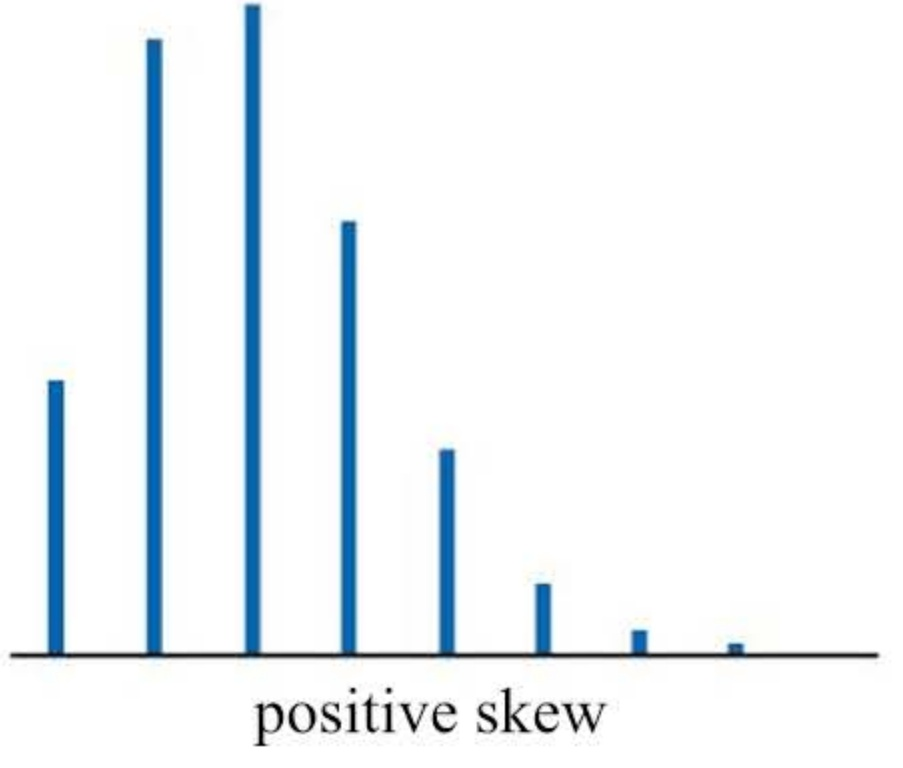

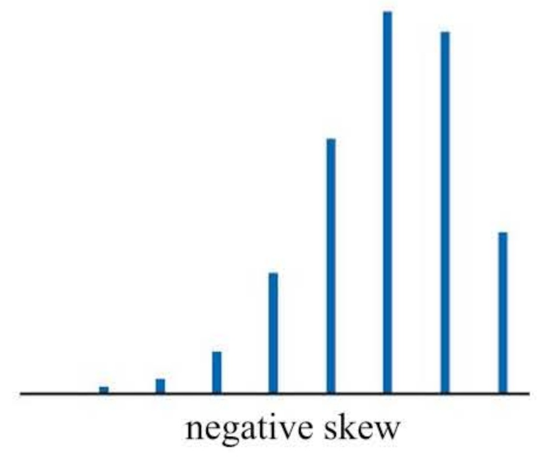

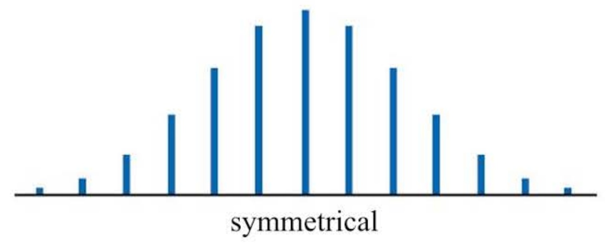

Figure 7.19

Example 7.4

This is a true story. During voting at an election, an exit poll of 1700 voters indicated that 50% of people had voted for a particular candidate. When the votes were counted it was found that he had in fact received 57% support.

850 of the 1700 people interviewed said they had voted for the candidate but 57% of 1700 is 969, a much higher number. What went wrong? Is it possible to be so far out just by being unlucky and asking the wrong people?

## Solution

The situation of selecting a sample of 1700 people and asking them if they voted for one candidate or not is one that is modelled by the binomial distribution, in this case B(1700, 0.57).

In theory you could multiply out  $ (0.43 + 0.57t)^{1700} $ and use that to find the probabilities of getting 0, 1, 2, ..., 850 supporters of this candidate in your sample of 1700. In practice such a method would be impractical because of the work involved.

What you can do is to use a normal approximation. The required conditions are fulfilled: at 1700, n is certainly not small; p = 0.57 is near neither 0 nor 1.

The parameters for the normal approximation are given by

 $$ \mu=np=1700\times0.57=969 $$ 

 $$ \sigma=\sqrt{npq}=\sqrt{1700\times0.57\times0.43}=20.4 $$

<!-- page 197 -->

You will see that the standard deviation, 20.4, is large compared with the steps of 1 in the number of supporters of this candidate.

The probability of getting no more than 850 supporters of this candidate, P(X  $ \leq $ 850), is given by  $ \Phi(z) $, where

 $$ z=\frac{850.5-969}{20.4}=-5.8 $$ 

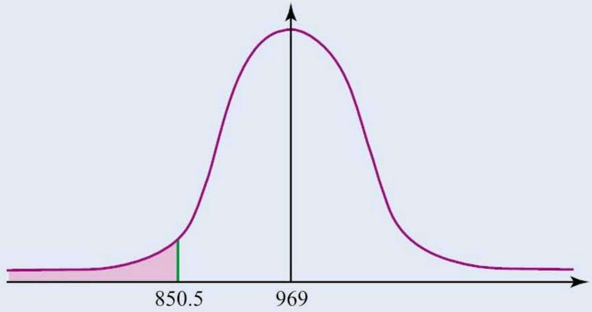

Figure 7.20

(Notice the continuity correction making 850 into 850.5.)

This is beyond the range of most tables and corresponds to a probability of about 0.000 01. The probability of a result as extreme as this is thus 0.000 02 (allowing for an equivalent result in the tail above the mean). It is clearly so unlikely that this was a result of random sampling that another explanation must be found.

What do you think went wrong with the exit poll? Remember this really did happen.

## Exercise 7B

25% of Flapper Fish have red spots, the rest have blue spots. A fisherman nets 10 Flapper Fish. What are the probabilities that:

(i) exactly 8 have blue spots

(ii) at least 8 have blue spots?

A large number of samples, each of 100 Flapper Fish, are taken.

(iii) What is the mean and the standard deviation of the number of red-spotted fish per sample?

(iv) What is the probability of a sample of 100 Flapper Fish containing over 30 with red spots?

<!-- page 198 -->

2 Assume that, for a randomly chosen person, their next birthday is equally likely to occur on any day of the week, independently of any other person's birthday. Find the probability that, out of 350 randomly chosen people, at least 47 will have their next birthday on a Monday.

Cambridge International AS & A Level Mathematics

9709 Paper 61 Q2 June 2013

3 The faces of a biased die are numbered 1, 2, 3, 4, 5 and 6. The probabilities of throwing odd numbers are all the same. The probabilities of throwing even numbers are all the same. The probability of throwing an odd number is twice the probability of throwing an even number.

(i) Find the probability of throwing a 3.

(ii) The die is thrown three times. Find the probability of throwing two 5s and one 4.

(iii) The die is thrown 100 times. Use an approximation to find the probability that an even number is thrown at most 37 times.

Cambridge International AS & A Level Mathematics

9709 Paper 61 Q7 November 2015

4 It is known that, on average, 2 people in 5 in a certain country are overweight. A random sample of 400 people is chosen. Using a suitable approximation, find the probability that fewer than 165 people in the sample are overweight.

Cambridge International AS & A Level Mathematics

9709 Paper 6 Q1 June 2005

5 A survey of adults in a certain large town found that 76% of people wore a watch on their left wrist, 15% wore a watch on their right wrist and 9% did not wear a watch.

(i) A random sample of 14 adults was taken. Find the probability that more than 2 adults did not wear a watch.

(ii) A random sample of 200 adults was taken. Using a suitable approximation, find the probability that more than 155 wore a watch on their left wrist.

Cambridge International AS & A Level Mathematics

9709 Paper 6 Q7 June 2006

6 On a certain road 20% of the vehicles are trucks, 16% are buses and the remainder are cars.

(i) A random sample of 11 vehicles is taken. Find the probability that fewer than 3 are buses.

(ii) A random sample of 125 vehicles is now taken. Using a suitable approximation, find the probability that more than 73 are cars.

Cambridge International AS & A Level Mathematics

9709 Paper 6 Q3 June 2009

<!-- page 199 -->

7 On any occasion when a particular gymnast performs a certain routine, the probability that she will perform it correctly is 0.65, independently of all other occasions.

(i) Find the probability that she will perform the routine correctly on exactly 5 occasions out of 7.

(ii) On one day she performs the routine 50 times. Use a suitable approximation to estimate the probability that she will perform the routine correctly on fewer than 29 occasions.

(iii) On another day she performs the routine n times. Find the smallest value of n for which the expected number of correct performances is at least 8.

Cambridge International AS & A Level Mathematics

9709 Paper 6 Q6 November 2007

8 In the holidays Martin spends 25% of the day playing computer games. Martin's friend phones him once a day at a randomly chosen time.

(i) Find the probability that, in one holiday period of 8 days, there are exactly 2 days on which Martin is playing computer games when his friend phones.

(ii) Another holiday period lasts for 12 days. State with a reason whether it is appropriate to use a normal approximation to find the probability that there are fewer than 7 days on which Martin is playing computer games when his friend phones.

(iii) Find the probability that there are at least 13 days of a 40-day holiday period on which Martin is playing computer games when his friend phones.

Cambridge International AS & A Level Mathematics

9709, Paper 61 Q5 June 2010

## KEY POINTS

1 The normal distribution with mean $\mu$ and standard deviation $\sigma$ is denoted by $N(\mu, \sigma^{2})$.

2 This may be given in standardised form by using the transformation

 $$ z=\frac{x-\mu}{\sigma} $$ 

3 In the standardised form, N(0, 1), the mean is 0, and the standard deviation and variance are both 1.

4 The standard normal curve is given by

 $$ \Phi(z)\;=\;{\frac{1}{\sqrt{2\pi}}}\mathrm{e}^{-{\frac{1}{2}}z^{2}} $$

<!-- page 200 -->

5 The area to the left of the value $z$ in the diagram below, representing the probability of a value less than $z$, is denoted by $\Phi(z)$ and is read from tables.

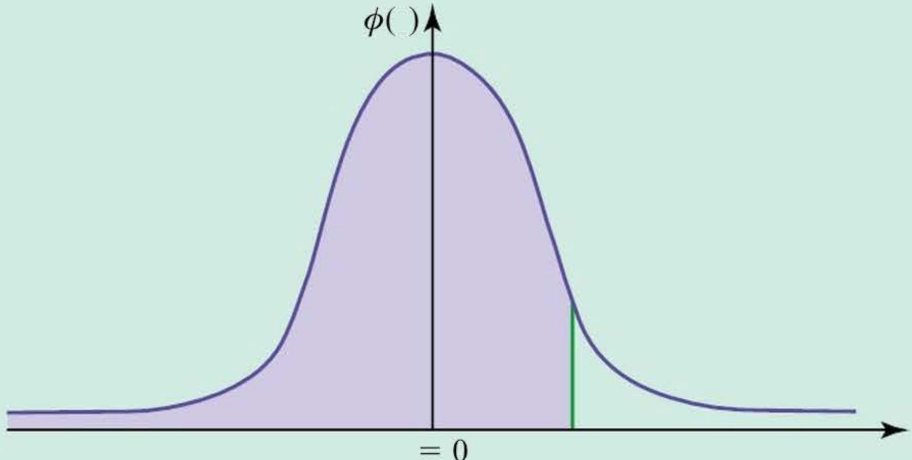

6 The normal distribution may be used to approximate suitable discrete distributions but continuity corrections are then required.

7 The binomial distribution B(n, p) may be approximated by N(np, npq), provided n is large and p is not close to 0 or 1, so that np > 5 and nq > 5.

## LEARNING OUTCOMES

Now that you have finished this chapter, you should be able to

use the normal distribution as a model

know the shape of a normal curve and the location of its line of symmetry

be able to standardise a normal variable

find probabilities from a normal distribution

understand how and why a continuity correction is applied when the normal distribution is used as an approximation for the binomial distribution.

